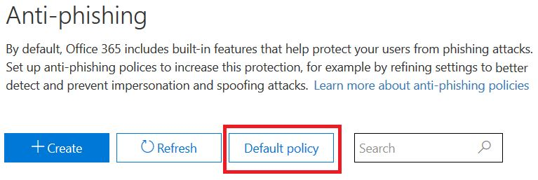

# <a name="anti-spoofing-protection-in-office-365"></a>Office 365 中的反欺骗保护

本文介绍 Office 365 如何缓解使用伪造发件人域（即欺骗性域）的网络钓鱼攻击。 通过分析邮件并阻止无法使用标准电子邮件身份验证方法或其他发件人信誉技术进行身份验证的邮件，它可以实现这一目标。 实施此更改是为了减少 Office 365 中的组织所面临的网络钓鱼攻击的数量。
  
本文还介绍了为何要进行此更改、客户如何为此更改做好准备、如何查看将受影响的邮件、如何报告邮件、如何减少误报以及 Microsoft 的发件人应如何为此更改做好准备。
  
Microsoft 的反欺骗技术最初部署到拥有 Office 365 企业版 E5 订阅或已为其订阅购买了 Office 365 高级威胁防护 (ATP) 加载项的组织。 截至 2018 年 10 月，我们已将保护范围扩展到拥有 Exchange Online Protection (EOP) 的组织。 此外，Outlook.com 用户也可能会受到影响，具体取决于筛选器相互学习的方式。
  
## <a name="how-spoofing-is-used-in-phishing-attacks"></a>如何在网络钓鱼攻击中使用欺骗

在为用户提供保护方面，Microsoft 非常重视网络钓鱼的威胁。 垃圾邮件制作者和网络钓鱼者通常使用的技术之一就是欺骗，即伪造发件人，并且邮件似乎来自实际来源以外的某人或某个位置。 此技术通常在专门获取用户凭据的网络钓鱼活动中使用。 Microsoft 反欺骗技术专用于检查在 Outlook 等电子邮件客户端中显示的伪造的“发件人: 标头”。 当 Microsoft 高度确信“发件人: 标头”存在欺骗时，它会将该邮件标识为欺骗邮件。
  
欺骗邮件会对现实生活中的用户造成两个负面影响：
  
### <a name="1-spoofed-messages-deceive-users"></a>1. 欺骗性邮件会误导用户
  
首先，欺骗性邮件可能会欺骗用户点击链接并放弃使用其凭据、下载恶意软件或回复具有敏感内容的邮件（后者称为商务电子邮件入侵）。 例如，以下是一封具有伪造发件人 msoutlook94@service.outlook.com 的网络钓鱼邮件：
  

  
上述邮件实际上并非来自 service.outlook.com，而是被网络钓鱼者伪造成这样。 它试图欺骗用户点击邮件中的链接。
  
下一个示例是欺骗性的 contoso.com：
  

  
该邮件看似合法，但实际上是一封欺骗性邮件。 此网络钓鱼邮件是一种商务电子邮件入侵，它是网络钓鱼的子类别。

### <a name="2-users-confuse-real-messages-for-fake-ones"></a>2. 用户将真实邮件与虚假邮件弄混淆
  
其次，欺骗性邮件为了解网络钓鱼邮件的用户带来了不确定性，使其无法区分真实邮件和欺骗性邮件。 例如，以下是从 Microsoft 安全帐户电子邮件地址重置实际密码的示例：
  

  
上述邮件确实来自 Microsoft，但与此同时，用户习惯于获取可能诱使其点击链接并放弃使用其凭据、下载恶意软件或回复包含敏感内容的邮件的网络钓鱼邮件。 由于很难区分真实密码重置和虚假密码重置，因此许多用户会忽略这些邮件，将其报告为垃圾邮件，或者不必要地将该邮件作为遗漏的网络钓鱼欺骗邮件报告给 Microsoft。

为了阻止欺骗，电子邮件筛选行业开发了 [SPF](https://docs.microsoft.com/office365/SecurityCompliance/set-up-spf-in-office-365-to-help-prevent-spoofing)、[DKIM](https://docs.microsoft.com/office365/SecurityCompliance/use-dkim-to-validate-outbound-email) 和 [DMARC](https://docs.microsoft.com/office365/SecurityCompliance/use-dmarc-to-validate-email) 等电子邮件身份验证协议。 DMARC 可防止欺骗活动检查邮件的发件人 - 用户在其电子邮件客户端中看到的发件人（在上面的示例中，它是 service.outlook.com、outlook.com 和 accountprotection.microsoft.com）- 使用已通过 SPF 或 DKIM 验证的域。 也就是说，用户看到的域已经过身份验证，因此不会受到欺骗。 有关更完整的讨论，请参阅本文后面的“*了解电子邮件身份验证为何并非总能阻止欺骗*”。
  
但问题在于电子邮件身份验证记录是可选的，而不是必需的。 因此，具有强大身份验证策略（如 microsoft.com 和 skype.com）的域可以防止欺骗，而发布较弱身份验证策略或根本没有策略的域则是欺骗活动攻击的目标。截至 2018 年 3 月，在财富 500 强企业中，只有 9% 的域发布了强大的电子邮件身份验证策略。 剩余 91％ 的域可能被网络钓鱼者冒充，除非电子邮件筛选器使用其他策略检测到这些欺骗活动，否则可能会将其传递给最终用户并误导他们：
  

  
未跻身财富 500 强的已发布强大电子邮件身份验证策略的中小型公司所占比例较小，而对于北美和西欧以外的域，发布强大策略的比例仍较小。
  
这是一个大问题，因为企业可能不知道电子邮件身份验证的工作方式，但网络钓鱼者确实了解这一点并且会加以利用。
  
有关设置 SPF、DKIM 和 DMARC 的信息，请参阅本文档后面的“*Office 365 客户*”部分。 
  
## <a name="stopping-spoofing-with-implicit-email-authentication"></a>使用隐式电子邮件身份验证阻止欺骗

由于网络钓鱼和鱼叉式网络钓鱼是一个大问题，并且强大的电子邮件身份验证策略的采用有限，Microsoft 将继续投资打造旨在为客户提供保护的功能。 为此，Microsoft 正在推进*隐式电子邮件身份验证* - 如果域未进行身份验证，Microsoft 会将其视为已发布电子邮件身份验证记录，并在未通过时对其进行相应的处理。 
  
为了实现这一目标，Microsoft 为常规电子邮件身份验证构建了大量扩展，包括发件人信誉、发件人/收件人历史记录、行为分析和其他高级技术。 除非包含其他表明其为合法邮件的信号，否则从未发布电子邮件身份验证的域发送的邮件将被标记为欺骗邮件。
  
通过这样做，最终用户可以确信发送给他们的电子邮件并非欺骗邮件，发件人可以确信没有人冒充他们的域，并且 Office 365 的客户可以提供更好的保护，例如模拟保护。
  
若要查看 Microsoft 的一般声明，请参阅[网络钓鱼第 2 部分 - Office 365 中的增强反欺骗功能](https://techcommunity.microsoft.com/t5/Security-Privacy-and-Compliance/Schooling-A-Sea-of-Phish-Part-2-Enhanced-Anti-spoofing/ba-p/176209)。
  
## <a name="identifying-that-a-message-is-classified-as-spoofed"></a>识别已分类为欺骗的邮件

### <a name="composite-authentication"></a>复合身份验证

虽然 SPF、DKIM 和 DMARC 本身都很有用，但如果邮件没有明确的身份验证记录，它们就无法传递充足的身份验证状态。 为此，Microsoft 开发了一种算法，可将多个信号组合成一个称为复合身份验证（或简称为“compauth”）的单一值。 Office 365 中的客户可以在邮件头的“*Authentication-Results*”标头中标记 compauth 值。 
  
```
Authentication-Results:
  compauth=<fail|pass|softpass|none> reason=<yyy>

```

|**CompAuth 结果**|**说明**|
|:-----|:-----|
|失败|邮件未通过显式身份验证（发送域已在 DNS 中显式发布记录）或隐式身份验证（发送域未在 DNS 中发布记录，而 Office 365 就像已发布记录一样插入结果）。|
|通过|邮件已通过显式身份验证（邮件通过 DMARC 或[最佳猜测通过 DMARC](https://blogs.msdn.microsoft.com/tzink/2015/05/06/what-is-dmarc-bestguesspass-in-office-365)）或具有高可信度的隐式身份验证（发送域未发布电子邮件身份验证记录，但 Office 365 具有强大的后端信号来指示邮件很有可能是合法邮件）。|
|softpass|消息以低到中等可信度通过隐式身份验证（发送域未发布电子邮件身份验证，但 Office 365 具有后端信号来指示邮件为合法邮件，但信号强度较弱）。|
|无|邮件未进行身份验证（或者它已进行身份验证但不一致），但由于发件人信誉或其他因素而未应用复合身份验证。|
   
|||
|:-----|:-----|
|**原因**|**说明**|
|0xx|邮件未通过复合身份验证。<br/>**000** 表示邮件未通过 DMARC 验证，并采取了拒绝或隔离操作。  <br/>**001** 表示邮件未通过隐式电子邮件身份验证。 这意味着发送域未发布电子邮件身份验证记录，或者如果已发布，则它们具有较弱的失败策略（SPF 软失败或中性，DMARC 策略为 p=无）。  <br/>**002** 表示组织为发件人/域对设置了明确禁止发送欺骗性电子邮件的策略，此设置由管理员手动设置。  <br/>**010** 表示邮件未通过 DMARC 验证，并采取了拒绝或隔离操作，而且发送域是组织的接受域之一（这是自我欺骗或组织内欺骗的一部分）之一。  <br/>**011** 表示邮件未通过隐式电子邮件身份验证，并采取了拒绝或隔离操作，而且发送域是组织的接受域之一（它是自我欺骗或组织内欺骗的一部分）之一。|
|所有其他代码（1xx、2xx、3xx、4xx、5xx）|对应于各种内部代码，指明邮件为何已通过隐式身份验证或者未进行身份验证且未执行任何操作。|
   
通过查看邮件的标头，管理员甚至是最终用户可以确定 Office 365 如何得出发件人可能带欺骗性质的结论。
  
### <a name="differentiating-between-different-types-of-spoofing"></a>区分不同类型的欺骗

Microsoft 区分两种不同类型的欺骗邮件：
  
 **组织内欺骗**
  
也称为自我欺骗，如果“发件人: 地址”中的域与收件人域相同或相一致（当收件人域是组织的[接受域](https://technet.microsoft.com/zh-CN/library/jj945194%28v=exchg.150%29.aspx)之一时），就会发生这种情况。或者，当“发件人: 地址”中的域是同一组织的一部分时，也会发生这种情况。
  
例如，以下邮件具有来自同一域 (contoso.com) 的发件人和收件人。 在电子邮件地址中插入空格以防止垃圾邮件程序在此页面上收集信息：
  
发件人：sender @ contoso.com
  
收件人：recipient @ contoso.com
  
以下邮件具有与组织域 (fabrikam.com) 相一致的发件人和收件人域：
  
发件人：sender @ foo.fabrikam.com
  
收件人：recipient @ bar.fabrikam.com
  
以下发件人和收件人域不同（microsoft.com 和bing.com），但它们属于同一组织（即两者都是组织的接受域的一部分）：
  
发件人：sender @ microsoft.com
  
收件人：recipient @ bing.com
  
未通过组织内欺骗验证的邮件在标头中包含以下值：
  
X-Forefront-Antispam-Report: ...CAT:SPM/HSPM/PHSH;...SFTY:9.11
  
其中 CAT 表示邮件的类别，通常标记为 SPM（垃圾邮件），但有时可能是 HSPM（高可信度垃圾邮件）或 PHISH（网络钓鱼），具体取决于邮件中出现的其他模式类型。
  
SFTY 表示邮件的安全级别，第一个数字 (9) 表示该邮件是网络钓鱼邮件，点 (11) 之后的第二组数字表示它是组织内欺骗。
  
组织内欺骗的复合身份验证没有特定的原因代码，将在 2018 年晚些时候进行标记（时间表尚未确定）。
  
 **跨域欺骗**
  
当“发件人: 地址”中的发送域是接收组织的外部域时，会发生这种情况。 由于跨域欺骗而导致未通过复合身份验证的邮件在标头中包含以下值：
  
Authentication-Results: … compauth=fail reason=000/001
  
X-Forefront-Antispam-Report: ...CAT:SPOOF;...SFTY:9.22
  
在这两种情况下，邮件中都会标记以下红色安全提示，或者根据收件人邮箱的语言提供自定义等效提示：
  

  
只有通过查看“发件人: 地址”并了解收件人电子邮件的内容，或者通过检查电子邮件标头，你才能区分组织内欺骗和跨域欺骗。
  
## <a name="how-customers-of-office-365-can-prepare-themselves-for-the-new-anti-spoofing-protection"></a>Office 365 的客户如何为新的反欺骗保护做好准备

### <a name="information-for-administrators"></a>为管理员提供的信息

作为 Office 365 中组织的管理员，你应该了解一些重要信息。
  
### <a name="understanding-why-email-authentication-is-not-always-enough-to-stop-spoofing"></a>了解电子邮件身份验证为何并非总能阻止欺骗

新的反欺骗保护依赖电子邮件身份验证（SPF、DKIM 和 DMARC），而不是将邮件标记为欺骗邮件。 一个常见示例是发送域从未发布过 SPF 记录。 如果没有 SPF 记录或者设置不正确，则发送的邮件将被标记为欺骗邮件，除非 Microsoft 通过后端智能指明该邮件是合法邮件。
  
例如，在部署反欺骗之前，邮件可能看起来如下：没有 SPF 记录，没有 DKIM 记录，也没有 DMARC 记录： 
  
```
Authentication-Results: spf=none (sender IP is 1.2.3.4)
  smtp.mailfrom=example.com; contoso.com; dkim=none
  (message not signed) header.d=none; contoso.com; dmarc=none
  action=none header.from=example.com;
From: sender @ example.com
To: receiver @ contoso.com
```
在部署反欺骗之后，如果你拥有 Office 365 企业版 E5、EOP 或 ATP，则会标记 compauth 值：
  
```
Authentication-Results: spf=none (sender IP is 1.2.3.4)
  smtp.mailfrom=example.com; contoso.com; dkim=none
  (message not signed) header.d=none; contoso.com; dmarc=none
  action=none header.from=example.com; compauth=fail reason=001
From: sender @ example.com
To: receiver @ contoso.com

```

如果 example.com 通过设置 SPF 记录而不是 DKIM 记录来修复此问题，则可通过复合身份验证，因为通过 SPF 验证的域与“发件人: 地址”中的域相一致： 
  
```
Authentication-Results: spf=pass (sender IP is 1.2.3.4)
  smtp.mailfrom=example.com; contoso.com; dkim=none
  (message not signed) header.d=none; contoso.com; dmarc=bestguesspass
  action=none header.from=example.com; compauth=pass reason=109
From: sender @ example.com
To: receiver @ contoso.com
```

或者，如果已设置 DKIM 记录而不是 SPF 记录，则也可通过复合身份验证，因为 DKIM 签名中的域与“发件人: 地址”中的域相一致： 
  
```
Authentication-Results: spf=none (sender IP is 1.2.3.4)
  smtp.mailfrom=example.com; contoso.com; dkim=pass
  (signature was verified) header.d=outbound.example.com;
  contoso.com; dmarc=bestguesspass action=none
  header.from=example.com; compauth=pass reason=109
From: sender @ example.com
To: receiver @ contoso.com
```

但是，网络钓鱼者还可以设置 SPF 和 DKIM，并使用自己的域对邮件进行签名，而在“发件人: 地址”中指定其他域。 SPF 和 DKIM 都不要求域与“发件人: 地址”中的域保持一致，因此除非 example.com 发布了 DMARC 记录，否则不会使用 DMARC 将其标记为欺骗邮件： 
  
```
Authentication-Results: spf=pass (sender IP is 5.6.7.8)
  smtp.mailfrom=maliciousDomain.com; contoso.com; dkim=pass
  (signature was verified) header.d=maliciousDomain.com;
  contoso.com; dmarc=none action=none header.from=example.com;
From: sender @ example.com
To: receiver @ contoso.com
```

在电子邮件客户端（Outlook、Outlook 网页版或任何其他电子邮件客户端）中，仅显示“发件人:”域，而不显示 SPF 或 DKIM 中的域，这可能误导用户认为该邮件来自 example.com，但它实际上来自 maliciousDomain.com。
  

  
因此，Office 365 要求“发件人: 地址”中的域与 SPF 或 DKIM 签名中的域保持一致，如果不一致，则需要包含一些其他内部信号，以指明该邮件是合法邮件。 否则，该邮件将为 compauth 失败状态。 
  
```
Authentication-Results: spf=none (sender IP is 5.6.7.8)
  smtp.mailfrom=maliciousDomain.com; contoso.com; dkim=pass
  (signature was verified) header.d=maliciousDomain.com;
  contoso.com; dmarc=none action=none header.from=contoso.com;
  compauth=fail reason=001
From: sender@contoso.com
To: someone@example.com
```

因此，Office 365 反欺骗可以抵御未经过身份验证的域，以及已设置身份验证但与“发件人: 地址”中的域（用户看到并认为该域是邮件的发件人）不一致的域。 这适用于组织外部的域以及组织内的域。
  
因此，如果你收到的邮件未通过复合身份验证并且被标记为欺骗邮件，即使该邮件通过了 SPF 和 DKIM 验证，也是因为通过 SPF 和 DKIM 验证的域与“发件人: 地址”中的域不一致。
  
### <a name="understanding-changes-in-how-spoofed-emails-are-treated"></a>了解欺骗性电子邮件处理方式的更改

目前，对于 Office 365 中的所有组织 - ATP 和非 ATP - 未通过 DMARC 验证（使用拒绝或隔离策略）的邮件被标记为垃圾邮件并且通常采取高可信度垃圾邮件操作，或者有时采取常规垃圾邮件操作（具体取决于其他垃圾邮件规则是否先将其识别为垃圾邮件）。 组织内欺骗检测采取常规垃圾邮件操作。 不需要启用此行为，也不能禁用此行为。
  
但是，对于跨域欺骗性邮件，在此更改之前，将对它们进行常规垃圾邮件、网络钓鱼和恶意软件检查，如果筛选器的其他部分将其标识为可疑邮件，则会将它们分别标记为垃圾邮件、网络钓鱼或恶意软件。 通过新的跨域欺骗保护，默认情况下，任何无法通过身份验证的邮件都将采取“反网络钓鱼”\>“反欺骗策略”中定义的操作。 如果未定义任何操作，则系统会将其移到用户垃圾邮件文件夹。 在某些情况下，会在更多可疑邮件中添加红色安全提示。
  
这可能会导致以前标记为垃圾邮件的某些邮件仍被标记为垃圾邮件，但现在还会有红色安全提示；在其他情况下，之前标记为非垃圾邮件的邮件将开始标记为垃圾邮件 (CAT:SPOOF)，并添加红色安全提示。 在其他情况下，将所有垃圾邮件和网络钓鱼移到隔离区的客户现在会看到它们已转移到垃圾邮件文件夹（可以更改此行为，请参阅[更改反欺骗设置](#changing-your-anti-spoofing-settings)）。
  
邮件可能具有多种不同的欺骗方式（请参阅[区分不同类型的欺骗](#differentiating-between-different-types-of-spoofing)），但是截至 2018 年 3 月，Office 365 处理这些邮件的方式尚未统一。 下表是快速摘要，其中跨域欺骗保护是一种新行为： 
  
|**欺骗类型**|**类别**|**是否添加安全提示？**|**适用于**|
|:-----|:-----|:-----|:-----|
|DMARC 失败（隔离或拒绝）  <br/> |HSPM（默认），也可能是 SPM 或 PHSH  <br/> |否（尚未添加）  <br/> |所有 Office 365 客户、Outlook.com  <br/> |
|自我欺骗  <br/> |SPM  <br/> |是  <br/> |所有 Office 365 组织、Outlook.com  <br/> |
|跨域  <br/> |SPOOF  <br/> |是  <br/> |Office 365 高级威胁防护和 E5 客户  <br/> |

### <a name="changing-your-anti-spoofing-settings"></a>更改反欺骗设置

若要创建或更新（跨域）反欺骗设置，请导航到安全 &amp;合规中心的“威胁管理”\>“策略”选项卡下的“反网络钓鱼”\>“反欺骗设置”。 如果你从未创建任何反网络钓鱼设置，则需要创建一个：
  

  
如果你已创建一个，则可以选择它以进行修改：
  

  
选择你刚刚创建的策略，然后按照[详细了解反欺骗智能保护](learn-about-spoof-intelligence.md)中所述的步骤执行操作。
  

  

  
使用 PowerShell 创建新策略： 
  
```powershell
$org = Get-OrganizationConfig
$name = "My first anti-phishing policy for " + $org.Name
# Note: The name should not exclude 64 characters, including spaces.
# If it does, you will need to pick a smaller name.
# Next, create a new anti-phishing policy with the default values
New-AntiphishPolicy -Name $Name
# Select the domains to scope it to
# Multiple domains are specified in a comma-separated list
$domains = "domain1.com, domain2.com, domain3.com"
# Next, create the anti-phishing rule, scope it to the anti-phishing rule
New-AntiphishRule -Name $name -AntiphishPolicy $name -RecipientDomainIs $domains
```

然后，你可以按照文档[设置反网络钓鱼策略](https://docs.microsoft.com/powershell/module/exchange/advanced-threat-protection/Set-AntiPhishPolicy?view=exchange-ps)部分中的说明，使用 PowerShell 修改反网络钓鱼策略参数。 你可以将 $name 指定为参数：
  
```powershell
Set-AntiphishPolicy -Identity $name <fill in rest of parameters>
```

在 2018 年晚些时候，你不必创建一个默认策略，系统将为组织内的所有收件人创建一个默认策略，因此你不必手动指定它（在最终实施之前，以下屏幕截图可能会发生变更）。
  

  
与你创建的策略不同，你无法删除默认策略、修改其优先级或选择该策略适用的用户、域或组。
  

  
使用 PowerShell 设置默认保护：
  
```powershell
$defaultAntiphishPolicy = Get-AntiphishPolicy | ? {$_.IsDefault -eq $true}
Set-AntiphishPolicy -Identity $defaultAntiphishPolicy.Name -EnableAntispoofEnforcement <$true|$false>
```

仅当 Office 365 前面有另一台邮件服务器或服务器时，才应该禁用反欺骗保护（有关详细信息，请参阅“禁用反欺骗的合法情景”）。
  
```powershell
$defaultAntiphishPolicy = Get-AntiphishiPolicy | ? {$_.IsDefault $true}
Set-AntiphishPolicy -Identity $defaultAntiphishPolicy.Name -EnableAntispoofEnforcement $false 

```
> [!IMPORTANT]
> 如果电子邮件路径中的第一个跃点是 Office 365，并且你收到太多标记为欺骗邮件的合法电子邮件，则应该先设置允许其将欺骗性电子邮件发送到你所在域的发件人（请参阅“*管理发送未经身份验证的电子邮件的合法发件人*”一节）。 如果你仍收到太多误报（即标记为欺骗邮件的合法邮件），我们建议你不要完全禁用反欺骗保护。 相反，我们建议选择“基本”而不是“高级”保护。 解决误报问题比将贵组织暴露在欺骗性电子邮件中更好，后者可能最终导致长期成本显著增加。

### <a name="managing-legitimate-senders-who-are-sending-unauthenticated-email"></a>管理发送未经身份验证的电子邮件的合法发件人

Office 365 会跟踪向贵组织发送未经身份验证的电子邮件的人员。 如果服务部门认为该发件人不合法，则会将其标记为 *compauth* 失败。 这将归类为“SPOOF”，但具体取决于为邮件应用的反欺骗策略。
  
但是，作为管理员，你可以指定允许哪些发件人发送欺骗性电子邮件，这会覆盖 Office 365 的决策。
  
**方法 1 - 如果你的组织拥有该域，请设置电子邮件身份验证**
  
如果你拥有多个租户或与多个租户进行交互，则此方法可用于解决组织内欺骗和跨域欺骗。 它还有助于解决你发送给 Office 365 中的其他客户以及在其他提供程序中托管的第三方的跨域欺骗。
  
有关详细信息，请参阅 [Office 365 客户](#customers-of-office-365)。

**方法 2 - 使用反欺骗智能保护配置允许发送未经身份验证的电子邮件的人员**
  
你也可以使用[反欺骗智能保护](https://support.office.com/article/Learn-more-about-spoof-intelligence-978c3173-3578-4286-aaf4-8a10951978bf)允许发件人将未经身份验证的邮件传送到你的组织。 
  
对于外部域，冒充的用户位于发件人地址中的域，而发送基础结构是发送 IP 地址（分为 /24 CIDR 范围）或 PTR 记录的组织域（在以下屏幕截图中，发送 IP 可能是 131.107.18.4，其 PTR 记录是 outbound.mail.protection.outlook.com，这将显示为发送基础结构的 outlook.com）。
  
若要允许此发件人发送未经身份验证的电子邮件，请将“**否**”更改为“**是**”。
  

  
你还可以使用 PowerShell 允许特定发件人将邮件发送到你所在的域：
  
```powershell
$file = "C:\My Documents\Summary Spoofed Internal Domains and Senders.csv"
```

```powershell
Get-PhishFilterPolicy -Detailed -SpoofAllowBlockList -SpoofType External | Export-CSV $file
```


  
在上一张图片中，添加了额外的换行符以使此屏幕截图适合查看。 通常情况下，将在单行上显示所有值。
  
编辑文件并查找与 outlook.com 和 bing.com 对应的行，并将 AllowedToSpoof 条目从“否”更改为“是”：
  

  
保存该文件，然后运行：
  
```powershell
$UpdateSpoofedSenders = Get-Content -Raw "C:\My Documents\Spoofed Senders.csv"
Set-PhishFilterPolicy -Identity Default -SpoofAllowBlockList $UpdateSpoofedSenders
```

现在，将允许 bing.com 发送来自 \*.outlook.com 的未经身份验证的电子邮件。

**方法 3 - 为发件人/收件人对创建允许条目**
  
你还可以选择绕过特定发件人的所有垃圾邮件筛选。 有关详细信息，请参阅[如何在 Office 365 中将发件人安全地添加到允许列表](https://blogs.msdn.microsoft.com/tzink/2017/11/29/how-to-securely-add-a-sender-to-an-allow-list-in-office-365/)。
  
如果使用此方法，它将跳过垃圾邮件和一些网络钓鱼筛选，但不会跳过恶意软件筛选。
  
**方法 4 - 与发件人联系并请求他们设置电子邮件身份验证**
  
由于存在垃圾邮件和网络钓鱼问题，Microsoft 建议所有发件人设置电子邮件身份验证。 如果你知道发送域的管理员，请与他们联系并请求他们设置电子邮件身份验证记录，这样你就不必添加任何替代。 有关详细信息，请参阅本文后面的[非 Office 365 客户的域管理员](#administrators-of-domains-that-are-not-office-365-customers)。 
  
虽然刚开始可能很难让发送域进行身份验证，但随着时间的推移，随着越来越多的电子邮件筛选器开始放弃甚至拒绝他们的电子邮件，这将使他们设置正确的记录以确保更好地交付。
  
### <a name="viewing-reports-of-how-many-messages-were-marked-as-spoofed"></a>查看有关多少邮件被标记为欺骗邮件的报表

启用反欺骗策略后，你可以使用威胁调查和响应功能来获取标记为网络钓鱼的邮件数量。 若要执行此操作，请进入“威胁管理”\>“资源管理器”下的安全 &amp; 合规中心 (SCC)，将视图设置为“网络钓鱼”，并按发件人域或保护状态进行分组：
  

  
你可以与各种报表进行交互，以查看有多少邮件标记为网络钓鱼，包括标记为“SPOOF”的邮件。 有关详细信息，请参阅[开始使用 Office 365 威胁调查和响应](get-started-with-ti.md)。
  
由于是欺骗而不是其他类型的网络钓鱼（一般网络钓鱼、域或用户模拟等），你无法拆分已标记的邮件。 但是，稍后你可以通过安全 &amp; 合规中心执行此操作。 完成后，你可以将此报表用作起点，以识别由于身份验证失败而被标记为欺骗邮件的可能合法的发送域。
  
以下屏幕截图是关于数据外观的建议，但在发布时可能会发生改变：
  

  
对于非 ATP 和 E5 客户，这些报表将在后面的威胁防护状态 (TPS) 报表中提供，但会延迟至少 24 小时。 此页面将在集成到安全 &amp; 合规中心时进行更新。
  
### <a name="predicting-how-many-messages-will-be-marked-as-spoof"></a>预测将标记为欺骗邮件的邮件数量

一旦 Office 365 更新其设置以允许你关闭反欺骗执行，或者启用基本或高级执行，你将能够查看在各种设置下的邮件处置方式的更改。 也就是说，如果反欺骗保护已关闭，那么你将能够看到有多少邮件被检测为欺骗邮件（如果你转向“基本”或者它是基本执行）；如果转向高级执行，那么你将能够看到更多邮件被检测为欺骗邮件。
  
此功能目前正在开发中。 随着定义更多详细信息，此页面将使用安全与合规性中心的屏幕截图和 PowerShell 示例进行更新。
  

  

  
### <a name="understanding-how-spam-phishing-and-advanced-phishing-detections-are-combined"></a>了解如何组合垃圾邮件、网络钓鱼和高级网络钓鱼检测

使用 Exchange Online（具有或没有 ATP）的组织可以指定当服务部门将邮件识别为恶意软件、垃圾邮件、高可信度垃圾邮件、网络钓鱼和批量邮件时要采取的操作。 鉴于存在适用于 ATP 客户的 ATP 反网络钓鱼策略、适用于 EOP 客户的反网络钓鱼策略以及邮件可能涉及多种检测类型（例如恶意软件、网络钓鱼和用户模拟）的事实，用户可能会混淆所应用的策略。
  
通常，应用于邮件的策略在 CAT（类别）属性的 X-Forefront-Antispam-Report 标头中标识。
  
|**优先级**|**策略**|**类别**|**在哪里管理？**|**适用于**|
|:-----|:-----|:-----|:-----|:-----|
|1  <br/> |恶意软件  <br/> |MALW  <br/> |[恶意软件策略](configure-anti-malware-policies.md) <br/> |所有组织  <br/> |
|2  <br/> |网络钓鱼  <br/> |PHSH  <br/> |[配置垃圾邮件筛选器策略](configure-your-spam-filter-policies.md) <br/> |所有组织  <br/> |
|3  <br/> |高可信度垃圾邮件  <br/> |HSPM  <br/> |[配置垃圾邮件筛选器策略](configure-your-spam-filter-policies.md) <br/> |所有组织  <br/> |
|4  <br/> |网络钓鱼  <br/> |SPOOF  <br/> |[反网络钓鱼策略](https://go.microsoft.com/fwlink/?linkid=864553)、[反欺骗智能保护](learn-about-spoof-intelligence.md) <br/> |所有组织  <br/> |
|5  <br/> |垃圾邮件  <br/> |SPM  <br/> |[配置垃圾邮件筛选器策略](configure-your-spam-filter-policies.md) <br/> |所有组织  <br/> |
|6  <br/> |批量邮件  <br/> |BULK  <br/> |[配置垃圾邮件筛选器策略](configure-your-spam-filter-policies.md) <br/> |所有组织  <br/> |
|7  <br/> |域模拟  <br/> |DIMP  <br/> |[设置 Office 365 ATP 反网络钓鱼和反网络钓鱼策略](set-up-anti-phishing-policies.md) <br/> |仅限具有 ATP 的组织  <br/> |
|8  <br/> |用户模拟  <br/> |UIMP  <br/> |[设置 Office 365 ATP 反网络钓鱼和反网络钓鱼策略](set-up-anti-phishing-policies.md) <br/> |仅限具有 ATP 的组织 <br/> |

如果你有多个不同的反网络钓鱼策略，则会应用优先级最高的策略。 例如，假设你有以下两种策略：

|**策略**|**优先级**|**用户/域模拟**|**反欺骗**|
|:-----|:-----|:-----|:-----|
|A  <br/> |1  <br/> |开  <br/> |关  <br/> |
|B  <br/> |2  <br/> |关  <br/> |开  <br/> |

如果邮件已进入并且识别为欺骗和用户模拟邮件，并将同一组用户限定为使用策略 A 和策略 B，则该邮件将被视为欺骗邮件，但由于反欺骗已关闭，因此不会应用任何操作，并且 SPOOF 将以比用户模拟 (8) 更高的优先级 (4) 运行。
  
若要应用其他类型的网络钓鱼策略，你需要调整要为其应用各种策略的用户设置。
  
### <a name="legitimate-scenarios-to-disable-anti-spoofing"></a>禁用反欺骗的合法情景

反欺骗可以更好地保护客户免受网络钓鱼攻击，因此强烈建议不要禁用反欺骗保护。 通过禁用它，你可以解决一些短期误报问题，但从长远来看，你将面临更大的风险。 在发件人端设置身份验证或对网络钓鱼策略进行调整的成本通常是一次性的，或者只需最少的定期维护。 但是，从数据泄露或资产受损的网络钓鱼攻击中恢复的成本要高得多。
  
出于此原因，最好是解决误报问题而不是禁用反欺骗保护。
  
但是，有一种应禁用反欺骗的合法情景，即在邮件路由中有其他邮件筛选产品，而 Office 365 不是电子邮件路径中的第一个跃点：
  

  
另一台服务器可能是 Exchange 本地邮件服务器、邮件筛选设备（如 Ironport）或其他云托管服务。
  
如果收件人域的 MX 记录未指向 Office 365，则无需禁用反欺骗，因为 Office 365 会查找你的接收域的 MX 记录，并在其指向其他服务时禁止反欺骗。 如果你不知道域前面是否还有其他服务器，则可以使用 MX Toolbox 等网站查找 MX 记录。 它可能显示如下信息：
  

  
此域具有未指向 Office 365 的 MX 记录，因此 Office 365 不会应用反欺骗执行。
  
但是，如果收件人域的 MX 记录*指向* Office 365，即使 Office 365 前面有其他服务，也应禁用反欺骗。 最常见的示例是使用收件人重写： 
  

  
域 contoso.com 的 MX 记录指向本地服务器，而域 @office365.contoso.net 的 MX 记录则指向 Office 365，因为它在 MX 记录中包含 \*.protection.outlook.com 或 \*.eo.outlook.com：
  

  
确保区分收件人域的 MX 记录何时未指向 Office 365，以及何时进行了收件人重写。 区分这两种情况非常重要。
  
如果你不确定接收域是否进行了收件人重写，则有时可以通过查看邮件标头来判断。
  
a) 首先，在 Authentication-Results 标头中查看收件人域的邮件标头：
  
```
Authentication-Results: spf=fail (sender IP is 1.2.3.4)
  smtp.mailfrom=example.com; office365.contoso.net; dkim=fail
  (body hash did not verify) header.d=simple.example.com;
  office365.contoso.net; dmarc=none action=none
  header.from=example.com; compauth=fail reason=001
```

收件人域位于上面的粗体红色文本中，在本例中为 office365.contoso.net。 这可能与“收件人:”标头中的收件人不同：
  
收件人：示例收件人 \<recipient @ contoso.com\>
  
执行实际收件人域的 MX 记录查找。 如果它包含 \*.protection.outlook.com、mail.messaging.microsoft.com、\*.eo.outlook.com 或 mail.global.frontbridge.com，则表示 MX 指向 Office 365。
  
如果它不包含这些值，则表示 MX 未指向 Office 365。 你可以使用 MX Toolbox 工具来对此进行验证。
  
对于此特定示例，以下内容表示 contoso.com 域（看起来像收件人，因为它是“收件人:”标头）具有指向本地服务器的 MX 记录点：
  

  
但是，实际的收件人是 office365.contoso.net，其 MX 记录指向 Office 365：
  

  
因此，此邮件可能进行了收件人重写。
  
b) 其次，务必区分收件人重写的常见用例。 如果要将收件人域重写为 \*.onmicrosoft.com，请改为将其重写为 \*.mail.onmicrosoft.com。
  
一旦确定了在另一台服务器后面路由的最终收件人域，并且收件人域的 MX 记录实际指向Office 365（在其 DNS 记录中发布），则可以继续禁用反欺骗。
  
请记住，如果域的路由路径中的第一个跃点是 Office 365，则不希望禁用反欺骗，仅当它位于一个或多个服务之后时才会禁用。
  
### <a name="how-to-disable-anti-spoofing"></a>如何禁用反欺骗

如果你已创建反网络钓鱼策略，请将 EnableAntispoofEnforcement 参数设置为 $false：
  
```
$name = "<name of policy>"
Set-AntiphishPolicy -Identity $name -EnableAntiSpoofEnforcement $false

```

如果你不知道要禁用的策略的名称，则可以显示它们：
  
```
Get-AntiphishPolicy | fl Name
```

如果你现在没有任何反网络钓鱼策略，则可以创建一个，然后禁用它（即使没有策略，也会应用反欺骗；在 2018 年晚些时候，将为你创建默认策略，随后你可以禁用它而不是创建一个）。 你必须分多步执行此操作：
  
```
$org = Get-OrganizationConfig
$name = "My first anti-phishing policy for " + $org.Name
# Note: If the name is more than 64 characters, you will need to choose a smaller one
```

```
# Next, create a new anti-phishing policy with the default values
New-AntiphishPolicy -Name $Name
# Select the domains to scope it to
# Multiple domains are specified in a comma-separated list
$domains = "domain1.com, domain2.com, domain3.com"
# Next, create the anti-phishing rule, scope it to the anti-phishing rule
New-AntiphishRule -Name $name -AntiphishPolicy -RecipientDomainIs $domains
# Finally, scope the anti-phishing policy to the domains
Set-AntiphishPolicy -Identity $name -EnableAntispoofEnforcement $false

```

只能通过 cmdlet（稍后将在安全 &amp; 合规中心提供）来禁用反欺骗。 如果你无权访问 PowerShell，请创建支持票证。
  
请记住，这仅适用于发送到 Office 365 时经历间接路由的域。 抵制由于某些误报而禁用反欺骗的诱惑，从长远来看，启用它们会更好。
  
### <a name="information-for-individual-users"></a>面向单个用户的信息

个人用户在如何与反欺骗安全提示进行交互方面受到了限制。 但是，你可以通过以下几种方法来解决常见情景问题。
  
### <a name="common-scenario-1---mailbox-forwarding"></a>常见情景 #1 - 邮箱转发

如果你使用其他电子邮件服务并将电子邮件转发到 Office 365 或 Outlook.com，则你的电子邮件可能会标记为欺骗邮件并收到红色安全提示。 如果转发器是 Outlook.com、Office 365、Gmail 或使用 [ARC 协议](https://arc-spec.org)的任何其他服务之一，则 Office 365 和 Outlook.com 会计划自动解决此问题。 但是，在部署该修补程序之前，用户应使用“已连接帐户”功能直接导入其邮件，而不是使用转发选项。
  
若要在 Office 365 中设置已连接帐户，请选择 Office 365 Web 界面右上角的齿轮图标，然后依次选择\>“邮件”\>“邮件”\>“帐户”\>“已连接帐户”。
  

  
在 Outlook.com 中，依次选择“齿轮”图标\>“选项”\>“邮件”\>“帐户”\>“已连接帐户”。
  
### <a name="common-scenario-2---discussion-lists"></a>常见情景 #2 - 讨论列表

由于转发邮件并修改其内容但保留原始“发件人:”地址的方式，已知讨论列表存在反欺骗问题。
  
例如，假设你的电子邮件地址是 user @ contoso.com，并且你对“观鸟”感兴趣并加入讨论列表 birdwatchers @ example.com。 当你将邮件发送到讨论列表时，你可以通过以下方式发送邮件：
  
**发件人：** John Doe \<user @ contoso.com\> 
  
**收件人：** 赏鸟者讨论列表 \<birdwatchers @ example.com\> 
  
**主题：** 本周到瑞尼尔山顶 观赏蓝鸟 
  
有人想本周一起去瑞尼尔山 赏鸟吗？
  
当电子邮件列表收到邮件时，它们将格式化邮件，修改其内容，并向讨论列表上的其余成员重播，他们由来自许多不同电子邮件接收者的参与者组成。
  
**发件人：** John Doe \<user @ contoso.com\> 
  
**收件人：** 赏鸟者讨论列表 \<birdwatchers @ example.com\> 
  
**主题：**[赏鸟者]本周到瑞尼尔山顶 观赏蓝鸟 
  
有人想本周一起去瑞尼尔山 赏鸟吗？
  
---
  
此邮件已发送到赏鸟者讨论列表。 可随时取消订阅。
  
在上面的示例中，重播的邮件具有相同的“发件人:”地址 (user @ contoso.com)，但已通过向主题行添加标记并在邮件底部添加页脚修改了原始邮件。 这种类型的邮件修改在邮件列表中很常见，并且可能导致误报。
  
如果你或组织中的某个人是邮件列表的管理员，则可以将其配置为通过反欺骗检查。
  
- 查看 DMARC.org 上的常见问题解答：[在操作邮件列表时，我想与 DMARC 进行交互，我该怎么办？](https://dmarc.org/wiki/FAQ#I_operate_a_mailing_list_and_I_want_to_interoperate_with_DMARC.2C_what_should_I_do.3F)

- 阅读此博客文章中的说明：[关于邮件列表操作员与 DMARC 进行交互以避免失败的提示](https://blogs.msdn.microsoft.com/tzink/2017/03/22/a-tip-for-mailing-list-operators-to-interoperate-with-dmarc-to-avoid-failures/)

- 考虑在邮件列表服务器上安装更新以支持 ARC，请参阅 [https://arc-spec.org](https://arc-spec.org/)

如果你没有邮件列表的所有权：
  
- 你可以请求邮件列表的维护人员实施上述选项之一（他们还应该为从中重播邮件列表的域设置电子邮件身份验证）

- 你可以在电子邮件客户端中创建邮箱规则，以将邮件移动到收件箱。 你还可以请求组织的管理员设置允许规则或替代，如“管理发送未经身份验证的电子邮件的合法发件人”一节中所述

- 你可以使用 Office 365 创建支持票证，以便为邮件列表创建替代，以将其视为合法邮件

### <a name="other-scenarios"></a>其他情景

1. 如果上述常见情景都不适用于你的情况，请将该邮件作为误报报告给 Microsoft。 有关详细信息，请参阅本文后面的“[如何向 Microsoft 报告垃圾邮件或非垃圾邮件？](#how-can-i-report-spam-or-non-spam-messages-back-to-microsoft)”部分。 

2. 你也可以联系电子邮件管理员，他可以将其作为支持票证向 Microsoft 提出。 Microsoft 工程团队将调查邮件被标记为欺骗邮件的原因。

3. 此外，如果你知道发件人是谁并且确信他们没有被恶意冒充，则可以回复发件人，指明他们正在从未经过身份验证的邮件服务器发送邮件。 这有时会导致原始发件人联系其 IT 管理员，他们将设置所需的电子邮件身份验证记录。
  
如果有足够多的发件人向域所有者反映他们应该设置电子邮件身份验证记录，这会促使他们采取行动。 虽然 Microsoft 也可与域所有者合作发布所需的记录，但当个人用户提出请求时，它可以提供更多帮助。

4. （可选）将发件人添加到“安全发件人”列表中。 但是，请注意，如果网络钓鱼者冒充该帐户，它将递送到你的邮箱。 因此，应谨慎使用此选项。

## <a name="how-senders-to-microsoft-should-prepare-for-anti-spoofing-protection"></a>Microsoft 的发件人如何为反欺骗保护做好准备

如果你是当前向 Microsoft（Office 365 或 Outlook.com）发送邮件的管理员，则应确保对你的电子邮件进行正确的身份验证，否则系统可能会将其标记为垃圾邮件或网络钓鱼邮件。
  
### <a name="customers-of-office-365"></a>Office 365 客户

如果你是 Office 365 客户，并且使用 Office 365 发送出站电子邮件：
  
- 对于你的域，请[在 Office 365 中设置 SPF 以防止欺骗](set-up-spf-in-office-365-to-help-prevent-spoofing.md)

- 对于你的主域，请[使用 DKIM 在 Office 365 中验证从自定义域发送的出站电子邮件](use-dkim-to-validate-outbound-email.md)

- [考虑为你的域设置 DMARC 记录](use-dmarc-to-validate-email.md)，以确定谁是合法发件人

Microsoft 未针对每个 SPF、DKIM 和 DMARC 提供详细的实施指南。 但是，我们在网上发布了大量信息。 此外，还有第三方公司致力于帮助你的组织设置电子邮件身份验证记录。
  
### <a name="administrators-of-domains-that-are-not-office-365-customers"></a>不是 Office 365 客户的域管理员

如果你是域管理员但不是 Office 365 客户：
  
- 你应设置 SPF 以发布域的发送 IP 地址，并设置 DKIM（如果可用）以对邮件进行数字签名。 你还可以考虑设置 DMARC 记录。

- 如果有代表你发送电子邮件的批量发件人，则应通过以下方式与他们合作发送电子邮件，即让“发件人:”地址中的发送域（如果它属于你）与通过 SPF 或 DMARC 验证的域保持一致。

- 如果你拥有本地邮件服务器，或从软件即服务提供程序、Microsoft Azure、GoDaddy、Rackspace、Amazon Web Services 等云托管服务发送，则应该确保它们已添加到你的 SPF 记录中。

- 如果你的域是由 ISP 托管的小型域，则应根据 ISP 向你提供的说明来设置 SPF 记录。 大多数 ISP 都提供这些类型的说明，可在公司的支持页面上找到这些说明。

- 即使之前不必发布电子邮件身份验证记录也可以，而现在你必须发布要发送给 Microsoft 的电子邮件身份验证记录。 通过这样做，你可以帮助打击网络钓鱼，并降低你或接收邮件的组织遭受网络钓鱼的可能性。

### <a name="what-if-you-dont-know-who-sends-email-as-your-domain"></a>如果你不知道谁将电子邮件作为你的域发送，该怎么办？

许多域均未发布 SPF 记录，因为它们不知道所有发件人都是谁。 没关系，你不需要知道他们都是谁。 相反，你应该先发布自己知道的 SPF 记录，特别是公司通信所在的位置，然后发布中性 SPF 策略，即 ?all:
  
example.com IN TXT "v=spf1 include:spf.example.com ?all"
  
中性 SPF 策略意味着从公司基础架构发出的任何电子邮件都将通过所有其他电子邮件接收方的电子邮件身份验证。 来自你不知道的发件人的电子邮件将归为中性，这几乎与根本不发布 SPF 记录相同。
  
发送到 Office 365 时，来自公司通信的电子邮件将标记为已通过身份验证，但来自你不知道的来源的电子邮件仍可能标记为欺骗邮件（具体取决于 Office 365 是否可以对它进行隐式身份验证）。 但是，仍需对所有被 Office 365 标记为欺骗邮件的电子邮件进行改进。
  
一旦开始使用具有回退策略“?all”的 SPF 记录，你可以逐渐包含越来越多的发送基础结构，然后发布更严格的策略。 
  
### <a name="what-if-you-are-the-owner-of-a-mailing-list"></a>如果你是邮件列表的所有者，该怎么办？

请参阅[常见情景 #2 - 讨论列表](#common-scenario-2---discussion-lists)。
  
### <a name="what-if-you-are-an-infrastructure-provider-such-as-an-internet-service-provider-isp-email-service-provider-esp-or-cloud-hosting-service"></a>如果你是基础结构提供商（如 Internet 服务提供商 (ISP)、电子邮件服务提供商 (ESP) 或云托管服务），该怎么办？

如果你负责托管域的电子邮件，并发送电子邮件或提供可以发送电子邮件的托管基础结构，则应执行以下操作：
  
- 确保客户提供相关文档来详细说明要在其 SPF 记录中发布的内容

- 考虑在出站电子邮件上进行 DKIM 签名，即使客户未明确设置它（使用默认域签名）。 你甚至可以使用 DKIM 签名对电子邮件进行双重签名（第一次使用客户的域进行签名（如果已设置该域），第二次使用你公司的 DKIM 签名）

即使你对来自平台的电子邮件进行身份验证，也无法保证向 Microsoft 的邮件传递，但至少可确保 Microsoft 不会因为未经过身份验证而将你的电子邮件标记为垃圾邮件。 有关 Outlook.com 如何筛选电子邮件的详细信息，请参阅 [Outlook.com Postmaster 页面](https://postmaster.live.com/pm/postmaster.aspx)。
  
有关服务提供商最佳实践的更多详细信息，请参阅[服务提供商的 M3AAWG 移动消息传递最佳实践](https://www.m3aawg.org/sites/default/files/M3AAWG-Mobile-Messaging-Best-Practices-Service-Providers-2015-08.pdf)。
  
## <a name="frequently-asked-questions"></a>常见问题解答

### <a name="why-is-microsoft-making-this-change"></a>Microsoft 为什么会进行此更改？

由于网络钓鱼攻击的影响，并且电子邮件身份验证已存在超过 15 年，因此 Microsoft 认为继续允许使用未经身份验证的电子邮件的风险高于丢失合法电子邮件的风险。
  
### <a name="will-this-change-cause-legitimate-email-to-be-marked-as-spam"></a>此更改会导致合法电子邮件被标记为垃圾邮件吗？

首先，某些邮件会标记为垃圾邮件。 但是，随着时间的推移，发件人将进行调整，对于大多数电子邮件路径，错误标记为欺骗邮件的邮件数量可以忽略不计。
  
Microsoft 率先部署了此功能，并在几周后将它部署到其他客户。 虽然最初出现了中断，但此现象逐渐减少了。
  
### <a name="will-microsoft-bring-this-feature-to-outlookcom-and-non-advanced-threat-protection-customers-of-office-365"></a>Microsoft 是否会向 Outlook.com 和 Office 365 的非高级威胁防护客户推出此功能？

Microsoft 的反欺骗技术最初部署到拥有 Office 365 企业版 E5 订阅或已为其订阅购买了 Office 365 高级威胁防护 (ATP) 加载项的组织。 截至 2018 年 10 月，我们已将保护范围扩展到拥有 Exchange Online Protection (EOP) 的组织。 将来，我们将为 Outlook.com 发布该功能。 但是，如果我们这样做，可能会有一些未应用的功能，例如报告和自定义替代。
  
### <a name="how-can-i-report-spam-or-non-spam-messages-back-to-microsoft"></a>如何向 Microsoft 报告垃圾邮件或非垃圾邮件？

你可以使用[适用于 Outlook 的报告消息加载项](https://support.office.com/article/use-the-report-message-add-in-b5caa9f1-cdf3-4443-af8c-ff724ea719d2)，或者如果未安装它，请[将垃圾邮件、非垃圾邮件和网络欺诈邮件提交给 Microsoft 进行分析](https://technet.microsoft.com/zh-CN/library/jj200769%28v=exchg.150%29.aspx)。
  
### <a name="im-a-domain-administrator-who-doesnt-know-who-all-my-senders-are"></a>我是域管理员，不知道我的所有发件人都是谁！

请参阅[不是 Office 365 客户的域管理员](#administrators-of-domains-that-are-not-office-365-customers)。
  
### <a name="what-happens-if-i-disable-anti-spoofing-protection-for-my-organization-even-though-office-365-is-my-primary-filter"></a>如果为组织禁用反欺骗保护会发生什么情况，即使 Office 365 是主筛选器？

我们不建议这样做，因为你将接触到更多错过的网络钓鱼和垃圾邮件。 并非所有网络钓鱼都是欺骗性的，并且并非所有欺骗都会错过。 但是，你面临的风险将高于启用反欺骗的客户。
  
### <a name="does-enabling-anti-spoofing-protection-mean-i-will-be-protected-from-all-phishing"></a>启用反欺骗保护是否意味着我将免受所有网络钓鱼的侵害？

遗憾的是，不是，因为网络钓鱼者会不断采用其他技术，如泄露帐户信息或建立免费服务帐户。 但是，反网络钓鱼防护可以更好地检测这些其他类型的网络钓鱼方法，因为 Office 365 的保护层设计在一起工作并且相互叠加。
  
### <a name="do-other-large-email-receivers-block-unauthenticated-email"></a>其他大型电子邮件接收器会阻止未经身份验证的电子邮件吗？

几乎所有大型电子邮件接收器都实施了传统的 SPF、DKIM 和 DMARC。 某些接收器拥有比这些标准更为严格的其他检查，但很少有接收器会像 Office 365 那样阻止未经身份验证的电子邮件并将其视为欺骗邮件。 但是，对于这种特定类型的电子邮件，大多数行业正变得越来越严格，特别是对于网络钓鱼问题。
  
### <a name="do-i-still-need-the-advanced-spam-filtering-option-enabled-for-spf-hard-fail-if-i-enable-anti-spoofing"></a>如果启用反欺骗，是否仍需要为“SPF 硬失败”启用高级垃圾邮件筛选选项？

否，不再需要此选项，因为反欺骗功能不仅考虑 SPF 硬失败，而且会考虑更广泛的标准。 如果已启用反欺骗并且启用了“SPF 硬失败”选项，则可能会出现更多误报。 我们建议禁用此功能，因为它几乎不会额外捕获垃圾邮件或网络钓鱼，而是会产生大多数误报。
  
### <a name="does-sender-rewriting-scheme-srs-help-fix-forwarded-email"></a>发件人重写方案 (SRS) 是否有助于修复转发的电子邮件？

SRS 仅部分修复了转发电子邮件的问题。 通过重写 SMTP MAIL FROM，SRS 可以确保转发的邮件在下一个目的地通过 SPF。 但是，由于反欺骗基于“发件人:”地址以及 MAIL FROM 或 DKIM 签名域（或其他信号），因此防止将转发的电子邮件标记为欺骗邮件还不够。