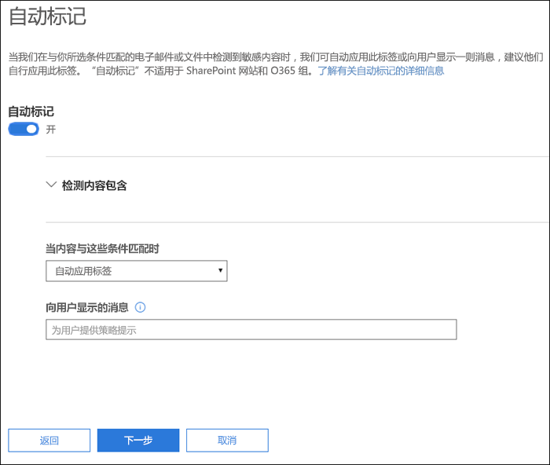
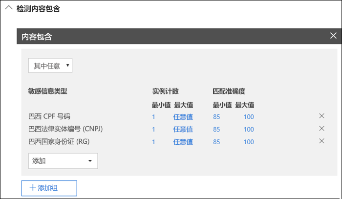
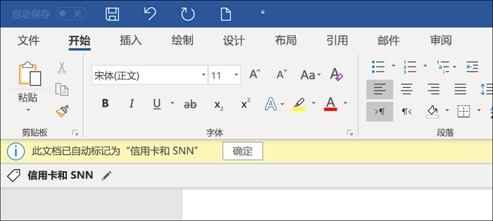
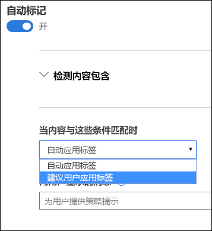
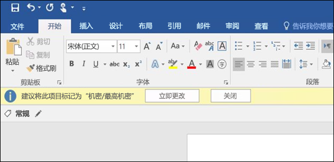

# 将敏感度标签自动应用于内容Apply a sensitivity label to content automatically

创建敏感度标签时，你可以自动将该标签分配给包含敏感信息的内容，也可以提示用户应用你建议的标签。When you create a sensitivity label, you can automatically assign that label to content containing sensitive information, or you can prompt users to apply the label that you recommend.

能否将敏感度标签自动应用于内容非常重要，这是因为：The ability to apply sensitivity labels to content automatically is important because:

- 你无需为用户提供有关所有分类的培训。You don't need to train your users on all of your classifications.

- 你无需依赖用户即可对全部内容进行正确分类。You don't need to rely on users to classify all content correctly.

- 用户不再需要了解你的策略，反而可以专注于自己的工作。Users no longer need to know about your policies - they can instead focus on their work.

> [!NOTE]
> 自动应用标签的功能需要 Azure 信息保护 P2 订阅。若要使用此功能，必须[下载并安装 Azure 信息保护统一标签客户端](https://docs.microsoft.com/zh-CN/azure/information-protection/rms-client/install-unifiedlabelingclient-app)。我们正在设法实现 Office 应用对此功能的本机支持，因此届时将不需要 Azure 信息保护统一标签客户端。此外，统一标签客户端仅可在 Windows 上运行，因此 Mac、iOS 和 Android 尚不支持此功能。The capability to apply labels automatically requires an Azure Information Protection P2 subscription. To use this feature, you must [Download and install the Azure Information Protection unified labeling client](https://docs.microsoft.com/en-us/azure/information-protection/rms-client/install-unifiedlabelingclient-app). We're working on native support for this feature in Office apps, so that it won't require the Azure Information Protection unified labeling client. Also, the unified labeling client runs only on Windows, so this feature is not yet supported on Mac, iOS, and Android.

## 根据条件自动应用敏感度标签Apply a sensitivity label automatically based on conditions

敏感度标签的最强大功能之一是，能自动应用于符合特定条件的内容。在这种情况下，组织内人员无需应用敏感度标签，而是由 Office 365 代劳。One of the most powerful features of sensitivity labels is the ability to apply them automatically to content that matches certain conditions. In this case, people in your organization don't need to apply the sensitivity labels - Office 365 does the work for them.
   
当内容包含特定类型的敏感信息时，可以选择自动将敏感度标签应用于该内容。配置要自动应用的敏感度标签时，你会看到与创建数据丢失防护 (DLP) 策略时相同的敏感信息类型列表。因此，可以自动将“高度机密”标签应用于包含客户个人身份信息 (PII)（例如信用卡号或社会安全号码）的任何内容。You can choose to apply sensitivity labels to content automatically when that content contains specific types of sensitive information. When you configure a sensitivity label to be applied automatically, you see the same list of sensitive information types as when you create a data loss prevention (DLP) policy. So you can, for example, automatically apply a Highly Confidential label to any content that contains customers' personally identifiable information (PII), such as credit card numbers or social security numbers. 

选择敏感信息类型后，可以通过更改实例计数或匹配准确度来优化条件。有关详细信息，请参阅[调整规则以使其更容易或更难匹配](data-loss-prevention-policies.md#tuning-rules-to-make-them-easier-or-harder-to-match)。After you choose your sensitive informaton types, you can refine your condition by changing the instance count or match accuracy. For more information, see [Tuning rules to make them easier or harder to match](data-loss-prevention-policies.md#tuning-rules-to-make-them-easier-or-harder-to-match).

此外，可以选择条件是必须检测所有敏感信息类型，还是仅检测其中一种。为了使条件更加灵活或复杂，可以添加组并在组之间使用逻辑运算符。有关详细信息，请参阅[分组和逻辑运算符](data-loss-prevention-policies.md#grouping-and-logical-operators)。Further, you can choose whether a condition must detect all of the sensitive infromation types, or just one of them. And to make your conditions more flexible or complex, you can add groups and use logical operators between the groups. For more information, see [Grouping and logical operators](data-loss-prevention-policies.md#grouping-and-logical-operators).

当自动应用敏感度标签时，用户会在其 Office 应用中看到通知。他们可以选择“**确定**”以关闭通知。When a sensitivity label is automatically applied, the user sees a notification in their Office app. They can choose **OK** to dismiss the notification.

## 建议用户应用敏感度标签Recommend that the user apply a sensitivity label

如果愿意，可以建议用户应用标签，而不是自动对内容应用敏感度标签。此做法为用户提供了灵活性，他们可以接受分类和任何相关保护，也可以在标签不适合其文档或电子邮件时拒绝该建议。If you prefer, instead of applying a sensitivity label automatically to content, you can recommend to your users that they apply the label. This option provides your users the flexibility of accepting the classification and any associated protection, or dismissing the recommendation if the label is not suitable for their document or email.

请注意，Word、PowerPoint 和 Excel 均支持建议标签（并要求安装 Azure 信息保护统一标签客户端）。我们正设法让 Outlook 也支持建议标签。Note that recommended labels are supported in Word, PowerPoint, and Excel (and require that the Azure Information Protection unified labeling client is installed). We're working on support for recommended labels in Outlook.

以下示例是配置条件来将标签应用为建议操作时的提示以及自定义策略提示。你可以选择策略提示中显示的文本。Here's an example of a prompt when you configure a condition to apply a label as a recommended action, with a custom policy tip. You can choose what text is displayed in the policy tip.

## 如何应用自动标签或建议标签How automatic or recommended labels are applied

- 自动标签适用于 Word、Excel 和 PowerPoint 的文档保存场合以及 Outlook 的电子邮件发送场合。这些条件下会检测文档和电子邮件正文中的敏感信息，以及页眉和页脚中的敏感信息，但不包括电子邮件的主题行和附件中的敏感信息。Automatic labeling applies to Word, Excel, and PowerPoint when documents are saved, and to Outlook when emails are sent. These conditions detect sensitive information in the body text in documents and emails, and to headers and footers -- but not in the subject line or attachments of email.

- 不能对以前手动标记过或者以前使用更高分类级别进行了自动分类的文档和电子邮件使用自动分类。请记住，文档或电子邮件只能应用一个敏感标签（不包括单个保留标签）。You cannot use automatic classification for documents and emails that were previously manually labeled, or previously automatically labeled with a higher classification. Remember, a document or email can have only a single sensitivity label applied to it (in addition to a single retention label).

- 建议分类适用于 Word、Excel 和 PowerPoint 的文档保存场合。我们正设法让 Outlook 也支持建议标签。Recommended classification applies to Word, Excel, and PowerPoint when documents are saved. We're working on support for recommended labeling in Outlook.

- 不能对以前使用更高分类级别标记的文档使用建议分类。在这种情况下，当内容已经标记有更高分类级别时，用户将看不到包含建议和策略提示的提示信息。You cannot use recommended classification for documents that were previously labeled with a higher classification. In this case, when the content's already labeled with a higher classification, the user won't see the prompt with the recommendation and policy tip.

## 在多个条件适用于多个标签时如何评估这些条件How multiple conditions are evaluated when they apply to more than one label

根据你在策略中为标签指定的位置按顺序对标签进行评估：位置最靠前的标签具有最低位置（最不敏感），位置最靠后的标签具有最高位置（最敏感）。有关优先级的详细信息，请参阅[标签优先级（顺序很重要）](sensitivity-labels.md#label-priority-order-matters)。The labels are ordered for evaluation according to their position that you specify in the policy: The label positioned first has the lowest position (least sensitive) and the label positioned last has the highest position (most sensitive). For more information on priority, see [Label priority (order matters)](sensitivity-labels.md#label-priority-order-matters).

## 不要将父标签配置为自动应用或推荐使用Don't configure a parent label to be applied automatically or recommended

请记住，父标签（带子标签的标签）无法应用于内容。Remember, a parent label (a label with sublabels) can't be applied to content. 确保未将父标签配置为自动应用或推荐使用，因为父标签不会应用于使用 Azure 信息保护统一标签客户端的 Office 应用程序中的内容。Make sure that you don't configure a parent label to be auto-applied or recommended, because the parent label won't be applied to content in Office apps that use the Azure Information Protection unified labeling client. 有关父标签和子标签的更多信息，请参阅[子标签（对标签进行分组）](sensitivity-labels.md#sublabels-grouping-labels)。For more information on parent labels and sublabels, see [Sublabels (grouping labels)](sensitivity-labels.md#sublabels-grouping-labels).
