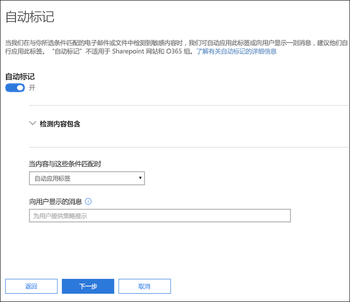
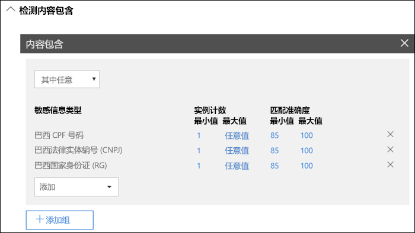
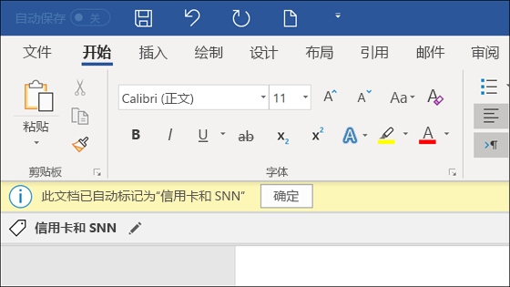
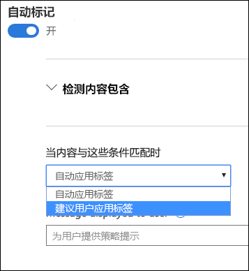

# 将敏感度标签自动应用于内容

创建敏感度标签时，你可以自动将该标签分配给包含敏感信息的内容，也可以提示用户应用你建议的标签。

能否将敏感度标签自动应用于内容非常重要，这是因为：

- 你无需为用户提供有关所有分类的培训。

- 你无需依赖用户即可对全部内容进行正确分类。

- 用户不再需要了解你的策略，反而可以专注于自己的工作。

> [!NOTE]
> 自动应用标签的功能需要 Azure 信息保护 P2 订阅。若要使用此功能，必须[下载并安装 Azure 信息保护统一标签客户端](https://docs.microsoft.com/zh-CN/azure/information-protection/rms-client/install-unifiedlabelingclient-app)。我们正在设法实现 Office 应用对此功能的本机支持，因此届时将不需要 Azure 信息保护统一标签客户端。此外，统一标签客户端仅可在 Windows 上运行，因此 Mac、iOS 和 Android 尚不支持此功能。

## 根据条件自动应用敏感度标签

敏感度标签的最强大功能之一是，能自动应用于符合特定条件的内容。在这种情况下，组织内人员无需应用敏感度标签，而是由 Office 365 代劳。
   
当内容包含特定类型的敏感信息时，可以选择自动将敏感度标签应用于该内容。配置要自动应用的敏感度标签时，你会看到与创建数据丢失防护 (DLP) 策略时相同的敏感信息类型列表。因此，可以自动将“高度机密”标签应用于包含客户个人身份信息 (PII)（例如信用卡号或社会安全号码）的任何内容。 

选择敏感信息类型后，可以通过更改实例计数或匹配准确度来优化条件。有关详细信息，请参阅[调整规则以使其更容易或更难匹配](data-loss-prevention-policies.md#tuning-rules-to-make-them-easier-or-harder-to-match)。

此外，可以选择条件是必须检测所有敏感信息类型，还是仅检测其中一种。为了使条件更加灵活或复杂，可以添加组并在组之间使用逻辑运算符。有关详细信息，请参阅[分组和逻辑运算符](data-loss-prevention-policies.md#grouping-and-logical-operators)。

当自动应用敏感度标签时，用户会在其 Office 应用中看到通知。他们可以选择“**确定**”以关闭通知。

## 建议用户应用敏感度标签

如果愿意，可以建议用户应用标签，而不是自动对内容应用敏感度标签。此做法为用户提供了灵活性，他们可以接受分类和任何相关保护，也可以在标签不适合其文档或电子邮件时拒绝该建议。

请注意，Word、PowerPoint 和 Excel 均支持建议标签（并要求安装 Azure 信息保护统一标签客户端）。我们正设法让 Outlook 也支持建议标签。

以下示例是配置条件来将标签应用为建议操作时的提示以及自定义策略提示。你可以选择策略提示中显示的文本。

## 如何应用自动标签或建议标签

- 自动标签适用于 Word、Excel 和 PowerPoint 的文档保存场合以及 Outlook 的电子邮件发送场合。这些条件下会检测文档和电子邮件正文中的敏感信息，以及页眉和页脚中的敏感信息，但不包括电子邮件的主题行和附件中的敏感信息。

- 不能对以前手动标记过或者以前使用更高分类级别进行了自动分类的文档和电子邮件使用自动分类。请记住，文档或电子邮件只能应用一个敏感标签（不包括单个保留标签）。

- 建议分类适用于 Word、Excel 和 PowerPoint 的文档保存场合。我们正设法让 Outlook 也支持建议标签。

- 不能对以前使用更高分类级别标记的文档使用建议分类。在这种情况下，当内容已经标记有更高分类级别时，用户将看不到包含建议和策略提示的提示信息。

## 在多个条件适用于多个标签时如何评估这些条件

根据你在策略中为标签指定的位置按顺序对标签进行评估：位置最靠前的标签具有最低位置（最不敏感），位置最靠后的标签具有最高位置（最敏感）。有关优先级的详细信息，请参阅[标签优先级（顺序很重要）](sensitivity-labels.md#label-priority-order-matters)。

## 不要将父标签配置为自动应用或推荐使用

请记住，父标签（带子标签的标签）无法应用于内容。 确保未将父标签配置为自动应用或推荐使用，因为父标签不会应用于使用 Azure 信息保护统一标签客户端的 Office 应用程序中的内容。 有关父标签和子标签的更多信息，请参阅[子标签（对标签进行分组）](sensitivity-labels.md#sublabels-grouping-labels)。
