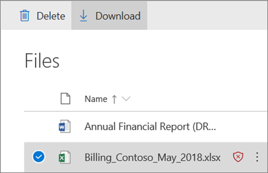

# 适用于 SharePoint、OneDrive 和 Microsoft 团队的 Office 365 ATPOffice 365 ATP for SharePoint, OneDrive, and Microsoft Teams

## SharePoint、OneDrive 和 Microsoft 团队的 Office 365 ATP 概述Overview of Office 365 ATP for SharePoint, OneDrive, and Microsoft Teams

用户定期共享文件, 并使用 SharePoint、OneDrive 和 Microsoft 团队进行协作。People regularly share files and collaborate using SharePoint, OneDrive, and Microsoft Teams. 使用[Office 365 高级威胁防护](office-365-atp.md)(ATP), 您的组织可以更安全地进行协作。With [Office 365 Advanced Threat Protection](office-365-atp.md) (ATP), your organization can collaborate in a safer manner. ATP 可帮助检测和阻止在工作组网站和文档库中被标识为恶意的文件。ATP helps detect and block files that are identified as malicious in team sites and document libraries.  
  
## 运作方式How it works

如果 SharePoint Online、OneDrive for Business 和 Microsoft 团队中的文件被标识为恶意, ATP 将直接与文件存储集成以锁定该文件。When a file in SharePoint Online, OneDrive for Business, and Microsoft Teams has been identified as malicious, ATP directly integrates with the file stores to lock that file. 下图显示了在库中检测到的恶意文件的示例。The following image shows an example of a malicious file detected in a library.
  

  
尽管阻止的文件仍在文档库和 web、移动设备或桌面应用程序中列出, 但无法打开、复制、移动或共享被阻止的文件。Although the blocked file is still listed in the document library and web, mobile, or desktop applications, the blocked file cannot be opened, copied, moved, or shared. 但是, 用户可以删除被阻止的文件。People can, however, delete a blocked file. 下面的示例展示了在用户的移动设备上显示的内容:Here's an example of what that looks like on a user's mobile device:
  

  
根据配置 Office 365 的方式, 用户可能会或可能无法下载被阻止的文件。Depending on how Office 365 is configured, people might or might not have the ability to download a blocked file. 下面介绍了如何在用户的移动设备上下载被阻止的文件:Here's what downloading a blocked file looks like on a user's mobile device:
  

  
若要了解详细信息, 请参阅[打开 SharePoint、OneDrive 和 Microsoft 团队的 Office 365 ATP](turn-on-atp-for-spo-odb-and-teams.md)。To learn more, see [Turn on Office 365 ATP for SharePoint, OneDrive, and Microsoft Teams](turn-on-atp-for-spo-odb-and-teams.md).
  
## 记住这些要点Keep these points in mind

- ATP 将不会扫描 SharePoint Online、OneDrive for Business 或 Microsoft 团队中的每个单个文件。ATP will not scan every single file in SharePoint Online, OneDrive for Business, or Microsoft Teams. 这是设计造成的。This is by design. 通过使用共享和来宾活动事件的进程以及智能试探和威胁信号识别恶意文件, 异步扫描文件。Files are scanned asynchronously, through a process that uses sharing and guest activity events along with smart heuristics and threat signals to identify malicious files.

- 确保您的 SharePoint 网站已配置为使用[新式体验](https://docs.microsoft.com/sharepoint/guide-to-sharepoint-modern-experience)。Make sure your SharePoint sites are configured to use the [Modern experience](https://docs.microsoft.com/sharepoint/guide-to-sharepoint-modern-experience). 当文件被标识为恶意的且被阻止时, 人们可以看到这种情况发生在新式体验中, 而不是经典视图中。When a file is identified as malicious and blocked, people can see that this has occurred in the Modern experience, but not the Classic view. ATP protection 适用于是否使用新式体验或经典视图;但是, 仅在新式体验中, 才会出现阻止文件的视觉指示器。ATP protection applies whether the Modern experience or the Classic view is used; however, visual indicators that a file is blocked are present only in the Modern experience.
    
- 在 SharePoint Online、OneDrive for Business 或 Microsoft 团队中被标识为恶意的文件将显示在[Office 365 高级威胁防护](view-reports-for-atp.md)和[资源管理器 (和实时检测)](threat-explorer.md)的报告中。Files that are identified as malicious in SharePoint Online, OneDrive for Business, or Microsoft Teams will show up in [reports for Office 365 Advanced Threat Protection](view-reports-for-atp.md) and in [Explorer (and real-time detections)](threat-explorer.md).
    
- ATP 是组织整体威胁防护策略的一部分, 其中包括反垃圾邮件和反恶意软件保护, 以及安全链接和安全附件。ATP is part of your organization's overall threat protection strategy, which includes anti-spam and anti-malware protection, as well as Safe Links and Safe Attachments. 若要了解详细信息, 请参阅[在 Office 365 中防御威胁](protect-against-threats.md)。To learn more, see [Protect against threats in Office 365](protect-against-threats.md).
    
- SharePoint Online 管理员可以确定是否允许用户下载被检测为恶意的文件。A SharePoint Online administrator can determine whether to enable people to download files that are detected as malicious. 这是通过使用 DisallowInfectedFileDownload 参数运行 Set-spotenant PowerShell cmdlet 来实现的 (请参阅[打开 SharePoint、OneDrive 和 Microsoft 团队的 Office 365 ATP](turn-on-atp-for-spo-odb-and-teams.md))。This is done by running the Set-SPOTenant PowerShell cmdlet using a DisallowInfectedFileDownload parameter (see [Turn on Office 365 ATP for SharePoint, OneDrive, and Microsoft Teams](turn-on-atp-for-spo-odb-and-teams.md)).
    
## SharePoint Online、OneDrive for Business 和 Microsoft 团队的 ATP 中的隔离Quarantine in ATP for SharePoint Online, OneDrive for Business, and Microsoft Teams

 从后期开始可能为 2018  , 安全&amp;合规中心中的隔离功能将扩展到 SharePoint Online、OneDrive For business 和 Microsoft 团队的 ATP。Beginning in late May 2018, [quarantine](quarantine-email-messages.md) capabilities in the Security &amp; Compliance Center are being extended to ATP for SharePoint Online, OneDrive for Business, and Microsoft Teams.
  
当 SharePoint Online、OneDrive for Business 或 Microsoft 团队中的文件被标识为恶意文件时, 除了 ATP 阻止打开或共享该文件之外, 该文件还包含在隔离项目的列表中。When a file in SharePoint Online, OneDrive for Business, or Microsoft Teams is identified as malicious, in addition to ATP blocking the file from being opened or shared, that file is included in a list of quarantined items. (在安全&amp;合规性中心中, 转到 "**威胁管理** \> " "**查看** \> **隔离**" 和 "筛选**内容**"。)(In the Security &amp; Compliance Center, go to **Threat management** \> **Review** \> **Quarantine** and filter for **Content**.) 
  
如果您是组织的 Office 365 安全团队的一部分, 并且拥有[在 Office 365 安全&amp;合规中心中分配](permissions-in-the-security-and-compliance-center.md)的必要权限, 则可以通过 ATP 下载、发布、报告和删除被检测为恶意的文件。从隔离区。If you're part of your organization's Office 365 security team and have the necessary [permissions assigned in the Office 365 Security &amp; Compliance Center](permissions-in-the-security-and-compliance-center.md), you can download, release, report, and delete files that are detected as malicious by ATP from quarantine.
  
- **释放和报告**文件将在 SharePoint、OneDrive 或 Microsoft 团队的相应团队网站或文档库中删除文件上的 ATP 块。**Releasing and reporting** a file removes the ATP block on the file in the respective team site or document library for SharePoint, OneDrive, or Microsoft Teams. 然后, 用户可以打开、共享和下载文件。Users are then able to open, share, and download the file. 当选择 "**向 Microsoft 发送报告**" 选项时, 该文件将报告为 "误报到 microsoft"。And, when the **Send report to Microsoft** option is selected, the file is reported as a false positive to Microsoft. 
    
- **删除文件**会将文件从隔离区中删除。但是, 仍阻止打开或共享文件。**Deleting a file** removes the file from quarantine; however, the file is still blocked from being opened or shared. 此外, 还必须在其各自的文档库或团队网站 (SharePoint Online、OneDrive for Business 或 Microsoft 团队) 中删除该文件。The file must also be deleted in its respective document library or team site (SharePoint Online, OneDrive for Business, or Microsoft Teams). 
    
- 通过**下载文件**, 您可以下载并分析文件, 以查找任何误报。**Downloading a file** enables you to download and analyze the file for any false positives. 
    
## 后续步骤Next steps

1. [打开适用于 SharePoint、OneDrive 和 Microsoft 团队的 Office 365 ATPTurn on Office 365 ATP for SharePoint, OneDrive, and Microsoft Teams](turn-on-atp-for-spo-odb-and-teams.md)
    
2. [查看有关在 SharePoint、OneDrive 或 Microsoft 团队中检测到的恶意文件的信息View information about malicious files detected in SharePoint, OneDrive, or Microsoft Teams](malicious-files-detected-in-spo-odb-or-teams.md)
    
