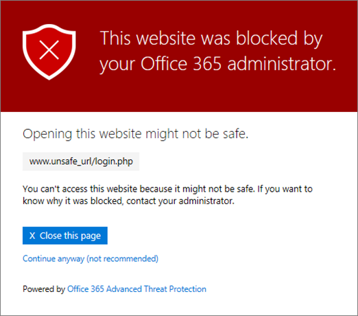

# Office 365 ATP 安全链接警告页Office 365 ATP Safe Links warning pages

> [!IMPORTANT]
> 本文适用于企业客户。如果您是家庭用户查找有关在 Outlook 中的安全链接的信息，请参阅[高级 Outlook.com security](https://support.office.com/article/advanced-outlook-com-security-for-office-365-subscribers-882d2243-eab9-4545-a58a-b36fee4a46e2)。This article is intended for business customers. If you are a home user looking for information about Safe Links in Outlook, see [Advanced Outlook.com security](https://support.office.com/article/advanced-outlook-com-security-for-office-365-subscribers-882d2243-eab9-4545-a58a-b36fee4a46e2).

[Office 365 的高级的威胁保护](office-365-atp.md)(ATP) 可帮助从网络钓鱼尝试和通过功能，如[ATP 安全链接](atp-safe-links.md)、 [ATP 安全的附件](atp-safe-attachments.md)和[防钓鱼保护](anti-phishing-protection.md)的恶意软件保护您的组织。进行保护时，则检查电子邮件和 Office 文档中的链接 (Url)。如果 URL 被标识为可疑或恶意，您可能会阻止单击它时打开 URL。而不是直接转到网站，您可能会看到改为警告页。[Office 365 Advanced Threat Protection](office-365-atp.md) (ATP) helps protect your organization from phishing attempts and malware through features, such as [ATP Safe Links](atp-safe-links.md), [ATP Safe Attachments](atp-safe-attachments.md), and [anti-phishing protection](anti-phishing-protection.md). When protection is in place, links (URLs) in email messages and Office documents are checked. If a URL is identified as suspicious or malicious, you might be blocked from opening the URL when you click it. Instead of going directly to the site, you might see a warning page instead. 
  
阅读这篇文章，请参阅以及[最近更新警告页面](atp-safe-links-warning-pages.md#updates)可能会出现的[警告页面的示例](atp-safe-links-warning-pages.md#examples)。Read this article to see [Examples of warning pages](atp-safe-links-warning-pages.md#examples) that might appear, along with [Recent updates to warning pages](atp-safe-links-warning-pages.md#updates).
  
## 警告页面的示例Examples of warning pages

### ATP 正在扫描链接ATP is scanning the link

正在扫描 ATP 安全链接的 URL。您可能需要等待片刻，再次尝试链接。A URL is being scanned by ATP Safe Links. You might have to wait a few moments to try the link again.

### URL 为可疑的电子邮件A URL is in a suspicious email message

URL 是看起来类似于视为可疑其他电子邮件的电子邮件中。我们建议您仔细检查电子邮件，然后再继续到网站。The URL is in an email message that seems similar to other email messages that are considered suspicious. We recommend that you double-check the email message before proceeding to the site.

### URL 是邮件标识为网络钓鱼尝试中A URL is in a message identified as a phishing attempt

URL 是已被标识为网络钓鱼攻击的电子邮件中。因此，电子邮件中的所有 Url 会被都阻止。我们建议，您不确定要对网站。The URL is in an email message that has been identified as a phishing attack. As a result, all URLs in the email message are blocked. We recommend that you do not proceed to the site.

### 网站被标识为恶意A site has been identified as malicious

该 URL 指向被标识为恶意网站。The URL points to a site that has been identified as malicious.    我们建议，您不确定要对网站。We recommend that you do not proceed to the site.

### 阻止网站A site is blocked

为您的组织阻止 URL。有几个原因可能阻止 URL 的原因。我们建议贵组织的 Office 365 管理员联系。The URL is blocked for your organization. There are several reasons why a URL might be blocked. We recommend that you contact your organization's Office 365 administrator.

### 出现错误An error has occurred

发生某种错误，并且无法打开 URL。Some kind of error has occurred, and the URL cannot be opened.

## 警告的页面的新更新Recent updates to warning pages

Office 365 ATP 最近已更新多个警告页面。如果您已不会看到已更新的页面，您将很快。更新包含新的配色方案、 更多详细信息，并能够继续到网站而不考虑的给定的警告和建议。Several warning pages were recently updated for Office 365 ATP. If you're not already seeing the updated pages, you will soon. The updates include a new color scheme, more details, and the ability to proceed to a site despite the given warning and recommendations.

### 正在进行的 URL 扫描URL scan in progress

原始警告页：Original warning page:

更新后的警告页面：Updated warning page:

### 恶意网站警告Malicious site warning

原始警告页：Original warning page:

更新后的警告页面：Updated warning page:

### 阻止 URL 警告Blocked URL warning

原始警告页：Original warning page:

更新后的警告页面：Updated warning page:

### "出错"警告页"Error occurred" warning page

原始警告页：Original warning page:

更新后的警告页面：Updated warning page:

   
