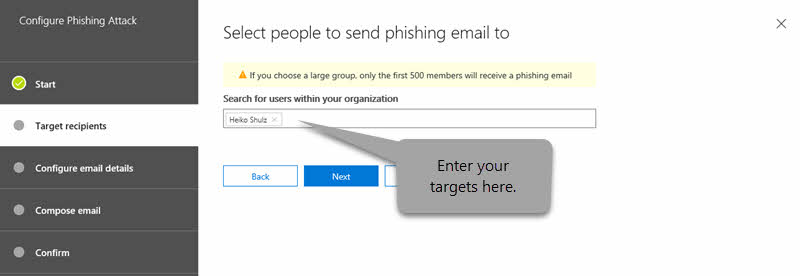

# Office 365 中的攻击模拟器Attack Simulator in Office 365

**摘要**如果您是 Office 365 全局管理员和贵组织拥有[Office 365 威胁智能](office-365-ti.md)，您可以使用攻击模拟器运行您的组织中的实际攻击方案。这可以帮助您确定并查找易受攻击用户前真实攻击影响您底线。阅读此文，了解详细信息。**Summary** If you are an Office 365 global administrator and your organization has [Office 365 Threat Intelligence](office-365-ti.md), you can use Attack Simulator to run realistic attack scenarios in your organization. This can help you identify and find vulnerable users before a real attack impacts your bottom line. Read this article to learn more.
  
## 攻击The Attacks

三种类型的攻击模拟当前有：Three kinds of attack simulations are currently available:
  
- [显示名称矛网络钓鱼攻击Display name spear-phishing attack](attack-simulator.md#spearphish)
    
- [密码喷涂攻击Password-spray attack](attack-simulator.md#passwordspray)
    
- [强制密码攻击Brute-force password attack](attack-simulator.md#bruteforce)
    
攻击者要成功启动，您使用多因素身份验证帐户用于运行模拟的攻击。此外，您必须是 Office 365 全局管理员。For an attack to be successfully launched, you use multi-factor authentication on the account you are using to run simulated attacks. In addition, you must be an Office 365 global administrator.
  
> [!NOTE]
> 条件访问支持即将提供。Support for Conditional Access is coming soon. 
  
若要访问攻击模拟器，安全中&amp;合规性中心中，选择**威胁管理** \> **攻击模拟器**。To access Attack Simulator, in the Security &amp; Compliance Center, choose **Threat management** \> **Attack simulator**.
  
## 开始之前...Before you begin...

请确保您和您的组织满足攻击模拟器的以下要求：Make sure that you and your organization meet the following requirements for Attack Simulator:
      
- Exchange Online 中位于组织的电子邮件。（攻击模拟器不可用的内部部署电子邮件服务器。）Your organization's email is hosted in Exchange Online. (Attack Simulator is not available for on-premises email servers.)
    
- 您是 Office 365 全局管理员You are an Office 365 global administrator
    
- 您的组织使用[的 Office 365 用户的多因素身份验证](https://docs.microsoft.com/office365/admin/security-and-compliance/set-up-multi-factor-authentication?view=o365-worldwide)Your organization is using [Multi-factor authentication for Office 365 users](https://docs.microsoft.com/office365/admin/security-and-compliance/set-up-multi-factor-authentication?view=o365-worldwide)
 
- 贵组织拥有[Office 365 威胁智能](office-365-ti.md)与安全中可见的攻击模拟器&amp;合规性中心 (转到**威胁管理** \> **攻击模拟器**)Your organization has [Office 365 Threat Intelligence](office-365-ti.md), with Attack Simulator visible in the Security &amp; Compliance Center (go to **Threat management** \> **Attack simulator**) 

    
## 显示名称矛网络钓鱼攻击Display name spear-phishing attack

网络钓鱼的攻击 classed 社会工程样式攻击作为一组广泛的通用术语。此类攻击重点矛网络钓鱼，旨在个人或组织的特定组更有针对性的攻击。通常情况下，自定义与使用将生成信任收件人，例如看起来像来自组织内主管电子邮件中的显示名称并执行一些侦测攻击。Phishing is a generic term for a broad suite of attacks classed as a social engineering style attack. This attack is focused on spear phishing, a more targeted attack that is aimed at a specific group of individuals or an organization. Typically, a customized attack with some reconnaissance performed and using a display name that will generate trust in the recipient, such as an email message that looks like it came from an executive within your organization.
  
此类攻击着重于让您通过更改显示名称和源地址源自消息显示的操作。矛网络钓鱼攻击成功后，犯罪访问用户的凭据。This attack focuses on letting you manipulate who the message appears to have originated from by changing the display name and source address. When spear-phishing attacks are successful, cybercriminals gain access to users' credentials.
  
### 若要模拟矛网络钓鱼攻击To simulate a spear-phishing attack

  
可以创建定制直接在**电子邮件正文**字段本身中丰富的 HTML 编辑器，也可以使用 HTML 源代码。You can craft the rich HTML editor directly in the **Email body** field itself or work with HTML source.
  
1. 在[安全&amp;合规性中心](https://security.microsoft.com)，选择**威胁管理** \> **攻击模拟器**。In the [Security &amp; Compliance Center](https://security.microsoft.com), choose **Threat management** \> **Attack simulator**.
    
2. 指定攻击的有意义的市场活动名称，或选择一个模板。Specify a meaningful campaign name for the attack or select a template.  
  
3. 指定目标收件人。这可以是您的组织内个人或组。每个目标的收件人必须具有 Exchange Online 邮箱为了攻击成功。Specify the target recipients. This can be individuals or groups in your organization. Each targeted recipient must have an Exchange Online Mailbox in order for the attack to be successful.  
  
4. 配置网络钓鱼电子邮件详细信息。Configure the Phishing email details.   HTML 格式可以为复杂或基本随着您市场需求。电子邮件格式为 HTML，如可以插入图像和文本以增强 believability。您可以控制上收到的消息中接收电子邮件客户端的类似。The HTML formatting can be as complex or basic as your campaign needs. As the email format is HTML, you can insert images and text to enhance believability. You have control on what the received message will look like in the receiving email client.
    
5. 指定文本的**从 （名称）** 域。这是接收的电子邮件客户端中的**显示名称**中显示的字段。Specify text for the **From (Name)** field. This is the field that shows in the **Display Name** in the receiving email client. 
    
6. 指定文本或**从**域。这是显示为接收电子邮件客户端的发件人的电子邮件地址的字段。Specify text or the **From** field. This is the field that shows as the email address of the sender in the receiving email client.  您可以输入贵组织中的现有电子邮件命名空间 （执行此操作将导致实际解决接收客户端，从而推动非常高信任模型中的电子邮件地址），也可以输入外部电子邮件地址。您指定不必实际存在的电子邮件地址，但它确实需要为以下的一个有效的 SMTP 地址，例如 user@domainname.extension 格式。You can enter an existing email namespace within your organization (doing this will make the email address actually resolve in the receiving client, facilitating a very high trust model), or you can enter an external email address. The email address that you specify does not have to actually exist, but it does need to following the format of a valid SMTP address, such as user@domainname.extension. 
  
7. 使用下拉选择器，选择一个反映您将拥有您攻击中的内容类型的网络钓鱼登录服务器 URL。您可供选择，如文档传递，技术，工资等提供多种应用了主题的 Url。这是有效目标的用户时要求您单击的 URL。Using the drop-down selector, select a Phishing Login server URL that reflects the type of content you will have within your attack. Several themed URLs are provided for you to choose from, such as document delivery, technical, payroll etc. This is effectively the URL that targeted users are asked to click.
    
8. 指定自定义登录页 URL。使用此将用户重定向到末尾的成功的攻击指定的 URL。如果您具有内部认知培训，例如，您可以指定的下面。Specify a custom landing page URL. Using this will redirect users to a URL you specify at the end of a successful attack. If you have internal awareness training, for example, you can specify that here.
    
9. 指定**主题**字段的文本。这是显示为接收电子邮件客户端中的**使用者名称**的字段。Specify text for the **Subject** field. This is the field that shows as the **Subject Name** in the receiving email client. 
    
10. 撰写**电子邮件正文**将接收目标。Compose the **Email body** that the target will receive.  `${username}`将目标名称插入到电子邮件正文。`${username}` inserts the targets name into the Email body.  `${loginserverurl}`插入我们希望目标用户单击的 URL`${loginserverurl}` inserts the URL we want target users to click 
    
11. 选择**下一步，** 然后**完成**以启动攻击。矛网络钓鱼电子邮件传递到目标收件人的邮箱。Choose **Next,** then **Finish** to launch the attack. The spear phishing email message is delivered to your target recipients' mailboxes. 
    
## 密码喷涂攻击Password-spray attack

不良的 actor 成功获得有效用户从租户的列表后将通常用于针对组织的密码喷涂攻击。不良的 actor 了解常见人员使用的密码。这是广泛使用的攻击中，因为它是运行，且更难比暴力方法检测到便宜攻击。A password spray attack against an organization is typically used after a bad actor has successfully acquired a list of valid users from the tenant. The bad actor knows about common passwords that people use. This is a widely used attack, as it is a cheap attack to run, and harder to detect than brute force approaches.
  
此类攻击着重于让您指定的用户的大型目标基针对公用密码。This attack focuses on letting you specify a common password against a large target base of users.
  
### 若要模拟密码喷涂攻击To simulate a password-spray attack

1. 在[安全&amp;合规性中心](https://security.microsoft.com)，选择**威胁管理** \> **攻击模拟器**。In the [Security &amp; Compliance Center](https://security.microsoft.com), choose **Threat management** \> **Attack simulator**.
    
2. 指定攻击的有意义的市场活动名称。Specify a meaningful campaign name for the attack.
    
3. 指定目标收件人。这可以是您的组织内个人或组。目标的收件人必须具有 Exchange Online 邮箱为了攻击成功。Specify the target recipients. This can be individuals or groups in your organization. A targeted recipient must have an Exchange Online Mailbox in order for the attack to be successful.
    
4. 指定要使用的攻击的密码。例如，您可以尝试的一个常见、 相关密码是`Fall2017`。可能有另一个`Spring2018`，或`Password1`。Specify a password to use for the attack. For example, one common, relevant password you could try is `Fall2017`. Another might be `Spring2018`, or `Password1`.
    
5. 选择**完成**以启动攻击。Choose **Finish** to launch the attack. 
    
## 强制密码攻击Brute-force password attack

不良的 actor 成功获得从租户的关键用户列表后，通常使用针对组织的密码强力攻击。此类攻击着重于尝试一组对单个用户的帐户的密码。A brute-force password attack against an organization is typically used after a bad actor has successfully acquired a list of key users from the tenant. This attack focuses on trying a set of passwords on a single user's account.
  
### 模拟密码强力攻击To simulate a brute-force password attack

1. 在[安全&amp;合规性中心](https://security.microsoft.com)，选择**威胁管理** \> **攻击模拟器**。In the [Security &amp; Compliance Center](https://security.microsoft.com), choose **Threat management** \> **Attack simulator**.
    
2. 指定攻击的有意义的市场活动名称。Specify a meaningful campaign name for the attack.
    
3. 指定目标收件人。目标的收件人必须具有 Exchange Online 邮箱为了攻击成功。Specify the target recipient. A targeted recipient must have an Exchange Online Mailbox in order for the attack to be successful.
    
4. 指定一组用于攻击的密码。若要执行此操作，您可用于文本 (.txt) 文件的密码列表。文本文件不能超过 10 MB 文件大小。使用一个密码每行，并确保可在列表中的最后一个密码后包含硬回车。Specify a set of passwords to use for the attack. To do this, you can use a text (.txt) file for your list of passwords. The text file cannot exceed 10 MB in file size. Use one password per line, and make sure to include a hard return after the last password in your list.
    
5. 选择**完成**以启动攻击。Choose **Finish** to launch the attack. 
    
## 在攻击模拟器中的新增功能New features in Attack Simulator

新功能添加到攻击模拟器。这些工具包括：New features are being added to Attack Simulator. These include:
- **报告功能的高级**。您将能够看到数据，例如最快 （或最慢） 时间最快 （或最慢） 时间打开攻击模拟电子邮件，单击中的消息和详细信息的链接。**Advanced reporting capabilities**. You'll be able to see data such as the fastest (or slowest) time to open an attack simulation email message, the fastest (or slowest) time to click a link in the message, and more.
- **电子邮件模板编辑器**。您可以创建可用于将来攻击模拟的自定义的、 可重用的电子邮件模板。**Email template editor**. You can create a custom, reusable email template that you can use for future attack simulations.

请访问[Microsoft 365 路线图](https://www.microsoft.com/microsoft-365/roadmap)以查看新增开发中什么推出，和哪些已启动。Visit the [Microsoft 365 Roadmap](https://www.microsoft.com/microsoft-365/roadmap) to see what's in development, what's rolling out, and what's already launched.

