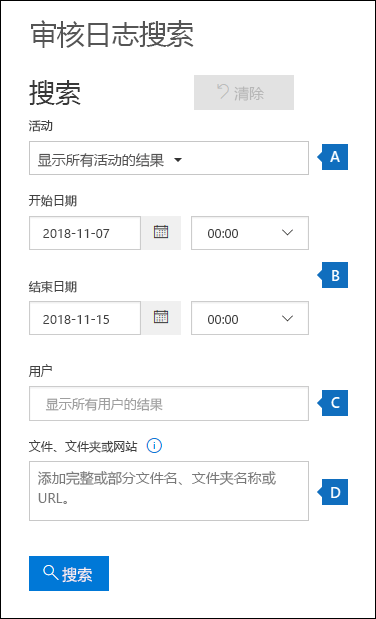
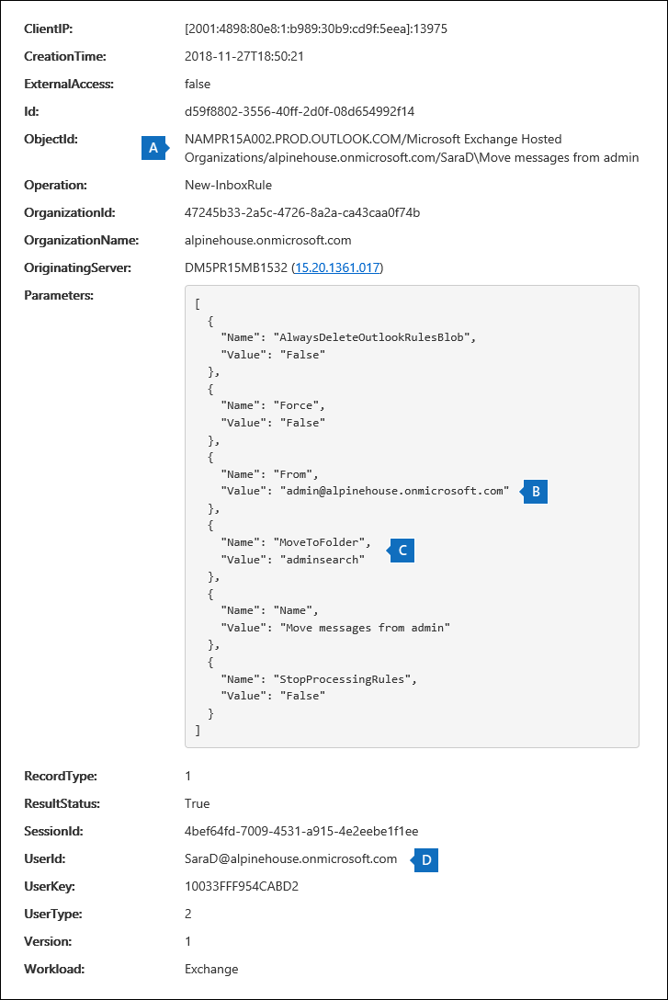

# <a name="search-the-office-365-audit-log-to-troubleshoot-common-scenarios"></a><span data-ttu-id="69b11-103">搜索 Office 365 审核日志以解决常见方案</span><span class="sxs-lookup"><span data-stu-id="69b11-103">Search the Office 365 audit log to troubleshoot common scenarios</span></span>

<span data-ttu-id="69b11-104">本文介绍如何使用 Office 365 审核日志搜索工具来帮助您解决常见的支持方案。</span><span class="sxs-lookup"><span data-stu-id="69b11-104">This article describes how to use the Office 365 audit log search tool to help you troubleshoot common support scenarios.</span></span> <span data-ttu-id="69b11-105">这包括使用审核日志执行以下操作:</span><span class="sxs-lookup"><span data-stu-id="69b11-105">This includes using the audit log to:</span></span>

- <span data-ttu-id="69b11-106">查找用于访问已泄露帐户的计算机的 IP 地址</span><span class="sxs-lookup"><span data-stu-id="69b11-106">Find the IP address of the computer used to access a compromised account</span></span>
- <span data-ttu-id="69b11-107">确定为邮箱设置电子邮件转发的发件商</span><span class="sxs-lookup"><span data-stu-id="69b11-107">Determine who set up email forwarding for a mailbox</span></span>
- <span data-ttu-id="69b11-108">确定用户是否已删除其邮箱中的电子邮件项目</span><span class="sxs-lookup"><span data-stu-id="69b11-108">Determine if a user deleted email items in their mailbox</span></span>
- <span data-ttu-id="69b11-109">确定用户是否已创建收件箱规则</span><span class="sxs-lookup"><span data-stu-id="69b11-109">Determine if a user created an inbox rule</span></span>

## <a name="using-the-office-365-audit-log-search-tool"></a><span data-ttu-id="69b11-110">使用 Office 365 审核日志搜索工具</span><span class="sxs-lookup"><span data-stu-id="69b11-110">Using the Office 365 audit log search tool</span></span>

<span data-ttu-id="69b11-111">本文中介绍的每个故障排除方案都基于 Office 365 安全与合规中心中的审核日志搜索工具。</span><span class="sxs-lookup"><span data-stu-id="69b11-111">Each of the troubleshooting scenarios described in this article are based on using the audit log search tool in the Office 365 security and compliance center.</span></span> <span data-ttu-id="69b11-112">本节列出了搜索审核日志所需的权限, 并介绍了访问和运行审核日志搜索的步骤。</span><span class="sxs-lookup"><span data-stu-id="69b11-112">This section lists the permissions required to search the audit log and describes the steps to access and run audit log searches.</span></span> <span data-ttu-id="69b11-113">每个方案部分都提供了有关如何配置审核日志搜索查询的具体指导, 以及在与搜索条件匹配的审核记录中的详细信息中要查找的内容。</span><span class="sxs-lookup"><span data-stu-id="69b11-113">Each scenario section provides specific guidance about how to configure an audit log search query and what to look for in the detailed information in the audit records that match the search criteria.</span></span>

### <a name="permissions-required-to-use-the-audit-log-search-tool"></a><span data-ttu-id="69b11-114">使用审核日志搜索工具所需的权限</span><span class="sxs-lookup"><span data-stu-id="69b11-114">Permissions required to use the audit log search tool</span></span>

<span data-ttu-id="69b11-115">您必须在 Exchange Online 中向您分配 "仅查看审核日志" 或 "审核日志" 角色, 才能搜索 Office 365 审核日志。</span><span class="sxs-lookup"><span data-stu-id="69b11-115">You have to be assigned the View-Only Audit Logs or Audit Logs role in Exchange Online to search the Office 365 audit log.</span></span> <span data-ttu-id="69b11-116">默认情况下, 将这些角色分配给 Exchange 管理中心中 "**权限**" 页上的 "合规性管理" 和 "组织管理" 角色组。</span><span class="sxs-lookup"><span data-stu-id="69b11-116">By default, these roles are assigned to the Compliance Management and Organization Management role groups on the **Permissions** page in the Exchange admin center.</span></span> <span data-ttu-id="69b11-117">请注意, Office 365 和 Microsoft 365 中的全局管理员将自动添加为 Exchange Online 中的 "组织管理" 角色组的成员。</span><span class="sxs-lookup"><span data-stu-id="69b11-117">Note that global administrators in Office 365 and Microsoft 365 are automatically added as members of the Organization Management role group in Exchange Online.</span></span> <span data-ttu-id="69b11-118">有关详细信息, 请参阅[在 Exchange Online 中管理角色组](https://go.microsoft.com/fwlink/p/?LinkID=730688)。</span><span class="sxs-lookup"><span data-stu-id="69b11-118">For more information, see [Manage role groups in Exchange Online](https://go.microsoft.com/fwlink/p/?LinkID=730688).</span></span>

### <a name="running-audit-log-searches"></a><span data-ttu-id="69b11-119">运行审核日志搜索</span><span class="sxs-lookup"><span data-stu-id="69b11-119">Running audit log searches</span></span>

<span data-ttu-id="69b11-120">本部分介绍创建和运行审核日志搜索的基本操作。</span><span class="sxs-lookup"><span data-stu-id="69b11-120">This section describes the basics for creating and running audit log searches.</span></span> <span data-ttu-id="69b11-121">请按照本文中的每个疑难解答方案的起始点, 使用这些说明。</span><span class="sxs-lookup"><span data-stu-id="69b11-121">Use these instructions as a starting point for each troubleshooting scenario in this article.</span></span> <span data-ttu-id="69b11-122">有关详细的分步说明, 请参阅[搜索审核日志](search-the-audit-log-in-security-and-compliance.md#step-1-run-an-audit-log-search)。</span><span class="sxs-lookup"><span data-stu-id="69b11-122">For more detailed step-by-step instructions, see [Search the audit log](search-the-audit-log-in-security-and-compliance.md#step-1-run-an-audit-log-search).</span></span>

1. <span data-ttu-id="69b11-123">转到[https://protection.office.com/unifiedauditlog](https://protection.office.com/unifiedauditlog)并使用你的工作或学校帐户登录。</span><span class="sxs-lookup"><span data-stu-id="69b11-123">Go to [https://protection.office.com/unifiedauditlog](https://protection.office.com/unifiedauditlog) and sign in using your work or school account.</span></span>
    
    <span data-ttu-id="69b11-124">将显示 "**审核日志搜索**" 页。</span><span class="sxs-lookup"><span data-stu-id="69b11-124">The **Audit log search** page is displayed.</span></span> 
    
    
  
4. <span data-ttu-id="69b11-126">您可以配置以下搜索条件。</span><span class="sxs-lookup"><span data-stu-id="69b11-126">You can configure the following search criteria.</span></span> <span data-ttu-id="69b11-127">请注意, 本文中的每个故障排除方案都将为您提供有关配置这些字段的具体指导。</span><span class="sxs-lookup"><span data-stu-id="69b11-127">Note that each troubleshooting scenario in this article will recommend specific guidance for configuring these fields.</span></span>
    
    <span data-ttu-id="69b11-128">a.</span><span class="sxs-lookup"><span data-stu-id="69b11-128">a.</span></span> <span data-ttu-id="69b11-129">**活动**-单击下拉列表以显示可以搜索的活动。</span><span class="sxs-lookup"><span data-stu-id="69b11-129">**Activities** - Click the drop-down list to display the activities that you can search for.</span></span> <span data-ttu-id="69b11-130">运行搜索后, 仅显示所选活动的审核记录。</span><span class="sxs-lookup"><span data-stu-id="69b11-130">After you run the search, only the audit records for the selected activities are displayed.</span></span> <span data-ttu-id="69b11-131">选择 "**显示所有活动的结果**" 将显示符合其他搜索条件的所有活动的结果。</span><span class="sxs-lookup"><span data-stu-id="69b11-131">Selecting **Show results for all activities** will display results for all activities that meet the other search criteria.</span></span> <span data-ttu-id="69b11-132">在某些故障排除方案中, 您还需要将此字段留空。</span><span class="sxs-lookup"><span data-stu-id="69b11-132">You'll also have to leave this field blank in some of the troubleshooting scenarios.</span></span>
    
    <span data-ttu-id="69b11-133">b.</span><span class="sxs-lookup"><span data-stu-id="69b11-133">b.</span></span> <span data-ttu-id="69b11-134">"**开始日期**" 和 "**结束日期**"-选择要显示在该时间段内发生的事件的日期和时间范围。</span><span class="sxs-lookup"><span data-stu-id="69b11-134">**Start date** and **End date** - Select a date and time range to display the events that occurred within that period.</span></span> <span data-ttu-id="69b11-135">默认情况下, 选择最后七天。</span><span class="sxs-lookup"><span data-stu-id="69b11-135">The last seven days are selected by default.</span></span> <span data-ttu-id="69b11-136">日期和时间以协调通用时间 (UTC) 格式显示。</span><span class="sxs-lookup"><span data-stu-id="69b11-136">The date and time are presented in Coordinated Universal Time (UTC) format.</span></span> <span data-ttu-id="69b11-137">您可以指定的最大日期范围为90天。</span><span class="sxs-lookup"><span data-stu-id="69b11-137">The maximum date range that you can specify is 90 days.</span></span>

    <span data-ttu-id="69b11-138">c.</span><span class="sxs-lookup"><span data-stu-id="69b11-138">c.</span></span> <span data-ttu-id="69b11-139">**用户**-在此框中单击, 然后选择一个或多个用户来显示的搜索结果。</span><span class="sxs-lookup"><span data-stu-id="69b11-139">**Users** - Click in this box and then select one or more users to display search results for.</span></span> <span data-ttu-id="69b11-140">您在此框中选择的用户执行的选定活动的审核记录将显示在结果列表中。</span><span class="sxs-lookup"><span data-stu-id="69b11-140">Audit records for the selected activity performed by the users you select in this box are displayed in the list of results.</span></span> <span data-ttu-id="69b11-141">将此框保留为空将返回组织中所有用户 (和服务帐户) 的条目。</span><span class="sxs-lookup"><span data-stu-id="69b11-141">Leave this box blank to return entries for all users (and service accounts) in your organization.</span></span>
    
    <span data-ttu-id="69b11-142">d.</span><span class="sxs-lookup"><span data-stu-id="69b11-142">d.</span></span> <span data-ttu-id="69b11-143">**文件、文件夹或站点**类型部分或全部文件或文件夹名称, 以搜索与包含指定关键字的文件夹文件相关的活动。</span><span class="sxs-lookup"><span data-stu-id="69b11-143">**File, folder, or site** - Type some or all of a file or folder name to search for activity related to the file of folder that contains the specified keyword.</span></span> <span data-ttu-id="69b11-144">您还可以指定文件或文件夹的 URL。</span><span class="sxs-lookup"><span data-stu-id="69b11-144">You can also specify a URL of a file or folder.</span></span> <span data-ttu-id="69b11-145">如果使用 URL, 请确保键入完整的 URL 路径, 或者如果只键入 URL 的一部分, 则不要包含任何特殊字符或空格。</span><span class="sxs-lookup"><span data-stu-id="69b11-145">If you use a URL, be sure the type the full URL path or if you just type a portion of the URL, don't include any special characters or spaces.</span></span> <span data-ttu-id="69b11-146">将此框保留为空将返回组织中的所有文件和文件夹的条目。</span><span class="sxs-lookup"><span data-stu-id="69b11-146">Leave this box blank to return entries for all files and folders in your organization.</span></span> <span data-ttu-id="69b11-147">请注意, 在本文中的所有故障排除方案中, 此字段将留空。</span><span class="sxs-lookup"><span data-stu-id="69b11-147">Note that this field is left blank in all the troubleshooting scenarios in this article.</span></span>
    
5. <span data-ttu-id="69b11-148">单击 "**搜索**" 以使用搜索条件运行搜索。</span><span class="sxs-lookup"><span data-stu-id="69b11-148">Click **Search** to run the search using your search criteria.</span></span> 
    
    <span data-ttu-id="69b11-149">搜索结果已加载, 并在几分钟后显示在 "**审核日志搜索**" 页上的 "**结果**" 下。</span><span class="sxs-lookup"><span data-stu-id="69b11-149">The search results are loaded, and after a few moments they are displayed under **Results** on the **Audit log search** page.</span></span> <span data-ttu-id="69b11-150">以下各节将提供有关查找特定故障排除方案的事项的指导。</span><span class="sxs-lookup"><span data-stu-id="69b11-150">Each to the following sections will provide guidance about things to look for the specific troubleshooting scenario.</span></span>

    <span data-ttu-id="69b11-151">有关查看、筛选或导出审核日志搜索结果的详细信息, 请参阅:</span><span class="sxs-lookup"><span data-stu-id="69b11-151">For more information about viewing, filtering, or exporting audit log search results, see:</span></span>

    - [<span data-ttu-id="69b11-152">查看搜索结果</span><span class="sxs-lookup"><span data-stu-id="69b11-152">View search results</span></span>](search-the-audit-log-in-security-and-compliance.md#step-2-view-the-search-results)
    - [<span data-ttu-id="69b11-153">筛选搜索结果</span><span class="sxs-lookup"><span data-stu-id="69b11-153">Filter search results</span></span>](search-the-audit-log-in-security-and-compliance.md#step-3-filter-the-search-results)
    - [<span data-ttu-id="69b11-154">导出搜索结果</span><span class="sxs-lookup"><span data-stu-id="69b11-154">Export search results</span></span>](search-the-audit-log-in-security-and-compliance.md#step-4-export-the-search-results-to-a-file)

## <a name="finding-the-ip-address-of-the-computer-used-to-access-a-compromised-account"></a><span data-ttu-id="69b11-155">查找用于访问已损坏帐户的计算机的 IP 地址</span><span class="sxs-lookup"><span data-stu-id="69b11-155">Finding the IP address of the computer used to access a compromised account</span></span>

<span data-ttu-id="69b11-156">与任何用户执行的活动对应的 IP 地址包含在大多数审核记录中。</span><span class="sxs-lookup"><span data-stu-id="69b11-156">The IP address corresponding to an activity performed by any user is included in most audit records.</span></span> <span data-ttu-id="69b11-157">有关所使用的客户端的信息也包含在审核记录中。</span><span class="sxs-lookup"><span data-stu-id="69b11-157">Information about the client used is also included in the audit record.</span></span>

<span data-ttu-id="69b11-158">下面介绍了如何配置此方案的审核日志搜索查询:</span><span class="sxs-lookup"><span data-stu-id="69b11-158">Here's how to configure an audit log search query for this scenario:</span></span>

<span data-ttu-id="69b11-159">**活动**-如果与你的案例相关, 请选择要搜索的特定活动。</span><span class="sxs-lookup"><span data-stu-id="69b11-159">**Activities** - If relevant to your case, select a specific activity to search for.</span></span> <span data-ttu-id="69b11-160">若要对受损帐户进行故障排除, 请考虑选择 " **Exchange 邮箱活动**" 下的 "**登录到邮箱的用户**" 活动。</span><span class="sxs-lookup"><span data-stu-id="69b11-160">For troubleshooting compromised accounts, consider selecting the **User signed in to mailbox** activity under **Exchange mailbox activities**.</span></span> <span data-ttu-id="69b11-161">这将返回审核记录, 这些记录显示登录邮箱时使用的 IP 地址。</span><span class="sxs-lookup"><span data-stu-id="69b11-161">This will return auditing records showing the IP address that was use when signing in to the mailbox.</span></span> <span data-ttu-id="69b11-162">否则, 将此字段保留为空, 以返回所有活动的审核记录。</span><span class="sxs-lookup"><span data-stu-id="69b11-162">Otherwise, leave this field blank to return audit records for all activities.</span></span> 

> [!TIP]
> <span data-ttu-id="69b11-163">将此字段留空将返回**UserLoggedIn**活动, 这是一种 Azure Active Directory 活动, 该活动表明有人登录到 Office 365 用户帐户。</span><span class="sxs-lookup"><span data-stu-id="69b11-163">Leaving this field blank will  return **UserLoggedIn** activities, which is an Azure Active Directory activity that indicates that someone has signed in to an Office 365 user account.</span></span> <span data-ttu-id="69b11-164">使用搜索结果中的筛选功能显示**UserLoggedIn**审核记录。</span><span class="sxs-lookup"><span data-stu-id="69b11-164">Use filtering in the search results to display the **UserLoggedIn** audit records.</span></span>

<span data-ttu-id="69b11-165">"**开始日期**" 和 "**结束日期**"-选择适用于调查的日期范围。</span><span class="sxs-lookup"><span data-stu-id="69b11-165">**Start date** and **End date** - Select a date range that's applicable to your investigation.</span></span>

<span data-ttu-id="69b11-166">**用户**-如果你正在调查已泄露的帐户, 请选择帐户受到威胁的用户。</span><span class="sxs-lookup"><span data-stu-id="69b11-166">**Users** - If you're investigating a compromised account, select the user whose account was compromised.</span></span> <span data-ttu-id="69b11-167">这将返回该用户帐户执行的活动的审核记录。</span><span class="sxs-lookup"><span data-stu-id="69b11-167">This will return audit records for activities performed by that user account.</span></span>

<span data-ttu-id="69b11-168">**文件、文件夹或网站**-将此字段留空。</span><span class="sxs-lookup"><span data-stu-id="69b11-168">**File, folder, or site** - Leave this field blank.</span></span>

<span data-ttu-id="69b11-169">运行搜索后, 每个活动的 IP 地址将显示在搜索结果的 " **ip 地址**" 列中。</span><span class="sxs-lookup"><span data-stu-id="69b11-169">After you run the search, the IP address for each activity is displayed in the **IP address** column in the search results.</span></span> <span data-ttu-id="69b11-170">单击搜索结果中的记录, 以查看有关弹出页面的更多详细信息。</span><span class="sxs-lookup"><span data-stu-id="69b11-170">Click the record in the search results to view more detailed information on the flyout page.</span></span>

## <a name="determining-who-set-up-email-forwarding-for-a-mailbox"></a><span data-ttu-id="69b11-171">确定为邮箱设置电子邮件转发的身份</span><span class="sxs-lookup"><span data-stu-id="69b11-171">Determining who set up email forwarding for a mailbox</span></span>

<span data-ttu-id="69b11-172">为邮箱配置电子邮件转发后, 发送到该邮箱的电子邮件将被转发到另一个邮箱。</span><span class="sxs-lookup"><span data-stu-id="69b11-172">When email forwarding is configured for a mailbox, email messages that are sent to the mailbox are forwarded to another mailbox.</span></span> <span data-ttu-id="69b11-173">可以将邮件转发给组织内部或外部的用户。</span><span class="sxs-lookup"><span data-stu-id="69b11-173">Messages can be forwarded to users inside or outside of your organization.</span></span> <span data-ttu-id="69b11-174">在邮箱上设置电子邮件转发时, 将使用的基础 Exchange Online cmdlet 设置为 "**邮箱**"。</span><span class="sxs-lookup"><span data-stu-id="69b11-174">When email forwarding is set up on a mailbox, the underlying Exchange Online cmdlet that's used is **Set-Mailbox**.</span></span>

<span data-ttu-id="69b11-175">下面介绍了如何配置此方案的审核日志搜索查询:</span><span class="sxs-lookup"><span data-stu-id="69b11-175">Here's how to configure an audit log search query for this scenario:</span></span>

<span data-ttu-id="69b11-176">**活动**-将此字段保留为空, 以便搜索将返回所有活动的审核记录。</span><span class="sxs-lookup"><span data-stu-id="69b11-176">**Activities** - Leave this field blank so that the search returns audit records for all activities.</span></span> <span data-ttu-id="69b11-177">若要返回与**设置邮箱**cmdlet 相关的任何审核记录, 这是必需的。</span><span class="sxs-lookup"><span data-stu-id="69b11-177">This is necessary to return any audit records related to the **Set-Mailbox** cmdlet.</span></span>

<span data-ttu-id="69b11-178">"**开始日期**" 和 "**结束日期**"-选择适用于调查的日期范围。</span><span class="sxs-lookup"><span data-stu-id="69b11-178">**Start date** and **End date** - Select a date range that's applicable to your investigation.</span></span>

<span data-ttu-id="69b11-179">**用户**-除非您要调查特定用户的电子邮件转发问题, 否则请将此字段留空。</span><span class="sxs-lookup"><span data-stu-id="69b11-179">**Users** - Unless you're investigating a email forwarding issue for a specific user, leave this field blank.</span></span> <span data-ttu-id="69b11-180">这将帮助您确定是否为任何用户设置了电子邮件转发。</span><span class="sxs-lookup"><span data-stu-id="69b11-180">This will help you identify if email forwarding was set up for any user.</span></span>

<span data-ttu-id="69b11-181">**文件、文件夹或网站**-将此字段留空。</span><span class="sxs-lookup"><span data-stu-id="69b11-181">**File, folder, or site** - Leave this field blank.</span></span>

<span data-ttu-id="69b11-182">运行搜索后, 单击搜索结果页上的 "**筛选结果**"。</span><span class="sxs-lookup"><span data-stu-id="69b11-182">After you run the search, click **Filter results** on the search results page.</span></span> <span data-ttu-id="69b11-183">在 "**活动**" 列标题下的框中, 键入 "**设置"-"邮箱**", 以便只显示与 "**设置邮箱**" cmdlet 相关的审核记录。</span><span class="sxs-lookup"><span data-stu-id="69b11-183">In the box under **Activity** column header, type **Set-Mailbox** so that only audit records related to the **Set-Mailbox** cmdlet are displayed.</span></span>


<span data-ttu-id="69b11-185">在这种情况下, 您必须查看每个审核记录的详细信息, 以确定该活动是否与电子邮件转发相关。</span><span class="sxs-lookup"><span data-stu-id="69b11-185">At this point, you have to look at the details of each audit record to determine if the activity is related to email forwarding.</span></span> <span data-ttu-id="69b11-186">单击 "审核记录" 以显示 "**详细**信息" 弹出页面, 然后单击 "**详细信息**"。</span><span class="sxs-lookup"><span data-stu-id="69b11-186">Click the audit record to display the **Details** flyout page, and then click **More information**.</span></span> <span data-ttu-id="69b11-187">下面的屏幕截图和说明突出显示了指示邮箱上设置了电子邮件转发的信息。</span><span class="sxs-lookup"><span data-stu-id="69b11-187">The following screenshot and descriptions highlights the information that indicates email forwarding was set on the mailbox.</span></span>


<span data-ttu-id="69b11-189">a.</span><span class="sxs-lookup"><span data-stu-id="69b11-189">a.</span></span> <span data-ttu-id="69b11-190">在 " **ObjectId** " 字段中, 将显示设置了电子邮件转发的邮箱的别名。</span><span class="sxs-lookup"><span data-stu-id="69b11-190">In the **ObjectId** field, the alias of the mailbox that email forwarding was set on is displayed.</span></span> <span data-ttu-id="69b11-191">此邮箱也会显示在搜索结果页中的**项目**列上。</span><span class="sxs-lookup"><span data-stu-id="69b11-191">This mailbox is also displayed on the **Item** column in the search results page.</span></span>

<span data-ttu-id="69b11-192">b.</span><span class="sxs-lookup"><span data-stu-id="69b11-192">b.</span></span> <span data-ttu-id="69b11-193">在 "**参数**" 字段中, 值*ForwardingSmtpAddress*表示已经在邮箱上设置了电子邮件转发。</span><span class="sxs-lookup"><span data-stu-id="69b11-193">In the **Parameters** field, The value *ForwardingSmtpAddress* indicates that email forward has been set on the mailbox.</span></span> <span data-ttu-id="69b11-194">在此示例中, 将邮件转发到 alpinehouse.onmicrosoft.com 组织外部的电子邮件地址 mike@contoso.com。</span><span class="sxs-lookup"><span data-stu-id="69b11-194">In this example, mail is being forwarded to the email address mike@contoso.com, which is outside of the alpinehouse.onmicrosoft.com organization.</span></span>

<span data-ttu-id="69b11-195">c.</span><span class="sxs-lookup"><span data-stu-id="69b11-195">c.</span></span> <span data-ttu-id="69b11-196">*DeliverToMailboxAndForward*参数的*True*值指示传递给 sarad@alpinehouse.onmicrosoft.com 的邮件的副本 *, 并*转发到 ForwardingSmtpAddress 指定的电子邮件地址。 \*\* 参数, 在此示例中为 mike@contoso.com。</span><span class="sxs-lookup"><span data-stu-id="69b11-196">The *True* value for the *DeliverToMailboxAndForward* parameter indicates that a copy of message delivered to sarad@alpinehouse.onmicrosoft.com *and* is forwarded to the email address specified by the *ForwardingSmtpAddress* parameter, which in this example is mike@contoso.com.</span></span> <span data-ttu-id="69b11-197">如果将*DeliverToMailboxAndForward*参数的值设置为*False*, 则仅将电子邮件转发到*ForwardingSmtpAddress*参数指定的地址。</span><span class="sxs-lookup"><span data-stu-id="69b11-197">If the value for the *DeliverToMailboxAndForward* parameter is set to *False*, then email is only forwarded to the address specified by the *ForwardingSmtpAddress* parameter.</span></span> <span data-ttu-id="69b11-198">它不会传递到**ObjectId**字段中指定的邮箱。</span><span class="sxs-lookup"><span data-stu-id="69b11-198">It's not delivered to the mailbox specified in the **ObjectId** field.</span></span>

<span data-ttu-id="69b11-199">d.</span><span class="sxs-lookup"><span data-stu-id="69b11-199">d.</span></span> <span data-ttu-id="69b11-200">**UserId**字段指示在**ObjectId**字段字段中指定的邮箱上设置电子邮件转发的用户。</span><span class="sxs-lookup"><span data-stu-id="69b11-200">The **UserId** field indicates the user who set email forwarding on the mailbox specified in the **ObjectId** field field.</span></span> <span data-ttu-id="69b11-201">此用户也显示在搜索结果页上的**用户**列中。</span><span class="sxs-lookup"><span data-stu-id="69b11-201">This user is also displayed in the **User** column on the search results page.</span></span> <span data-ttu-id="69b11-202">在这种情况下, 似乎邮箱的所有者在其邮箱上设置了电子邮件转发。</span><span class="sxs-lookup"><span data-stu-id="69b11-202">In this case, it seems that the owner of the mailbox set email forwarding on her mailbox.</span></span>

<span data-ttu-id="69b11-203">如果您确定不应在邮箱上设置电子邮件转发, 则可以通过在 Exchange Online PowerShell 中运行以下命令将其删除:</span><span class="sxs-lookup"><span data-stu-id="69b11-203">If you determine that email forwarding shouldn't be set on the mailbox, you can remove it by running the following command in Exchange Online PowerShell:</span></span>

```
Set-Mailbox <mailbox alias> -ForwardingSmtpAddress $null 
```

<span data-ttu-id="69b11-204">有关与电子邮件转发相关的参数的详细信息, 请参阅 "[设置邮箱" 一](https://docs.microsoft.com/powershell/module/exchange/mailboxes/set-mailbox)文。</span><span class="sxs-lookup"><span data-stu-id="69b11-204">See the [Set-Mailbox](https://docs.microsoft.com/powershell/module/exchange/mailboxes/set-mailbox) article for more information about the parameters related to email forwarding.</span></span>

## <a name="determining-if-a-user-deleted-email-items"></a><span data-ttu-id="69b11-205">确定用户是否已删除电子邮件项目</span><span class="sxs-lookup"><span data-stu-id="69b11-205">Determining if a user deleted email items</span></span>

<span data-ttu-id="69b11-206">从2019年1月起, Microsoft 将默认针对所有 Office 365 和 Microsoft 组织启用邮箱审核日志记录。</span><span class="sxs-lookup"><span data-stu-id="69b11-206">Starting in January 2019, Microsoft is turning on mailbox audit logging by default for all Office 365 and Microsoft organizations.</span></span> <span data-ttu-id="69b11-207">这意味着邮箱所有者执行的某些操作将会自动记录, 当您在邮箱审核日志中搜索相应的邮箱审核记录时, 这些记录将可用。</span><span class="sxs-lookup"><span data-stu-id="69b11-207">This means that certain actions performed by mailbox owners are automatically logged, and the corresponding mailbox audit records will be available when you search for them in the mailbox audit log.</span></span> <span data-ttu-id="69b11-208">默认情况下, 邮箱审核启用前, 您必须为组织中的每个用户邮箱手动启用它。</span><span class="sxs-lookup"><span data-stu-id="69b11-208">Before mailbox auditing was turned on by default, you had to manually enable it for every user mailbox in your organization.</span></span> 

<span data-ttu-id="69b11-209">默认情况下记录的邮箱操作包括邮箱所有者执行的 SoftDelete 和 HardDelete 邮箱操作。</span><span class="sxs-lookup"><span data-stu-id="69b11-209">The mailbox actions logged by default include the SoftDelete and HardDelete mailbox actions performed by mailbox owners.</span></span> <span data-ttu-id="69b11-210">这意味着您可以使用以下步骤在审核日志中搜索与已删除电子邮件项目相关的事件。</span><span class="sxs-lookup"><span data-stu-id="69b11-210">This means you can use the use the following steps to search the audit log for events related to deleted email items.</span></span> <span data-ttu-id="69b11-211">有关默认情况下邮箱审核的详细信息, 请参阅[管理邮箱审核](enable-mailbox-auditing.md)。</span><span class="sxs-lookup"><span data-stu-id="69b11-211">For for more information about mailbox auditing on by default, see [Manage mailbox auditing](enable-mailbox-auditing.md).</span></span>

<span data-ttu-id="69b11-212">下面介绍了如何配置此方案的审核日志搜索查询:</span><span class="sxs-lookup"><span data-stu-id="69b11-212">Here's how to configure an audit log search query for this scenario:</span></span>

<span data-ttu-id="69b11-213">**活动**-在 " **Exchange 邮箱活动**" 下, 选择以下一个或两个活动:</span><span class="sxs-lookup"><span data-stu-id="69b11-213">**Activities** - Under **Exchange mailbox activities**, select one or both of the following activities:</span></span>

- <span data-ttu-id="69b11-214">**已删除邮件从 "已删除**邮件" 文件夹-此活动对应于**SoftDelete**邮箱审核操作。</span><span class="sxs-lookup"><span data-stu-id="69b11-214">**Deleted messages from Deleted Items folder** -  This activity corresponds to the **SoftDelete** mailbox auditing action.</span></span> <span data-ttu-id="69b11-215">当用户通过选择项目并按**Shift + Delete**永久删除项目时, 也会记录此活动。</span><span class="sxs-lookup"><span data-stu-id="69b11-215">This activity is also logged when a user permanently deletes an item by selecting it and pressing **Shift+Delete**.</span></span> <span data-ttu-id="69b11-216">在永久删除某个项目后, 用户可以恢复该项目, 直到已删除项目的保留期过期。</span><span class="sxs-lookup"><span data-stu-id="69b11-216">After an item is permanently deleted, the user can recover it until the deleted item retention period expires.</span></span>

- <span data-ttu-id="69b11-217">已**清除邮箱中的邮件**-此活动对应于**HardDelete**邮箱审核操作。</span><span class="sxs-lookup"><span data-stu-id="69b11-217">**Purged messages from mailbox** - This activity corresponds to the **HardDelete** mailbox auditing action.</span></span> <span data-ttu-id="69b11-218">当用户清除 "可恢复的项目" 文件夹中的项目时, 会记录这种情况。</span><span class="sxs-lookup"><span data-stu-id="69b11-218">This is logged when a user purges an item from the Recoverable Items folder.</span></span> <span data-ttu-id="69b11-219">管理员可以使用安全与合规中心中的内容搜索工具搜索和恢复清除的项目, 直到已删除项目的保留期过期或超过用户邮箱处于保留状态。</span><span class="sxs-lookup"><span data-stu-id="69b11-219">Admins can use the Content Search tool in the security and compliance center to search for and recover purged items until the deleted item retention period expires or longer if the user's mailbox is on hold.</span></span>

<span data-ttu-id="69b11-220">"**开始日期**" 和 "**结束日期**"-选择适用于调查的日期范围。</span><span class="sxs-lookup"><span data-stu-id="69b11-220">**Start date** and **End date** - Select a date range that's applicable to your investigation.</span></span>

<span data-ttu-id="69b11-221">**用户**-如果您在此字段中选择一个用户, 则审核日志搜索工具将为您指定的用户返回已删除的电子邮件项目 (SoftDeleted 或 HardDeleted) 的审核记录。</span><span class="sxs-lookup"><span data-stu-id="69b11-221">**Users** - If you select a user in this field, the audit log search tool will return audit records for email items that were deleted (SoftDeleted or HardDeleted) by the user you specify.</span></span> <span data-ttu-id="69b11-222">在某些情况下, 删除电子邮件的用户可能不是邮箱所有者。</span><span class="sxs-lookup"><span data-stu-id="69b11-222">In some cases, the user who deletes an email might not be the mailbox owner.</span></span>

<span data-ttu-id="69b11-223">**文件、文件夹或网站**-将此字段留空。</span><span class="sxs-lookup"><span data-stu-id="69b11-223">**File, folder, or site** - Leave this field blank.</span></span>

<span data-ttu-id="69b11-224">运行搜索后, 可以筛选搜索结果, 以显示软删除项目或硬删除项目的审核记录。</span><span class="sxs-lookup"><span data-stu-id="69b11-224">After you run the search, you can filter the search results to display the audit records for soft-deleted items or for hard-deleted items.</span></span> <span data-ttu-id="69b11-225">单击 "审核记录" 以显示 "**详细**信息" 弹出页面, 然后单击 "**详细信息**"。</span><span class="sxs-lookup"><span data-stu-id="69b11-225">Click the audit record to display the **Details** flyout page, and then click **More information**.</span></span> <span data-ttu-id="69b11-226">在 " **AffectedItems** " 字段中显示有关已删除项目的其他信息, 如主题行和项目的删除位置。</span><span class="sxs-lookup"><span data-stu-id="69b11-226">Additional information about the deleted item, such as the subject line and the location of the item when it was deleted, is displayed in the **AffectedItems** field.</span></span> <span data-ttu-id="69b11-227">下面的屏幕截图显示软删除项和硬删除项中的**AffectedItems**字段的示例。</span><span class="sxs-lookup"><span data-stu-id="69b11-227">The following screenshots show an example of the **AffectedItems** field from a soft-deleted item and a hard-deleted item.</span></span>

<span data-ttu-id="69b11-228">**软删除项的 AffectedItems 字段的示例**</span><span class="sxs-lookup"><span data-stu-id="69b11-228">**Example of AffectedItems field for soft-deleted item**</span></span>


<span data-ttu-id="69b11-230">**硬删除项的 AffectedItems 字段的示例**</span><span class="sxs-lookup"><span data-stu-id="69b11-230">**Example of AffectedItems field for hard-deleted item**</span></span>


### <a name="recovering-deleted-email-items"></a><span data-ttu-id="69b11-232">恢复已删除的电子邮件项目</span><span class="sxs-lookup"><span data-stu-id="69b11-232">Recovering deleted email items</span></span>

<span data-ttu-id="69b11-233">如果已删除项目的保留期尚未过期, 则用户可以恢复软删除的项目。</span><span class="sxs-lookup"><span data-stu-id="69b11-233">Users can recover soft-deleted items if the deleted items retention period has not expired.</span></span> <span data-ttu-id="69b11-234">在 Exchange Online 中, 默认的已删除项目保留期为14天, 但管理员可以将此设置增加到最多30天。</span><span class="sxs-lookup"><span data-stu-id="69b11-234">In Exchange Online, the default deleted items retention period is 14 days, but admins can increase this setting to a maximum of 30 days.</span></span> <span data-ttu-id="69b11-235">将用户指向 "在[Outlook 中恢复已删除项目或电子邮件" web](https://support.office.com/article/Recover-deleted-items-or-email-in-Outlook-Web-App-C3D8FC15-EEEF-4F1C-81DF-E27964B7EDD4)文章, 以获取有关恢复已删除项目的说明。</span><span class="sxs-lookup"><span data-stu-id="69b11-235">Point users to the [Recover deleted items or email in Outlook on the web](https://support.office.com/article/Recover-deleted-items-or-email-in-Outlook-Web-App-C3D8FC15-EEEF-4F1C-81DF-E27964B7EDD4) article for instructions on recovering deleted items.</span></span>

<span data-ttu-id="69b11-236">如前所述, 如果已删除项目的保留期尚未过期或邮箱处于保留状态, 则管理员可能能够恢复已删除的邮件, 在这种情况下, 将保留项目, 直到保留期间过期。</span><span class="sxs-lookup"><span data-stu-id="69b11-236">As previously explained, admins might be able to recover hard-deleted items if the deleted item retention period has not expired or if the mailbox is on hold, in which case items are retained until the hold duration expires.</span></span> <span data-ttu-id="69b11-237">在运行内容搜索时, 如果搜索结果与搜索查询相匹配, 则会在搜索结果中返回软删除和硬删除的项目文件夹中的项目。</span><span class="sxs-lookup"><span data-stu-id="69b11-237">When you run a content search, soft-deleted and hard-deleted items in the Recoverable Items folder are returned in the search results if they match the search query.</span></span> <span data-ttu-id="69b11-238">有关运行内容搜索的详细信息, 请参阅[Office 365 中的内容搜索](content-search.md)。</span><span class="sxs-lookup"><span data-stu-id="69b11-238">For more information about running content searches, see [Content Search in Office 365](content-search.md).</span></span>

> [!TIP]
> <span data-ttu-id="69b11-239">若要搜索已删除的电子邮件项目, 请在审核记录的 " **AffectedItems** " 字段中搜索显示的全部或部分主题行。</span><span class="sxs-lookup"><span data-stu-id="69b11-239">To search for deleted email items, search for all or part of the subject line that's displayed in the **AffectedItems** field in the audit record.</span></span>

## <a name="determining-if-a-user-created-an-inbox-rule"></a><span data-ttu-id="69b11-240">确定用户是否已创建收件箱规则</span><span class="sxs-lookup"><span data-stu-id="69b11-240">Determining if a user created an inbox rule</span></span>

<span data-ttu-id="69b11-241">当用户为其 Exchange Online 邮箱创建收件箱规则时, 会将相应的审核记录保存到审核日志中。</span><span class="sxs-lookup"><span data-stu-id="69b11-241">When users create an inbox rule for their Exchange Online mailbox, a corresponding audit record is saved to the audit log.</span></span> <span data-ttu-id="69b11-242">有关收件箱规则的详细信息, 请参阅:</span><span class="sxs-lookup"><span data-stu-id="69b11-242">For more information about inbox rules, see:</span></span>

- [<span data-ttu-id="69b11-243">在 web 上的 Outlook 中使用收件箱规则</span><span class="sxs-lookup"><span data-stu-id="69b11-243">Use inbox rules in Outlook on the web</span></span>](https://support.office.com/article/use-inbox-rules-in-outlook-on-the-web-8400435c-f14e-4272-9004-1548bb1848f2)
- [<span data-ttu-id="69b11-244">使用规则管理 Outlook 中的电子邮件</span><span class="sxs-lookup"><span data-stu-id="69b11-244">Manage email messages in Outlook by using rules</span></span>](https://support.office.com/article/Manage-email-messages-by-using-rules-C24F5DEA-9465-4DF4-AD17-A50704D66C59)

<span data-ttu-id="69b11-245">下面介绍了如何配置此方案的审核日志搜索查询:</span><span class="sxs-lookup"><span data-stu-id="69b11-245">Here's how to configure an audit log search query for this scenario:</span></span>

<span data-ttu-id="69b11-246">**活动**-在 " **Exchange 邮箱活动**" 下, 选择 " **new-inboxrule 创建/修改/启用/禁用收件箱规则"**。</span><span class="sxs-lookup"><span data-stu-id="69b11-246">**Activities** - Under **Exchange mailbox activities**, select **New-InboxRule Create/modify/enable/disable inbox rule**.</span></span>

<span data-ttu-id="69b11-247">"**开始日期**" 和 "**结束日期**"-选择适用于调查的日期范围。</span><span class="sxs-lookup"><span data-stu-id="69b11-247">**Start date** and **End date** - Select a date range that's applicable to your investigation.</span></span>

<span data-ttu-id="69b11-248">**用户**-除非您正在调查特定用户, 否则请将此字段留空。</span><span class="sxs-lookup"><span data-stu-id="69b11-248">**Users** - Unless you're investigating a specific user, leave this field blank.</span></span> <span data-ttu-id="69b11-249">这将帮助您识别由任何用户设置的新收件箱规则。</span><span class="sxs-lookup"><span data-stu-id="69b11-249">This will help you identify new inbox rules set up by any user.</span></span>

<span data-ttu-id="69b11-250">**文件、文件夹或网站**-将此字段留空。</span><span class="sxs-lookup"><span data-stu-id="69b11-250">**File, folder, or site** - Leave this field blank.</span></span>

<span data-ttu-id="69b11-251">运行搜索后, 此活动的所有审核记录都会显示在搜索结果中。</span><span class="sxs-lookup"><span data-stu-id="69b11-251">After you run the search, any audit records for this activity are displayed in the search results.</span></span> <span data-ttu-id="69b11-252">单击某一审核记录以显示 "**详细**信息" 弹出页面, 然后单击 "**详细信息**"。</span><span class="sxs-lookup"><span data-stu-id="69b11-252">Click an audit record to display the **Details** flyout page, and then click **More information**.</span></span> <span data-ttu-id="69b11-253">有关收件箱规则设置的信息将显示在 "**参数**" 字段中。</span><span class="sxs-lookup"><span data-stu-id="69b11-253">Information about the inbox rule settings are displayed in the **Parameters** field.</span></span> <span data-ttu-id="69b11-254">下面的屏幕截图和说明突出显示有关收件箱规则的信息。</span><span class="sxs-lookup"><span data-stu-id="69b11-254">The following screenshot and descriptions highlights the information about inbox rules.</span></span>



<span data-ttu-id="69b11-256">a.</span><span class="sxs-lookup"><span data-stu-id="69b11-256">a.</span></span> <span data-ttu-id="69b11-257">在 " **ObjectId** " 字段中, 将显示收件箱规则的完整名称。</span><span class="sxs-lookup"><span data-stu-id="69b11-257">In the **ObjectId** field, the full name of the inbox rule is displayed.</span></span> <span data-ttu-id="69b11-258">此名称包括用户邮箱的别名 (例如, SaraD) 和收件箱规则的名称 (例如, "移动来自管理员的邮件")。</span><span class="sxs-lookup"><span data-stu-id="69b11-258">This name includes the alias of the user's mailbox (for example, SaraD) and the name of the inbox rule (for example, "Move messages from admin").</span></span>

<span data-ttu-id="69b11-259">b.</span><span class="sxs-lookup"><span data-stu-id="69b11-259">b.</span></span> <span data-ttu-id="69b11-260">在 "**参数**" 字段中, 显示收件箱规则的条件。</span><span class="sxs-lookup"><span data-stu-id="69b11-260">In the **Parameters** field, the condition of the inbox rule is displayed.</span></span> <span data-ttu-id="69b11-261">在此示例中, 条件由*From*参数指定。</span><span class="sxs-lookup"><span data-stu-id="69b11-261">In this example, the condition is specified by the *From* parameter.</span></span> <span data-ttu-id="69b11-262">为*From*参数定义的值表示收件箱规则作用于由 admin@alpinehouse.onmicrosoft.com 发送的电子邮件。</span><span class="sxs-lookup"><span data-stu-id="69b11-262">The value defined for the *From* parameter indicates that the inbox rule acts on email sent by admin@alpinehouse.onmicrosoft.com.</span></span> <span data-ttu-id="69b11-263">有关可用于定义收件箱规则条件的参数的完整列表, 请参阅[new-inboxrule](https://docs.microsoft.com/powershell/module/exchange/mailboxes/new-inboxrule)文章。</span><span class="sxs-lookup"><span data-stu-id="69b11-263">For a complete list of the parameters that can be used to define conditions of inbox rules, see the [New-InboxRule](https://docs.microsoft.com/powershell/module/exchange/mailboxes/new-inboxrule) article.</span></span>

<span data-ttu-id="69b11-264">c.</span><span class="sxs-lookup"><span data-stu-id="69b11-264">c.</span></span> <span data-ttu-id="69b11-265">*MoveToFolder*参数指定收件箱规则的操作;在此示例中, 从 admin@alpinehouse.onmicrosoft.com 接收的邮件将移至名为*AdminSearch*的文件夹中。</span><span class="sxs-lookup"><span data-stu-id="69b11-265">The *MoveToFolder* parameter specifies the action for the inbox rule; in this example, messages received from admin@alpinehouse.onmicrosoft.com are moved to the folder named *AdminSearch*.</span></span> <span data-ttu-id="69b11-266">另请参阅[new-inboxrule](https://docs.microsoft.com/powershell/module/exchange/mailboxes/new-inboxrule)文章, 获取可用于定义收件箱规则操作的参数的完整列表。</span><span class="sxs-lookup"><span data-stu-id="69b11-266">Also see the [New-InboxRule](https://docs.microsoft.com/powershell/module/exchange/mailboxes/new-inboxrule) article for a complete list of parameters that can used to define the action of an inbox rule.</span></span>

<span data-ttu-id="69b11-267">d.</span><span class="sxs-lookup"><span data-stu-id="69b11-267">d.</span></span> <span data-ttu-id="69b11-268">**UserId**字段指示创建了 " **ObjectId** " 字段中指定的收件箱规则的用户。</span><span class="sxs-lookup"><span data-stu-id="69b11-268">The **UserId** field indicate the user who created the inbox rule specified in the **ObjectId** field.</span></span> <span data-ttu-id="69b11-269">此用户也显示在搜索结果页上的**用户**列中。</span><span class="sxs-lookup"><span data-stu-id="69b11-269">This user is also displayed in the **User** column on the search results page.</span></span>