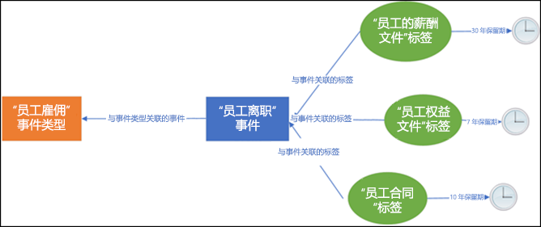
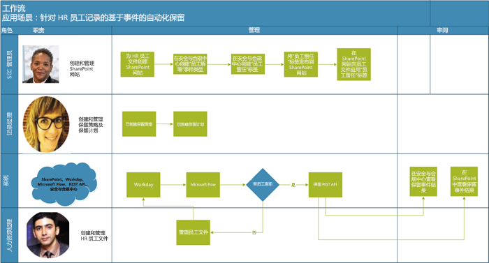
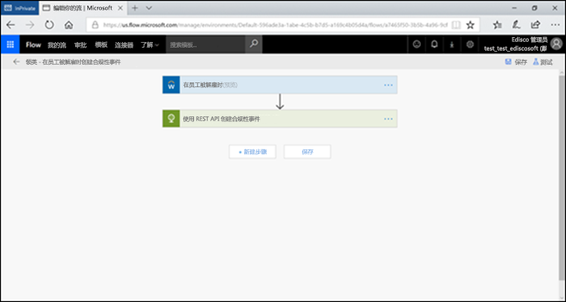
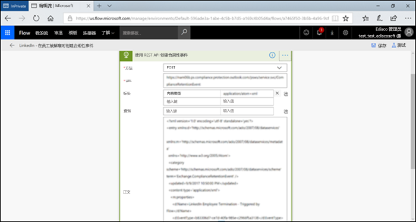
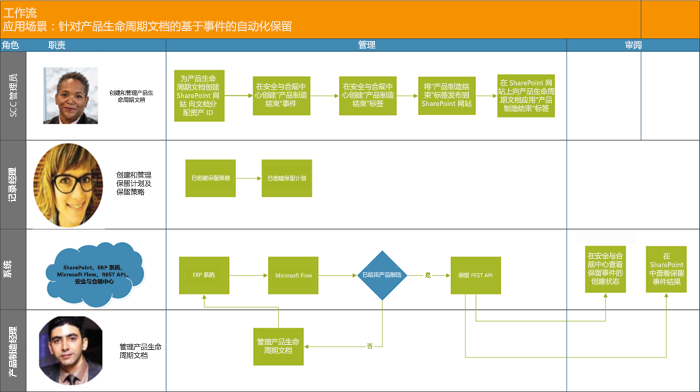

# 自动执行基于事件的保留Automate event-based retention

了解组织中呈爆炸式增长的内容以及它们如何变为 ROT（冗余、过时、无关紧要的）内容是一件头等大事。为了继续应对法律、业务和法规遵从性挑战，企业必须能够保留和保护重要信息，并快速找到相关信息。仅保留重要的相关信息是企业取得成功的关键。The explosion of content in organizations and how it can become ROT (redundant, obsolete, trivial) is serious business. To continue to meet legal, business, and regulatory compliance challenges, businesses must be able to keep and protect important information and quickly find what’s relevant. Retaining only important, pertinent information is key to a business’s success.

因此，组织可以利用 Office 365 安全与合规中心中的保留解决方案。可以使用[保留标签](labels.md)触发保留。保留标签允许选择[基于特定事件的保留期](event-driven-retention.md)。通常，保留期基于已知日期，如内容的创建日期或上次修改日期。但是，组织还要求根据事件的发生处理内容，例如在员工离开组织 7 年后进行处理。Hence organizations can take advantage of retention solutions in the Office 365 Security & Compliance Center. Retention can be triggered by using [retention labels](labels.md). A retention label has the option to [base the retention period on a specific event](event-driven-retention.md). Typically, the retention period is based on a known date, such as the creation date or last modified date for the content. However, organizations also have requirements to dispose of content based on the occurrence of an event, such as 7 years after an employee leaves an organization.

为了确保内容的合规处理，必须知道事件何时发生。随着内容量的快速增长，以及时且合规的方式保留和处理内容变得更具挑战性。In order to ensure compliant disposal of content, it is imperative to know when an event takes place. With the volume of content increasing rapidly, it is becoming challenging to retain and dispose content in a timely and compliant manner.

基于事件的保留可解决这个问题。本主题介绍如何使用 Microsoft 365 REST API 设置业务流程以通过事件自动执行保留。Event-based retention solves this problem. This topic explains how to set up your business process flows to automate retention through events by using the Microsoft 365 REST API.

## 关于基于事件的保留About event-based retention

组织可以分为小型、中型或大型组织。每天创建和管理的业务文档、法律文档、员工文件，合同和产品文档的数量正在急剧增加。An organization can be small, medium, or large. The number of business documents, legal documents, employee files, contracts, and product documents that get created and managed on a day to day basis is increasing dramatically.

例如，每天都有数十和数百名员工加入和离开组织。人力资源部门需要根据业务需求继续创建、更新或删除与员工相关的文档。此流程受为企业制定的不同保留策略的约束：For example, each day, tens and hundreds of employees are joining and leaving organizations. The HR department continues to create, update, or delete employee-related documents as per business requirements. This process is subject to the different retention policies outlined for the business:

- **内容的保留期可以是已知日期**，如内容创建、上次修改或标记的日期。例如，你可以在创建文档后将其保留 7 年，然后将其删除。**The period of retention for content can be a known date** such as the date the content was created, last modified or labeled. For example, you might retain documents for seven years after they're created and then delete them.

- **内容保留期也可以是未知日期**。例如，对于保留标签，你还可以根据特定类型事件的发生时间（如员工离开组织）来确定保留期。**The period of retention of content can also be an unknown date**. For example, with retention labels, you can also base a retention period on when a specific type of event occurs, such as an employee leaving the organization.

该事件会触发保留期的开始，并且会对已为该事件类型应用标签的所有内容强制执行标签的保留操作。这称为基于事件的保留 - 有关详细信息，请参阅[事件驱动保留概述](event-driven-retention.md)。The event triggers the start of the retention period, and all content with a label applied for that type of event get the label's retention actions enforced on them. This is called event-based retention - to learn more, see [Overview of event-driven retention](event-driven-retention.md).

## 设置基于事件的保留Set up event-based retention

本节介绍在保留内容之前需要执行的操作。This section describes what needs to be done prior to retaining content.

### 标识角色Identify records management roles

确定执行记录管理任务的组织中的不同角色，这些角色将负责有效且高效地保留业务文档。Identify the different roles in an organization that perform Record Management tasks that would be responsible for effective and efficient retention of business documents.

  | **角色****Persona**| **角色****Role**|
  | - | - |
  | 安全与合规中心管理员Security & Compliance Center | 在 SharePoint 中创建保留事件类型、保留标签和记录存储库Creates Retention Event types, Retention labels and Record repositories in SharePoint |
  | 记录经理Records manager                                  | 提供保留策略和保留计划指南和合规性详细信息Provides Retention Policies and Retention Schedules guidance and compliance details   |
  | 系统管理员（企业）System Admin (business)                          | 设置和管理外部系统以使用 Microsoft 365Sets up and manages external systems to work with Microsoft 365                       |
  | 信息工作者Information Worker                               | 管理业务流程的生命周期（人力资源、财务、IT 等）Manages the lifecycle of their business process (HR, Finance, IT etc)                 |

### 设置安全与合规中心Set up the Security & Compliance Center
  
1. 合规性管理员创建事件类型 – 例如，雇佣终止或合同到期或产品制造终止（请参阅[事件保留文章](https://docs.microsoft.com/zh-CN/office365/securitycompliance/event-driven-retention)中的分步流程）Compliance admin creates an event type – for example, Employee Termination or Contract Expiration or End of Product Manufacturing (Please refer to step by step process in [Event retention article](https://docs.microsoft.com/zh-CN/office365/securitycompliance/event-driven-retention)
    
1. 合规性管理员根据事件创建保留标签，并将标签与事件类型相关联Compliance admin creates a retention label based on an event and associates the label with an event type
    
1. 保留标签具有 4 种类型的触发器：There are 4 types of triggers for retention labels:
            
    1. 创建日期Create date
                
    1. 上次修改时间Last modified date
                
    1. 标签日期（标记内容的时间）Label date (when the content was labeled)
                
    1. 基于事件Event-based relevancy
    
1. 合规性管理员发布标签Compliance admin publishes the label

### 设置 SharePointSet up SharePoint Online
   
若要创建记录存储库，合规性管理员需要：To create a records repository, the compliance admin:

1. 创建 SharePoint 网站。Creates a site master.

1. 执行下列操作之一：Either one of the following:
        
    - 创建 SharePoint 库：在库级别设置基于事件的标签。有关详细信息，请参阅[将默认保留标签应用于 SharePoint 库、文件夹或文档集中的所有内容](labels.md#applying-a-default-retention-label-to-all-content-in-a-sharepoint-library-folder-or-document-set)。Creates a SharePoint library: Set event-based label at the library level. For more information, see [Applying a default retention label to all content in a SharePoint library, folder, or document set](labels.md#applying-a-default-retention-label-to-all-content-in-a-sharepoint-library-folder-or-document-set).
          
    - 在 SharePoint 中设置文档集。有关详细信息，请参阅[文档集简介](https://support.office.com/zh-CN/article/Introduction-to-Document-Sets-3DBCD93E-0BED-46B7-B1BA-B31DE2BCD234)。Sets up a Document set in SharePoint. For more information, see [Introduction to document sets](https://support.office.com/zh-CN/article/Introduction-to-Document-Sets-3DBCD93E-0BED-46B7-B1BA-B31DE2BCD234).
      
1. 为每个员工文档集分配资产 ID（资产 ID 是组织使用的产品名称或代码，例如员工编号可以是资产 ID）。通过将资产 ID 分配给文件夹，该文件夹中的每个项目都会自动继承相同的资产 ID。这意味着所有项目的保留期都可以由同一事件触发。Assigns Asset Id (asset ID is a product name or code used by the organization, for example, Employee number can be an asset id) to each employee document set (By assigning the asset ID to the folder, every item in that folder automatically inherits the same asset ID. This means all the items can have their retention period triggered by the same event.

## 触发基于事件的保留的方法Ways to trigger event-based retention

可通过两种方法触发基于事件的保留：There are two ways in which event-based retention can be triggered:

- **使用安全与合规中心 UI** 此流程适用于一次保留较少内容或者不经常触发保留的情形，例如每月或每年保留一次。有关此方法的详细信息，请参阅[事件驱动保留概述](event-driven-retention.md)。但是，这种触发保留的方法可能比较耗时且容易出错，这会影响可伸缩性。用于触发保留的自动化无缝解决方案可以增强数据的安全性和合规性。**Using Security & Compliance Center UI** This is a process that can be used to retain less content at a time or the frequency to trigger retention is not often, such as monthly or yearly. For more information on this method, see [Overview of event-driven retention](event-driven-retention.md). However, this way to trigger retention can be time-consuming and prone to error, thus stunting scalability. Therefore, an automated, seamless solution to trigger retention can enhance the security and compliance of data.

- **使用 M365 REST API** 当一次保留大量内容和/或触发保留的频率通常是每天或每周时，可以使用此流程。该流程会检测你的业务线系统中何时发生事件，然后在安全与合规中心自动创建相关事件。每次发生事件时，你无需在 UI 中手动创建事件。**Using a M365 REST API** This process can be used when large amounts of content are to be retained at a time and/or the frequency to trigger retention is often such as daily or weekly. The flow detects when an event occurs in your line-of-business system, and then automatically creates a related event in the Security & Compliance Center. You don't need to manually create an event in the UI each time one occurs.

使用 REST API 有两种选择：There are two options for using the REST API:

- **Microsoft Flow 或类似的应用程序**可用于自动触发事件的发生。Microsoft Flow 是用于连接到其他系统的协调程序。使用 Microsoft Flow 不需要自定义解决方案。**Microsoft Flow or a similar application** can be used to trigger the occurrence of an event automatically. Microsoft Flow is an orchestrator for connecting to other systems. Using Microsoft Flow does not require a custom solution.

- \*\*使用 PowerShell 或 HTTP 客户端调用 REST API \*\*使用 PowerShell（版本 6 或更高版本）调用 Microsoft 365 REST API 以创建事件。**PowerShell or an HTTP client to call REST API** Using PowerShell (version 6 or higher) to call Microsoft 365 REST API to create events. 

Rest API 是一个支持多组 HTTP 操作（方法）的服务终结点，提供对服务资源的创建/检索/更新/删除操作权限 - 有关详细信息，请参阅 [REST API 请求/响应组件](https://docs.microsoft.com/zh-CN/rest/api/gettingstarted/#components-of-a-rest-api-requestresponse)。在这种情况下，通过使用 Microsoft 365 REST API，可以使用 POST 和 GET 操作（方法）来创建和检索事件。A Rest API is a service endpoint that supports sets of HTTP operations (methods), which provide create/retrieve/update/delete access to the service's resources - for more information, see [Components of a REST API request/response](https://docs.microsoft.com/zh-CN/rest/api/gettingstarted/#components-of-a-rest-api-requestresponse). In this case, by using the Microsoft 365 REST API, events can be created and retrieved using operations (methods) POST and GET.

## 示例场景Example large list scenarios

让我们以如下场景为例。Let’s consider the following scenarios.

### 场景 1：员工离开组织Scenario 1: Employees leaving the organization 

组织为每个员工创建和存储许多员工相关文档。这些文档在每位员工的雇佣期内进行管理和保留。但是，当员工离开组织或终止雇佣关系时，组织有义务根据法律和业务要求在规定的时间内保留该员工的文档。An organization creates and stores numerous employee related documents per employee. These documents are managed and retained during the employment of each employee. However, when the employee leaves the organization or the employment is terminated, the organization is obligated by legal and business requirements to retain the documents of that employee for a stipulated period.

现在，如果每天有多名员工离开组织，组织必须在每天触发数百甚至数千个文档的保留期。Now if multiple employees leave the organization every day, the organization must trigger the retention clock of hundreds if not thousands of documents each day.

除此之外，还需要根据员工记录的类型计算每个员工的保留期，即雇佣终止日期 + 天数、月数或年数。例如，同一员工的职工薪酬档案与福利档案可能需要不同的保留期。In addition to this, the retention period needs to be calculated for each of these employees as Employee termination date + number of days, months or years based on the type of the employee record. For example, worker’s compensation of the employee vs benefits filings of the same employee may need different retention.

下图显示如何将多个标签与单个事件关联。在此处，员工薪酬标签下的所有文件和员工福利标签下的所有文件都与单个事件相关联，即员工离开组织。每个不同的文件都有不同的保留期。因此，当员工离开组织时，每个标签中的这些文件都会经历不同的保留期。为每个员工的每种文件类型或标签触发所有这些不同的保留期是一项极具挑战的任务。想象一下，为多名员工做这件事将会如何。The diagram below shows how there can be multiple labels that are associated with a single event. Here all the files under Worker’s compensation label and all the files under Employee benefits label are both associated with a single event which is the employee leaving the organization. Each of these different files have different retention clocks. So, when an employee leaves the organization, these files within each label experience a different retention period. To trigger all these different retention clocks for each file type or label for each employee is a very challenging task. Imagine doing this for multiple employees.

为多个员工触发这些不同保留期的自动化流程将节省时间、无错误且极为高效。Hence an automated process to trigger these different retention clocks for multiple employees will be time-saving, error-free and extremely efficient .

**为此场景配置基于事件的自动保留：****Configuring Automated Event Based Retention for this scenario:**

  - 管理员为文档集创建员工文件夹，如 Jane Doe、John Smith。Admin c reates employee folders to the Document set such as Jane Doe, John Smith.

  - 管理员将员工文件（如福利、工资单、员工薪酬）添加到每个员工文件夹中Admin adds employee files such as Benefits, Payroll, Worker’s Compensation to each employee folder

  - 管理员为每个员工文件夹分配资产 ID。Admin assigns Asset Id to each employee folder. 

  - SCC 管理员SCC Admin l

  - 登录到安全与合规中心ogs into the Security & Compliance Center

  - SCC 管理员在安全与合规中心创建与员工相关的事件类型，如“雇佣终止”、“员工雇用”事件。SCC Admin creates employee related events types such as “Employee Termination”, “Employee Hire” events in Security and Compliance Center.

  - SCC 管理员在安全与合规中心创建“员工保留”标签。SCC Admin creates “Employee Retention” label in Security and Compliance Center.

  - 此“员工保留”标签将手动或自动发布并应用于 SharePoint 中的员工文件This “Employee Retention” label is published and applied manually or automatically to the employee files in SharePoint

  - HR 管理系统（如 Workday）可以与 Microsoft Flow 一起定期运行以管理员工文件HR Management System like Workday can work with Microsoft Flow to run periodically to manage employee files

  - 如果员工离开组织，Flow 将触发 M365 基于事件的保留 REST API，该 API 将开始特定员工文件的保留期。If an employee has left the organization, the Flow will trigger the M365 Event Based Retention REST API that will begin the retention clock on the specific employee’s files.

#### 使用 Microsoft FlowUsing Microsoft Flow

步骤 1 - 使用 Microsoft 365 REST API 创建用于创建事件的流Step 1- Create a flow to create an event using the Microsoft 365 REST API

##### 创建事件Step 5: Create an event

用于调用 REST API 的示例代码Sample code to call the REST API

<table>
<thead>
<tr class="header">
<th>方法Method</th>
<th>POSTPost</th>
<th></th>
</tr>
</thead>
<tbody>
<tr class="odd">
<td>URLURL</td>
<td>https://ps.compliance.protection.outlook.com/psws/service.svc/ComplianceRetentionEvent)</td>
<td></td>
</tr>
<tr class="even">
<td>标头%%Headers%%</td>
<td>Content-TypeContent-Type</td>
<td>application/atom+xmlapplication/atom+xml</td>
</tr>
<tr class="odd">
<td>正文Body</td>
<td>
&lt;?xml version='1.0' encoding='utf-8' standalone='yes'?&gt;&lt;?xml version='1.0' encoding='utf-8' standalone='yes'?&gt;

&lt;entry xmlns:d='http://schemas.microsoft.com/ado/2007/08/dataservices'&lt;entry xmlns:d='http://schemas.microsoft.com/ado/2007/08/dataservices'

xmlns:m='http://schemas.microsoft.com/ado/2007/08/dataservices/metadata'xmlns:m='http://schemas.microsoft.com/ado/2007/08/dataservices/metadata'

xmlns='http://www.w3.org/2005/Atom'&gt;xmlns='http://www.w3.org/2005/Atom'&gt;

&lt;category scheme='http://schemas.microsoft.com/ado/2007/08/dataservices/scheme' term='Exchange.ComplianceRetentionEvent' /&gt;&lt;category scheme='http://schemas.microsoft.com/ado/2007/08/dataservices/scheme' term='Exchange.ComplianceRetentionEvent' /&gt;

&lt;updated&gt;9/9/2017 10:50:00 PM&lt;/updated&gt;&lt;updated&gt;9/9/2017 10:50:00 PM&lt;/updated&gt;

&lt;content type='application/xml'&gt;&lt;content type='application/xml'&gt;

&lt;m:properties&gt;&lt;m:properties&gt;

&lt;d:Name&gt;Employee Termination &lt;/d:Name&gt;&lt;d:Name&gt;Employee Termination &lt;/d:Name&gt;

&lt;d:EventType&gt;99e0ae64-a4b8-40bb-82ed-645895610f56&lt;/d:EventType&gt;&lt;d:EventType&gt;99e0ae64-a4b8-40bb-82ed-645895610f56&lt;/d:EventType&gt;

&lt;d:SharePointAssetIdQuery&gt;1234&lt;/d:SharePointAssetIdQuery&gt;&lt;d:SharePointAssetIdQuery&gt;1234&lt;/d:SharePointAssetIdQuery&gt;

&lt;d:EventDateTime&gt;2018-12-01T00:00:00Z &lt;/d:EventDateTime&gt;&lt;d:EventDateTime&gt;2018-12-01T00:00:00Z &lt;/d:EventDateTime&gt;

&lt;/m:properties&gt;&lt;/m:properties&gt;

&lt;/content&gt;&lt;Content&gt;

&lt;/entry&gt;Entry
</td>
<td></td>
</tr>
<tr class="even">
<td>身份验证Authentication</td>
<td>基本Basic</td>
<td></td>
</tr>
<tr class="odd">
<td>用户名Username</td>
<td>“Complianceuser”“Complianceuser”</td>
<td></td>
</tr>
<tr class="even">
<td>密码Password</td>
<td>“Compliancepassword”“Compliancepassword”</td>
<td></td>
</tr>
</tbody>
</table>

##### 可用参数Available switches and parameters

<table>
<thead>
<tr class="header">
<th><strong>参数</strong><strong>Parameters</strong></th>
<th><strong>说明</strong><strong>Description</strong></th>
<th><strong>注释</strong><strong>Notes</strong></th>
</tr>
</thead>
<tbody>
<tr class="odd">
<td>&lt;d:Name&gt;&lt;/d:Name&gt;&lt;d:Name&gt;&lt;/d:Name&gt;</td>
<td>为事件提供唯一的名称，Provide a unique name for the event,</td>
<td>不能包含尾随空格和以下字符：% \* \ &amp; &lt; &gt; | # ? , : ;Cannot contain trailing spaces, and the following characters: % \* \ &amp; &lt; &gt; | # ? , : ;</td>
</tr>
<tr class="even">
<td>&lt;d:EventType&gt;&lt;/d:EventType&gt;&lt;d:EventType&gt;&lt;/d:EventType&gt;</td>
<td>输入事件类型名称（或 Guid），Enter event type name (or Guid),</td>
<td>示例：“雇佣终止”。事件类型必须与保留标签相关联。Example: “Employee termination”. Event type has to be associated with a retention label.</td>
</tr>
<tr class="odd">
<td>&lt;d:SharePointAssetIdQuery&gt;&lt;/d:SharePointAssetIdQuery&gt;&lt;d:SharePointAssetIdQuery&gt;&lt;/d:SharePointAssetIdQuery&gt;</td>
<td>输入“ComplianceAssetId:” + 员工 IdEnter “ComplianceAssetId:” + employee Id</td>
<td>示例：&quot;ComplianceAssetId:12345&quot;Example:&quot;ComplianceAssetId:12345&quot;</td>
</tr>
<tr class="even">
<td>&lt;d:EventDateTime&gt;&lt;/d:EventDateTime&gt;&lt;d:EventDateTime&gt;&lt;/d:EventDateTime&gt;</td>
<td>事件日期和时间Event Date and Time</td>
<td>
格式：yyyy-MM-ddTHH:mm:ssZ，示例：Format: yyyy-MM-ddTHH:mm:ssZ, Example:

2018-12-01T00:00:00Z2018-12-01T00:00:00Z
</td>
</tr>
</tbody>
</table>

##### 响应代码Response codes

| **响应代码****Response code** | **说明****Description**       |
| ----------------- | --------------------- |
| 302302 seconds               | 重定向Redirect              |
| 2012:01               | 已创建Created               |
| 403403               | 授权失败Authorization Failed  |
| 401401               | 身份验证失败Authentication Failed Message |

##### 根据时间范围获取事件Get Events based on time range

<table>
<thead>
<tr class="header">
<th>方法Method</th>
<th>GETGet</th>
<th></th>
</tr>
</thead>
<tbody>
<tr class="odd">
<td>URLURL</td>
<td><ol start="4" type="1">
<li>
https://ps.compliance.protection.outlook.com/psws/service.svc/ComplianceRetentionEvent?BeginDateTime=2019-01-11&amp;EndDateTime=2019-01-16https://ps.compliance.protection.outlook.com/psws/service.svc/ComplianceRetentionEvent?BeginDateTime=2019-01-11&amp;EndDateTime=2019-01-16
</li>
</ol></td>
<td></td>
</tr>
<tr class="even">
<td>标头%%Headers%%</td>
<td>Content-TypeContent-Type</td>
<td>application/atom+xmlapplication/atom+xml</td>
</tr>
<tr class="odd">
<td></td>
<td></td>
<td></td>
</tr>
<tr class="even">
<td>身份验证Authentication</td>
<td>基本Basic</td>
<td></td>
</tr>
<tr class="odd">
<td>用户名Username</td>
<td>“Complianceuser”“Complianceuser”</td>
<td></td>
</tr>
<tr class="even">
<td>密码Password</td>
<td>“Compliancepassword”“Compliancepassword”</td>
<td></td>
</tr>
</tbody>
</table>

##### 响应代码Response codes

| **响应代码****Response code** | **说明****Description**                   |
| ----------------- | --------------------------------- |
| 200200 GB               | 正常，atom+ xml 中的事件列表OK, A list of events in atom+ xml |
| 404404 errors               | 未找到Not found                         |
| 302302 seconds               | 重定向Redirect                          |
| 401401               | 授权失败Authorization Failed              |
| 403403               | 身份验证失败Authentication Failed Message             |

##### 按 ID 获取事件。Get an event by ID

| 方法Method         | GETGet   |                      |
| -------------- | ------------------------------------------------------------------------------------------------------------------------------------------------------------------------------------------------------------------------------------------------------------------ | -------------------- |
| URLURL            | [https://ps.compliance.protection.outlook.com/psws/service.svc/ComplianceRetentionEvent(‘174e9a86-74ff-4450-8666-7c11f7730f66’)](https://ps.compliance.protection.outlook.com/psws/service.svc/ComplianceRetentionEvent\('174e9a86-74ff-4450-8666-7c11f7730f66'\))[https://ps.compliance.protection.outlook.com/psws/service.svc/ComplianceRetentionEvent(‘174e9a86-74ff-4450-8666-7c11f7730f66’)](https://ps.compliance.protection.outlook.com/psws/service.svc/ComplianceRetentionEvent\('174e9a86-74ff-4450-8666-7c11f7730f66'\)) |                      |
| 标头header         | Content-TypeContent-Type                                                                                                                                                                                                                                                       | application/atom+xmlapplication/atom+xml |
| 身份验证Authentication | 基本Basic                                                                                                                                                                                                                                                              |                      |
| 用户名Username       | “Complianceuser”“Complianceuser”                                                                                                                                                                                                                                                   |                      |
| 密码Password       | “Compliancepassword”“Compliancepassword”                                                                                                                                                                                                                                               |                      |

##### 响应代码Response codes

| **响应代码****Response code** | **说明****Description**                                      |
| ----------------- | ---------------------------------------------------- |
| 200200 GB               | 正常，响应正文包含 atom+xml 中的事件OK, The response body contains the event in atom+xml |
| 404404 errors               | 未找到Not found                                            |
| 302302 seconds               | 重定向Redirect                                             |
| 401401               | 授权失败Authorization Failed                                 |
| 403403               | 身份验证失败Authentication Failed Message                                |

##### 按名称获取事件Get an event by name

| 方法Method         | GETGet       |                      |
| -------------- | -------------------------------------------------------------------------------------------------------------------------------------------- | -------------------- |
| URLURL            | <https://ps.compliance.protection.outlook.com/psws/service.svc/ComplianceRetentionEvent('EventByRESTPost-2226bfebcc2841a8968ba71f9516b763')> |                      |
| 标头%%Headers%%        | Content-TypeContent-Type                                                                                                                                 | application/atom+xmlapplication/atom+xml |
| 身份验证Authentication | 基本Basic                                                                                                                                        |                      |
| 用户名Username       | “Complianceuser”“Complianceuser”                                                                                                                             |                      |
| 密码Password       | “Compliancepassword”“Compliancepassword”                                                                                                                         |                      |

##### 响应代码Response codes

| **响应代码****Response code** | **说明****Description**                                      |
| ----------------- | ---------------------------------------------------- |
| 200200 GB               | 正常，响应正文包含 atom+xml 中的事件OK, The response body contains the event in atom+xml |
| 404404 errors               | 未找到Not found                                            |
| 302302 seconds               | 重定向Redirect                                             |
| 401401               | 授权失败Authorization Failed                                 |
| 403403               | 身份验证失败Authentication Failed Message                                |

#### 使用 PowerShell（版本 6 或更高版本）或任何 HTTP 客户端Using PowerShell (ver.6 or higher) or any HTTP client

步骤 1：连接到 PowerShell。Step 1: Connect to Exchange Online using remote PowerShell

步骤 2：运行以下脚本。Step 2: Run the following script.

<table>
<tbody>
<tr class="odd">
<td>
param([string]$baseUri)param([string]$baseUri)

$userName = &quot;admin@o365ediscoverydemo.onmicrosoft.com&quot;$userName = &quot;admin@o365ediscoverydemo.onmicrosoft.com&quot;

$password = &quot;EDiscoO365Demo&quot;$password = &quot;EDiscoO365Demo&quot;

$securePassword = ConvertTo-SecureString $password -AsPlainText -Force$securePassword = ConvertTo-SecureString $password -AsPlainText -Force

$credentials = New-Object System.Management.Automation.PSCredential($userName, $securePassword)$credentials = New-Object System.Management.Automation.PSCredential($userName, $securePassword)

$EventName=&quot;EventByRESTPost-$(([Guid]::NewGuid()).ToString('N'))&quot;$EventName=&quot;EventByRESTPost-$(([Guid]::NewGuid()).ToString('N'))&quot;

Write-Host &quot;Start to create an event with name: $EventName&quot;Write-Host &quot;Start to create an event with name: $EventName&quot;

$body = &quot;&lt;?xml version='1.0' encoding='utf-8' standalone='yes'?&gt;$body = &quot;&lt;?xml version='1.0' encoding='utf-8' standalone='yes'?&gt;

&lt;entry xmlns:d='http://schemas.microsoft.com/ado/2007/08/dataservices'&lt;entry xmlns:d='http://schemas.microsoft.com/ado/2007/08/dataservices'

xmlns:m='http://schemas.microsoft.com/ado/2007/08/dataservices/metadata'xmlns:m='http://schemas.microsoft.com/ado/2007/08/dataservices/metadata'

xmlns='http://www.w3.org/2005/Atom'&gt;xmlns='http://www.w3.org/2005/Atom'&gt;

&lt;category scheme='http://schemas.microsoft.com/ado/2007/08/dataservices/scheme' term='Exchange.ComplianceRetentionEvent' /&gt;&lt;category scheme='http://schemas.microsoft.com/ado/2007/08/dataservices/scheme' term='Exchange.ComplianceRetentionEvent' /&gt;

&lt;updated&gt;7/14/2017 2:03:36 PM&lt;/updated&gt;&lt;updated&gt;7/14/2017 2:03:36 PM&lt;/updated&gt;

&lt;content type='application/xml'&gt;&lt;content type='application/xml'&gt;

&lt;m:properties&gt;&lt;m:properties&gt;

&lt;d:Name&gt;$EventName&lt;/d:Name&gt;&lt;d:Name&gt;$EventName&lt;/d:Name&gt;

&lt;d:EventType&gt;e823b782-9a07-4e30-8091-034fc01f9347&lt;/d:EventType&gt;&lt;d:EventType&gt;e823b782-9a07-4e30-8091-034fc01f9347&lt;/d:EventType&gt;

&lt;d:SharePointAssetIdQuery&gt;'ComplianceAssetId:123'&lt;/d:SharePointAssetIdQuery&gt;&lt;d:SharePointAssetIdQuery&gt;'ComplianceAssetId:123'&lt;/d:SharePointAssetIdQuery&gt;

&lt;/m:properties&gt;&lt;/m:properties&gt;

&lt;/content&gt;&lt;Content&gt;

&lt;/entry&gt;&quot;Entry

$event = $null$event = $null

trytry{

{

$event = Invoke-RestMethod -Body $body -Method 'POST' -Uri &quot;$baseUri/ComplianceRetentionEvent&quot; -ContentType &quot;application/atom+xml&quot; -Authentication Basic -Credential $credentials -MaximumRedirection 0$event = Invoke-RestMethod -Body $body -Method 'POST' -Uri &quot;$baseUri/ComplianceRetentionEvent&quot; -ContentType &quot;application/atom+xml&quot; -Authentication Basic -Credential $credentials -MaximumRedirection 0

}

catchcatch{

{

$response = $_.Exception.Response$response = $_.Exception.Response

if($response.StatusCode -eq &quot;Redirect&quot;)if($response.StatusCode -eq &quot;Redirect&quot;)

{

$url = $response.Headers.Location$url = $response.Headers.Location

Write-Host &quot;redirected to $url&quot;Write-Host &quot;redirected to $url&quot;

$event = Invoke-RestMethod -Body $body -Method 'POST' -Uri $url -ContentType &quot;application/atom+xml&quot; -Authentication Basic -Credential $credentials -MaximumRedirection 0$event = Invoke-RestMethod -Body $body -Method 'POST' -Uri $url -ContentType &quot;application/atom+xml&quot; -Authentication Basic -Credential $credentials -MaximumRedirection 0

}

}

$event | fl \*$event | fl \*
</td>
</tr>
</tbody>
</table>

#### 验证两个选项的结果Verify the outcome in both options

步骤 1：转到安全与合规中心Go to the Security & Compliance Center

步骤 2：单击“数据治理”下的“事件”Step 2: Click on Events under Data Governance

步骤 3：验证已创建事件。Step 3: Verify Event has been created.

同样，上述用于自动执行基于事件的保留的选项也可用于以下场景。Similarly, the above options to automate event based retention can be used for the following scenarios as well.

### 场景 2：合同到期Scenario 2: Contracts Expiring

对于与客户、供应商和合作伙伴签订的单份合同，组织可能拥有多条记录。这些文档可以驻留在 SharePoint 等文档库中。合同的终止决定了与合同关联的文档保留期的开始。例如：与合同相关的所有记录都需要在合同到期后保留 5 年。触发 5 年保留期的事件是合同到期。An organization can have multiple records for a single contract with customers, vendors and partners. These documents can reside in a document library like SharePoint. The ending of a contract determines the start of the retention period of the documents associated with the contract. For example: all records related to contracts need to be retained for five years from the time the contract expires. The event that triggers the five-year retention period is the expiration of the contract.

客户关系管理 (CRM) 系统可以与 Microsoft 365 一起使用，用于触发合同文档的保留。A Customer Relationship Management (CRM) system can work with Microsoft 365 and trigger retention of Contract documents

**为此场景配置基于事件的自动保留：****Configuring Automated Event Based Retention for this scenario:**

  - 管理员为每种合同类型创建一个包含各种文件夹的 SharePoint 库。Admin creates a SharePoint library with various folders for each contract type.

  - 管理员将合同文件（如许可合同、开发合同）添加到每个合同文件夹Admin adds contract files such as License Contracts, Development Contracts to each contract folder

  - 管理员为每个合同文件夹分配资产 IDAdmin assigns Asset Id to each contract folder

  - SCC 管理员登录到安全与合规中心SCC Admin logs into the Security & Compliance Center

  - SCC 管理员在安全与合规性中心创建与合同相关的事件类型，如“合同创建”和“合同到期”事件。SCC Admin creates contract related events types such as “Contract Creation”, “Contract Expiration” events in Security and Compliance Center.

  - SCC 管理员在安全与合规中心创建“合同到期”标签。SCC Admin creates “Contract Expiration” label in Security and Compliance Center.

  - 此“合同到期”标签将手动或自动发布并应用于 SharePoint 中的合同文件This “ Contract Expiration” label is published and applied manually or automatically to the contract files in SharePoint

  - 合同管理系统可以与 Microsoft Flow 或类似的应用程序一起定期运行以管理合同文件Contract Management System can work with Microsoft Flow or a similar application to run periodically to manage contract files

  - 如果合同到期，Microsoft Flow 将触发 M365 基于事件的保留 REST API，该 API 将开始特定合同文件的保留期。If a contract expires, Microsoft Flow will trigger the M365 Event Based Retention REST API that will begin the retention clock on the specific contract’s files.

### 场景 3：产品制造终止Scenario 3: End of Product Manufacturing

一家生产不同产品系列的制造公司创建了许多制造规格和定价文件。当不再生产某款产品时，与该产品相关的所有规格和文件都需要在产品生存期结束后的特定时间内保留。A manufacturing company that produces different lines of products creates many manufacturing specifications and pricing documents. When the product is no longer manufactured, all specifications and documents linked to this product need to be retained for a specific period after the end of the lifetime of the product.

企业资源规划 (ERP) 系统可以与 Microsoft 365 和 Microsoft Flow 一起使用，用于触发保留。An Enterprise Resource Planning (ERP) system can work with Microsoft 365 and Microsoft Flow to trigger retention.

**为此场景配置基于事件的自动保留：****Configuring Automated Event Based Retention for this scenario:**

  - 管理员在文档集中创建产品文件夹，如产品 1、产品 2 等。Admin creates product folders in the Document set such as Product 1, Product 2, etc.

  - 管理员将产品文件（如制造规格、产品定价、产品许可）添加到每个产品文件夹中Admin adds product files such as Manufacturing Specifications, Product Pricing, Product licensing to each product folder

  - 管理员为每个产品文件夹分配资产 ID。Admin assigns Asset Id to each productfolder.

  - SCC 管理员登录到安全与合规中心SCC Admin logs into the Security & Compliance Center

  - SCC 管理员在安全与合规中心创建与员工相关的事件类型，如“产品制造开始”和“产品制造结束”事件。SCC Admin creates employee related events types such as “Start of Product Manufacturing”, “End of Product Manufacturing” events in Security and Compliance Center.

  - SCC 管理员在安全与合规中心创建“产品制造终止”标签。SCC Admin creates “End of Product Manufacturing” label in Security and Compliance Center.

  - 此“产品制造终止”标签将手动或自动发布并应用于 SharePoint 中的产品文件This “ End of Product Manufacturing” label is published and applied manually or automatically to the product files in SharePoint

  - ERP 系统可以与 Microsoft Flow 或类似的应用程序一起定期运行以管理产品文件ERP Systems can work with Microsoft Flow or similar applications to run periodically to manage product files

  - 如果产品制造终止，Microsoft Flow 将触发 M365 基于事件的保留 REST API，该 API 将开始特定产品文件的保留期。If the manufacturing of a product ends, Microsoft Flow will trigger the M365 Event Based Retention REST API that will begin the retention clock on the specific product’s files.

## 附录Appendix

### 使用重定向 302 响应结果来调用 REST APIUsing Redirect 302 response results to call the REST API

1.  使用 REST API URL <https://ps.compliance.protection.outlook.com/psws/service.svc/ComplianceRetentionEvent> 调用 POST 保留事件调用（需要全局管理员权限）Invoke a POST retention event call using the REST API URL <https://ps.compliance.protection.outlook.com/psws/service.svc/ComplianceRetentionEvent> (Global Admin permissions are required)

2.  检查响应代码。如果是 302，则从响应标头的“位置”属性中获取重定向的 URLCheck the response code. If it’s 302, then get the redirected URL from Location property of the response header

3.  使用重定向的 URL 再次调用 POST 保留事件调用。Invoke the POST retention event call again using the redirected URL.

## 制作人员Credits

本主题经过以下人员的审阅：This topic was reviewed by:

Antonio MaioAntonio Maio Microsoft Office 应用和服务 MVPMicrosoft Office Apps and Services MVP  Antonio.Maio@Protiviti.comAntonio.Maio@Protiviti.com
