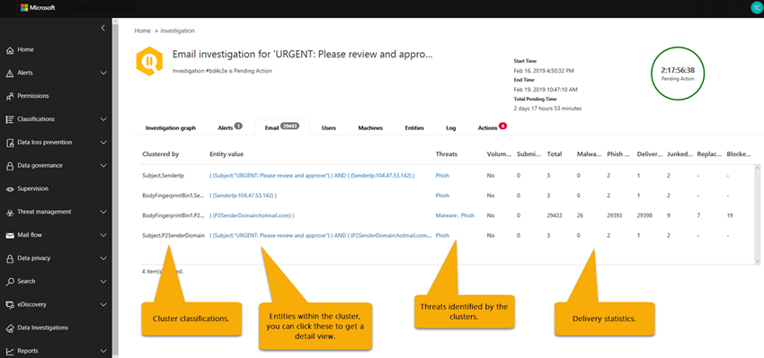

# Office 365 中的自动事件响应（空气）Automated incident response (AIR) in Office 365

自动化事件响应（空中）功能（包括在[Office 365 高级威胁防护](office-365-atp.md)计划2中）使你能够运行自动化的调查过程，以应对目前存在的已知威胁。Automated incident response (AIR) capabilities (included in [Office 365 Advanced Threat Protection](office-365-atp.md) Plan 2) enable you to run automated investigation processes in response to well known threats that exist today. 阅读本文以了解空气的概述，以及它如何帮助您的组织和安全操作团队更有效地缓解威胁。Read this article to get an overview of AIR and how it can help your organization and security operations teams mitigate threats more effectively and efficiently. 若要开始使用 AIR，请参阅[在 Office 365 中自动调查和响应威胁](office-365-air.md)。To get started using AIR, see [Automatically investigate and respond to threats in Office 365](office-365-air.md).

> [!NOTE]
> 您必须是全局管理员、安全管理员、安全操作员或安全读者才能执行本文中所述的任务。You must be a global administrator, security administrator, security operator, or security reader to perform the tasks described in this article. 若要了解详细信息，请参阅[Microsoft 365 安全中心：角色和权限](https://docs.microsoft.com/office365/securitycompliance/microsoft-security-and-compliance#required-licenses-and-permissions)。To learn more, see [Microsoft 365 security center: roles and permissions](https://docs.microsoft.com/office365/securitycompliance/microsoft-security-and-compliance#required-licenses-and-permissions).

## 空气的整体流动The overall flow of AIR

从较高的层次来看，空气流的工作原理如下所示：At a high level, the AIR flow works like this:

|阶段Phase  |涉及的内容What's involved  |
|---------|---------|
|11     |触发的[警报](#alerts)，以及[安全行动手册](#security-playbooks)启动。An [alert](#alerts) that is triggered, and a [security playbook](#security-playbooks) initiates.         |
|双面2     |根据特定的警报和安全行动手册，[自动调查立即开始](#example-a-user-reported-phish-message-launches-an-investigation-playbook)。Depending on the particular alert and security playbook, [automated investigation begins immediately](#example-a-user-reported-phish-message-launches-an-investigation-playbook). （或者，安全分析员可以[手动开始进行自动调查](#example-a-security-administrator-triggers-an-investigation-from-threat-explorer)，从报告中的值（如[Explorer](threat-explorer.md)）。(Alternately, a security analyst can [start an automated investigation manually](#example-a-security-administrator-triggers-an-investigation-from-threat-explorer), from a value in a report such as [Explorer](threat-explorer.md).)         |
|第三章3     |自动调查运行时，其范围可能会随着新的相关警报的触发而增加。While an automated investigation runs, its scope can increase as new, related alerts are triggered.         |
|44     |在自动调查期间和之后，可以查看[详细信息和结果](#investigation-graph)。During and after an automated investigation, [details and results](#investigation-graph) are available to view. 结果包括[建议的操作](#recommended-actions)，可采取这些操作来响应和修正发现的任何威胁。Results include [recommended actions](#recommended-actions) that can be taken to respond and remediate any threats that were found. 此外，还可以使用[行动手册日志](#playbook-log)来跟踪所有调查活动。In addition, a [playbook log](#playbook-log) is available that tracks all investigation activity. 如果您的组织使用的是自定义报告解决方案或第三方解决方案，则可以[使用 Office 365 管理活动 API](office-365-air.md#use-the-office-365-management-activity-api-for-custom-or-third-party-reporting-solutions)来查看有关自动调查和威胁的信息。If your organization is using a custom reporting solution or a third-party solution, you can [use the Office 365 Management Activity API](office-365-air.md#use-the-office-365-management-activity-api-for-custom-or-third-party-reporting-solutions) to view information about automated investigations and threats.         |
|55     |您的安全操作团队将检查结果和建议，并批准修正操作。Your security operations team reviews the results and recommendations, and approves remediation actions. 在 Office 365 中，仅在组织的安全团队批准时才采取更正措施。In Office 365, remediation actions are taken only upon approval by your organization's security team.         |

以下各节提供了有关空中的更多详细信息，包括有关警报、安全行动手册和调查详细信息的详细信息。The following sections provide more details about AIR, including details about alerts, security playbooks, and investigation details. 此外，本文还介绍了如何提供空中工作的两个示例。In addition, two examples of how AIR works are included in this article. 若要开始使用 AIR，请参阅[在 Office 365 中自动调查和响应威胁](office-365-air.md)。To get started using AIR, see [Automatically investigate and respond to threats in Office 365](office-365-air.md).

## 警报Alerts

[警报](alert-policies.md#viewing-alerts)表示用于事件响应的安全操作团队工作流的触发器。[Alerts](alert-policies.md#viewing-alerts) represent triggers for security operations team workflows for incident response. 确定要调查的正确通知集的优先级，同时确保没有威胁是 unaddressed 的挑战。Prioritizing the right set of alerts for investigation, while making sure no threats are unaddressed is challenging. 在手动对通知进行调查时，安全操作团队必须在威胁的风险下对实体（例如，内容、设备和用户）进行搜寻和关联。When investigations into alerts are performed manually, Security Operations teams must hunt and correlate entities (e.g. content, devices and users) at risk from threats. 此类任务和工作流非常耗时，并涉及多个工具和系统。Such tasks and workflows are very time consuming and involve multiple tools and systems. 通过空气、调查和响应自动化到关键安全和威胁管理警报，可自动触发安全响应行动手册。With AIR, investigation and response are automated into key security and threat management alerts that trigger your security response playbooks automatically. 

在空中的初始发行版（2019年4月开始），根据以下单个事件通知策略生成的警报将自动调查。In the initial release of AIR (beginning April 2019), alerts generated from following single events alert policies are auto-investigated. 

- 检测到潜在的恶意 URL 单击A potentially malicious URL click was detected

- 用户报告为网络钓鱼的电子邮件 \*Email reported by user as phish\*

- 包含在传递后删除的恶意软件的电子邮件 \*Email messages containing malware removed after delivery\*

- 包含在传递后删除的网络钓鱼 Url 的电子邮件 \*Email messages containing phish URLs removed after delivery\*

> [!NOTE]
> 已将这些警报分配给安全 & 合规性中心内的各个警报策略中的 "信息性" 严重性，并关闭电子邮件通知。These alerts have been assigned an "Informational" severity in the respective alert policies within the Security & Compliance Center with email notifications turned off. 可以通过警报策略配置启用这些策略。These can be turned on through the Alert policy configuration.

若要查看警报，请在安全 & 合规性中心中，选择 "**通知** > " "**查看警报**"。To view alerts, in the Security & Compliance Center, choose **Alerts** > **View alerts**. 选择一个警报以查看其详细信息，然后在那里使用 "**查看调查**" 链接转到相应的[调查](#investigation-graph)。Select an alert to view its details, and from there, use the **View investigation** link to go to the corresponding [investigation](#investigation-graph). 请注意，默认情况下通知视图中隐藏了信息警报。Note that informational alerts are hidden in the alert view by default. 若要查看它们，您需要更改警报筛选以包含信息警报。To see them, you need to change the alert filtering to include informational alerts.

如果您的组织通过警报管理系统、服务管理系统或安全信息和事件管理（SIEM）系统管理安全警报，则可以通过电子邮件通知或通过[电子邮件通知将 Office 365 警报发送到该系统。Office 365 管理活动 API](https://docs.microsoft.com/office/office-365-management-api/office-365-management-activity-api-reference)。If your organization manages your security alerts through a alert management system, service management system, or Security Information and Event Management (SIEM) system, you can send Office 365 alerts to that system via either email notification or via the [Office 365 Management Activity API](https://docs.microsoft.com/office/office-365-management-api/office-365-management-activity-api-reference). 通过电子邮件或 API 的调查通知通知包括访问安全 & 合规性中心中的警报的链接，使分配的安全管理员能够快速导航到调查。The investigation alert notifications via email or API include links to access the alerts in the Security & Compliance Center, enabling the assigned security administrator to navigate quickly to the investigation.

 

## 安全行动手册Security playbooks

安全行动手册是在 Microsoft 威胁防护中处于自动化的中心的后端策略。Security playbooks are back-end policies that are at the heart of automation in Microsoft Threat Protection. AIR 中提供的安全行动手册基于常见的实际安全方案。The security playbooks provided in AIR are based on common real-world security scenarios. 当您的组织中触发一个警报时，将自动启动安全行动手册。A security playbook is launched automatically when an alert is triggered within your organization. 通知触发后，关联的行动手册将自动运行。Once the alert triggers, the associated playbook is run automatically. 行动手册将运行调查，查看所有关联的元数据（包括电子邮件、用户、主题、发件人等）。The playbook runs an investigation, looking at all the associated metadata (including email messages, users, subjects, senders, etc.). 根据行动手册的发现，AIR 推荐了您的组织的安全团队可采取的一组操作来控制和缓解威胁。Based on the playbook's findings, AIR recommends a set of actions that your organization's security team can take to control and mitigate the threat. 

你将使用空中获取的安全行动手册旨在解决组织目前面临的最常见威胁。The security playbooks you'll get with AIR are designed to tackle the most frequent threats that organizations face today. 它们基于安全操作和事件响应团队的输入，包括帮助保护 Microsoft 和客户资产的人员。They're based on input from Security Operations and Incident Response teams, including those who help defend Microsoft and our customers assets.

### 安全行动手册在几个阶段推出Security playbooks are rolling out in phases

作为空气的一部分，安全行动手册将分阶段推出。As part of AIR, security playbooks are rolling out in phases. 在第1阶段（预览在4月2019开始推出），发布了多个行动手册，其中包含安全管理员查看和批准的操作的建议：During Phase 1 (the preview began rolling out in April 2019), several playbooks were released that include recommendations for actions that security administrators review and approve:
- 用户报告的网络钓鱼邮件User-reported phish message
- URL 单击 "判定更改"URL click verdict change 
- 恶意软件检测到送达后（恶意软件 ZAP）Malware detected post-delivery (Malware ZAP)
- 网络钓鱼检测到传递后的 ZAP （网络钓鱼 ZAP）Phish detected post-delivery ZAP (Phish ZAP)

第1阶段还包括手动电子邮件调查（使用[威胁资源管理器](threat-explorer.md)）。Phase 1 also includes manual e-mail investigations (using [Threat Explorer](threat-explorer.md)).

目前正在进行阶段2。Phase 2 is in progress now. 访问[Microsoft 365 路线图](https://www.microsoft.com/microsoft-365/roadmap)以查看计划和即将推出的其他内容。Visit the [Microsoft 365 Roadmap](https://www.microsoft.com/microsoft-365/roadmap) to see what else is planned and coming soon.

### 行动手册包括调查和建议Playbooks include investigation and recommendations

在空中，每个安全行动手册包括：In AIR, each security playbook includes: 
- 根调查a root investigation, 
- 确定并关联其他潜在威胁所需的步骤，以及steps taken to identify and correlate other potential threats, and 
- 建议的威胁补救措施。recommended threat remediation actions.

每个高级别步骤都包含多个执行的子步骤，以提供对威胁的深入、详细和详尽的响应。Each high-level step includes many sub-steps that are executed to provide a deep, detailed, and exhaustive response to threats.

## 自动调查Automated investigations

"自动调查" 页面显示您的组织的调查及其当前状态。The automated investigations page shows your organization's investigations and their current states.

 
  
可以执行下列操作：You can:
- 直接导航到调查（选择**调查 ID**）。Navigate directly to an investigation (select an **Investigation ID**).
- 应用筛选器。Apply filters. 从**调查类型**、**时间范围**、**状态**或这些情况的组合中进行选择。Choose from **Investigation Type**, **Time range**, **Status**, or a combination of these.
- 将数据导出到 .csv 文件。Export the data to a .csv file.

调查状态指示分析和操作的进度。The investigation status indicates the progress of the analysis and actions. 在调查运行时，状态更改以指示是否发现威胁，以及是否已批准操作，如下表所述：As the investigation runs, status changes to indicate whether threats were found, and whether actions have been approved, as described in the following table:

|状态Status | 说明Description  |
|----|----| 
|**即将开始****Starting**|调查已排入队列，以便尽快开始The investigation is queued to begin soon |
|**运行****Running** |调查已开始，正在进行分析The investigation has started and is conducting its analysis |
|**找不到威胁****No Threats Found** |调查已完成其分析，未发现任何威胁The investigation has completed its analysis and no threats were found |
|**已由系统终止****Terminated By System** |调查未关闭并在7天后过期The investigation was not closed and expired after 7 days |
|**挂起操作****Pending Action** |调查发现了与建议的操作有关的威胁The investigation found threats with actions recommended |
|**发现威胁****Threats Found** |调查发现威胁，但威胁没有在空中可用的操作The investigation found threats, but the threats do not have actions available within AIR |
|**得以****Remediated** |调查已完成且已完全修正（已批准所有操作）The investigation finished and was fully remediated (all actions were approved) |
|**部分修正****Partially Remediated** |调查已完成，某些建议的操作已获得批准The investigation finished and some of the recommended actions were approved |
|**由用户终止****Terminated By User** |管理员终止了调查An admin terminated the investigation |
|**失败****Failed**|调查过程中发生错误，阻止它达到威胁的结论An error occurred during the investigation that prevented it from reaching a conclusion on threats |
|**按限制排队****Queued By Throttling**|由于系统处理限制，调查正在等待分析（以保护服务性能）The investigation is waiting for analysis due to system processing limitations (to protect service performance) |
|**已通过限制终止****Terminated By Throttling**|由于调查卷和系统处理限制，无法在足够的时间内完成调查。The investigation could not be completed in sufficient time due to investigation volume and system processing limitations. 您可以通过在资源管理器中选择电子邮件并选择调查操作来重新触发调查。You can re-trigger the investigation by selecting the email in Explorer and selecting the Investigate action. |

### 调查图形Investigation graph

当您打开特定调查时，您将看到 "调查图形" 页。When you open a specific investigation, you see the investigation graph page. 此页面显示所有不同的实体：电子邮件、用户（及其活动）以及自动调查为触发的警报一部分的设备。This page shows all the different entities: email messages, users (and their activities), and devices that were automatically investigated as part of the alert that was triggered.

可以执行下列操作：You can:
- 获取当前调查的直观概述。Get a visual overview of the current investigation.
- 查看调查持续时间的摘要。View a summary of the investigation duration.
- 在可视化中选择一个节点以查看该节点的详细信息。Select a node in the visualization to view details for that node.
- 在顶部选择一个选项卡以查看该选项卡的详细信息。Select a tab across the top to view details for that tab.

### 通知调查Alert investigation

在调查的 "**通知**" 选项卡上，您可以查看与调查相关的警报。On the **Alerts** tab for an investigation, you can see alerts relevant to the investigation. 详细信息包括触发调查的警报以及与调查相关的其他警报（如有风险的登录、成批下载等）。Details include the alert that triggered the investigation and other alerts, such as risky sign-in, mass download, etc., that are correlated to the investigation. 在此页面中，安全分析员还可以查看各个通知的其他详细信息。From this page, a security analyst can also view additional details on individual alerts.

可以执行下列操作：You can:
- 获取当前触发警报和任何关联警报的直观概述。Get a visual overview of the current triggering alert and any associated alerts.
- 在列表中选择一个警报，打开显示完整警报详细信息的飞出页面。Select an alert in the list to open a fly-out page that shows full alert details.

### 电子邮件调查Email investigation

在调查的 "**电子邮件**" 选项卡上，您可以查看标识为调查一部分的电子邮件的所有群集。On the **Email** tab for an investigation, you can see all the clusters of email identified as part of the investigation. 

由于组织中的用户发送和接收的电子邮件数量巨大，因此Given the sheer volume of email that users in an organization send and receive, the process of 
- 根据邮件头、正文、URL 和附件中的类似属性对电子邮件进行群集化;clustering email messages based on similar attributes from a message header, body, URL and attachments; 
- 将恶意电子邮件与优质电子邮件分开;并separating malicious email from the good email; and 
- 对恶意电子邮件采取操作taking action on malicious email messages 

可能需要几个小时。can take many hours. 现在，AIR 可以自动执行此过程，从而节省了贵组织的安全团队的时间和精力。AIR now automates this process, saving your organization's security team time and effort. 

电子邮件分析步骤中可能会标识两种不同类型的电子邮件群集：相似性群集和指示器群集。Two different types of email clusters may be identified during the email analysis step: similarity clusters and indicator clusters. 
- 相似性群集是包含相似的发件人和内容属性的电子邮件。Similarity clusters are email messages that contain similar sender and content attributes. 根据原始检测结果评估这些群集中的恶意内容。These clusters are evaluated for malicious content based on the original detection findings. 包含足够恶意检测的电子邮件群集被认为是恶意的。Email clusters that contain enough malicious detections are considered malicious.
- 指示器群集是包含来自原始电子邮件的指示器实体（文件哈希或 URL）的电子邮件。Indicator clusters are email messages that contain the same indicator entity (file hash or URL) from the original email. 将原始文件/URL 实体标识为恶意时，AIR 会将指示器判定为包含该实体的电子邮件的整个群集。When the original file/URL entity is identified as malicious, AIR applies the indicator verdict to the entire cluster of email messages containing that entity. 作为恶意软件识别的文件意味着包含该文件的电子邮件群集被视为恶意软件电子邮件。As a file identified as malware means that the cluster of email messages containing that file are treated as malware email messages.

群集的目标是查找与攻击或市场活动的一部分由同一发件人发送的其他相关电子邮件。The goal of clustering is to find other related email messages that are sent by the same sender as part of an attack or a campaign.

"**电子邮件**" 选项卡还显示与调查相关的电子邮件项目，例如用户报告的电子邮件详细信息、报告的原始电子邮件、电子邮件 zapped （由于恶意软件/网络钓鱼诈骗等）。The **Email** tab also shows email items related to the investigation, such as the user-reported email details, the original email reported, the email message(s) zapped due to malware/phish, etc.

"电子邮件" 选项卡上标识的电子邮件计数当前代表 "**电子邮件**" 选项卡上显示的所有电子邮件的总数。由于电子邮件存在于多个群集中，因此标识的电子邮件的实际总数（并受修正操作影响）是所有群集和原始收件人的电子邮件中显示的唯一电子邮件的计数。The email count identified on the email tab currently represents the sum total of all email messages shown on the **Email** tab. Because email messages are present in multiple clusters, the actual total count of email messages identified (and affected by remediation actions) is the count of unique email messages present across all of the clusters and original recipients' email messages. 

由于每个收件人的安全 verdicts、操作和传递位置各不相同，因此每个收件人的资源管理器和空中计数电子邮件都会有所不同。Both Explorer and AIR count email messages on a per recipient basis, since the security verdicts, actions, and delivery locations vary on a per recipient basis. 因此，发送给三个用户的原始电子邮件总共计为三封电子邮件，而不是一封电子邮件。Thus an original email sent to three users count as a total of three email messages instead of one email. 注释可能会出现两次或多次计数电子邮件的情况，因为电子邮件可能会对其进行多个操作，并且在发生所有操作后，可能会有多个电子邮件副本。Note there may be cases where an email gets counted two or more times, since the email may have multiple actions on it and there may be multiple copies of the email once all actions occur. 例如，在传递时检测到的恶意软件电子邮件可能会导致阻止（隔离）的电子邮件和替换的电子邮件（受警告文件替换的威胁文件，然后传递到用户的邮箱）。For example a malware email that is detected at delivery may result in both a blocked (quarantined) email and a replaced email (threat file replaced with an warning file, then delivered to user's mailbox). 由于在系统中有电子邮件的两个副本，因此这两个副本可能会在群集计数中进行计数。Since there are literally two copies of the email in the system - these may both be counted in cluster counts. 

电子邮件计数是在调查时计算的，当您打开调查 flyouts 时，会重新计算一些计数（基于基础查询）。Email counts are calculated at the time of the investigation and some counts are re-calculated when you open investigation flyouts (based on an underlying query). "电子邮件" 选项卡上显示的电子邮件群集的电子邮件计数以及在调查时将计算在 "群集浮出控件" 上显示的电子邮件数量值。The email counts shown for the email clusters on the email tab and the email quantity value shown on cluster flyout are calculated at the time of investigation. 在 "群集" 浮出控件的 "电子邮件" 选项卡底部显示的电子邮件计数，资源管理器中显示的电子邮件计数反映在调查的初始分析之后收到的电子邮件。The email count shown at the bottom of the email tab of the cluster flyout, and the count of email messages shown in Explorer reflect email messages received after the investigation's initial analysis. 因此，显示原始数量10封电子邮件的电子邮件群集会在调查分析阶段和管理员审查调查时，显示总的电子邮件列表15个电子邮件。Thus an email cluster that shows an original quantity of 10 email messages would show an email list total of 15 when 5 more email messages arrive between the investigation analysis phase and when the admin reviews the investigation. 在不同的视图中显示这两个计数将完成，以指示调查时的电子邮件影响和当前的影响，直到运行补救时间为止。Showing both counts in different views is done to indicate the email impact at the time of investigation and the current impact up until the time that remediation is run.

例如，请考虑以下方案。As an example, consider the following scenario. 三封电子邮件的第一个群集被认为是网络钓鱼。The first cluster of three email messages were deemed to be phish. 找到具有相同 IP 和主题的类似邮件的另一个群集，并被视为恶意邮件，因为在初始检测过程中将其部分标识为网络钓鱼。Another cluster of similar messages with the same IP and subject was found and considered malicious, as some of them were identified as phish during initial detection. 

可以执行下列操作：You can:
- 获取当前群集结果和发现的威胁的直观概述。Get a visual overview of the current clustering results and threats found.
- 单击 "群集" 实体或威胁列表打开显示完整警报详细信息的弹出页面。Click a cluster entity or a threat list to open a fly-out page that shows the full alert details.
- 单击 "电子邮件群集详细信息" 选项卡顶部的 "在资源管理器中打开" 链接进一步调查电子邮件群集Further investigate the email cluster by clicking the 'Open in Explorer' link at the top of the 'Email cluster details' tab

\* 注意：在电子邮件上下文中，您可能会在调查过程中看到一个卷异常威胁曲面。\*Note: In the context of email, you may see a volume anomaly threat surface as part of the investigation. 卷异常表明调查事件时间与之前的时间框架相比，与调查事件的类似电子邮件中的峰值。A volume anomaly indicates a spike in similar email messages around the investigation event time compared to earlier timeframes. 这种具有类似特征（例如，subject 和发件人域、正文相似性和发件人 IP）的电子邮件通信的峰值是电子邮件宣传活动或攻击的典型启动。This spike in email traffic with similar characteristics (e.g. subject and sender domain, body similarity and sender IP) is typical of the start of email campaigns or attacks. 但是，批量、垃圾邮件和合法电子邮件活动通常共享这些特征。However, bulk, spam, and legitimate email campaigns commonly share these characteristics. 由于使用反病毒引擎、沙箱或恶意信誉识别的恶意软件或网络钓鱼威胁相比，大量异常会带来潜在的威胁，因此可能会降低严重程度。Volume anomalies represent a potential threat, and accordingly could be less severe compared to malware or phish threats that are identified using anti-virus engines, detonation or malicious reputation.

### 用户调查User investigation

在 "**用户**" 选项卡上，您可以看到标识为调查的一部分的所有用户。On the **Users** tab, you can see all the users identified as part of the investigation. 当存在事件或指示这些用户帐户可能受到影响或受到威胁时，用户帐户将出现在调查中。User accounts appear in the investigation when there is an event or indication that those user accounts might be affected or compromised.

例如，在下图中，空气根据创建的新收件箱规则确定了安全指标和异常情况。For example, in the following image, AIR has identified indicators of compromise and anomalies based on a new inbox rule that was created. 可通过此选项卡中的详细视图查看调查的其他详细信息（证据）。损坏的迹象和异常也可能包含来自[Microsoft 云应用安全性](https://docs.microsoft.com/cloud-app-security)的异常检测。Additional details (evidence) of the investigation are available through detailed views within this tab. Indicators of compromise and anomalies may also include anomaly detections from [Microsoft Cloud App Security](https://docs.microsoft.com/cloud-app-security).

可以执行下列操作：You can:
- 获取已确定的用户结果和发现的风险的直观概述。Get a visual overview of identified user results and risks found.
- 选择用户以打开显示完整警报详细信息的飞出页面。Select a user to open a fly-out page that shows the full alert details.

### 机器调查Machine investigation

在 "**计算机**" 选项卡上，您可以看到标识为调查的一部分的所有计算机。On the **Machines** tab, you can see all the machines identified as part of the investigation. 

作为调查的一部分，空中将电子邮件威胁与设备相关联。As part of the investigation, AIR correlates email threats to devices. 例如，调查会将恶意文件哈希传递到[Microsoft DEFENDER ATP](https://docs.microsoft.com/windows/security/threat-protection/microsoft-defender-atp/microsoft-defender-advanced-threat-protection
)以进行调查。For example, an investigation passes a malicious file hash across to [Microsoft Defender ATP](https://docs.microsoft.com/windows/security/threat-protection/microsoft-defender-atp/microsoft-defender-advanced-threat-protection
) to investigate. 这样，就可以为您的用户自动调查相关的计算机，以帮助确保在云中和终结点上解决威胁。This allows for automated investigation of relevant machines for your users, to help ensure that threats are addressed both in the cloud and across your endpoints. 

可以执行下列操作：You can:
- 获取发现的当前计算机和威胁的直观概述。Get a visual overview of the current machines and threats found.
- 选择一台计算机以打开在 Microsoft Defender 安全中心的相关[Microsoft DEFENDER ATP 调查](https://docs.microsoft.com/windows/security/threat-protection/microsoft-defender-atp/automated-investigations)中的视图。Select a machine to open a view that into the related [Microsoft Defender ATP investigations](https://docs.microsoft.com/windows/security/threat-protection/microsoft-defender-atp/automated-investigations) in the Microsoft Defender Security Center.

### 实体调查Entity investigation

在 "**实体**" 选项卡上，您可以看到标识为调查的一部分的所有实体。On the **Entities** tab, you can see all the entities identified as part of the investigation. 

在这里，您可以查看调查的实体和实体类型的详细信息，例如电子邮件、群集、IP 地址、用户等。Here, you can see the investigated entities and details of the types of entities, such as email messages, clusters, IP addresses, users, and more. 您还可以查看已分析的实体数以及与每个实体相关联的威胁。You can also see how many entities were analyzed, and the threats that were associated with each. 

可以执行下列操作：You can:
- 获取发现的调查实体和威胁的直观概述。Get a visual overview of the investigation entities and threats found.
- 选择一个实体以打开显示相关实体详细信息的飞出页面。Select an entity to open a fly-out page that shows the related entity details.

### 行动手册日志Playbook log

在 "**日志**" 选项卡上，您可以查看调查过程中的所有操作手册步骤。On the **Log** tab, you can see all the playbook steps that have occurred during the investigation. 该日志将捕获由 Office 365 自动调查功能作为空气的一部分完成的所有操作的完整清单。The log captures a complete inventory of all actions completed by Office 365 auto-investigation capabilities as part of AIR. 它提供了所执行的所有步骤的清晰视图，包括操作本身、说明以及实际 "开始到完成" 的持续时间。It provides a clear view of all the steps taken, including the action itself, a description, and the duration of the actual from start to finish. 

可以执行下列操作：You can:
- 获取有关执行操作手册步骤的直观概述。Get see a visual overview of the playbook steps taken.
- 将结果导出到 CSV 文件。Export the results to a CSV file.
- 筛选视图。Filter the view.

### 建议的操作Recommended actions

在 "**操作**" 选项卡上，您可以查看在调查完成后建议用于修正的所有操作手册操作。On the **Actions** tab, you can see all the playbook actions that are recommended for remediation after the investigation has completed. 

操作会捕获 Microsoft 建议在调查结束时执行的步骤。Actions capture the steps Microsoft recommends you take at the end of a investigation. 您可以通过选择一个或多个操作来采取补救措施。You can take remediation actions here by selecting one or more actions. 单击 "**批准**" 可开始进行修正。Clicking **Approve** allows remediation to begin. （需要适当的权限-需要 "搜索和清除" 角色才能从资源管理器和 AIR 运行操作）。(Appropriate permissions are needed - the 'Search And Purge' role is required to run actions from Explorer and AIR). 例如，安全读者可以查看操作但不能批准。For example, a Security Reader can view actions but not approve them. 注意-您无需批准每个操作。Note - you do not have to approve every action. 如果您不同意建议的操作，或者您的组织不选择特定类型的操作，则可以选择**拒绝**这些操作，也可以仅忽略它们，不执行任何操作。If you do not agree with the recommended action or your organization does not choose certain types of actions - then you can either choose to **Reject** the actions or simply ignore them and take no action. 通过批准和/或拒绝所有操作，可以完全关闭调查，同时保留某些操作不完整将导致调查状态更改为 "部分修正" 状态。Approving and/or rejecting all actions let the investigation fully close, while leaving some actions incomplete results in the investigation status changing to a partially remediated state.

可以执行下列操作：You can:
- 获取对操作手册建议的操作的直观概述。Get a visual overview of the playbook-recommended actions.
- 选择一个或多个操作。Select a single action or multiple actions.
- 使用注释批准或拒绝建议的操作。Approve or reject recommended actions with comments.
- 将结果导出到 CSV 文件。Export the results to a CSV file.
- 筛选视图。Filter the view.

## 示例：用户报告的网络钓鱼邮件启动调查行动手册Example: A user-reported phish message launches an investigation playbook

当组织中的用户提交电子邮件并使用[outlook 或 Outlook Web Access 的报告邮件加载项](enable-the-report-message-add-in.md)将其报告给 Microsoft 时，该报告也会发送到您的系统，并在用户报告的视图中显示在资源管理器中。When a user in your organization submits an email message and reports it to Microsoft by using the [Report Message add-in for Outlook or Outlook Web Access](enable-the-report-message-add-in.md), the report is also sent to your system and is visible in Explorer in the User-reported view. 此用户报告的消息现在会触发基于系统的信息警报，这将自动启动调查行动手册。This user-reported message now triggers a system-based informational alert, which automatically launches the investigation playbook.

在根调查阶段，会评估电子邮件的各个方面。During the root investigation phase, various aspects of the email are assessed. 具体包括：These include:
- 确定它可能属于哪种类型的威胁;A determination about what type of threat it might be;
- 发件人数;Who sent it;
- 发送电子邮件的位置（发送基础结构）;Where the email was sent from (sending infrastructure);
- 是否已传递或阻止电子邮件的其他实例;Whether other instances of the email were delivered or blocked;
- 我们分析家中的一种评估;An assessment from our analysts;
- 电子邮件是否与任何已知的市场活动相关联;Whether the email is associated with any known campaigns;
- 等等。and more.

根调查完成后，行动手册提供了要对其关联的原始电子邮件和实体执行的建议操作的列表。After the root investigation is complete, the playbook provides a list of recommended actions to take on the original email and entities associated with it.
  
接下来，执行以下几个威胁调查和搜寻步骤：Next, several threat investigation and hunting steps are executed:

- 搜索其他电子邮件群集中的类似电子邮件。Similar email messages in other email clusters are searched.
- 该信号与其他平台（如[Microsoft DEFENDER ATP](https://docs.microsoft.com/windows/security/threat-protection/microsoft-defender-atp/microsoft-defender-advanced-threat-protection)）共享。The signal is shared with other platforms, such as [Microsoft Defender ATP](https://docs.microsoft.com/windows/security/threat-protection/microsoft-defender-atp/microsoft-defender-advanced-threat-protection).
- 确定是否有用户通过可疑电子邮件中的任何恶意链接单击过。A determination is made on whether any users have clicked through any malicious links in suspicious email messages.
- 跨 Office 365 Exchange Online Protection （[EOP](eop/exchange-online-protection-eop.md)）和 Office 365 高级威胁防护（[ATP](office-365-atp.md)）执行检查以查看用户是否报告了任何其他类似的消息。A check is done across Office 365 Exchange Online Protection ([EOP](eop/exchange-online-protection-eop.md)) and Office 365 Advanced Threat Protection ([ATP](office-365-atp.md)) to see if there are any other similar messages reported by users.
- 将执行检查以查看是否已泄露用户。A check is done to see if a user has been compromised. 此检查在[Microsoft 云应用安全](https://docs.microsoft.com/cloud-app-security)和[Azure Active Directory](https://docs.microsoft.com/azure/active-directory)中利用信号，关联任何相关的用户活动异常。This check leverages signals across [Microsoft Cloud App Security](https://docs.microsoft.com/cloud-app-security) and [Azure Active Directory](https://docs.microsoft.com/azure/active-directory), correlating any related user activity anomalies. 

在搜寻阶段，会为各种搜寻步骤分配风险和威胁。During the hunting phase, risks and threats are assigned to various hunting steps. 

修正是行动手册的最后阶段。Remediation is the final phase of the playbook. 在此阶段中，将根据调查和搜寻阶段采取补救措施。During this phase, remediation steps are taken, based on the investigation and hunting phases. 

## 示例：安全管理员触发来自威胁资源管理器的调查Example: A security administrator triggers an investigation from Threat Explorer

除了由警报触发的自动调查之外，组织的安全操作团队还可以通过[威胁资源管理器](use-explorer-in-security-and-compliance.md)中的视图触发自动调查。In addition to automated investigations that are triggered by an alert, your organization's security operations team can trigger an automated investigation from a view in [Threat Explorer](use-explorer-in-security-and-compliance.md).

例如，假设您正在查看资源管理器中有关用户报告的消息的数据。For example, suppose that you are viewing data in Explorer about user-reported messages. 您可以在结果列表中选择一个项目，然后单击 "**调查**"。You can select an item in the list of results, and then click **Investigate**.

作为另一个示例，假设您要查看检测为包含恶意软件的电子邮件的数据，并且有几封电子邮件被检测为包含恶意软件。As another example, suppose you are viewing data about email messages detected as containing malware, and there are several email messages detected as containing malware. 您可以选择 "**电子邮件**" 选项卡，选择一个或多个电子邮件，然后在 "**操作**" 菜单上选择 "**调查**"。You can select the **Email** tab, select one or more email messages, and then, on the **Actions** menu, select **Investigate**. 

与警报触发的行动手册类似，通过资源管理器中的视图触发的自动调查包括根调查、标识和关联威胁的步骤以及缓解这些威胁的建议操作。Similar to playbooks triggered by an alert, automated investigations that are triggered from a view in Explorer include a root investigation, steps to identify and correlate threats, and recommended actions to mitigate those threats.

## 如何获取空中How to get AIR

Office 365 AIR 包括在以下订阅中：Office 365 AIR are included in the following subscriptions:

- Microsoft 365 企业版 E5Microsoft 365 Enterprise E5
- Office 365 企业版 E5Office 365 Enterprise E5
- Microsoft 威胁防护Microsoft Threat Protection
- Office 365 高级威胁防护计划2Office 365 Advanced Threat Protection Plan 2

如果你没有这些订阅，请[启动免费试用版](https://go.microsoft.com/fwlink/p/?LinkID=698279&culture=en-US&country=US)。If you don't have any of these subscriptions, [start a free trial](https://go.microsoft.com/fwlink/p/?LinkID=698279&culture=en-US&country=US).

若要了解有关功能可用性的详细信息，请访问[跨高级威胁防护（ATP）计划的功能可用性](https://docs.microsoft.com/office365/servicedescriptions/office-365-advanced-threat-protection-service-description#feature-availability-across-advanced-threat-protection-atp-plans)。To learn more about feature availability, visit the [Feature availability across Advanced Threat Protection (ATP) plans](https://docs.microsoft.com/office365/servicedescriptions/office-365-advanced-threat-protection-service-description#feature-availability-across-advanced-threat-protection-atp-plans).

## 后续步骤Next steps

[开始使用 Office 365 中的 AIRGet started using AIR in Office 365](office-365-air.md)

[了解 Microsoft Defender ATP 中的空气Learn about AIR in Microsoft Defender ATP](https://docs.microsoft.com/windows/security/threat-protection/microsoft-defender-atp/automated-investigations) 

[访问 Microsoft 365 路线图以了解即将推出和推出的内容Visit the Microsoft 365 Roadmap to see what's coming soon and rolling out](https://www.microsoft.com/microsoft-365/roadmap?filters=)