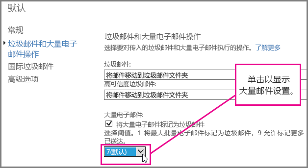
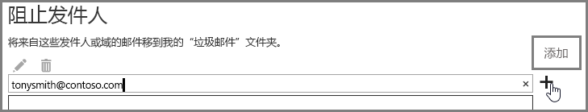

# <a name="block-email-spam-with-the-office-365-spam-filter-to-prevent-false-negative-issues"></a><span data-ttu-id="9a711-103">使用 Office 365 垃圾邮件筛选器阻止垃圾邮件以避免出现漏报问题</span><span class="sxs-lookup"><span data-stu-id="9a711-103">Block email spam with the Office 365 spam filter to prevent false negative issues</span></span>

<span data-ttu-id="9a711-p101">Exchange Online Protection (EOP) 是一项基于云的电子邮件筛选服务，有助于保护组织免受垃圾邮件和恶意软件威胁。如果你在 Office 365 中有邮箱，它们已默认受 EOP 保护。</span><span class="sxs-lookup"><span data-stu-id="9a711-p101">Exchange Online Protection (EOP) is a cloud-based email filtering service that helps protect your organization against spam and malware. If you have mailboxes in Office 365, they are already protected by default with EOP.</span></span> 
  
<span data-ttu-id="9a711-p102">你可调整 Office 365 垃圾邮件筛选器，以帮助确保阻止垃圾邮件。这样有助于避免出现漏报问题，即允许垃圾邮件发送到用户收件箱。作为 Exchange Online 或 Exchange Online Protection (EOP) 管理员，请按照以下步骤操作来调整 Office 365 反垃圾邮件筛选器，以避免将垃圾邮件传递到用户收件箱。</span><span class="sxs-lookup"><span data-stu-id="9a711-p102">You can help to ensure spam and junk messages are blocked by adjusting your Office 365 spam filter. This helps to prevent the false negative issue, where email spam is allowed through to a user inbox. As an Exchange Online or Exchange Online Protection (EOP) administrator, use the following steps to adjust your Office 365 anti-spam filter and help prevent spam from being delivered to your user's inboxes.</span></span>
  
## <a name="customize-the-office-365-anti-spam-filter-with-these-settings"></a><span data-ttu-id="9a711-109">为 Office 365 反垃圾邮件筛选器自定义这些设置</span><span class="sxs-lookup"><span data-stu-id="9a711-109">Customize the Office 365 anti-spam filter with these settings</span></span>

<span data-ttu-id="9a711-p103">管理员可使用多个 Office 365 垃圾邮件筛选器设置，以避免将垃圾邮件发送到用户收件箱。如果你采用本文列出的设置，Office 365 垃圾邮件筛选器将能更好地阻止垃圾邮件，并避免出现漏报邮件。在这种情况下，漏报是指垃圾邮件发送到用户收件箱。</span><span class="sxs-lookup"><span data-stu-id="9a711-p103">An Admin can use several Office 365 spam filter settings to help prevent email spam from being sent to a user inbox. The Office 365 spam filter will become better able to block email spam and prevent false negative messages if you use the options listed here. In this context, a false negative refers to email spam or junk messages that are getting sent to a user inbox.</span></span>
  
### <a name="block-ip-addresses-with-a-connection-filter"></a><span data-ttu-id="9a711-113">使用连接筛选器阻止 IP 地址</span><span class="sxs-lookup"><span data-stu-id="9a711-113">Block IP addresses with a connection filter</span></span>

<span data-ttu-id="9a711-114">通过将发件人 IP 地址添加到连接筛选器 IP 阻止列表，自定义 Office 365 垃圾邮件筛选器：</span><span class="sxs-lookup"><span data-stu-id="9a711-114">Customize your Office 365 spam filter by adding the sender IP address to the connection filter IP block list:</span></span>
  
1. <span data-ttu-id="9a711-115">按照[邮件头分析器](https://go.microsoft.com/fwlink/p/?LinkId=306583)中所述，获取要在邮件客户端（如 Outlook 或 Outlook 网页版，先前称为 Outlook Web App）中阻止的邮件的邮件头。</span><span class="sxs-lookup"><span data-stu-id="9a711-115">Obtain the headers for the message you want to block in your mail client such as Outlook or Outlook Web App, as described in [Message Header Analyzer](https://go.microsoft.com/fwlink/p/?LinkId=306583).</span></span>
    
2. <span data-ttu-id="9a711-116">在 X-Forefront-Antispam-Report 头中，使用[邮件头分析器](https://testconnectivity.microsoft.com/?tabid=mha)或手动搜索 CIP 标记后面的 IP 地址。</span><span class="sxs-lookup"><span data-stu-id="9a711-116">Search for the IP address following the CIP tag in the X-Forefront-Antispam-Report header using the [message header analyzer](https://testconnectivity.microsoft.com/?tabid=mha) or manually.</span></span> 
    
3. <span data-ttu-id="9a711-117">按照[配置连接筛选器策略](https://technet.microsoft.com/zh-CN/library/jj200718%28v=exchg.150%29.aspx)中的“使用 EAC 编辑默认连接筛选器策略”步骤操作，将此 IP 地址添加到 IP 阻止列表。</span><span class="sxs-lookup"><span data-stu-id="9a711-117">Add the IP address to the IP Block list by following the steps in "Use the EAC to edit the default connection filter policy" in [Configure the Connection Filter Policy](https://technet.microsoft.com/zh-CN/library/jj200718%28v=exchg.150%29.aspx).</span></span>
    
### <a name="block-bulk-mail-with-transport-rules-or-the-spam-filter"></a><span data-ttu-id="9a711-118">使用传输规则或垃圾邮件筛选器阻止大量邮件</span><span class="sxs-lookup"><span data-stu-id="9a711-118">Block bulk mail with transport rules or the spam filter</span></span>

<span data-ttu-id="9a711-p104">垃圾邮件主要是大量邮件（例如，新闻稿或促销邮件）吗？可以在[使用传输规则主动筛选批量电子邮件](https://technet.microsoft.com/zh-CN/library/dn720438%28v=exchg.150%29.aspx)的情况下自定义 Office 365 垃圾邮件筛选器，也可以启用垃圾邮件筛选器[高级垃圾邮件筛选选项](https://technet.microsoft.com/zh-CN/library/jj200750%28v=exchg.150%29.aspx)中的“大量邮件”\*\*\*\* 设置。在 Exchange 管理中心内，首先依次单击“保护”\*\*\*\*\>“内容筛选器”\*\*\*\*，再双击要调整的筛选器策略。单击“垃圾邮件和大量邮件操作”\*\*\*\* 以调整设置，如下所示。</span><span class="sxs-lookup"><span data-stu-id="9a711-p104">Is the spam primarily bulk mail, for example, newsletters or promotions? You can customize the spam filter in Office 365 if you [Use transport rules to aggressively filter bulk email messages](https://technet.microsoft.com/zh-CN/library/dn720438%28v=exchg.150%29.aspx) or turn on the **Bulk mail** setting in your spam filter's [Advanced Spam Filtering Options](https://technet.microsoft.com/zh-CN/library/jj200750%28v=exchg.150%29.aspx). In the Exchange Admin center, get started by clicking **Protection** \> **Content filter** and then double click the filter policy you want to adjust. Click **Spam and bulk mail actions** to adjust the settings, as shown here.</span></span> 
  

  
### <a name="block-email-spam-using-spam-filter-block-lists"></a><span data-ttu-id="9a711-124">使用垃圾邮件筛选器阻止列表阻止垃圾邮件</span><span class="sxs-lookup"><span data-stu-id="9a711-124">Block email spam using spam filter block lists</span></span>

<span data-ttu-id="9a711-p105">[配置垃圾邮件筛选器策略](https://technet.microsoft.com/zh-CN/library/jj200684%28v=exchg.150%29.aspx)，以将发件人地址或域分别添加到垃圾邮件筛选器中的发件人阻止列表或域阻止列表。发送自垃圾邮件筛选器阻止列表中发件人或域的电子邮件会被标记为“垃圾邮件”。</span><span class="sxs-lookup"><span data-stu-id="9a711-p105">[Configure your spam filter policies](https://technet.microsoft.com/zh-CN/library/jj200684%28v=exchg.150%29.aspx) to add the sender address to the sender block list or domain to the domain block list in the spam filter. Emails from a sender or domain on a spam filter block list will marked as spam.</span></span> 
  
### <a name="advanced-spam-filtering-options"></a><span data-ttu-id="9a711-127">高级垃圾邮件筛选选项</span><span class="sxs-lookup"><span data-stu-id="9a711-127">Advanced spam filtering options</span></span>

<span data-ttu-id="9a711-128">[配置垃圾邮件筛选器策略](https://technet.microsoft.com/zh-CN/library/jj200684%28v=exchg.150%29.aspx)，并启用其他[高级垃圾邮件筛选选项](https://technet.microsoft.com/zh-CN/library/jj200750%28v=exchg.150%29.aspx)。</span><span class="sxs-lookup"><span data-stu-id="9a711-128">[Configure your spam filter policies](https://technet.microsoft.com/zh-CN/library/jj200684%28v=exchg.150%29.aspx) and turn on additional [Advanced Spam Filtering Options](https://technet.microsoft.com/zh-CN/library/jj200750%28v=exchg.150%29.aspx).</span></span>
  
<span data-ttu-id="9a711-p106">有关适用于整个组织的更多垃圾邮件设置，请参阅[使用安全列表或其他技术避免出现标记为“垃圾邮件”的误报电子邮件](prevent-email-from-being-marked-as-spam-0.md)。如果你拥有管理员级控制权，并且希望避免误报，便会发现这非常有用。</span><span class="sxs-lookup"><span data-stu-id="9a711-p106">For more spam settings that apply to the whole organization, take a look at [Prevent false positive email marked as spam with a safelist or other techniques](prevent-email-from-being-marked-as-spam-0.md). This is helpful if you have administrator-level control and you want to prevent false positives.</span></span>
  
## <a name="email-users-can-also-help-ensure-that-false-negative-and-email-spam-is-blocked-with-office-365-spam-filter"></a><span data-ttu-id="9a711-131">电子邮件用户还可有助于确保通过 Office 365 垃圾邮件筛选器避免漏报和阻止垃圾邮件</span><span class="sxs-lookup"><span data-stu-id="9a711-131">Email users can also help ensure that false negative and email spam is blocked with Office 365 spam filter</span></span>

<span data-ttu-id="9a711-p107">如果让用户在 [Outlook](https://go.microsoft.com/fwlink/p/?LinkId=270065) 或 [Outlook 网页版](https://go.microsoft.com/fwlink/p/?LinkId=294862)中将垃圾邮件发件人地址添加到阻止的发件人名单中，将有助于 Office 365 反垃圾邮件筛选器避免漏报并阻止垃圾邮件。在 Outlook 网页版中，首先依次单击“**设置**”\>“**选项**”\>“**阻止或允许**”，再将地址添加到“**阻止的发件人**”名单中，如下所示。</span><span class="sxs-lookup"><span data-stu-id="9a711-p107">It will help your Office 365 anti-spam efforts to prevent false negatives and junk mail if you tell your users to add the spam sender address to their blocked sender list in [Outlook](https://go.microsoft.com/fwlink/p/?LinkId=270065) or [Outlook Web App](https://go.microsoft.com/fwlink/p/?LinkId=294862). In Outlook Web App, get started by clicking **Settings** \> **Options** \> **Block or allow**, and then adding the address to the **Blocked senders** list, as shown here.</span></span> 
  

  
> [!NOTE]
> <span data-ttu-id="9a711-135">若要详细了解允许列表，请参阅[允许列表和阻止的发件人名单 FAQ](https://technet.microsoft.com/zh-CN/library/dn133608%28v=exchg.150%29.aspx)。</span><span class="sxs-lookup"><span data-stu-id="9a711-135">For more detailed information about safe sender lists, see [Safe Sender and Blocked Sender Lists FAQ](https://technet.microsoft.com/zh-CN/library/dn133608%28v=exchg.150%29.aspx).</span></span> 
  
<span data-ttu-id="9a711-p108">本分部中的前几段落仅适用于使用 EOP 作为本地电子邮件系统保护服务，或在混合电子邮件部署中使用 EOP 的客户。若要详细了解 EOP，请参阅 [Exchange Online Protection 主页](https://products.office.com/zh-CN/exchange/exchange-email-security-spam-protection)。</span><span class="sxs-lookup"><span data-stu-id="9a711-p108">The previous paragraphs in this subsection applies only to customers who use EOP as service to protect on-premises email systems or as part of a hybrid email deployment. Learn more about EOP at the [Exchange Online Protection home page](https://products.office.com/zh-CN/exchange/exchange-email-security-spam-protection).</span></span>
  
## <a name="eop-only-customers-set-up-the-office-365-spam-filter-to-block-email-spam"></a><span data-ttu-id="9a711-138">仅使用 EOP 的客户：设置 Office 365 垃圾邮件筛选器以阻止垃圾邮件</span><span class="sxs-lookup"><span data-stu-id="9a711-138">EOP-only customers: Set up the Office 365 spam filter to block email spam</span></span>

<span data-ttu-id="9a711-p109">对于仅使用 EOP 且有本地邮箱的客户：如果为默认操作“将邮件移至‘垃圾邮件’文件夹”设置垃圾邮件筛选器，请按照“确保将垃圾邮件路由到每个用户的‘垃圾邮件’文件夹中”的必要步骤操作。我们已尝试简化此操作，不仅在单独的主题中提供了 Exchange 命令行管理程序命令，还链接到更多有关如何开始使用命令行管理程序的常规信息。</span><span class="sxs-lookup"><span data-stu-id="9a711-p109">For EOP-only customers with on-premises mailboxes: If you setup a spam filter for the default action, Move message to Junk Email folder, follow the required steps provided in Ensure that spam is routed to each user's Junk Email folder. We've tried to make this easy by providing the Exchange Management Shell commands in a separate topic, as well as a link to more general information about how to get started with the shell.</span></span>
  
<span data-ttu-id="9a711-p110">通过目录同步与服务同步用户设置可确保使用阻止的发件人名单，有助于避免漏报垃圾邮件。有关详细信息，请参阅“在 EOP 中管理邮件用户”中的“使用目录同步管理邮件用户”。</span><span class="sxs-lookup"><span data-stu-id="9a711-p110">It will help you to avoid false negative email spam if you sync user settings with the service via directory synchronization to ensure that your blocked senders are respected. For more information, see "Use directory synchronization to manage mail users" in Manage mail users in EOP.</span></span>
  
## <a name="eop-only-customers-who-are-not-using-directory-synchronization"></a><span data-ttu-id="9a711-143">仅使用 EOP 的客户：不使用目录同步</span><span class="sxs-lookup"><span data-stu-id="9a711-143">EOP-only customers who are not using directory synchronization</span></span>

<span data-ttu-id="9a711-p111">EOP 旨在使用用户的允许列表和阻止的发件人名单，前提是此类信息已与服务共享。如果你是使用 Outlook 的 EOP 客户，但未配置目录同步来将用户同步到 Office 365，仍可使用阻止的发件人名单来阻止邮件传递到用户收件箱。不过，在以下情况下，可能需要设置一些 Exchange 邮件流规则：</span><span class="sxs-lookup"><span data-stu-id="9a711-p111">The EOP service is designed to honor the user's safe and blocked senders, if the information has been shared with the service. If you are an EOP customer using Outlook, but do not have Directory Synchronization configured to sync your users to Office 365, you can still stop messages from being delivered to your users' inbox using blocked senders. However, you may have to set up some Exchange mail flow rules in the following situations:</span></span>
  
- <span data-ttu-id="9a711-147">如果邮件通过 EOP 接受常规垃圾邮件筛选，然后传递到本地 Exchange 服务器，并且 EOP 指定的垃圾邮件裁定结果为 SCL 1-4（非垃圾邮件），那么用户在本地的阻止的发件人名单就会替代 EOP 垃圾邮件筛选器裁定结果，并将邮件传递到“垃圾邮件”文件夹。</span><span class="sxs-lookup"><span data-stu-id="9a711-147">If a message goes through regular spam filtering through EOP and then is delivered to a local on-premises Exchange server, and EOP assigns a spam verdict of SCL 1-4 (non-spam), then your users' local blocked senders list will override the EOP spam filter verdict and deliver it to their junk email folder.</span></span>
    
- <span data-ttu-id="9a711-p112">如果将 EOP 中的邮件指定为 SCL -1 的依据为 Exchange 邮件流规则，或因为 IP 地址或域位于允许列表中，那么 SCL 会通过连接器传播到本地 Exchange 服务器。在这种情况下，不会强制执行用户的阻止的发件人名单。若要更改此设置，可创建将 SCL 设置为 0 的本地邮件流规则。这样一来，Outlook 便能强制执行用户在本地的阻止的发件人名单。</span><span class="sxs-lookup"><span data-stu-id="9a711-p112">If a message in EOP is assigned SCL -1 by an Exchange mail flow rule or because the IP address or domain is in your allow list, the SCL is propagated to the on-premises Exchange server using connectors. In this case, your user's blocked senders list will not be enforced. To change this, you can create a local mail flow rule that sets the SCL to 0. This will cause Outlook to enforce your user's local blocked senders list.</span></span>
    
<span data-ttu-id="9a711-152">**将邮件流规则设置为使用阻止的发件人名单阻止邮件传递到用户收件箱的具体步骤**</span><span class="sxs-lookup"><span data-stu-id="9a711-152">**To set up a mail flow rule to stop messages from being delivered to your users' inbox by using the blocked senders list**</span></span>
  
1. <span data-ttu-id="9a711-p113">在本地服务器中打开 Exchange 命令行管理程序。若要了解如何在本地 Exchange 组织中打开命令行管理程序，请参阅[打开 Exchange 命令行管理程序](https://technet.microsoft.com/library/dd638134%28v=exchg.160%29.aspx)。</span><span class="sxs-lookup"><span data-stu-id="9a711-p113">Open the Exchange Management Shell on your on-premises server. To learn how to open the Shell in your on-premises Exchange organization, see [Open the Exchange Management Shell](https://technet.microsoft.com/library/dd638134%28v=exchg.160%29.aspx).</span></span>
    
2. <span data-ttu-id="9a711-155">运行下面的命令，将已经过内容筛选的垃圾邮件路由到“垃圾邮件”文件夹，以更新所有标记有 SCL -1 的邮件的 SCL：</span><span class="sxs-lookup"><span data-stu-id="9a711-155">Run the following command to route content-filtered spam messages to the Junk Email folder in order to update the SCL on every message that was marked with SCL -1:</span></span>
    
  ```
  New-TransportRule "NameForRule" -HeaderContainsMessageHeader "X-Forefront-Antispam-Report" -HeaderContainsWords "SCL:-1" -SetSCL 0
  ```

    <span data-ttu-id="9a711-p114">由于本地 Exchange 服务器中的 SCL 为 0，因此虽然非垃圾邮件会传递到用户收件箱，但用户在本地的阻止的发件人名单仍能将非垃圾邮件发送到“垃圾邮件”文件夹。如果在 EOP 中使用的是垃圾邮件隔离，用户的安全列表中的发件人仍可能会被标识为垃圾邮件发件人并遭隔离。不过，如果在本地邮箱中使用的是“垃圾邮件”文件夹，仍允许将允许列表中发件人发送的邮件传递到收件箱。</span><span class="sxs-lookup"><span data-stu-id="9a711-p114">Because the SCL is 0 in your on-premises Exchange server, non-spam will be delivered to your users' inboxes but still allow for users' local blocked senders list to send them to junk email. If you are using spam quarantine in EOP, it is still possible that senders who are on your user's safe list will be identified as spam and sent to quarantine. If you are using the Junk Mail Folder in your local mailbox, however, this will allow delivery to the Inbox for safe senders.</span></span>

> [!WARNING]
> <span data-ttu-id="9a711-p115">如果使用邮件流规则将 SCL 值更改为 0（或除 -1 以外的任何值），将会对邮件应用所有 Outlook 垃圾邮件选项。也就是说，将使用阻止的发件人名单和安全列表。但同时也意味着，客户端垃圾邮件筛选处理流程可能会将阻止的发件人名单或安全列表中没有的地址发送的邮件标记为“垃圾邮件”。若要让 Outlook 处理阻止的发件人名单和安全列表，但不使用客户端垃圾邮件筛选器，必须将 Outlook 垃圾邮件选项设置为“无自动筛选”。虽然“无自动筛选”是最新版 Outlook 中的默认选项，但你也应确认此设置是否已就位，以确保不向邮件应用客户端垃圾邮件筛选器。作为管理员，可以按照 [Outlook：用于禁用垃圾邮件 UI 和筛选机制的策略设置](https://support.microsoft.com/zh-CN/kb/2180568)中的说明操作，强制禁用 Outlook 垃圾邮件筛选。</span><span class="sxs-lookup"><span data-stu-id="9a711-p115">If you use a mail flow rule to change the SCL value to 0 (or any value other than -1), then all of the Outlook junk mail options will apply to the message. This means that blocked and safe lists will be honored, but also means that messages that do not have addresses from the blocked or safe lists will potentially be marked as junk by the client side junk mail filter processing. If you want to have Outlook process the blocked and safe lists, but not use the client side junk mail filter, you must set the option to "No Automatic Filtering" in Outlook Junk Mail Options. "No Automatic Filtering" is the default option in the latest versions of Outlook, but you should confirm that the this setting is in place to ensure the client side junk mail filter is not applied to the messages. As an administrator, you can enforce disabling the Outlook Junk Email filtering by following the instructions in [Outlook: Policy setting to disable the Junk E-mail UI and filtering mechanism](https://support.microsoft.com/zh-CN/kb/2180568).</span></span>
  
## <a name="see-also"></a><span data-ttu-id="9a711-164">另请参阅</span><span class="sxs-lookup"><span data-stu-id="9a711-164">See Also</span></span>

[<span data-ttu-id="9a711-165">Office 365 电子邮件反垃圾邮件保护</span><span class="sxs-lookup"><span data-stu-id="9a711-165">Office 365 Email Anti-Spam Protection</span></span>](anti-spam-protection.md)
  
[<span data-ttu-id="9a711-166">使用安全列表或其他技术避免出现标记为“垃圾邮件”的误报电子邮件</span><span class="sxs-lookup"><span data-stu-id="9a711-166">Prevent false positive email marked as spam with a safelist or other techniques</span></span>](prevent-email-from-being-marked-as-spam-0.md)
  

