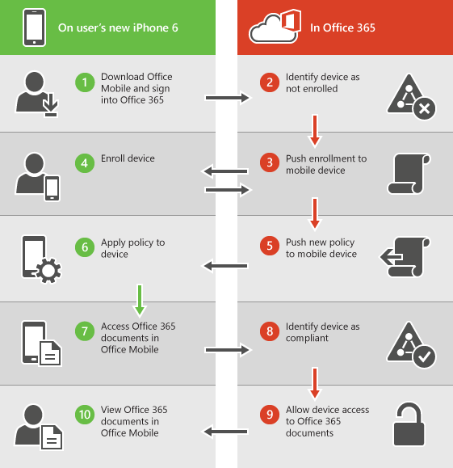

# 针对 Office 365 提供的内置移动设备管理的功能Capabilities of built-in Mobile Device Management for Office 365

Office 365 的移动设备管理可以帮助您保护和管理移动设备，如 Iphone、 Ipad、 Androids 和许可 Office 365 用户在组织中使用的 Windows Phone。您可以创建移动设备管理策略设置，可帮助控制访问您组织的 Office 365 电子邮件和支持的移动设备和应用程序的文档。如果丢失或被盗设备时，您可以远程擦除设备，以删除组织的敏感信息。Mobile Device Management for Office 365 can help you secure and manage mobile devices like iPhones, iPads, Androids, and Windows Phones used by licensed Office 365 users in your organization. You can create mobile device management policies with settings that can help control access to your organization's Office 365 email and documents for supported mobile devices and apps. If a device is lost or stolen, you can remotely wipe the device to remove sensitive organizational information.
    
需要更多的功能比 MDM 包含 Office 365？请参阅 Microsoft Intune 是否具有所需： [MDM for Office 365 和 Microsoft Intune 之间的选择](choose-between-mdm-and-intune.md)。Need more functionality than is included in MDM for Office 365? See if Microsoft Intune has what you need: [Choose between MDM for Office 365 and Microsoft Intune](choose-between-mdm-and-intune.md).
  
## 支持的设备Supported devices

Office 365 MDM 可用于保护和管理以下类型的设备。You can use MDM for Office 365 to secure and manage the following types of devices.
  
- Windows Phone 8.1 +Windows Phone 8.1+
    
- iOS 7.1 或更高版本iOS 7.1 or later versions
    
- Android 4 或更高版本Android 4 or later versions
    
- Windows 8.1\*Windows 8.1\*
    
- Windows 8.1 RT\*Windows 8.1 RT\*
    
- Windows 10\*\*Windows 10\*\*
    
- Windows 10 移动版\*\*Windows 10 Mobile\*\*
    
\*Windows 8.1 和 Windows 8.1 RT 设备的访问控制仅限于 Exchange ActiveSync。\* Access control for Windows 8.1 and Windows 8.1 RT devices is limited to Exchange ActiveSync.
  
\*\*要求设备加入到 Azure Active Directory 和您的组织的移动设备管理服务中注册。\*\* Requires the device to be joined to Azure Active Directory and be enrolled in the mobile device management service of your organization.
  
如果您的组织中的人员使用移动设备管理 Office 365 不支持的移动设备，您可能想要阻止这些设备，以帮助确保您的组织数据更安全的 Office 365 电子邮件应用程序访问 Exchange ActiveSync。用于阻止 Exchange ActiveSync 的步骤： 请参阅[管理设备访问设置](manage-device-access-settings.md)。If people in your organization use mobile devices that aren't supported by Mobile Device Management for Office 365, you might want to block Exchange ActiveSync app access to Office 365 email for those devices, to help make your organization's data more secure. Steps for blocking Exchange ActiveSync: See [Manage device access settings](manage-device-access-settings.md).
  
## Office 365 电子邮件和文档的访问控制Access control for Office 365 email and documents

下表中的移动设备的不同类型的受支持的应用程序将提示用户在 MDM 注册 Office 365 没有的新的移动设备管理策略应用于用户的设备，并且以前未注册设备的用户。如果用户的设备不符合策略，具体取决于您设置方式策略，用户可能被阻止访问 Office 365 资源在这些应用程序，或他们可能拥有访问，但 Office 365 将报告策略冲突。The supported apps for the different types of mobile devices in the following table will prompt users to enroll in MDM for Office 365 where there is a new mobile device management policy that applies to a user's device and the user hasn't previously enrolled the device. If a user's device doesn't comply with a policy, depending on how you set the policy up, a user might be blocked from accessing Office 365 resources in these apps, or they might have access but Office 365 will report a policy violation.
  
||**Windows Phone 8.1 +****Windows Phone 8.1+**|**iOS 7.1+****iOS 7.1+**|**Android 4+****Android 4+**|
|:-----|:-----|:-----|:-----|
|**Exchange****Exchange**   Exchange ActiveSync 包括内置电子邮件和第三方应用程序，如 TouchDown，使用 Exchange ActiveSync 版本 14.1 或更高版本。Exchange ActiveSync includes built-in email and third-party apps, like TouchDown, that use Exchange ActiveSync Version 14.1 or later.    |Exchange ActiveSyncExchange ActiveSync    Exchange 邮件Exchange Mail    |Exchange ActiveSyncExchange ActiveSync    邮件Mail    |Exchange ActiveSyncExchange ActiveSync    电子邮件Email    |
|**Office** 和 **OneDrive for Business****Office** and **OneDrive for Business**   |无支持的应用No supported apps    |OutlookOutlook    OneDriveOneDrive    WordWord    ExcelExcel    PowerPointPowerPoint    |**手机和平板电脑上：****On phones and tablets:**   OutlookOutlook    OneDriveOneDrive    WordWord    ExcelExcel    PowerPointPowerPoint    **仅手机上：****On phones only:**   Office MobileOffice Mobile    |
   
> [!NOTE]
>  IOS 7.1 和更高版本支持包括 iPhone 和 iPad 设备。> BlackBerry 设备的管理 Office 365 不支持移动设备管理。使用 BlackBerry 商业云服务 (BBCS) 从 BlackBerry 管理 BlackBerry 设备。> 不会提示用户注册，并且不会阻止或如果他们使用移动浏览器访问 Office 365 SharePoint 网站，Office Online 中的文档或 Outlook Web App 中的电子邮件策略违规报告。Support for iOS 7.1 and later versions includes iPhone and iPad devices. >  Management of BlackBerry devices isn't supported by Mobile Device Management for Office 365. Use BlackBerry Business Cloud Services (BBCS) from BlackBerry to manage BlackBerry devices. >  Users won't be prompted to enroll and won't be blocked or reported for policy violation if they use the mobile browser to access Office 365 SharePoint sites, documents in Office Online, or email in Outlook Web App. 
  
下图显示了具有新的设备的用户登录到应用程序支持的 Office 365 访问 MDM 控件时，会发生什么情况。用户被阻止之前会注册其设备访问应用程序中的 Office 365 资源。The following diagram shows what happens when a user with a new device signs in to an app that supports access control with MDM for Office 365. The user is blocked from accessing Office 365 resources in the app until they enroll their device.
  

  
> [!NOTE]
> Exchange ActiveSync 移动设备邮箱策略和在 Exchange 管理中心中创建的设备访问规则，将覆盖策略和在 MDM for Office 365 中创建的访问规则。设备中 MDM 注册 Office 365 后，将忽略任何 Exchange ActiveSync 移动设备邮箱策略或设备访问规则应用于该设备。若要了解有关 Exchange ActiveSync 的详细信息，请参阅[Exchange Online 中的 Exchange ActiveSync](https://go.microsoft.com/fwlink/p/?LinkId=524380)。Policies and access rules created in MDM for Office 365 will override Exchange ActiveSync mobile device mailbox policies and device access rules created in the Exchange admin center. After a device is enrolled in MDM for Office 365, any Exchange ActiveSync mobile device mailbox policy or device access rule applied to the device will be ignored. To learn more about Exchange ActiveSync, see [Exchange ActiveSync in Exchange Online](https://go.microsoft.com/fwlink/p/?LinkId=524380). 
  
## 移动设备的策略设置Policy settings for mobile devices

如果创建策略，以阻止访问与开启某些设置时，将被阻止用户使用支持的应用程序中[的 Office 365 电子邮件和文档的访问控制](#access-control-for-office-365-email-and-documents)列出的时访问 Office 365 资源。可以阻止用户访问 Office 365 资源相关的设置包括以下几节中：If you create a policy to block access with certain settings turned on, users will be blocked from accessing Office 365 resources when using a supported app that is listed in [Access control for Office 365 email and documents](#access-control-for-office-365-email-and-documents). The settings that can block users from accessing Office 365 resources are in these sections:
  
- 安全Security
    
- 加密Encryption
    
- 越狱Jail broken
    
- 托管电子邮件配置文件Managed email profile
    
例如下, 图显示了具有注册设备的用户不符合其设备应用于移动设备管理策略中的安全设置时，会发生什么情况。用户登录到应用程序支持的 Office 365 访问与 MDM 控制权。它们被阻止访问应用程序中的 Office 365 资源，直到其设备符合的安全设置。For example, the following diagram shows what happens when a user with an enrolled device isn't compliant with a security setting in a mobile device management policy that applies to their device. The user signs in to an app that supports access control with MDM for Office 365. They are blocked from accessing Office 365 resources in the app until their device complies with the security setting.
  

  
以下各节列出了可用于保护和管理移动设备连接到组织的 Office 365 资源的策略设置。The following sections list the policy settings you can use to help secure and manage mobile devices that connect to your organization's Office 365 resources. 
  
### 安全设置Security settings

|**设置名称****Setting name**|**Windows Phone 8.1 +****Windows Phone 8.1+**|**iOS 7.1+****iOS 7.1+**|**Android 4+****Android 4+**|**三星 Knox****Samsung Knox**|
|:-----|:-----|:-----|:-----|:-----|
|需要密码Require a password    |✔✔    |✔✔    |✔✔    |✔✔    |
|避免简单密码Prevent simple password    |✔✔    |✔✔    |✖✖    |✖✖    |
|需要字母数字密码Require an alphanumeric password    |✔✔    |✔✔    |✖✖    |✖✖    |
|最短密码长度Minimum password length    |✔✔    |✔✔    |✔✔    |✔✔    |
|擦除设备之前登录失败的次数Number of sign-in failures before device is wiped    |✔✔    |✔✔    |✔✔    |✔✔    |
|设备锁定前的不活动分钟数Minutes of inactivity before device is locked    |✔✔    |✔✔    |✔✔    |✔✔    |
|密码过期(天)Password expiration (days)    |✔✔    |✔✔    |✔✔    |✔✔    |
|记住密码历史记录，并防止重复使用Remember password history and prevent reuse    |✔✔    |✔✔    |✔✔    |✔✔    |
   
### 加密设置Encryption settings

|**设置名称****Setting name**|**Windows Phone 8.1 +****Windows Phone 8.1+**|**iOS 7.1+****iOS 7.1+**|**Android 4+****Android 4+**|**三星 Knox****Samsung Knox**|
|:-----|:-----|:-----|:-----|:-----|
|需要对设备上的数据加密Require data encryption on devices    |Windows Phone 8.1 已加密且不能解密Windows Phone 8.1 is already encrypted and cannot be unencrypted    |✖✖    |✔✔    |✔\*✔\*    |
   
\*与三星 Knox，您还可以要求对存储卡加密。\* With Samsung Knox, you can also require encryption on storage cards.
  
### 越狱设置Jail broken setting

|**设置名称****Setting name**|**Windows Phone 8.1 +****Windows Phone 8.1+**|**iOS 7.1+****iOS 7.1+**|**Android 4+****Android 4+**|**三星 Knox****Samsung Knox**|
|:-----|:-----|:-----|:-----|:-----|
|设备无法越狱或获得根权限Device cannot be jail broken or rooted    |✖✖    |✔✔    |✔✔    |✔✔    |
   
### 托管电子邮件配置文件选项Managed email profile option

以下选项可阻止用户访问其 Office 365 电子邮件，如果他们使用的一个手动创建电子邮件配置文件。IOS 设备上的用户必须删除其手动创建电子邮件配置文件，才能访问其电子邮件。它们删除配置文件后，新的配置文件将在设备上自动创建。The following option can block users from accessing their Office 365 email if they're using a manually created email profile. Users on iOS devices must delete their manually created email profile before they can access their email. After they delete the profile, a new profile will be automatically created on the device.
  
|**设置名称****Setting name**|**Windows Phone 8.1 +****Windows Phone 8.1+**|**iOS 7.1+****iOS 7.1+**|**Android 4+****Android 4+**|**三星 Knox****Samsung Knox**|
|:-----|:-----|:-----|:-----|:-----|
|电子邮件配置文件已托管Email profile is managed    |✖✖    |✔✔    |✖✖    |✖✖    |
   
### 云设置Cloud settings

|**设置名称****Setting name**|**Windows Phone 8.1 +****Windows Phone 8.1+**|**iOS 7.1+****iOS 7.1+**|**Android 4+****Android 4+**|**三星 Knox****Samsung Knox**|
|:-----|:-----|:-----|:-----|:-----|
|需要加密备份Require encrypted backup    |✖✖    |✔✔    |✖✖    |✖✖    |
|阻止云备份Block cloud backup    |✖✖    |✔✔    |✖✖    |✖✖    |
|阻止文档同步Block document synchronization    |✖✖    |✔✔    |✖✖    |✖✖    |
|阻止照片同步Block photo synchronization    |✖✖    |✔✔    |✖✖    |✖✖    |
|允许 Google 备份Allow Google backup    |不适用N/A    |不适用N/A    |✖✖    |✔✔    |
|允许 Google 帐户自动同步Allow Google account auto sync    |不适用N/A    |不适用N/A    |✖✖    |✔✔    |
   
### 系统设置System settings

|**设置名称****Setting name**|**Windows Phone 8.1 +****Windows Phone 8.1+**|**iOS 7.1+****iOS 7.1+**|**Android 4+****Android 4+**|**三星 Knox****Samsung Knox**|
|:-----|:-----|:-----|:-----|:-----|
|阻止屏幕捕获Block screen capture    |✔✔    |✔✔    |✖✖    |✔✔    |
|阻止从设备发送诊断数据Block sending diagnostic data from device    |✔✔    |✔✔    |✖✖    |✔✔    |
   
### 应用程序设置Application settings

|**设置名称****Setting name**|**Windows Phone 8.1 +****Windows Phone 8.1+**|**iOS 7.1+****iOS 7.1+**|**Android 4+****Android 4+**|**三星 Knox****Samsung Knox**|
|:-----|:-----|:-----|:-----|:-----|
|阻止设备上的视频会议Block video conferences on device    |✖✖    |✔✔    |✖✖    |✖✖    |
|阻止对应用商店的访问Block access to application store    |✔✔    |✔✔    |✖✖    |✔✔    |
|访问应用商店时需要密码Require password when accessing application store    |✖✖    |✔✔    |✖✖    |✖✖    |
   
### 设备功能设置Device capabilities settings

|**设置名称****Setting name**|**Windows Phone 8.1 +****Windows Phone 8.1+**|**iOS 7.1+****iOS 7.1+**|**Android 4+****Android 4+**|**三星 Knox****Samsung Knox**|
|:-----|:-----|:-----|:-----|:-----|
|阻止与可移动存储的连接Block connection with removable storage    |✔✔    |✖✖    |✖✖    |✔✔    |
|阻止蓝牙连接Block Bluetooth connection    |✔✔    |✖✖    |✖✖    |✔✔    |
   
### 其他设置Additional settings

您可以通过使用 PowerShell cmdlet 设置以下其他策略设置。有关详细信息，请参阅[Office 365 安全性&amp;合规性中心 cmdlet](https://go.microsoft.com/fwlink/p/?LinkId=827804)。You can set the following additional policy settings by using PowerShell cmdlets. For more information, see [Office 365 Security &amp; Compliance Center cmdlets](https://go.microsoft.com/fwlink/p/?LinkId=827804).
  
|**设置名称****Setting name**|**Windows Phone 8.1 +****Windows Phone 8.1+**|**iOS 7.1+****iOS 7.1+**|**Android 4 + （包括三星 Knox）****Android 4+ (including Samsung Knox)**|
|:-----|:-----|:-----|:-----|
|CameraEnabledCameraEnabled    |✔✔    |✔✔    |✔✔    |
|RegionRatingsRegionRatings    |✖✖    |✔✔    |✖✖    |
|MoviesRatingsMoviesRatings    |✖✖    |✔✔    |✖✖    |
|TVShowsRatingTVShowsRating    |✖✖    |✔✔    |✖✖    |
|AppsRatingsAppsRatings    |✖✖    |✔✔    |✖✖    |
|AllowVoiceDialingAllowVoiceDialing    |✖✖    |✔✔    |✖✖    |
|AllowVoiceAssistantAllowVoiceAssistant    |✖✖    |✔✔    |✖✖    |
|AllowAssistantWhileLockedAllowAssistantWhileLocked    |✖✖    |✔✔    |✖✖    |
|AllowPassbookWhileLockedAllowPassbookWhileLocked    |✖✖    |✔✔    |✖✖    |
|MaxPasswordGracePeriodMaxPasswordGracePeriod    |✖✖    |✔✔    |✖✖    |
|PasswordQualityPasswordQuality    |✖✖    |✖✖    |✔✔    |
|SystemSecurityTLSSystemSecurityTLS    |✖✖    |✔✔    |✖✖    |
|WLANEnabledWLANEnabled    |✔✔    |✖✖    |✖✖    |
   
### 支持的 Windows 的设置Settings supported by Windows

您可以通过其注册为移动设备管理 Windows 8.1 和 Windows 10 设备。部署适用的策略后，具有 Windows 8.1 RT 和 Windows 10 RT 设备的用户将需要注册 MDM 在 Office 365 首次使用内置的电子邮件应用程序访问其 Office 365 电子邮件。You can manage Windows 8.1 and Windows 10 devices by enrolling them as mobile devices. After an applicable policy is deployed, users with Windows 8.1 RT and Windows 10 RT devices will be required to enroll in MDM for Office 365 the first time they use the built-in email app to access their Office 365 email. 
  
Windows 8.1 和 Windows 10 注册为移动设备的设备支持下列设置。这些设置不会阻止用户访问 Office 365 资源。The following settings are supported for Windows 8.1 and Windows 10 devices that are enrolled as mobile devices. These setting won't block users from accessing Office 365 resources.
  
 **安全设置****Security settings**
  
- 需要字母数字密码Require an alphanumeric password
    
- 最短密码长度Minimum password length
    
- 擦除设备之前登录失败的次数Number of sign-in failures before device is wiped
    
- 设备锁定前的不活动分钟数Minutes of inactivity before device is locked
    
- 密码过期(天)Password expiration (days)
    
- 记住密码历史记录，并防止重复使用Remember password history and prevent reuse
    
 **系统设置****System settings**
  
阻止从设备发送诊断数据Block sending diagnostic data from device
  
 **其他设置****Additional settings**
  
您可以使用 PowerShell cmdlet 来设置其他策略设置（如下所示）：You can set the following additional policy settings by using PowerShell cmdlets:
  
- AllowConvenienceLogonAllowConvenienceLogon
    
- UserAccountControlStatusUserAccountControlStatus
    
- FirewallStatusFirewallStatus
    
- AutoUpdateStatusAutoUpdateStatus
    
- AntiVirusStatusAntiVirusStatus
    
- AntiVirusSignatureStatusAntiVirusSignatureStatus
    
- SmartScreenEnabledSmartScreenEnabled
    
- WorkFoldersSyncUrlWorkFoldersSyncUrl
    
## 远程擦除移动设备Remotely wipe a mobile device

 如果丢失或被盗设备，可以删除组织的敏感数据，并帮助阻止对贵组织的 Office 365 资源的访问，通过执行擦除从**安全&amp;合规性中心\>数据丢失防护\>设备管理**。您可以删除仅组织数据选择性擦除或完整擦除，从设备中删除所有信息并将其还原到出厂默认设置。If a device is lost or stolen, you can remove sensitive organizational data and help prevent access to your organization's Office 365 resources by doing a wipe from **Security &amp; Compliance center\>Data loss prevention\>Device management**. You can do a selective wipe to remove only organizational data or a full wipe to delete all information from a device and restore it to its factory settings.
  
有关详细信息，请参阅[擦除 Office 365 中的移动设备](https://go.microsoft.com/fwlink/p/?LinkId=518157)。For more information, see [Wipe a mobile device in Office 365](https://go.microsoft.com/fwlink/p/?LinkId=518157).
  
## 另请参阅See also

[Office 365 移动设备管理概述Overview of Mobile Device Management for Office 365](overview-of-mdm.md)
  
[创建和部署设备安全策略Create and deploy device security policies](create-device-security-policies.md)

