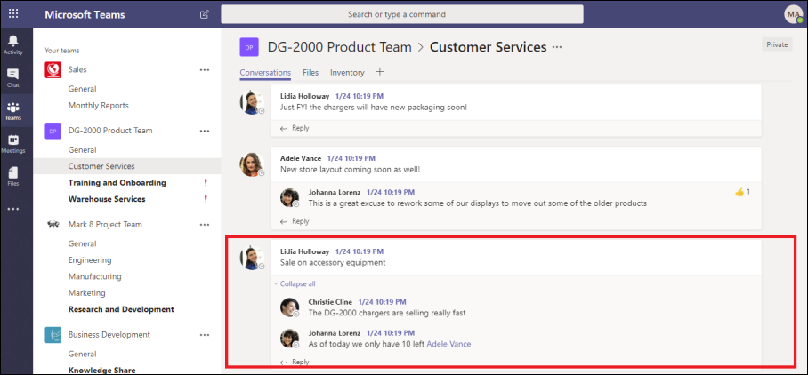

# 查看高级电子数据展示中的对话 

即时消息是一种方便的方法, 可以在大型访问群体中提问、分享想法或快速通信。 作为即时消息平台 (如 Microsoft 团队) 成为企业协作的核心, 组织必须评估其电子数据展示工作流如何解决这些新的通信和协作形式。 

高级电子数据展示中的会话重建功能旨在帮助您识别上下文内容并生成独特的对话视图。 通过此功能, 您可以高效快速地查看在 Microsoft 团队等平台中生成的完整即时消息对话 (也称为 "*线索对话*")。

通过对话重建, 可以使用内置功能来重建、审阅和导出线程对话。 将高级电子数据展示对话重建为以下内容:

- 在会话内的所有邮件中保留唯一的邮件级元数据。

- 收集有关搜索结果的上下文邮件。

- 审阅、批注和密文串接的对话。

- 导出单个邮件或线索对话

## 术语

下面是一些定义, 可帮助你开始使用对话重建。

- **邮件:** 表示对话的最小单位。 邮件的大小、结构和元数据可能各不相同。 

- **对话:** 代表一个或多个邮件的分组。 在不同的应用程序中, 对话可能以不同的方式表示。 在某些应用程序中, 通过答复现有邮件产生的显式操作。 对话是作为此用户操作的结果而显式形成的。 例如, 下面是 Microsoft 团队中的频道对话的屏幕截图。

   

   在其他应用程序 (例如, 工作组中的1xN 聊天邮件) 中, 没有正式的答复链, 而是在单个线程中显示为 "简单消息化的邮件"。 在这些类型的应用程序中, 将从在特定时间内发生的一组邮件中推断对话。 邮件的这种 "软分组" (而不是 "回复链") 表示有关特定主题的 "前后" 讨论。 

## 步骤 1: 运行搜索

在确定了相关保管人和内容位置之后, 可以创建搜索以查找潜在的相关内容。 在高级电子数据展示事例的 "**搜索**" 选项卡上, 您可以通过单击 "**新建搜索**" 并按照向导来创建搜索。 有关如何创建搜索、构建搜索查询和查看搜索结果的信息, 请参阅[为事例收集数据](create-search-to-collect-data.md)。

## 步骤 2: 创建对话评审集

在审阅集中, 您可以搜索、标记、批注和密文文档、电子邮件和聊天对话。 在高级电子数据展示中, 可以基于单个邮件或线索对话自定义您对对话的审阅。 这取决于您将在步骤1中创建的搜索结果添加到的审查集的类型。 有两种不同类型的审阅集: 
  
  - **标准审阅集:** 将处理对话中的邮件并将其显示为单个项目。 
  
  -  **对话查看集:** 对话中的邮件单独处理, 但在对话视图中显示。 在对话审阅集中, 您可以在 "线程对话" 视图中对邮件添加批注、标记和标记密文。 

若要详细了解如何查看和管理审阅集中的内容, 请参阅[管理审阅集](managing-review-sets.md)。 

## 步骤 3: 启用对话检索选项

检查并完成搜索查询后, 可以将搜索结果添加到审阅集。 将搜索结果添加到评审集时, 会将原始数据复制到 Azure 存储区, 以促进审阅和分析过程。 有关将搜索结果添加到审阅集的详细信息, 请参阅[将搜索结果添加到审阅集](add-data-to-review-set.md)。 

将数据从对话添加到审阅集时, 可以使用对话检索选项来扩展搜索并包含上下文相关邮件。 设置对话检索选项后, 可能会发生以下情况:

  
  
1. 使用关键字和日期范围查询, 搜索会在*邮件 3*上返回一个命中。 此邮件是更大的对话的一部分, 如*CRC1*所示。 
  
2. 当您将数据添加到审阅集中并启用对话检索选项时, 高级电子数据展示将返回并收集*CRC1*中的其他项目。 
  
3. 将项目添加到审阅集后, 可以查看*CRC1*中的所有单个邮件。 

启用对话检索:
  
1. 在高级电子数据展示事例的 "**搜索**" 选项卡上, 选择一个搜索, 然后单击弹出页面上的 "**添加到审阅集**"。
  
2. 选择现有的审阅集或创建审阅集。 将搜索结果添加到标准或对话评审集时, 可以配置检索选项。
  
3. 在 "**收集选项**" 下, 为要在搜索中展开的内容源配置对话检索选项, 然后单击 "**添加**" 以启动该过程。  
  
4. 完成 "**作业**" 选项卡上的 "**添加到审阅集**" 作业后, 即可开始查看对话。

## 步骤 4: 查看评审集中的对话

在处理完内容并将其添加到审阅集后, 即可开始查看评审集中的数据。 审阅功能会有所不同, 具体取决于内容是添加到标准审阅集还是对话评审集。 

### 查看标准审阅集中的对话

在标准审阅集中, 邮件将作为单个项目进行处理和显示, 就像它们存储在邮箱文件夹中的方式一样。 在此工作流中, 每封邮件都作为一个单独的项目处理。 因此, "线程摘要" 和 "导出" 选项在标准审阅集中不可用。 

  

### 查看对话审阅集中的对话

在对话审阅集中, 各个邮件将串接在一起, 并显示为对话。 这将允许您查看和导出上下文对话。 

  

以下各节介绍了如何在对话评审集中审阅和导出对话。

#### 查看对话

在对话审阅集中, 您可以使用以下选项来促进审核过程。

- **按会话分组:** 将同一对话中的邮件组合在一起, 以帮助用户简化和加快其审阅过程。 

- **摘要视图:** 显示线程对话。 在此视图中, 您可以查看整个对话, 还可以访问每个邮件的元数据。  
  
   - 查看单个邮件的元数据
   
   - 下载单个邮件

- **文本视图:** 为整个对话提供提取的文本。 

- **批注视图:** 允许您标记对话的线程视图。 对话中的所有邮件共享相同的批注文档。

- **标记:** 在审阅集中查看对话时, 可以通过单击 "编码" 面板中的 **"添加标签" 面板**来查看和应用标签。

- **重新运行对话转换:** 将邮件添加到对话评审集时, 将自动运行转换作业以创建带线索的摘要和批注视图。 如果会话重建作业失败, 您可以通过单击 "操作" > "在审阅集中**创建对话 pdf** " 来重新运行此作业。

#### 导出对话

在对话审阅集中, 您可以设置以下选项以导出对话:

a. 元数据选项

   - **加载文件:** 每个单独的邮件、电子邮件和文档包含元数据。 会话中的每个邮件都有一行。 

   - **标记:** 您的审阅过程中的标记包含在元数据文件中。 对话中的邮件共享相同的标签。 

b. 对话选项
  
   - **对话文件:** 当您导出对话文件时, 批注视图将转换为 PDF 文件, 并下载到导出文件夹。 一个会话文件中的邮件指向同一个对话文件的 PDF 版本。  
  
   - **个人聊天消息:** 导出单个邮件时, 会将对话中的每个唯一邮件导出为独立的项目。 将导出文件, 其格式与在邮箱中保存时的格式相同。 对于特定对话, 您将收到多个 .msg 文件。 

     >[!NOTE]
     > 如果对对话文件应用了批注, 则不会将这些批注转移到各个邮件。 

c. 其他选项

   - **为所有导出的内容生成文本文件:** 为从评审集导出的每个对话生成一个文本文件。 

   - 将**导出的内容替换为编辑 pdf:** 如果在审阅过程中生成编辑对话文件, 则这些文件在导出过程中可用。 您可以决定是仅导出本机文件 (不选择此选项), 还是将本机文件替换为本机文件的编辑版本 (选择此选项), 这些文件将导出为 PDF 文件。

## 更多信息

若要了解有关如何在高级电子数据展示中查看事例数据的详细信息, 请参阅以下文章:

- [查看事例数据](view-documents-in-review-set.md) 

- [分析事例数据](analyzing-data-in-review-set.md)

- [导出事例数据](exporting-data-ediscover20.md)
