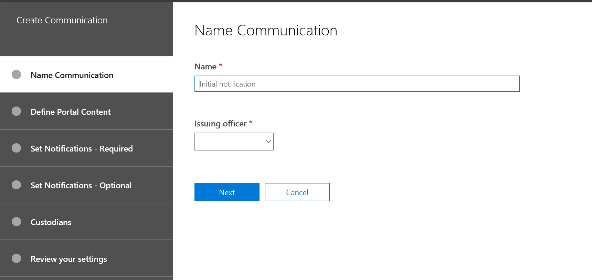

# 创建合法保留通知Create a legal hold notice

通过使用高级电子数据展示 (预览版) 保管人通信, 组织可以管理其与保管人通信的工作流。Using Advanced eDiscovery (Preview) custodian communications, organizations can manage their workflow around communicating with custodians. 通过通信工具, 法律团队可以系统地发送、收集和跟踪合法保留通知。Through the Communications tool, legal teams can systematically send, collect, and track legal hold notifications. 灵活的创建过程还允许团队自定义保留通知工作流以及发送给保管人的通知中的内容。The flexible creation process also allows teams to customize the hold notification workflow and the content in the notices sent to custodians. 

本文概述了保留通知工作流中的步骤。The article outlines the steps in the hold notification workflow.

## 步骤 1: 指定通信详细信息Step 1: Specify communication details

第一步是为合法保留通知或其他保管人通信指定相应的详细信息。The first step is to specify the appropriate details for legal hold notices or other custodian communications. 

1. 在安全 & 合规性中心中, 转到**电子数据展示 > 高级电子数据展示 (预览)** 以显示您的组织中的案例列表。In the Security & Compliance Center, go to **eDiscovery > Advanced eDiscovery (Preview)** to display the list of cases in your organization.
   
2. 单击 "**通信**" 选项卡, 然后单击 "**新建通信**"。Click the **Communications** tab, and then click **New communication**.
   
3. 在 "**名称通信**" 页上, 指定以下 (必需) 的通信详细信息。On the **Name communication** page, specify the following (required) communication details.

    - **名称**: 这是通信的名称。**Name**: This is the name for the communication.
    
    - **签发专员**: 下拉列表显示事例成员的列表。**Issuing officer**: The dropdown list displays a list of a case members. 发送给保管人的每个通知将代表指定的颁发官发送。Each notice sent to custodians will be sent on behalf of the specified issuing officer.

4. 单击“下一步”\*\*\*\*。Click **Next**.

## 步骤 2: 定义门户内容Step 2: Define the portal content

接下来, 您可以创建和添加保留通知的内容。Next, you can create and add the content of the hold notice. 在 "**创建通信**向导" 中的 "**定义门户内容**" 页上, 指定保留通知的内容。On the **Define portal content** page in the **Create communication** wizard, specify the contents of the hold notice. 此内容将自动追加到发布、重新发布、提醒和上报通知中。This content will be automatically appended to the Issuance, Re-Issue, Reminder, and Escalation notices. 此外, 此内容将显示在保管人的合规性门户中。Additionally, this content will appear in the custodian's Compliance Portal. 

若要创建门户内容, 请执行以下操作:To create the portal content:

1. 在门户内容的 textbox 中键入 (或从另一个文档中剪切并粘贴) 您的保留通知。Type (or cut and paste from another document) your hold notice in the textbox for the portal content. 

2. 将合并变量插入到通知中, 以自定义通知并共享保管人合规性门户。Insert merge variables into your notice to customize the notice and share the Custodian Compliance Portal.

3. 单击“下一步”\*\*\*\*。Click **Next**.

  >[!Tip]
  >若要了解有关如何自定义门户内容的内容和格式的详细信息, 请参阅[使用通信编辑器](using-communications-editor.md)。To learn more about how to can customize the content and format of the portal content, see [Use the Communications Editor](using-communications-editor.md).

## 步骤 3: 设置所需的通知Step 3: Set the required notifications

定义保留通知的内容后, 可以在发送和管理通知过程周围设置工作流。After you've defined the contents of the hold notice, you can set up the workflows around sending and managing the notification process. 通知是发送给保管人以通知和跟进的电子邮件。Notifications are email messages that are sent to notify and follow-up with custodians. 每个添加到通信的保管人都会收到相同的通知。Every custodian added to the communication will receive the same notification. 

若要设置和发送保留通知, 必须包括发布通知、重新颁发通知和发布通知。To set up and send a hold notice, you must include Issuance, Re-Issuance, and Release notifications.

### 颁发通知Issuance notification 

在创建通信之后, 将由指定的颁发官启动**颁发通知**。After the communication is created, the **Issuance Notification** is initiated by the specified Issuing Officer. 颁发通知是发送给管理员的第一次通信, 告知他们其保留义务。The Issuance notification is the first communication sent to the custodian to inform them about their preservation obligations. 

创建发布通知的步骤:To create an issuance notification:

1. 在**发布**磁贴中, 单击 "**编辑**"。In the **Issuance** tile, click **Edit**.
   
2. 如有必要, 向 **"抄送**" 和 **"密件抄送**" 字段中添加其他事例成员或员工。If necessary, add additional case members or staff to the **Cc** and **Bcc** fields. 若要向这些字段中添加多个用户, 请使用分号分隔电子邮件地址。To add multiple users to these fields, separate email addresses with a semi-colon.
   
3. 指定通知的**主题**(必需)。Specify the **Subject** for the notice (required).
   
4. 指定您希望为保管人提供的内容或其他说明 (必需)。Specify the contents or additional instructions that you would like to provide to the custodian (required). 请注意, 在步骤2中定义的门户内容将添加到发布通知的末尾。Note that the portal content you defined in Step 2 is added to the end of the issuance notice. 
   
5. 单击“保存”\*\*\*\*Click **Save** 

### 重新发布通知Re-Issuance notification 

在这种情况下, 可能需要保管人来保留比以前所指示的更多或少的数据。As the case progresses, custodians may be required to preserve additional or less data than was previously instructed. 更新保留通知的内容后, 重新发布通知将向保管人通知保管人有关其保留义务的更改。After you update the contents of the hold notice, the re-issuance notification alerts the  custodians about the changes to their preservation obligations.

创建重新发布通知的步骤:To create a re-issuance notification: 

1. 在重新**颁发**磁贴中, 单击 "**编辑**"。In the **Reissue** tile, click **Edit**.
   
2. 如有必要, 向 **"抄送**" 和 **"密件抄送**" 字段中添加其他事例成员或员工。If necessary, add additional case members or staff to the **Cc** and **Bcc** fields. 若要向这些字段中添加多个用户, 请使用分号分隔电子邮件地址。To add multiple users to these fields, separate email addresses with a semi-colon.
   
3. 指定通知的**主题**(必需)。Specify the **Subject** for the notice (required).
   
4. 指定您希望为保管人提供的内容或其他说明 (必需)。Specify the contents or additional instructions that you would like to provide to the custodian (required). 请注意, 在步骤2中定义的门户内容将添加到重新发布通知的末尾。Note that the portal content you defined in Step 2 is added to the end of the re-issuance notice.
   
5. 单击“保存”\*\*\*\*。Click **Save**.

>[!Note]
>如果修改了保留通知, 则将自动向分配给此通知的所有保管人发送重新发布通知。If a hold notification is modified, the re-issuance notification will be automatically sent to all custodians assigned to the notice. 发送通知后, 将要求保管人重新确认其保留通知。After the notification is sent, custodians will be asked to re-acknowledge their hold notice. 如果您已设置任何提醒或升级工作流, 这些工作流也将重新启动。If you have set up any reminder or escalation workflows, these will also re-start. 

### 发布通知Release notification

在解决问题或管理员不再受保留内容的限制后, 可以从案例中释放该保管人。After a matter is resolved or if a custodian is no longer subject to preserve content, you can release the custodian from a case. 如果保管人先前已发出保留通知, 则可以使用发布通知来提醒保管人他们已从其义务中发布。If the custodian was previously issued a hold notice, the release notification can be used to alert custodians that they have been released from their obligation.

创建发布通知:To create a release notification: 

1. 在 "**发布**" 磁贴中, 单击 "**编辑**"。In the **Release** tile, click **Edit**.
   
2. 如有必要, 向 **"抄送**" 和 **"密件抄送**" 字段中添加其他事例成员或员工。If necessary, add additional case members or staff to the **Cc** and **Bcc** fields. 若要向这些字段中添加多个用户, 请使用分号分隔电子邮件地址。To add multiple users to these fields, separate email addresses with a semi-colon.
   
3. 指定通知的**主题**(必需)。Specify the **Subject** for the notice (required).
   
4. 指定您希望为保管人提供的内容或其他说明 (必需)。Specify the contents or additional instructions that you would like to provide to the custodian (required).
   
5. 单击 "**保存**", 然后转到下一步。Click **Save** and go to the next step. 

## Optional步骤 4: 设置可选通知(Optional) Step 4: Set the optional notifications

(可选) 您可以通过创建和安排自动提醒和上报通知来简化与未响应的保管人进行后续工作的工作流。Optionally, you can simplify the workflow for following up with unresponsive custodians by creating and scheduling automated reminder and escalation notifications.

### 提醒Reminders

发送保留通知后, 通过定义提醒工作流, 可以跟进不响应保管人的人。After you have sent a hold notification, you can follow-up with unresponsive custodians by defining a reminder workflow. 

计划提醒:To schedule reminders:

1. 在**提醒**磁贴中, 单击 "**编辑**"。In the **Reminder** tile, click **Edit**.
   
2. 通过打开 "**状态**" 切换 (必需) 启用**提醒**工作流。Enable the **Reminder** workflow by turning on the **Status** toggle (required).
   
3. 指定**提醒间隔 (以天**为单位) (必需)。Specify the **Reminder interval (in days)** (required). 这是发送第一个和跟进提醒通知之前要等待的天数。This is the number of days to wait before sending the first and follow-up reminder notifications. 例如, 如果将提醒间隔设置为7天, 则在最初发出保留通知后, 将在7天内发送第一个提醒。For example, if you set the reminder interval to 7 days, then the first reminder would be sent 7 days after the hold notification was initially issued. 所有后续提醒也每7天发送一次。All subsequent reminders would also be sent every 7 days.
   
4. 指定**提醒数**(必需)。Specify the **Number of reminders** (required). 此字段指定要发送给未响应的保管人的提醒数。This field specifies how many reminders to send to un-responsive custodians. 例如, 如果将提醒数设置为 3, 则管理员最多可收到3个提醒。For example, if you set the number of reminders to 3, then a custodian would receive a maximum of 3 reminders. 在保管人确认保留通知后, 将不再向该用户发送提醒。After a custodian acknowledges the hold notification, reminders will no longer be sent to that user.
   
5. 指定通知的**主题**(必需)。Specify the **Subject** for the notice (required). 
   
6. 指定您希望为保管人提供的内容或其他说明 (必需)。Specify the contents or additional instructions that you would like to provide to the custodian (required). 请注意, 您在步骤2中定义的门户内容将添加到提醒通知的末尾。Note that the portal content you defined in Step 2 is added to the end of the reminder notice.
   
7. 单击 "**保存**", 然后转到下一步。Click **Save** and go the the next step.

### 上报Escalations 

在某些情况下, 您可能需要使用其他方法来跟踪不响应保管人的用户。In some situations, you may need additional ways to follow-up with unresponsive custodians. 如果管理员在收到指定数量的提醒后未确认保留通知, 则法律团队可以指定一个工作流, 以自动向保管人和他们的经理发送上报通知。If a custodian doesn't acknowledge a hold notification after receiving the specified number of reminders, the legal team can specify a workflow to automatically send an escalation notice to the custodian and their manager.

计划升级:To schedule escalations:

1. 在**升级**图块中, 单击 "**编辑**"。In the **Escalation** tile, click **Edit**.
   
2. 通过打开 "**状态**" 切换来启用**升级**工作流。Enable the **Escalation** workflow by turning on the **Status** toggle.
   
3. 指定**升级间隔 (以天**为单位) (必需)。Specify the **Escalation interval (in days)** (required). 
   
4. 指定**升级次数**(必需)。Specify the **Number of escalations** (required). 此字段指定要发送给未响应的保管人的升级次数。This field specifies how many escalations to send to un-responsive custodians. 例如, 如果将呈报次数设置为 3, 则会将呈报通知发送给保管人者及其经理, 最多为3次。For example, if you set the number of escalations to 3, then an escalation notice would be sent to the custodian and their manager a maximum of 3 times. 在保管人确认保留通知后, 将不再发送升级。After a custodian acknowledges the hold notification, escalations will no longer be sent. 
   
5. 指定通知的**主题**(必需)。Specify the **Subject** for the notice (required). 
   
6. 指定您希望为保管人提供的内容或其他说明 (必需)。Specify the contents or additional instructions that you would like to provide to the custodian (required). 请注意, 在步骤2中定义的门户内容将添加到上报通知的末尾。Note that the portal content you defined in Step 2 is added to the end of the escalation notice.
   
7. 单击 "**保存**", 然后转到下一步。Click **Save** and go the the next step.
   
## 步骤 5: 分配保管人Step 5: Assign custodians 

完成通知的内容后, 选择要发送通知的保管人。After you have finalized the content for notifications, select the custodians that you would like to send the notifications. 

若要添加保管人:To add custodians:

1. 通过单击其名称旁边的复选框为保管人分配通信。Assign custodians to the communication by clicking the checkbox next to their name.

    在创建通信后, 通知工作流将自动应用于所选的保管人。After the communication is created, the notification workflow will automatically apply to the selected custodians.
   
2. 单击 "**下一步**" 查看通信设置和详细信息。Click **Next** to review the communication settings and details.
 
>[!NOTE]
>您只能添加已添加到此案例中的保管人, 并且在该案例中还未发送其他通知。You can only add custodians who have been added to the case and haven't been sent another notification within the case.

## 步骤 6: 查看设置Step 6: Review settings

查看设置并单击 "**发送**" 以完成通信后, 系统将通过发送颁发通知自动启动通信工作流。After you review the settings and click **Send** to complete the communication, the system will automatically start the communication workflow by sending the issuance notice.
