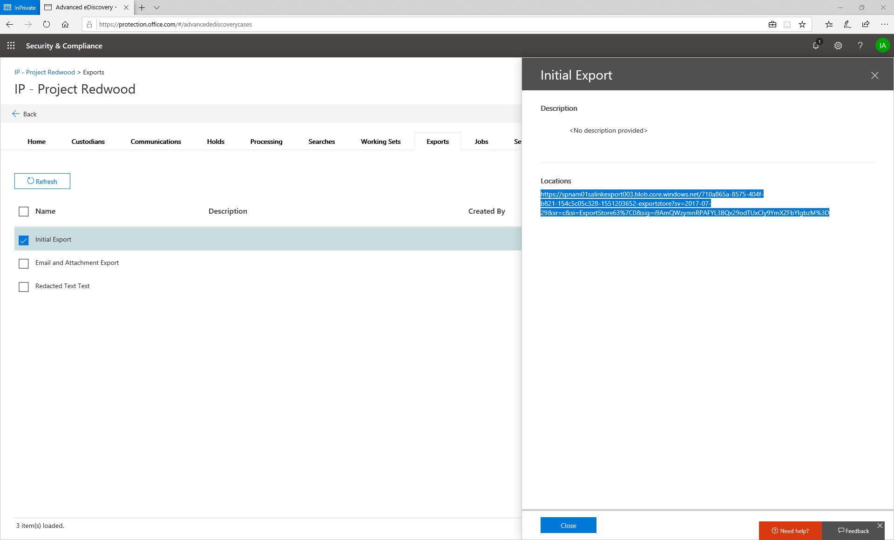

# 下载导出作业

所有导出的数据都将添加到 Microsoft Azure blob 中。 这提供了多个用于处理下游数据的选项。 有几种访问 Azure blob 的方法。 一种方法是使用 Azure 存储资源管理器。 此方法支持简单连接, 浏览和下载。 有关详细信息, 请访问<https://docs.microsoft.com/en-us/azure/storage/blobs/storage-quickstart-blobs-storage-explorer>

1.  若要在完成导出作业后下载内容, 请转到 "导出" 选项卡, 然后选择 "导出作业"。

2.  复制浮出控件的 "位置" 部分中的文本。

3.  打开 Azure 存储资源管理器, 然后单击 "连接" 按钮

4.  选择 "使用共享访问签名 URI", 然后单击 "下一步"

5.  将位置文本粘贴到 URI 文本框中, 然后单击 "下一步"

6.  单击 "连接"

这会将导出添加为存储在存储帐户/SAS 附加的服务/Blob 容器中的对象。 你将能够浏览导出和下载导出的全部或部分。

