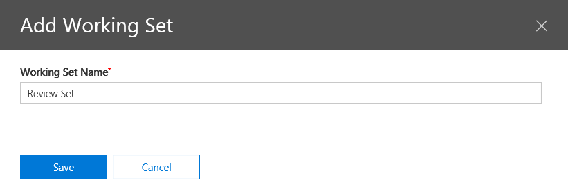
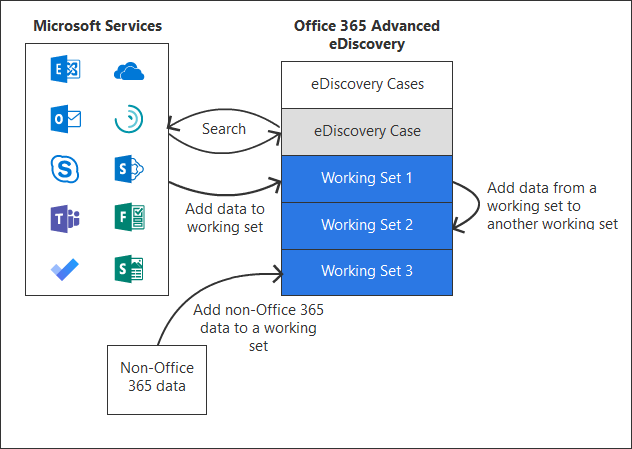

# 在高级电子数据展示中管理审阅集Manage review sets in Advanced eDiscovery

审阅集是一组静态文档, 您可以在其中分析、查询、查看、标记和导出数据。Review sets are a static set of documents where you can analyze, query, view, tag, and export data in a case. 有关执行这些任务的详细信息, 请参阅:For more information about performing these tasks, see:

- [分析评审集中的数据Analyze data in a review set](analyzing-data-in-review-set.md)

- [查询评审集中的数据Query the data in a review set](review-set-search.md)

- [查看审阅集中的文档View documents in a review set](view-documents-in-review-set.md)

- [在审阅集中标记文档Tag documents in a review set](tagging-documents.md)

- [导出事例数据Export case data](exporting-data-ediscover20.md)

## 创建审阅集Create a review set

通过单击 " **+ 添加审阅集**" 可在 "**查看集**" 选项卡上创建审阅集。Review sets can be created on the **Review sets** tab by clicking **+ Add review set**.

将显示一个浮出控件。A flyout is displayed.  只需对评审集进行命名即可单击 "**保存**"。Simply name the review set can click the **Save**.  新的审阅集将显示在 "**审阅集**" 选项卡上。The new review set is displayed on the **Review sets** tab.

有三种方法可将内容添加到审阅集:There are three ways to add content to a review set:

1. [将搜索结果添加到审阅集Add search results to a review set](add-data-to-review-set.md)

2. [将非 Office 365 数据加载到评审集中Load non-Office 365 data into a review set](load-non-office365-data.md)

3. [从另一个评审集向评审集添加数据](add-data-to-review-set-from-another-review-set.md)。[Add data to a review set from another review set](add-data-to-review-set-from-another-review-set.md).

