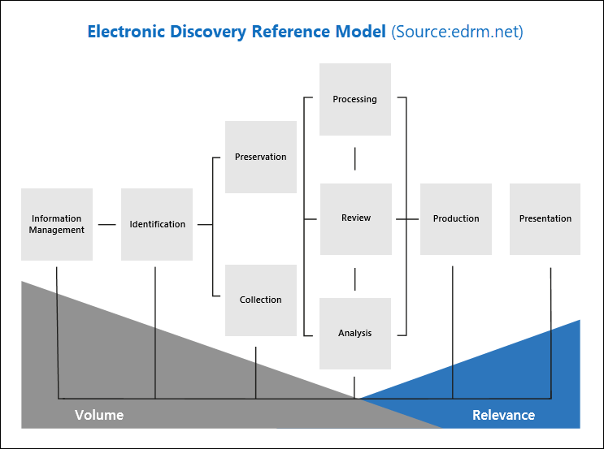

# 高级电子数据展示 （预览） Microsoft 365 中的概述

Microsoft 只是已发布预览版本是基于 Office 365 中现有的电子数据展示功能构建的更新高级电子数据展示工具。调用*高级电子数据展示 （预览）*，此预览版本提供的端到端工作流保留、 收集、 查看、 分析和导出内容的响应贵组织的内部和外部调查。 

## 与 EDRM 的对齐方式

高级电子数据展示 （预览） 的内置工作流与列出由电子发现参考模型 (EDRM) 的电子数据展示过程对齐。 

（由 edrm.net 图像源。源图像进行创作 Commons 归属 3.0 Unported 许可证下可用。）

在高级别，下面是如何高级电子数据展示 （预览） 支持 EDRM 工作流：

- **标识**-后识别潜在的调查感兴趣的人员，您可以将其添加为管理员 （也称为，*数据管理员*，因为他们可能拥有与调查相关的信息） 到高级电子数据展示 （预览） 大写。作为管理员添加用户后，很容易地保留、 收集和查看 custodian 文档。

- **保留**的保留和保护与调查相关的数据高级种情况下管理员与关联的数据源上发出的电子数据展示 （预览） 允许合法保留。您还可以将非监控数据置于保持状态。此外，高级电子数据展示 （预览） 具有内置 communications 工作流，因此您可以向管理员发送合法保留通知和跟踪其确认。

- **集合**的标识 （并保留） 与调查相关的数据源后，您可以使用高级电子数据展示 （预览） 搜索和收集实时数据中的内置搜索工具从监控数据源 （和非监控数据源，如果适用） 的可能与案例相关。

- **处理**-已收集与案例相关的所有数据后下, 一步是对其进行处理进一步评审和分析。在高级电子数据展示 （预览），这意味着在收集阶段中识别的就地数据复制到 Azure 存储位置 （称为*工作集*），它为您提供的静态视图的案例数据。 
 
- **查看**— 后数据已添加到工作集，您可以查看特定文档并运行其他查询到  
 
- **分析**-高级电子数据展示 （预览） 提供了集成的分析工具，可帮助您挑选数据从您确定工作集不与调查相关。除了减少相关的数据量，高级电子数据展示 （预览） 还有助于您通过让您组织内容以使审阅过程更容易、 更高效保存法律审阅成本。

- **生产**和**演示文稿**的准备就绪后，您可以从法律审阅工作集导出文档。您可以导出以本机格式或格式 EDRM 指定文档，以便他们可以导入到第三方查看应用程序。

## 高级电子数据展示 （预览） 工作流

以下各节介绍了高级电子数据展示 (Preview) 中的内置工作流中的每个步骤。下面的屏幕快照显示了名为*产品责任 2019002*种情况下的**主页**选项卡。请注意工作流选项卡在页面顶部的排序与 EDRM 过程对齐。 

有关高级电子数据展示 (Preview) 中的端到端工作流的详细信息，请参阅此[视频的 Microsoft 机制](https://go.microsoft.com/fwlink/?linkid=2066133)。 

## 管理保管人

使用**管理员**选项卡可以添加和管理已识别为情况值得关注的人员的人员。添加管理员后，可以快速执行 custodian 相关操作如 custodian 数据源上发出法律操作，如其邮箱和 OneDrive 帐户与管理员，通信和搜索 custodian 数据源收集内容这是与案例相关。作为案例的进度，则很容易添加新的管理员或发行版从用例的管理员。有关详细信息，请参阅[使用高级电子数据展示 (Preview) 中的管理员](managing-custodians.md)。

## 管理法律保留项通知

**Communications**选项卡用于管理与情况管理员的过程。合法保留通知指示要保留任何可能与案例相关的内容的管理员。法律团队必须能够跟踪的通知具有已收到、 读取，并确认的管理员。高级电子数据展示 (Preview) 中的 communications 工作流允许您创建和发送初始通知、 提醒、 版本通知和升级，如果管理员未确认保留通知。有关详细信息，请参阅[使用高级电子数据展示 (Preview) 中的通信](managing-custodian-communications.md)。

## 管理内容的保留

当您添加到案例的管理员时，您可以选择保留置于监控数据。使用**保存**选项卡来管理创建时添加管理员和管理其他法律保留项包含与大小写; 关联例如，可以标识和保留置于非监控数据源。此外可以编辑情况任何保留，然后将其基于查询的保留以便仅与查询匹配的内容将置于保持状态;例如，您无法添加日期范围到保留项，以便在特定日期范围中创建的唯一内容保留。您可以获取有关保留的内容的统计信息，删除之后无法再与这种情况，相关时将其保留或删除它。有关详细信息，请参阅[高级电子数据展示 (Preview) 中的管理保留项](managing-holds.md)。

## 索引 custodian 数据

当您添加到案例的管理员和相应的监控数据源时，（由调用*高级索引*进程） 重新编制索引 custodian 数据源的任何部分索引的项。这使监控的内容，如图像、 受支持的文件类型和其他可能不编入索引的内容运行搜索以收集与案例相关的数据时可完全搜索。使用**处理**选项卡来监视高级索引和修复处理错误 （使用过程杨柳*错误修正*。） 的状态有关详细信息，请参阅[处理高级电子数据展示 (Preview) 中的错误的修复](processing-data-for-case.md)。

## 收集事例数据

使用**搜索**选项卡的与案例相关的内容在 Office 365 中创建搜索以搜索就地监控和非监控数据源。您可以创建和运行基于查询的搜索 （使用关键字和条件） 来标识设置电子邮件和文档相关的大小写和您想要进一步查看和分析电子数据展示工作流中的后续步骤中。您可以创建与案例相关联的一个或多个搜索。此外，您可以使用搜索工具预览的示例文档和查看搜索统计信息可能有助于优化改进搜索结果。您一次搜索结果中包含的所有数据与案例相关、 搜索结果添加到进一步校对，分析工作集正在达到满意且有必要，挑选。有关详细信息，请参阅[高级电子数据展示 (Preview) 中用例收集数据](collecting-data-for-ediscovery.md)。

## 查看和 analyzig 案例数据

使用**处理设置**选项卡或查看和分析您已从 live 系统收集并添加到工作集的内容。*工作集*是静态集合 （换句话说，揭示数据的脱机副本） 的监控数据 (如果适用的话，非监控数据) 的电子数据展示工作流的早期阶段收集。当您将搜索结果添加到工作集时，将触发进程从容器中提取文件，提取元数据，并提取文本。完成此过程时，系统将生成新的索引从管理员收集并将其添加到工作集的所有数据。一旦数据添加到工作集，您可以运行其他查询来缩小范围案例数据作为文本或本机文件格式查看数据和批注、 标记密文，并在工作中的标记文档设置。此外，您可以执行高级分析功能，如标识文档重复、 电子邮件超线程，和主题。一旦您已选出仅所与案例相关的数据，您可以直接下载下载文档，或将其导出以及文件元数据、 批注和任何标记。有关详细信息，请参阅：

  - [查看高级电子数据展示 (Preview) 中的案例数据](reviewing-data-in-working-set.md)
  - [高级电子数据展示 (Preview) 中的工作集中分析数据](analyzing-data-in-working-set.md)

## 导出数据的查看和演示文稿

将数据导出从工作集后，使用**导出**选项卡管理导出作业和从工作集下载数据。导出工作集时，将数据上载到 Azure 的存储位置，然后可用于下载到本地计算机。您可以获取位置，并存储评估下载**导出**选项卡上的导出的数据所需的密钥。有关详细信息，请参阅[高级电子数据展示 (Preview) 中的导出案例数据](exporting-data-ediscover20.md)。

## 管理作业

使用**作业**选项卡来监视长时间运行过程已启动的与案例相关的任务、 为重新编制索引的搜索、 搜索和导出。例如，您可能包括大量数据源的**搜索**选项卡上创建一个新的搜索。在**作业**选项卡上显示此搜索过程的状态。有关详细信息，请参阅[高级电子数据展示 (Preview) 中的管理作业](managing-jobs-ediscovery20.md)。

## 配置事例设置

使用**设置**选项卡的配置案例范围的设置。这包括将成员添加到的情况下，关闭或删除种情况下，并配置搜索和分析的行为。有关详细信息，请参阅[配置高级电子数据展示 (Preview) 中的案例设置](configuring-case-settings-ediscovery20.md)。

