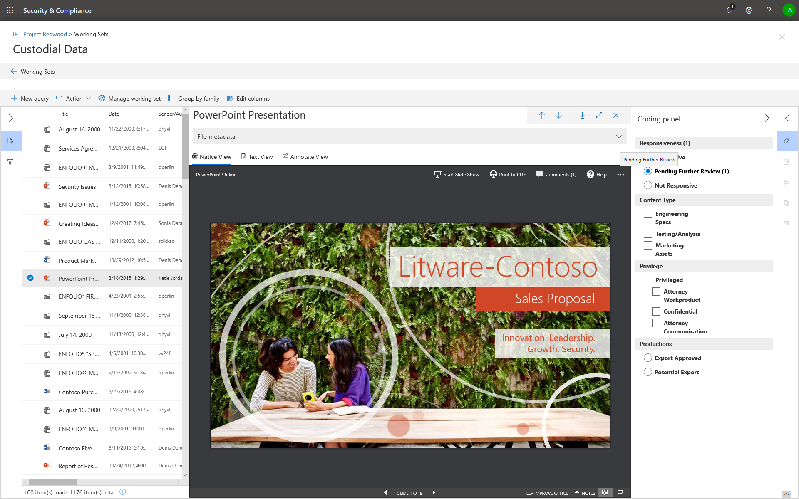

# 标记工作集中的文档

在工作集中组织内容对于在电子数据展示过程中完成各种工作流非常重要。 具体包括：

-  剔除不必要的内容。

- 标识相关内容。
 
-  确定必须由专家或律师审阅的内容。

当专家、律师或其他用户查看工作集中的内容时, 可以使用标记来捕获与内容相关的观点。 例如, 如果意图挑选不必要的内容, 则用户可以使用标记 (如 "无响应") 标记文档。 在查看并标记内容之后, 可以创建工作集搜索以排除任何标记为 "无响应" 的内容, 这将消除电子数据展示工作流中的后续步骤中的内容。 可以为每种情况自定义标签面板, 以便标记可以支持预期的审阅工作流。

## 标记类型

高级电子数据展示 (预览) 提供了两种类型的标记:

- **单个选择标记**-限制用户在组中选择一个标记。 这有助于确保用户不选择相互冲突的标记, 如 "响应式" 和 "无响应"。 

- **多选项标记**-允许用户选择组中的多个标记。

## 标记结构

除了标记类型之外, 标记面板中的标记组织方式的结构也可用于使标签文档更加直观。 标记按节分组。 工作集搜索支持按标记和按标记内容进行搜索的功能。 这意味着, 您可以创建工作集搜索, 以检索标记为某一节中的任何标记的文档。

可以通过在节中嵌套标记来进一步对标记进行组织。 例如, 如果目的是标识和标记特权内容, 则可以使用嵌套来清楚地表明用户可以将文档标记为 "特权", 并通过检查适当的嵌套标记来选择特权类型。

## 应用标记

有几种方法可将标记应用于内容。

### 为单个文档添加标签

在工作集中查看文档时, 可以通过单击 "**编码" 面板**显示审阅可使用的标记。

这将使您能够对显示在查看器中的文档应用标记。

### 批量标记

可以通过在结果网格中选择多个文件, 然后在**编码面板**中使用类似于单个文档的标记, 来完成批量标记。 可以通过选择两次标记来完成批量取消标记操作;第一次单击将应用标记, 第二个选择将确保清除所有选定文件的标记。

> [!NOTE]
> 批量标记时, 加标签面板将显示为面板中的每个标记标记的文件数。

### 在其他审阅面板中进行标记

审阅文档时, 可以使用其他审阅面板查看 "结果" 网格中文档的其他特征。 这包括查看其他相关文档、电子邮件线索、临近重复项和哈希重复项。 例如, 在审阅相关文档 (通过使用 "**文档系列**" 审阅面板) 时, 您可以通过批量标记相关文档显著减少审阅时间。 例如, 如果电子邮件中有多个附件, 并且您希望确保整个系列的标签一致。

例如, 下面介绍了如何在使用**文档系列**审阅面板时显示**编码面板**:

1. 对所选文档打开 "审阅" 面板 (例如, 在 "**文档系列**" 审阅面板中显示相关内容的列表) 时, 请单击 "当前审阅" 面板顶部的 "**代码文档**"。

   "编码" 面板显示为弹出窗口。

2. 选择一个或多个标记以应用选定的文档。 

3. 若要标记所有文档, 请选择 "**文档" 系列**面板中的 "所有文档", 单击 "**代码文档**", 然后选择要应用于整个文档系列的标记。

