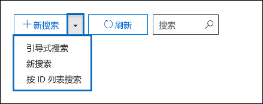
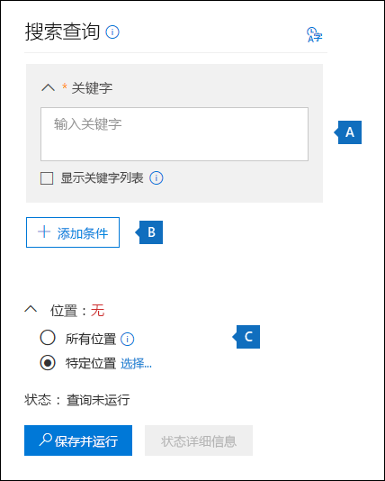
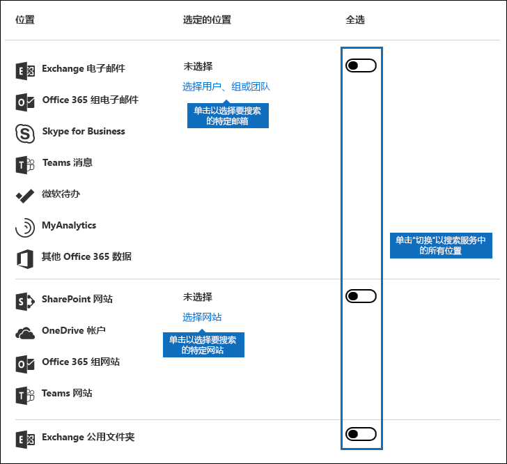
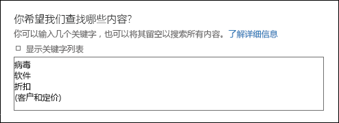
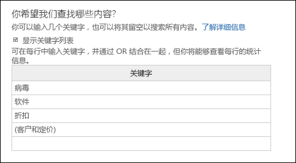
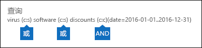
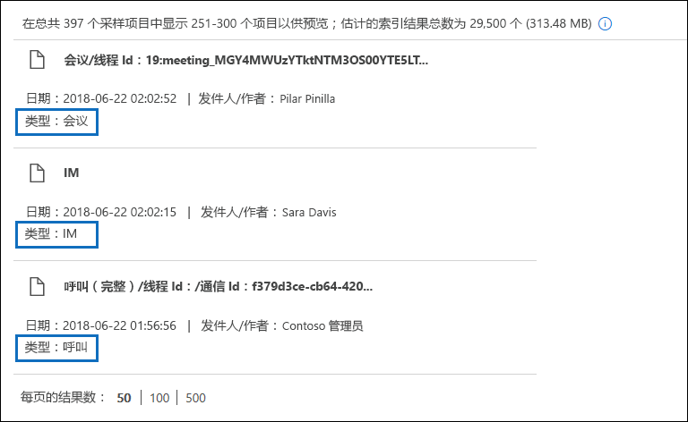
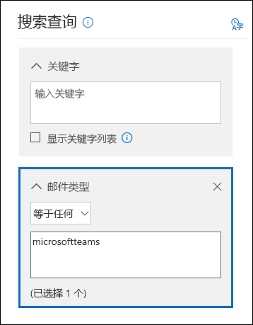

# <a name="content-search-in-office-365"></a>Office 365 中的内容搜索

您可以使用 office 365 安全&amp;合规中心中的内容搜索电子数据展示工具在 office 365 组织中搜索就地项目, 如电子邮件、文档和即时消息对话。 使用此工具搜索这些 Office 365 服务中的项目:
  
- Exchange Online 邮箱和公用文件夹
    
- SharePoint Online 网站和 OneDrive for business 帐户
    
- Skype for business 对话
    
- Microsoft Teams 
    
- Office 365 组
    
在运行内容搜索之后, 内容位置的数量和估计的搜索结果数将显示在搜索配置文件中。 您还可以快速查看统计信息, 例如与搜索查询匹配项最多的内容位置。 运行搜索后, 可以预览结果或将其导出到本地计算机。


## <a name="create-a-new-search"></a>创建新的搜索

若要访问**内容搜索**页以运行搜索和预览和导出搜索结果, 管理员、合规专员或电子数据展示管理器必须是安全&amp;合规性中心中的电子数据展示管理器角色组的成员。 有关详细信息, 请参阅[在 Office 365 安全&amp;合规中心中分配电子数据展示权限](assign-ediscovery-permissions.md)。
  
1. 转到 [https://protection.office.com](https://protection.office.com)。
    
2. 使用 Office 365 电子邮件地址和密码登录。 
    
3. 在安全&amp;合规性中心中, 单击 "**搜索&amp;调查** **** \>内容搜索"。
    
4. 在 "**搜索**" 页上, 单击 "  **新搜索**" 旁边的箭头。 
    
    
  
    解析内部邮件传递的邮件服务器地址时，使用“内部 DNS 查找”选项卡可以指定是使用该服务器上安装的网络适配器上配置的 DNS 服务器，还是使用特定的 DNS 服务器。内部 DNS 服务器用于解析组织内部服务器的 IP 地址。
    
  - **引导式搜索**-此选项将启动一个向导, 引导您完成创建搜索的向导。 用于选择内容位置和构建搜索查询的用户界面与**新的搜索**选项相同。 
    
  - **新搜索**-此选项显示一个已更新的用户界面, 以创建新的搜索。 如果单击 "**新建搜索**", 这是默认选项。
    
  - **按 ID 列表搜索**-此选项允许您使用 Exchange id 列表搜索特定的电子邮件和其他邮箱项目。 若要创建 ID 列表搜索 (正式称为目标搜索), 请提交一个逗号分隔值 (CSV) 文件, 该文件标识要搜索的特定邮箱项目。 有关说明, 请参阅[在 Office 365 中准备用于 ID 列表内容搜索的 CSV 文件](csv-file-for-an-id-list-content-search.md)。
    
    此过程中的其余步骤将遵循默认的新搜索工作流。
    
5. 在下拉列表中单击 "**新建搜索**"。 
    
6. 在 "**搜索查询**" 下, 指定以下内容。
    
    
  
- **要**在 "**关键字**" 框中键入搜索查询的关键字。 您可以指定关键字、邮件属性（例如发送和接收日期）或文档属性（例如文件名或上次更改文档的日期）。 您可以使用更复杂的查询, 这些查询使用布尔运算符, 例如**AND**、 **OR**、 **NOT**和**NEAR**。 您还可以在文档中搜索敏感信息 (如社会保险号), 或搜索在外部共享的文档。 如果将 "关键字" 框留空, 则位于指定内容位置的所有内容都将包含在搜索结果中。
    
    或者, 也可以单击 "**显示关键字列表**" 复选框, 并在每行中键入关键字。 如果这样做, 每行上的关键字都将通过逻辑运算符 ( **c:s**) 连接, 该运算符在创建的搜索查询中的**OR**运算符的功能类似。 
    
    为什么要使用关键字列表？ 您可以获取显示与每个关键字匹配的项目数的统计信息。 这可以帮助您快速确定哪些关键字最有效 (最少)。 您还可以在行中使用关键字短语 (括在括号中)。 有关搜索统计信息的详细信息, 请参阅[查看内容搜索结果的关键字统计](view-keyword-statistics-for-content-search.md)信息。

    [!NOTE] 为了帮助减少由大型关键字列表导致的问题, 您现在限制为关键字列表中的最多20行。
    
- **条件**-您可以添加搜索条件以缩小搜索范围, 并返回一组更细化的结果。 每个条件都会向搜索查询添加一个子句, 该子句在您开始搜索时创建并运行。 条件以逻辑方式连接到关键字查询 (在 "关键字" 框中指定), 逻辑运算符 ( **c:c**) 与**AND**运算符的功能相似。 这意味着项目必须同时满足关键字查询和要包含在结果中的一个或多个条件。 这就是条件如何帮助缩小结果范围的原理。 有关可在搜索查询中使用的条件的列表和说明, 请参阅[内容搜索的关键字查询和搜索条件](keyword-queries-and-search-conditions.md#search-conditions)中的 "搜索条件" 部分。
    
- **位置**-选择要搜索的内容位置。
    
  - **所有位置**-使用此选项可搜索组织中的所有内容位置。 这包括所有 Exchange 邮箱中的电子邮件 (包括所有非活动邮箱、所有 Office 365 组的邮箱、所有 Microsoft 团队的邮箱)、所有 Skype for business 对话、所有 SharePoint 和 OneDrive for business 网站 (包括网站对于所有 Office 365 组和 Microsoft 团队) 和所有 Exchange 公用文件夹中的项目。
    
  - **特定位置**-使用此选项可搜索特定的内容位置。 您可以搜索特定 Office 365 服务的所有内容位置 (例如, 搜索所有 Exchange 邮箱或搜索所有 SharePoint 网站), 也可以在显示的任何 Office 365 服务中搜索特定位置。 
    
    
  
    请注意, 您还可以向要搜索的 Exchange 邮箱列表中添加通讯组。 对于通讯组, 将搜索组成员的邮箱。 请注意, 不支持动态通讯组。
    
    **重要说明:** 当您搜索所有邮箱位置或仅搜索特定邮箱时, 当您导出内容搜索的结果时, 将包含 MyAnalytics 中的数据以及保存到用户邮箱的其他 Office 365 应用程序中的数据。 此数据不会包括在估计的搜索结果中, 也不会对预览提供支持。 它将仅在导出和下载搜索结果时包括;有关内容搜索的详细信息, 请参阅[从 MyAnalytics 和其他 Office 365 应用程序中导出数据](#exporting-data-from-myanalytics-and-other-office-365-applications)一节。 
    
7. 设置完搜索查询后, 请单击 "**保存&amp;运行**"。
    
8. 在 "**保存搜索**" 页上, 键入搜索的名称和可帮助标识搜索的可选说明。 请注意, 搜索的名称在您的组织中必须是唯一的。 
    
9. 单击 "**保存**" 以启动搜索。 
    
    在保存并运行搜索后, 搜索返回的任何结果都将显示在结果窗格中。 根据您配置预览设置的方式, 可以显示搜索结果, 也可以单击 "**预览结果**" 进行查看。 有关详细信息, 请参阅下一节。 
    
若要再次访问此内容搜索或访问 "**内容搜索**" 页上列出的其他内容搜索, 请选择搜索, 然后单击 "**打开**"。 
  
若要清除结果或创建新搜索, 请单击图标" "**新建搜索**"。 

  
## <a name="preview-search-results"></a>预览搜索结果

预览搜索结果有两个配置设置。 在运行新的新搜索或打开现有搜索后, 单击 "* * 单个结果 * *" 以查看以下预览设置: 
  

  
1. "**自动预览结果**"-此设置将在您运行搜索后显示搜索结果。
    
2. "**手动预览结果**"-此设置在 "搜索结果" 窗格中显示占位符, 并显示您必须单击以显示搜索结果的 "**预览结果**" 按钮。 这是默认设置;它有助于提高搜索性能, 因为打开现有搜索时不会自动显示搜索结果。 
    
与可预览的项目数相关的限制。 有关详细信息, 请参阅[Office 365 安全&amp;合规中心中的搜索限制](limits-for-content-search.md)。 
  
有关可预览的受支持文件类型的列表, 请参阅在 "有关内容搜索的详细信息" 部分[预览搜索结果](#previewing-search-results)。 如果文件类型不支持预览或下载文档的副本, 则可以单击 "**下载原始文件**" 将其下载到本地计算机。 对于 .aspx 网页, 如果您可能没有访问该页面的权限, 则会包含该页面的 URL。 
  
另请注意, 未编制索引的项目不能进行预览。
  
## <a name="view-information-and-statistics-about-a-search"></a>查看有关搜索的信息和统计信息

在创建和运行内容搜索之后, 您可以查看有关估计的搜索结果的统计信息。 其中包括搜索结果的摘要、查询统计信息 (如包含与搜索查询匹配的项目的内容位置数) 以及具有最匹配项的内容位置的名称。 您可以显示一个或多个内容搜索的统计信息。 这样, 您就可以快速比较多个搜索的结果, 并做出有关搜索查询有效性的决定。
  
您还可以将搜索统计信息和关键字统计信息下载到 CSV 文件中。 这使您可以使用 Excel 中的筛选和排序功能比较结果, 并准备您的搜索结果报告。
  
查看搜索统计信息:
  
1. 在安全&amp;合规性中心的 "**内容搜索**" 页上, 单击 "**打开**", 然后单击要查看其统计信息的搜索。 
    
2. 在 "飞出" 页面上, 单击 "**打开查询**"。 
    
3. 在 "**单个结果**" 下拉列表中, 单击 "**搜索配置文件**"。
    
4. 在 "**类型**" 下拉列表中, 根据您要查看的搜索统计信息, 单击下列选项之一。 
    
  - **摘要**-显示搜索的每个类型的内容位置的统计信息。 此内容包含与搜索查询匹配的项目的内容位置数, 以及搜索结果项目的总数和大小。 这是默认设置。
    
  - **查询**-显示有关搜索查询的统计信息。 这包括查询统计信息适用的内容位置的类型, 这些统计信息适用于的搜索查询部分 (请注意,**主要**是指整个搜索查询), 包含的项目的内容位置数匹配搜索查询, 以及与搜索查询匹配的已找到的 (在指定的内容位置) 的总数量和大小以及项目。 请注意, 还会显示未编制索引的项目 (也称为部分索引项目) 的统计信息。 但是, 只有来自邮箱的部分索引项才包含在统计信息中。 来自 SharePoint 和 OneDrive 的部分索引项目不包括在统计中。
    
  - **顶部位置**-显示与搜索查询在搜索的每个内容位置中的搜索查询匹配的项目数的统计信息。 将显示顶部的1000位置。
    
有关搜索统计信息的详细信息, 请参阅[查看内容搜索结果的关键字统计](view-keyword-statistics-for-content-search.md)信息。
  
  
## <a name="export-search-results"></a>导出搜索结果

成功运行搜索后, 可以将搜索结果导出到本地计算机。 导出电子邮件结果时, 可以将其作为 PST 文件或单个邮件 (.msg 文件) 下载到您的计算机上。 当您从 SharePoint 和 OneDrive 网站导出内容时, 会导出本机 Office 文档的副本。 导出的搜索结果中还包含其他文档和报告。 此外, 您还可以导出搜索结果报告, 而不是导出实际项目。
  
若要导出搜索结果:
  
1. 在安全&amp;合规性中心的 "**内容搜索**" 页上, 单击要为其导出搜索结果的搜索。 
    
2. 在 "飞出" 页面上 **更多**" "导出搜索结果" 图标, 然后单击 "**导出结果**"。 请注意, 您还可以导出搜索结果报告。
    
3. 完成 "**导出结果**" 飞出页面上的部分。 请务必使用滚动条查看所有导出选项。 
    
有关更多详细说明和疑难解答提示, 请参阅:
  
- [从 Office 365 安全&amp;合规中心导出搜索结果](export-search-results.md)
    
- [导出内容搜索报告](export-a-content-search-report.md)
    

  
## <a name="more-information-about-content-search"></a>有关内容搜索的详细信息

有关内容搜索的详细信息, 请参阅以下各节。
  
[内容搜索限制](#content-search-limits)
  
[生成搜索查询](#building-a-search-query)
  
[搜索 OneDrive 帐户](#searching-onedrive-accounts)
  
[搜索 Microsoft 团队和 Office 365 组](#searching-microsoft-teams-and-office-365-groups)
  
[搜索非活动邮箱](#searching-inactive-mailboxes)
  
[预览搜索结果](#previewing-search-results)
  
[部分索引项目](#partially-indexed-items)
  
[从 MyAnalytics 和其他 Office 365 应用程序导出数据](#exporting-data-from-myanalytics-and-other-office-365-applications)
  
### <a name="content-search-limits"></a>内容搜索限制

- 有关应用于内容搜索功能的限制的说明, 请参阅[Office 365 安全&amp;合规中心中的搜索限制](limits-for-content-search.md)。
    
- Microsoft 收集由所有 Office 365 组织运行的内容搜索的性能信息。 虽然搜索查询的复杂性可能会影响搜索时间, 但影响搜索所用时间的最大因素是搜索的邮箱数。 尽管 Microsoft 不提供搜索时间的服务级别协议, 但下表根据搜索中包括的邮箱数量列出了内容搜索的平均搜索时间。
    
|**邮箱数**|**平均搜索时间**|
|:-----|:-----|
|100  <br/> |30 秒  <br/> |
|1,000  <br/> |45秒  <br/> |
|10,000  <br/> |4 分钟  <br/> |
|25000  <br/> |10 分钟  <br/> |
|50000  <br/> |20 分钟  <br/> |
|100,000  <br/> |25 分钟  <br/> |
  
### <a name="building-a-search-query"></a>生成搜索查询

有关创建搜索查询、使用布尔搜索运算符和搜索条件以及搜索与组织外部用户共享的敏感信息类型和内容的详细信息, 请参阅[关键字查询和搜索条件用于内容搜索](keyword-queries-and-search-conditions.md)。
  
在使用关键字列表创建搜索查询时, 请记住以下事项。
  
- 您必须选择 "**显示关键字列表**" 复选框, 然后在单独的行中键入每个关键字, 以创建搜索查询, 在该查询中, 每行中的关键字 (或关键字短语) 通过**or**运算符连接。 如果只是将关键字列表粘贴到关键字框中或在键入关键字后按**enter**键, 则不会通过**or**运算符连接。 下面是添加关键字列表的错误和正确示例。 
    
    **不正确**
    
    
  
    **正确**
    
    
  
- 您还可以在 Excel 文件或纯文本文件中准备关键字或关键字短语列表, 然后将列表复制并粘贴到关键字列表中。 若要执行此操作, 必须选中 "**显示关键字列表**" 复选框。 然后, 单击 "关键字" 列表中的第一行并粘贴列表。 Excel 或文本文件中的每一行将粘贴到关键字列表中单独的行中。 
    
- 使用关键字列表创建查询之后, 最好验证搜索查询语法, 以使搜索查询成为您预期的结果。 在 "详细信息" 窗格的 "**查询**" 下显示的搜索查询中, 关键字由文本 **(c:s)** 分隔。 这表示关键字通过类似于功能的逻辑运算符连接到**OR**运算符。 同样, 如果您的搜索查询包含条件, 关键字和条件由文本 **(c:c)** 分隔。 这表示关键字连接到了与**and**运算符的功能类似的逻辑运算符的条件。 下面的示例展示了在使用关键字列表和条件时生成的搜索查询 (在详细信息窗格中)。 
    
    
  
- 运行内容搜索时, Office 365 将自动检查您的搜索查询中是否有不受支持的字符, 以及可能不大写的布尔运算符。 不受支持的字符通常是隐藏的, 通常会导致搜索错误或返回意外的结果。 有关检查不受支持的字符的详细信息, 请参阅[检查内容搜索查询是否有错误](check-your-content-search-query-for-errors.md)。
    
- 如果您有包含非英语字符关键字的搜索查询 (如中文字符), 您可以在内容搜索](media/8d4b60c8-e1f1-40f9-88ae-ee2a7eca0886.png)中单击 "**查询语言-国家/地区**。 本文中的此脚本创建一个文本文件, 其中包含所有 OneDrive 网站的列表。 若要运行此脚本, 您必须安装并使用 SharePoint Online 命令行管理程序。 请务必将组织的 "我的网站" 域的 URL 追加到要搜索的每个 OneDrive 站点。 这是包含所有 OneDrive 的域;例如, `https://contoso-my.sharepoint.com`。 下面的示例展示了用户的 OneDrive 网站的 URL: `https://contoso-my.sharepoint.com/personal/sarad_contoso_onmicrosoft.com`。
    
    在极少数情况下, 某人的用户主体名称 (UPN) 发生更改时, 其 OneDrive 位置的 URL 也将更改以包含新的 UPN。 如果发生这种情况, 您必须通过添加用户的新 OneDrive URL 并删除旧 URL 来修改内容搜索。
  
### <a name="searching-microsoft-teams-and-office-365-groups"></a>搜索 Microsoft 团队和 Office 365 组

您可以搜索与 Office 365 组或 Microsoft 团队相关联的邮箱。 由于 Microsoft 团队是基于 Office 365 组构建的, 因此搜索它们非常相似。 在这两种情况下, 仅搜索组或工作组邮箱;不搜索组或工作组成员的邮箱。 若要搜索这些文件, 您必须将其专门添加到搜索中。
  
在 Microsoft 团队和 Office 365 组中搜索内容时, 请记住以下事项。
  
- 若要搜索位于 Microsoft 团队和 Office 365 组中的内容, 您必须指定与团队或组相关联的邮箱和 SharePoint 网站。
    
- 在 Exchange Online 中运行**remove-unifiedgroup** cmdlet, 以查看 Microsoft 团队或 Office 365 组的属性。 如果要获取与团队或组相关联的网站的 URL, 这是一种很好的方法。 例如, 以下命令将显示名为 "高级领导" 团队的 Office 365 组的选定属性: 
    
  ```
  Get-UnifiedGroup "Senior Leadership Team" | FL DisplayName,Alias,PrimarySmtpAddress,SharePointSiteUrl
  DisplayName            : Senior Leadership Team
  Alias                  : seniorleadershipteam
  PrimarySmtpAddress     : seniorleadershipteam@contoso.onmicrosoft.com
  SharePointSiteUrl      : https://contoso.sharepoint.com/sites/seniorleadershipteam
  
  ```

    > [!NOTE]
    > 若要运行**remove-unifiedgroup** cmdlet, 您必须在 Exchange Online 中分配 "仅查看收件人" 角色, 或者是分配了 "仅查看收件人" 角色的角色组的成员。 
  
- 在搜索用户的邮箱时, 不会搜索用户是其成员的任何 Microsoft 团队或 Office 365 组。 同样, 当您搜索 Microsoft 团队或 Office 365 组时, 仅搜索您指定的组邮箱和组网站;除非将组成员的邮箱和 OneDrive for business 帐户显式添加到搜索中, 否则不会搜索这些帐户。
    
- 若要获取 Microsoft 团队或 office 365 组成员的列表, 您可以在 Office 365 管理中心的 "**家庭\>分组**" 页上查看属性。 或者, 您可以在 Exchange Online PowerShell 中运行以下命令: 
    
  ```
  Get-UnifiedGroupLinks <group or team name> -LinkType Members | FL DisplayName,PrimarySmtpAddress 
  ```

    > [!NOTE]
    > 若要运行**UnifiedGroupLinks** cmdlet, 您必须在 Exchange Online 中分配 "仅查看收件人" 角色, 或者是分配了 "仅查看收件人" 角色的角色组的成员。 
  
- 属于 microsoft 团队渠道的对话存储在与 microsoft 团队相关联的邮箱中。 同样, 在频道中共享的工作组成员的文件存储在团队的 SharePoint 网站上。 因此, 您必须将 Microsoft 团队邮箱和 SharePoint 网站添加为内容位置, 以便在频道中搜索对话和文件。
    
- 或者, 在 Microsoft 团队中作为聊天列表一部分的对话存储在参与聊天的用户的 Exchange Online 邮箱中。 以及用户在聊天对话中共享的文件存储在共享该文件的用户的 OneDrive for business 帐户中。 因此, 您必须将单个用户邮箱和 OneDrive for business 帐户添加为在聊天列表中搜索对话和文件的内容位置。
    
    > [!NOTE]
    > 在 Exchange 混合部署中, 具有本地邮箱的用户可能会参与属于 Microsoft 团队中的聊天列表的对话。 在这种情况下, 这些对话中的内容也是可搜索的, 因为它保存到基于云的存储区域 (称为*本地用户的基于云的邮箱*), 以供拥有本地邮箱的用户使用。 有关详细信息, 请参阅在[Office 365 中搜索本地用户的基于云的邮箱](search-cloud-based-mailboxes-for-on-premises-users.md)。
  
- 每个 Microsoft 团队或团队频道都包含用于笔记记录和协作的 Wiki。 Wiki 内容将自动保存到格式为 .mht 的文件中。 此文件存储在团队的 SharePoint 网站上的 "团队 Wiki 数据" 文档库中。 您可以使用内容搜索工具来搜索 Wiki, 具体方法是将团队的 SharePoint 网站指定为要搜索的内容位置。 
    
    > [!NOTE]
    > 在 Microsoft 团队或频道中搜索 Wiki 的功能 (在搜索团队的 SharePoint 网站时) 在2017年6月22日发布。 在该日期或之后保存或更新的 Wiki 页面可供搜索。 上次保存或更新的 Wiki 页面在该日期不可用于搜索之前。 
 
- Microsoft 团队频道中的会议和呼叫的摘要信息也存储在拨入会议或呼叫的用户的邮箱中。 这意味着您可以使用内容搜索来搜索这些摘要记录。 摘要信息包括: 
  - 日期、开始时间、结束时间和会议或呼叫的持续时间

  - 每个参与者加入或离开会议或呼叫的日期和时间

  - 发送给语音邮件的呼叫

  - 未接或未应答的呼叫

  - 呼叫转移, 表示为两个单独的呼叫

  请注意, 会议最长可能需要8个小时, 并且呼叫摘要记录可供搜索。

  在搜索结果中, 在 "**类型" 字段**中将会议摘要标识为 "**会议**";呼叫摘要标识为 "**呼叫**"。 此外, 属于团队频道和1xN 聊天的对话在 "**类型**" 字段中被标识为**IM** 。
  
  

- 您可以使用**Kind**电子邮件属性或**邮件类型**搜索条件专门搜索 Microsoft 团队中的内容。 
  - 若要将**Kind**属性用作关键字搜索查询的一部分, 请在搜索查询的 "**关键字**" 框中键入`kind:microsoftteams`。

    
  
  - 若要使用搜索条件, 请添加**邮件类型**条件并使用值`microsoftteams`。 

    

请注意, **and**运算符将条件以逻辑方式连接到关键字查询。 这意味着项目必须同时匹配关键字查询和搜索结果中要返回的搜索条件。 有关详细信息, 请参阅关键字查询和搜索条件中的 "使用条件指南" 部分的[内容搜索的关键字查询和搜索条件。](keyword-queries-and-search-conditions.md#guidelines-for-using-conditions)

  
### <a name="searching-inactive-mailboxes"></a>搜索非活动邮箱

可以在内容搜索中搜索非活动邮箱。 若要获取组织中非活动邮箱的列表, 请在 Exchange Online `Get-Mailbox -InactiveMailboxOnly` PowerShell 中运行命令。 或者, 您可以转到](media/9723029d-e5cd-4740-b5b1-2806e4f28208.gif) \>安全&amp;合规性中心中的 "**数据管理** \> "**保留**, 然后单击 "**更多**
    
  - [在 Office 365 中还原非活动邮箱](restore-an-inactive-mailbox.md)
    
  - [删除 Office 365 中的非活动邮箱](delete-an-inactive-mailbox.md)

  
### <a name="previewing-search-results"></a>预览搜索结果

您可以在预览窗格中预览受支持的文件类型。 如果文件类型不受支持, 则必须将该文件的副本下载到本地计算机以进行查看。 支持以下文件类型, 并可在搜索结果窗格中进行预览。
  
- .txt、.html、mhtml
    
- .eml
    
- .doc、.docx、. .docm
    
- . .pptm、.pptx
    
- .pdf
    
此外, 还支持以下文件容器类型。 您可以在预览窗格中查看容器中的文件列表。
  
- .zip
    
- gzip
    
### <a name="partially-indexed-items"></a>部分索引项目

- 如前所述, 邮箱中部分索引的项目包含在估计的搜索结果中;来自 SharePoint 和 OneDrive 的部分索引项目不包含在估计的搜索结果中。 
    
- 如果部分项目与搜索查询匹配 (因为其他邮件或文档属性满足搜索条件), 则不会将其包含在未编制索引项目的估计数量中。 如果搜索条件排除了部分项目, 它也不会包含在部分索引项目的估计数量中。 有关详细信息, 请参阅[Office 365 中的内容搜索中的部分索引项](partially-indexed-items-in-content-search.md)。
    
### <a name="exporting-data-from-myanalytics-and-other-office-365-applications"></a>从 MyAnalytics 和其他 Office 365 应用程序导出数据

- 来自 MyAnalytics 的数据 (例如, 用户如何根据邮箱中的邮件和日历数据使用其时间的见解) 和来自其他 Office 365 应用程序的数据都保存在用户的基于云的邮箱的隐藏位置 (在非 IPM 子树中)。 在运行内容搜索后, 这些数据不会包括在估计的搜索结果、查询统计信息中, 也不能用于预览。 但是, 当您导出搜索结果时, 将导出此数据。
    
- MyAnalytics 数据和其他 office 365 应用程序中的数据将被导出到名为 "其他 office 365 data" 的文件夹中。 此文件夹包括每个用户的子文件夹。
  
