# <a name="create-a-custom-sensitive-information-type"></a><span data-ttu-id="63a93-106">创建自定义敏感信息类型</span><span class="sxs-lookup"><span data-stu-id="63a93-106">Create a custom sensitive information type</span></span>

<span data-ttu-id="63a93-p102">Office 365 中的数据丢失防护 (DLP) 包含许多[敏感信息类型](what-the-sensitive-information-types-look-for.md)，可供用于 DLP 策略。这些内置类型可有助于标识和保护信用卡号、银行帐号、护照号等。</span><span class="sxs-lookup"><span data-stu-id="63a93-p102">Data loss prevention (DLP) in Office 365 includes many [sensitive information types](what-the-sensitive-information-types-look-for.md) that are ready for you to use in your DLP policies. These built-in types can help identify and protect credit card numbers, bank account numbers, passport numbers, and more.</span></span> 
  
<span data-ttu-id="63a93-p103">不过，如果需要标识和保护其他类型的敏感信息（例如，使用组织专用格式的员工 ID），可创建自定义敏感信息类型。敏感信息类型是在称为“规则包”的 XML 文件中进行定义。</span><span class="sxs-lookup"><span data-stu-id="63a93-p103">But if you need to identify and protect a different type of sensitive information - for example, an employee ID that uses a format specific to your organization - you can create a custom sensitive information type. A sensitive information type is defined in an XML file called a rule package.</span></span>
  
<span data-ttu-id="63a93-p104">本主题介绍了如何创建定义你自己的自定义敏感信息类型的 XML 文件。你需要知道如何创建正则表达式。例如，本主题创建标识员工 ID 的自定义敏感信息类型。你可从此示例 XML 入手，创建自己的 XML 文件。</span><span class="sxs-lookup"><span data-stu-id="63a93-p104">This topic shows you how to create an XML file that defines your own custom sensitive information type. You need to know how to create a regular expression. As an example, this topic creates a custom sensitive information type that identifies an employee ID. You can use this example XML as a starting point for your own XML file.</span></span>
  
<span data-ttu-id="63a93-p105">创建格式标准的 XML 文件后，可直接使用 PowerShell 将它上传到 Office 365。然后就可以在 DLP 策略中使用自定义敏感信息类型，并测试它能否按预期检测敏感信息。</span><span class="sxs-lookup"><span data-stu-id="63a93-p105">After you've created a well-formed XML file, you can upload it to Office 365 by using PowerShell. Then you're ready to use your custom sensitive information type in your DLP policies and test that it's detecting the sensitive information as you intended.</span></span>

## <a name="important-disclaimer"></a><span data-ttu-id="63a93-117">重要免责声明</span><span class="sxs-lookup"><span data-stu-id="63a93-117">Important disclaimer</span></span>

<span data-ttu-id="63a93-p106">由于客户环境和内容匹配要求的多样性，Microsoft 支持部门无法帮助提供自定义内容匹配定义（例如，定义自定义分类或正则表达式模式 (“RegEx”)）。对于自定义内容匹配的开发、测试和调试，Office 365 客户将需要依赖于内部 IT 资源，或使用 Microsoft 咨询服务 (MCS) 等外部咨询资源。支持工程师可提供针对功能的有限支持，但无法保证任何自定义内容匹配开发都将满足客户的要求或义务。作为可提供的支持类型的示例，可以提供示例正则表达式模式以供测试使用。或者，支持人员可以帮助对现有 RegEx 模式（单个特定内容示例未按预期触发）进行故障排除。</span><span class="sxs-lookup"><span data-stu-id="63a93-p106">Due to the variances in customer environments and content match requirements, Microsoft Support cannot assist in providing custom content-matching definitions – e.g. defining custom classifications or regular expression patterns (“RegEx”). For custom content-matching development, testing, and debugging, Office 365 customers will need to rely upon internal IT resources, or use an external consulting resource such as Microsoft Consulting Services (MCS).  Support engineers can provide limited support for the feature, but cannot provide assurances that any custom content-matching development will fulfill the customer’s requirements or obligations.  As an example of the type of support which can be provided, sample regular expression patterns may be provided for testing purposes. Or support can assist with troubleshooting an existing RegEx pattern which is not triggering as expected with a single specific content example.</span></span>

 <span data-ttu-id="63a93-123">有关用于处理文本的 .NET regex 引擎的其他信息，请参阅有关 [.NET 中的正则表达式](https://docs.microsoft.com/zh-CN/dotnet/standard/base-types/regular-expressions)的文档。</span><span class="sxs-lookup"><span data-stu-id="63a93-123">For additional information on the .NET regex engine that's used for processing the text, see the documentaiton on [Regular Expressions in .NET](https://docs.microsoft.com/zh-CN/dotnet/standard/base-types/regular-expressions).</span></span>
    
## <a name="sample-xml-of-a-rule-package"></a><span data-ttu-id="63a93-124">规则包 XML 示例</span><span class="sxs-lookup"><span data-stu-id="63a93-124">Sample XML of a rule package</span></span>

<span data-ttu-id="63a93-p107">下面就是本主题将创建的规则包 XML 示例。下面各部分介绍了元素和特性。</span><span class="sxs-lookup"><span data-stu-id="63a93-p107">Here's the sample XML of the rule package that we'll create in this topic. Elements and attributes are explained in the sections below.</span></span>
  
```
<?xml version="1.0" encoding="UTF-16"?>
<RulePackage xmlns="http://schemas.microsoft.com/office/2011/mce">
<RulePack id="DAD86A92-AB18-43BB-AB35-96F7C594ADAA">
    <Version build="0" major="1" minor="0" revision="0"/>
    <Publisher id="619DD8C3-7B80-4998-A312-4DF0402BAC04"/>
    <Details defaultLangCode="en-us">
        <LocalizedDetails langcode="en-us">
            <PublisherName>Contoso</PublisherName>
            <Name>Employee ID Custom Rule Pack</Name>
            <Description>
            This rule package contains the custom Employee ID entity.
            </Description>
        </LocalizedDetails>
    </Details>
</RulePack>
<Rules>
<!-- Employee ID -->
    <Entity id="E1CC861E-3FE9-4A58-82DF-4BD259EAB378" patternsProximity="300" recommendedConfidence="70">
        <Pattern confidenceLevel="60">
            <IdMatch idRef="Regex_employee_id"/>
        </Pattern>
        <Pattern confidenceLevel="70">
            <IdMatch idRef="Regex_employee_id"/>
            <Match idRef="Func_us_date"/>
        </Pattern>
        <Pattern confidenceLevel="80">
            <IdMatch idRef="Regex_employee_id"/>
            <Match idRef="Func_us_date"/>
            <Any minMatches="1">
                <Match idRef="Keyword_badge" minCount="2"/>
                <Match idRef="Keyword_employee"/>
            </Any>
            <Any minMatches="0" maxMatches="0">
                <Match idRef="Keyword_false_positives_local"/>
                <Match idRef="Keyword_false_positives_intl"/>
            </Any>
        </Pattern>
    </Entity>
    <Regex id="Regex_employee_id">(\s)(\d{9})(\s)</Regex>
    <Keyword id="Keyword_employee">
        <Group matchStyle="word">
            <Term>Identification</Term>
            <Term>Contoso Employee</Term>
        </Group>
    </Keyword>
    <Keyword id="Keyword_badge">
        <Group matchStyle="string">
            <Term>card</Term>
            <Term>badge</Term>
            <Term caseSensitive="true">ID</Term>
        </Group>
    </Keyword>
    <Keyword id="Keyword_false_positives_local">
        <Group matchStyle="word">
            <Term>credit card</Term>
            <Term>national ID</Term>
        </Group>
    </Keyword>
    <Keyword id="Keyword_false_positives_intl">
        <Group matchStyle="word">
            <Term>identity card</Term>
            <Term>national ID</Term>
            <Term>EU debit card</Term>
        </Group>
    </Keyword>
    <LocalizedStrings>
        <Resource idRef="E1CC861E-3FE9-4A58-82DF-4BD259EAB378">
            <Name default="true" langcode="en-us">Employee ID</Name>
            <Description default="true" langcode="en-us">
            A custom classification for detecting Employee IDs.
            </Description>
            <Name default="true" langcode="de-de">Name for German locale</Name>
            <Description default="true" langcode="de-de">
            Description for German locale.
            </Description>
        </Resource>
    </LocalizedStrings>
</Rules>
</RulePackage>

```

## <a name="what-are-your-key-requirements-rule-entity-pattern-elements"></a><span data-ttu-id="63a93-p108">关键要求是什么？[Rule、Entity、Pattern 元素]</span><span class="sxs-lookup"><span data-stu-id="63a93-p108">What are your key requirements? [Rule, Entity, Pattern elements]</span></span>

<span data-ttu-id="63a93-129">开始前，有必要了解规则 XML 架构的基本结构，以及如何使用这种结构来定义用于标识适当内容的自定义敏感信息类型。</span><span class="sxs-lookup"><span data-stu-id="63a93-129">Before you get started, it's helpful to understand the basic structure of the XML schema for a rule, and how you can use this structure to define your custom sensitive information type so that it will identify the right content.</span></span>
  
<span data-ttu-id="63a93-p109">一个规则定义一个或多个实体（即敏感信息类型），每个实体定义一个或多个模式。模式是 DLP 在评估电子邮件和文档等内容时查找的内容。</span><span class="sxs-lookup"><span data-stu-id="63a93-p109">A rule defines one or more entities (sensitive information types), and each entity defines one or more patterns. A pattern is what DLP looks for when it evaluates content such as email and documents.</span></span>
  
<span data-ttu-id="63a93-p110">（术语简要说明：如果熟悉 DLP 策略，便会知道一个策略包含一个或多个规则，而规则又由条件和操作组成。不过，在本主题中，XML 标记使用规则来表示定义实体（亦称为“敏感信息类型”）的模式。所以，在本主题中，若看到规则，请联想到实体或敏感信息类型，而不是条件和操作。）</span><span class="sxs-lookup"><span data-stu-id="63a93-p110">(A quick note on terminology - if you're familiar with DLP policies, you know that a policy contains one or more rules comprised of conditions and actions. However, in this topic, the XML markup uses rule to mean the patterns that define an entity, also known as a sensitive information type. So in this topic, when you see rule, think entity or sensitive information type, not conditions and actions.)</span></span>
  
### <a name="simplest-scenario-entity-with-one-pattern"></a><span data-ttu-id="63a93-135">最简单方案：包含一个模式的实体</span><span class="sxs-lookup"><span data-stu-id="63a93-135">Simplest scenario: entity with one pattern</span></span>

<span data-ttu-id="63a93-p111">下面来看看最简单方案：假设你希望 DLP 策略标识的内容包含采用九位数格式的组织员工 ID。因此，模式是指规则中用于标识九位数的正则表达式。任何包含九位数的内容都符合模式。</span><span class="sxs-lookup"><span data-stu-id="63a93-p111">Here's the simplest scenario. You want your DLP policy to identify content that contains your organization's employee ID, which is formatted as a nine-digit number. So the pattern refers to a regular expression contained in the rule that identifies nine-digit numbers. Any content containing a nine-digit number satisfies the pattern.</span></span>
  
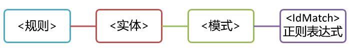
  
<span data-ttu-id="63a93-141">虽然简单，但此模式可能会标识许多误报内容，因为包含任何九位数的匹配内容不一定是员工 ID。</span><span class="sxs-lookup"><span data-stu-id="63a93-141">However, while simple, this pattern may identify many false positives by matching content that contains any nine-digit number that is not necessarily an employee ID.</span></span>
  
### <a name="more-common-scenario-entity-with-multiple-patterns"></a><span data-ttu-id="63a93-142">更常见方案：包含多个模式的实体</span><span class="sxs-lookup"><span data-stu-id="63a93-142">More common scenario: entity with multiple patterns</span></span>

<span data-ttu-id="63a93-143">因此，更常见的做法是使用多个模式定义实体。这样，除了实体（如九位数）外，这些模式还可标识证据（如关键字或日期）。</span><span class="sxs-lookup"><span data-stu-id="63a93-143">For this reason, it's more common to define an entity by using more than one pattern, where the patterns identify supporting evidence (such as a keyword or date) in addition to the entity (such as a nine-digit number).</span></span>
  
<span data-ttu-id="63a93-144">例如，若要更有胜算地标识包含员工 ID 的内容，除了九位数外，还可以定义另一种模式来标识聘用日期，并再定义一种模式来标识聘用日期和关键字（如“员工 ID”）。</span><span class="sxs-lookup"><span data-stu-id="63a93-144">For example, to increase the likelihood of identifying content that contains an employee ID, you can define another pattern that also identifies a hire date, and define yet another pattern that identifies both a hire date and a keyword (such as "employee ID"), in addition to the nine-digit number.</span></span>
  
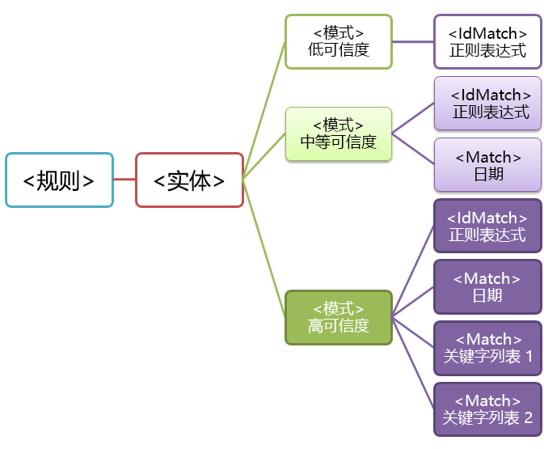
  
<span data-ttu-id="63a93-146">对于此结构，请务必注意以下几点：</span><span class="sxs-lookup"><span data-stu-id="63a93-146">Note a couple of important aspects of this structure:</span></span>
  
- <span data-ttu-id="63a93-p112">需要更多证据的模式的可信度更高。这一点非常有用，因为稍后在 DLP 策略中使用此敏感信息类型时，可以仅对更高可信度匹配内容执行更具限制性的操作（如屏蔽内容），并对更低可信度匹配内容执行不太具有限制性的操作（如发送通知）。</span><span class="sxs-lookup"><span data-stu-id="63a93-p112">Patterns that require more evidence have a higher confidence level. This is useful because when you later use this sensitive information type in a DLP policy, you can use more restrictive actions (such as block content) with only the higher-confidence matches, and you can use less restrictive actions (such as send notification) with the lower-confidence matches.</span></span>
    
- <span data-ttu-id="63a93-p113">支持元素 IdMatch 和 Match 引用的正则表达式和关键字实际上是 Rule 元素（而不是 Pattern 元素）的子级。这些支持元素是由 Pattern 引用，但包含在 Rule 中。也就是说，单个定义的支持元素（如正则表达式或关键字列表）可被多个实体和模式引用。</span><span class="sxs-lookup"><span data-stu-id="63a93-p113">The supporting IdMatch and Match elements reference regexes and keywords that are actually children of the Rule element, not the Pattern. These supporting elements are referenced by the Pattern but included in the Rule. This means that a single definition of a supporting element, like a regular expression or a keyword list, can be referenced by multiple entities and patterns.</span></span>
    
## <a name="what-entity-do-you-need-to-identify-entity-element-id-attribute"></a><span data-ttu-id="63a93-p114">需要标识什么实体？[Entity 元素，id 特性]</span><span class="sxs-lookup"><span data-stu-id="63a93-p114">What entity do you need to identify? [Entity element, id attribute]</span></span>

<span data-ttu-id="63a93-p115">实体是包含明确定义的模式的敏感信息类型，如信用卡号。每个实体都有一个唯一 GUID 作为自己的 ID。</span><span class="sxs-lookup"><span data-stu-id="63a93-p115">An entity is a sensitive information type, such as a credit card number, that has a well-defined pattern. Each entity has a unique GUID as its ID.</span></span>
  
### <a name="name-the-entity-and-generate-its-guid"></a><span data-ttu-id="63a93-156">命名实体并生成 GUID</span><span class="sxs-lookup"><span data-stu-id="63a93-156">Name the entity and generate its GUID</span></span>

<span data-ttu-id="63a93-p116">添加 Rule 和 Entity 元素。然后，添加注释以说明自定义实体的名称（在本示例中，为“员工 ID”）。稍后，将把实体名称添加到本地化字符串部分，此名称就是在创建 DLP 策略时在 UI 中看到的名称。</span><span class="sxs-lookup"><span data-stu-id="63a93-p116">Add the Rules and Entity elements. Then add a comment that contains the name of your custom entity - in this example, Employee ID. Later, you'll add the entity name to the localized strings section, and that name is what appears in the UI when you create a DLP policy.</span></span>
  
<span data-ttu-id="63a93-p117">接下来，生成实体 GUID。虽然生成 GUID 的方法有很多，但可通过在 PowerShell 中键入 [guid]::NewGuid() 轻松完成。稍后，也将把实体 GUID 添加到本地化字符串部分。</span><span class="sxs-lookup"><span data-stu-id="63a93-p117">Next, generate a GUID for your entity. There are several ways to generate GUIDs, but you can do it easily in PowerShell by typing [guid]::NewGuid(). Later, you'll also add the entity GUID to the localized strings section.</span></span>
  
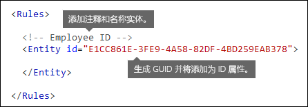
  
## <a name="what-pattern-do-you-want-to-match-pattern-element-idmatch-element-regex-element"></a><span data-ttu-id="63a93-p118">要匹配什么模式？[Pattern 元素、IdMatch 元素、Regex 元素]</span><span class="sxs-lookup"><span data-stu-id="63a93-p118">What pattern do you want to match? [Pattern element, IdMatch element, Regex element]</span></span>

<span data-ttu-id="63a93-p119">模式包含敏感信息类型要查找的内容列表。其中可能包括正则表达式、关键字和内置函数（用于执行任务，如运行正则表达式以查找日期或地址）。敏感信息类型可包含多个具有唯一可信度的模式。</span><span class="sxs-lookup"><span data-stu-id="63a93-p119">The pattern contains the list of what the sensitive information type is looking for. This can include regexes, keywords, and built-in functions (which perform tasks like running regexes to find dates or addresses). Sensitive information types can have multiple patterns with unique confidences.</span></span>
  
<span data-ttu-id="63a93-p120">以下所有模式的共同点是，全都引用同一个正则表达式，以查找两边是空格 (\s) ... (\s) 的九位数 (\d{9})。此正则表达式由 IdMatch 元素引用，同时也是所有查找“员工 ID”实体的模式的通用要求。IdMatch 是模式尝试匹配的标识符，如员工 ID、信用卡号或身份证号。每个 Pattern 元素只能有一个 IdMatch 元素。</span><span class="sxs-lookup"><span data-stu-id="63a93-p120">What all of the below patterns have in common is that they all reference the same regular expression, which looks for a nine-digit number (\d{9}) surrounded by white space (\s) … (\s). This regular expression is referenced by the IdMatch element and is the common requirement for all patterns that look for the Employee ID entity. IdMatch is the identifier that the pattern is to trying to match, such as Employee ID or credit card number or social security number. A Pattern element must have exactly one IdMatch element.</span></span>
  
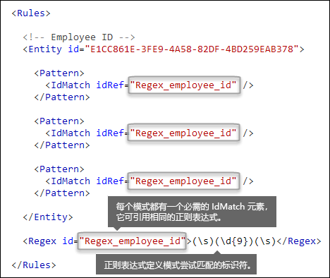
  
<span data-ttu-id="63a93-p121">若符合，模式返回可用于 DLP 策略中条件的计数和可信度。向 DLP 策略添加用于检测敏感信息类型的条件时，可编辑计数和可信度，如下所示。本主题稍后将介绍可信度（亦称为“匹配准确度”）。</span><span class="sxs-lookup"><span data-stu-id="63a93-p121">When satisfied, a pattern returns a count and confidence level, which you can use in the conditions in your DLP policy. When you add a condition for detecting a sensitive information type to a DLP policy, you can edit the count and confidence level as shown here. Confidence level (also called match accuracy) is explained later in this topic.</span></span>
  

  
<span data-ttu-id="63a93-p122">创建正则表达式时，请注意一些潜在问题。例如，如果编写并上传的正则表达式标识过多内容，这可能会影响性能。若要详细了解这些潜在问题，请参阅后面的[要注意的潜在验证问题](#potential-validation-issues-to-be-aware-of)部分。</span><span class="sxs-lookup"><span data-stu-id="63a93-p122">When you create your regular expression, keep in mind that there are potential issues to be aware of. For example, if you write and upload a regex that identifies too much content, this can impact performance. To learn more about these potential issues, see the later section [Potential validation issues to be aware of](#potential-validation-issues-to-be-aware-of).</span></span>
  
## <a name="do-you-want-to-require-additional-evidence-match-element-mincount-attribute"></a><span data-ttu-id="63a93-p123">是否需要其他证据？[Match 元素、minCount 特性]</span><span class="sxs-lookup"><span data-stu-id="63a93-p123">Do you want to require additional evidence? [Match element, minCount attribute]</span></span>

<span data-ttu-id="63a93-184">除了 IdMatch 外，模式还可以使用 Match 元素来要求发现其他证据，如关键字、正则表达式、日期或地址。</span><span class="sxs-lookup"><span data-stu-id="63a93-184">In addition to the IdMatch, a pattern can use the Match element to require additional supporting evidence, such as a keyword, regex, date, or address.</span></span>
  
<span data-ttu-id="63a93-p124">一个 Pattern 可包含多个 Match 元素；可以直接将 Match 元素添加到 Pattern 元素中，也可以使用 Any 元素合并 Match 元素。Match 元素通过隐式 AND 运算符进行联接；必须符合所有 Match 元素，才算与模式匹配。可使用 Any 元素引入 AND 或 OR 运算符（有关详细信息，请参阅后面的部分）。</span><span class="sxs-lookup"><span data-stu-id="63a93-p124">A Pattern can include multiple Match elements; they can be included directly in the Pattern element or combined by using the Any element. Match elements are joined by an implicit AND operator; all Match elements must be satisfied for the pattern to be matched. You can use the Any element to introduce AND or OR operators (more on that in a later section).</span></span>
  
<span data-ttu-id="63a93-p125">可选的 minCount 特性可用于指定，必须为每个 Match 元素找到多少个匹配实例。例如，可指定至少必须找到关键字列表中的两个关键字时，才算符合模式。</span><span class="sxs-lookup"><span data-stu-id="63a93-p125">You can use the optional minCount attribute to specify how many instances of a match need to be found for each of the Match elements. For example, you can specify that a pattern is satisfied only when at least two keywords from a keyword list are found.</span></span>
  
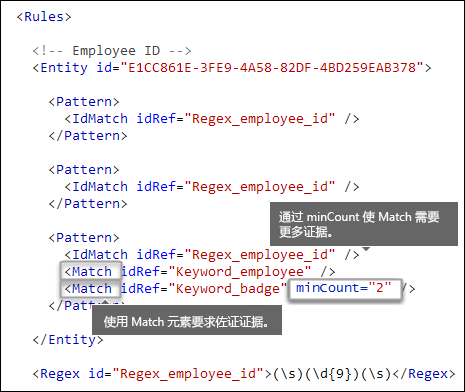
  
### <a name="keywords-keyword-group-and-term-elements-matchstyle-and-casesensitive-attributes"></a><span data-ttu-id="63a93-191">关键字 [Keyword、Group 和 Term 元素，matchStyle 和 caseSensitive 特性]</span><span class="sxs-lookup"><span data-stu-id="63a93-191">Keywords [Keyword, Group, and Term elements, matchStyle and caseSensitive attributes]</span></span>

<span data-ttu-id="63a93-p126">通常建议在标识敏感信息（如员工 ID）时，要求将关键字用作确证性证据。例如，除了匹配九位数外，还建议查找“卡”、“徽章”或“ID”等字词。为此，请使用 Keyword 元素。Keyword 元素有 id 特性，可供多个模式或实体中的多个 Match 元素引用。</span><span class="sxs-lookup"><span data-stu-id="63a93-p126">When you identify sensitive information, like an employee ID, you often want to require keywords as corroborative evidence. For example, in addition to matching a nine-digit number, you may want to look for words like "card", "badge", or "ID". To do this, you use the Keyword element. The Keyword element has an id attribute that can be referenced by multiple Match elements in multiple patterns or entities.</span></span>
  
<span data-ttu-id="63a93-p127">关键字以 Term 元素列表的形式包含在 Group 元素中。Group 元素包含有以下两个可取值的 matchStyle 特性：</span><span class="sxs-lookup"><span data-stu-id="63a93-p127">Keywords are included as a list of Term elements in a Group element. The Group element has a matchStyle attribute with two possible values:</span></span>
  
- <span data-ttu-id="63a93-p128">**matchStyle="word"**：标识两边是空格或其他分隔符的整个字词的字词匹配。应始终使用 word，除非需要匹配部分字词或亚洲语言字词。</span><span class="sxs-lookup"><span data-stu-id="63a93-p128">**matchStyle="word"** Word match identifies whole words surrounded by white space or other delimiters. You should always use word unless you need to match parts of words or match words in Asian languages.</span></span> 
    
- <span data-ttu-id="63a93-p129">**matchStyle="string"**：标识无论两边是什么的字符串的字符串匹配。例如，“id”匹配“bid”和“idea”。仅在需要匹配亚洲语言字词或关键字可能是其他字符串的一部分时，才使用 string。</span><span class="sxs-lookup"><span data-stu-id="63a93-p129">**matchStyle="string"** String match identifies strings no matter what they're surrounded by. For example, "id" will match "bid" and "idea". Use string only when you need to match Asian words or if your keyword may be included as part of other strings.</span></span> 
    
<span data-ttu-id="63a93-203">最后，可使用 Term 元素的 caseSensitive 特性，以指定内容必须与关键字完全匹配，包括字母大小写。</span><span class="sxs-lookup"><span data-stu-id="63a93-203">Finally, you can use the caseSensitive attribute of the Term element to specify that the content must match the keyword exactly, including lower- and upper-case letters.</span></span>
  
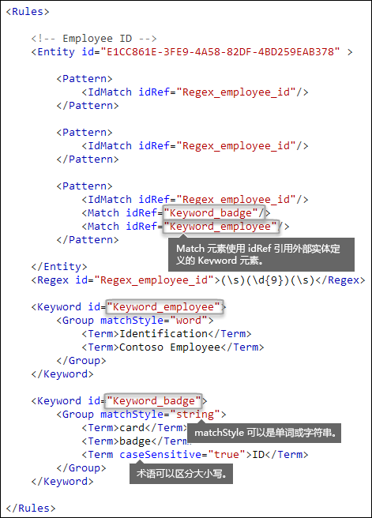
  
### <a name="regular-expressions-regex-element"></a><span data-ttu-id="63a93-205">正则表达式 [Regex 元素]</span><span class="sxs-lookup"><span data-stu-id="63a93-205">Regular expressions [Regex element]</span></span>

<span data-ttu-id="63a93-p130">在本示例中，“员工 ID”实体已使用 IdMatch 元素为模式引用正则表达式，以标识两边是空格的九位数。此外，模式还可使用 Match 元素来引用其他 Regex 元素，以标识确证性证据，如采用美国邮政编码格式的五位数或九位数。</span><span class="sxs-lookup"><span data-stu-id="63a93-p130">In this example, the employee ID entity already uses the IdMatch element to reference a regex for the pattern - a nine-digit number surrounded by whitespace. In addition, a pattern can use a Match element to reference an additional Regex element to identify corroborative evidence, such as a five- or nine-digit number in the format of a US zip code.</span></span>
  
### <a name="additional-patterns-such-as-dates-or-addresses-built-in-functions"></a><span data-ttu-id="63a93-208">日期或地址等其他模式 [内置函数]</span><span class="sxs-lookup"><span data-stu-id="63a93-208">Additional patterns such as dates or addresses [built-in functions]</span></span>

<span data-ttu-id="63a93-p131">除了内置敏感信息类型外，DLP 还包含内置函数，可用于标识确证性证据，如美国日期、欧洲日期、到期日期或美国地址。虽然 DLP 不支持上传你自己的自定义函数，但当你创建自定义敏感信息类型时，实体可引用内置函数。</span><span class="sxs-lookup"><span data-stu-id="63a93-p131">In addition to the built-in sensitive information types, DLP also includes built-in functions that can identify corroborative evidence such as a US date, EU date, expiration date, or US address. DLP does not support uploading your own custom functions, but when you create a custom sensitive information type, your entity can reference the built-in functions.</span></span>
  
<span data-ttu-id="63a93-211">例如，由于员工 ID 徽章中有聘用日期，因此这个自定义实体可使用内置函数 `Func_us_date` 标识采用美国通用格式的日期。</span><span class="sxs-lookup"><span data-stu-id="63a93-211">For example, an employee ID badge has a hire date on it, so this custom entity can use the built-in function  `Func_us_date` to identify a date in the format commonly used in the US.</span></span> 
  
<span data-ttu-id="63a93-212">有关详细信息，请参阅 [DLP 函数查找什么](what-the-dlp-functions-look-for.md)。</span><span class="sxs-lookup"><span data-stu-id="63a93-212">For more information, see [What the DLP functions look for](what-the-dlp-functions-look-for.md).</span></span>
  
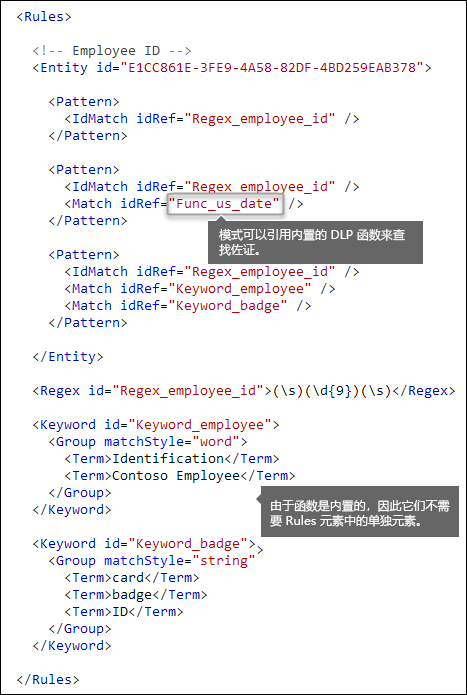
  
## <a name="different-combinations-of-evidence-any-element-minmatches-and-maxmatches-attributes"></a><span data-ttu-id="63a93-214">不同证据组合 [Any 元素、minMatches 和 maxMatches 特性]</span><span class="sxs-lookup"><span data-stu-id="63a93-214">Different combinations of evidence [Any element, minMatches and maxMatches attributes]</span></span>

<span data-ttu-id="63a93-p132">在 Pattern 元素中，所有 IdMatch 和 Match 元素都是通过隐式 AND 运算符进行联接。也就是说，必须符合所有 IdMatch 和 Match 元素，才算符合模式。不过，可使用 Any 元素对 Match 元素进行分组，从而创建更灵活的匹配逻辑。例如，可使用 Any 元素匹配所有或确切的一部分 Match 子元素，或不匹配任何 Match 子元素。</span><span class="sxs-lookup"><span data-stu-id="63a93-p132">In a Pattern element, all IdMatch and Match elements are joined by an implicit AND operator - all of the matches must be satisfied before the pattern can be satisfied. However, you can create more flexible matching logic by using the Any element to group Match elements. For example, you can use the Any element to match all, none, or an exact subset of its children Match elements.</span></span>
  
<span data-ttu-id="63a93-p133">Any 元素有可选的 minMatches 和 maxMatches 特性，可用于定义必须符合多少个 Match 子元素才算与模式匹配。请注意，这些特性定义的是必须符合的 Match 元素数量，而不是为与模式匹配而找到的证据实例数。若要定义为特定匹配找到的最小实例数（如列表中的两个关键字），请使用 Match 元素的 minCount 特性（见上文）。</span><span class="sxs-lookup"><span data-stu-id="63a93-p133">The Any element has optional minMatches and maxMatches attributes that you can use to define how many of the children Match elements must be satisfied before the pattern is matched. Note that these attributes define the number of Match elements that must be satisfied, not the number of instances of evidence found for the matches. To define a minimum number of instances for a specific match, such as two keywords from a list, use the minCount attribute for a Match element (see above).</span></span>
  
### <a name="match-at-least-one-child-match-element"></a><span data-ttu-id="63a93-221">至少匹配一个 Match 子元素</span><span class="sxs-lookup"><span data-stu-id="63a93-221">Match at least one child Match element</span></span>

<span data-ttu-id="63a93-p134">若要规定至少必须符合多少个 Match 元素，可使用 minMatches 特性。实际上，这些 Match 元素是通过隐式 OR 运算符进行联接。如果从任一列表中找到美国格式日期或关键字，就符合以下 Any 元素。</span><span class="sxs-lookup"><span data-stu-id="63a93-p134">If you want to require that only a minimum number of Match elements must be met, you can use the minMatches attribute. In effect, these Match elements are joined by an implicit OR operator. This Any element is satisfied if a US-formatted date or a keyword from either list is found.</span></span>
  
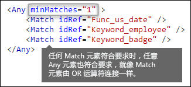
  
### <a name="match-an-exact-subset-of-any-children-match-elements"></a><span data-ttu-id="63a93-226">匹配确切的一部分 Match 子元素</span><span class="sxs-lookup"><span data-stu-id="63a93-226">Match an exact subset of any children Match elements</span></span>

<span data-ttu-id="63a93-p135">若要规定必须符合确切数量的 Match 元素，可以将 minMatches 和 maxMatches 设置为相同值。仅当找到确切的一个日期或关键字时，才符合以下 Any 元素。如果找到多个，便与模式不匹配。</span><span class="sxs-lookup"><span data-stu-id="63a93-p135">If you want to require that an exact number of Match elements must be met, you can set minMatches and maxMatches to the same value. This Any element is satisfied only if exactly one date or keyword is found - any more than that, and the pattern won't be matched.</span></span>
  
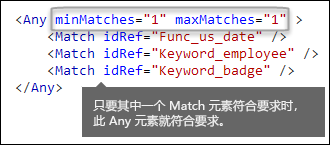
  
### <a name="match-none-of-children-match-elements"></a><span data-ttu-id="63a93-230">与任何 Match 子元素都不匹配</span><span class="sxs-lookup"><span data-stu-id="63a93-230">Match none of children Match elements</span></span>

<span data-ttu-id="63a93-p136">若要规定只要缺少某证据才算符合模式，可以将 minMatches 和 maxMatches 同时设置为 0。如果关键字列表或其他证据可能发出误报，这样做就很有用。</span><span class="sxs-lookup"><span data-stu-id="63a93-p136">If you want to require the absence of specific evidence for a pattern to be satisfied, you can set both minMatches and maxMatches to 0. This can be useful if you have a keyword list or other evidence that are likely to indicate a false positive.</span></span>
  
<span data-ttu-id="63a93-p137">例如，“员工 ID”实体查找关键字“卡”，因为这可能会指代“ID 卡”。不过，如果“卡”仅出现在短语“信用卡”中，此内容中的“卡”就不太可能表示“ID 卡”。因此，可以将“信用卡”作为关键字，添加到匹配模式时要排除的术语列表。</span><span class="sxs-lookup"><span data-stu-id="63a93-p137">For example, the employee ID entity looks for the keyword "card" because it might refer to an "ID card". However, if card appears only in the phrase "credit card", "card" in this content is unlikely to mean "ID card". So you can add "credit card" as a keyword to a list of terms that you want to exclude from satisfying the pattern.</span></span>
  
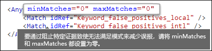
  
## <a name="how-close-to-the-entity-must-the-other-evidence-be-patternsproximity-attribute"></a><span data-ttu-id="63a93-p138">另一证据必须与实体有多接近？[patternsProximity 特性]</span><span class="sxs-lookup"><span data-stu-id="63a93-p138">How close to the entity must the other evidence be? [patternsProximity attribute]</span></span>

<span data-ttu-id="63a93-p139">敏感信息类型要查找表示员工 ID 的模式，此模式还查找确证性证据，如“ID”等关键字。很明显，此证据越接近，模式就越有可能是实际员工 ID。可使用 Entity 元素的必需特性 patternsProximity，确定模式中的另一证据必须与实体有多接近。</span><span class="sxs-lookup"><span data-stu-id="63a93-p139">Your sensitive information type is looking for a pattern that represents an employee ID, and as part of that pattern it's also looking for corroborative evidence like a keyword such as "ID". It makes sense that the closer together this evidence is, the more likely the pattern is to be an actual employee ID. You can determine how close other evidence in the pattern must be to the entity by using the required patternsProximity attribute of the Entity element.</span></span>
  
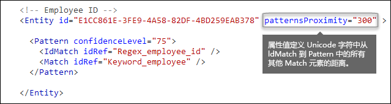
  
<span data-ttu-id="63a93-p140">对于实体中的每种模式，patternsProximity 特性值都定义针对相应模式指定的其他所有 Match 与 IdMatch 位置的距离（以 Unicode 字符数为单位）。接近度窗口以 IdMatch 位置为关键主体，向 IdMatch 左右延伸。</span><span class="sxs-lookup"><span data-stu-id="63a93-p140">For each pattern in the entity, the patternsProximity attribute value defines the distance (in Unicode characters) from the IdMatch location for all other Matches specified for that Pattern. The proximity window is anchored by the IdMatch location, with the window extending to the left and right of the IdMatch.</span></span>
  
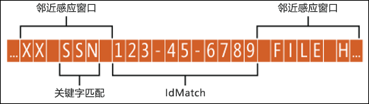
  
<span data-ttu-id="63a93-p141">下面的示例展示了接近度窗口如何影响模式匹配，其中“员工 ID”自定义实体的 IdMatch 元素要求至少必须有一个关键字或日期确证性匹配。仅 ID1 匹配，因为对于 ID2 和 ID3，在接近度窗口中找不到任何确证性证据或只找到部分确证性证据。</span><span class="sxs-lookup"><span data-stu-id="63a93-p141">The example below illustrates how the proximity window affects the pattern matching where IdMatch element for the employee ID custom entity requires at least one corroborating match of keyword or date. Only ID1 matches because for ID2 and ID3, either no or only partial corroborating evidence is found within the proximity window.</span></span>
  

  
<span data-ttu-id="63a93-p142">请注意，对于电子邮件，邮件正文和每个附件均被视为独立项。也就是说，接近度窗口不会超越各项末端。对于每一项（附件或正文），idMatch 和确证性证据都必须驻留在相应项中。</span><span class="sxs-lookup"><span data-stu-id="63a93-p142">Note that for email, the message body and each attachment are treated as separate items. This means that the proximity window does not extend beyond the end of each of these items. For each item (attachment or body), both the idMatch and corroborative evidence needs to reside in that item.</span></span>
  
## <a name="what-are-the-right-confidence-levels-for-different-patterns-confidencelevel-attribute-recommendedconfidence-attribute"></a><span data-ttu-id="63a93-p143">什么是各个模式的合适可信度？[confidenceLevel 特性、recommendedConfidence 特性]</span><span class="sxs-lookup"><span data-stu-id="63a93-p143">What are the right confidence levels for different patterns? [confidenceLevel attribute, recommendedConfidence attribute]</span></span>

<span data-ttu-id="63a93-p144">模式需要的证据越多，模式匹配时所标识的实际实体（如员工 ID）的可信度就越高。例如，与只要求匹配九位数 ID 的模式相比，要求匹配九位数 ID、聘用日期和关键字（极为接近）的模式的可信度更高。</span><span class="sxs-lookup"><span data-stu-id="63a93-p144">The more evidence that a pattern requires, the more confidence you have that an actual entity (such as employee ID) has been identified when the pattern is matched. For example, you have more confidence in a pattern that requires a nine-digit ID number, hire date, and keyword in close proximity, than you do in a pattern that requires only a nine-digit ID number.</span></span>
  
<span data-ttu-id="63a93-p145">Pattern 元素有必需特性 confidenceLevel。可将 confidenceLevel 值（介于 1 和 100 之间的整数）视为实体中每个模式的唯一 ID，必须向实体中的模式分配不同的可信度。整数值是否精确并不重要，只需选取对合规性团队有意义的数字即可。上传自定义敏感信息类型和创建 DLP 策略后，可以在创建的规则条件中引用这些可信度。</span><span class="sxs-lookup"><span data-stu-id="63a93-p145">The Pattern element has a required confidenceLevel attribute. You can think of the value of confidenceLevel (an integer between 1 and 100) as a unique ID for each pattern in an entity - the patterns in an entity must have different confidence levels that you assign. The precise value of the integer doesn't matter - simply pick numbers that make sense to your compliance team. After you upload your custom sensitive information type and then create a DLP policy, you can reference these confidence levels in the conditions of the rules that you create.</span></span>
  
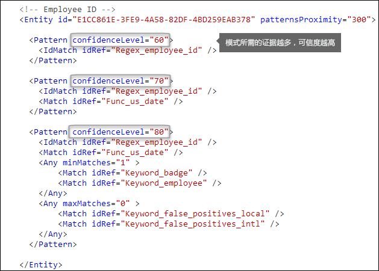
  
<span data-ttu-id="63a93-p146">除了每个 Pattern 的 confidenceLevel 之外，Entity 还有 recommendedConfidence 特性。recommendedConfidence 特性可被视为规则的默认可信度。如果你在 DLP 策略中创建规则时未指定规则要使用的可信度，规则就会根据实体的建议可信度来执行匹配。</span><span class="sxs-lookup"><span data-stu-id="63a93-p146">In addition to confidenceLevel for each Pattern, the Entity has a recommendedConfidence attribute. The recommended confidence attribute can be thought of as the default confidence level for the rule. When you create a rule in a DLP policy, if you don't specify a confidence level for the rule to use, that rule will match based on the recommended confidence level for the entity.</span></span>
  
## <a name="do-you-want-to-support-other-languages-in-the-ui-of-the-security-amp-compliance-center-localizedstrings-element"></a><span data-ttu-id="63a93-p147">是否要在安全与合规中心的 UI 中支持其他语言？[LocalizedStrings 元素]</span><span class="sxs-lookup"><span data-stu-id="63a93-p147">Do you want to support other languages in the UI of the Security &amp; Compliance Center? [LocalizedStrings element]</span></span>

<span data-ttu-id="63a93-p148">如果合规性团队使用 Office 365 安全与合规中心创建不同区域设置和不同语言的 DLP 策略，你可以提供自定义敏感信息类型的名称和说明的本地化版本。这样，如果合规性团队在使用 Office 365 时采用你所支持的语言，就会在 UI 中看到本地化名称。</span><span class="sxs-lookup"><span data-stu-id="63a93-p148">If your compliance team uses the Office 365 Security &amp; Compliance Center to create DLP policies in different locales and in different languages, you can provide localized versions of the name and description of your custom sensitive information type. When your compliance team uses Office 365 in a language that you support, they'll see the localized name in the UI.</span></span>
  

  
<span data-ttu-id="63a93-p149">Rule 元素必须包含 LocalizedStrings 元素，因为其中包含引用自定义实体 GUID 的 Resource 元素。相应地，每个 Resource 元素都包含一个或多个 Name 和 Description 元素，这些元素使用 langcode 特性来提供特定语言的本地化字符串。</span><span class="sxs-lookup"><span data-stu-id="63a93-p149">The Rules element must contain a LocalizedStrings element, which contains a Resource element that references the GUID of your custom entity. In turn, each Resource element contains one or more Name and Description elements that each use the langcode attribute to provide a localized string for a specific language.</span></span>
  
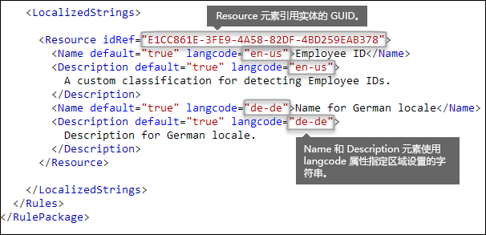
  
<span data-ttu-id="63a93-p150">请注意，本地化字符串只能用于指定自定义敏感信息类型在安全与合规中心 UI 中的显示方式。不能使用本地化字符串来提供不同本地化版本的关键字列表或正则表达式。</span><span class="sxs-lookup"><span data-stu-id="63a93-p150">Note that you use localized strings only for how your custom sensitive information type appears in the UI of the Security &amp; Compliance Center. You can't use localized strings to provide different localized versions of a keyword list or regular expression.</span></span>
  
## <a name="other-rule-package-markup-rulepack-guid"></a><span data-ttu-id="63a93-274">其他规则包标记 [RulePack GUID]</span><span class="sxs-lookup"><span data-stu-id="63a93-274">Other rule package markup [RulePack GUID]</span></span>

<span data-ttu-id="63a93-p151">最后，每个 RulePackage 的开头都有一些需要填写的常规信息。可以下面的标记为模板，将“...”占位符替换为你自己的信息。</span><span class="sxs-lookup"><span data-stu-id="63a93-p151">Finally, the beginning of each RulePackage contains some general information that you need to fill in. You can use the following markup as a template and replace the ". . ." placeholders with your own info.</span></span>
  
<span data-ttu-id="63a93-p152">最重要的是，必须为 RulePack 生成 GUID。在上文中，已为实体生成了 GUID；这是 RulePack 的第二个 GUID。虽然生成 GUID 的方法有很多，但可通过在 PowerShell 中键入 [guid]::NewGuid() 轻松完成。</span><span class="sxs-lookup"><span data-stu-id="63a93-p152">Most importantly, you'll need to generate a GUID for the RulePack. Above, you generated a GUID for the entity; this is a second GUID for the RulePack. There are several ways to generate GUIDs, but you can do it easily in PowerShell by typing [guid]::NewGuid().</span></span>
  
<span data-ttu-id="63a93-p153">Version 元素也很重要。当你首次上传规则包时，Office 365 会记录版本号。稍后，如果更新规则包并上传新版本，请务必更新版本号，否则 Office 365 便不会部署规则包。</span><span class="sxs-lookup"><span data-stu-id="63a93-p153">The Version element is also important. When you upload your rule package for the first time, Office 365 notes the version number. Later, if you update the rule package and upload a new version, make sure to update the version number or Office 365 won't deploy the rule package.</span></span>
  
```
<?xml version="1.0" encoding="utf-16"?>
<RulePackage xmlns="http://schemas.microsoft.com/office/2011/mce">
  <RulePack id=". . .">
    <Version major="1" minor="0" build="0" revision="0" />
    <Publisher id=". . ." /> 
    <Details defaultLangCode=". . .">
      <LocalizedDetails langcode=" . . . ">
         <PublisherName>. . .</PublisherName>
         <Name>. . .</Name>
         <Description>. . .</Description>
      </LocalizedDetails>
    </Details>
  </RulePack>
  
 <Rules>
    . . .
 </Rules>
</RulePackage>

```

<span data-ttu-id="63a93-286">完成后，RulePack 元素应如下所示。</span><span class="sxs-lookup"><span data-stu-id="63a93-286">When complete, your RulePack element should look like this.</span></span>
  
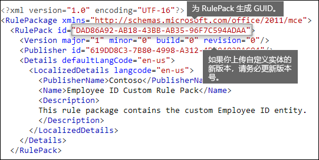
  
## <a name="changes-for-exchange-online"></a><span data-ttu-id="63a93-288">针对 Exchange Online 的变化</span><span class="sxs-lookup"><span data-stu-id="63a93-288">Changes for Exchange Online</span></span>

<span data-ttu-id="63a93-p154">以前可能使用的是 Exchange Online PowerShell 来为 DLP 导入自定义敏感信息类型。现在，自定义敏感信息类型既可用于 Exchange 管理中心，也能用于安全与合规中心。本次改进包括，应使用安全与合规中心 PowerShell 导入自定义敏感信息类型，无法再通过 Exchange PowerShell 导入。自定义敏感信息类型将继续像往常一样运行；不过，在安全与合规中心内对自定义敏感信息类型所做的更改最长可能需要一小时，才能在 Exchange 管理中心内有所反映。</span><span class="sxs-lookup"><span data-stu-id="63a93-p154">Previously, you might have used Exchange Online PowerShell to import your custom sensitive information types for DLP. Now your custom sensitive information types can be used in both the Exchange Admin Center and the Security &amp; Compliance Center. As part of this improvement, you should use Security &amp; Compliance Center PowerShell to import your custom sensitive information types - you can't import them from the Exchange PowerShell anymore. Your custom sensitive information types will continue to work just like before; however, it may take up to one hour for changes made to custom sensitive information types in the Security &amp; Compliance Center to appear in the Exchange Admin Center.</span></span>
  
<span data-ttu-id="63a93-p155">请注意，在安全与合规中心内，请使用 `DlpSensitiveInformationTypeRulePackage` cmdlet 上传规则包。以前在 Exchange 管理中心内使用的是 `ClassificationRuleCollection` cmdlet。</span><span class="sxs-lookup"><span data-stu-id="63a93-p155">Note that in the Security &amp; Compliance Center, you use the  `DlpSensitiveInformationTypeRulePackage` cmdlet to upload a rule package. Previously, in the Exchange Admin Center, you used the  `ClassificationRuleCollection` cmdlet.</span></span> 
  
## <a name="upload-your-rule-package"></a><span data-ttu-id="63a93-295">上传规则包</span><span class="sxs-lookup"><span data-stu-id="63a93-295">Upload your rule package</span></span>

<span data-ttu-id="63a93-296">若要上传规则包，请按照以下步骤操作。</span><span class="sxs-lookup"><span data-stu-id="63a93-296">To upload your rule package, do the following.</span></span>
  
1. <span data-ttu-id="63a93-297">将文件另存为采用 Unicode 编码的 .xml 文件。</span><span class="sxs-lookup"><span data-stu-id="63a93-297">Save it as an .xml file with Unicode encoding.</span></span>
    
2. [<span data-ttu-id="63a93-298">使用远程 PowerShell 连接到 Office 365 安全与合规中心</span><span class="sxs-lookup"><span data-stu-id="63a93-298">Connect to the Office 365 Security &amp; Compliance Center using remote PowerShell</span></span>](http://go.microsoft.com/fwlink/?LinkID=799771&amp;clcid=0x409)
    
3. <span data-ttu-id="63a93-299">在安全与合规中心 PowerShell 中，键入 New-DlpSensitiveInformationTypeRulePackage -FileData (Get-Content -Path "C:\custompath\MyNewRulePack.xml" -Encoding Byte)。</span><span class="sxs-lookup"><span data-stu-id="63a93-299">In the Security &amp; Compliance Center PowerShell, type New-DlpSensitiveInformationTypeRulePackage -FileData (Get-Content -Path "C:\custompath\MyNewRulePack.xml" -Encoding Byte).</span></span>
    
    <span data-ttu-id="63a93-p156">请务必使用规则包实际存储到的文件位置。C:\custompath\ 是占位符。</span><span class="sxs-lookup"><span data-stu-id="63a93-p156">Make sure that you use the file location where your rule pack is actually stored. C:\custompath\ is a placeholder.</span></span>
    
4. <span data-ttu-id="63a93-302">若要确认，请先键入“Y”，再按 Enter。</span><span class="sxs-lookup"><span data-stu-id="63a93-302">To confirm, type Y, and then press ENTER.</span></span>
    
5. <span data-ttu-id="63a93-p157">通过键入 Get-DlpSensitiveInformationType 查看是否有包含全部敏感类型的列表，验证是否已上传新敏感信息类型。可通过查看“发布服务器”列，快速区分自定义敏感信息类型与内置敏感信息类型。若要从列表中筛选出特定敏感信息类型，可运行 Get-DlpSensitiveInformationType -Identity "敏感信息类型的名称"。</span><span class="sxs-lookup"><span data-stu-id="63a93-p157">Verify that your new sensitive information type was uploaded by typing Get-DlpSensitiveInformationType to see a list of all sensitive types. You can quickly separate custom sensitive information types from those which come built in by looking at the Publisher column. You can filter the list to a specific sensitive information type by running Get-DlpSensitiveInformationType -Identity "name of sensitive information type".</span></span>
    
## <a name="potential-validation-issues-to-be-aware-of"></a><span data-ttu-id="63a93-306">要注意的潜在验证问题</span><span class="sxs-lookup"><span data-stu-id="63a93-306">Potential validation issues to be aware of</span></span>

<span data-ttu-id="63a93-p158">当你上传规则包 XML 文件时，系统会验证 XML，并检查是否有已知的错误模式和明显的性能问题。验证检查正则表达式时，需要检查其中是否有下面的一些已知问题：</span><span class="sxs-lookup"><span data-stu-id="63a93-p158">When you upload your rule package XML file, the system validates the XML and checks for known bad patterns and obvious performance issues. Here are some known issues that the validation checks for — a regular expression:</span></span>
  
- <span data-ttu-id="63a93-309">不得以匹配所有项的交替符“|”开头或结尾，因为这被视为空匹配。</span><span class="sxs-lookup"><span data-stu-id="63a93-309">Cannot begin or end with alternator "|", which matches everything because it's considered an empty match.</span></span>
    
    <span data-ttu-id="63a93-310">例如，“|a”或“b|”无法通过验证。</span><span class="sxs-lookup"><span data-stu-id="63a93-310">For example, "|a" or "b|" will not pass validation.</span></span>
    
- <span data-ttu-id="63a93-311">不得以“{0,m}”模式开头或结尾，它不具备功能性，只会削弱性能。</span><span class="sxs-lookup"><span data-stu-id="63a93-311">Cannot begin or end with a ".{0,m}" pattern, which has no functional purpose and only impairs performance.</span></span>
    
    <span data-ttu-id="63a93-312">例如，“.{0,50}ASDF”或“ASDF.{0,50}”无法通过验证。</span><span class="sxs-lookup"><span data-stu-id="63a93-312">For example, ".{0,50}ASDF" or "ASDF.{0,50}" will not pass validation.</span></span>
    
- <span data-ttu-id="63a93-313">组中既不得有“.{0,m}”或“.{1,m}”，也不得有“.\*”或“.+”。</span><span class="sxs-lookup"><span data-stu-id="63a93-313">Cannot have ".{0,m}" or ".{1,m}" in groups, and cannot have ".\*" or ".+" in groups.</span></span>
    
    <span data-ttu-id="63a93-314">例如，“(.{0,50000})”无法通过验证。</span><span class="sxs-lookup"><span data-stu-id="63a93-314">For example, "(.{0,50000})" will not pass validation.</span></span>
    
- <span data-ttu-id="63a93-315">组中不得有任何字符包含“{0,m}”或“{1,m}”重复符。</span><span class="sxs-lookup"><span data-stu-id="63a93-315">Cannot have any character with "{0,m}" or "{1,m}" repeaters in groups.</span></span>
    
    <span data-ttu-id="63a93-316">例如，“(a\*)”无法通过验证。</span><span class="sxs-lookup"><span data-stu-id="63a93-316">For example, "(a\*)" will not pass validation.</span></span>
    
- <span data-ttu-id="63a93-317">不得以“.{1,m}”开头或结尾；请改用“.”</span><span class="sxs-lookup"><span data-stu-id="63a93-317">Cannot begin or end with ".{1,m}"; instead, use just "."</span></span>
    
    <span data-ttu-id="63a93-318">例如，“.{1,m}asdf”无法通过验证；请改用“.asdf”。</span><span class="sxs-lookup"><span data-stu-id="63a93-318">For example, ".{1,m}asdf" will not pass validation; instead, use just ".asdf".</span></span>
    
- <span data-ttu-id="63a93-319">组中不得有无限重复符（如“\*”或“+”）。</span><span class="sxs-lookup"><span data-stu-id="63a93-319">Cannot have an unbounded repeater (such as "\*" or "+") on a group.</span></span>
    
    <span data-ttu-id="63a93-320">例如，“(xx)\*”和“(xx)+”无法通过验证。</span><span class="sxs-lookup"><span data-stu-id="63a93-320">For example, "(xx)\*" and "(xx)+" will not pass validation.</span></span>
    
<span data-ttu-id="63a93-321">如果自定义敏感信息类型存在可能会影响性能的问题，便无法上传，且可能会导致以下错误消息之一出现：</span><span class="sxs-lookup"><span data-stu-id="63a93-321">If a custom sensitive information type contains an issue that may affect performance, it won't be uploaded and you may see one of these error messages:</span></span>
  
- <span data-ttu-id="63a93-322">**泛型限定符匹配的内容量超过预期(例如，“+”、“\*”)**</span><span class="sxs-lookup"><span data-stu-id="63a93-322">**Generic quantifiers which match more content than expected (e.g., '+', '\*')**</span></span>
    
- <span data-ttu-id="63a93-323">**环视断言**</span><span class="sxs-lookup"><span data-stu-id="63a93-323">**Lookaround assertions**</span></span>
    
- <span data-ttu-id="63a93-324">**与常规限定符一同使用的分组复杂**</span><span class="sxs-lookup"><span data-stu-id="63a93-324">**Complex grouping in conjunction with general quantifiers**</span></span>
    
## <a name="recrawl-your-content-to-identify-the-sensitive-information"></a><span data-ttu-id="63a93-325">对内容重新爬网以标识敏感信息</span><span class="sxs-lookup"><span data-stu-id="63a93-325">Recrawl your content to identify the sensitive information</span></span>

<span data-ttu-id="63a93-p159">DLP 使用搜索爬网程序，对网站内容中的敏感信息进行标识和分类。SharePoint Online 和 OneDrive for Business 中的内容会在更新后自动重新爬网。但若要标识所有现有内容中的新自定义敏感信息类型，必须对相应内容重新爬网。</span><span class="sxs-lookup"><span data-stu-id="63a93-p159">DLP uses the search crawler to identify and classify sensitive information in site content. Content in SharePoint Online and OneDrive for Business sites is recrawled automatically whenever it's updated. But to identify your new custom type of sensitive information in all existing content, that content must be recrawled.</span></span>
  
<span data-ttu-id="63a93-329">在 Office 365 中，无法手动请求对整个租户进行重新爬网，但可以对网站集、列表或库这样做。请参阅[手动请求对网站、库或列表进行爬网和重新编制索引](https://support.office.com/article/9afa977d-39de-4321-b4ca-8c7c7e6d264e)。</span><span class="sxs-lookup"><span data-stu-id="63a93-329">In Office 365, you can't manually request a recrawl of an entire tenant, but you can do this for a site collection, list, or library - see [Manually request crawling and re-indexing of a site, a library or a list](https://support.office.com/article/9afa977d-39de-4321-b4ca-8c7c7e6d264e).</span></span>
  
## <a name="remove-a-custom-sensitive-information-type"></a><span data-ttu-id="63a93-330">删除自定义敏感信息类型</span><span class="sxs-lookup"><span data-stu-id="63a93-330">Remove a custom sensitive information type</span></span>

1. [<span data-ttu-id="63a93-331">使用远程 PowerShell 连接到 Office 365 安全与合规中心</span><span class="sxs-lookup"><span data-stu-id="63a93-331">Connect to the Office 365 Security &amp; Compliance Center using remote PowerShell</span></span>](http://go.microsoft.com/fwlink/?LinkID=799771&amp;clcid=0x409)
    
2. <span data-ttu-id="63a93-332">在安全与合规中心 PowerShell 中，执行下列操作之一：</span><span class="sxs-lookup"><span data-stu-id="63a93-332">In the Security &amp; Compliance Center PowerShell, do one of the following:</span></span>
    
  - <span data-ttu-id="63a93-333">若要删除整个规则包及其中的所有实体</span><span class="sxs-lookup"><span data-stu-id="63a93-333">To remove an entire rule package and all of the entities that it contains</span></span>
    
    <span data-ttu-id="63a93-334">键入 Remove-DlpSensitiveInformationTypeRulePackage "NameOfYourRulePack"。对于上面的示例 XML，键入 Remove-DlpSensitiveInformationTypeRulePackage "员工 ID 自定义规则包"。</span><span class="sxs-lookup"><span data-stu-id="63a93-334">Type Remove-DlpSensitiveInformationTypeRulePackage "NameOfYourRulePack" - for the example XML above, you would type Remove-DlpSensitiveInformationTypeRulePackage "Employee ID Custom Rule Pack".</span></span>
    
    <span data-ttu-id="63a93-335">请注意，若要标识规则包，可使用 \<RulePack\> 元素中的 \<Name\> 元素（对于任何语言），也可使用 RulePack 元素的 id 特性的 GUID。</span><span class="sxs-lookup"><span data-stu-id="63a93-335">Note that to identify your rule package, you can use the \<Name\> element (for any language) in the \<Rule Pack\> element or the GUID of the id attribute of the RulePack element.</span></span>
    
  - <span data-ttu-id="63a93-336">若要从规则包中删除一个实体</span><span class="sxs-lookup"><span data-stu-id="63a93-336">To remove a single entity from a rule package</span></span>
    
    <span data-ttu-id="63a93-p160">必须使用 Set-DlpSensitiveInformationTypeRulePackage，上传已删除特定实体的新版规则包。删除前，请务必确保所有 DLP 策略或 Exchange 传输规则都不引用要删除的敏感信息类型。</span><span class="sxs-lookup"><span data-stu-id="63a93-p160">You must upload a new version of your rulepack with that specific entity removed using Set-DlpSensitiveInformationTypeRulePackage. You'll need to make sure that no DLP policies or Exchange transport rules still reference the sensitive information type before removing it.</span></span>
    
3. <span data-ttu-id="63a93-339">若要确认，请先键入“Y”，再按 Enter。</span><span class="sxs-lookup"><span data-stu-id="63a93-339">To confirm, type Y, and then press ENTER.</span></span>
    
4. <span data-ttu-id="63a93-340">键入 Get- DlpSensitiveInformationType，以验证新规则是否已遭删除（应不再显示敏感信息类型的名称）。</span><span class="sxs-lookup"><span data-stu-id="63a93-340">Verify that your new rule was removed by typing Get- DlpSensitiveInformationType, which should no longer display the name of your sensitive information type.</span></span>
    
## <a name="reference-rule-package-xml-schema-definition"></a><span data-ttu-id="63a93-341">参考：规则包 XML 架构定义</span><span class="sxs-lookup"><span data-stu-id="63a93-341">Reference: Rule package XML schema definition</span></span>

<span data-ttu-id="63a93-342">可复制此标记，并将它另存为 XSD 文件，以用来验证规则包 XML 文件。</span><span class="sxs-lookup"><span data-stu-id="63a93-342">You can copy this markup, save it as an XSD file, and use it to validate your rule package XML file.</span></span>
  
```
<?xml version="1.0" encoding="utf-8"?>
<xs:schema xmlns:mce="http://schemas.microsoft.com/office/2011/mce"
           targetNamespace="http://schemas.microsoft.com/office/2011/mce" 
           xmlns:xs="http://www.w3.org/2001/XMLSchema"
           elementFormDefault="qualified"
           attributeFormDefault="unqualified"
           id="RulePackageSchema">
  <!-- Use include if this schema has the same target namespace as the schema being referenced, otherwise use import -->
  <xs:element name="RulePackage" type="mce:RulePackageType"/>
  <xs:simpleType name="LangType">
    <xs:union memberTypes="xs:language">
      <xs:simpleType>
        <xs:restriction base="xs:string">
          <xs:enumeration value=""/>
        </xs:restriction>
      </xs:simpleType>
    </xs:union>
  </xs:simpleType>
  <xs:simpleType name="GuidType" final="#all">
    <xs:restriction base="xs:token">
      <xs:pattern value="[0-9a-fA-F]{8}\-([0-9a-fA-F]{4}\-){3}[0-9a-fA-F]{12}"/>
    </xs:restriction>
  </xs:simpleType>
  <xs:complexType name="RulePackageType">
    <xs:sequence>
      <xs:element name="RulePack" type="mce:RulePackType"/>
      <xs:element name="Rules" type="mce:RulesType">
        <xs:key name="UniqueRuleId">
          <xs:selector xpath="mce:Entity|mce:Affinity|mce:Version/mce:Entity|mce:Version/mce:Affinity"/>
          <xs:field xpath="@id"/>
        </xs:key>
        <xs:key name="UniqueProcessorId">
          <xs:selector xpath="mce:Regex|mce:Keyword|mce:Fingerprint"></xs:selector>
          <xs:field xpath="@id"/>
        </xs:key>
        <xs:key name="UniqueResourceIdRef">
          <xs:selector xpath="mce:LocalizedStrings/mce:Resource"/>
          <xs:field xpath="@idRef"/>
        </xs:key>        
        <xs:keyref name="ReferencedRuleMustExist" refer="mce:UniqueRuleId">
          <xs:selector xpath="mce:LocalizedStrings/mce:Resource"/>
          <xs:field xpath="@idRef"/>
        </xs:keyref>
        <xs:keyref name="RuleMustHaveResource" refer="mce:UniqueResourceIdRef">
          <xs:selector xpath="mce:Entity|mce:Affinity|mce:Version/mce:Entity|mce:Version/mce:Affinity"/>
          <xs:field xpath="@id"/>
        </xs:keyref>
      </xs:element>
    </xs:sequence>
  </xs:complexType>
  <xs:complexType name="RulePackType">
    <xs:sequence>
      <xs:element name="Version" type="mce:VersionType"/>
      <xs:element name="Publisher" type="mce:PublisherType"/>
      <xs:element name="Details" type="mce:DetailsType">
        <xs:key name="UniqueLangCodeInLocalizedDetails">
          <xs:selector xpath="mce:LocalizedDetails"/>
          <xs:field xpath="@langcode"/>
        </xs:key>
        <xs:keyref name="DefaultLangCodeMustExist" refer="mce:UniqueLangCodeInLocalizedDetails">
          <xs:selector xpath="."/>
          <xs:field xpath="@defaultLangCode"/>
        </xs:keyref>
      </xs:element>
      <xs:element name="Encryption" type="mce:EncryptionType" minOccurs="0" maxOccurs="1"/>
    </xs:sequence>
    <xs:attribute name="id" type="mce:GuidType" use="required"/>
  </xs:complexType>
  <xs:complexType name="VersionType">
    <xs:attribute name="major" type="xs:unsignedShort" use="required"/>
    <xs:attribute name="minor" type="xs:unsignedShort" use="required"/>
    <xs:attribute name="build" type="xs:unsignedShort" use="required"/>
    <xs:attribute name="revision" type="xs:unsignedShort" use="required"/>
  </xs:complexType>
  <xs:complexType name="PublisherType">
    <xs:attribute name="id" type="mce:GuidType" use="required"/>
  </xs:complexType>
  <xs:complexType name="LocalizedDetailsType">
    <xs:sequence>
      <xs:element name="PublisherName" type="mce:NameType"/>
      <xs:element name="Name" type="mce:RulePackNameType"/>
      <xs:element name="Description" type="mce:OptionalNameType"/>
    </xs:sequence>
    <xs:attribute name="langcode" type="mce:LangType" use="required"/>
  </xs:complexType>
  <xs:complexType name="DetailsType">
    <xs:sequence>
      <xs:element name="LocalizedDetails" type="mce:LocalizedDetailsType" maxOccurs="unbounded"/>
    </xs:sequence>
    <xs:attribute name="defaultLangCode" type="mce:LangType" use="required"/>
  </xs:complexType>
  <xs:complexType name="EncryptionType">
    <xs:sequence>
      <xs:element name="Key" type="xs:normalizedString"/>
      <xs:element name="IV" type="xs:normalizedString"/>
    </xs:sequence>
  </xs:complexType>
  <xs:simpleType name="RulePackNameType">
    <xs:restriction base="xs:token">
      <xs:minLength value="1"/>
      <xs:maxLength value="64"/>
    </xs:restriction>
  </xs:simpleType>
  <xs:simpleType name="NameType">
    <xs:restriction base="xs:normalizedString">
      <xs:minLength value="1"/>
      <xs:maxLength value="256"/>
    </xs:restriction>
  </xs:simpleType>
  <xs:simpleType name="OptionalNameType">
    <xs:restriction base="xs:normalizedString">
      <xs:minLength value="0"/>
      <xs:maxLength value="256"/>
    </xs:restriction>
  </xs:simpleType>
  <xs:simpleType name="RestrictedTermType">
    <xs:restriction base="xs:string">
      <xs:minLength value="1"/>
      <xs:maxLength value="100"/>
    </xs:restriction>
  </xs:simpleType>
  <xs:complexType name="RulesType">
    <xs:sequence>
      <xs:choice maxOccurs="unbounded">
        <xs:element name="Entity" type="mce:EntityType"/>
        <xs:element name="Affinity" type="mce:AffinityType"/>
        <xs:element name="Version" type="mce:VersionedRuleType"/>
      </xs:choice>
      <xs:choice minOccurs="0" maxOccurs="unbounded">
        <xs:element name="Regex" type="mce:RegexType"/>
        <xs:element name="Keyword" type="mce:KeywordType"/>
        <xs:element name="Fingerprint" type="mce:FingerprintType"/>
        <xs:element name="ExtendedKeyword" type="mce:ExtendedKeywordType"/>
      </xs:choice>
      <xs:element name="LocalizedStrings" type="mce:LocalizedStringsType"/>
    </xs:sequence>
  </xs:complexType>
  <xs:complexType name="EntityType">
    <xs:sequence>
      <xs:element name="Pattern" type="mce:PatternType" maxOccurs="unbounded"/>
      <xs:element name="Version" type="mce:VersionedPatternType" minOccurs="0" maxOccurs="unbounded" />
    </xs:sequence>
    <xs:attribute name="id" type="mce:GuidType" use="required"/>
    <xs:attribute name="patternsProximity" type="mce:ProximityType" use="required"/>
    <xs:attribute name="recommendedConfidence" type="mce:ProbabilityType"/>
    <xs:attribute name="workload" type="mce:WorkloadType"/>
  </xs:complexType>
  <xs:complexType name="PatternType">
    <xs:sequence>
      <xs:element name="IdMatch" type="mce:IdMatchType"/>
      <xs:choice minOccurs="0" maxOccurs="unbounded">
        <xs:element name="Match" type="mce:MatchType"/>
        <xs:element name="Any" type="mce:AnyType"/>
      </xs:choice>
    </xs:sequence>
    <xs:attribute name="confidenceLevel" type="mce:ProbabilityType" use="required"/>
  </xs:complexType>
  <xs:complexType name="AffinityType">
    <xs:sequence>
      <xs:element name="Evidence" type="mce:EvidenceType" maxOccurs="unbounded"/>
      <xs:element name="Version" type="mce:VersionedEvidenceType" minOccurs="0" maxOccurs="unbounded" />
    </xs:sequence>
    <xs:attribute name="id" type="mce:GuidType" use="required"/>
    <xs:attribute name="evidencesProximity" type="mce:ProximityType" use="required"/>
    <xs:attribute name="thresholdConfidenceLevel" type="mce:ProbabilityType" use="required"/>
    <xs:attribute name="workload" type="mce:WorkloadType"/>
  </xs:complexType>
  <xs:complexType name="EvidenceType">
    <xs:sequence>
      <xs:choice maxOccurs="unbounded">
        <xs:element name="Match" type="mce:MatchType"/>
        <xs:element name="Any" type="mce:AnyType"/>
      </xs:choice>
    </xs:sequence>
    <xs:attribute name="confidenceLevel" type="mce:ProbabilityType" use="required"/>
  </xs:complexType>
  <xs:complexType name="IdMatchType">
    <xs:attribute name="idRef" type="xs:string" use="required"/>
  </xs:complexType>
  <xs:complexType name="MatchType">
    <xs:attribute name="idRef" type="xs:string" use="required"/>
    <xs:attribute name="minCount" type="xs:positiveInteger" use="optional"/>
    <xs:attribute name="uniqueResults" type="xs:boolean" use="optional"/>
  </xs:complexType>
  <xs:complexType name="AnyType">
    <xs:sequence>
      <xs:choice maxOccurs="unbounded">
        <xs:element name="Match" type="mce:MatchType"/>
        <xs:element name="Any" type="mce:AnyType"/>
      </xs:choice>
    </xs:sequence>
    <xs:attribute name="minMatches" type="xs:nonNegativeInteger" default="1"/>
    <xs:attribute name="maxMatches" type="xs:nonNegativeInteger" use="optional"/>
  </xs:complexType>
  <xs:simpleType name="ProximityType">
    <xs:union>
      <xs:simpleType>
        <xs:restriction base='xs:string'>
          <xs:enumeration value="unlimited"/>
        </xs:restriction>
      </xs:simpleType>
      <xs:simpleType>
        <xs:restriction base="xs:positiveInteger">
          <xs:minInclusive value="1"/>
        </xs:restriction>
      </xs:simpleType>
    </xs:union>
  </xs:simpleType>
  <xs:simpleType name="ProbabilityType">
    <xs:restriction base="xs:integer">
      <xs:minInclusive value="1"/>
      <xs:maxInclusive value="100"/>
    </xs:restriction>
  </xs:simpleType>
  <xs:simpleType name="WorkloadType">
    <xs:restriction base="xs:string">
      <xs:enumeration value="Exchange"/>
      <xs:enumeration value="Outlook"/>
    </xs:restriction>
  </xs:simpleType>
  <xs:simpleType name="EngineVersionType">
    <xs:restriction base="xs:token">
      <xs:pattern value="^\d{2}\.01?\.\d{3,4}\.\d{1,3}$"/>
    </xs:restriction>
  </xs:simpleType>
  <xs:complexType name="VersionedRuleType">
    <xs:choice maxOccurs="unbounded">
      <xs:element name="Entity" type="mce:EntityType"/>
      <xs:element name="Affinity" type="mce:AffinityType"/>
    </xs:choice>
    <xs:attribute name="minEngineVersion" type="mce:EngineVersionType" use="required" />
  </xs:complexType>
  <xs:complexType name="VersionedPatternType">
    <xs:sequence>
      <xs:element name="Pattern" type="mce:PatternType" maxOccurs="unbounded"/>
    </xs:sequence>
    <xs:attribute name="minEngineVersion" type="mce:EngineVersionType" use="required" />
  </xs:complexType>
  <xs:complexType name="VersionedEvidenceType">
    <xs:sequence>
      <xs:element name="Evidence" type="mce:EvidenceType" maxOccurs="unbounded"/>
    </xs:sequence>
    <xs:attribute name="minEngineVersion" type="mce:EngineVersionType" use="required" />
  </xs:complexType>
  <xs:simpleType name="FingerprintValueType">
    <xs:restriction base="xs:string">
      <xs:minLength value="2732"/>
      <xs:maxLength value="2732"/>
    </xs:restriction>
  </xs:simpleType>
  <xs:complexType name="FingerprintType">
    <xs:simpleContent>
      <xs:extension base="mce:FingerprintValueType">
        <xs:attribute name="id" type="xs:token" use="required"/>
        <xs:attribute name="threshold" type="mce:ProbabilityType" use="required"/>
        <xs:attribute name="shingleCount" type="xs:positiveInteger" use="required"/>
        <xs:attribute name="description" type="xs:string" use="optional"/>
      </xs:extension>
    </xs:simpleContent>
  </xs:complexType>
  <xs:complexType name="RegexType">
    <xs:simpleContent>
      <xs:extension base="xs:string">
        <xs:attribute name="id" type="xs:token" use="required"/>
      </xs:extension>
    </xs:simpleContent>
  </xs:complexType>
  <xs:complexType name="KeywordType">
    <xs:sequence>
      <xs:element name="Group" type="mce:GroupType" maxOccurs="unbounded"/>
    </xs:sequence>
    <xs:attribute name="id" type="xs:token" use="required"/>
  </xs:complexType>
  <xs:complexType name="GroupType">
    <xs:sequence>
      <xs:choice>
        <xs:element name="Term" type="mce:TermType" maxOccurs="unbounded"/>
      </xs:choice>
    </xs:sequence>
    <xs:attribute name="matchStyle" default="word">
      <xs:simpleType>
        <xs:restriction base="xs:NMTOKEN">
          <xs:enumeration value="word"/>
          <xs:enumeration value="string"/>
        </xs:restriction>
      </xs:simpleType>
    </xs:attribute>
  </xs:complexType>
  <xs:complexType name="TermType">
    <xs:simpleContent>
      <xs:extension base="mce:RestrictedTermType">
        <xs:attribute name="caseSensitive" type="xs:boolean" default="false"/>
      </xs:extension>
    </xs:simpleContent>
  </xs:complexType>
  <xs:complexType name="ExtendedKeywordType">
    <xs:simpleContent>
      <xs:extension base="xs:string">
        <xs:attribute name="id" type="xs:token" use="required"/>
      </xs:extension>
    </xs:simpleContent>
  </xs:complexType>
  <xs:complexType name="LocalizedStringsType">
    <xs:sequence>
      <xs:element name="Resource" type="mce:ResourceType" maxOccurs="unbounded">
      <xs:key name="UniqueLangCodeUsedInNamePerResource">
        <xs:selector xpath="mce:Name"/>
        <xs:field xpath="@langcode"/>
      </xs:key>
      <xs:key name="UniqueLangCodeUsedInDescriptionPerResource">
        <xs:selector xpath="mce:Description"/>
        <xs:field xpath="@langcode"/>
      </xs:key>
    </xs:element>
    </xs:sequence>
  </xs:complexType>
  <xs:complexType name="ResourceType">
    <xs:sequence>
      <xs:element name="Name" type="mce:ResourceNameType" maxOccurs="unbounded"/>
      <xs:element name="Description" type="mce:DescriptionType" minOccurs="0" maxOccurs="unbounded"/>
    </xs:sequence>
    <xs:attribute name="idRef" type="mce:GuidType" use="required"/>
  </xs:complexType>
  <xs:complexType name="ResourceNameType">
    <xs:simpleContent>
      <xs:extension base="xs:string">
        <xs:attribute name="default" type="xs:boolean" default="false"/>
        <xs:attribute name="langcode" type="mce:LangType" use="required"/>
      </xs:extension>
    </xs:simpleContent>
  </xs:complexType>
  <xs:complexType name="DescriptionType">
    <xs:simpleContent>
      <xs:extension base="xs:string">
        <xs:attribute name="default" type="xs:boolean" default="false"/>
        <xs:attribute name="langcode" type="mce:LangType" use="required"/>
      </xs:extension>
    </xs:simpleContent>
  </xs:complexType>
</xs:schema>

```

## <a name="more-information"></a><span data-ttu-id="63a93-343">更多信息</span><span class="sxs-lookup"><span data-stu-id="63a93-343">More information</span></span>

- [<span data-ttu-id="63a93-344">数据丢失防护策略概述</span><span class="sxs-lookup"><span data-stu-id="63a93-344">Overview of data loss prevention policies</span></span>](data-loss-prevention-policies.md)
    
- [<span data-ttu-id="63a93-345">敏感信息类型查找什么</span><span class="sxs-lookup"><span data-stu-id="63a93-345">What the sensitive information types look for</span></span>](what-the-sensitive-information-types-look-for.md)
    
- [<span data-ttu-id="63a93-346">DLP 函数查找什么</span><span class="sxs-lookup"><span data-stu-id="63a93-346">What the DLP functions look for</span></span>](what-the-dlp-functions-look-for.md)
    

