# 创建自定义敏感信息类型

Office 365 中的数据丢失防护 (DLP) 包含许多内置[敏感信息类型](what-the-sensitive-information-types-look-for.md)，可供用于 DLP 策略。这些内置类型可有助于标识和保护信用卡号、银行帐号、护照号等。 

不过，如果需要标识和保护其他类型的敏感信息（例如，使用组织专用格式的员工 ID 或项目编号），可创建自定义敏感信息类型。

自定义敏感信息类型的基本组成部分是：

- **主要模式**：员工 ID 号、项目编号等。这通常是由正则表达式 (RegEx) 标识，但也可以是关键字列表。

- **额外证据**：假设要查找 9 位数员工 ID 号。由于并非所有 9 位数都是员工 ID 号，因此可查找其他文本：“员工”、“徽章”、“ID”等关键字或其他基于额外正则表达式的文本模式。此支持性证据（亦称为_支持性_或_确证性_证据）提高了在内容中找到的 9 位数确实是员工 ID 号的可能性。

- **字符临近度**：主要模式和支持性证据越临近，检测到的内容就越有可能是要查找的内容。可指定主要模式和支持性证据之间的字符距离（亦称为_临近度窗口_），如下图所示：

    

- **可信度**：支持性证据越多，匹配结果就越有可能包含要查找的敏感信息。可以为使用更多证据检测到的匹配结果指定更高可信度。

  如果符合，模式会返回可用于 DLP 策略条件的计数和可信度。向 DLP 策略添加用于检测敏感信息类型的条件时，可编辑计数和可信度，如下图所示：

    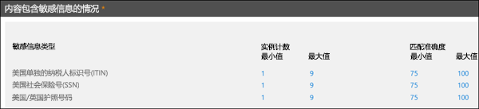

若要在 Office 365 安全与合规中心内创建自定义敏感信息类型，可使用以下两种方法：

- **使用 UI**：此方法更便捷，但配置选项比 PowerShell 少。本主题的其余部分将介绍这些过程。

- **使用 PowerShell**：此方法要求，必须先创建包含一个或多个敏感信息类型的 XML 文件（称为_规则包_），再使用 PowerShell 导入规则包（与创建规则包相比，导入规则包无关紧要）。虽然此方法比 UI 复杂得多，但配置选项更多。有关说明，请参阅[使用 Office 365 安全与合规中心 PowerShell 创建自定义敏感信息类型](create-a-custom-sensitive-information-type-in-scc-powershell.md)。

下表列出了关键区别：

|**UI 中的自定义敏感信息类型**|**PowerShell 中的自定义敏感信息类型**|
|:-----|:-----|
|名称和说明采用一种语言。|支持名称和说明的多种语言。|
|支持一个模式。|支持多个模式。|
|支持性证据可以是：  • 正则表达式  • 关键字  • 关键字字典|支持性证据可以是：  • 正则表达式  • 关键字  • 关键字字典  • [内置 DLP 函数](what-the-dlp-functions-look-for.md)|
|将自定义敏感信息类型添加到名为 Microsoft.SCCManaged.CustomRulePack 的规则包中|最多可创建 10 个包含自定义敏感信息类型的规则包。|
|模式匹配需要检测主模式和所有支持性证据（使用隐式 AND 运算符）。|模式匹配需要检测主要模式和一组数量可配置的支持性证据（可使用隐式 AND 和 OR 运算符）。|

## 开始前，有必要了解什么？

- 若要打开安全与合规中心，请参阅[转到 Office 365 安全与合规中心](go-to-the-securitycompliance-center.md)。

- 自定义敏感信息类型需要熟悉正则表达式 (RegEx)。有关用于处理文本的 Boost.RegEx（以前称为 RegEx++）引擎的详细信息，请参阅 [Boost.Regex 5.1.3](https://www.boost.org/doc/libs/1_68_0/libs/regex/doc/html/)。

  Microsoft 客户服务和支持人员无法协助提供自定义内容匹配定义（创建自定义分类或正则表达式模式）。支持工程师可提供有限的功能支持（例如，出于测试目的提供示例正则表达式模式，或协助排查未按预期触发的现有正则表达式模式），但无法保证任何自定义内容匹配开发能够满足你的需求或履行你的义务。

- DLP 使用搜索爬网程序标识并分类 SharePoint Online 和 OneDrive for Business 网站中的敏感信息。若要在现有内容中标识新自定义敏感信息类型，必须对内容进行重新爬网。虽然内容重新爬网是按日程安排进行，但你也可以手动对网站集、列表或库的内容进行重新爬网。有关详细信息，请参阅[手动请求对网站、库或列表进行爬网和重新编制索引](https://docs.microsoft.com/sharepoint/crawl-site-content)。

## 在安全与合规中心内创建自定义敏感信息类型

在安全与合规中心内，依次转到“分类”****\>“敏感信息类型”****，再单击“创建”****。

设置的含义相当显而易见，而且向导中的相关页也对这些设置进行了说明：

- **名称**

- **说明**

- **临近度**

- **可信度**

- **主要模式元素**（关键字、正则表达式或字典）

- 可选**支持性模式元素**（关键字、正则表达式或字典）和相应**最低成本**值。

应用场景如下：需要创建能够在内容中检测 9 位数员工编号的自定义敏感信息类型，以及关键字“员工”、“ID”和“徽章”。若要创建此自定义敏感信息类型，请按以下步骤操作：

1. 在安全与合规中心内，依次转到“分类”****\>“敏感信息类型”****，再单击“创建”****。

    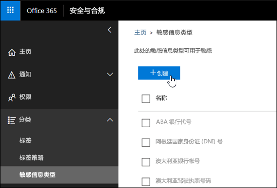

2. 在随即打开的“选择名称和说明”**** 页中，输入以下值：

  - **名称**：员工 ID。

  - **说明**：检测 9 位数 Contoso 员工 ID 号。

    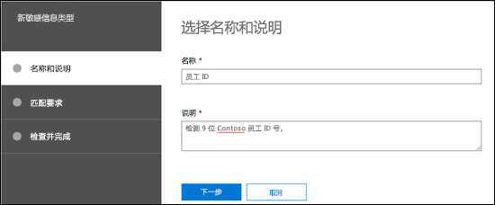

    完成后，单击“下一步”****。

3. 在随即打开的“匹配要求”**** 页中，单击“添加元素”****，以配置下列设置：

    - **检测内容包含**：
 
      a. 单击“任意内容”****，再选择“正则表达式”****。

      b. 在正则表达式框中，输入“`(\s)(\d{9})(\s)`”（两边是空格的 9 位数）。
  
    - **支持性元素**：单击“添加支持性元素”****，再选择“包含此关键字列表”****。

    - 在随即显示的“包含此关键字列表”**** 区域中，配置下列设置：

      - **关键字列表**：输入以下值：员工、ID、徽章。

      - **最小计数**：保留默认值 1。

    - 保留“可信度”**** 默认值 60。 

    - 保留“字符临近度”**** 默认值 300。

    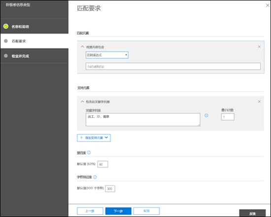

    完成后，单击“下一步”****。

4. 在随即打开的“检查并最终确定”**** 页中，检查设置并单击“完成”****。

    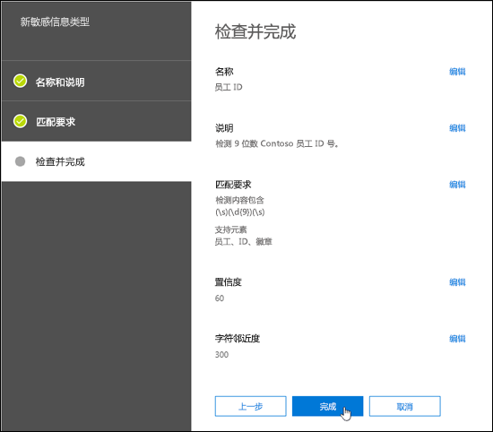

5. 下一页建议通过单击“是”**** 测试新自定义敏感信息类型。有关详细信息，请参阅[在安全与合规中心内测试自定义敏感信息类型](#test-custom-sensitive-information-types-in-the-security--compliance-center)。若要稍后测试规则，请单击“否”****。

    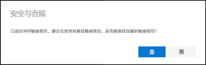

### 如何知道操作成功？

若要验证是否已成功新建敏感信息类型，请按以下任一步骤操作：

  - 依次转到“分类”****\>“敏感信息类型”****，并验证新自定义敏感信息类型是否已列出。

  - 测试新自定义敏感信息类型。有关详细信息，请参阅[在安全与合规中心内测试自定义敏感信息类型](#test-custom-sensitive-information-types-in-the-security--compliance-center)。

## 在安全与合规中心内修改自定义敏感信息类型

**注意**：

- 只能修改自定义敏感信息类型；不能修改内置敏感信息类型。不过，可使用 PowerShell 导出内置自定义敏感信息类型，然后自定义它们，并将它们作为自定义敏感信息类型导入。有关详细信息，请参阅[自定义内置敏感信息类型](customize-a-built-in-sensitive-information-type.md)。

- 只能修改在 UI 中创建的自定义敏感信息类型。如果使用 [PowerShell 过程](create-a-custom-sensitive-information-type-in-scc-powershell.md)导入自定义敏感信息类型规则包，将收到一个错误。

在安全与合规中心内，依次转到“分类”****\>“敏感信息类型”****，选择要修改的自定义敏感信息类型，然后单击“编辑”****。

  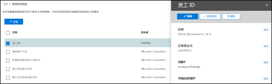

随后看到的选项与在安全与合规中心内创建自定义敏感信息类型时相同。有关详细信息，请参阅[在安全与合规中心内创建自定义敏感信息类型](#create-custom-sensitive-information-types-in-the-security--compliance-center)。

### 如何判断是否生效？

若要验证是否已成功修改敏感信息类型，请按以下任一步骤操作：

  - 依次转到“分类”****\>“敏感信息类型”****，以验证修改后的自定义敏感信息类型的属性。 

  - 测试修改后的自定义敏感信息类型。有关详细信息，请参阅[在安全与合规中心内测试自定义敏感信息类型](#test-custom-sensitive-information-types-in-the-security--compliance-center)。

## 在安全与合规中心内删除自定义敏感信息类型 

**注意**：

- 只能删除自定义敏感信息类型；不能删除内置敏感信息类型。

- 删除自定义敏感信息类型前，请先验证没有 DLP 策略或 Exchange 邮件流规则（亦称为“传输规则”）仍在引用此敏感信息类型。

1. 在安全与合规中心内，依次转到“分类”****\>“敏感信息类型”****，并选择一个或多个要删除的自定义敏感信息类型。

2. 在随即打开的弹出窗口中，单击“删除”****（或“删除多个敏感信息类型”****，如果选择了多个类型的话）。

    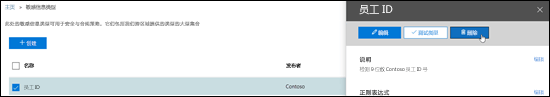

3. 在随即显示的警告消息中，单击“是”****。

### 如何判断是否生效？

若要验证是否已成功删除自定义敏感信息类型，请依次转到“分类”****\>“敏感信息类型”****，以验证自定义敏感信息类型是否已不再列出。

## 在安全与合规中心内测试自定义敏感信息类型

1. 在安全与合规中心内，依次转到“分类”****\>“敏感信息类型”****。

2. 选择要测试的一个或多个自定义敏感信息类型。在随即打开的弹出窗口中，单击“测试类型”****（或“测试多个敏感信息类型”****，如果选择了多个类型的话）。

    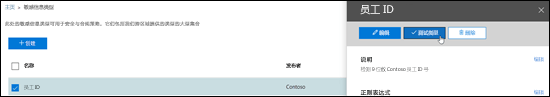

3. 在随即打开的“上传测试文件”**** 页面上，拖放文件或单击“浏览”**** 并选择文件，以上传要测试的文档。

    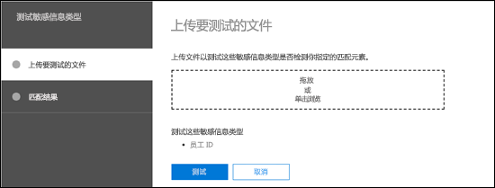

4. 单击“测试”**** 按钮，以测试文档的模式匹配情况。

5. 在“匹配结果”**** 页上，单击“完成”****。

    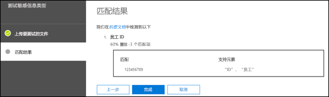