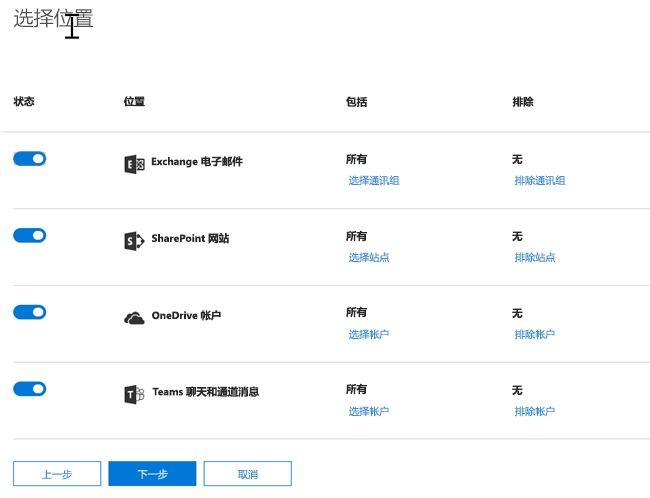
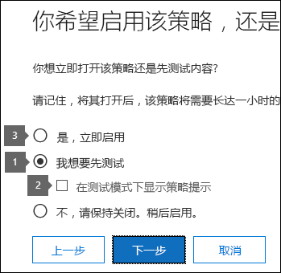

# 通过模板创建 DLP 策略

开始使用 DLP 策略的最简单、最常用的方法是使用 Office 365 中包含的模板之一。您可以按自己的方式使用其中一个模板, 也可以自定义规则以满足组织的特定合规性要求。
  
Office 365 包括可以帮助您满足范围广泛的常见法规和业务策略需求的 40 多个随时可以使用的模板。例如，提供适用于以下法规的 DLP 策略模板：
  
- 格雷姆-里奇-比利雷法案 (GLBA)
    
- 支付卡行业数据安全标准 (PCI-DSS)
    
- 美国个人身份信息（美国 PII）
    
- 美国健康保险法案 (HIPAA)
    
您可以通过修改任何现有的规则或添加新规则来微调模板。例如，您可以将新的敏感信息类型添加到规则中，以及修改规则中的计数以使其更难以触发或更易于触发，使用户通过提供业务理由替代规则中的操作，或更改要向其发送通知和事件报告的用户。对于许多常见的合规性方案来说，DLP 策略模板都是一个灵活的起点。
  
您还可以选择不带有任何默认规则的自定义模板，从头开始配置您的 DLP 策略以满足组织的特定合规性要求。
  
## 示例: 标识所有 OneDrive for business 网站中的敏感信息, 并限制组织外部人员的访问权限

OneDrive for business 帐户使组织内的人员可以轻松协作和共享文档。但对合规性监察官的常见关注是, 存储在 OneDrive for business 帐户中的敏感信息可能无意中与组织外部的人员共享。DLP 策略可帮助缓解此风险。
  
在此示例中, 您将创建一个用于标识美国 PII 数据的 DLP 策略, 其中包括单独的纳税人标识号 (ITIN)、社会保险号码和美国护照号码。你将通过使用模板开始, 然后将修改模板以满足组织的合规性要求, 具体来说, 你将:
  
- 添加几种类型的敏感信息—例如, 银行帐号和美国驾驶执照号码, 以便 DLP 策略可以保护更多敏感数据。
    
- 使策略更加敏感, 以便单个出现的敏感信息足以限制外部用户的访问。
    
- 允许用户通过提供对误报的业务理由或报告来覆盖操作。这样一来, 你的 DLP 策略将不会阻止组织中的人员完成其工作, 前提是他们有一个有效的业务理由共享敏感信息。
    
### 通过模板创建 DLP 策略

1. 转到 [https://protection.office.com](https://protection.office.com)。
    
2. 使用你的工作或学校帐户登录到 Office 365。现在你已处于 Office 365 安全&amp;合规中心。
    
3. 在安全&amp;合规\>中心左侧导航\> **数据丢失防护** \> **策略** \>中,**创建一个策略**。
    
    
  
4. 选择保护您\> **接下来**需要的敏感信息类型的 DLP 策略模板。
    
    在此示例中, 你将选择**隐私** \> (**美国) 个人身份信息 (PII) 数据**, 因为它已经包含了你要保护的大多数敏感信息类型, 你将在稍后添加一项。 
    
    在选择模板时, 可以阅读右侧的说明, 以了解模板保护的敏感信息类型。
    
    
  
5. 将策略\>命名为**Next**。
    
6. 若要选择要保护 DLP 策略的位置, 请执行下列操作之一:
    
  - 选择\> **下一步****中的 "Office 365 中的所有位置"** 。
    
  - 选择 "**让我选择** \> **下一处**的特定位置"。对于此示例, 请选择此。
    
    若要包括或排除整个位置 (如所有 Exchange 电子邮件或所有 OneDrive 帐户), 请打开或关闭该位置的**状态**。 
    
    若要仅包含特定的 SharePoint 网站或 OneDrive for business 帐户, 请将**状态**切换到 "开", 然后单击 "**包括**" 下的链接以选择 "特定网站或帐户"。将策略应用于网站时, 在该策略中配置的规则将自动应用于该网站的所有子网站。 
    
    
  
    在此示例中, 若要保护存储在所有 OneDrive for business 帐户中的敏感信息, 请关闭**Exchange 电子邮件**和**SharePoint 网站**的**状态**, 并为**OneDrive 帐户**保留**状态**"启用"。
    
7. 选择 "**使用高级设置** \> "**下一步**。
    
8. DLP 策略模板包含具有条件和操作的预定义规则, 这些规则可检测并根据特定类型的敏感信息进行操作。您可以编辑、删除或关闭任何现有规则, 也可以添加新规则。完成后, 单击 "**下一步**"。
    
    
  
    在此示例中, 美国 PII 数据模板包含两个预定义的规则:
    
  - **检测到的内容量较少 (美国 PII** )此规则查找包含三种类型的敏感信息 (ITIN、SSN 和美国护照号码) 中每种类型的1到10个匹配项的文件, 其中的文件与组织外部的人员共享。如果找到, 则该规则会向主网站集管理员、文档所有者和上次修改文档的人员发送电子邮件通知。 
    
  - **检测到的大量内容 (美国 PII** )此规则查找包含10个或更多个相同的三种敏感信息类型的文件, 其中文件与组织外部的人员共享的文件。如果找到, 此操作还会发送一封电子邮件通知, 并限制对该文件的访问。对于 OneDrive for business 帐户中的内容, 这意味着对文档的权限受到限制, 仅限于主网站集管理员、文档所有者和上次修改文档的人员之外的所有用户。 
    
    若要满足组织的特定要求, 您可能需要使规则更易于触发, 以便单个出现的敏感信息足以阻止外部用户的访问。在查看这些规则之后, 您将了解不需要低和高计数规则的情况, 如果发现任何敏感信息, 则仅需要一个规则来阻止访问。
    
    因此, 你可以展开名为 "**低" 的内容批量检测美国 PII** \> **删除规则**的规则。
    
    
  
9. 现在, 在此示例中, 您需要添加两种敏感信息类型 (美国银行帐号和美国驾驶执照号码), 允许用户重写规则, 并将计数更改为任何匹配项。您可以通过编辑一个规则来执行所有此操作, 因此请选择 "**检测到的大量内容的美国 PII** \> **编辑规则**"。
    
    
  
10. 若要添加敏感信息类型, 请在 "**条件**" 部分\> **添加或更改类型**。然后, 在 "**添加或更改类型** \> " 下, 选择 "**添加** \>选择**美国银行帐号**和**美国司机的许可证编号** \> **添加** \> **完成**"。
    
    
  
    
  
11. 若要更改计数 (触发规则所需的敏感信息的实例数), 请在 "**实例计数** \> " 中, 选择每个类型\> 1 的**最小**值。最小计数不能为空。最大计数可以为空;空的**max**值将转换为**any**。
    
    完成后, 所有敏感信息类型的最小计数应为**1** , 最大值计数应为 "**任意**"。换句话说, 这种类型的敏感信息的任何匹配项都将满足此条件。
    
    
  
12. 对于最终自定义, 您不希望您的 DLP 策略阻止用户在其具有有效业务理由或遇到误报时执行其工作, 因此您希望用户通知包括替代阻止操作的选项。
    
    在 "**用户通知**" 部分中, 您可以看到默认情况下, 此规则在模板中已启用电子邮件通知和策略提示。 
    
    在 "**用户替代**" 部分中, 您可以看到业务理由的替代已打开, 但不能覆盖报告误报。**如果将规则报告为误报, 请选择 "自动替代规则"**。
    
    
  
13. 在规则编辑器的顶部, 将此规则的名称从 "检测到美国的默认**内容量" (美国 pii 检测**到的任何内容) 更改为 "**使用美国 pii**检测到的任何内容", 因为它现在是由其任何敏感信息类型的发生触发触发的。 
    
14. 在规则编辑器\>的底部**保存**。
    
15. 请在\> **接下来**查看此规则的条件和操作。
    
    在右侧, 请注意规则的**状态**开关。如果关闭整个策略, 则还会禁用该策略中包含的所有规则。但是, 在这里, 您可以在不关闭整个策略的情况下关闭特定规则。当您需要调查生成大量误报的规则时, 这可能很有用。 
    
16. 在下一页上, 阅读并理解以下各项, 然后选择是启用规则还是先\>将其测试到下一**步**。
    
     在创建 DLP 策略之前, 应考虑在完全强制实施之前, 先将它们滚动到一起评估它们的影响并测试其有效性。例如, 您不希望新的 DLP 策略在无意中阻止对用户完成其工作所需的数千个文档的访问。 
    
    如果您创建的 DLP 策略具有很大的潜在影响, 我们建议按照以下顺序进行操作:
    
17. 在不使用策略提示的情况下启动测试模式，然后使用 DLP 报告评估影响。您可以使用 DLP 报告查看匹配策略的次数、位置、类型和严重性。根据结果，您可以在需要时微调规则。在测试模式下，DLP 策略不会影响您组织内的工作人员的工作效率。 
    
18. 移动到使用通知和策略提示的测试模式，以便您可以开始向用户介绍合规性策略，让用户对将要应用的规则做好准备。在这一阶段，您还可以要求用户报告误报，便于您进一步优化规则。
    
19. 启用这些策略, 以便强制实施规则和保护内容。继续监视 DLP 报告和任何事件报告或通知, 以确保结果是您预期的。 
    
    
  
20. 查看此策略\>的设置。选择 "**创建**"。
    
创建并打开 DLP 策略后, 会将其部署到其包含的任何内容源 (如 SharePoint Online 网站或 OneDrive for business 帐户) 中, 策略将自动开始对该内容强制实施其规则。
  
## 查看 DLP 策略的状态

您可以随时在安全&amp;合规中心的 "**数据丢失防护**" 部分中的 "**策略**" 页上查看 DLP 策略的状态。您可以在此处找到重要信息, 如策略是否已成功启用或禁用, 或策略是否处于测试模式。 
  
下面介绍了不同的状态及其含义。
  
|**状态**|**说明**|
|:-----|:-----|
|**正在启用...**   |系统正在将策略部署到它所包含的内容源。策略尚未强制应用于所有源。    |
|**测试并发送通知**   |策略处于测试模式。不会应用规则中的操作，但可以收集策略匹配项，并通过使用 DLP 报告进行查看。有关策略匹配项的通知会发送给指定的收件人。    |
|**测试但不发送通知**   |策略处于测试模式。不会应用规则中的操作，但可以收集策略匹配项，并通过使用 DLP 报告进行查看。有关策略匹配项的通知不会发送给指定的收件人。    |
|**启用**   |策略处于活动状态并且已强制应用。策略已成功部署到它的所有内容源。    |
|**正在禁用...**   |系统正在将策略从它包含的内容源中移除。策略可能仍处于活动状态并在某些源上强制应用。禁用策略可能需要 45 分钟。    |
|**禁用**   |策略处于非活动状态且未强制应用。系统会保存策略的设置（源、关键字、持续时间等）。    |
|**正在删除…**   |系统正在删除策略。策略处于非活动状态且未强制应用。    |
   
## 禁用 DLP 策略

您可以随时编辑或关闭 DLP 策略。关闭策略将禁用该策略中的所有规则。
  
若要编辑或关闭 DLP 策略, 请在 "**策略**" \>页上选择\> "策略"**编辑策略**。
  

  
此外, 您可以通过编辑策略并关闭该规则的**状态**来单独关闭每个规则, 如上文所述。 
  
## 更多信息

- [数据丢失防护策略概述](data-loss-prevention-policies.md)
    
- [发送通知并显示 DLP 策略的策略提示](use-notifications-and-policy-tips.md)
    
- [创建 DLP 策略来保护具有 FCI 或其他属性的文档](protect-documents-that-have-fci-or-other-properties.md)
    
- [DLP 策略模板包含的内容](what-the-dlp-policy-templates-include.md)
    
- [敏感信息类型库存](what-the-sensitive-information-types-look-for.md)
    

