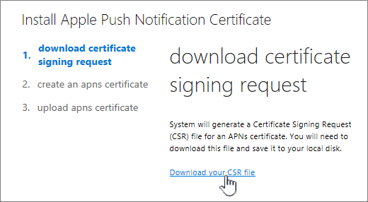

# 创建 iOS 设备 APNs 证书Create an APNs Certificate for iOS devices

 若要管理的 Office 365 的 iOS 设备，例如 iPad 和 Iphone 在移动设备管理必须创建 APNs 证书。To manage iOS devices like iPad and iPhones in Mobile Device Management for Office 365 you must create an APNs certificate. 
  
为此，请在门户页面上的**设置**链接从按照的步骤。(请转到**安全&amp;合规性中心** \> **安全策略** \> **设备管理** \> **管理设置**。)To do this, follow the steps from the **Set up** link on the portal page. (Go to **Security &amp; Compliance Center** \> **Security policies** \> **Device management** \> **Manage settings**.)
  

  
1. 旁边**配置 iOS 设备 APNs 证书**，选择**设置**。Next to **Configure a APNs Certificate for iOS devices**, select **Set up**.
    
2. 选择**下载 CSR 文件**并保存到这二者的证书签名请求将请记住在计算机上。Select **Download your CSR file** and save the Certificate signing request to a somewhere on your computer that you'll remember. 
    
    
  
3. 选择**下一步**。Select **Next**.
    
4. 创建 APN 证书。Create an APN certificate.
    
  - 选择以打开 Apple 推送证书门户**Apple APNS 门户**。Select **Apple APNS Portal** to open the Apple Push Certificates Portal. 
    
    
  
  - 登录 Apple id。Sign in with an Apple ID.
    
    > [!IMPORTANT]
    > 使用 Apple ID 与即使管理帐户的用户离开将保持与您的组织的电子邮件帐户关联的公司。保存此 ID，因为您需要在需要时续订证书使用相同的 ID。Use a company Apple ID associated with an email account that will remain with your organization even if the user who manages the account leaves. Save this ID because you'll need to use the same ID when it's time to renew the certificate. 
  
  - 选择**创建的证书**，并接受**使用条款**。Select **Create a Certificate** and accept the **Terms of Use**.
    
  - **浏览**证书签名请求从 Office 365 下载到您的计算机，并选择**上载**。**Browse** to the Certificate signing request you downloaded to your computer from Office 365 and select **Upload**.
    
  - **下载**APN 证书创建 Apple 推送证书门户到您的计算机。**Download** the APN certificate created by the Apple Push Certificate Portal to your computer. 
    
    > [!TIP]
    > 如果您在遇到问题下载证书，请刷新浏览器。If you're having trouble downloading the certificate, refresh your browser. 
  
5. 返回到 Office 365，并选择**下一步**，转到**上载 APNS 证书**页。Go back to Office 365 and select **Next** to get to the **Upload APNS certificate** page. 
    
6. 浏览到从 Apple 推送证书门户下载 APN 证书。Browse to the APN certificate you downloaded from the Apple Push Certificates Portal.
    
    
  
7. 选择**完成**。Select **Finish**.
    
转到**安全&amp;合规性中心** \> **安全策略** \> **设备管理** \> **管理设置**以完成安装。Go back to **Security &amp; Compliance Center** \> **Security policies** \> **Device management** \> **Manage settings** to complete setup. 
  

