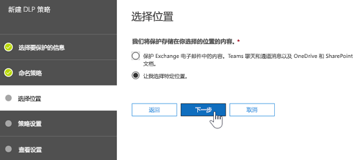
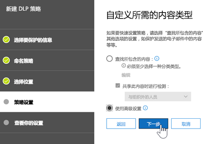
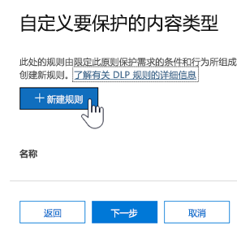
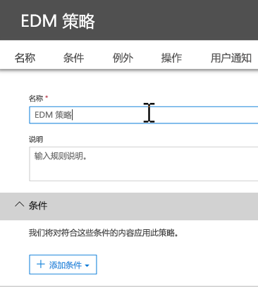
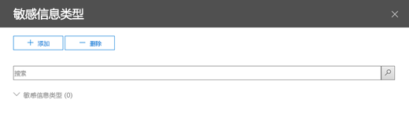

# <a name="create-custom-sensitive-information-types-with-exact-data-match-based-classification-preview"></a><span data-ttu-id="1d702-103">使用基于精确数据匹配的分类创建自定义敏感信息类型（预览版）</span><span class="sxs-lookup"><span data-stu-id="1d702-103">See Create a custom sensitive information type with Exact Data Match based classification (Preview).</span></span>

## <a name="overview"></a><span data-ttu-id="1d702-104">概述</span><span class="sxs-lookup"><span data-stu-id="1d702-104">Overview</span></span>

<span data-ttu-id="1d702-105">[自定义敏感信息类型](custom-sensitive-info-types.md)用于帮助防止无意或不适当的敏感信息共享。</span><span class="sxs-lookup"><span data-stu-id="1d702-105">[Custom sensitive information types](custom-sensitive-info-types.md) are used to help prevent inadvertent or inappropriate sharing of sensitive information.</span></span> <span data-ttu-id="1d702-106">作为管理员，你可以使用[安全与合规中心](create-a-custom-sensitive-information-type.md)或 [PowerShell](create-a-custom-sensitive-information-type-in-scc-powershell.md)，根据模式、证据（*员工*、*徽章*、*ID* 等关键字）、字符邻近度（特定模式下证据与字符的邻近度）以及可信度来定义自定义敏感信息类型。</span><span class="sxs-lookup"><span data-stu-id="1d702-106">As an administrator, you can use the [Security & Compliance Center](create-a-custom-sensitive-information-type.md) or [PowerShell](create-a-custom-sensitive-information-type-in-scc-powershell.md) to define a custom sensitive information type based on patterns, evidence (keywords such as *employee*, *badge*, *ID*, and so on), character proximity (how close evidence is to characters in a particular pattern), and confidence levels.</span></span> <span data-ttu-id="1d702-107">此类自定义敏感信息类型可满足许多组织的业务需求。</span><span class="sxs-lookup"><span data-stu-id="1d702-107">Such custom sensitive information types meet business needs for many organizations.</span></span>

<span data-ttu-id="1d702-108">但是，如果你需要自定义敏感信息类型（它使用精确数据值而不是模式和邻近度），该怎么办？</span><span class="sxs-lookup"><span data-stu-id="1d702-108">But what if you wanted a custom sensitive information type that uses exact data values, instead of patterns and proximity?</span></span> <span data-ttu-id="1d702-109">通过基于精确数据匹配 (EDM) 的分类，你可以创建专门设计的自定义敏感信息类型：</span><span class="sxs-lookup"><span data-stu-id="1d702-109">With Exact Data Match (EDM)-based classification, you can create a custom sensitive information type that is designed to:</span></span>
- <span data-ttu-id="1d702-110">动态并且可刷新；</span><span class="sxs-lookup"><span data-stu-id="1d702-110">be dynamic and refreshable;</span></span>
- <span data-ttu-id="1d702-111">更具可伸缩性；</span><span class="sxs-lookup"><span data-stu-id="1d702-111">be more scalable;</span></span>
- <span data-ttu-id="1d702-112">导致更少的误报；</span><span class="sxs-lookup"><span data-stu-id="1d702-112">result in fewer false-positives;</span></span>
- <span data-ttu-id="1d702-113">处理结构化敏感数据；</span><span class="sxs-lookup"><span data-stu-id="1d702-113">work with structured sensitive data;</span></span>
- <span data-ttu-id="1d702-114">更安全地处理敏感信息以及</span><span class="sxs-lookup"><span data-stu-id="1d702-114">handle sensitive information more securely; and</span></span>
- <span data-ttu-id="1d702-115">与多种 Microsoft 云服务一起使用。</span><span class="sxs-lookup"><span data-stu-id="1d702-115">be used with several Microsoft cloud services.</span></span>


<span data-ttu-id="1d702-117">基于 EDM 的分类允许你创建自定义敏感信息类型，它们将引用敏感信息数据库中的精确值。</span><span class="sxs-lookup"><span data-stu-id="1d702-117">EDM-based classification enables you to create custom sensitive information types that refer to exact values in a database of sensitive information.</span></span> <span data-ttu-id="1d702-118">数据库可以每天或每周刷新一次，最多可包含 1000 万行数据。</span><span class="sxs-lookup"><span data-stu-id="1d702-118">The database can be refreshed daily or weekly, and it can contain up to 10 million rows of data.</span></span> <span data-ttu-id="1d702-119">因此，当员工、患者或客户往来并且记录发生更改时，你的自定义敏感信息类型仍将保持最新并且适用。</span><span class="sxs-lookup"><span data-stu-id="1d702-119">So as employees, patients, or clients come and go, and records change, your custom sensitive information types remain current and applicable.</span></span> <span data-ttu-id="1d702-120">你还可以将基于 EDM 的分类与策略一起使用，例如[数据丢失防护策略](data-loss-prevention-policies.md) (DLP) 或 [Microsoft Cloud App Security 文件策略](https://docs.microsoft.com/cloud-app-security/data-protection-policies)。</span><span class="sxs-lookup"><span data-stu-id="1d702-120">And, you can use EDM-based classification with policies, such as [data loss prevention policies](data-loss-prevention-policies.md) (DLP) or [Microsoft Cloud App Security file policies](https://docs.microsoft.com/cloud-app-security/data-protection-policies).</span></span>

## <a name="required-licenses-and-permissions"></a><span data-ttu-id="1d702-121">所需的许可证和权限</span><span class="sxs-lookup"><span data-stu-id="1d702-121">Required licenses and permissions</span></span>

- <span data-ttu-id="1d702-122">你必须是全局管理员、合规性管理员或 Exchange Online 管理员才能执行本文中描述的任务。</span><span class="sxs-lookup"><span data-stu-id="1d702-122">You must be a global admin, compliance administrator, or Exchange Online administrator to perform the tasks described in this article.</span></span> <span data-ttu-id="1d702-123">若要了解有关 DLP 权限的详细信息，请参阅[权限](data-loss-prevention-policies.md#permissions)。</span><span class="sxs-lookup"><span data-stu-id="1d702-123">To learn more about DLP permissions, see [Permissions](data-loss-prevention-policies.md#permissions).</span></span>

- <span data-ttu-id="1d702-124">当正式发布时，基于 EDM 的分类将包含在以下订阅中：</span><span class="sxs-lookup"><span data-stu-id="1d702-124">When generally available, EDM-based classification will be included in the following subscriptions:</span></span>
    - <span data-ttu-id="1d702-125">Office 365 E5</span><span class="sxs-lookup"><span data-stu-id="1d702-125">Office 365 Enterprise E5</span></span>
    - <span data-ttu-id="1d702-126">Microsoft 365 E5</span><span class="sxs-lookup"><span data-stu-id="1d702-126">Microsoft 365 E5</span></span>
    - <span data-ttu-id="1d702-127">Microsoft 365 信息保护与合规性</span><span class="sxs-lookup"><span data-stu-id="1d702-127">Microsoft 365 Information Protection and Compliance</span></span>
    - <span data-ttu-id="1d702-128">Office 365 高级合规版</span><span class="sxs-lookup"><span data-stu-id="1d702-128">Office 365 Advanced Compliance</span></span>

> [!NOTE]
> <span data-ttu-id="1d702-129">对于 [Office 365 中的 DLP](data-loss-prevention-policies.md)（具有 Exchange Online 和 Microsoft Teams）和 [Cloud App Security](https://docs.microsoft.com/cloud-app-security)，**基于 EDM 的分类目前处于预览阶段**。</span><span class="sxs-lookup"><span data-stu-id="1d702-129">**EDM-based classification is currently in preview** for [DLP in Office 365](data-loss-prevention-policies.md) (with Exchange Online and Microsoft Teams) and [Cloud App Security](https://docs.microsoft.com/cloud-app-security).</span></span> <span data-ttu-id="1d702-130">如果你的组织具有 [DLP 功能](https://docs.microsoft.com/office365/servicedescriptions/exchange-online-protection-service-description/messaging-policy-and-compliance-servicedesc#data-loss-prevention-dlp)，则可以试用基于 EDM 的分类。</span><span class="sxs-lookup"><span data-stu-id="1d702-130">If your organization has [DLP capabilities](https://docs.microsoft.com/office365/servicedescriptions/exchange-online-protection-service-description/messaging-policy-and-compliance-servicedesc#data-loss-prevention-dlp), you can try EDM-based classification.</span></span> <span data-ttu-id="1d702-131">如果你尚未加入预览，请[联系 Microsoft](https://resources.office.com/us-landing-spe-contactus.html?LCID=EN-US) 以开始使用。</span><span class="sxs-lookup"><span data-stu-id="1d702-131">If you are not already participating in the preview, [contact Microsoft](https://resources.office.com/us-landing-spe-contactus.html?LCID=EN-US) to get started.</span></span> 

## <a name="the-work-flow-at-a-glance"></a><span data-ttu-id="1d702-132">工作流程概览</span><span class="sxs-lookup"><span data-stu-id="1d702-132">The work flow at a glance</span></span>

|<span data-ttu-id="1d702-133">阶段</span><span class="sxs-lookup"><span data-stu-id="1d702-133">Phase</span></span>  |<span data-ttu-id="1d702-134">所需项</span><span class="sxs-lookup"><span data-stu-id="1d702-134">What's needed</span></span>  |
|---------|---------|
|[<span data-ttu-id="1d702-135">第 1 部分：设置基于 EDM 的分类</span><span class="sxs-lookup"><span data-stu-id="1d702-135">Part 1: Set up EDM-based classification</span></span>](#part-1-set-up-edm-based-classification)<br/><br/><span data-ttu-id="1d702-136">（根据需要）</span><span class="sxs-lookup"><span data-stu-id="1d702-136">(As needed)</span></span><br/><span data-ttu-id="1d702-137">- [编辑数据库架构](#editing-the-schema-for-edm-based-classification)</span><span class="sxs-lookup"><span data-stu-id="1d702-137">- [Edit the database schema](#editing-the-schema-for-edm-based-classification)</span></span> <br/><span data-ttu-id="1d702-138">- [删除架构](#removing-the-schema-for-edm-based-classification)</span><span class="sxs-lookup"><span data-stu-id="1d702-138">- [Remove the schema](#removing-the-schema-for-edm-based-classification)</span></span> |<span data-ttu-id="1d702-139">- 敏感数据的读取权限</span><span class="sxs-lookup"><span data-stu-id="1d702-139">- Read access to the sensitive data</span></span><br/><span data-ttu-id="1d702-140">- .xml 格式的数据库架构（提供了示例）</span><span class="sxs-lookup"><span data-stu-id="1d702-140">- Database schema in .xml format (example provided)</span></span><br/><span data-ttu-id="1d702-141">- .xml 格式的规则包（提供了示例）</span><span class="sxs-lookup"><span data-stu-id="1d702-141">- Rule package in .xml format (example provided)</span></span><br/><span data-ttu-id="1d702-142">- 安全与合规中心的管理员权限（使用 PowerShell）</span><span class="sxs-lookup"><span data-stu-id="1d702-142">- Admin permissions to the Security & Compliance Center (using PowerShell)</span></span> |
|[<span data-ttu-id="1d702-143">第 2 部分：创建索引并上载敏感数据</span><span class="sxs-lookup"><span data-stu-id="1d702-143">Part 2: Index and upload the sensitive data</span></span>](#part-2-index-and-upload-the-sensitive-data)<br/><br/><span data-ttu-id="1d702-144">（根据需要）</span><span class="sxs-lookup"><span data-stu-id="1d702-144">(As needed)</span></span><br/>[<span data-ttu-id="1d702-145">刷新数据</span><span class="sxs-lookup"><span data-stu-id="1d702-145">Refresh the data</span></span>](#refreshing-your-sensitive-information-database) |<span data-ttu-id="1d702-146">- 自定义安全组和用户帐户</span><span class="sxs-lookup"><span data-stu-id="1d702-146">- Custom security group and user account</span></span><br/><span data-ttu-id="1d702-147">- 使用 EDM 上载代理对计算机进行本地管理员访问</span><span class="sxs-lookup"><span data-stu-id="1d702-147">- Local admin access to machine with EDM Upload Agent</span></span><br/><span data-ttu-id="1d702-148">- 敏感数据的读取权限</span><span class="sxs-lookup"><span data-stu-id="1d702-148">- Read access to the sensitive data</span></span><br/><span data-ttu-id="1d702-149">- 刷新数据的流程和计划</span><span class="sxs-lookup"><span data-stu-id="1d702-149">- Process and schedule for refreshing the data</span></span>|
|[<span data-ttu-id="1d702-150">第 3 部分：将基于 EDM 的分类与 Microsoft 云服务一起使用</span><span class="sxs-lookup"><span data-stu-id="1d702-150">Part 3: Use EDM-based classification with your Microsoft cloud services</span></span>](#part-3-use-edm-based-classification-with-your-microsoft-cloud-services) |<span data-ttu-id="1d702-151">- 包含 DLP 的 Office 365 订阅</span><span class="sxs-lookup"><span data-stu-id="1d702-151">- Office 365 subscription with DLP</span></span><br/><span data-ttu-id="1d702-152">- 启用基于 EDM 的分类功能（在预览版中）</span><span class="sxs-lookup"><span data-stu-id="1d702-152">- EDM-based classification feature enabled (in preview)</span></span> |

## <a name="part-1-set-up-edm-based-classification"></a><span data-ttu-id="1d702-153">第 1 部分：设置基于 EDM 的分类</span><span class="sxs-lookup"><span data-stu-id="1d702-153">Part 1: Set up EDM-based classification</span></span>

<span data-ttu-id="1d702-154">设置和配置基于 EDM 的分类涉及以 .csv 格式保存敏感数据、为敏感信息数据库定义架构、创建规则包以及上载架构和规则包。</span><span class="sxs-lookup"><span data-stu-id="1d702-154">Setting up and configuring EDM-based classification involves saving sensitive data in .csv format, defining a schema for your database of sensitive information, creating a rule package, and then uploading the schema and rule package.</span></span>

### <a name="define-the-schema-for-your-database-of-sensitive-information"></a><span data-ttu-id="1d702-155">定义敏感信息数据库的架构</span><span class="sxs-lookup"><span data-stu-id="1d702-155">Define the schema for your database of sensitive information</span></span>

1. <span data-ttu-id="1d702-156">确定要使用的敏感信息。</span><span class="sxs-lookup"><span data-stu-id="1d702-156">Identify the KPIs that you want to use.</span></span> <span data-ttu-id="1d702-157">将数据导出到应用（如 Microsoft Excel），然后以 .csv 格式保存文件。</span><span class="sxs-lookup"><span data-stu-id="1d702-157">Export the data to an app, such as Microsoft Excel, and save the file in .csv format.</span></span> <span data-ttu-id="1d702-158">数据文件可包含：</span><span class="sxs-lookup"><span data-stu-id="1d702-158">The data file can include:</span></span>

    - <span data-ttu-id="1d702-159">高达 1000 万行的敏感数据</span><span class="sxs-lookup"><span data-stu-id="1d702-159">Up to 10 million rows of sensitive data</span></span>
    - <span data-ttu-id="1d702-160">每个数据源最多 32 列（字段）</span><span class="sxs-lookup"><span data-stu-id="1d702-160">Up to 32 columns (fields) per data source</span></span>

2. <span data-ttu-id="1d702-161">在 .csv 文件中构造敏感数据，使第一行包含用于基于 EDM 的分类的字段名称。</span><span class="sxs-lookup"><span data-stu-id="1d702-161">Structure the sensitive data in the .csv file such that the first row includes the names of the fields used for EDM-based classification.</span></span> <span data-ttu-id="1d702-162">在 .csv 文件中，你可能拥有“ssn”、“生日”、“名字”、“姓氏”等字段名称。</span><span class="sxs-lookup"><span data-stu-id="1d702-162">In your .csv file, you might have field names, such as "ssn", "birthdate", "firstname", "lastname", and so on.</span></span> <span data-ttu-id="1d702-163">例如，我们的 .csv 文件称为 *PatientRecords.csv*，其列包含*患者 ID*、*MRN*、*姓氏*、*名字*、*SSN* 等。</span><span class="sxs-lookup"><span data-stu-id="1d702-163">As an example, our .csv file is called *PatientRecords.csv*, and its columns include *PatientID*, *MRN*, *lastname*, *FirstName*, *SSN* and more.</span></span>

3. <span data-ttu-id="1d702-164">以 .xml 格式定义敏感信息数据库的架构（类似于下面的示例）。</span><span class="sxs-lookup"><span data-stu-id="1d702-164">Define the schema for the database of sensitive information in .xml format (similar to our example below).</span></span> <span data-ttu-id="1d702-165">命名此架构文件 `edm.xml` 并对其进行配置，确保对于数据库中的每一列，都有一行使用语法 `<Field name="" unique="" searchable=""/>`。</span><span class="sxs-lookup"><span data-stu-id="1d702-165">Name this schema file `edm.xml`, and configure it such that for each column in the database, there is a line that uses the syntax `<Field name="" unique="" searchable=""/>`.</span></span> 

    - <span data-ttu-id="1d702-166">将列名称用于*字段名称*值。</span><span class="sxs-lookup"><span data-stu-id="1d702-166">Use column names for *Field name* values.</span></span>
    - <span data-ttu-id="1d702-167">对于包含唯一值（社会安全号码、标识号等）的字段，请使用 *unique="true"*；否则，请使用 *unique="false"*。</span><span class="sxs-lookup"><span data-stu-id="1d702-167">Use *unique="true"* for the fields that contain unique values (Social Security numbers, identification numbers, etc.); otherwise, use *unique="false"*.</span></span>
    - <span data-ttu-id="1d702-168">对于要搜索的字段，请使用 *searchable="true"*。</span><span class="sxs-lookup"><span data-stu-id="1d702-168">Use *searchable="true"* for the fields that you want to be searchable.</span></span> <span data-ttu-id="1d702-169">不要为每个数据库指定超过五个要搜索的字段。</span><span class="sxs-lookup"><span data-stu-id="1d702-169">Do not specify more than five fields per database to be searchable.</span></span> <span data-ttu-id="1d702-170">所有其余字段都应具有 *searchable="false"*。</span><span class="sxs-lookup"><span data-stu-id="1d702-170">All the rest should have *searchable="false"*.</span></span>  

    <span data-ttu-id="1d702-171">例如，以下 .xml 文件定义患者记录数据库的架构，其中五个字段指定为可搜索字段：*患者 ID*、*MRN*、*SSN*、*电话*和 *DOB*。</span><span class="sxs-lookup"><span data-stu-id="1d702-171">As an example, the following .xml file defines the schema for a patient records database, with five fields specified as searchable: *PatientID*, *MRN*, *SSN*, *Phone*, and *DOB*.</span></span> 
    
    <span data-ttu-id="1d702-172">（可复制、修改和使用我们的示例。）</span><span class="sxs-lookup"><span data-stu-id="1d702-172">(You can copy, modify, and use our example.)</span></span>
    
    ```<?xml version="1.0" encoding="utf-8"?>
    <EdmSchema xmlns="http://schemas.microsoft.com/office/2018/edm">
        <DataStore name="PatientRecords" description="Schema for patient records" version="1">
            <Field name="PatientID" unique="false" searchable="true" />
            <Field name="MRN" unique="false" searchable="true" />
            <Field name="FirstName" unique="false" searchable="false" />
            <Field name="LastName" unique="false" searchable="false" />
            <Field name="SSN" unique="false" searchable="true" />
            <Field name="Phone" unique="false" searchable="true" />
            <Field name="DOB" unique="false" searchable="true" />
            <Field name="Gender" unique="false" searchable="false" />
            <Field name="Address" unique="false" searchable="false" />
        </DataStore>
    </EdmSchema>
    ```

4. <span data-ttu-id="1d702-173">[连接到 Office 365 安全与合规中心 PowerShell](https://docs.microsoft.com/powershell/exchange/office-365-scc/connect-to-scc-powershell/connect-to-scc-powershell?view=exchange-ps)。</span><span class="sxs-lookup"><span data-stu-id="1d702-173">[Connect to Office 365 Security & Compliance Center PowerShell](https://docs.microsoft.com/powershell/exchange/office-365-scc/connect-to-scc-powershell/connect-to-scc-powershell?view=exchange-ps)</span></span>

5. <span data-ttu-id="1d702-174">要上传数据库架构，请逐一运行下列 cmdlet：</span><span class="sxs-lookup"><span data-stu-id="1d702-174">To upload the database schema, run the following cmdlets, one at a time:</span></span>

    `$edmSchemaXml=Get-Content .\edm.xml -Encoding Byte -ReadCount 0`

    `New-DlpEdmSchema -FileData $edmSchemaXml -Confirm:$true`

    <span data-ttu-id="1d702-175">系统将提示你进行确认，如下所示：</span><span class="sxs-lookup"><span data-stu-id="1d702-175">You will be prompted to confirm, as follows:</span></span>

       Confirm
       Are you sure you want to perform this action?
       New EDM Schema for the data store 'patientrecords' will be imported.
       [Y] Yes  [A] Yes to All  [N] No  [L] No to All  [?] Help (default is "Y"):

    > [!TIP]
    > <span data-ttu-id="1d702-176">若想更改但不进行确认，请在步骤 5 中改用此 cmdlet：`New-DlpEdmSchema -FileData $edmSchemaXml`</span><span class="sxs-lookup"><span data-stu-id="1d702-176">If you want your changes to occur without confirmation, in Step 5, use this cmdlet instead: `New-DlpEdmSchema -FileData $edmSchemaXml`</span></span>
    
<span data-ttu-id="1d702-177">敏感信息数据库的架构现已定义，接下来是设置规则包。</span><span class="sxs-lookup"><span data-stu-id="1d702-177">Now that the schema for your database of sensitive information is defined, the next step is to set up a rule package.</span></span> <span data-ttu-id="1d702-178">继续到[设置规则包](#set-up-a-rule-package)部分。</span><span class="sxs-lookup"><span data-stu-id="1d702-178">Proceed to the section [Set up a rule package](#set-up-a-rule-package).</span></span>

#### <a name="editing-the-schema-for-edm-based-classification"></a><span data-ttu-id="1d702-179">编辑基于 EDM 的分类的架构</span><span class="sxs-lookup"><span data-stu-id="1d702-179">Editing the schema for EDM-based classification</span></span> 

<span data-ttu-id="1d702-180">（根据需要）如果想要更改 edm.xml 文件，例如更改要对基于 EDM 的分类使用的字段，请按照以下步骤操作：</span><span class="sxs-lookup"><span data-stu-id="1d702-180">(As needed) If you want to make changes to your edm.xml file, such as changing which fields are used for EDM-based classification, follow these steps:</span></span>

1. <span data-ttu-id="1d702-181">编辑 edm.mxl 文件（即本文的[定义架构](#define-the-schema-for-your-database-of-sensitive-information)部分中讨论的文件）。</span><span class="sxs-lookup"><span data-stu-id="1d702-181">Edit your edm.mxl file (this is the file discussed in the [Define the schema](#define-the-schema-for-your-database-of-sensitive-information) section of this article).</span></span>

2. <span data-ttu-id="1d702-182">[连接到 Office 365 安全与合规中心 PowerShell](https://docs.microsoft.com/powershell/exchange/office-365-scc/connect-to-scc-powershell/connect-to-scc-powershell?view=exchange-ps)。</span><span class="sxs-lookup"><span data-stu-id="1d702-182">[Connect to Office 365 Security & Compliance Center PowerShell](https://docs.microsoft.com/powershell/exchange/office-365-scc/connect-to-scc-powershell/connect-to-scc-powershell?view=exchange-ps)</span></span>

3. <span data-ttu-id="1d702-183">要更新数据库架构，请逐一运行下列 cmdlet：</span><span class="sxs-lookup"><span data-stu-id="1d702-183">To update your database schema, run the following cmdlets, one at a time:</span></span>

    `$edmSchemaXml=Get-Content .\edm.xml -Encoding Byte -ReadCount 0`

    `Set-DlpEdmSchema -FileData $edmSchemaXml -Confirm:$true`

    <span data-ttu-id="1d702-184">系统将提示你进行确认，如下所示：</span><span class="sxs-lookup"><span data-stu-id="1d702-184">You will be prompted to confirm, as follows:</span></span>

       Confirm
       Are you sure you want to perform this action?
       EDM Schema for the data store 'patientrecords' will be updated.
       [Y] Yes  [A] Yes to All  [N] No  [L] No to All  [?] Help (default is "Y"):

    > [!TIP]
    > <span data-ttu-id="1d702-185">若想更改但不进行确认，请在步骤 3 中改用此 cmdlet：`Set-DlpEdmSchema -FileData $edmSchemaXml`</span><span class="sxs-lookup"><span data-stu-id="1d702-185">If you want your changes to occur without confirmation, in Step 3, use this cmdlet instead: `Set-DlpEdmSchema -FileData $edmSchemaXml`</span></span>

#### <a name="removing-the-schema-for-edm-based-classification"></a><span data-ttu-id="1d702-186">删除基于 EDM 的分类的架构</span><span class="sxs-lookup"><span data-stu-id="1d702-186">Removing the schema for EDM-based classification</span></span>

<span data-ttu-id="1d702-187">（根据需要）若想删除正在对基于 EDM 的分类使用的架构，请按照以下步骤操作：</span><span class="sxs-lookup"><span data-stu-id="1d702-187">(As needed) If you want to remove the schema you're using for EDM-based classification, follow these steps:</span></span>

1. <span data-ttu-id="1d702-188">[连接到 Office 365 安全与合规中心 PowerShell](https://docs.microsoft.com/powershell/exchange/office-365-scc/connect-to-scc-powershell/connect-to-scc-powershell?view=exchange-ps)。</span><span class="sxs-lookup"><span data-stu-id="1d702-188">[Connect to Office 365 Security & Compliance Center PowerShell](https://docs.microsoft.com/powershell/exchange/office-365-scc/connect-to-scc-powershell/connect-to-scc-powershell?view=exchange-ps)</span></span>

2. <span data-ttu-id="1d702-189">运行下列 PowerShell cmdlet，将“patientrecords”的数据存储名称替换为要删除的名称：</span><span class="sxs-lookup"><span data-stu-id="1d702-189">Run the following PowerShell cmdlet, substituting the data store name of "patientrecords" with the one you want to remove:</span></span>

    `Remove-DlpEdmSchema -Identity patientrecords`

     <span data-ttu-id="1d702-190">系统将提示你进行确认，如下所示：</span><span class="sxs-lookup"><span data-stu-id="1d702-190">You will be prompted to confirm, as follows:</span></span>
    
       Confirm
       Are you sure you want to perform this action?
       EDM Schema for the data store 'patientrecords' will be removed.
       [Y] Yes  [A] Yes to All  [N] No  [L] No to All  [?] Help (default is "Y"):
    
    > [!TIP]
    > <span data-ttu-id="1d702-191">若想更改但不进行确认，请在步骤 2 中改用此 cmdlet：`Remove-DlpEdmSchema -Identity patientrecords -Confirm:$false`</span><span class="sxs-lookup"><span data-stu-id="1d702-191">If you want your changes to occur without confirmation, in Step 2, use this cmdlet instead: `Remove-DlpEdmSchema -Identity patientrecords -Confirm:$false`</span></span>

### <a name="set-up-a-rule-package"></a><span data-ttu-id="1d702-192">设置规则包</span><span class="sxs-lookup"><span data-stu-id="1d702-192">Set up a rule package</span></span>

1. <span data-ttu-id="1d702-193">按 .xml 格式创建一个规则包（采用 Unicode 编码），如下例类似。</span><span class="sxs-lookup"><span data-stu-id="1d702-193">Create a rule package in .xml format (with Unicode encoding), similar to the following example.</span></span> <span data-ttu-id="1d702-194">（可复制、修改和使用我们的示例。）</span><span class="sxs-lookup"><span data-stu-id="1d702-194">(You can copy, modify, and use our example.)</span></span> 

   <span data-ttu-id="1d702-195">回想一下，在前面的过程中我们的 PatientRecords 架构将 5 个文件定义为可搜索的项：*PatientID*、*MRN*、*SSN*、*Phone* 和 *DOB*。</span><span class="sxs-lookup"><span data-stu-id="1d702-195">Recall from the previous procedure that our PatientRecords schema defines five fields as searchable: *PatientID*, *MRN*, *SSN*, *Phone*, and *DOB*.</span></span> <span data-ttu-id="1d702-196">我们的示例规则包中有这些字段并引用数据库架构文件 (edm.xml)，其中每个可搜索的字段具有一个 *ExactMatch* 项目。</span><span class="sxs-lookup"><span data-stu-id="1d702-196">Our example rule package includes those fields and references the database schema file (edm.xml), with one *ExactMatch* items per searchable field.</span></span> <span data-ttu-id="1d702-197">请考虑以下 ExactMatch 项目：</span><span class="sxs-lookup"><span data-stu-id="1d702-197">Consider the following ExactMatch item:</span></span>

   ```
    <ExactMatch id = "E1CC861E-3FE9-4A58-82DF-4BD259EAB371" patternsProximity = "300" dataStore ="PatientRecords" recommendedConfidence = "65" >
      <Pattern confidenceLevel="65">
        <idMatch matches = "SSN" classification = "U.S. Social Security Number (SSN)" />
      </Pattern>
    </ExactMatch>
   ```

    <span data-ttu-id="1d702-198">在本例中，请注意以下内容：</span><span class="sxs-lookup"><span data-stu-id="1d702-198">In connection with this point, note the following:</span></span>

    - <span data-ttu-id="1d702-199">dataStore 名称引用了我们之前创建的 .csv 文件：**dataStore = "PatientRecords"**。</span><span class="sxs-lookup"><span data-stu-id="1d702-199">The dataStore name references the .csv file we created earlier: **dataStore = "PatientRecords"**.</span></span>
    - <span data-ttu-id="1d702-200">idMatch 值引用了数据库架构文件中列出的可搜索字段： **idMatch matches = "SSN"**。</span><span class="sxs-lookup"><span data-stu-id="1d702-200">The idMatch value references a searchable field that is listed in the database schema file: **idMatch matches = "SSN"**.</span></span>
    - <span data-ttu-id="1d702-201">分类值引用了现有或自定义敏感信息类型：**classification = "U.S. Social Security Number (SSN)"**。</span><span class="sxs-lookup"><span data-stu-id="1d702-201">The classification value references an existing or custom sensitive information type: **classification = "U.S. Social Security Number (SSN)"**.</span></span> <span data-ttu-id="1d702-202">（在此情况下，我们使用美国社会保障号的现有敏感信息类型。）</span><span class="sxs-lookup"><span data-stu-id="1d702-202">(In this case, we use the existing sensitive information type of U.S. Social Security Number.)</span></span>

    <span data-ttu-id="1d702-203">设置规则包时，请确保正确引用 .csv 文件和 edm.xml 文件。</span><span class="sxs-lookup"><span data-stu-id="1d702-203">When you set up your rule package, make sure to correctly reference your .csv file and edm.xml file.</span></span> <span data-ttu-id="1d702-204">（可复制、修改和使用我们的示例。）</span><span class="sxs-lookup"><span data-stu-id="1d702-204">(You can copy, modify, and use our example.)</span></span> 

    ```<?xml version="1.0" encoding="utf-8"?>
    <RulePackage xmlns="http://schemas.microsoft.com/office/2018/edm">
      <RulePack id="fd098e03-1796-41a5-8ab6-198c93c62b11">
        <Version build="0" major="2" minor="0" revision="0" />
        <Publisher id="eb553734-8306-44b4-9ad5-c388ad970528" />
        <Details defaultLangCode="en-us">
          <LocalizedDetails langcode="en-us">
            <PublisherName>IP DLP</PublisherName>
            <Name>Health Care EDM Rulepack</Name>
            <Description>This rule package contains the EDM sensitive type for health care sensitive types.</Description>
          </LocalizedDetails>
        </Details>
      </RulePack>
      <Rules>
        <ExactMatch id = "E1CC861E-3FE9-4A58-82DF-4BD259EAB371" patternsProximity = "300" dataStore ="PatientRecords" recommendedConfidence = "65" >
          <Pattern confidenceLevel="65">
            <idMatch matches = "SSN" classification = "U.S. Social Security Number (SSN)" />
          </Pattern>
          <Pattern confidenceLevel="75">
            <idMatch matches = "SSN" classification = "U.S. Social Security Number (SSN)" />
            <Any minMatches ="3" maxMatches ="100">
              <match matches="PatientID" />
              <match matches="MRN"/>
              <match matches="FirstName"/>
              <match matches="LastName"/>
              <match matches="Phone"/>
              <match matches="DOB"/>
            </Any>
          </Pattern>
        </ExactMatch>
        <LocalizedStrings>
          <Resource idRef="E1CC861E-3FE9-4A58-82DF-4BD259EAB371">
            <Name default="true" langcode="en-us">Patient SSN Exact Match.</Name>
            <Description default="true" langcode="en-us">EDM Sensitive type for detecting Patient SSN.</Description>
          </Resource>
        </LocalizedStrings>
      </Rules>
    </RulePackage>
    ```
    
2. <span data-ttu-id="1d702-205">通过逐一运行下列 PowerShell cmdlet 来上传规则包：</span><span class="sxs-lookup"><span data-stu-id="1d702-205">Upload the rule package by running the following PowerShell cmdlets, one at a time:</span></span>

    `$rulepack=Get-Content .\rulepack.xml -Encoding Byte -ReadCount 0`

    `New-DlpSensitiveInformationTypeRulePackage -FileData $rulepack`

<span data-ttu-id="1d702-206">此时，你已设置基于 EDM 的分类。</span><span class="sxs-lookup"><span data-stu-id="1d702-206">At this point, you have set up EDM-based classification.</span></span> <span data-ttu-id="1d702-207">下一步是为敏感数据创建索引，然后上载索引数据。</span><span class="sxs-lookup"><span data-stu-id="1d702-207">The next step is to index the sensitive data, and then upload the indexed data.</span></span> 

## <a name="part-2-index-and-upload-the-sensitive-data"></a><span data-ttu-id="1d702-208">第 2 部分：创建索引并上载敏感数据</span><span class="sxs-lookup"><span data-stu-id="1d702-208">Part 2: Index and upload the sensitive data</span></span>

<span data-ttu-id="1d702-209">在此阶段，你将设置自定义安全组和用户帐户，并设置 EDM 上载代理工具。</span><span class="sxs-lookup"><span data-stu-id="1d702-209">During this phase, you set up a custom security group and user account, and set up the EDM Upload Agent tool.</span></span> <span data-ttu-id="1d702-210">然后，使用该工具为敏感数据创建索引，并上载索引数据。</span><span class="sxs-lookup"><span data-stu-id="1d702-210">Then, you use the tool to index the sensitive data, and upload the indexed data.</span></span>

### <a name="set-up-the-security-group-and-user-account"></a><span data-ttu-id="1d702-211">设置安全组和用户帐户</span><span class="sxs-lookup"><span data-stu-id="1d702-211">Set up the security group and user account</span></span>

1. <span data-ttu-id="1d702-212">以全局管理员身份转到管理中心 ([https://admin.microsoft.com](https://admin.microsoft.com)) 并[创建安全组](https://docs.microsoft.com/office365/admin/email/create-edit-or-delete-a-security-group?view=o365-worldwide)（名为 `EDM_DataUploaders`）。</span><span class="sxs-lookup"><span data-stu-id="1d702-212">As a global administrator, go to the admin center ([https://admin.microsoft.com](https://admin.microsoft.com)) and [create a security group](https://docs.microsoft.com/office365/admin/email/create-edit-or-delete-a-security-group?view=o365-worldwide) called `EDM_DataUploaders`.</span></span> 

2. <span data-ttu-id="1d702-213">将一个或多个用户添加到 *EDM_DataUploaders* 安全组。</span><span class="sxs-lookup"><span data-stu-id="1d702-213">Add one or more users to the *EDM_DataUploaders* security group.</span></span> <span data-ttu-id="1d702-214">（这些用户将管理敏感信息的数据库。）</span><span class="sxs-lookup"><span data-stu-id="1d702-214">(These users will manage the database of sensitive information.)</span></span>

3. <span data-ttu-id="1d702-215">确保负责管理敏感数据的每个用户都是装有 EDM 上载代理的计算机上的本地管理员。</span><span class="sxs-lookup"><span data-stu-id="1d702-215">Make sure each user who is managing the sensitive data is a local admin on the machine used for the EDM Upload Agent.</span></span>

### <a name="set-up-the-edm-upload-agent"></a><span data-ttu-id="1d702-216">设置 EDM 上载代理</span><span class="sxs-lookup"><span data-stu-id="1d702-216">Set up the EDM Upload Agent</span></span>

> [!NOTE]
> <span data-ttu-id="1d702-217">在开始此过程之前，请确保你是 *EDM_DataUploaders* 安全组的成员和计算机上的本地管理员。</span><span class="sxs-lookup"><span data-stu-id="1d702-217">Before you begin this procedure, make sure that you are a member of the *EDM_DataUploaders* security group and a local admin on your machine.</span></span>

1. <span data-ttu-id="1d702-218">从 [https://go.microsoft.com/fwlink/?linkid=2088639](https://go.microsoft.com/fwlink/?linkid=2088639) 下载并安装 EDM 上载代理。</span><span class="sxs-lookup"><span data-stu-id="1d702-218">Download and install the EDM Upload Agent at [https://go.microsoft.com/fwlink/?linkid=2088639](https://go.microsoft.com/fwlink/?linkid=2088639).</span></span> <span data-ttu-id="1d702-219">默认情况下，安装位置应该为 `C:\Program Files\Microsoft\EdmUploadAgent`。</span><span class="sxs-lookup"><span data-stu-id="1d702-219">By default, the installation location should be `C:\Program Files\Microsoft\EdmUploadAgent`.</span></span> 

2. <span data-ttu-id="1d702-220">若要授权 EDM 上载代理，请打开 Windows 命令提示符（以管理员身份），然后运行以下命令：</span><span class="sxs-lookup"><span data-stu-id="1d702-220">To authorize the EDM Upload Agent, open Windows Command Prompt (as an administrator), and then run the following command:</span></span>

    `EdmUploadAgent.exe /Authorize`

3. <span data-ttu-id="1d702-221">使用 Office 365 的工作或学校帐户登录。</span><span class="sxs-lookup"><span data-stu-id="1d702-221">Sign in to Office 365 for business with your work or school account.</span></span>

<span data-ttu-id="1d702-222">下一步是使用 EDM 上载代理为敏感数据创建索引，然后上载索引数据。</span><span class="sxs-lookup"><span data-stu-id="1d702-222">The next step is to use the EDM Upload Agent to index the sensitive data, and then upload the indexed data.</span></span>

### <a name="index-and-upload-the-sensitive-data"></a><span data-ttu-id="1d702-223">创建索引并上载敏感数据</span><span class="sxs-lookup"><span data-stu-id="1d702-223">Index and upload the sensitive data</span></span>

1. <span data-ttu-id="1d702-224">将敏感数据文件（注意我们的示例为 *PatientRecords.csv*）保存到计算机上的本地驱动器。</span><span class="sxs-lookup"><span data-stu-id="1d702-224">Save the sensitive data file (recall our example is *PatientRecords.csv*) to the local drive on the machine.</span></span> <span data-ttu-id="1d702-225">（我们已将示例 *PatientRecords.csv* 文件保存到 `C:\Edm\Data`。）</span><span class="sxs-lookup"><span data-stu-id="1d702-225">(We saved our example *PatientRecords.csv* file to `C:\Edm\Data`.)</span></span>

2. <span data-ttu-id="1d702-226">若要为敏感数据创建索引，请在 Windows 命令提示符中运行以下命令：</span><span class="sxs-lookup"><span data-stu-id="1d702-226">To index the sensitive data, run the following command in Windows Command Prompt:</span></span>

    `EdmUploadAgent.exe /CreateHash /DataStoreName <DataStoreName> /DataFile <DataFilePath> /HashLocation <HashedFileLocation>`

    <span data-ttu-id="1d702-227">示例：**EdmUploadAgent.exe /CreateHash /DataStoreName PatientRecords /DataFile C:\Edm\Data\PatientRecords.csv /HashLocation C:\Edm\Hash**</span><span class="sxs-lookup"><span data-stu-id="1d702-227">Example: **EdmUploadAgent.exe /CreateHash /DataStoreName PatientRecords /DataFile C:\Edm\Data\PatientRecords.csv /HashLocation C:\Edm\Hash**</span></span> 

3. <span data-ttu-id="1d702-228">若要上载索引数据，请在 Windows 命令提示符中运行以下命令：</span><span class="sxs-lookup"><span data-stu-id="1d702-228">To upload the indexed data, run the following command in Windows Command Prompt:</span></span>

    `EdmUploadAgent.exe /UploadHash /DataStoreName <DataStoreName> /HashFile <HashedSourceFilePath>`

    <span data-ttu-id="1d702-229">示例：**EdmUploadAgent.exe /UploadHash /DataStoreName PatientRecords /HashFile C:\Edm\Hash\PatientRecords.EdmHash**</span><span class="sxs-lookup"><span data-stu-id="1d702-229">Example: **EdmUploadAgent.exe /UploadHash /DataStoreName PatientRecords /HashFile C:\Edm\Hash\PatientRecords.EdmHash**</span></span> 

4. <span data-ttu-id="1d702-230">若要验证是否已上载敏感数据，请在 Windows 命令提示符中运行以下命令：</span><span class="sxs-lookup"><span data-stu-id="1d702-230">To verify your sensitive data has been uploaded, run the following command in Windows Command Prompt:</span></span>

    `EdmUploadAgent.exe /GetDataStore`

    <span data-ttu-id="1d702-231">你将看到数据存储区列表以及上次更新时间，类似于以下内容：</span><span class="sxs-lookup"><span data-stu-id="1d702-231">You'll see a list of data stores and when they were last updated, similar to the following:</span></span> <br/>

5. <span data-ttu-id="1d702-233">继续设置[刷新敏感信息数据库](#refreshing-your-sensitive-information-database)的流程和计划。</span><span class="sxs-lookup"><span data-stu-id="1d702-233">Proceed to set up your process and schedule for [Refreshing your sensitive information database](#refreshing-your-sensitive-information-database).</span></span>

<span data-ttu-id="1d702-234">此时，你已准备好将基于 EDM 的分类与 Microsoft 云服务一起使用。</span><span class="sxs-lookup"><span data-stu-id="1d702-234">At this point, you are ready to use EDM-based classification with your Microsoft cloud services.</span></span> <span data-ttu-id="1d702-235">例如，你可以[使用基于 EDM 的分类设置 DLP 策略](#to-create-a-dlp-policy-with-edm)。</span><span class="sxs-lookup"><span data-stu-id="1d702-235">For example, you can [set up a DLP policy using EDM-based classification](#to-create-a-dlp-policy-with-edm).</span></span> 

### <a name="refreshing-your-sensitive-information-database"></a><span data-ttu-id="1d702-236">刷新敏感信息数据库</span><span class="sxs-lookup"><span data-stu-id="1d702-236">Refreshing your sensitive information database</span></span>

<span data-ttu-id="1d702-237">你可以每天或每周刷新敏感信息数据库，EDM 上载工具可以重新为敏感数据创建索引，然后重新上载索引数据。</span><span class="sxs-lookup"><span data-stu-id="1d702-237">You can refresh your sensitive information database daily or weekly, and the EDM Upload Tool can reindex the sensitive data and then reupload the indexed data.</span></span> 

1. <span data-ttu-id="1d702-238">确定刷新敏感信息数据库的流程和频率（每天或每周）。</span><span class="sxs-lookup"><span data-stu-id="1d702-238">Determine your process and frequency (daily or weekly) for refreshing the database of sensitive information.</span></span>

2. <span data-ttu-id="1d702-239">将敏感数据重新导出到应用（如 Microsoft Excel），并以 .csv 格式保存文件。</span><span class="sxs-lookup"><span data-stu-id="1d702-239">Re-export the sensitive data to an app, such as Microsoft Excel, and save the file in .csv format.</span></span> <span data-ttu-id="1d702-240">在按照[创建索引并上载敏感数据](#index-and-upload-the-sensitive-data)中所述的步骤执行操作时，让所使用的文件名和位置保持不变。</span><span class="sxs-lookup"><span data-stu-id="1d702-240">Keep the same file name and location you used when you followed the steps described in [Index and upload the sensitive data](#index-and-upload-the-sensitive-data).</span></span>

    > [!NOTE]
    > <span data-ttu-id="1d702-241">如果 .csv 文件的结构（字段名称）未发生更改，则刷新数据时无需对数据库架构文件进行任何更改。</span><span class="sxs-lookup"><span data-stu-id="1d702-241">If there are no changes to the structure (field names) of the .csv file, you won't need to make any changes to your database schema file when you refresh the data.</span></span> <span data-ttu-id="1d702-242">但是，如果必须进行更改，请确保相应地编辑[数据库架构](#editing-the-schema-for-edm-based-classification)和[规则包](#set-up-a-rule-package)。</span><span class="sxs-lookup"><span data-stu-id="1d702-242">But if you must make changes, make sure to edit the [database schema](#editing-the-schema-for-edm-based-classification) and your [rule package](#set-up-a-rule-package) accordingly.</span></span>        

3. <span data-ttu-id="1d702-243">使用[任务计划程序](https://docs.microsoft.com/windows/desktop/TaskSchd/task-scheduler-start-page)自动执行[创建索引并上载敏感数据](#index-and-upload-the-sensitive-data)流程中的步骤 2 和 3。</span><span class="sxs-lookup"><span data-stu-id="1d702-243">Use [Task Scheduler](https://docs.microsoft.com/windows/desktop/TaskSchd/task-scheduler-start-page) to automate steps 2 and 3 in the [Index and upload the sensitive data](#index-and-upload-the-sensitive-data) procedure.</span></span> <span data-ttu-id="1d702-244">你可以使用多种方法来计划任务：</span><span class="sxs-lookup"><span data-stu-id="1d702-244">You can schedule tasks using several methods:</span></span>
    
    |<span data-ttu-id="1d702-245">方法</span><span class="sxs-lookup"><span data-stu-id="1d702-245">Method</span></span>  |<span data-ttu-id="1d702-246">需执行的操作</span><span class="sxs-lookup"><span data-stu-id="1d702-246">What to do</span></span>  |
    |---------|---------|
    |<span data-ttu-id="1d702-247">Windows PowerShell</span><span class="sxs-lookup"><span data-stu-id="1d702-247">Windows PowerShell</span></span>     |<span data-ttu-id="1d702-248">请参阅本文中的[计划任务](https://docs.microsoft.com/powershell/module/scheduledtasks/?view=win10-ps)文档和[示例 PowerShell 脚本](#example-powershell-script-for-task-scheduler)</span><span class="sxs-lookup"><span data-stu-id="1d702-248">See the [ScheduledTasks](https://docs.microsoft.com/powershell/module/scheduledtasks/?view=win10-ps) documentation and the [example PowerShell script](#example-powershell-script-for-task-scheduler) in this article</span></span>|
    |<span data-ttu-id="1d702-249">任务计划程序 API</span><span class="sxs-lookup"><span data-stu-id="1d702-249">Task Scheduler API</span></span> |<span data-ttu-id="1d702-250">请参阅[任务计划程序](https://docs.microsoft.com/windows/desktop/TaskSchd/using-the-task-scheduler)文档</span><span class="sxs-lookup"><span data-stu-id="1d702-250">See the [Task Scheduler](https://docs.microsoft.com/windows/desktop/TaskSchd/using-the-task-scheduler) documentation</span></span> |
    |<span data-ttu-id="1d702-251">Windows 用户界面</span><span class="sxs-lookup"><span data-stu-id="1d702-251">Windows user interface</span></span>     |<span data-ttu-id="1d702-252">在 Windows 中，单击“**开始**”，然后键入 `Task Scheduler`。</span><span class="sxs-lookup"><span data-stu-id="1d702-252">In Windows, click **Start**, and type `Task Scheduler`.</span></span> <span data-ttu-id="1d702-253">然后，在结果列表中，右键单击“**任务计划程序**”，然后选择“**以管理员身份运行**”。</span><span class="sxs-lookup"><span data-stu-id="1d702-253">Then, in the list of results, right-click **Task Scheduler**, and choose **Run as administrator**.</span></span>          |

#### <a name="example-powershell-script-for-task-scheduler"></a><span data-ttu-id="1d702-254">任务计划程序的示例 PowerShell 脚本</span><span class="sxs-lookup"><span data-stu-id="1d702-254">Example PowerShell script for Task Scheduler</span></span>

<span data-ttu-id="1d702-255">此部分包含一个示例 PowerShell 脚本，你可以使用该脚本来计划创建数据索引并上载索引数据的任务：</span><span class="sxs-lookup"><span data-stu-id="1d702-255">This section includes an example PowerShell script you can use to schedule your tasks for indexing data and uploading the indexed data:</span></span>

```powershell
param([string]$dataStoreName,[string]$fileLocation)
# Assuming current user is also the user context to run the task
$user = "$env:USERDOMAIN\$env:USERNAME"
$edminstallpath = 'C:\Program Files\Microsoft\EdmUploadAgent\'
$edmuploader = $edminstallpath + 'EdmUploadAgent.exe'
$csvext = '.csv'
$edmext = '.EdmHash'
# Assuming CSV file name is same as data store name
$dataFile = "$fileLocation\$dataStoreName$csvext"
$hashFile = "$fileLocation\$dataStoreName$edmext"
# Assuming location to store hash file is same as the location of csv file
$hashLocation = $fileLocation
$createHashArgs = '/CreateHash /DataStoreName ' + $dataStoreName + ' /DataFile ' + $dataFile + ' /HashLocation ' + $hashLocation
$uploadHashArgs = '/UploadHash /DataStoreName ' + $dataStoreName + ' /HashFile ' + $hashFile
# Set up actions associated with the task
$actions = @()
$actions += New-ScheduledTaskAction -Execute $edmuploader -Argument $createHashArgs -WorkingDirectory $edminstallpath
$actions += New-ScheduledTaskAction -Execute $edmuploader -Argument $uploadHashArgs -WorkingDirectory $edminstallpath
# Set up trigger for the task
$trigger = New-ScheduledTaskTrigger -Weekly -DaysOfWeek Sunday -At 2am
# Set up task settings
$principal = New-ScheduledTaskPrincipal -UserId $user -LogonType S4U -RunLevel Highest
$settings = New-ScheduledTaskSettingsSet -RunOnlyIfNetworkAvailable -StartWhenAvailable -WakeToRun
# Create the scheduled task
$scheduledTask = New-ScheduledTask -Action $actions -Principal $principal -Trigger $trigger -Settings $settings
# Get credentials to run the task
$creds = Get-Credential -UserName $user -Message "Enter credentials to run the task"
$password=[Runtime.InteropServices.Marshal]::PtrToStringAuto([Runtime.InteropServices.Marshal]::SecureStringToBSTR($creds.Password))
# Register the scheduled task
$taskName = 'EDMUpload_' + $dataStoreName
Register-ScheduledTask -TaskName $taskName -InputObject $scheduledTask -User $user -Password $password
```
## <a name="part-3-use-edm-based-classification-with-your-microsoft-cloud-services"></a><span data-ttu-id="1d702-256">第 3 部分：将基于 EDM 的分类与 Microsoft 云服务一起使用</span><span class="sxs-lookup"><span data-stu-id="1d702-256">Part 3: Use EDM-based classification with your Microsoft cloud services</span></span>

<span data-ttu-id="1d702-257">你可以将基于 EDM 的分类与信息保护功能一起使用，例如 [Office 365 DLP 策略](data-loss-prevention-policies.md)和 [Microsoft Cloud App Security 文件策略](https://docs.microsoft.com/cloud-app-security/data-protection-policies)。</span><span class="sxs-lookup"><span data-stu-id="1d702-257">You can use EDM-based classification with information protection features, such as [Office 365 DLP policies](data-loss-prevention-policies.md) and [Microsoft Cloud App Security file policies](https://docs.microsoft.com/cloud-app-security/data-protection-policies).</span></span> <span data-ttu-id="1d702-258">以下过程介绍如何将 EDM 与在 Office 365 安全与合规中心内创建的 DLP 策略一起使用。</span><span class="sxs-lookup"><span data-stu-id="1d702-258">The following procedure describes how to use EDM with a DLP policy that is created in the Office 365 Security & Compliance Center.</span></span>

### <a name="to-create-a-dlp-policy-with-edm"></a><span data-ttu-id="1d702-259">使用 EDM 创建 DLP 策略</span><span class="sxs-lookup"><span data-stu-id="1d702-259">To create a DLP policy with EDM</span></span>

1. <span data-ttu-id="1d702-260">转到“安全与合规中心”([https://protection.office.com](https://protection.office.com))。</span><span class="sxs-lookup"><span data-stu-id="1d702-260">Go to the Security & Compliance Center</span></span>

2. <span data-ttu-id="1d702-261">单击“**数据丢失防护**” > “**策略**”。</span><span class="sxs-lookup"><span data-stu-id="1d702-261">Click **Data loss prevention** > **Policy**.</span></span>

3. <span data-ttu-id="1d702-262">选择“**创建策略**” > “**自定义**” > “**下一步**”。</span><span class="sxs-lookup"><span data-stu-id="1d702-262">Choose **Create a policy** > **Custom** > **Next**.</span></span>

4. <span data-ttu-id="1d702-263">在“**命名策略**”选项卡上，指定名称和说明，然后选择“**下一步**”。</span><span class="sxs-lookup"><span data-stu-id="1d702-263">On the **Name your policy** tab, specify a name and description, and then choose **Next**.</span></span>

5. <span data-ttu-id="1d702-264">在“**选择位置**”选项卡上，选择“**允许选择特定位置**”，然后选择“**下一步**”。</span><span class="sxs-lookup"><span data-stu-id="1d702-264">On the **Choose locations** tab, select **Let me choose specific locations**, and then choose **Next**.</span></span><br/><span data-ttu-id="1d702-265"></span><span class="sxs-lookup"><span data-stu-id="1d702-265"></span></span><br/>

6. <span data-ttu-id="1d702-266">在“**状态**”列中，仅选择“**Exchange 电子邮件**”，然后选择“**下一步**”。</span><span class="sxs-lookup"><span data-stu-id="1d702-266">In the **Status** column, select **Exchange email** only, and then choose **Next**.</span></span> <br/><span data-ttu-id="1d702-267"></span><span class="sxs-lookup"><span data-stu-id="1d702-267"></span></span><br/>

7. <span data-ttu-id="1d702-268">在“**策略设置**”选项卡上，选择“**使用高级设置**”，然后选择“**下一步**”。</span><span class="sxs-lookup"><span data-stu-id="1d702-268">On the **Policy settings** tab, choose **Use advanced settings**, and then choose **Next**.</span></span><br/><span data-ttu-id="1d702-269"></span><span class="sxs-lookup"><span data-stu-id="1d702-269"></span></span><br/>

8. <span data-ttu-id="1d702-270">选择“**+ 新建规则**”。</span><span class="sxs-lookup"><span data-stu-id="1d702-270">Choose **+ New rule**.</span></span><br/><span data-ttu-id="1d702-271"></span><span class="sxs-lookup"><span data-stu-id="1d702-271">![Create a query rule</span></span><br/>

9. <span data-ttu-id="1d702-272">在“**名称**”部分中，指定规则的名称和说明。</span><span class="sxs-lookup"><span data-stu-id="1d702-272">In the **Name and Type** section, enter a name and description for the Data Analysis view.</span></span><br/><span data-ttu-id="1d702-273"></span><span class="sxs-lookup"><span data-stu-id="1d702-273"></span></span><br/>

10. <span data-ttu-id="1d702-274">在“**条件**”部分的“**+ 添加条件**”列表中，选择“**内容包含敏感类型**”。</span><span class="sxs-lookup"><span data-stu-id="1d702-274">In the **Conditions** section, in the **+ Add a condition** list, choose **Content contains sensitive type**.</span></span><br/><span data-ttu-id="1d702-275"></span><span class="sxs-lookup"><span data-stu-id="1d702-275"></span></span><br/>

11. <span data-ttu-id="1d702-276">搜索你在设置规则包时创建的敏感信息类型，然后选择“**+ 添加**”。</span><span class="sxs-lookup"><span data-stu-id="1d702-276">Search for the sensitive information type you created when you set up your rule package, and then choose **+ Add**.</span></span><br/><span data-ttu-id="1d702-277"></span><span class="sxs-lookup"><span data-stu-id="1d702-277"></span></span><br/><span data-ttu-id="1d702-278">然后选择“**完成**”。</span><span class="sxs-lookup"><span data-stu-id="1d702-278">Then choose **Done**.</span></span>

12. <span data-ttu-id="1d702-279">完成为规则选择相关选项，例如“**用户通知**”、“**用户覆盖**”、“**事件报告**”等，然后选择“**保存**”。</span><span class="sxs-lookup"><span data-stu-id="1d702-279">Finish selecting options for your rule, such as **User notifications**, **User overrides**, **Incident reports**, and so on, and then choose **Save**.</span></span>

13. <span data-ttu-id="1d702-280">在“**策略设置**”选项卡上，查看你的规则，然后选择“**下一步**”。</span><span class="sxs-lookup"><span data-stu-id="1d702-280">On the **Policy settings** tab, review your rules, and then choose **Next**.</span></span>

14. <span data-ttu-id="1d702-281">指定是立即打开策略、测试它还是保持关闭。</span><span class="sxs-lookup"><span data-stu-id="1d702-281">Specify whether to turn on the policy right away, test it out, or keep it turned off.</span></span> <span data-ttu-id="1d702-282">然后选择“**下一步**”。</span><span class="sxs-lookup"><span data-stu-id="1d702-282">Then choose the **Next** button.</span></span>

15. <span data-ttu-id="1d702-283">在“**查看你的设置**”选项卡上，查看你的策略。</span><span class="sxs-lookup"><span data-stu-id="1d702-283">On the **Review your settings** tab, review your policy.</span></span> <span data-ttu-id="1d702-284">执行任何必要的更改。</span><span class="sxs-lookup"><span data-stu-id="1d702-284">Make any needed changes.</span></span> <span data-ttu-id="1d702-285">准备好后，选择“**创建**”。</span><span class="sxs-lookup"><span data-stu-id="1d702-285">When you're ready, choose **Create**.</span></span>

    > [!NOTE]
    > <span data-ttu-id="1d702-286">新 DLP 策略大约需要一个小时才能通过你的数据中心。</span><span class="sxs-lookup"><span data-stu-id="1d702-286">Allow approximately one hour for your new DLP policy to work its way through your data center.</span></span>

## <a name="related-articles"></a><span data-ttu-id="1d702-287">相关文章</span><span class="sxs-lookup"><span data-stu-id="1d702-287">Related articles</span></span>

[<span data-ttu-id="1d702-288">内置敏感信息类型以及它们查找的内容</span><span class="sxs-lookup"><span data-stu-id="1d702-288">Built-in sensitive information types and what they look for</span></span>](what-the-sensitive-information-types-look-for.md)

[<span data-ttu-id="1d702-289">自定义敏感信息类型</span><span class="sxs-lookup"><span data-stu-id="1d702-289">Custom sensitive information types</span></span>](custom-sensitive-info-types.md)

[<span data-ttu-id="1d702-290">DLP 策略概述</span><span class="sxs-lookup"><span data-stu-id="1d702-290">Overview of DLP policies</span></span>](data-loss-prevention-policies.md)

[<span data-ttu-id="1d702-291">Microsoft Cloud App Security</span><span class="sxs-lookup"><span data-stu-id="1d702-291">Microsoft Cloud App Security</span></span>](https://docs.microsoft.com/cloud-app-security)
