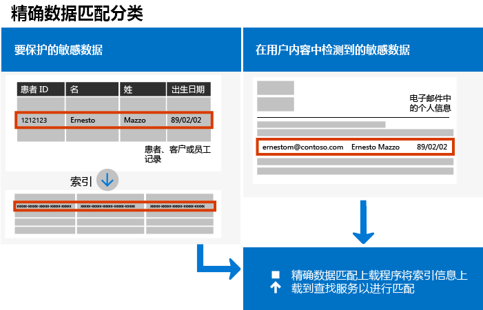
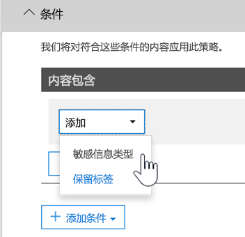

# <a name="create-custom-sensitive-information-types-with-exact-data-match-based-classification"></a>使用基于精确数据匹配的分类创建自定义敏感信息类型

## <a name="overview"></a>概述


  [自定义敏感信息类型](https://docs.microsoft.com/zh-CN/office365/securitycompliance/custom-sensitive-info-types) 用于帮助防止无意或不适当的敏感信息共享。 作为管理员，你可以使用 [安全与合规中心](https://docs.microsoft.com/zh-CN/office365/securitycompliance/create-a-custom-sensitive-information-type)或 [PowerShell](https://docs.microsoft.com/zh-CN/office365/securitycompliance/create-a-custom-sensitive-information-type-in-scc-powershell)，根据模式、证据（“员工”、“徽章”、“ID”等关键字）、字符邻近度（特定模式下证据与字符的邻近度）以及可信度来定义自定义敏感信息类型。   ** ** ** 此类自定义敏感信息类型可满足许多组织的业务需求。

但是，如果你需要自定义敏感信息类型（它使用精确数据值而不是仅与泛型模式匹配），该怎么办？ 通过基于精确数据匹配 (EDM) 的分类，你可以创建专门设计的自定义敏感信息类型：

- 动态并且可刷新；
- 更具可伸缩性；
- 导致更少的误报；
- 处理结构化敏感数据；
- 更安全地处理敏感信息以及
- 与多种 Microsoft 云服务一起使用。



基于 EDM 的分类允许你创建自定义敏感信息类型，它们将引用敏感信息数据库中的精确值。 数据库可以每天或每周刷新一次，最多可包含 1000 万行数据。 因此，当员工、患者或客户往来并且记录发生更改时，你的自定义敏感信息类型仍将保持最新并且适用。 你还可以将基于 EDM 的分类与策略一起使用，例如 [数据丢失防护策略](https://docs.microsoft.com/zh-CN/office365/securitycompliance/data-loss-prevention-policies) (DLP) 或 [Microsoft Cloud App Security 文件策略](https://docs.microsoft.com/cloud-app-security/data-protection-policies)。

## <a name="required-licenses-and-permissions"></a>所需的许可证和权限

你必须是全局管理员、合规性管理员或 Exchange Online 管理员才能执行本文中描述的任务。 若要了解有关 DLP 权限的详细信息，请参阅 [权限](https://docs.microsoft.com/zh-CN/office365/securitycompliance/data-loss-prevention-policies#permissions)。

当正式发布时，基于 EDM 的分类将包含在这些订阅中

- Office 365 E5
- Microsoft 365 E5
- Microsoft 365 信息保护与合规性
- Office 365 高级合规版

## <a name="the-work-flow-at-a-glance"></a>工作流程概览

|阶段  |所需项  |
|---------|---------|
|[第 1 部分：设置基于 EDM 的分类](#part-1-set-up-edm-based-classification)<br/><br/>（根据需要）<br/>- [编辑数据库架构](#editing-the-schema-for-edm-based-classification) <br/>- [删除架构](#removing-the-schema-for-edm-based-classification) |- 敏感数据的读取权限<br/>- .xml 格式的数据库架构（提供了示例）<br/>- .xml 格式的规则包（提供了示例）<br/>- 安全与合规中心的管理员权限（使用 PowerShell） |
|[第 2 部分：创建索引并上载敏感数据](#part-2-index-and-upload-the-sensitive-data)<br/><br/>（根据需要）<br/>[刷新数据](#refreshing-your-sensitive-information-database) |- 自定义安全组和用户帐户<br/>- 使用 EDM 上载代理对计算机进行本地管理员访问<br/>- 敏感数据的读取权限<br/>- 刷新数据的流程和计划|
|[第 3 部分：将基于 EDM 的分类与 Microsoft 云服务一起使用](#part-3-use-edm-based-classification-with-your-microsoft-cloud-services) |- 包含 DLP 的 Office 365 订阅<br/>- 已启用基于 EDM 的分类功能 |

### <a name="part-1-set-up-edm-based-classification"></a>第 1 部分：设置基于 EDM 的分类

设置和配置基于 EDM 的分类涉及以 .csv 格式保存敏感数据、为敏感信息数据库定义架构、创建规则包以及上载架构和规则包。

#### <a name="define-the-schema-for-your-database-of-sensitive-information"></a>定义敏感信息数据库的架构

1. 确定要使用的敏感信息。 将数据导出到应用（如 Microsoft Excel），然后以 .csv 格式保存文件。 数据文件最多可包括以下内容：
      - 高达 1000 万行的敏感数据
      - 每个数据源最多 32 列（字段）
      - 最多 5 个列（字段）标记为可搜索

2. 在 .csv 文件中构造敏感数据，使第一行包含用于基于 EDM 的分类的字段名称。 在 .csv 文件中，你可能拥有“ssn”、“生日”、“名字”、“姓氏”等字段名称。 例如，我们的 .csv 文件称为  *PatientRecords.csv*，其列包含 *患者 ID*、 *MRN*、 *姓氏*、 *名字*、 *SSN* 等。

3. 以 .xml 格式定义敏感信息数据库的架构（类似于下面的示例）。 命名此架构文件 edm.xml 并对其进行配置，确保对于数据库中的每一列，都有一行使用语法 \<Field name="" searchable=""/\>。

      - 将列名用于 *字段名称*值。 
      - 将 *searchable="true"* 用于可搜索的字段，最多 5 个字段。 必须至少将一个字段指定为可搜索。

例如，以下 .xml 文件定义患者记录数据库的架构，其中五个字段指定为可搜索字段： *患者 ID*、 *MRN*、 *SSN*、 *电话*和 *DOB*。

（可复制、修改和使用我们的示例。）

 ```xml
<EdmSchema xmlns="http://schemas.microsoft.com/office/2018/edm">
      <DataStore name="PatientRecords" description="Schema for patient records" version="1">
            <Field name="PatientID" searchable="true" />
            <Field name="MRN" searchable="true" />
            <Field name="FirstName" />
            <Field name="LastName" />
            <Field name="SSN" searchable="true" />
            <Field name="Phone" searchable="true" />
            <Field name="DOB" searchable="true" />
            <Field name="Gender" />
            <Field name="Address" />
      </DataStore>
</EdmSchema>
```

4. [连接到 Office 365 安全与合规中心 PowerShell](https://docs.microsoft.com/powershell/exchange/office-365-scc/connect-to-scc-powershell/connect-to-scc-powershell?view=exchange-ps)。

5. 要上传数据库架构，请逐一运行下列 cmdlet：

```powershell
$edmSchemaXml=Get-Content .\\edm.xml -Encoding Byte -ReadCount 0
New-DlpEdmSchema -FileData $edmSchemaXml -Confirm:$true
```

系统将提示你进行确认，如下所示：

> 确认
>
> 是否确实要执行此操作？
>
> 将导入数据存储“patientrecords”的新 EDM 架构。
>
> \[Y\] 是 \[A\] 全部是 \[N\] 否 \[L\] 全部否 \[?\] 帮助（默认为“Y”）：

> [!TIP]
> 若想更改但不进行确认，请在步骤 5 中改用此 cmdlet：New-DlpEdmSchema -FileData $edmSchemaXml

> [!NOTE]
> 为 EDMSchema 更新新增内容可能需要10-60 分钟。 更新必须完成，然后才能执行使用这些新增操作的步骤。

敏感信息数据库的架构现已定义，接下来是设置规则包。 继续到 [设置规则包](#set-up-a-rule-package)部分。

#### <a name="editing-the-schema-for-edm-based-classification"></a>编辑基于 EDM 的分类的架构

如果想要更改 edm.xml 文件，例如更改要对基于 EDM 的分类使用的字段，请按照以下步骤操作：

1. 编辑 edm.xml 文件（即本文的 [定义架构](#define-the-schema-for-your-database-of-sensitive-information)部分中讨论的文件）。 

2. [连接到 Office 365 安全与合规中心 PowerShell](https://docs.microsoft.com/powershell/exchange/office-365-scc/connect-to-scc-powershell/connect-to-scc-powershell?view=exchange-ps)。

3. 要更新数据库架构，请逐一运行下列 cmdlet：

```powershell
$edmSchemaXml=Get-Content .\\edm.xml -Encoding Byte -ReadCount 0
Set-DlpEdmSchema -FileData $edmSchemaXml -Confirm:$true
```

系统将提示你进行确认，如下所示：

> 确认
>
> 是否确实要执行此操作？
>
> 将更新数据存储“patientrecords”的 EDM 架构。
>
> \[Y\] 是 \[A\] 全部是 \[N\] 否 \[L\] 全部否 \[?\] 帮助（默认为“Y”）：

> [!TIP]
> 若想更改但不进行确认，请在步骤 3 中改用此 cmdlet：Set-DlpEdmSchema -FileData $edmSchemaXml

> [!NOTE]
> 为 EDMSchema 更新新增内容可能需要10-60 分钟。 更新必须完成，然后才能执行使用这些新增操作的步骤。

## <a name="removing-the-schema-for-edm-based-classification"></a>删除基于 EDM 的分类的架构

（根据需要）若想删除正在对基于 EDM 的分类使用的架构，请按照以下步骤操作：

1. [连接到 Office 365 安全与合规中心 PowerShell](https://docs.microsoft.com/powershell/exchange/office-365-scc/connect-to-scc-powershell/connect-to-scc-powershell?view=exchange-ps)。

2. 运行下列 PowerShell cmdlet，将“patientrecords”的数据存储名称替换为要删除的名称：

```powershell
Remove-DlpEdmSchema -Identity patientrecords
```

系统将提示你进行确认，如下所示：

> 确认
>
> 是否确实要执行此操作？
>
> 将删除数据存储“patientrecords”的 EDM 架构。
>
> \[Y\] 是 \[A\] 全部是 \[N\] 否 \[L\] 全部否 \[?\] 帮助（默认为“Y”）：

> [!TIP]
>  若想更改但不进行确认，请在步骤 2 中改用此 cmdlet：Remove-DlpEdmSchema -Identity patientrecords -Confirm:$false

### <a name="set-up-a-rule-package"></a>设置规则包

1. 按 .xml 格式创建一个规则包（采用 Unicode 编码），如下例类似。 （可复制、修改和使用我们的示例。）

设置规则包时，请确保正确引用 .csv 文件和 edm.xml 文件。 可复制、修改和使用我们的示例。 在此示例 xml 中，需要对以下字段进行自定义，以创建 EDM 敏感类型：

- 
  **RulePack id & ExactMatch id**：使用 [New-GUID](https://docs.microsoft.com/zh-CN/powershell/module/microsoft.powershell.utility/new-guid?view=powershell-6) 生成 GUID。

- **数据存储**：此字段指定要使用的 EDM 查找数据存储。 提供已配置的 EDM 架构的数据源名称。

- **idMatch**：此字段指向 EDM 的主要元素。
  - 匹配：指定要在精确查找中使用的字段。 在数据存储的 EDM 架构中提供可搜索的字段名称。
  - 分类：此字段指定触发 EDM 查找的敏感类型匹配。 可提供现有内置或自定义分类的名称或 GUID。

- **匹配：** 此字段指向邻近 idMatch 找到的其他证据。
  - 匹配：在数据存储的 EDM 架构中提供任何字段名称。
- **资源：** 此部分在多个区域设置中指定敏感类型的名称和说明。
  - idRef：提供 ExactMatch id 的 GUID。
  - 名称与说明编辑架构标题：按需自定义。

```xml
<RulePackage xmlns="http://schemas.microsoft.com/office/2018/edm">
  <RulePack id="fd098e03-1796-41a5-8ab6-198c93c62b11">
    <Version build="0" major="2" minor="0" revision="0" />
    <Publisher id="eb553734-8306-44b4-9ad5-c388ad970528" />
    <Details defaultLangCode="en-us">
      <LocalizedDetails langcode="en-us">
        <PublisherName>IP DLP</PublisherName>
        <Name>Health Care EDM Rulepack</Name>
        <Description>This rule package contains the EDM sensitive type for health care sensitive types.</Description>
      </LocalizedDetails>
    </Details>
  </RulePack>
  <Rules>
    <ExactMatch id = "E1CC861E-3FE9-4A58-82DF-4BD259EAB371" patternsProximity = "300" dataStore ="PatientRecords" recommendedConfidence = "65" >
      <Pattern confidenceLevel="65">
        <idMatch matches = "SSN" classification = "U.S. Social Security Number (SSN)" />
      </Pattern>
      <Pattern confidenceLevel="75">
        <idMatch matches = "SSN" classification = "U.S. Social Security Number (SSN)" />
        <Any minMatches ="3" maxMatches ="100">
          <match matches="PatientID" />
          <match matches="MRN"/>
          <match matches="FirstName"/>
          <match matches="LastName"/>
          <match matches="Phone"/>
          <match matches="DOB"/>
        </Any>
      </Pattern>
    </ExactMatch>
    <LocalizedStrings>
      <Resource idRef="E1CC861E-3FE9-4A58-82DF-4BD259EAB371">
        <Name default="true" langcode="en-us">Patient SSN Exact Match.</Name>
        <Description default="true" langcode="en-us">EDM Sensitive type for detecting Patient SSN.</Description>
      </Resource>
    </LocalizedStrings>
  </Rules>
</RulePackage>
```

1. 通过逐一运行下列 PowerShell cmdlet 来上传规则包：

```powershell
$rulepack=Get-Content .\\rulepack.xml -Encoding Byte -ReadCount 0
New-DlpSensitiveInformationTypeRulePackage -FileData $rulepack
```

此时，你已设置基于 EDM 的分类。 下一步是为敏感数据创建索引，然后上传索引数据。

回想一下，在前面的过程中我们的 PatientRecords 架构将五个字段定义为可搜索： *PatientID*、 *MRN*、 *SSN*、 *Phone* 和 *DOB*。 我们的示例规则包中有这些字段并引用数据库架构文件 (edm.xml)，其中每个可搜索的字段具有一个 *ExactMatch* 项目。 请考虑以下 ExactMatch 项目：

```xml
<ExactMatch id = "E1CC861E-3FE9-4A58-82DF-4BD259EAB371" patternsProximity = "300" dataStore ="PatientRecords" recommendedConfidence = "65" >
      <Pattern confidenceLevel="65">
        <idMatch matches = "SSN" classification = "U.S. Social Security Number (SSN)" />
      </Pattern>
      <Pattern confidenceLevel="75">
        <idMatch matches = "SSN" classification = "U.S. Social Security Number (SSN)" />
        <Any minMatches ="3" maxMatches ="100">
          <match matches="PatientID" />
          <match matches="MRN"/>
          <match matches="FirstName"/>
          <match matches="LastName"/>
          <match matches="Phone"/>
          <match matches="DOB"/>
        </Any>
      </Pattern>
    </ExactMatch>
```

在本例中，请注意以下内容：

- dataStore 名称引用了我们之前创建的 .csv 文件： **dataStore = "PatientRecords"**。

- idMatch 值引用了数据库架构文件中列出的可搜索字段： **idMatch matches = "SSN"**。

- 分类值引用了现有或自定义敏感信息类型： **classification = "U.S. Social Security Number (SSN)"**。 （在此情况下，我们使用美国社会保障号的现有敏感信息类型。）

> [!NOTE]
> 为 EDMSchema 更新新增内容可能需要10-60 分钟。 更新必须完成，然后才能执行使用这些新增操作的步骤。

### <a name="part-2-index-and-upload-the-sensitive-data"></a>第 2 部分：创建索引并上传敏感数据

在此阶段，你将设置自定义安全组和用户帐户，并设置 EDM 上载代理工具。 然后，使用该工具为敏感数据创建索引，并上载索引数据。

#### <a name="set-up-the-security-group-and-user-account"></a>设置安全组和用户帐户

1. 以全局管理员身份转到管理中心 ([https://admin.microsoft.com](https://admin.microsoft.com/)) 并 [创建安全组](https://docs.microsoft.com/office365/admin/email/create-edit-or-delete-a-security-group?view=o365-worldwide)（名为 EDM\_DataUploaders）。 

2. 将一个或多个用户添加到 *EDM\_DataUploaders* 安全组。 （这些用户将管理敏感信息的数据库。）

3. 确保负责管理敏感数据的每个用户都是装有 EDM 上载代理的计算机上的本地管理员。

#### <a name="set-up-the-edm-upload-agent"></a>设置 EDM 上载代理

>[!NOTE]
> 在开始此过程之前，请确保你是  *EDM\_DataUploaders* 安全组的成员和计算机上的本地管理员。

1. 下载并安装[EDM 上载代理](https://go.microsoft.com/fwlink/?linkid=2088639)。 默认情况下，安装位置应为 C:\\Program Files\\Microsoft\\EdmUploadAgent。

2. 若要授权 EDM 上载代理，请打开 Windows 命令提示符（以管理员身份），然后运行以下命令：

    `EdmUploadAgent.exe /Authorize`

3. 使用 Office 365 的工作或学校帐户登录。

下一步是使用 EDM 上载代理为敏感数据创建索引，然后上载索引数据。

#### <a name="index-and-upload-the-sensitive-data"></a>创建索引并上传敏感数据

将敏感数据文件（注意我们的示例为 *PatientRecords.csv*）保存到计算机上的本地驱动器。 （我们已将示例 *PatientRecords.csv* 文件保存到 C:\\Edm\\Data。）

若要为敏感数据创建索引并上传，请在 Windows 命令提示符中运行以下命令：

`EdmUploadAgent.exe /UploadData /DataStoreName \<DataStoreName\> /DataFile \<DataFilePath\> /HashLocation \<HashedFileLocation\>`

示例：**EdmUploadAgent.exe /UploadData /DataStoreName PatientRecords /DataFile C:\\Edm\\Hash\\PatientRecords.csv /HashLocation C:\\Edm\\Hash**

若要分隔和执行独立环境中的敏感数据索引，请单独执行索引和上传步骤。

若要为敏感数据创建索引，请在 Windows 命令提示符中运行以下命令：

`EdmUploadAgent.exe /CreateHash /DataFile \<DataFilePath\> /HashLocation \<HashedFileLocation\>`

示例：**EdmUploadAgent.exe /CreateHash /DataFile C:\\Edm\\Data\\PatientRecords.csv /HashLocation C:\\Edm\\Hash**

若要上传索引数据，请在 Windows 命令提示符中运行以下命令：

`EdmUploadAgent.exe /UploadHash /DataStoreName \<DataStoreName\> /HashFile \<HashedSourceFilePath\>`

示例：**EdmUploadAgent.exe /UploadHash /DataStoreName PatientRecords /HashFile C:\\Edm\\Hash\\PatientRecords.EdmHash**

若要验证是否已上传敏感数据，请在 Windows 命令提示符中运行以下命令：

`EdmUploadAgent.exe /GetDataStore`

你将看到数据存储区列表以及上次更新时间，类似于以下内容：

继续设置 [刷新敏感信息数据库](#refreshing-your-sensitive-information-database)的流程和计划。

此时，你已准备好将基于 EDM 的分类与 Microsoft 云服务一起使用。 例如，你可以 [使用基于 EDM 的分类设置 DLP 策略](#to-create-a-dlp-policy-with-edm)。

#### <a name="refreshing-your-sensitive-information-database"></a>刷新敏感信息数据库

你可以每天或每周刷新敏感信息数据库，EDM 上载工具可以重新为敏感数据创建索引，然后重新上载索引数据。

1. 确定刷新敏感信息数据库的流程和频率（每天或每周）。

2. 将敏感数据重新导出到应用（如 Microsoft Excel），并以 .csv 格式保存文件。 在按照 [创建索引并上传敏感数据](#index-and-upload-the-sensitive-data)中所述的步骤执行操作时，让所使用的文件名和位置保持不变。

> [!NOTE]
> 如果 .csv 文件的结构（字段名称）未发生更改，则刷新数据时无需对数据库架构文件进行任何更改。 但是，如果必须进行更改，请确保相应地编辑数据库架和规则包。

3. 使用 [任务计划程序](https://docs.microsoft.com/windows/desktop/TaskSchd/task-scheduler-start-page)自动执行 [创建索引并上载敏感数据](#index-and-upload-the-sensitive-data)流程中的步骤 2 和 3。   你可以使用多种方法来计划任务：

| **方法**             | **需执行的操作**                                                                                                                                                                                                                                                                                                                                                                                                                     |
| ---------------------- | ---------------------------------------------------------------------------------------------------------------------------------------------------------------------------------------------------------------------------------------------------------------------------------------------------------------------------------------------------------------------------------------------------------------------------------- |
| Windows PowerShell     | 请参阅本文中的 [ScheduledTasks](https://docs.microsoft.com/powershell/module/scheduledtasks/?view=win10-ps) 文档和 [示例 PowerShell 脚本](#example-powershell-script-for-task-scheduler)  |
| 任务计划程序 API     | 请参阅 [任务计划程序](https://docs.microsoft.com/windows/desktop/TaskSchd/using-the-task-scheduler)文档                                                                                                                                                                                                                                                                                 |
| Windows 用户界面 | 在 Windows 中单击“开始”，然后键入 Task Scheduler。 **** 然后，在结果列表中，右键单击“任务计划程序”，然后选择“以管理员身份运行”。 **** ****                                                                                                                                                                                                                                                                           |

#### <a name="example-powershell-script-for-task-scheduler"></a>任务计划程序的示例 PowerShell 脚本

此部分包含一个示例 PowerShell 脚本，你可以使用该脚本来计划创建数据索引并上传索引数据的任务：

##### <a name="to-schedule-index-and-upload-in-a-combined-step"></a>在合并步骤中安排索引和上传

```powershell
param(\[string\]$dataStoreName,\[string\]$fileLocation)
\# Assuming current user is also the user context to run the task
$user = "$env:USERDOMAIN\\$env:USERNAME"
$edminstallpath = 'C:\\Program Files\\Microsoft\\EdmUploadAgent\\'
$edmuploader = $edminstallpath + 'EdmUploadAgent.exe'
$csvext = '.csv'
\# Assuming CSV file name is same as data store name
$dataFile = "$fileLocation\\$dataStoreName$csvext"
\# Assuming location to store hash file is same as the location of csv file
$hashLocation = $fileLocation
$uploadDataArgs = '/UploadData /DataStoreName ' + $dataStoreName + ' /DataFile ' + $dataFile + ‘ /HashLocation’ + $hashLocation
\# Set up actions associated with the task
$actions = @()
$actions += New-ScheduledTaskAction -Execute $edmuploader -Argument $uploadDataArgs -WorkingDirectory $edminstallpath
\# Set up trigger for the task
$trigger = New-ScheduledTaskTrigger -Weekly -DaysOfWeek Sunday -At 2am
\# Set up task settings
$principal = New-ScheduledTaskPrincipal -UserId $user -LogonType S4U -RunLevel Highest
$settings = New-ScheduledTaskSettingsSet -RunOnlyIfNetworkAvailable -StartWhenAvailable -WakeToRun
\# Create the scheduled task
$scheduledTask = New-ScheduledTask -Action $actions -Principal $principal -Trigger $trigger -Settings $settings
\# Get credentials to run the task
$creds = Get-Credential -UserName $user -Message "Enter credentials to run the task"
$password=\[Runtime.InteropServices.Marshal\]::PtrToStringAuto(\[Runtime.InteropServices.Marshal\]::SecureStringToBSTR($creds.Password))
\# Register the scheduled task
$taskName = 'EDMUpload\_' + $dataStoreName
Register-ScheduledTask -TaskName $taskName -InputObject $scheduledTask -User $user -Password $password
```

#### <a name="to-schedule-index-and-upload-as-separate-steps"></a>将索引和上传安排为单独的步骤

```powershell
param(\[string\]$dataStoreName,\[string\]$fileLocation)
\# Assuming current user is also the user context to run the task
$user = "$env:USERDOMAIN\\$env:USERNAME"
$edminstallpath = 'C:\\Program Files\\Microsoft\\EdmUploadAgent\\'
$edmuploader = $edminstallpath + 'EdmUploadAgent.exe'
$csvext = '.csv'
$edmext = '.EdmHash'
\# Assuming CSV file name is same as data store name
$dataFile = "$fileLocation\\$dataStoreName$csvext"
$hashFile = "$fileLocation\\$dataStoreName$edmext"
\# Assuming location to store hash file is same as the location of csv file
$hashLocation = $fileLocation
$createHashArgs = '/CreateHash' + ' /DataFile ' + $dataFile + ' /HashLocation ' + $hashLocation
$uploadHashArgs = '/UploadHash /DataStoreName ' + $dataStoreName + ' /HashFile ' + $hashFile
\# Set up actions associated with the task
$actions = @()
$actions += New-ScheduledTaskAction -Execute $edmuploader -Argument $createHashArgs -WorkingDirectory $edminstallpath
$actions += New-ScheduledTaskAction -Execute $edmuploader -Argument $uploadHashArgs -WorkingDirectory $edminstallpath
\# Set up trigger for the task
$trigger = New-ScheduledTaskTrigger -Weekly -DaysOfWeek Sunday -At 2am
\# Set up task settings
$principal = New-ScheduledTaskPrincipal -UserId $user -LogonType S4U -RunLevel Highest
$settings = New-ScheduledTaskSettingsSet -RunOnlyIfNetworkAvailable -StartWhenAvailable -WakeToRun
\# Create the scheduled task
$scheduledTask = New-ScheduledTask -Action $actions -Principal $principal -Trigger $trigger -Settings $settings
\# Get credentials to run the task
$creds = Get-Credential -UserName $user -Message "Enter credentials to run the task"
$password=\[Runtime.InteropServices.Marshal\]::PtrToStringAuto(\[Runtime.InteropServices.Marshal\]::SecureStringToBSTR($creds.Password))
\# Register the scheduled task
$taskName = 'EDMUpload\_' + $dataStoreName
Register-ScheduledTask -TaskName $taskName -InputObject $scheduledTask -User $user -Password $password
```

### <a name="part-3-use-edm-based-classification-with-your-microsoft-cloud-services"></a>第 3 部分：将基于 EDM 的分类与 Microsoft 云服务一起使用

Office 365 DLP for Exchange Online（电子邮件）、OneDrive for Business（文件）、Microsoft Teams（对话）和 Microsoft Cloud App Security DLP 策略将支持 EDM 敏感信息类型。

以下方案的 EDM 敏感信息类型目前正在开发中，尚不可用：

- Office 365 DLP for SharePoint（文件）
- 灵敏度标签和保留标签的自动分类

#### <a name="to-create-a-dlp-policy-with-edm"></a>使用 EDM 创建 DLP 策略

1. 转到“安全与合规中心”([https://protection.office.com](https://protection.office.com/))。

2. 选择“数据丢失防护”\>“策略”。 ****  ****

3. 选择“创建策略”\>“自定义”\>“下一步”。 ****  ****  ****

4. 在“命名策略”选项卡上，指定名称和说明，然后选择“下一步”。 ****  ****

5. 在“选择位置”选项卡上，选择“允许选择特定位置”，然后选择“下一步”。 ****  **** ****

6. 在“状态”列中，选择“Exchange 电子邮件、OneDrive 帐户、团队聊天和频道邮件”，然后选择“下一步”。 ****  ****  **** （注意：目前 SharePoint 网站不支持 EDM，并且 DLP 策略不会检测 Sharepoint for EDM 中的文件）

7. 在“策略设置”选项卡上，选择“使用高级设置”，然后选择“下一步”。 ****  **** ****

8. 选择“+ 新建规则”。 ****

9. 在“名称”部分中，指定规则的名称和说明。 **** 

10. 在“条件”部分的“+ 添加条件”列表中，选择“内容包含敏感类型”。 ****  ****  ****<br/><br/>

11. 搜索你在设置规则包时创建的敏感信息类型，然后选择“+ 添加”。 ****  
    然后选择“完成”。 ****

12. 完成为规则选择相关选项，例如“用户通知”、“用户覆盖”、“事件报告”等，然后选择“保存”。 **** **** **** ****

13. 在“策略设置”选项卡上，查看你的规则，然后选择“下一步”。 ****  ****

14. 指定是立即打开策略、测试它还是保持关闭。 然后选择“下一步” ****。

15. 在“查看你的设置”选项卡上，查看你的策略。 ****  执行任何必要的更改。 准备好后，选择“创建”。 ****

> [!NOTE]
> 新 DLP 策略大约需要一个小时才能通过你的数据中心。

## <a name="related-articles"></a>相关文章


  [内置敏感信息类型以及它们查找的内容](https://docs.microsoft.com/zh-CN/office365/securitycompliance/what-the-sensitive-information-types-look-for)


  [自定义敏感信息类型](https://docs.microsoft.com/zh-CN/office365/securitycompliance/custom-sensitive-info-types)


  [DLP 策略概述](https://docs.microsoft.com/zh-CN/office365/securitycompliance/data-loss-prevention-policies)

[Microsoft Cloud App Security](https://docs.microsoft.com/cloud-app-security)


  [New-DlpEdmSchema](https://docs.microsoft.com/zh-CN/powershell/module/exchange/policy-and-compliance-dlp/new-dlpedmschema?view=exchange-ps)

## <a name="feedback"></a>反馈
已启用 GitHub 反馈，但是添加问题仅适用于公共网站。
