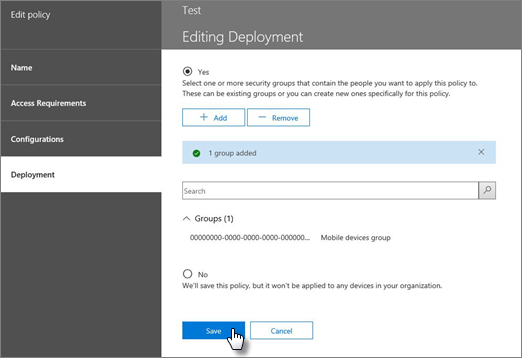

# 创建和部署设备安全策略

可以使用移动设备管理的 Office 365 创建帮助防止未经授权的访问 Office 365 组织的信息的安全策略。在您的组织的用户的设备其中具有适用的 Office 365 许可证和已注册 Office 365 中 MDM 的设备，您可以应用到任何移动设备策略。
  
## 准备工作

- 了解设备、 移动设备应用程序和 Office 365 MDM 支持的安全设置。请参阅[Office 365 的移动设备管理功能](capabilities-of-mobile-device-management.md)。
    
- 创建包含您想要部署到的策略的 Office 365 用户的安全组和用户，您可能想要排除要阻止到 Office 365 的访问。我们建议您的组织部署新的策略之前，您测试策略将它部署到少量用户。您可以创建并使用安全组，其中包含刚刚自己或可以为您测试策略小型 Office 365 用户。若要了解有关安全组的详细信息，请参阅[创建、 编辑或删除安全组](https://go.microsoft.com/fwlink/p/?LinkId=518555)。
    
- **重要：** 您可以创建移动设备策略之前，必须激活并针对 Office 365 设置 MDM。请参阅[Overview of Office 365 的移动设备管理](overview-of-mdm.md)。
    
- 若要创建和部署 Office 365 中的移动设备管理策略，您需要为 Office 365 全局管理员。请参阅[Permissions in Office 365 安全性&amp;合规性中心](https://support.office.com/article/d10608af-7934-490a-818e-e68f17d0e9c1)。
    
- 部署策略之前，让您知道注册 Office 365 中 MDM 的设备的潜在影响的组织。根据如何设置策略，可以阻止不符合标准的设备访问 Office 365，可以删除数据，包括安装的应用程序、 照片和注册的设备上的个人信息。
    
> [!NOTE]
> Exchange ActiveSync 移动设备邮箱策略和在 Exchange 管理中心中创建的设备访问规则，将覆盖策略和在 MDM for Office 365 中创建的访问规则。设备中 MDM 注册 Office 365 后，将忽略任何 Exchange ActiveSync 移动设备邮箱策略或设备访问规则应用于该设备。若要了解有关 Exchange ActiveSync 的详细信息，请参阅[Exchange Online 中的 Exchange ActiveSync](https://go.microsoft.com/fwlink/p/?LinkId=524380)。 
  
## 步骤 1： 创建的安全策略，并部署到测试组

您可以开始之前，请确保您已激活和为 Office 365 设置 MDM。有关说明，请参阅[概述的移动设备管理 Office 365](overview-of-mdm.md) 。 
  
1. 在 Office 365 中，安全中&amp;合规性中心中，转到**数据丢失防护** \> **设备安全策略**。
    
    > [!NOTE]
    > 只有在已激活移动设备管理后，**设备安全策略**将显示在菜单中。 
  
2. 选择 **+ 创建策略**。
    
    
  
3. 为新策略，指定**名称**和**说明**，然后选择**下一步**。
    
    
  
4. 在**要在设备上有什么要求？** 页上，指定要应用于移动设备在组织中的要求，然后选择**下一步**。
    
    
  
5. 在**您想要配置？** 页上，指定要应用于移动设备在组织中任何其他要求，然后选择**下一步**。
    
6. 在**是否要立即应用此策略？** 页上，选择**是**，，然后选择 **+ 添加**。 
    
    
  
7. 选择之前将其部署到您的组织，然后选择**添加**将测试策略的组。
    
8. 选择**下一步**。
    
9. 查看并确认新的设备策略的详细信息，然后选择**创建此策略**。
    
    
  
10. 单击“关闭”****。
    
将策略应用于每个用户将具有推送到其设备的下次登录到 Office 365 使用其移动设备策略。如果用户没有应用到之前其移动设备的策略，然后部署策略之后, 他们将获得通知包括[注册和激活 MDM for Office 365 步骤](https://go.microsoft.com/fwlink/?LinkId=615272)其设备上。直到它们完成注册，请访问电子邮件、 OneDrive 和其他服务会受到限制。它们完成注册使用 Intune 的公司门户应用程序后，他们将能够使用的服务，该策略将应用于其设备。
  
## 步骤 2： 验证策略的工作原理

您已创建的安全策略后，您应该检查策略能够按预期之前将其部署到您的组织的正常工作。
  
1. 在 Office 365 中，转到**安全&amp;合规性中心** \> **数据丢失防护** \> **设备管理**。
    
2. 在**Office 365 的移动设备管理**页上，选中应用策略的用户设备的状态。您可以筛选或排序的**所有**若要查看所有设备或**已阻止**查看阻止的设备。 
    
    
  
3. 您还可以执行完整还是选择性擦除设备上。有关说明，请参阅[擦除 Office 365 中的移动设备](wipe-a-mobile-device.md)。
    
## 步骤 3： 向您的组织部署策略

您已创建移动设备策略，并验证其预期的工作方式后，将其部署到您的组织。
  
1. 在 Office 365 中，转到**安全&amp;合规性中心** \> **数据丢失防护**\> **设备安全策略**。
    
2. 选择您想要部署的策略，然后选择**编辑策略**中\<  _策略名称_\>面板。
    
3. 选择**部署**选项卡。 
    
4. 在**部署**选项卡中，选择**** 上方**选择一个或多个安全组包含您想要应用到此策略的人员**，然后选择**添加**。
    
  - 在**选择组**面板中，您可以搜索要添加的组，可以由别名或按显示名称筛选。您还可以从**组**列表中添加的现有组。 
    
    您可以添加多个组，以应用到的策略。
    
    选择**添加**底部的面板。 
    
5. 在**部署**选项卡上选择**保存**。 
    
    
  
将策略应用于每个用户将具有推送到其设备的下次登录到 Office 365 从其移动设备策略。如果用户没有应用到其移动设备的策略，它们将与注册和为 MDM 激活的 Office 365 步骤[获取其设备上的通知](https://go.microsoft.com/fwlink/?LinkId=615272)。他们已完成注册后，该策略将应用到其设备。 
  
## 不受支持的设备访问的步骤 4： 阻止电子邮件

若要有助于保护组织的信息，您应阻止应用程序访问 Office 365 电子邮件的 Office 365 MDM 不支持的移动设备。支持的设备的列表，请参阅[Office 365 的内置移动设备管理功能](capabilities-of-mobile-device-management.md)。若要此操作： 
  
1. 转到安全&amp;合规性中心\>**数据丢失防护**\> **设备安全策略**。
    
2. 选择**管理组织范围内的设备访问设置**。
    
    
  
3. 若要阻止不支持的设备，请选择**如果设备不支持 Office 365 MDM 是否要允许或阻止其使用 Exchange 帐户访问您组织的电子邮件**下的**块** \> **保存**。
  
## 步骤 5：选择要从条件访问检查中排除的安全组

如果您要从他们的移动设备上的条件访问检查中排除某些人员，并且已为这些人员创建了一个或多个安全组，则在此处添加安全组。这些组中的人员将不会为其受支持的移动设备执行任何策略。
  
1. 转到安全&amp;合规性中心\>**数据丢失防护**\> **设备安全策略**。
    
2. 选择**管理组织范围内的设备访问设置**。
    
    
  
3. 选择**添加**以添加您想要从被排除的用户的安全组阻止到 Office 365 的访问。在用户添加到此列表后，他们将能够访问 Office 365 电子邮件时使用的不受支持的设备。 
    
4. 选择您想要使用**选择组**面板中的安全组。 
    
5. 选择的名称，然后**添加** \> **保存**。
    
6. 在**组织范围内设备访问设置**面板中，选择**保存**。
  
## 安全策略对不同设备类型的影响是什么？

将策略应用于用户的设备时，对每个设备的影响在不同的设备类型之间将稍有不同。请查看以下示例表，了解策略对不同设备的影响。
  

|**安全策略**|**Windows Phone 8.1 +**|**Android 4+**|**三星 Knox**|**IOS 6 +**|**备注**|
|:-----|:-----|:-----|:-----|:-----|:-----|
|需要加密备份    |✖    |✖    |✔    |✔    |所需的 IOS 加密备份。    |
|阻止云备份    |✖    |✔    |✔    |✔    |阻止在 Android 上进行 Google 备份（灰显），阻止在 iOS 上进行云备份。    |
|阻止文档同步    |✖    |✖    |✖    |✔    |iOS：阻止云中的文档。    |
|阻止照片同步    |✖    |✖    |✖    |✔    |iOS（本机）：阻止照片流。    |
|阻止屏幕捕获    |✔    |X    |✔    |✔    |在尝试时被阻止。    |
|阻止视频会议    |✖    |✖    |✖    |✔    |FaceTime 在 iOS 上会被阻止，而 Skype 或其他则不会。    |
|阻止发送诊断数据    |✖    |X    |✔    |✔    |阻止在 Android 上发送 Google 故障报告。    |
|阻止对应用商店的访问    |✔    |X    |✔    |✔    |应用商店图标在 Android 主页上缺失，在 Windows 上禁用，在 iOS 上缺失。    |
|要求提供应用商店的密码    |✖    |✖    |✖    |✔    |iOS：购买 iTunes 所需的密码。    |
|阻止连接到可移动存储    |✔    |X    |✔    |不适用    |Android：SD 卡将呈灰色显示在设置中，Windows 通知用户，安装在那里的应用不可用    |
|阻止蓝牙连接    |✔    |\*\*\*    |\*\*\*    |✖    |\*\*\*我们不能为 Android 上设置禁用蓝牙。相反，我们禁用需要蓝牙的所有事务： 高级音频通讯组、 音频/视频远程控制、 免提设备、 耳麦、 通讯簿访问和串行端口。使用下列任一时，小型 toast 消息将显示在页面底部。    |
   
## 当您删除策略或从策略中删除用户时，会发生什么情况？

当您删除策略，或从策略已部署到组中删除用户时，策略设置、 Office 365 电子邮件配置文件和缓存的电子邮件可能会删除从用户的设备。请参阅下表，请参阅什么删除了不同的设备类型：
  
|**删除的内容**|**Windows Phone 8.1 +**|**iOS 6 +**|**Android 4 + （包括三星 Knox）**|
|:-----|:-----|:-----|:-----|
|托管的电子邮件配置文件\*    |✖    |✔    |✖    |
|策略设置    |✔              除**块从设备发送诊断数据。**   |✔    |✖    |
   
> [!NOTE]
> \*如果策略已部署选项**托管电子邮件配置文件**，然后选择的托管电子邮件配置文件和缓存电子邮件，将从用户的设备中删除配置文件。 
  
已删除的策略应用于每个用户可以从其设备的下次其移动设备使用 MDM 检查 Office 365 中删除的策略。如果您部署新的策略应用于这些用户的设备，他们将提示您重新注册 MDM 在 Office 365。
  
您还可以[擦除设备](wipe-a-mobile-device.md)，或者完全，或有选择地擦除的设备的组织信息。
  
## 相关主题

[Office 365 移动设备管理概述](overview-of-mdm.md)
  
[Office 365 移动设备管理功能](capabilities-of-mobile-device-management.md)
  

