# 数据丢失防护概述Overview of data loss prevention

> [!NOTE]
> 最近将数据丢失防护功能添加到 Microsoft 团队聊天和面向用户许可的 Office 365 高级合规性的频道消息 (可用作独立选项), 并包含在 Office 365 E5 和 Microsoft 365 E5 合规性中。Data loss prevention capabilities were recently added to Microsoft Teams chat and channel messages for users licensed for for Office 365 Advanced Compliance, which is available as a standalone option and is included in Office 365 E5 and Microsoft 365 E5 Compliance. 若要了解有关许可要求的详细信息, 请参阅[Microsoft 365 租户级服务许可指南](https://docs.microsoft.com/office365/servicedescriptions/microsoft-365-service-descriptions/microsoft-365-tenantlevel-services-licensing-guidance)。To learn more about licensing requirements, see [Microsoft 365 Tenant-Level Services Licensing Guidance](https://docs.microsoft.com/office365/servicedescriptions/microsoft-365-service-descriptions/microsoft-365-tenantlevel-services-licensing-guidance).

若要遵守业务标准和行业管理法规, 组织必须保护敏感信息, 并防止无意中泄露。To comply with business standards and industry regulations, organizations must protect sensitive information and prevent its inadvertent disclosure. 敏感信息可以包括财务数据或个人身份信息 (PII), 如信用卡号、社会保险号码或运行状况记录。Sensitive information can include financial data or personally identifiable information (PII) such as credit card numbers, social security numbers, or health records. 使用 Office 365 安全&amp;合规中心中的数据丢失防护 (DLP) 策略, 可以在 office 365 中识别、监视和自动保护敏感信息。With a data loss prevention (DLP) policy in the Office 365 Security &amp; Compliance Center, you can identify, monitor, and automatically protect sensitive information across Office 365.
  
您可以使用 DLP 策略实现以下功能：With a DLP policy, you can:
  
- **跨 Exchange Online、SharePoint Online、OneDrive for Business 和 Microsoft Teams 等多个位置标识敏感信息。****Identify sensitive information across many locations, such as Exchange Online, SharePoint Online, OneDrive for Business, and Microsoft Teams.**
    
    例如, 您可以标识任何包含存储在任何 OneDrive for Business 网站中的信用卡号的文档, 也可以仅监视特定人员的 OneDrive 站点。For example, you can identify any document containing a credit card number that's stored in any OneDrive for Business site, or you can monitor just the OneDrive sites of specific people.
    
- **防止意外共享敏感信息**。**Prevent the accidental sharing of sensitive information**. 
    
    例如, 您可以标识任何包含与组织外部人员共享的运行状况记录的文档或电子邮件, 然后自动阻止对该文档的访问或阻止发送该电子邮件。For example, you can identify any document or email containing a health record that's shared with people outside your organization, and then automatically block access to that document or block the email from being sent.
    
- **监视和保护 Excel、PowerPoint 和 Word 桌面版中的敏感信息。****Monitor and protect sensitive information in the desktop versions of Excel, PowerPoint, and Word.**
    
    就像在 Exchange Online、SharePoint Online 和 OneDrive for Business 中一样, 这些 Office 桌面程序都包含用于识别敏感信息和应用 DLP 策略的相同功能。Just like in Exchange Online, SharePoint Online, and OneDrive for Business, these Office desktop programs include the same capabilities to identify sensitive information and apply DLP policies. 当用户共享这些 Office 程序中的内容时, DLP 提供连续监控。DLP provides continuous monitoring when people share content in these Office programs.
    
- **帮助用户了解如何保持兼容性，同时不会中断工作流。****Help users learn how to stay compliant without interrupting their workflow.**
    
    您可以向用户介绍 DLP 策略，并帮助他们保持兼容性，同时不会中断工作。You can educate your users about DLP policies and help them remain compliant without blocking their work. 例如，如果用户尝试共享包含敏感信息的文档，DLP 策略可以向他们发送电子邮件通知，同时在文档库的上下文中向其显示一个策略提示，以允许他们在具有业务理由的情况下替代策略。For example, if a user tries to share a document containing sensitive information, a DLP policy can both send them an email notification and show them a policy tip in the context of the document library that allows them to override the policy if they have a business justification. Outlook 网页、Outlook、Excel、PowerPoint 和 Word 中也会显示相同的策略提示。The same policy tips also appear in Outlook on the web, Outlook, Excel, PowerPoint, and Word.
    
- **查看 DLP 报告，了解符合组织的 DLP 策略的内容。****View DLP reports showing content that matches your organization's DLP policies.**
    
    要评估您的组织遵守 DLP 策略的情况，您可以查看随着时间推移符合每个策略和每条规则的次数。To assess how your organization is complying with a DLP policy, you can see how many matches each policy and rule has over time. 如果 DLP 策略允许用户覆盖策略提示并报告误报, 则还可以查看用户报告的内容。If a DLP policy allows users to override a policy tip and report a false positive, you can also view what users have reported.
    
您可以在 Office 365 安全&amp;合规中心中的 "数据丢失防护" 页上创建和管理 DLP 策略。You create and manage DLP policies on the Data loss prevention page in the Office 365 Security &amp; Compliance Center.
  
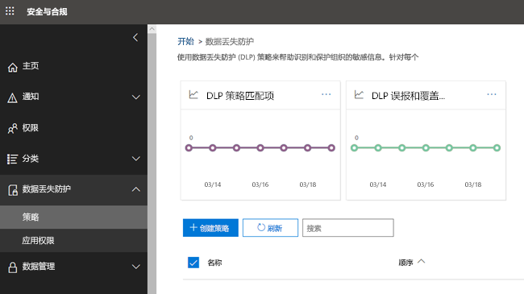
  
## DLP 策略包含的内容What a DLP policy contains

DLP 策略包含以下基本内容：A DLP policy contains a few basic things:
  
- 在何处保护内容:**位置**(如 Exchange Online、SharePoint Online 和 OneDrive for business 网站), 以及 Microsoft 团队聊天和频道消息。Where to protect the content: **locations** such as Exchange Online, SharePoint Online, and OneDrive for Business sites, as well as Microsoft Teams chat and channel messages. 
    
- 何时以及如何通过强制执行由以下部分组成的**规则**来保护此内容：When and how to protect the content by enforcing **rules** comprised of: 
    
  - 在强制执行规则之前内容必须匹配的**条件**。**Conditions** the content must match before the rule is enforced. 例如, 规则可能配置为仅查找包含与您的组织外部人员共享的社会安全号码的内容。For example, a rule might be configured to look only for content containing Social Security numbers that's been shared with people outside your organization. 
    
  - 当找到与条件匹配的内容时, 您希望规则自动执行的**操作**。**Actions** that you want the rule to take automatically when content matching the conditions is found. 例如, 可以将规则配置为阻止对文档的访问, 并同时向用户和合规性监察官发送电子邮件通知。For example, a rule might be configured to block access to a document and send both the user and compliance officer an email notification. 
    
您可以使用规则来满足特定的保护要求，然后使用 DLP 策略将常见保护要求组合在一起，例如要符合特定法规所需的所有规则。You can use a rule to meet a specific protection requirement, and then use a DLP policy to group together common protection requirements, such as all of the rules needed to comply with a specific regulation.
  
例如，DLP 策略可能会帮助您检测是否存在受 Health Insurance Portability and Accountability Act (HIPAA) 约束的信息。For example, you might have a DLP policy that helps you detect the presence of information subject to the Health Insurance Portability and Accountability Act (HIPAA). 此 DLP 策略可以通过查找包含与组织外部人员共享的这些敏感信息的任何文档来帮助保护所有 SharePoint Online 网站和所有 OneDrive for Business 网站 (在 where) 上的 HIPAA 数据 (这些内容)。条件), 然后阻止对文档的访问和发送通知 (操作)。This DLP policy could help protect HIPAA data (the what) across all SharePoint Online sites and all OneDrive for Business sites (the where) by finding any document containing this sensitive information that's shared with people outside your organization (the conditions) and then blocking access to the document and sending a notification (the actions). 这些要求存储为单个规则，并作为一项 DLP 策略组合在一起以简化管理和报告。These requirements are stored as individual rules and grouped together as a DLP policy to simplify management and reporting.
  
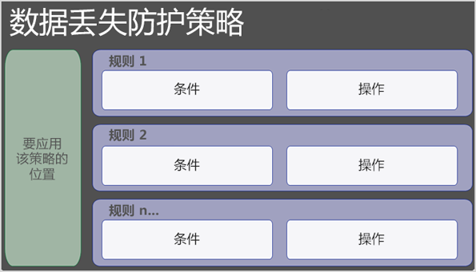
  
### 位置Locations

DLP 策略可以跨 Office 365 查找和保护敏感信息, 无论这些信息位于 Exchange Online、SharePoint Online、OneDrive for Business 中还是 Microsoft 团队中。A DLP policy can find and protect sensitive information across Office 365, whether that information is located in Exchange Online, SharePoint Online, OneDrive for Business, or Microsoft Teams. 您可以选择保护 Exchange 电子邮件、Microsoft 团队聊天和频道消息中的内容, 以及所有 SharePoint 或 OneDrive 库, 或选择策略的特定位置。You can choose to protect content in Exchange email, Microsoft Teams chats and channel messages, and all SharePoint or OneDrive libraries, or select specific locations for a policy.
  

  
如果选择包含或排除特定的 SharePoint 网站或 OneDrive 帐户, DLP 策略不能包含100以上的包含和排除项。If you choose to include or exclude specific SharePoint sites or OneDrive accounts, a DLP policy can contain no more than 100 such inclusions and exclusions. 虽然这一限制存在, 但您可以通过应用组织范围策略或适用于整个位置的策略来超过此限制。Although this limit exists, you can exceed this limit by applying either an org-wide policy or a policy that applies to entire locations.
  
### 规则Rules

规则是在组织内容中实施业务需求的。Rules are what enforce your business requirements on your organization's content. 策略包含一条或多条规则，每条规则由多个条件和操作组成。A policy contains one or more rules, and each rule consists of conditions and actions. 对于每条规则，只要满足了条件，就会自动执行操作。For each rule, when the conditions are met, the actions are taken automatically. 规则是按顺序执行的, 从每个策略中的最高优先级规则开始。Rules are executed sequentially, starting with the highest-priority rule in each policy.
  
规则还提供通知用户 (带有策略提示和电子邮件通知) 和管理员 (电子邮件事件报告) 内容与规则匹配的选项。A rule also provides options to notify users (with policy tips and email notifications) and admins (with email incident reports) that content has matched the rule.
  
以下是规则的组件, 如下所述。Here are the components of a rule, each explained below.
  
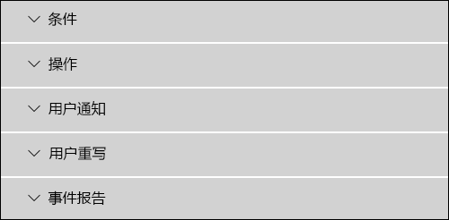
  
#### 条件Conditions

条件非常重要, 因为它们决定了要查找的信息类型以及何时执行操作。Conditions are important because they determine what types of information you're looking for, and when to take an action. 例如, 您可以选择忽略包含护照号码的内容, 除非内容包含10个以上的号码, 并且与组织外部的人员共享。For example, you might choose to ignore content containing passport numbers unless the content contains more than 10 such numbers and is shared with people outside your organization.
  
条件侧重于**内容**, 如要查找的敏感信息类型以及**上下文**(例如, 与谁共享文档的用户)。Conditions focus on the **content**, such as what types of sensitive information you're looking for, and also on the **context**, such as who the document is shared with. 您可以使用条件将不同的操作分配给不同的风险级别。You can use conditions to assign different actions to different risk levels. 例如, 在内部共享的敏感内容可能会降低风险, 并且需要的操作比与组织外部人员共享的敏感内容更少。For example, sensitive content shared internally might be lower risk and require fewer actions than sensitive content shared with people outside the organization. 
  
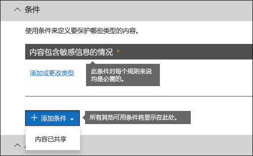
  
现在的可用条件可以确定以下内容：The conditions now available can determine if:
  
- 内容包含一种敏感信息。Content contains a type of sensitive information.
    
- 内容包含标签。Content contains a label. 有关详细信息, 请参阅下一节在[DLP 策略中使用标签作为条件](#using-a-label-as-a-condition-in-a-dlp-policy)。For more information, see the below section [Using a label as a condition in a DLP policy](#using-a-label-as-a-condition-in-a-dlp-policy).
    
- 内容是与您组织的外部还是内部人员共享。Content is shared with people outside or inside your organization.
    
#### 敏感信息类型Types of sensitive information

DLP 策略可帮助保护定义为**敏感信息类型**的敏感信息。A DLP policy can help protect sensitive information, which is defined as a **sensitive information type**. Office 365 包含对多个不同地区供您使用的众多常见敏感信息类型的定义，例如信用卡号、银行账号、国民身份证号及护照号等。Office 365 includes definitions for many common sensitive information types across many different regions that are ready for you to use, such as a credit card number, bank account numbers, national ID numbers, and passport numbers. 
  
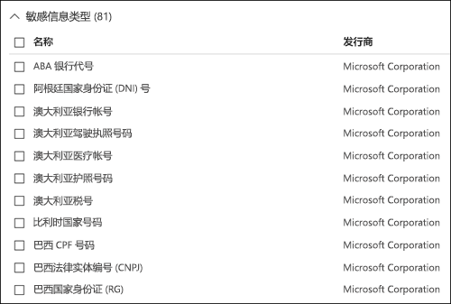
  
当 DLP 策略查找敏感信息类型 (如信用卡号) 时, 它并不只是查找16位的数字。When a DLP policy looks for a sensitive information type such as a credit card number, it doesn't simply look for a 16-digit number. 通过以下组合对每种敏感信息类型进行定义和检测：Each sensitive information type is defined and detected by using a combination of:
  
- 关键字Keywords
    
- 用于验证校验和或撰写的内部函数Internal functions to validate checksums or composition
    
- 用于查找模式匹配的正则表达式评估Evaluation of regular expressions to find pattern matches
    
- 其他内容检查Other content examination
    
这有助于 DLP 检测实现高度准确性, 同时减少可能中断工作的误报数。This helps DLP detection achieve a high degree of accuracy while reducing the number of false positives that can interrupt peoples' work.
  
#### 操作Actions

当内容与规则中的条件相匹配时, 您可以将操作应用于自动保护内容。When content matches a condition in a rule, you can apply actions to automatically protect the content.
  
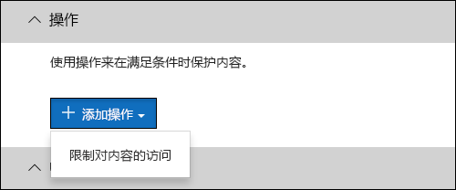
  
现在可以使用操作, 可以执行以下操作:With the actions now available, you can:
  
- **限制对内容的访问**对于 "网站内容", 这意味着对文档的权限仅限于主网站集管理员、文档所有者和上次修改文档的人员之外的所有用户。**Restrict access to the content** For site content, this means that permissions for the document are restricted for everyone except the primary site collection administrator, document owner, and person who last modified the document. 这些用户可以从文档中删除敏感信息或执行其他补救操作。These people can remove the sensitive information from the document or take other remedial action. 当文档符合合规性时, 将自动还原原始权限。When the document is in compliance, the original permissions are automatically restored. 当对文档的访问受到阻止时，文档将在网站的库中显示一个特殊的策略提示图标。When access to a document is blocked, the document appears with a special policy tip icon in the library on the site. 
    
    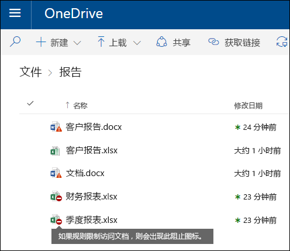
  
    对于电子邮件内容, 此操作阻止发送邮件。For email content, this action blocks the message from being sent. 根据配置 DLP 规则的方式, 发件人会看到一个 NDR 或 (如果该规则使用通知) 策略提示和/或电子邮件通知。Depending on how the DLP rule is configured, the sender sees an NDR or (if the rule uses a notification) a policy tip and/or email notification.
    
    
  
#### 用户通知和用户替代User notifications and user overrides

您可以使用通知和替代来向用户介绍 DLP 策略, 并帮助他们保持合规性, 而不阻止其工作。You can use notifications and overrides to educate your users about DLP policies and help them remain compliant without blocking their work. 例如，如果用户尝试共享包含敏感信息的文档，DLP 策略可以向他们发送电子邮件通知，同时在文档库的上下文中向其显示一个策略提示，以允许他们在具有业务理由的情况下替代策略。For example, if a user tries to share a document containing sensitive information, a DLP policy can both send them an email notification and show them a policy tip in the context of the document library that allows them to override the policy if they have a business justification.
  

  
电子邮件可通知发送、共享或上次修改内容的人员, 以及网站内容、网站内容、主网站集管理员和文档所有者。The email can notify the person who sent, shared, or last modified the content and, for site content, the primary site collection administrator and document owner. 此外, 还可以在电子邮件通知中添加或删除您选择的人。In addition, you can add or remove whomever you choose from the email notification.
  
除了发送电子邮件通知之外, 用户通知还会显示策略提示:In addition to sending an email notification, a user notification displays a policy tip:
  
- 在 Outlook 和 web 上的 Outlook 中。In Outlook and Outlook on the web.
    
- 对于 SharePoint Online 或 OneDrive for business 网站上的文档。For the document on a SharePoint Online or OneDrive for Business site.
    
- 在 Excel、PowerPoint 和 Word 中, 当文档存储在包含在 DLP 策略中的网站上时。In Excel, PowerPoint, and Word, when the document is stored on a site included in a DLP policy.
    
电子邮件通知和策略提示说明了内容与 DLP 策略冲突的原因。The email notification and policy tip explain why content conflicts with a DLP policy. 如果您选择，电子邮件通知和策略提示可以允许用户通过报告误报或提供业务理由来替代规则。If you choose, the email notification and policy tip can allow users to override a rule by reporting a false positive or providing a business justification. 这可以帮助您让用户了解您的 DLP 策略和强制执行它们，而不会阻止用户完成其工作。This can help you educate users about your DLP policies and enforce them without preventing people from doing their work. 有关替代和误报的信息还记录报告（请参阅下文提供的 DLP 报告）并且包含在事件报告（下一节）中，以便合规部主管可以定期查看此信息。Information about overrides and false positives is also logged for reporting (see below about the DLP reports) and included in the incident reports (next section), so that the compliance officer can regularly review this information.
  
以下是策略提示在 OneDrive for Business 帐户中的外观。Here's what a policy tip looks like in a OneDrive for Business account.
  
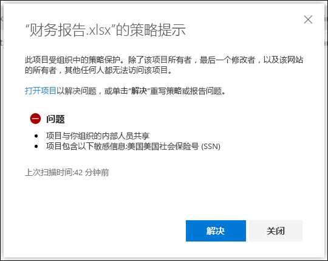
  
#### 事件报告Incident reports

匹配规则时, 可以使用事件详细信息向合规专员 (或任何人选择的任何人) 发送事件报告。When a rule is matched, you can send an incident report to your compliance officer (or any people you choose) with details of the event. 此报告包含有关匹配项目、与规则匹配的实际内容以及上次修改内容的人员的姓名的信息。This report includes information about the item that was matched, the actual content that matched the rule, and the name of the person who last modified the content. 对于电子邮件, 该报告还包括与 DLP 策略匹配的原始邮件的附件。For email messages, the report also includes as an attachment the original message that matches a DLP policy.
  
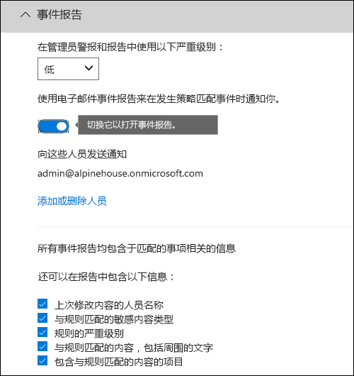
  
## 分组和逻辑运算符Grouping and logical operators

您的 DLP 策略通常具有一个简单的要求, 例如, 标识所有包含美国社会保险号码的内容。Often your DLP policy has a straightforward requirement, such as to identify all content that contains a U.S. Social Security Number. 但是, 在其他情况下, 您的 DLP 策略可能需要标识更松散定义的数据。However, in other scenarios, your DLP policy might need to identify more loosely defined data.
  
例如, 若要确定符合美国卫生保险业法案 (HIPAA) 的内容, 您需要查找以下内容:For example, to identify content subject to the U.S. Health Insurance Act (HIPAA), you need to look for:
  
- 包含特定类型的敏感信息的内容, 如美国社会保险号或药品强制代理 (DEA) 号码。Content that contains specific types of sensitive information, such as a U.S. Social Security Number or Drug Enforcement Agency (DEA) Number.
    
    ANDAND
    
- 较难识别的内容, 如有关患者护理的通信或提供的医疗服务说明。Content that's more difficult to identify, such as communications about a patient's care or descriptions of medical services provided. 标识此内容需要匹配非常大的关键字列表中的匹配关键字, 如 Diseases 的国际分类 (ICD-9-CM 或 ICD-10 厘米)。Identifying this content requires matching keywords from very large keyword lists, such as the International Classification of Diseases (ICD-9-CM or ICD-10-CM).
    
您可以通过使用分组和逻辑运算符 (AND 和 OR) 轻松地识别这些松散定义的数据。You can easily identify such loosely defined data by using grouping and logical operators (AND, OR). 创建 DLP 策略时, 可以执行以下操作:When you create a DLP policy, you can:
  
- 对敏感信息类型进行分组。Group sensitive information types.
    
- 选择组中的敏感信息类型与组本身之间的逻辑运算符。Choose the logical operator between the sensitive information types within a group and between the groups themselves.
    
### 在组中选择运算符Choosing the operator within a group

在组中, 可以选择是否必须满足该组中的任何或所有条件, 才能匹配该规则的内容。Within a group, you can choose whether any or all of the conditions in that group must be satisfied for the content to match the rule.
  
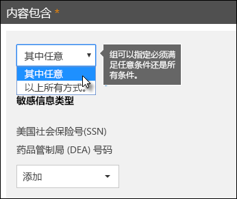
  
### 添加组Adding a group

您可以快速添加组, 该组将其自己的条件和运算符放在该组中。You can quickly add a group, which can have its own conditions and operator within that group.
  
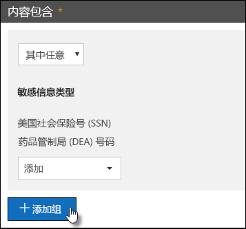
  
### 在组之间选择运算符Choosing the operator between groups

在组之间, 可以选择仅一个组中的条件, 还是必须满足所有组中的条件, 以匹配该规则的内容。Between groups, you can choose whether the conditions in just one group or all of the groups must be satisfied for the content to match the rule.
  
例如, 内置的**美国 HIPAA**策略有一条规则, 该规则在组之间使用**AND**运算符, 以便识别包含以下内容的内容:For example, the built-in **U.S. HIPAA** policy has a rule that uses an **AND** operator between the groups so that it identifies content that contains: 
  
- 来自组**PII 标识符**(至少一个 SSN 号码**或**DEA 号码)from the group **PII Identifiers** (at least one SSN number **OR** DEA number) 
    
    **AND****AND**
    
- 来自 group**医学条款**(至少有一个 ICD-9 Cm 关键字**或**ICD-10 cm 关键字)from the group **Medical Terms** (at least one ICD-9-CM keyword **OR** ICD-10-CM keyword) 
    
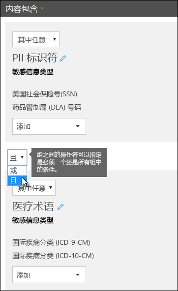
  
## 处理规则的优先级The priority by which rules are processed

在策略中创建规则时, 将按创建顺序为每个规则分配一个优先级—也就是说, 首先创建的规则具有第一个优先级, 创建的规则第二个优先级为第二个优先级, 依此类推。When you create rules in a policy, each rule is assigned a priority in the order in which it's created — meaning, the rule created first has first priority, the rule created second has second priority, and so on. 
  
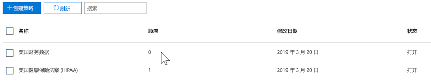
  
设置多个 DLP 策略后, 可以更改一个或多个策略的优先级。After you have set up more than one DLP policy, you can change the priority of one or more policies. 若要执行此操作, 请选择策略, 选择 "**编辑策略**", 并使用 "**优先级**" 列表来指定其优先级。To do that, select a policy, choose **Edit policy**, and use the **Priority** list to specify its priority.

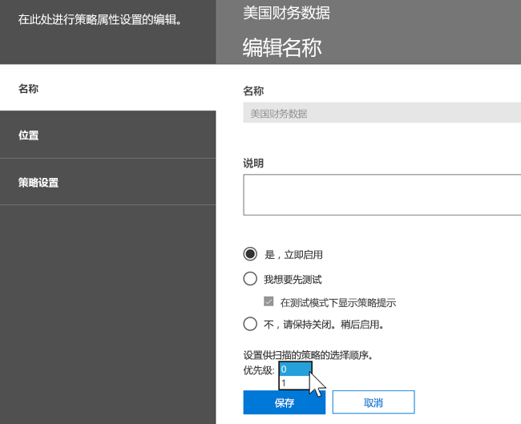

按照规则对内容进行评估时, 将按优先级顺序处理规则。When content is evaluated against rules, the rules are processed in priority order. 如果内容与多个规则匹配, 将按优先级顺序处理规则, 并强制执行限制性最强的操作。If content matches multiple rules, the rules are processed in priority order and the most restrictive action is enforced. 例如, 如果内容与以下所有规则相匹配, 则强制执行规则 3, 因为它的优先级最高, 最受限制的规则如下:For example, if content matches all of the following rules, Rule 3 is enforced because it's the highest priority, most restrictive rule:
  
- 规则 1: 仅通知用户Rule 1: only notifies users
    
- 规则 2: 通知用户、限制访问并允许用户重写Rule 2: notifies users, restricts access, and allows user overrides
    
- 规则 3: 通知用户、限制访问和不允许用户替代Rule 3: notifies users, restricts access, and does not allow user overrides
    
- 规则 4: 仅通知用户Rule 4: only notifies users
    
- 规则 5: 限制访问Rule 5: restricts access
    
- 规则 6: 通知用户、限制访问和不允许用户替代Rule 6: notifies users, restricts access, and does not allow user overrides
    
在此示例中, 请注意, 所有规则的匹配项都记录在审核日志中, 并显示在 DLP 报告中, 即使仅强制实施最严格的规则也是如此。In this example, note that matches for all of the rules are recorded in the audit logs and shown in the DLP reports, even though only the most restrictive rule is enforced.
  
有关策略提示, 请注意:Regarding policy tips, note that:
  
- 仅来自最高优先级的策略提示将显示最受限制的规则。Only the policy tip from the highest priority, most restrictive rule will be shown. 例如，阻止访问内容的规则所提供的策略提示比起只是发送通知的规则所提供的策略提示，前者的显示优先级高于后者。For example, a policy tip from a rule that blocks access to content will be shown over a policy tip from a rule that simply sends a notification. 这会让用户看不到策略提示的级联方式。This prevents people from seeing a cascade of policy tips.
    
- 如果限制最严格的规则中的策略提示允许用户替换规则，那么替换此规则还会替换与此内容相匹配的所有其他规则。If the policy tips in the most restrictive rule allow people to override the rule, then overriding this rule also overrides any other rules that the content matched.
    
## 调整规则以使其更易于或更难匹配Tuning rules to make them easier or harder to match

在用户创建并打开其 DLP 策略后, 它们有时会遇到以下问题:After people create and turn on their DLP policies, they sometimes run into these issues:
  
- 太多**不**敏感的内容信息与规则相匹配, 换句话说, 误报太多。Too much content that **is not** sensitive information matches the rules — in other words, too many false positives. 
    
- 与规则匹配的\*\*\*\* 内容太少, 敏感信息太少。Too little content that **is** sensitive information matches the rules. 换句话说, 保护性操作不会对敏感信息强制实施。In other words, the protective actions aren't being enforced on the sensitive information. 
    
若要解决这些问题, 您可以调整实例数和匹配精度以使内容更难或更轻松地与规则相匹配, 从而调整规则。To address these issues, you can tune your rules by adjusting the instance count and match accuracy to make it harder or easier for content to match the rules. 规则中使用的每种敏感信息类型都具有实例计数和匹配精度。Each sensitive information type used in a rule has both an instance count and match accuracy.
  
### 实例计数Instance count

"实例计数" 表示内容必须有多少个特定类型的敏感信息, 才能匹配该规则。Instance count means simply how many occurrences of a specific type of sensitive information must be present for content to match the rule. 例如, 如果介于1和9唯一美国或英国, 则内容与下面显示的规则相匹配For example, content matches the rule shown below if between 1 and 9 unique U.S. or U.K. 识别护照号码。passport numbers are identified.
  
请注意, 实例计数只包含敏感信息类型和关键字的**唯一**匹配项。Note that the instance count includes only **unique** matches for sensitive information types and keywords. 例如, 如果电子邮件包含10个相同信用卡号码, 则这些10个事件将计为一个信用卡号码的单个实例。For example, if an email contains 10 occurrences of the same credit card number, those 10 occurrences count as a single instance of a credit card number. 
  
若要使用实例计数来调整规则, 本指南非常简单:To use instance count to tune rules, the guidance is straightforward:
  
- 若要使规则更易于匹配, 请减小**最小**计数和/或增加**最大**计数。To make the rule easier to match, decrease the **min** count and/or increase the **max** count. 您还可以通过删除数值将**max**设置为**any** 。You can also set **max** to **any** by deleting the numerical value. 
    
- 若要使规则更难匹配, 请增加**最小**计数。To make the rule harder to match, increase the **min** count. 
    
通常情况下, 在具有较低实例计数的规则 (例如, 1-9) 中使用限制性更少的操作 (如发送用户通知)。Typically, you use less restrictive actions, such as sending user notifications, in a rule with a lower instance count (for example, 1-9). 并且, 在具有更高实例计数的规则 (例如, 10-any) 中使用限制性更强的操作, 例如限制对内容的访问而不允许用户覆盖。And you use more restrictive actions, such as restricting access to content without allowing user overrides, in a rule with a higher instance count (for example, 10-any).
  
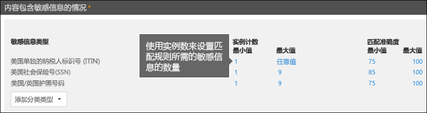
  
### 匹配精确性Match accuracy

如上文所述, 使用不同类型的证据定义和检测敏感信息类型。As described above, a sensitive information type is defined and detected by using a combination of different types of evidence. 通常, 敏感信息类型由多个此类组合 (称为 "模式") 定义。Commonly, a sensitive information type is defined by multiple such combinations, called patterns. 需要较少证据的模式具有较低的匹配精度 (或置信度级别), 而需要更多证据的模式具有更高的匹配精度 (或置信度级别)。A pattern that requires less evidence has a lower match accuracy (or confidence level), while a pattern that requires more evidence has a higher match accuracy (or confidence level). 若要了解有关每种敏感信息类型使用的实际模式和可信度级别的详细信息, 请参阅[敏感信息类型查找的内容](what-the-sensitive-information-types-look-for.md)。To learn more about the actual patterns and confidence levels used by every sensitive information type, see [What the sensitive information types look for](what-the-sensitive-information-types-look-for.md).
  
例如, 名为 "信用卡号码" 的敏感信息类型由两种模式定义:For example, the sensitive information type named Credit Card Number is defined by two patterns:
  
- 具有 65% 可信度的模式, 需要满足以下条件:A pattern with 65% confidence that requires:
    
  - 信用卡号码格式的数字。A number in the format of a credit card number.
    
  - 传递校验和的数字。A number that passes the checksum.
    
- 具有 85% 可信度的模式, 需要满足以下条件:A pattern with 85% confidence that requires:
    
  - 信用卡号码格式的数字。A number in the format of a credit card number.
    
  - 传递校验和的数字。A number that passes the checksum.
    
  - 使用正确的格式的关键字或过期日期。A keyword or an expiration date in the right format.
    
您可以在规则中使用这些可信度级别 (或 "匹配精度")。You can use these confidence levels (or match accuracy) in your rules. 通常情况下, 在匹配精度较低的规则中使用限制性更少的操作 (如发送用户通知)。Typically, you use less restrictive actions, such as sending user notifications, in a rule with lower match accuracy. 您可以使用限制性更强的操作 (如在不允许用户替代的情况下限制对内容的访问), 在具有更高的匹配精确性的规则中。And you use more restrictive actions, such as restricting access to content without allowing user overrides, in a rule with higher match accuracy.
  
请务必了解, 如果内容中标识了特定类型的敏感信息 (如信用卡号), 则仅返回一个置信度:It's important to understand that when a specific type of sensitive information, such as a credit card number, is identified in content, only a single confidence level is returned:
  
- 如果所有匹配项都针对单个模式, 则返回该模式的置信度级别。If all of the matches are for a single pattern, the confidence level for that pattern is returned.
    
- 如果有多个模式的匹配项 (即, 有两个不同的可信度级别的匹配项), 则将返回高于任何单个模式的置信度。If there are matches for more than one pattern (that is, there are matches with two different confidence levels), a confidence level higher than any of the single patterns alone is returned. 这是一个棘手的部分。This is the tricky part. 例如, 对于信用卡, 如果 65% 和 85% 两个模式都匹配, 则为该敏感信息类型返回的置信度级别将大于 90%, 因为更多的证据意味着更自信。For example, for a credit card, if both the 65% and 85% patterns are matched, the confidence level returned for that sensitive information type is greater than 90% because more evidence means more confidence.
    
因此, 如果要为信用卡创建两个相互排斥的规则, 一个是 65% 匹配精度, 另一个为 85% 匹配精度, 则匹配精度的范围将如下所示。So if you want to create two mutually exclusive rules for credit cards, one for the 65% match accuracy and one for the 85% match accuracy, the ranges for match accuracy would look like this. 第一条规则仅选取 65% 模式的匹配项。The first rule picks up only matches of the 65% pattern. 第二个规则将选取与**至少一个**85% 匹配的匹配项, 并且**可能会有**其他较低可信度的匹配项。The second rule picks up matches with **at least one** 85% match and **can potentially have** other lower-confidence matches. 
  
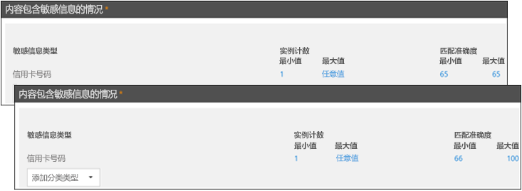
  
出于这些原因, 使用不同的匹配精度创建规则的指南如下:For these reasons, the guidance for creating rules with different match accuracies is:
  
- 最低置信度通常对**min**和**max** (不是区域) 使用相同的值。The lowest confidence level typically uses the same value for **min** and **max** (not a range). 
    
- 最高置信度通常是从较低置信度到100的范围。The highest confidence level is typically a range from just above the lower confidence level to 100.
    
- 任何置信度级别通常都介于较低置信度级别的正上方和低于较高置信度的下方。Any in-between confidence levels typically range from just above the lower confidence level to just below the higher confidence level.
    
## 在 DLP 策略中使用标签作为条件Using a label as a condition in a DLP policy

您可以创建一个标签, 然后执行以下操作:You can create a label and then:
  
- **发布**, 以便最终用户可以查看和手动将标签应用于内容。**Publish** it, so that end users can see and manually apply the label to content. 
    
- **自动将其应用**于与您选择的条件相匹配的内容。**Auto-apply** it to content that matches the conditions that you choose. 
    
有关标签的详细信息, 请参阅[保留标签概述](labels.md)。For more information about labels, see [Overview of retention labels](labels.md).
  
创建标签后, 可以将该标签用作 DLP 策略中的条件。After you create a label, you can then use that label as a condition in your DLP policies. 例如, 您可能希望执行此操作, 因为:For example, you might want to do this because:
  
- 您发布了一个名为 "**机密**" 的标签, 以便组织中的人员可以手动将该标签应用于机密电子邮件和文档。You published a label named **Confidential**, so that people in your organization can manually apply the label to confidential email and documents. 通过将此标签用作 DLP 策略中的条件, 可以将标记为 "**机密**" 的内容限制为与组织外部的人员共享。By using this label as a condition in your DLP policy, you can restrict content labeled **Confidential** from being shared with people outside your organization. 
    
- 您为该名称的项目创建了一个名为**Alpine 房子**的标签, 然后将该标签自动应用于包含关键字 "Alpine 房子" 的内容。You created a label named **Alpine House** for a project of that name, and then applied that label automatically to content containing the keywords "Alpine House". 通过将此标签用作 DLP 策略中的条件, 可以在即将与组织外部的人员共享此内容时向最终用户显示策略提示。By using this label as a condition in your DLP policy, you can show a policy tip to end users when they're about to share this content with someone outside your organization. 
    
- 您发布了一个名为 "**税收 record**" 的标签, 以便您的记录管理员可以手动将该标签应用于需要分类为记录的内容。You published a label named **Tax record**, so that your records manager can manually apply the label to content that needs to be classified as a record. 通过将此标签用作 DLP 策略中的条件, 可以使用此标签以及其他类型的敏感信息 (如 ITINs 或 Ssn) 查找内容;将保护操作应用于标记为 "**税收记录**" 的内容;并从 DLP 报告和审核日志数据中获取有关 DLP 策略的详细活动报告。By using this label as a condition in your DLP policy, you can look for content with this label along with other types of sensitive information such as ITINs or SSNs; apply protection actions to content labeled **Tax record**; and get detailed activity reports about the DLP policy from the DLP reports and audit log data. 
    
- 您发布了一个名为**Executive 领导团队**的标签-对一组主管的 Exchange 邮箱和 OneDrive 帐户敏感。You published a label named **Executive Leadership Team - Sensitive** to the Exchange mailboxes and OneDrive accounts of a group of executives. 通过将此标签用作 DLP 策略中的条件, 可以同时对同一子集的内容和用户实施保留和保护操作。By using this label as a condition in your DLP policy, you can enforce both retention and protection actions on the same subset of content and users. 
    
通过将标签用作 DLP 规则中的条件, 可以有选择地对一组特定的内容、位置或用户强制实施保护操作。By using labels as a condition in your DLP rules, can you selectively enforce protection actions on a specific set of content, locations, or users.
  
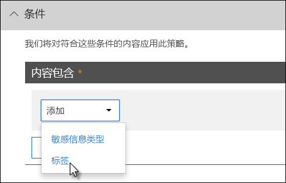

### 对敏感度标签的支持即将推出Support for sensitivity labels is coming

当前可以仅将保留标签用作条件, 而不能使用[敏感度标签](sensitivity-labels.md)。You can currently use only a retention label as a condition, not a [sensitivity label](sensitivity-labels.md). 目前, 我们正在为在此条件中使用灵敏度标签提供支持。We're currently working on support for using a sensitivity label in this condition.
  
### 此功能与其他功能的关联方式How this feature relates to other features

可将多个功能应用于包含敏感信息的内容:Several features can be applied to content containing sensitive information:
  
- [保留标签](labels.md#applying-a-retention-label-automatically-based-on-conditions)和[保留策略](retention-policies.md)均可对此内容强制执行**保留**操作。A [retention label](labels.md#applying-a-retention-label-automatically-based-on-conditions) and a [retention policy](retention-policies.md) can both enforce **retention** actions on this content. 
    
- DLP 策略可以对此内容强制实施**保护**操作。A DLP policy can enforce **protection** actions on this content. 在强制执行这些操作之前, DLP 策略可能需要满足其他条件, 除了包含标签的内容。And before enforcing these actions, a DLP policy can require other conditions to be met in addition to the content containing a label. 
    

  
请注意, DLP 策略具有更丰富的检测功能, 而不是应用于敏感信息的标签或保留策略。Note that a DLP policy has a richer detection capability than a label or retention policy applied to sensitive information. DLP 策略可以对包含敏感信息的内容强制执行保护操作, 如果从内容中删除了敏感信息, 则下次扫描内容时将撤消这些保护操作。A DLP policy can enforce protective actions on content containing sensitive information, and if the sensitive information is removed from the content, those protective actions are undone the next time the content's scanned. 但是, 如果保留策略或标签应用于包含敏感信息的内容, 则即使删除了敏感信息, 也不会撤消该一次性操作。But if a retention policy or label is applied to content containing sensitive information, that's a one-time action that won't be undone even if the sensitive information is removed.
  
通过将标签用作 DLP 策略中的条件, 可以使用该标签对内容强制执行保留和保护操作。By using a label as a condition in a DLP policy, you can enforce both retention and protection actions on content with that label. 您可以考虑包含标签的内容与包含敏感信息的内容完全一样-标签和敏感信息类型都是用于对内容进行分类的属性, 以便您可以对该内容强制执行操作。You can think of content containing a label exactly like content containing sensitive information - both a label and a sensitive information type are properties used to classify content, so that you can enforce actions on that content.
  
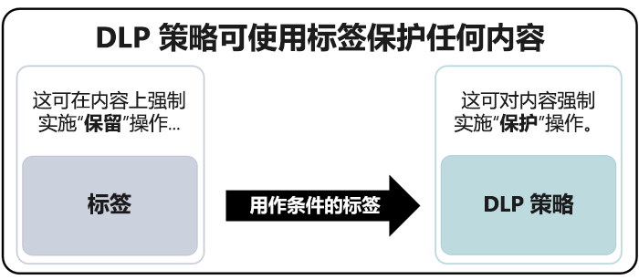
  
## 简单设置与高级设置Simple settings vs. advanced settings

当您创建 DLP 策略时, 您将在简单或高级设置之间进行选择:When you create a DLP policy, you'll choose between simple or advanced settings:
  
- **简单设置**使您可以轻松地创建最常用类型的 DLP 策略, 而无需使用规则编辑器来创建或修改规则。**Simple settings** make it easy to create the most common type of DLP policy without using the rule editor to create or modify rules. 
    
- **高级设置**使用规则编辑器为您提供对 DLP 策略的每个设置的完全控制。**Advanced settings** use the rule editor to give you complete control over every setting for your DLP policy. 
    
无需担心, "简单设置" 和 "高级" 设置的工作方式完全相同, 只是通过使用简单设置来强制执行包含条件和操作的规则, 而不会看到 "规则编辑器"。Don't worry, under the covers, simple settings and advanced settings work exactly the same, by enforcing rules comprised of conditions and actions -- only with simple settings, you don't see the rule editor. 这是创建 DLP 策略的快速方法。It's a quick way to create a DLP policy.
  
### 简单设置Simple settings

到目前为止, 最常见的 DLP 方案是创建一个策略, 以帮助保护包含敏感信息的内容与组织外部的人员共享, 并采取自动补救措施, 如限制谁可以访问内容,发送最终用户或管理员通知, 并审核事件以供日后调查。By far, the most common DLP scenario is creating a policy to help protect content containing sensitive information from being shared with people outside your organization, and taking an automatic remedial action such as restricting who can access the content, sending end-user or admin notifications, and auditing the event for later investigation. 用户使用 DLP 有助于防止无意中泄露敏感信息。People use DLP to help prevent the inadvertent disclosure of sensitive information.
  
若要简化实现此目标的目的, 在创建 DLP 策略时, 可以选择 "**使用简单设置**"。To simplify achieving this goal, when you create a DLP policy, you can choose **Use simple settings**. 这些设置提供了实现最常用 DLP 策略所需的一切, 而无需进入规则编辑器。These settings provide everything you need to implement the most common DLP policy, without having to go into the rule editor.
  
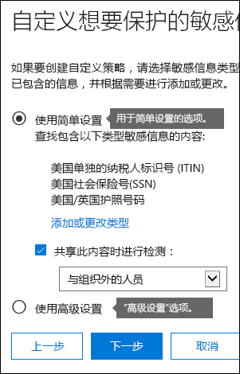
  
### 高级设置Advanced settings

如果您需要创建更多自定义的 DLP 策略, 则可以选择 "**使用高级设置**"。If you need to create more customized DLP policies, you can choose **Use advanced settings**.
  
高级设置向您提供规则编辑器, 在其中可以完全控制每个可能的选项, 包括每个规则的实例计数和匹配精度 (置信度级别)。The advanced settings present you with the rule editor, where you have full control over every possible option, including the instance count and match accuracy (confidence level) for each rule.
  
若要快速跳转到某一节, 请单击规则编辑器顶部导航中的某个项目, 以转到下面的部分。To jump to a section quickly, click an item in the top navigation of the rule editor to go to that section below.
  
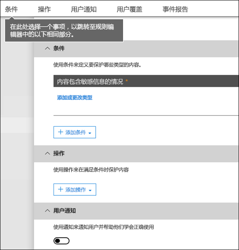
  
## DLP 策略模板DLP policy templates

创建 DLP 策略的第一步是选择要保护的信息。The first step in creating a DLP policy is choosing what information to protect. 通过从 DLP 模板开始, 可以保存从头开始创建一组新的规则的工作, 并在默认情况下, 找出应包含哪些类型的信息。By starting with a DLP template, you save the work of building a new set of rules from scratch, and figuring out which types of information should be included by default. 然后, 您可以添加或修改这些要求, 以微调规则以满足组织的特定要求。You can then add to or modify these requirements to fine tune the rule to meet your organization's specific requirements.
  
预配置的 DLP 策略模板可帮助您检测特定类型的敏感信息, 如 HIPAA 数据、PCI-DSS 数据、格雷姆-比利雷 Act 数据, 甚至是特定于区域设置的个人身份信息 (P.I.)。A preconfigured DLP policy template can help you detect specific types of sensitive information, such as HIPAA data, PCI-DSS data, Gramm-Leach-Bliley Act data, or even locale-specific personally identifiable information (P.I.). 要使您能够轻松地查找和保护常见类型的敏感信息，包含在 Office 365 中的策略模板已包含您要开始构建策略所需的最常见的敏感信息类型。To make it easy for you to find and protect common types of sensitive information, the policy templates included in Office 365 already contain the most common sensitive information types necessary for you to get started.
  
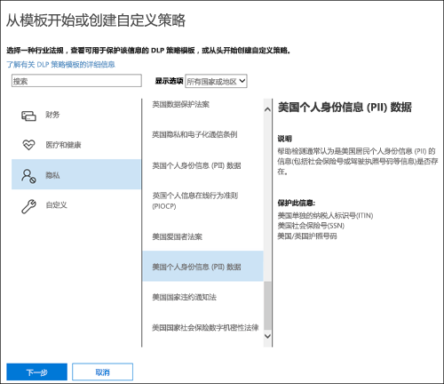
  
您的组织可能还具有自己的特定要求, 在这种情况下, 您可以通过选择 "**自定义策略**" 选项从头开始创建 DLP 策略。Your organization may also have its own specific requirements, in which case you can create a DLP policy from scratch by choosing the **Custom policy** option. 自定义策略为空且不包含任何 premade 规则。A custom policy is empty and contains no premade rules. 
  
## 在测试模式下逐步部署 DLP 策略Roll out DLP policies gradually with test mode

创建 DLP 策略时，您应考虑逐步部署策略，在完全强制执行策略之前评估其影响，并测试其有效性。When you create your DLP policies, you should consider rolling them out gradually to assess their impact and test their effectiveness before fully enforcing them. 例如, 您不希望新的 DLP 策略无意中阻止用户需要访问的数千个文档的访问权限, 以便完成其工作。For example, you don't want a new DLP policy to unintentionally block access to thousands of documents that people require access to in order to get their work done.
  
如果您创建的 DLP 策略具有很大的潜在影响, 我们建议按照以下顺序进行操作:If you're creating DLP policies with a large potential impact, we recommend following this sequence:
  
1. **在测试模式下启动 (不带策略提示**), 然后使用 DLP 报告和任何事件报告来评估影响。**Start in test mode without Policy Tips** and then use the DLP reports and any incident reports to assess the impact. 您可以使用 DLP 报告查看匹配策略的次数、位置、类型和严重性。You can use DLP reports to view the number, location, type, and severity of policy matches. 根据结果，您可以在需要时微调规则。Based on the results, you can fine tune the rules as needed. 在测试模式下，DLP 策略不会影响您组织内的工作人员的工作效率。In test mode, DLP policies will not impact the productivity of people working in your organization. 
    
2. **移动到使用通知和策略提示的测试模式**，以便您可以开始向用户介绍合规性策略，让用户对将要应用的规则做好准备。在这一阶段，您还可以要求用户报告误报，便于您进一步优化规则。**Move to Test mode with notifications and Policy Tips** so that you can begin to teach users about your compliance policies and prepare them for the rules that are going to be applied. At this stage, you can also ask users to report false positives so that you can further refine the rules. 
    
3. **对策略启动完全强制**, 以便应用规则中的操作和内容受保护。**Start full enforcement on the policies** so that the actions in the rules are applied and the content's protected. 继续监视 DLP 报告及任何事件报告或通知，确保结果是您所期望的。Continue to monitor the DLP reports and any incident reports or notifications to make sure that the results are what you intend. 
    

  
您可以随时禁用 DLP 策略，这会影响策略中的所有规则。You can turn off a DLP policy at any time, which affects all rules in the policy. 但是, 也可以通过在规则编辑器中切换每条规则的状态来单独关闭这些规则。However, each rule can also be turned off individually by toggling its status in the rule editor.
  
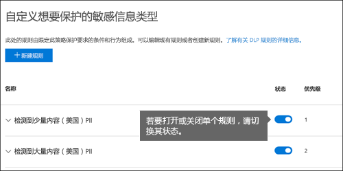

您还可以更改策略中的多个规则的优先级。You can also change the priority of multiple rules in a policy. 若要执行此操作, 请打开策略以进行编辑。To do that, open a policy for editing. 在某个规则的行中, 选择省略号 (**...**), 然后选择一个选项, 如 "下移" 或 " \*\*\*\* **置于最后**"。In a row for a rule, choose the ellipses (**...**), and then choose an option, such as **Move down** or **Bring to last**.

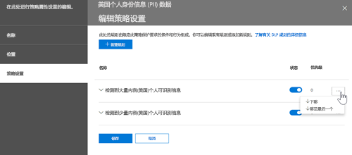
  
## DLP 报告DLP reports

创建并打开 DLP 策略后, 您需要验证它们是否按预期工作, 并帮助您保持合规性。After you create and turn on your DLP policies, you'll want to verify that they're working as you intended and helping you stay compliant. 使用 DLP 报告，您可以快速查看随着时间的推移 DLP 策略和规则匹配的次数，以及误报和替代数。With DLP reports, you can quickly view the number of DLP policy and rule matches over time, and the number of false positives and overrides. 对于每个报告，您都可以按位置、时间范围，甚至缩小为特定的策略、规则或操作来筛选这些匹配项。For each report, you can filter those matches by location, time frame, and even narrow it down to a specific policy, rule, or action.
  
使用 DLP 报告，您可以获取业务见解并了解以下内容：With the DLP reports, you can get business insights and:
  
- 重点关注特定的时间段，并了解峰值和发展趋势的原因。Focus on specific time periods and understand the reasons for spikes and trends.
    
- 发现违反组织的合规性策略的业务流程。Discover business processes that violate your organization's compliance policies.
    
- 了解 DLP 策略的任何业务影响。Understand any business impact of the DLP policies.
    
此外，您可以使用 DLP 报告在运行时微调您的 DLP 策略。In addition, you can use the DLP reports to fine tune your DLP policies as you run them.
  

  
## DLP 策略的工作原理How DLP policies work

DLP 使用深入内容分析（而不仅仅是简单的文本扫描）来检测敏感信息。这种深入内容分析使用关键字匹配、字典匹配、正则表达式评估、内部函数以及其他方法来检测匹配 DLP 策略的内容。您的数据中可能只有一小部分数据被视为敏感数据。DLP 策略可以只识别、监视和自动保护那些敏感数据，而不会妨碍或影响处理您的内容的其余部分的人员。DLP detects sensitive information by using deep content analysis (not just a simple text scan). This deep content analysis uses keyword matches, dictionary matches, the evaluation of regular expressions, internal functions, and other methods to detect content that matches your DLP policies. Potentially only a small percentage of your data is considered sensitive. A DLP policy can identify, monitor, and automatically protect just that data, without impeding or affecting people who work with the rest of your content.
  
### 策略会进行同步Policies are synced

在安全&amp;合规中心中创建 DLP 策略后, 它将存储在一个中央策略存储中, 然后同步到各种内容源, 其中包括:After you create a DLP policy in the Security &amp; Compliance Center, it's stored in a central policy store, and then synced to the various content sources, including:
  
- Exchange Online, 并从 web 上的 Outlook 和 Outlook 打开Exchange Online, and from there to Outlook on the web and Outlook
    
- OneDrive for Business 站点OneDrive for Business sites
    
- SharePoint Online 站点SharePoint Online sites
    
- Office 桌面程序 (Excel、PowerPoint 和 Word)Office desktop programs (Excel, PowerPoint, and Word)

- Microsoft 团队频道和聊天消息Microsoft Teams channels and chat messages
    
在将该策略同步到正确的位置之后, 它将开始评估内容并强制执行操作。After the policy's synced to the right locations, it starts to evaluate content and enforce actions.
  
### OneDrive for Business 和 SharePoint Online 站点中的策略评估Policy evaluation in OneDrive for Business and SharePoint Online sites

在所有 SharePoint Online 网站和 OneDrive for business 网站中, 文档会不断变化, 它们将不断地被创建、编辑、共享, 等等。Across all of your SharePoint Online sites and OneDrive for Business sites, documents are constantly changing — they're continually being created, edited, shared, and so on. 这意味着文档可能随时会与 DLP 策略发生冲突，或变为合规状态。This means documents can conflict or become compliant with a DLP policy at any time. 例如，一个用户上载的文档可能不包含与团队站点相关的敏感信息，但之后，另一个用户可能会编辑同一文档，并向文档添加敏感信息。For example, a person can upload a document that contains no sensitive information to their team site, but later, a different person can edit the same document and add sensitive information to it.
  
为此，DLP 策略经常检查后台中是否包含与策略相符的文档。For this reason, DLP policies check documents for policy matches frequently in the background. 您可以将这视为异步策略评估。You can think of this as asynchronous policy evaluation.
  
#### 运作方式How it works
 
当用户在其网站中添加或更改文档时, 搜索引擎会对内容进行扫描, 以便以后可以对其进行搜索。As people add or change documents in their sites, the search engine scans the content, so that you can search for it later. 在这种情况下, 还会对内容进行扫描以查找敏感信息, 并检查是否已共享。While this is happening, the content's also scanned for sensitive information and to check if it's shared. 找到的任何敏感信息都将安全存储在搜索索引中, 以便只有合规性团队可以访问它, 而不是典型用户。Any sensitive information that's found is stored securely in the search index, so that only the compliance team can access it, but not typical users. 您已启用的每个 DLP 策略都将在后台运行 (异步), 检查与策略匹配的任何内容的搜索频率, 并应用操作以防止意外泄漏。Each DLP policy that you've turned on runs in the background (asynchronously), checking search frequently for any content that matches a policy, and applying actions to protect it from inadvertent leaks.
  
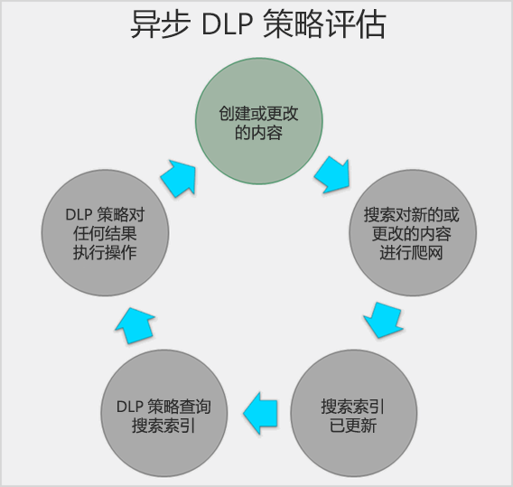
  
最后，文档可能与 DLP 策略相冲突，但也可能符合 DLP 策略。例如，如果用户将信用卡号添加到文档，可能会导致 DLP 策略自动阻止对该文档的访问。但是，如果该用户稍后删除此敏感信息，则下一次根据此策略对此文档进行评估时，该操作（在这种情况下，阻止操作）将自动撤消。Finally, documents can conflict with a DLP policy, but they can also become compliant with a DLP policy. For example, if a person adds credit card numbers to a document, it might cause a DLP policy to block access to the document automatically. But if the person later removes the sensitive information, the action (in this case, blocking) is automatically undone the next time the document is evaluated against the policy.
  
DLP 评估可编制索引的任何内容。DLP evaluates any content that can be indexed. 有关默认情况下进行爬网的文件类型的详细信息, 请参阅[SharePoint Server 中的默认已爬网文件扩展名和分析文件类型](https://docs.microsoft.com/SharePoint/technical-reference/default-crawled-file-name-extensions-and-parsed-file-types)。For more information on what file types are crawled by default, see [Default crawled file name extensions and parsed file types in SharePoint Server](https://docs.microsoft.com/SharePoint/technical-reference/default-crawled-file-name-extensions-and-parsed-file-types).
  
### Exchange Online、Outlook 和 Outlook 网页版中的策略评估Policy evaluation in Exchange Online, Outlook, and Outlook on the web

在创建包含 Exchange Online 作为位置的 DLP 策略时, 该策略将从 Office 365 安全&amp;合规中心同步到 Exchange online, 然后从 exchange online 同步到 web 上的 Outlook 和 outlook。When you create a DLP policy that includes Exchange Online as a location, the policy's synced from the Office 365 Security &amp; Compliance Center to Exchange Online, and then from Exchange Online to Outlook on the web and Outlook.
  
在 Outlook 中撰写邮件时, 如果要创建的内容是根据 DLP 策略进行评估, 则用户可以查看策略提示。When a message is being composed in Outlook, the user can see policy tips as the content being created is evaluated against DLP policies. 在邮件发送之后, 它将根据 DLP 策略进行评估, 作为邮件流的正常部分, 以及 Exchange 邮件流规则 (也称为传输规则) 和在 Exchange 管理中心中创建的 DLP 策略。And after a message is sent, it's evaluated against DLP policies as a normal part of mail flow, along with Exchange mail flow rules (also known as transport rules) and DLP policies created in the Exchange admin center. DLP 策略同时扫描邮件和所有附件。DLP policies scan both the message and any attachments.
  
### Office 桌面程序中的策略评估Policy evaluation in the Office desktop programs

Excel、PowerPoint 和 Word 包含标识敏感信息的相同功能, 并将 DLP 策略应用为 SharePoint Online 和 OneDrive for business。Excel, PowerPoint, and Word include the same capability to identify sensitive information and apply DLP policies as SharePoint Online and OneDrive for Business. 这些 Office 程序直接从中央策略存储同步其 DLP 策略, 然后在用户处理从包含在 DLP 策略中的网站中打开的文档时, 将继续评估 DLP 策略的内容。These Office programs sync their DLP policies directly from the central policy store, and then continuously evaluate the content against the DLP policies when people work with documents opened from a site that's included in a DLP policy.
  
Office 中的 DLP 策略评估设计不会影响程序的性能或对内容进行处理的人员的工作效率。DLP policy evaluation in Office is designed not to affect the performance of the programs or the productivity of people working on content. 如果他们正在处理大型文档, 或者用户的计算机忙, 可能需要几秒钟的时间才能显示策略提示。If they're working on a large document, or the user's computer is busy, it might take a few seconds for a policy tip to appear.

### Microsoft 团队中的策略评估Policy evaluation in Microsoft Teams
 
在创建将 Microsoft 团队作为位置包含的 DLP 策略时, 该策略将从 Office 365 安全&amp;合规中心同步到用户帐户以及 Microsoft 团队频道和聊天消息。When you create a DLP policy that includes Microsoft Teams as a location, the policy's synced from the Office 365 Security &amp; Compliance Center to user accounts and Microsoft Teams channels and chat messages. 当有人尝试在 Microsoft 团队聊天或频道消息中共享敏感信息时, 可能会阻止或取消邮件, 具体取决于配置 DLP 策略的方式。Depending on how DLP policies are configured, when someone attempts to share sensitive information in a Microsoft Teams chat or channel message, the message can be blocked or revoked. 而且, 包含敏感信息且与来宾共享的文档 (外部用户) 将不会为这些用户打开。And, documents that contain sensitive information and that are shared with guests (external users) won't open for those users. 若要了解详细信息, 请参阅[数据丢失防护和 Microsoft 团队](dlp-microsoft-teams.md)。To learn more, see [Data loss prevention and Microsoft Teams](dlp-microsoft-teams.md).
 
## 权限Permissions

要创建 DLP 策略的合规性团队的成员需要安全&amp;合规中心的权限。Members of your compliance team who will create DLP policies need permissions to the Security &amp; Compliance Center. 默认情况下, 你的租户管理员将有权访问此位置, 并且可以向合规专员和其他人授予&amp;对安全合规中心的访问权限, 而无需为其授予租户管理员的所有权限。为此, 我们建议您执行以下操作:By default, your tenant admin will have access to this location and can give compliance officers and other people access to the Security &amp; Compliance Center, without giving them all of the permissions of a tenant admin. To do this, we recommend that you:
  
1. 在 Office 365 中创建组并向其添加合规部主管。Create a group in Office 365 and add compliance officers to it.
    
2. 在安全&amp;合规性中心的 "**权限**" 页上创建角色组。Create a role group on the **Permissions** page of the Security &amp; Compliance Center. 
    
3. 将 Office 365 组添加到角色组。Add the Office 365 group to the role group.
    
有关详细信息，请参阅[Give users access to the Office 365 Compliance Center](grant-access-to-the-security-and-compliance-center.md)。For more information, see [Give users access to the Office 365 Compliance Center](grant-access-to-the-security-and-compliance-center.md).
  
只有在创建和应用 DLP 策略时才需要这些权限。These permissions are required only to create and apply a DLP policy. 策略执行不需要访问此内容。Policy enforcement does not require access to the content.
  
## 查找 DLP cmdletFind the DLP cmdlets

若要将大多数 cmdlet 用于安全&amp;合规性中心, 您需要执行以下操作:To use most of the cmdlets for the Security &amp; Compliance Center, you need to:
  
1. [使用远程 PowerShell 连接到 Office 365 安全与合规中心Connect to the Office 365 Security &amp; Compliance Center using remote PowerShell](https://docs.microsoft.com/powershell/exchange/office-365-scc/connect-to-scc-powershell/connect-to-scc-powershell?view=exchange-ps)
    
2. 使用任何[符合策略和合规性的 dlp cmdlet](https://docs.microsoft.com/powershell/module/exchange/policy-and-compliance-dlp/export-dlppolicycollection?view=exchange-ps)Use any of these [policy-and-compliance-dlp cmdlets](https://docs.microsoft.com/powershell/module/exchange/policy-and-compliance-dlp/export-dlppolicycollection?view=exchange-ps)
    
但是, DLP 报告需要跨 Office 365 请求获取数据, 包括 Exchange Online。However, DLP reports need pull data from across Office 365, including Exchange Online. 出于此原因, 在**Exchange Online powershell 中提供了 DLP 报告的 cmdlet--不在安全&amp;合规中心 powershell**中。For this reason, **the cmdlets for the DLP reports are available in Exchange Online Powershell -- not in Security &amp; Compliance Center Powershell**. 因此, 若要使用 DLP 报告的 cmdlet, 需要执行以下操作:Therefore, to use the cmdlets for the DLP reports, you need to:
  
1. [Connect to Exchange Online using remote PowerShellConnect to Exchange Online using remote PowerShell](https://docs.microsoft.com/powershell/exchange/exchange-online/connect-to-exchange-online-powershell/connect-to-exchange-online-powershell?view=exchange-ps)
    
2. 为 DLP 报告使用以下任一 cmdlet:Use any of these cmdlets for the DLP reports:
    
  - [Get-dlpdetectionsreportGet-DlpDetectionsReport](https://docs.microsoft.com/powershell/module/exchange/policy-and-compliance-dlp/Get-DlpDetectionsReport?view=exchange-ps)
    
  - [Get-dlpdetailreportGet-DlpDetailReport](https://docs.microsoft.com/powershell/module/exchange/policy-and-compliance-dlp/Get-DlpDetailReport?view=exchange-ps)
    
## 更多信息More information

- [从模板创建 DLP 策略Create a DLP policy from a template](create-a-dlp-policy-from-a-template.md)
    
- [发送通知并显示 DLP 策略的策略提示Send notifications and show policy tips for DLP policies](use-notifications-and-policy-tips.md)
    
- [创建 DLP 策略来保护具有 FCI 或其他属性的文档Create a DLP policy to protect documents with FCI or other properties](protect-documents-that-have-fci-or-other-properties.md)
    
- [DLP 策略模板包含的内容What the DLP policy templates include](what-the-dlp-policy-templates-include.md)
    
- [敏感信息类型查找的内容What the sensitive information types look for](what-the-sensitive-information-types-look-for.md)
    
- [DLP 函数查找的内容What the DLP functions look for](what-the-dlp-functions-look-for.md)
    
- [创建自定义敏感信息类型Create a custom sensitive information type](create-a-custom-sensitive-information-type.md)
    

