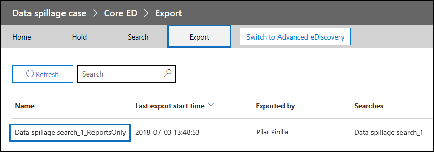

# <a name="ediscovery-solution-series-data-spillage-scenario---search-and-purge"></a><span data-ttu-id="53f41-103">电子数据展示解决方案系列: Data 外泄方案-搜索和清除</span><span class="sxs-lookup"><span data-stu-id="53f41-103">eDiscovery solution series: Data spillage scenario - Search and purge</span></span>

 <span data-ttu-id="53f41-p101">**什么是数据外泄, 为什么要关注？** 数据外泄是将机密文档发布到不受信任的环境时。检测到 data 外泄事件时, 务必要快速评估外泄的大小和位置, 检查其周围的用户活动, 然后从系统中永久清除溢出的数据。</span><span class="sxs-lookup"><span data-stu-id="53f41-p101">**What is data spillage and why should you care?** Data spillage is when a confidential document is released into an untrusted environment. When a data spillage incident is detected, it's important to quickly assess the size and locations of the spillage, examine user activities around it,  and then permanently purge the spilled data from the system.</span></span> 
  
## <a name="data-spillage-scenario"></a><span data-ttu-id="53f41-107">Data 外泄方案</span><span class="sxs-lookup"><span data-stu-id="53f41-107">Data spillage scenario</span></span>

<span data-ttu-id="53f41-p102">你是 Contoso 的潜在客户信息安全官员。您会收到一种数据外泄情况, 其中员工在不知情的情况下通过电子邮件与多个人共享高度机密的文档。您希望快速评估在内部和外部接收此文档的用户。确定后, 您想要与其他调查人员共享案例发现以进行审核, 然后永久删除 Office 365 中的数据。调查完成后, 您需要生成一个报告, 其中包含永久删除的证据和其他案例的详细信息, 以供将来参考。</span><span class="sxs-lookup"><span data-stu-id="53f41-p102">You’re a lead information security officer at Contoso. You are informed of a data spillage situation where an employee unknowingly shared a highly confidential document with multiple people through email. You want to quickly assess who received this document internally and externally. Once identified, you would like to share case findings with other investigators to review, and then permanently remove the data from Office 365. After the investigation is complete, you want to generate a report with the evidence of permanent removal and other case details for any future reference.</span></span>
  
### <a name="scope-of-this-article"></a><span data-ttu-id="53f41-113">本文的范围</span><span class="sxs-lookup"><span data-stu-id="53f41-113">Scope of this article</span></span>

<span data-ttu-id="53f41-p103">本文档提供了有关如何从 Office 365 中永久删除邮件以使其不可访问或可恢复的说明的列表。若要在已删除项目的保留期过期之前删除邮件并使其可恢复, 请参阅[在 Office 365 组织中搜索和删除电子邮件](search-for-and-delete-messages-in-your-organization.md)。</span><span class="sxs-lookup"><span data-stu-id="53f41-p103">This document provides a list of instructions on how to permanently remove a message from Office 365 so that it's not accessible or recoverable. To delete a message and make it recoverable until the deleted item retention period expires, see [Search for and delete email messages in your Office 365 organization](search-for-and-delete-messages-in-your-organization.md).</span></span>
  
## <a name="workflow-for-managing-data-spillage-incidents"></a><span data-ttu-id="53f41-116">用于管理数据外泄事件的工作流</span><span class="sxs-lookup"><span data-stu-id="53f41-116">Workflow for managing data spillage incidents</span></span>

<span data-ttu-id="53f41-117">下面介绍了如何管理数据外泄事件:</span><span class="sxs-lookup"><span data-stu-id="53f41-117">Here's a how to manage a data spillage incident:</span></span>


  
[<span data-ttu-id="53f41-119">Optional第1步: 管理可访问事例和设置合规性边界的人士</span><span class="sxs-lookup"><span data-stu-id="53f41-119">(Optional) Step 1: Manage who can access the case and set compliance boundaries</span></span>](#optional-step-1-manage-who-can-access-the-case-and-set-compliance-boundaries)<br/>
[<span data-ttu-id="53f41-120">步骤 2: 创建电子数据展示事例</span><span class="sxs-lookup"><span data-stu-id="53f41-120">Step 2: Create an eDiscovery case</span></span>](#step-2-create-an-ediscovery-case)<br/>
[<span data-ttu-id="53f41-121">步骤 3: 搜索溢出的数据</span><span class="sxs-lookup"><span data-stu-id="53f41-121">Step 3: Search for the spilled data</span></span>](#step-3-search-for-the-spilled-data)<br/>
[<span data-ttu-id="53f41-122">步骤 4: 查看和验证案例发现</span><span class="sxs-lookup"><span data-stu-id="53f41-122">Step 4: Review and validate case findings</span></span>](#step-4-review-and-validate-case-findings)<br/>
[<span data-ttu-id="53f41-123">步骤 5: 使用邮件跟踪日志检查溢出数据的共享方式</span><span class="sxs-lookup"><span data-stu-id="53f41-123">Step 5: Use message trace log to check how spilled data was shared</span></span>](#step-5-use-message-trace-log-to-check-how-spilled-data-was-shared)<br/>
[<span data-ttu-id="53f41-124">步骤 6: 准备邮箱</span><span class="sxs-lookup"><span data-stu-id="53f41-124">Step 6: Prepare the mailboxes</span></span>](#step-6-prepare-the-mailboxes)<br/>
[<span data-ttu-id="53f41-125">步骤 7: 永久删除溢出的数据</span><span class="sxs-lookup"><span data-stu-id="53f41-125">Step 7: Permanently delete the spilled data</span></span>](#step-7-permanently-delete-the-spilled-data)<br/>
[<span data-ttu-id="53f41-126">步骤 8: 验证、提供删除证明和审核</span><span class="sxs-lookup"><span data-stu-id="53f41-126">Step 8: Verify, provide a proof of deletion, and audit</span></span>](#step-8-verify-provide-a-proof-of-deletion-and-audit)<br/>

## <a name="things-to-know-before-you-start"></a><span data-ttu-id="53f41-127">开始之前需要了解的事项</span><span class="sxs-lookup"><span data-stu-id="53f41-127">Things to know before you start</span></span>

- <span data-ttu-id="53f41-p104">当邮箱处于保留状态时, 已删除邮件将保留在 "可恢复的项目" 文件夹中, 直到保留期过期或释放保留期。[步骤 6](#step-6-prepare-the-mailboxes)介绍了如何从邮箱中删除保留。在删除保留之前, 请与您的记录管理或法律部门确认。您的组织可能有定义邮箱处于保留状态或 data 外泄事件是否优先的策略。</span><span class="sxs-lookup"><span data-stu-id="53f41-p104">When a mailbox is on hold, a deleted message remains in the Recoverable Items folder until the retention period expires or the hold is released. [Step 6](#step-6-prepare-the-mailboxes) describes how to remove hold from the mailboxes. Check with your records management or legal departments before removing the hold. Your organization might have a policy that defines whether a mailbox on hold or a data spillage incident takes priority.</span></span> 
    
- <span data-ttu-id="53f41-p105">若要控制数据外泄调查人员可以搜索和管理可访问该案例的用户邮箱, 您可以设置合规性边界并创建自定义角色组, 如[步骤 1](#optional-step-1-manage-who-can-access-the-case-and-set-compliance-boundaries)中所述。若要执行此操作, 您必须是 "组织管理" 角色组的成员, 或分配有角色管理角色。如果您或您的组织中的管理员已设置了合规性边界, 则可以跳过步骤1。</span><span class="sxs-lookup"><span data-stu-id="53f41-p105">To control which user mailboxes an data spillage investigator can search and manage who can access the case, you can set up compliance boundaries and create a custom role group, which is described in [Step 1](#optional-step-1-manage-who-can-access-the-case-and-set-compliance-boundaries). To do this, you have to be a member of the Organization Management role group or be assigned the role management role. If you or in administrator in your organization has already set compliance boundaries, you can skip Step 1.</span></span>
    
- <span data-ttu-id="53f41-p106">若要创建案例, 您必须是电子数据展示管理器角色组的成员, 或者是分配有案例管理角色的自定义角色组的成员。如果你不是成员, 请让 Office 365 管理员[将你添加到电子数据展示管理器角色组](assign-ediscovery-permissions.md)。</span><span class="sxs-lookup"><span data-stu-id="53f41-p106">To create a case, you must be a member of the eDiscovery Manager role group or be a member of a custom role group that's assigned the Case Management role. If you're not a member, ask an Office 365 administrator to [add you to the eDiscovery manager role group](assign-ediscovery-permissions.md).</span></span>
    
- <span data-ttu-id="53f41-p107">若要删除溢出组织中的数据, 需要使用 Exchange Online PowerShell 中的[搜索-邮箱-DeleteContent](https://docs.microsoft.com/powershell/module/exchange/mailboxes/Search-Mailbox?view=exchange-ps)命令。此外, 若要使用*DeleteContent*参数, 您还必须是 Exchange Online 中分配有邮箱导入导出角色的角色组的成员。请参阅[管理角色组](https://technet.microsoft.com/library/jj657480%28v=exchg.150%29.aspx)中的 "向角色组添加角色" 部分。</span><span class="sxs-lookup"><span data-stu-id="53f41-p107">To delete data that's spilled into your organization, you need to use the [Search-Mailbox -DeleteContent](https://docs.microsoft.com/powershell/module/exchange/mailboxes/Search-Mailbox?view=exchange-ps) command in Exchange Online PowerShell. Additionally, to use the  *DeleteContent* parameter, you also have to be a member of a role group in Exchange Online that's assigned the Mailbox Import Export role. See the "Add a role to a role group" section in [Manage role groups](https://technet.microsoft.com/library/jj657480%28v=exchg.150%29.aspx).</span></span>
    
- <span data-ttu-id="53f41-p108">若要在步骤8中搜索 Office 365 审核日志电子数据展示活动, 必须为您的组织启用审核。您可以搜索在过去的90天内执行的活动。若要了解有关如何启用和使用审核的详细信息, 请参阅步骤8中的 "[审核数据外泄调查过程](#auditing-the-data-spillage-investigation-process)" 一节。</span><span class="sxs-lookup"><span data-stu-id="53f41-p108">To search the Office 365 audit log eDiscovery activities in Step 8, auditing must be turned on for your organization. You can search for activities that were performed within the last 90 days. To learn more about how to enable and use auditing, see the [Auditing the data spillage investigation process](#auditing-the-data-spillage-investigation-process) section in Step 8.</span></span> 
    
## <a name="optional-step-1-manage-who-can-access-the-case-and-set-compliance-boundaries"></a><span data-ttu-id="53f41-143">Optional第1步: 管理可访问事例和设置合规性边界的人士</span><span class="sxs-lookup"><span data-stu-id="53f41-143">(Optional) Step 1: Manage who can access the case and set compliance boundaries</span></span>

<span data-ttu-id="53f41-p109">根据您的组织实践, 您需要控制谁可以访问用于调查 data 外泄事件和设置合规性边界的电子数据展示事例。执行此操作最简单的方法是将调查人员添加为 Office 365 Security & 合规中心中现有角色组的成员, 然后将该角色组添加为电子数据展示事例的成员。有关内置电子数据展示角色组以及如何将成员添加到电子数据展示事例的信息, 请参阅[在 Office 365 安全&amp;合规中心中分配电子数据展示权限](assign-ediscovery-permissions.md)。</span><span class="sxs-lookup"><span data-stu-id="53f41-p109">Depending on your organizational practice, you need to control who can access the eDiscovery case used to investigate a data spillage incident and set up compliance boundaries. The easiest way to do this is to add investigators as members of an existing role group in the Office 365 Security & Compliance Center and then add the role group as a member of the eDiscovery case. For information about the built-in eDiscovery role groups and how to add members to an eDiscovery case, see [Assign eDiscovery permissions in the Office 365 Security &amp; Compliance Center](assign-ediscovery-permissions.md).</span></span>
  
<span data-ttu-id="53f41-p110">您还可以创建与您的组织需求相符的新角色组。例如, 您可能希望组织中的一组数据外泄调查人员访问所有数据外泄案例并对其进行协作。若要执行此操作, 可以创建 "Data 外泄调查者" 角色组, 分配适当的角色 (导出、RMS 解密、审阅、预览、合规性搜索和事例管理), 将数据外泄调查人员添加到角色组, 然后添加作为数据外泄电子数据展示事例的成员的角色组。有关如何执行此操作的详细说明, 请参阅为[Office 365 中的电子数据展示调查设置合规性边界](set-up-compliance-boundaries.md)。</span><span class="sxs-lookup"><span data-stu-id="53f41-p110">You can also create a new role group that aligns with your organizational needs. For example, you might want a group of data spillage investigators in the organization to access and collaborate on all data spillage cases. You can do this by creating a "Data Spillage Investigator" role group, assigning the appropriate roles (Export, RMS Decrypt, Review, Preview, Compliance Search, and Case Management), adding the data spillage investigators to the role group, and then adding the role group as a member of the data spillage eDiscovery case. See [Set up compliance boundaries for eDiscovery investigations in Office 365](set-up-compliance-boundaries.md) for detailed instructions on how to do this.</span></span> 
  
## <a name="step-2-create-an-ediscovery-case"></a><span data-ttu-id="53f41-151">步骤 2: 创建电子数据展示事例</span><span class="sxs-lookup"><span data-stu-id="53f41-151">Step 2: Create an eDiscovery case</span></span>

<span data-ttu-id="53f41-p111">电子数据展示案例提供了一种有效的方法来管理数据外泄调查。您可以将成员添加到您在步骤1中创建的角色组, 将角色组添加为新的电子数据展示事例的成员, 执行迭代搜索以查找溢出的数据、将报告导出到共享、跟踪该事例的状态, 然后返回 c 的详细信息。如果需要, 则为 ase。考虑为数据外泄事件使用的电子数据展示事例建立命名约定, 并在事例名称和说明中提供尽可能多的信息, 以便在将来必要时可以找到并参考。</span><span class="sxs-lookup"><span data-stu-id="53f41-p111">An eDiscovery case provides an effective way to manage your data spillage investigation. You can add members to the role group that you created in Step 1, add the role group as a member of new a eDiscovery case, perform iterative searches to find the spilled data, export a report to share, track the status of the case, and then refer back to the details of the case if needed. Consider establishing a naming convention for eDiscovery cases used for data spillage incidents, and provide as much information as you can in the case name and description so you can locate and refer to in the future if necessary.</span></span>
  
<span data-ttu-id="53f41-p112">若要创建新的案例, 可以使用安全&amp;合规性中心中的电子数据展示。请参阅[Office 365 Security & 合规中心中的电子数据展示案例](ediscovery-cases.md#step-2-create-a-new-case)中的 "创建新事例"。</span><span class="sxs-lookup"><span data-stu-id="53f41-p112">To create a new case, you can use eDiscovery in the Security &amp; Compliance Center. See "Create a new case" in [eDiscovery Cases in the Office 365 Security & Compliance Center](ediscovery-cases.md#step-2-create-a-new-case).</span></span>
  
## <a name="step-3-search-for-the-spilled-data"></a><span data-ttu-id="53f41-157">步骤 3: 搜索溢出的数据</span><span class="sxs-lookup"><span data-stu-id="53f41-157">Step 3: Search for the spilled data</span></span>

<span data-ttu-id="53f41-p113">现在, 您已经创建了一个事例和托管访问, 您可以使用这种情况进行反复搜索, 以查找溢出的数据, 并识别包含溢出数据的邮箱。您将使用相同的搜索查询来查找在[步骤 7](#step-7-permanently-delete-the-spilled-data)中删除这些相同邮件的电子邮件。</span><span class="sxs-lookup"><span data-stu-id="53f41-p113">Now that you've created a case and managed access, you can use the case to iteratively search to find the spilled data and identify the mailboxes that contain the spilled data. You will use the same search query that you used to find the email messages to delete those same messages in [Step 7](#step-7-permanently-delete-the-spilled-data).</span></span>
  
<span data-ttu-id="53f41-160">若要创建与电子数据展示事例相关联的内容搜索, 请参阅[Office 365 Security & 合规中心中的](ediscovery-cases.md#step-5-create-and-run-a-content-search-associated-with-a-case)"创建和运行与事例关联的内容搜索"。</span><span class="sxs-lookup"><span data-stu-id="53f41-160">To create a content searches associated with an eDiscovery case, see "Create and run a Content Search associated with a case" in [eDiscovery Cases in the Office 365 Security & Compliance Center](ediscovery-cases.md#step-5-create-and-run-a-content-search-associated-with-a-case).</span></span>
  
 <span data-ttu-id="53f41-p114">**重要说明:** 您在搜索查询中使用的关键字可能包含要搜索的实际溢出数据。例如, 如果您搜索包含社会保险号码的文档, 并将其用作搜索关键字, 则必须随后删除该查询以避免进一步外泄。请参阅在步骤8中[删除搜索查询](#deleting-the-search-query)。</span><span class="sxs-lookup"><span data-stu-id="53f41-p114">**Important:** The keywords that you use in the search query may contain the actual spilled data that you're searching for. For example, if you searching for documents containing a social security number and you use the it as search keyword, you must delete the query afterwards to avoid further spillage. See [Deleting the search query](#deleting-the-search-query) in Step 8.</span></span> 
  
## <a name="step-4-review-and-validate-case-findings"></a><span data-ttu-id="53f41-164">步骤 4: 查看和验证案例发现</span><span class="sxs-lookup"><span data-stu-id="53f41-164">Step 4: Review and validate case findings</span></span>

<span data-ttu-id="53f41-p115">创建内容搜索后, 需要查看并验证搜索结果, 并验证它们是否仅包含必须删除的电子邮件。在内容搜索中, 可以预览1000电子邮件的随机采样, 而无需导出搜索结果以避免进一步的数据外泄。您可以阅读有关[Office 365 安全&amp;合规性中心中的内容搜索限制](limits-for-content-search.md)的预览限制的详细信息。</span><span class="sxs-lookup"><span data-stu-id="53f41-p115">After you create a content search, you need to review and validate that the search results and verify that they consist only of the email messages that must be deleted. In a content search, you can preview a random sampling of 1,000 email messages without exporting the search results to avoid further data spillage. You can read more about the preview limitations at [Limits for Content Search in the Office 365 Security &amp; Compliance Center](limits-for-content-search.md).</span></span>
  
<span data-ttu-id="53f41-p116">如果要查看的邮箱超过1000个或多于100个电子邮件, 可以使用其他关键字或条件 (如日期范围或发件人/收件人) 并查看每个搜索的结果, 将初始搜索划分为多个搜索。零售.请务必记下在[步骤 7](#step-7-permanently-delete-the-spilled-data)中删除邮件时要使用的所有搜索查询。</span><span class="sxs-lookup"><span data-stu-id="53f41-p116">If you have more than 1,000 mailboxes or more than 100 email messages per mailbox to review, you can divide the initial search into multiple searches by using additional keywords or conditions such as date range or sender/recipient and review the results of each search individually. Make sure to note down all search queries to use when you delete messages in [Step 7](#step-7-permanently-delete-the-spilled-data).</span></span>

<span data-ttu-id="53f41-p117">如果为保管人或最终用户分配了 Office 36 E5 许可证, 则可以使用 office 365 高级电子数据展示一次性检查10000个搜索结果。如果要查看的电子邮件数超过10000个, 可以按日期范围划分搜索查询, 并在搜索结果按日期排序时分别查看每个结果。在高级电子数据展示中, 可以使用预览面板中的 "**标签为**" 功能标记搜索结果, 并按标记的标记筛选搜索结果。当您与辅助审阅者进行协作时, 这将非常有用。通过使用高级电子数据展示中的其他分析工具 (如光学字符识别、电子邮件线程和预测编码), 您可以快速处理和查看成千上万封邮件, 并标记它们以供进一步审阅。请参阅[Office 365 高级电子数据展示的快速设置](quick-setup-for-advanced-ediscovery.md)。</span><span class="sxs-lookup"><span data-stu-id="53f41-p117">If a custodian or end user is assigned an Office 36 E5 license, you can examine up to 10,000 search results at once using Office 365 Advanced eDiscovery. If there are more than 10,000 email messages to review, you can divide the search query by date range and review each result individually as search results are sorted by date. In Advanced eDiscovery, you can tag search results using the **Label as** feature in the preview panel and filter the search result by the tag you labeled. This is helpful when you collaborate with a secondary reviewer. By using additional analytics tools in Advanced eDiscovery, such as optical character recognition, email threading, and predictive coding, you can quickly process and review thousands of messages and tag them for further review. See [Quick setup for Office 365 Advanced eDiscovery](quick-setup-for-advanced-ediscovery.md).</span></span>

<span data-ttu-id="53f41-p118">当您找到包含溢出数据的电子邮件时, 请检查邮件的收件人以确定它是否是在外部共享的。若要进一步跟踪邮件, 可以收集发件人信息和日期范围, 以便您可以使用[步骤 5](#step-5-use-message-trace-log-to-check-how-spilled-data-was-shared)中所述的邮件跟踪日志。</span><span class="sxs-lookup"><span data-stu-id="53f41-p118">When you find an email message that contains spilled data, check the recipients of the message to determine if it was shared externally. To further trace an message, you can collect sender information and date range so you can use the message trace logs, which is described in [Step 5](#step-5-use-message-trace-log-to-check-how-spilled-data-was-shared).</span></span>

<span data-ttu-id="53f41-p119">Afer 您验证了搜索结果, 您可能需要与其他人共享你的发现以进行辅助评审。在步骤1中分配案例的人员可以在电子数据展示和高级电子数据展示和批准案例发现中查看事例内容。您还可以在不导出实际内容的情况下生成报告。您还可以使用此报告作为删除证明, 如[步骤 8](#step-8-verify-provide-a-proof-of-deletion-and-audit)中所述。</span><span class="sxs-lookup"><span data-stu-id="53f41-p119">Afer you verified the search results, you may want to share your findings with others for a secondary review. People who you assigned to the case in Step 1 can review the case content in both eDiscovery and Advanced eDiscovery and approve case findings. You can also generate a report without exporting the actual content. You can also use this same report as a proof of deletion, which is described in [Step 8](#step-8-verify-provide-a-proof-of-deletion-and-audit).</span></span>
  
 <span data-ttu-id="53f41-182">**生成统计报告:**</span><span class="sxs-lookup"><span data-stu-id="53f41-182">**To generate a statistical report:**</span></span>
  
1. <span data-ttu-id="53f41-183">转到电子数据展示事例中的 "**搜索**" 页, 然后单击要为其生成报告的搜索。</span><span class="sxs-lookup"><span data-stu-id="53f41-183">Go to the **Search** page in the eDiscovery case, and click the search that you want to generate a report for.</span></span> 
    
2. <span data-ttu-id="53f41-184">在弹出页面上, 单击 "**更多 > 导出报告**"。</span><span class="sxs-lookup"><span data-stu-id="53f41-184">On the flyout page, click **More > Export report**.</span></span>
 
      <span data-ttu-id="53f41-185">将显示 "导出报告" 页。</span><span class="sxs-lookup"><span data-stu-id="53f41-185">The Export report page is displayed.</span></span>

    
    
3. <span data-ttu-id="53f41-187">选择**所有项目, 包括不可识别格式的项目、加密的项目或未针对其他原因编制索引的项目**, 然后单击 "**生成报告**"。</span><span class="sxs-lookup"><span data-stu-id="53f41-187">Select **All items, including ones that have unrecognized format, are encrypted, or weren’t indexed for other reasons** and then click **Generate report**.</span></span>

4. <span data-ttu-id="53f41-p120">在电子数据展示事例中, 单击 "**导出**" 以显示导出作业的列表。您可能需要单击 "**刷新**" 以更新列表, 以显示刚创建的导出作业。</span><span class="sxs-lookup"><span data-stu-id="53f41-p120">In the eDiscovery case, click **Export** to display the list of export jobs. You may have to click **Refresh** to update the list to display the export job you just created.</span></span>

5. <span data-ttu-id="53f41-190">单击 "导出" 作业, 然后单击弹出页面上的 "**下载**报告"。</span><span class="sxs-lookup"><span data-stu-id="53f41-190">Click the export job, and then click **Download** report on the flyout page.</span></span>
 
    

<span data-ttu-id="53f41-p121">"**导出摘要**" 报告包含找到的位置数以及搜索结果的大小。您可以使用它来与删除后生成的报告进行比较, 并作为删除证明提供。**结果**报告包含搜索结果的更详细摘要, 包括主题、发件人、收件人、电子邮件的阅读时间、日期以及每封邮件的大小。如果此报告中的任何详细信息包含实际溢出的数据, 请务必在调查完成后永久删除结果 .csv 文件。</span><span class="sxs-lookup"><span data-stu-id="53f41-p121">The **Export Summary** report contains the number of locations found with results and the size of the search results. You can use this to compare with the report generated after deletion and provide as a proof of deletion. The **Results** report contains a more detailed summary of the search results, including the subject, sender, recipients, if the email was read, dates, and size of each message. If any of the details in this report contains that actual spilled data, be sure to permanently delete the Results.csv file when the investigation is complete.</span></span>

<span data-ttu-id="53f41-196">有关导出报告的详细信息, 请参阅[导出内容搜索报告](export-a-content-search-report.md)。</span><span class="sxs-lookup"><span data-stu-id="53f41-196">For more information about exporting reports, see [Export a Content Search report](export-a-content-search-report.md).</span></span>
    
## <a name="step-5-use-message-trace-log-to-check-how-spilled-data-was-shared"></a><span data-ttu-id="53f41-197">步骤 5: 使用邮件跟踪日志检查溢出数据的共享方式</span><span class="sxs-lookup"><span data-stu-id="53f41-197">Step 5: Use message trace log to check how spilled data was shared</span></span>

<span data-ttu-id="53f41-p122">若要进一步调查是否已共享带有溢出数据的电子邮件, 您可以选择使用您在步骤4中收集的发件人信息和日期范围信息查询邮件跟踪日志。请注意, 邮件跟踪的保留期为实时数据的30天, 历史数据为90天。</span><span class="sxs-lookup"><span data-stu-id="53f41-p122">To further investigate if email with spilled data was shared, you can optionally query the message trace logs with the sender information and the date range information that you gathered in Step 4. Note that the retention period for message trace is 30 days for real time data and 90 days for historical data.</span></span>
  
<span data-ttu-id="53f41-p123">您可以使用 Security & 合规性中心中的邮件跟踪或在 Exchange Online PowerShell 中使用相应的 cmdlet。需要注意的重要一点是, 邮件跟踪没有提供对返回数据完整性的完全保证。有关使用邮件跟踪的详细信息, 请参阅:</span><span class="sxs-lookup"><span data-stu-id="53f41-p123">You can use Message trace in the Security & Compliance Center or use the corresponding cmdlets in Exchange Online PowerShell. It's important to note that message tracing doesn't offer full guarantees on the completeness of data returned. For more information about using Message trace, see:</span></span> 
  
- [<span data-ttu-id="53f41-203">Office 365 安全&amp;合规中心中的邮件跟踪</span><span class="sxs-lookup"><span data-stu-id="53f41-203">Message trace in the Office 365 Security &amp; Compliance Center</span></span>](https://support.office.com/article/3e64f99d-ac33-4aba-91c5-9cb4ca476803.aspx)
    
- [<span data-ttu-id="53f41-204">Office 365 安全&amp;合规中心中的新邮件跟踪</span><span class="sxs-lookup"><span data-stu-id="53f41-204">New Message Trace in Office 365 Security &amp; Compliance Center</span></span>](https://blogs.technet.microsoft.com/exchange/2018/05/02/new-message-trace-in-office-365-security-compliance-center/)
    
## <a name="step-6-prepare-the-mailboxes"></a><span data-ttu-id="53f41-205">步骤 6: 准备邮箱</span><span class="sxs-lookup"><span data-stu-id="53f41-205">Step 6: Prepare the mailboxes</span></span>

<span data-ttu-id="53f41-p124">在查看并验证搜索结果只包含必须删除的邮件之后, 您需要收集受影响邮箱的电子邮件地址列表, 以便在运行**搜索邮箱-DeleteContent**命令时在步骤7中使用。您可能还必须准备邮箱, 然后才能永久删除电子邮件, 具体取决于是否在包含溢出数据的邮箱上启用单个项目恢复, 或者这些邮箱处于保留状态。</span><span class="sxs-lookup"><span data-stu-id="53f41-p124">After you review and validate that the search results contains only the messages that must be deleted, you need to collect a list of the email addresses of the impacted mailboxes to use in Step 7 when you run the **Search-Mailbox -DeleteContent** command. You may also have to prepare the mailboxes before you can permanently delete email messages depending on whether single item recovery is enabled on the mailboxes that contain the spilled data or if any of those mailboxes are on hold.</span></span>
  
### <a name="get-a-list-of-addresses-of-mailboxes-with-spilled-data"></a><span data-ttu-id="53f41-208">获取带溢出数据的邮箱的地址列表</span><span class="sxs-lookup"><span data-stu-id="53f41-208">Get a list of addresses of mailboxes with spilled data</span></span>

<span data-ttu-id="53f41-209">有两种方法可以收集带有溢出数据的邮箱的电子邮件地址列表。</span><span class="sxs-lookup"><span data-stu-id="53f41-209">There are two ways to collect a list of email addresses of mailboxes with spilled data.</span></span>

<span data-ttu-id="53f41-210">**选项 1: 获取带有溢出数据的邮箱的地址列表**</span><span class="sxs-lookup"><span data-stu-id="53f41-210">**Option 1: Get a list of addresses of mailboxes with spilled data**</span></span>

1. <span data-ttu-id="53f41-211">打开电子数据展示事例, 转到 "**搜索**" 页并选择相应的内容搜索。</span><span class="sxs-lookup"><span data-stu-id="53f41-211">Open the eDiscovery case, go to the **Search** page and select the appropriate content search.</span></span> 
    
2. <span data-ttu-id="53f41-212">在弹出页面上, 单击 "**查看结果**"。</span><span class="sxs-lookup"><span data-stu-id="53f41-212">On the flyout page, click **View results**.</span></span>
    
3. <span data-ttu-id="53f41-213">在 "**单个结果**" 下拉列表中, 单击 "**搜索统计信息**"。</span><span class="sxs-lookup"><span data-stu-id="53f41-213">In the **Individual results** drop down list, click **Search statistics**.</span></span>
    
4. <span data-ttu-id="53f41-214">在 "**类型**" 下拉列表中, 单击 "**顶部位置**"。</span><span class="sxs-lookup"><span data-stu-id="53f41-214">In the **Type** drop down list, click **Top locations**.</span></span>
    
    

    <span data-ttu-id="53f41-p125">将显示包含搜索结果的邮箱的列表。同时显示与搜索查询匹配的每个邮箱中的项目数。</span><span class="sxs-lookup"><span data-stu-id="53f41-p125">A list of mailboxes that contain search results is displayed. The number of items in each mailbox that match the search query is also displayed.</span></span>
    
5. <span data-ttu-id="53f41-218">复制列表中的信息并将其保存到文件中, 或单击 "**下载**" 将信息下载到 CSV 文件中。</span><span class="sxs-lookup"><span data-stu-id="53f41-218">Copy the information in the list and save it to a file or click **Download** to download the information to a CSV file.</span></span> 
    
<span data-ttu-id="53f41-219">**选项 2: 从导出报告中获取邮箱位置**</span><span class="sxs-lookup"><span data-stu-id="53f41-219">**Option 2: Get mailbox locations from the export report**</span></span>

<span data-ttu-id="53f41-p126">打开您在[步骤 4](#step-4-review-and-validate-case-findings)中下载的导出摘要报告。在报告中的第一列中, 每个邮箱的电子邮件地址在 "**位置**" 下列出。</span><span class="sxs-lookup"><span data-stu-id="53f41-p126">Open the Export Summary report that you downloaded in [Step 4](#step-4-review-and-validate-case-findings). In the first column in the report, the email address of each mailbox is listed under **Locations**.</span></span>
  
### <a name="prepare-the-mailboxes-so-you-can-delete-the-spilled-data"></a><span data-ttu-id="53f41-222">准备邮箱, 以便您可以删除溢出的数据</span><span class="sxs-lookup"><span data-stu-id="53f41-222">Prepare the mailboxes so you can delete the spilled data</span></span>

<span data-ttu-id="53f41-p127">如果启用了单个项目恢复或将邮箱置于保留状态, 则将在 "可恢复的项目" 文件夹中保留永久删除的 (清除的) 邮件。因此, 在清除溢出的数据之前, 您需要检查现有的邮箱配置并禁用单个项目恢复, 并删除任何保留或 Office 365 保留策略。请注意, 您可以一次准备一个邮箱, 然后在不同的邮箱上运行相同的命令, 也可以创建一个 PowerShell 脚本来同时准备多个邮箱。</span><span class="sxs-lookup"><span data-stu-id="53f41-p127">If single item recovery is enabled or if a mailbox is placed on hold, a permanently deleted (purged) message will be retained in Recoverable Items folder. So before you can purge spilled data, you need to check the existing mailbox configurations and disable single item recovery and remove any hold or Office 365 retention policy. Keep in mind that you can prepare one mailbox at a time, and then run the same command on different mailboxes or create a PowerShell script to prepare multiple mailboxes at the same time.</span></span>

- <span data-ttu-id="53f41-226">请参阅 "[删除基于云的邮箱的可恢复项目文件夹中的邮件" 文件夹](delete-items-in-the-recoverable-items-folder-of-mailboxes-on-hold.md#step-1-collect-information-about-the-mailbox)中的 "步骤 1: 收集有关邮箱的信息", 了解有关如何检查是否启用了单个项目恢复或者是否将邮箱置于保留状态或分配给了邮箱的说明保留策略。</span><span class="sxs-lookup"><span data-stu-id="53f41-226">See "Step 1: Collect information about the mailbox" in [Delete items in the Recoverable Items folder of cloud-based mailboxes on hold](delete-items-in-the-recoverable-items-folder-of-mailboxes-on-hold.md#step-1-collect-information-about-the-mailbox) for instructions about how to check if single item recovery is enabled or if the mailbox is placed on hold or it's assigned to a retention policy.</span></span> 
    
- <span data-ttu-id="53f41-227">若要了解如何禁用单个项目恢复, 请参阅 "[删除基于云的邮箱的可恢复项目文件夹中的项目](delete-items-in-the-recoverable-items-folder-of-mailboxes-on-hold.md#step-2-prepare-the-mailbox)" 中的 "步骤 2: 准备邮箱"。</span><span class="sxs-lookup"><span data-stu-id="53f41-227">See "Step 2: Prepare the mailbox" in [Delete items in the Recoverable Items folder of cloud-based mailboxes on hold](delete-items-in-the-recoverable-items-folder-of-mailboxes-on-hold.md#step-2-prepare-the-mailbox) for instructions about disabling single item recovery.</span></span> 
    
- <span data-ttu-id="53f41-228">有关如何从邮箱中删除保留策略或保留策略的说明, 请参阅在[保留基于云的邮箱的 "可恢复的项目" 文件夹的 "删除邮件](delete-items-in-the-recoverable-items-folder-of-mailboxes-on-hold.md#step-3-remove-all-holds-from-the-mailbox)" 中的 "删除邮箱中的所有保留"。</span><span class="sxs-lookup"><span data-stu-id="53f41-228">See "Step 3: Remove all holds from the mailbox" in [Delete items in the Recoverable Items folder of cloud-based mailboxes on hold](delete-items-in-the-recoverable-items-folder-of-mailboxes-on-hold.md#step-3-remove-all-holds-from-the-mailbox) for instructions about how to remove a hold or retention policy from a mailbox.</span></span> 

- <span data-ttu-id="53f41-229">请参阅在 "[删除基于云的邮箱的可恢复项目" 文件夹](delete-items-in-the-recoverable-items-folder-of-mailboxes-on-hold.md#step-4-remove-the-delay-hold-from-the-mailbox)中的 "删除项目" 中的 "删除邮箱中的延迟保留" 中的 "删除项目" 中有关删除在删除任何类型的保留后邮箱的延迟保留的说明。</span><span class="sxs-lookup"><span data-stu-id="53f41-229">See "Step 4: Remove the delay hold from the mailbox" in [Delete items in the Recoverable Items folder of cloud-based mailboxes on hold](delete-items-in-the-recoverable-items-folder-of-mailboxes-on-hold.md#step-4-remove-the-delay-hold-from-the-mailbox) for instructions about removing the delay hold that is placed on the mailbox after any type of hold is removed.</span></span>
    
 <span data-ttu-id="53f41-p128">**重要说明:** 在删除保留策略或保留策略之前, 请与您的记录管理或法律部门进行确认。您的组织可能有定义邮箱处于保留状态或 data 外泄事件是否优先的策略。</span><span class="sxs-lookup"><span data-stu-id="53f41-p128">**Important:** Check with your records management or legal departments before removing a hold or retention policy. Your organization may have a policy that defines whether a mailbox on hold or a data spillage incident takes priority.</span></span> 
  
<span data-ttu-id="53f41-p129">确认溢出的数据已永久删除后, 请务必将邮箱还原为以前的配置。请参阅[第7步](#step-7-permanently-delete-the-spilled-data)中的详细信息。</span><span class="sxs-lookup"><span data-stu-id="53f41-p129">Be sure to revert the mailbox to previous configurations after you verify that the spilled data has been permanently deleted. See the details in [Step 7](#step-7-permanently-delete-the-spilled-data).</span></span>

## <a name="step-7-permanently-delete-the-spilled-data"></a><span data-ttu-id="53f41-234">步骤 7: 永久删除溢出的数据</span><span class="sxs-lookup"><span data-stu-id="53f41-234">Step 7: Permanently delete the spilled data</span></span>

<span data-ttu-id="53f41-p130">使用您在步骤6中收集和准备的邮箱位置以及在步骤3中创建并完善的搜索查询中的步骤 3, 以查找包含溢出数据的电子邮件, 您现在可以永久删除溢出的数据。如前所述, 您必须分配有 Exchange Online 中的 "邮箱导入导出" 角色, 才能使用以下过程删除邮件。</span><span class="sxs-lookup"><span data-stu-id="53f41-p130">Using the mailbox locations that you collected and prepared in Step 6 and the search query that was created and refined in Step 3 to find email messages that contain the spilled data, you can now permanently delete the spilled data. As previously explained, you have to be assigned the Mailbox Import Export role in Exchange Online to delete messages using the following procedure.</span></span>
  
1. <span data-ttu-id="53f41-237">[连接到 Exchange Online PowerShell](https://go.microsoft.com/fwlink/?linkid=396554)。</span><span class="sxs-lookup"><span data-stu-id="53f41-237">[Connect to Exchange Online PowerShell](https://go.microsoft.com/fwlink/?linkid=396554).</span></span>
    
2. <span data-ttu-id="53f41-238">运行以下命令：</span><span class="sxs-lookup"><span data-stu-id="53f41-238">Run the following command:</span></span>
    
    ```
    Search-Mailbox -Identity <mailbox identity> -SearchDumpster -DeleteContent $true -SearchQuery <search query>
    ```
  
3. <span data-ttu-id="53f41-239">通过替换 Identity 参数的值, 为包含溢出数据的每个邮箱重新运行上一个命令;例如:</span><span class="sxs-lookup"><span data-stu-id="53f41-239">Re-run the previous command for each mailbox that contains the spilled data, by replacing the value for the Identity parameter; for example:</span></span>

    ```
    Search-Mailbox -Identity sarad@contoso.onmicrosoft.com -SearchQuery <search query> -DeleteContent
    ```

    ```
    Search-Mailbox -Identity janets@contoso.onmicrosoft.com -SearchQuery <search query> -DeleteContent
    ```

   ```
   Search-Mailbox -Identity pilarp@contoso.onmicrosoft.com -SearchQuery <search query> -DeleteContent
   ```
  
<span data-ttu-id="53f41-240">如前所述, 您还可以创建[powershell 脚本](https://docs.microsoft.com/powershell/scripting/powershell-scripting?view=powershell-6)并对邮箱列表运行该脚本, 以便脚本删除每个邮箱中溢出的数据。</span><span class="sxs-lookup"><span data-stu-id="53f41-240">As previously stated, you can also create a [powershell script](https://docs.microsoft.com/powershell/scripting/powershell-scripting?view=powershell-6) and run it against a list of mailboxes so that the script deletes the spilled data in each mailbox.</span></span>
  
## <a name="step-8-verify-provide-a-proof-of-deletion-and-audit"></a><span data-ttu-id="53f41-241">步骤 8: 验证、提供删除证明和审核</span><span class="sxs-lookup"><span data-stu-id="53f41-241">Step 8: Verify, provide a proof of deletion, and audit</span></span>

<span data-ttu-id="53f41-p131">工作流中用于管理数据外泄事件的最后一步是, 通过转到电子数据展示事例并重新运行用于删除数据的相同搜索查询来验证溢出的数据是否已从邮箱中永久删除, 以确认没有结果 are 返回。确认溢出的数据被永久删除后, 您可以导出报告并将其包含 (连同原始报告) 作为删除证明。然后, 你可以[关闭该事例](ediscovery-cases.md#optional-step-9-close-a-case), 如果你将来引用它, 将允许你重新打开它。此外, 还可以将邮箱还原到以前的状态, 删除用于查找溢出数据的搜索查询, 并搜索在管理 data 外泄事件时执行的任务的审核记录。</span><span class="sxs-lookup"><span data-stu-id="53f41-p131">The final step in the workflow to manage a data spillage incident is to verify that the spilled data was permanently removed from the mailbox by going to the eDiscovery case and re-running the same search query that was used to delete that data to confirm that no results are returned. After you confirm the spilled data has been permanently removed, you can export a report and include it (along with the original report) as a proof of deletion. Then you can [close the case](ediscovery-cases.md#optional-step-9-close-a-case), which will allow you to re-open it if you have refer to it in the future. Additionally, you can also revert mailboxes to their previous state, delete the search query used to find the spilled data, and search for auditing records of tasks performed when managing the data spillage incident.</span></span> 
  
### <a name="reverting-the-mailboxes-to-their-previous-state"></a><span data-ttu-id="53f41-246">将邮箱还原到其以前的状态</span><span class="sxs-lookup"><span data-stu-id="53f41-246">Reverting the mailboxes to their previous state</span></span>

<span data-ttu-id="53f41-p132">如果在步骤6中更改了任何邮箱配置, 以在溢出的数据被删除之前准备邮箱, 则需要将其还原到以前的状态。请参阅在[保留的基于云的邮箱的 "可恢复的项目" 文件夹中的 "删除项目](delete-items-in-the-recoverable-items-folder-of-mailboxes-on-hold.md#step-6-revert-the-mailbox-to-its-previous-state)" 中的 "步骤 6: 将邮箱还原为以前的状态"。</span><span class="sxs-lookup"><span data-stu-id="53f41-p132">If you changed any mailbox configuration in Step 6 to prepare the mailboxes before the spilled data was deleted, you will need to revert them to their previous state. See "Step 6: Revert the mailbox to its previous state" in [Delete items in the Recoverable Items folder of cloud-based mailboxes on hold](delete-items-in-the-recoverable-items-folder-of-mailboxes-on-hold.md#step-6-revert-the-mailbox-to-its-previous-state).</span></span>
  
### <a name="deleting-the-search-query"></a><span data-ttu-id="53f41-249">删除搜索查询</span><span class="sxs-lookup"><span data-stu-id="53f41-249">Deleting the search query</span></span>

<span data-ttu-id="53f41-250">如果您在步骤3中创建和使用的搜索查询中的关键字包含一些实际溢出的数据, 则应删除搜索查询以防止进一步的数据外泄。</span><span class="sxs-lookup"><span data-stu-id="53f41-250">If the keywords in the search query that you created and used in Step 3 contains some of all of the actual spilled data, you should delete the search query to prevent further data spillage.</span></span>
  
1. <span data-ttu-id="53f41-251">在安全 & 合规性中心中, 打开电子数据展示事例, 转到 "**搜索**" 页, 然后选择适当的内容搜索。</span><span class="sxs-lookup"><span data-stu-id="53f41-251">In the Security & Compliance Center, open the eDiscovery case, go to the **Search** page, and select the appropriate content search.</span></span>
    
2. <span data-ttu-id="53f41-252">在弹出页面上, 单击 "**删除**"。</span><span class="sxs-lookup"><span data-stu-id="53f41-252">On the flyout page, click **Delete**.</span></span>

    
    
### <a name="auditing-the-data-spillage-investigation-process"></a><span data-ttu-id="53f41-254">审核数据外泄调查过程</span><span class="sxs-lookup"><span data-stu-id="53f41-254">Auditing the data spillage investigation process</span></span>

<span data-ttu-id="53f41-p133">您可以在 Office 365 审核日志中搜索在调查过程中执行的电子数据展示活动。您还可以搜索审核日志, 以返回运行**搜索邮箱-DeleteContent**命令删除溢出的数据时创建的审核记录。有关详细信息, 请参阅:</span><span class="sxs-lookup"><span data-stu-id="53f41-p133">You can search the Office 365 audit log for the eDiscovery activities that were performed during the investigation. You can also search the audit log to return the audit records that were created when you ran the **Search-Mailbox -DeleteContent** command to delete the spilled data. For more information, see:</span></span>

- [<span data-ttu-id="53f41-258">在 Office 365 安全&amp;合规中心搜索审核日志</span><span class="sxs-lookup"><span data-stu-id="53f41-258">Search the audit log in the Office 365 Security &amp; Compliance Center</span></span>](search-the-audit-log-in-security-and-compliance.md)

- [<span data-ttu-id="53f41-259">在 Office 365 审核日志中搜索电子数据展示活动</span><span class="sxs-lookup"><span data-stu-id="53f41-259">Search for eDiscovery activities in the Office 365 audit log</span></span>](search-for-ediscovery-activities-in-the-audit-log.md)

- <span data-ttu-id="53f41-260">有关如何在 Exchange Online 中搜索与运行 cmdlet 相关的审核记录的指南, 请参阅在[Office 365 安全 & 合规中心中搜索审核日志中](search-the-audit-log-in-security-and-compliance.md#audited-activities)的 "已审核的活动-Exchange 管理员审核日志" 部分。</span><span class="sxs-lookup"><span data-stu-id="53f41-260">See the "Audited activities - Exchange admin audit log " section in [Search the audit log in the Office 365 Security & Compliance Center](search-the-audit-log-in-security-and-compliance.md#audited-activities) for guidance about how to search for audit records related to running cmdlets in Exchange Online.</span></span>
  

