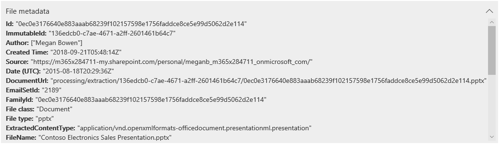

# 查看证据中的数据Review the data in evidence

数据调查中的证据集中的数据是您收集并添加到证据集的搜索结果的快照。The data in an evidence set in a data investigation is a snapshot of the search results that you collected and added to the evidence set. 将搜索结果添加到证据时, 将触发一个过程, 以从搜索返回的项目中提取文件、元数据和文本。When you add search results to evidence, a process is triggered to extract files, metadata, and text from the items returned by the search. 然后, "数据调查 (预览)" 工具将生成所有数据的新索引 (通过名为 "*高级索引*" 的过程), 并将其添加到 "**证据**" 选项卡上的证据集。Then the Data Investigations (Preview) tool then builds a new index (by a process called *Advanced indexing*) of all the data and adds to an evidence set on the **Evidence** tab. 

对于对时间敏感的调查, 这使您可以通过删除原始数据源中的实际溢出或恶意数据来快速地包含环境, 同时允许您调查重新创建的证据隔离环境, 在这种情况下是复制到证据集的数据。For time-sensitive investigations, this allows you to quickly contain the environment by deleting the actual spilled or malicious data located in the at original data source, while at the same time allowing you to investigate the re-created evidence in a quarantined environment, which in this case is the data copied to the evidence set). 收集证据并将其添加到证据集后, 可以查看以本机格式、文本格式或可用于对文档添加批注和密文的格式的文档中的单个文档。After the evidence is collected and added to the evidence set, you can review individual documents in their native format, text format, or a near-native format that you can use to annotate and redact documents. 此外, 还可以运行查询以缩小时间范围、文件类型、数据所有者和其他许多属性和搜索条件的数据集。Additionally, you can run queries to narrow the data set by time range, file types, data owners, and many other properties and search conditions. 例如, 通过使用作者、发件人或收件人条件, 可以快速确定参与事件的人员, 以及您的组织中的任何数据是否已与外部用户共享。For example, by using the Author, Sender, or Recipient conditions, you can quickly identify the people are involved in the incident and if any data from your organization has been shared with external users. 有关在证据集中搜索数据的详细信息, 请参阅[在证据中查询数据](evidence-query.md)。For more information about searching through data in an evidence set, see [Query the data in evidence](evidence-query.md).

若要对文档进行分组并获取更多的帮助, 请选择 "**证据**" 选项卡上的证据集, 然后单击 "**管理证据**"。To group documents and get more assistance for your review, select an evidence set on the **Evidence** tab, and then click **Manage evidence**. 在**分析**磁贴中, 单击**整个集的 "重新生成分析**"。In the **Analytics** tile, click **Rebuild analytics for the whole set**. 这将运行高级分析, 例如重复检测、电子邮件线程和主题分析。This will run advanced analytics such as duplicate detection, email threading, and theme analysis. 之后, 你可以查看数据的一般主题, 还可以通过电子邮件线索 (临近重复项) 和确切的重复项组织文档, 以帮助你进行调查。Afterwards, you can see the general themes of the data and also organize documents by email threads, near duplicates, and exact duplicates to help your investigation. 有关详细信息, 请参阅[运行分析以加快检查速度](run-analytics-to-investigate-faster.md)。For more information, see [Run analytics to investigate faster](run-analytics-to-investigate-faster.md).

## 查看证据中的文档View documents in evidence

数据调查 (预览) 允许您在多个不同的查看器中显示内容, 每个查看者具有不同的用途。Data Investigations (Preview) allows you to display content in several different viewers, with each viewer having a different purpose. 这些查看器为:These viewers are:

- 文件元数据File metadata
- 本机视图Native view
- 文本视图Text view
- 批注视图Annotate view

若要访问这些查看器中的任何查看者, 只需在证据集中选择文档即可。To access any of these viewers, just select a document in an evidence set.

## 文件元数据File metadata

此视图显示与所选文档相关联的各种元数据属性。This view displays various metadata properties associated with the selected document. 您可以通过单击 "**文件元数据**" 来打开和关闭此视图。You can toggle this view on and off by clicking **File metadata**. 在审阅文档时, 您可以查看文件元数据, 但在不同的查看器之间仍然发生变化。When reviewing a document, you can view the file metadata and still change between the different viewers.

下面的示例展示了文档的文件元数据。Here's an example of the file metadata for a document. 有关元数据字段的详细信息, 请参阅 "[数据调查 (预览) 中的文档元数据字段](document-metadata-fields.md)"。For more information about the metadata fields, see [Document metadata fields in Data Investigations (Preview)](document-metadata-fields.md).

## 本机视图Native view

本机查看器以文档的本机格式显示最准确的文档视图。The Native viewer displays the most accurate view of a document in it's native format. 数以百计的文件类型支持本机视图, 这是为了在可能的 truest 本机体验中显示文档。Native view is supported for hundreds of file types and is meant to display documents in the truest native experience possible. 对于 Microsoft Office 文件, 本机查看器使用 Office Online。For Microsoft Office files, the Native viewer uses Office Online. 这使您可以在 Excel 中查看不同的 Office 文档、公式和隐藏的行/列中的注释, 以及 PowerPoint 中的备注视图等内容。This allows you to view content such as comments in different Office documents, formulas and hidden rows/columns in Excel, and the Notes view in PowerPoint.

## 文本视图Text view

文本查看器提供了文件中提取的文本的视图。The Text viewer provides a view of the extracted text of a file. 它将忽略任何嵌入的图像和格式, 但如果您尝试快速查看和理解文档中的内容, 则此视图非常有用。It ignores any embedded images and formatting, but this view is very useful if you're trying to quickly review and understand the content in a document. 文本视图还包含以下功能:Text view also includes these features:

  - 行计数器, 使您可以更轻松地引用文档的特定部分。A line counter, which makes it easier to reference specific portions of a document.

  - 突出显示文档中和滚动条中的术语的搜索词突出显示Search hit highlighting that highlight terms in the document as well as on the scrollbar

  - 比较视图提供了一个比较视图, 可在使用**临近的重复**面板查看文档时突出显示文本差异。A diff view provides a comparison view that highlights the text differences when viewing documents using the **Near duplicates** panel.

**文本和滚动条中的行计数器和搜索词突出显示示例****Example of line counter and search hit highlighting in text and scrollbar**

**比较视图示例****Example of the diff view**

## 批注视图Annotate view

"批注" 视图提供允许您在审阅过程中对文档应用标记的功能;这包括以下工具:The Annotate view provides features that allow you to apply markup on a document during the review process; this  includes these tools:

  - **区域密文**–您可以在文档中绘制一个不透明的框来隐藏敏感内容。**Area redactions** – You can draw an opaque box on the document that hides sensitive content.

  - **铅笔**–您可以自由地在文档上绘图, 以引起关注内容的某些部分。**Pencil** – You can free-hand draw on a document to bring attention to certain portions of the content

  - **选择批注**-您可以选择和删除文档中的批注。**Select annotations** - You can select and delete annotations in a document.

  - **切换批注透明度**–您可以切换批注的透明度 (在不透明和半透明之间), 以便您可以查看批注后面的内容。**Toggle annotation transparency** – You can toggle the transparency of annotations (between opaque and semi-transparent)so you can view the content behind the annotation. 这包括切换铅笔批注和密文的透明度。This includes toggling the transparency of pencil annotations and redactions.

"批注" 视图还提供以下导航功能:The Annotate view also provides the following navigation functionality:

  - **上一页**、**下一页**, 然后**转到**用于多页文档的页面导航控件。**Previous page**, **Next page**, and **Go to page** - Navigation controls to use for multi-page documents.

  - **缩放**–以批注视图增大或减小文档的大小。**Zoom** – Increases or decreases the size of documents in Annotate view.

  - **旋转**–顺时针旋转文档。**Rotate** – Rotate documents clockwise.

  - **搜索**–在文档中搜索关键字, 然后使用 "上一个" 和 "下一个" 控件查看文档中的命中数 (突出显示)。**Search** – Search for keywords in a document, and then use Previous and Next controls to view the hits (which are highlighted) within the document.

**批注视图示例****Example of Annotate view**

> [!NOTE]
> 批注应用于已添加到证据集的文档副本。Annotations are applied to a copy of the document that was added to the evidence set. live service 中的原始文档未进行批注。The original documents in the live service aren't annotated.
