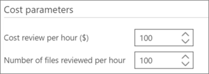

# 在 Office 365 高级电子数据展示中定义突出显示的关键字和高级选项

> [!NOTE]
> 若要使用高级电子数据展示，组织必须订阅随附高级合规性加载项的 Office 365 E3，或订阅 E5。如果没有此计划，但又要试用高级电子数据展示，可以[注册 Office 365 企业版 E5 试用版](https://go.microsoft.com/fwlink/p/?LinkID=698279)。 
  
在高级电子数据展示中, 可以将用户定义的关键字添加到相关性, 以帮助您在标记时识别相关文件。关键字将以指定的颜色显示在**相关性\>标记**中。 
  
如下所述, 可以添加关键字列表, 并将颜色分配给关键字列表和相关问题。如果有, 工具提示将显示关键字的说明 (如果有), 如双下划线所示。
  
> [!IMPORTANT]
> 相关性标记期间, 相关性和查看关键字命中结果中的搜索词突出显示不适用于日语、中文和朝鲜语双字节字符集。 
  
## 添加突出显示的关键字

1. 在 "**相关性\>关联设置**" 选项卡中, 选择 "**突出显示的关键字**"。
    
2. 单击**+** 图标以添加关键字。将显示 "**添加新关键字**" 对话框。 
    
3. 在 "**关键字**" 中, 键入关键字列表, 用逗号分隔关键字。 
    
4. 在 "**颜色**" 列表中, 选择要突出显示 "输入的关键字" 列表的颜色。 
    
5. 在 "**选择问题**" 列表中, 选择是否将关键字列表应用于 "所有问题" 或已选择的问题。 
    
6. 在 "**说明**" 中, 键入关键字列表 (可选)。
    
    
  
7. 完成后, 单击 **"确定"** 。创建的列表将添加到关键字列表表中, 并且可以编辑或删除。 
    
    
  
用户定义的关键字将以关联\>标记中的指定颜色显示。 
  
## 指定相关性设置程序的高级设置

这些设置会影响跟踪并决定关系图的相关性。
  
1. 在 "**相关性\>关联设置**" 选项卡中, 选择 "**高级设置**"。
    
2. 在 "**成本参数**" 对话框中, 进行以下选择: 
    
1. 在 "**每小时成本评审 ($)** " 列表中, 选择以美元为单位的金额或接受默认值。 
    
2. 在 "**按小时审阅的文件数**" 列表中, 选择 "金额" 或接受默认值。 
    
    
  
3. 单击 "**保存**"。将保存所选设置。
    
## 另请参阅

[Office 365 高级电子数据展示](office-365-advanced-ediscovery.md)
  
[定义问题和分配用户](define-issues-and-assign-users.md)
  
[设置将已导入文件添加到的负载](set-up-loads-to-add-imported-files.md)

