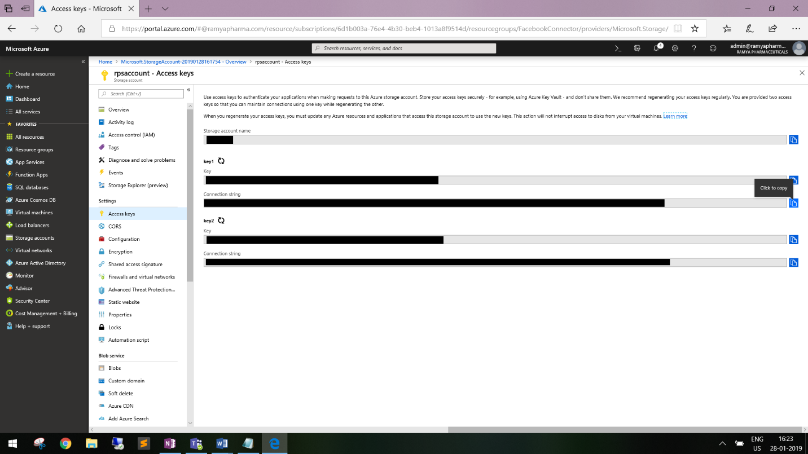
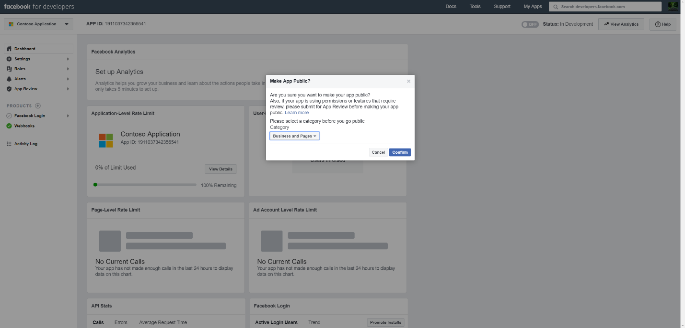
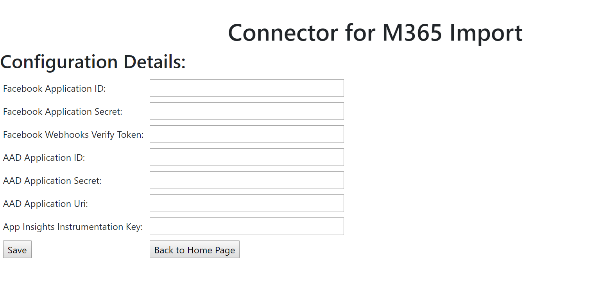
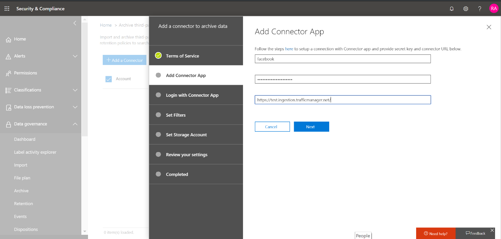
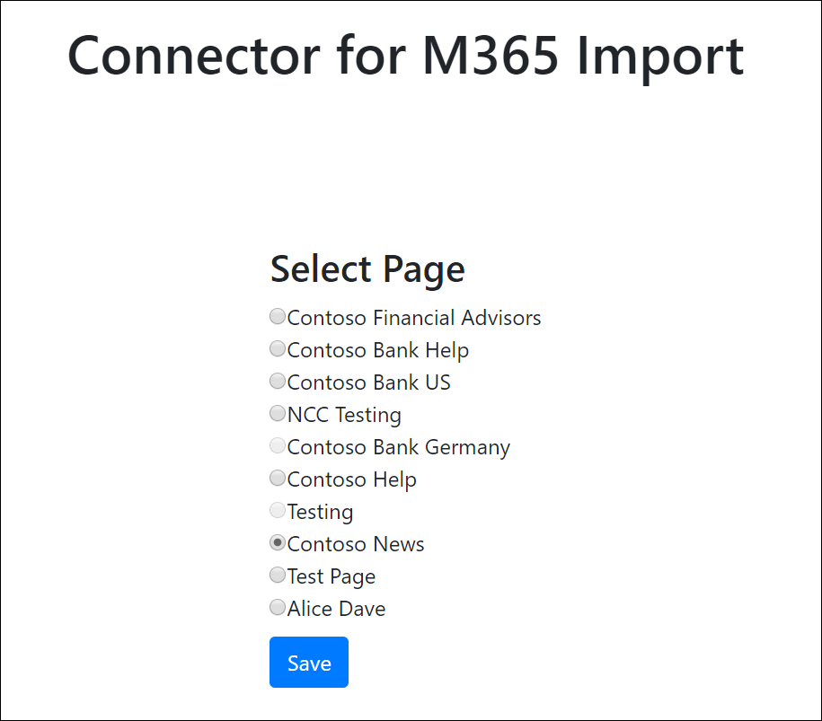

# 在 Office 365 中部署用于存档 Facebook 数据的连接器Deploy a connector to archive Facebook data in Office 365

本文包含了部署使用 Office 365 导入服务将数据从 Facebook 商业页面导入 Office 365 的连接器的分步过程。This article contains the step-by-step process to deploy a connector that uses the Office 365 Import service to import data from Facebook Business pages to Office 365. 有关此过程的简要概述以及部署 Facebook 连接器所需的先决条件列表, 请参阅[使用示例连接器存档 Office 365 中的 Facebook 数据 (预览)](archive-facebook-data-with-sample-connector.md)。For a high-level overview of this process and a list of prerequisites required to deploy a Facebook connector, see [Use a sample connector to archive Facebook data in Office 365 (Preview)](archive-facebook-data-with-sample-connector.md). 

## 步骤 1: 下载程序包Step 1: Download the package

从位于 GitHub 存储库中的 "发布" 部分下载预建<https://github.com/Microsoft/m365-sample-connector-csharp-aspnet/releases>程序包。Download the prebuilt package from the Release section in the GitHub repository at at <https://github.com/Microsoft/m365-sample-connector-csharp-aspnet/releases>. 在最新版本下, 下载名为**SampleConnector**的 zip 文件。Under the latest release, download the zip file named **SampleConnector.zip**. 你将在步骤4中将此 zip 文件上传到 Azure。You will upload this zip file to Azure in Step 4.

## 步骤 2: 在 Azure Active Directory 中创建应用程序Step 2: Create an app in Azure Active Directory

1. 转到<https://portal.azure.com>并使用 Office 365 全局管理员帐户的凭据登录。Go to <https://portal.azure.com> and sign in using the credentials of an Office 365 global admin account.

    

2. 在左侧导航窗格中, 单击 " **Azure Active Directory**"。In the left navigation pane, click **Azure Active Directory**.

    

3. 在左侧导航窗格中, 单击 "**应用程序注册 (预览)** ", 然后单击 "**新建注册**"。In the left navigation pane, click **App registrations (Preview)** and then click **New registration**.

    

4. 注册应用程序。Register the application. 在 "重定向 URI" 下, 选择 "应用程序类型" 下拉<https://portal.azure.com>列表中的 "Web", 然后为 URI 键入相应的框。Under Redirect URI, select Web in the application type dropdown list and then type <https://portal.azure.com> in the box for the URI.

   

5. 复制**应用程序 (客户端) id**和**目录 (租户) id** , 并将其保存到文本文件或其他安全位置。Copy the **Application (client) ID** and **Directory (tenant) ID** and save them to a text file or other safe location. 您将在后续步骤中使用这些 Id。You’ll use these IDs in later steps.

   

6. 转到**证书 & 新应用程序的密码。**Go to **Certificates & secrets for the new app.**

   

7. 单击 "**新建客户端密码**"Click **New client secret**

   

8. 创建新的机密。Create a new secret. 在 "说明" 框中, 键入密码, 然后选择一个过期时间段。In the description box, type the secret and then choose an expiration period. 

    

9. 复制密码的值, 并将其保存到文本文件或其他存储位置。Copy the value of the secret and save it to a text file or other storage location. 这是您将在后续步骤中使用的 AAD 应用程序密码。This is the AAD application secret that you will use in later steps.

   

10. 转到**清单**并复制 identifierUris (也称为 AAD 应用程序 Uri), 如以下屏幕截图中所示。Go to **Manifest** and copy the identifierUris (which is also called the AAD application Uri) as highlighted in the following screenshot. 将 AAD 应用程序 Uri 复制到文本文件或其他存储位置。Copy the AAD application Uri to a text file or other storage location. 您将在步骤6中使用它。You’ll use it in Step 6.

   

## 步骤 3: 创建 Azure 存储帐户Step 3: Create an Azure storage account

1. 转到您的组织的 Azure 主页。Go to the Azure home page for your organization.

    

2. 单击 "**创建资源**", 然后在搜索框中键入**存储帐户**。Click **Create a resource** and they type **storage account** in the search box.

    

3. 单击 "**存储**", 然后单击 "**存储帐户**"。Click **Storage**, and then click **Storage account**.

    

4. 在 "**创建存储帐户**" 页上的 "订阅" 框中, 根据您拥有的 Azure 订阅的类型选择 "按即点**即**用" 或 "**免费试用**"。On the **Create storage account** page, in the Subscription box, select **Pay-As-You-Go** or **Free Trial** depending on which type of Azure subscription you have. 然后, 选择或创建一个资源组。Then select or create a resource group.

    

5. 键入存储帐户的名称。Type a name for the storage account.

    

6. 查看, 然后单击 "**创建**" 以创建存储帐户。Review and then click **Create** to create the storage account.

    

7. 几分钟后, 单击 "**刷新**", 然后单击 "**转到资源**" 以导航到存储帐户。After a few moments, click **Refresh** and then click **Go to resource** to navigate to the storage account.

    

8. 单击左侧导航窗格中的 "**访问密钥**"。Click **Access keys** in the left navigation pane.

    

9. 复制**连接字符串**并将其保存到文本文件或其他存储位置。Copy a **Connection string** and save it to a text file or other storage location. 您将在创建 web 应用资源时使用它。You’ll use this when creating a web app resource.

    

## 步骤 4: 在 Azure 中创建新的 web 应用资源Step 4: Create a new web app resource in Azure

1. 在 Azure 门户的**主页**上, 单击 "**创建资源\>所有\> Web 应用程序**"。On the **Home** page in the Azure portal, click **Create a resource \> Everything \> Web app**. 在 " **Web 应用程序**" 页上, 单击 "**创建**"。On the **Web app** page, click **Create**. 

   

2. 填写详细信息 (如下所示), 然后创建 Web 应用程序。Fill in the details (as shown below) and then create the Web app. 请注意, 您在 "**应用程序名称**" 框中输入的名称将用于创建 Azure 应用服务 URL;例如 fbconnector.azurewebsites.net。Note that the name that you enter in the **App name** box will be used to create the Azure app service URL; for example fbconnector.azurewebsites.net.

   

3. 转到新创建的 web 应用资源, 在左侧导航窗格中单击 "**应用程序设置**"。Go to the newly created web app resource, click **Application Settings** in the left navigation pane. 在 "应用程序设置" 下, 单击 "添加新设置", 然后添加以下三个设置。Under Application settings, click Add new setting and add the following three settings. 使用从前面的步骤中复制到文本文件中的值:Use the values (that you copied to the text file from the previous steps): 

    - **APISecretKey** –您可以键入任何值作为密码。**APISecretKey** – You can type any value as the secret. 这将用于在步骤7中访问连接器 web 应用。This will be used to access the connector web app in Step 7.

    - **StorageAccountConnectionString** –在步骤3中创建 Azure 存储帐户后复制的连接字符串 Uri。**StorageAccountConnectionString** – The connection string Uri that you copied after creating the Azure storage account in Step 3.

    - **tenantId** –在步骤2中创建 Azure Active Directory 中的 Facebook 连接器应用之后复制的 Office 365 组织的租户 ID。**tenantId** – The tenant ID of your Office 365 organization that you copied after creating the Facebook connector app in Azure Active Directory in Step 2.

    

4. 在 "**常规设置**" 下, 单击 "**始终打开**" 旁边的 **""** 。Under **General settings**, click **On** next to the **Always On**. 单击页面顶部的 "**保存**" 以保存应用程序设置。Click **Save** at the top of the page to save application settings.

   

5. 最后一步是将连接器应用源代码上载到您在步骤1中下载的 Azure。The final step is to upload the connector app source code to Azure that you downloaded in Step 1. 在 web 浏览器中, 转到<AzureAppResourceName>https://. scm.azurewebsites.net/ZipDeployUi。In a web browser, go to https://<AzureAppResourceName>.scm.azurewebsites.net/ZipDeployUi. 例如, 如果您的 Azure 应用资源的名称 (在此部分中的步骤2中命名) 为**fbconnector**, 则您将转到https://fbconnector.scm.azurewebsites.net/ZipDeployUi。For example, if the name of your Azure app resource (which you named in step 2 in this section) is **fbconnector**, then you would go to https://fbconnector.scm.azurewebsites.net/ZipDeployUi. 

6. 将 SampleConnector (您在步骤1中下载的) 拖放到此页面。Drag and drop the SampleConnector.zip (that you downloaded in Step 1) to this page. 上载文件并成功部署后, 页面外观将类似于以下屏幕截图。After the files are uploaded and the deployment is successful, the page will look similar to the following screenshot.

   

## 步骤 5: 注册 Facebook 应用程序Step 5: Register the Facebook app

1. 转到<https://developers.facebook.com> , 使用组织的 Facebook 商业版页面的帐户登录, 然后单击 "**添加新应用**"。Go to <https://developers.facebook.com> , log in using the credentials for the account for your organization’s Facebook Business pages, and then click **Add New App**.

   

2. 创建新的应用程序 ID。Create a new app ID.

   

3. 在左侧导航窗格中, 单击 "**添加产品**", 然后单击 " **Facebook 登录**磁贴" 中的 "**设置**"。In the left navigation pane, click **Add Products** and then click **Set Up** in the **Facebook Login** tile.

   

4. 在 "集成 Facebook 登录" 页上, 单击 " **Web**"。On the Integrate Facebook Login page, click **Web**.

   

5. 添加 Azure 应用服务 URL;例如https://fbconnector.azurewebsites.net。Add the Azure app service URL; for example https://fbconnector.azurewebsites.net.

   

6. 完成 Facebook 登录设置的快速入门部分。Complete the QuickStart section of the Facebook Login setup.

   

7. 在 " **Facebook Login**" 下的左侧导航窗格中, 单击 "**设置**", 然后在 "**有效 OAuth 重定向 Uri** " 框中添加 OAuth 重定向 uri。使用\*\* \<connectorserviceuri>/Views/FacebookOAuth\*\*的格式, 其中 connectorserviceuri 的值是您的组织的 Azure 应用服务 URL;例如https://fbconnector.azurewebsites.net。In the left navigation pane under **Facebook Login**, click **Settings**, and add the OAuth redirect URI in the **Valid OAuth Redirect URIs** box; use the format **\<connectorserviceuri>/Views/FacebookOAuth**, where the value for connectorserviceuri is the Azure app service URL for your organization; for example https://fbconnector.azurewebsites.net.

   

8. 在左侧导航窗格中, 单击 "**添加产品**", 然后单击 " **webhook"。**In the left navigation pane, click **Add Products** and then click **Webhooks.** 在 "**页面**" 下拉菜单中, 单击 "**页面**"。In the **Page** pull-down menu, click **Page**. 

   

9. 添加 Webhook 回调 URL 并添加验证令牌。Add Webhooks Callback URL and add a verify token. 回调 URL 的格式, 使用格式\*\* <connectorserviceuri>/api/FbPageWebhook\*\*, 其中 connectorserviceuri 的值是您的组织的 Azure 应用服务 URL;例如https://fbconnector.azurewebsites.net。The format of the callback URL, use the format **<connectorserviceuri>/api/FbPageWebhook**, where the value for connectorserviceuri is the Azure app service URL for your organization; for example https://fbconnector.azurewebsites.net. 

    验证令牌应类似于强密码。The verify token should similar to a strong password. 将验证令牌复制到文本文件或其他存储位置。Copy the verify token to a text file or other storage location.

     

10. 测试并订阅源终结点。Test and subscribe to the endpoint for feed.

    

11. 添加隐私 URL、应用程序图标和业务使用。Add a privacy URL, app icon, and business use. 此外, 将应用程序 ID 和应用程序密码复制到文本文件或其他存储位置。Also, copy the app ID and app secret to a text file or other storage location.

    

12. 将应用程序公开。Make the app public.

    

13. 将用户添加到 "管理员" 或 "测试人员" 角色。Add user to the admin or tester role.

    

14. 添加**页面公共内容访问**权限。Add the **Page Public Content Access** permission.

    

15. 添加 "管理页面" 权限。Add Manage Pages permission.

    

16. 获取由 Facebook 审阅的应用程序。Get the application reviewed by Facebook.

    

## 步骤 6: 配置连接器 web 应用程序Step 6: Configure the connector web app

1. 转到 https://\<AzureAppResourceName> (其中 AzureAppResourceName 是您在步骤4中命名的 Azure 应用程序资源的名称) 例如, 如果名称为**fbconnector**, 请转到https://fbconnector.azurewebsites.net。Go to https://\<AzureAppResourceName>.azurewebsites.net (where AzureAppResourceName is the name of your Azure app resource that you named in Step 4) For example, if the name is **fbconnector**, go to https://fbconnector.azurewebsites.net. 该应用程序的主页看起来将类似下面的屏幕截图。The home page of the app will look like the following screenshot.

   

2. 单击 "**配置**" 以显示登录页。Click **Configure** to display a sign in page.
 
   

3. 在 "租户 Id" 框中, 键入或粘贴您在步骤2中获取的租户 Id。In the Tenant Id box, type or paste your tenant Id (that you obtained in Step 2). 在 "密码" 框中, 键入或粘贴 APISecretKey (您在步骤2中获取), 然后单击 "**设置配置设置**" 以显示 "**配置详细信息**" 页。In the password box, type or paste the APISecretKey (that you obtained in Step 2), and then click **Set Configuration Settings** to display the **Configuration Details** page.

    

4. 在 "**配置详细信息**" 下, 输入以下配置设置Under **Configuration Details**, enter the following configuration settings 

   - **Facebook 应用程序 id** -您在步骤5中获取的 facebook 应用程序的应用程序 id。**Facebook application ID** - The app ID for the Facebook application that you obtained in Step 5.
   - **Facebook 应用程序密码**-您在步骤5中获取的 facebook 应用程序的应用程序密码。**Facebook application secret** - The app secret for the Facebook application that you obtained in Step 5.
   - **Facebook webhook verify token** -您在步骤5中创建的验证令牌。**Facebook webhooks verify token** - The verify token that you created in Step 5.
   - **AAD 应用程序 id** -您在步骤2中创建的 Azure Active Directory 应用程序的应用程序 id。**AAD application ID** - The application ID for the Azure Active Directory app that you created in Step 2.
   - **AAD 应用程序密码**-您在步骤4中创建的 APISecretKey 密码的值。**AAD application secret** - The value for the APISecretKey secret that you created in Step 4.
   - **AAD 应用程序 uri** -在步骤2中获取的 aad 应用程序 uri;例如, https://microsoft.onmicrosoft.com/2688yu6n-12q3-23we-e3ee-121111123213。**AAD application Uri** - The AAD application Uri obtained in Step 2; for example, https://microsoft.onmicrosoft.com/2688yu6n-12q3-23we-e3ee-121111123213.
   - **App insights 检测键**-将此框保留为空。**App insights instrumentation key** - Leave this box blank.

5. 单击 "**保存**" 以保存连接器设置。Click **Save** to save the connector settings.

## 步骤 7: 在安全 & 合规中心中设置自定义连接器Step 7: Set up a custom connector in the Security & Compliance Center

1. 转到<https://protection.office.com> , 然后单击 "**数据\>调控\>导入存档第三方数据**"。Go to <https://protection.office.com> and then click **Data governance \> Import \> Archive third-party data**.

   

2.  单击 "**添加连接器**", 然后单击 " **Facebook 页面**"。Click **Add a connector** and then click **Facebook pages**.

    

3.  在 "**添加连接器应用程序**" 页上, 输入以下信息, 然后单击 "**验证连接器**"。On the **Add Connector App** page, enter the following information and then click **Validate connector**.

    - 在第一个框中, 键入连接器的名称, 例如**Facebook**。In the first box, type a name for the connector, such as **Facebook**.
    - 在第二个框中, 键入或粘贴您在步骤4中添加的 APISecretKey 的值。In the second box, type or paste the value of the APISecretKey that you added in Step 4.
    - 在第三个框中, 键入或粘贴 Azure 应用服务 URL;例如**https://fbconnector.azurewebsites.net**。In the third box, type or paste the Azure app service URL; for example **https://fbconnector.azurewebsites.net**.
 
    成功验证连接器后, 单击 "**下一步**"。After the connector is successfully validated, click **Next**.
    
    

4.  单击 "**使用连接器应用登录**"。Click **Login with Connector App**.

    

5. 再次键入或粘贴 APISecretKey, 然后单击 "**登录到连接器服务**"。Type or paste the APISecretKey again and then click  **Login to Connector Service**.

   

6. 单击 "**使用 Facebook 登录"。**Click **Login with Facebook.**

   

7. 在 "**登录到 Facebook** " 页上, 使用组织的 Facebook 商业版页面的帐户登录凭据。On the **Log in to Facebook** page, log in using the credentials for the account for your organization’s Facebook Business pages. 确保您登录到的 Facebook 帐户已分配给您组织的 Facebook 商业页面的管理员角色Make sure the Facebook account you logged in to is assigned the admin role for your organization’s Facebook Business pages

   

8. 单击 "**选择页面**", 选择您要在 Office 365 中存档的组织的业务页面。Click **Select Pages** to choose your organization’s business pages that you want to archive in Office 365.

   

9. 将显示您登录到的 Facebook 帐户所管理的商业页面的列表。A list of the Business pages managed by the Facebook account that you logged in to is displayed. 选择要存档的页面, 然后单击 "**保存**"。Select the page to archive and then click **Save**.

    

10. 单击 "**完成**" 退出连接器服务应用程序的安装。Click **Finish** to exit the setup of the connector service app.

    

11. 在 "**设置筛选器**" 页上, 可以应用筛选器以导入 (和存档) 特定时间的项目。On the **Set Filters** page, you can apply a filter to import (and archive) items that are a certain age. 单击“下一步”。\*\*\*\*Click **Next**.

    

12. 在 "**设置存储帐户**" 页上, 选择您之前选择的 Facebook 商业页面中的项目将导入到的 Office 365 邮箱。On the **Set Storage Account** page, select the Office 365 mailbox that the items from the Facebook Business pages that you previously selected will be imported to.

    

13. 查看您的设置, 然后单击 "**完成**" 以完成 Security _AMP_ 合规性中心中的连接器设置。Review your settings and then click **Finish** to complete the connector setup in the Security & Compliance Center.

    

14. 转到 "**存档第三方数据**" 页, 查看导入过程的进度。Go to the **Archive third-party data** page to see the progress of the import process.

    
