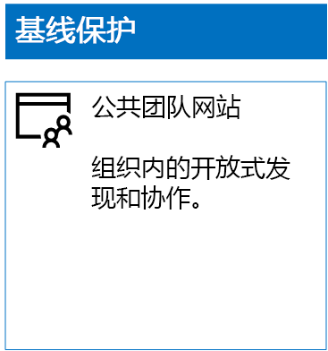
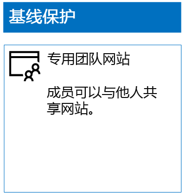
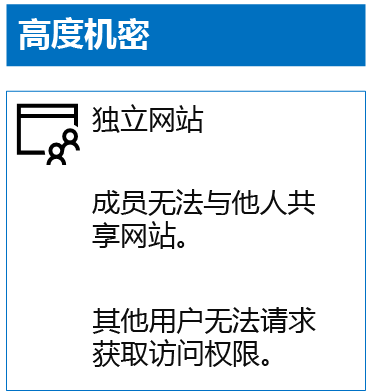

# 部署具有三层保护的 SharePoint Online 网站Deploy SharePoint Online sites for three tiers of protection

 **摘要：** 为各种级别的信息保护创建和配置 SharePoint Online 团队网站。**Summary:** Create and configure SharePoint Online team sites for various levels of information protection.
  
使用本文中的步骤设计和部署基线、敏感和高度机密的 SharePoint Online 团队网站。 有关三层保护的详细信息，请参阅[保护 SharePoint Online 网站和文件](secure-sharepoint-online-sites-and-files.md)。Use the steps in this article to design and deploy baseline, sensitive, and highly confidential SharePoint Online team sites. For more information about these three tiers of protection, see [Secure SharePoint Online sites and files](secure-sharepoint-online-sites-and-files.md).
  
## 基线 SharePoint Online 团队网站Baseline SharePoint Online team sites

基线保护同时包括公共和专用团队网站。 组织中的任何人均可发现并访问公共团队网站。 只有与团队网站关联的 Office 365 组的成员才可以发现并访问专用网站。 两种类型的团队网站均允许成员与他人共享网站。Baseline protection includes both public and private team sites. Public team sites can be discovered and accessed by anybody in the organization. Private sites can only be discovered and accessed by members of the Office 365 group associated with the team site. Both of these types of team sites allow members to share the site with others.
  
### 公开Public

若要创建具有公共访问和权限的基线 SharePoint Online 团队网站，请执行以下操作：To create a baseline SharePoint Online team site with public access and permissions, do the following:
  
1. 请通过还可用于管理 SharePoint Online 团队网站的帐户（即 SharePoint Online 管理员帐户）登录 Office 365 门户。如需帮助，请参阅[在何处登录到 Office 365](https://support.office.com/Article/Where-to-sign-in-to-Office-365-e9eb7d51-5430-4929-91ab-6157c5a050b4)。Sign in to the Office 365 portal with an account that will also be used to administer the SharePoint Online team site (a SharePoint Online administrator). For help, see [Where to sign in to Office 365](https://support.office.com/Article/Where-to-sign-in-to-Office-365-e9eb7d51-5430-4929-91ab-6157c5a050b4).
    
2. 在磁贴列表中，单击“SharePoint”\*\*\*\*。In the list of tiles, click **SharePoint**.
    
3. 在浏览器的新“SharePoint”标签页中，单击“+ 创建网站”\*\*\*\*\*\*\*\*。On the new **SharePoint** tab in your browser, click **+ Create site**.
    
4. 在“创建网站”页中，单击“团队网站”\*\*\*\*\*\*\*\*。On the **Create a site** page, click **Team site**.
    
5. 在“网站名称”中，键入公共团队网站的名称\*\*\*\*。In **Site name**, type a name for the public team site. 
    
6. 在“团队网站说明”中，键入关于网站用途的说明。\*\*\*\*In **Team site description**, type a description of the purpose of the site.
    
7. 在“隐私设置”中，选择“公用 - 组织中的任何人均可访问此网站”，然后单击“下一步”\*\*\*\*\*\*\*\*\*\*\*\*。In **Privacy settings**, select **Public - anyone in the organization can access this site**, and then click **Next**.
    
8. 在“希望添加哪些人员?”窗格中，单击“完成”\*\*\*\*\*\*\*\*。On the **Who do you want to add?** pane, click **Finish**.
    
下面是生成的配置。Here is your resulting configuration.
  

  
### 私有Private

若要创建具有私有访问和权限的基线 SharePoint Online 团队网站，请执行以下操作：To create a baseline SharePoint Online team site with private access and permissions, do the following:
  
1. 请通过还可用于管理 SharePoint Online 团队网站的帐户（即 SharePoint Online 管理员帐户）登录 Office 365 门户。如需帮助，请参阅[在何处登录到 Office 365](https://support.office.com/Article/Where-to-sign-in-to-Office-365-e9eb7d51-5430-4929-91ab-6157c5a050b4)。Sign in to the Office 365 portal with an account that will also be used to administer the SharePoint Online team site (a SharePoint Online administrator). For help, see [Where to sign in to Office 365](https://support.office.com/Article/Where-to-sign-in-to-Office-365-e9eb7d51-5430-4929-91ab-6157c5a050b4).
    
2. 在磁贴列表中，单击“SharePoint”\*\*\*\*。In the list of tiles, click **SharePoint**.
    
3. 在浏览器的新“SharePoint”标签页中，单击“+ 创建网站”\*\*\*\*\*\*\*\*。On the new **SharePoint** tab in your browser, click **+ Create site**.
    
4. 在“创建网站”页中，单击“团队网站”\*\*\*\*\*\*\*\*。On the **Create a site** page, click **Team site**.
    
5. 在“网站名称”中，键入专用团队网站的名称\*\*\*\*。In **Site name**, type a name for the private team site. 
    
6. 在“团队网站说明”中，键入关于网站用途的说明。\*\*\*\*In **Team site description,** type a description of the purpose of the site.
    
7. 在“隐私设置”中，选择“专用 - 仅成员可以访问此网站”，然后单击“下一步”\*\*\*\*\*\*\*\*\*\*\*\*。In **Privacy settings**, select **Private - only members can access this site**, and then click **Next**.
    
8. 在“希望添加哪些人员?”窗格中的“添加成员”中，键入有权访问此专用团队网站的用户帐户的名称\*\*\*\*\*\*\*\*。On the **Who do you want to add?** pane, in **Add members**, type the names of user accounts that have access to this private team site.
    
9. 将最初的一组成员添加到网站后，单击“完成”。\*\*\*\*When you are done adding the initial set of members to the site, click **Finish**
    
下面是生成的配置。Here is your resulting configuration.
  

  
## 敏感 SharePoint Online 团队网站Sensitive SharePoint Online team sites

敏感 SharePoint Online 团队网站是独立的团队网站，这意味着通过 SharePoint 组的成员身份而不是与该团队网站关联的 Office 365 组中的成员身份控制权限。A sensitive SharePoint Online team site is an isolated team site, which means that permissions are controlled through membership in SharePoint groups instead of membership in the Office 365 group associated with the team site.
  
要创建一个独立的团队网站，请按照以下两个主要步骤操作。To create an isolated team site, there are two main steps.
  
### 步骤 1：设计独立网站Step 1: Design your isolated site

要设计独立的团队网站，需要确定：To design your isolated team site, you need to determine:
  
- SharePoint 组和权限级别。Your SharePoint groups and permission levels.
    
- 将成为 SharePoint 组的成员的一组访问组。The set of access groups that will be members of your SharePoint groups.
    
     一组建议的访问组，团队成员、网站查看者和网站管理员各一个。The recommended set of access groups is one for site members, one for site viewers, and one for site administrators.
    
- 是否会在访问组中使用嵌套组。Whether you will use nested groups within your access groups.
    
例如，建议的组结构和权限级别如下所示：For example, the recommended group structure and permission levels look like this:
  
|**SharePoint 组****SharePoint group**|**权限级别****Permission level**|**访问组（示例）****Access group (examples)**|
|:-----|:-----|:-----|
|[网站名称] 成员[site name] Members    |编辑Edit    |[网站名称] 成员[site name] Members    |
|[网站名称] 访问者[site name] Visitors    |读取Read    |[网站名称] 查看者[site name] Viewers    |
|[网站名称] 所有者[site name] Owners    |完全控制Full control    |[网站名称] 管理员[site name] Admins    |
   
默认情况下，为团队网站创建了 SharePoint 组和权限级别。 需要确定访问组的名称。The SharePoint groups and permission levels are created by default for a team site. You need to determine the names of your access groups.
  
有关设计过程的详细信息，请参阅[设计独立的 SharePoint Online 团队网站](design-an-isolated-sharepoint-online-team-site.md)。For the details of the design process, see [Design an isolated SharePoint Online team site](design-an-isolated-sharepoint-online-team-site.md).
  
### 步骤 2：部署独立网站Step 2: Deploy your isolated site

要部署独立网站，首先需要：To deploy your isolated site, you first need to:
  
- 确定要添加到每个访问组的用户帐户和组。Determine the user accounts and groups to add to each of your access groups.
    
- 创建访问组并添加用户和组成员。Create the access groups and add the user and group members.
    
有关详细步骤，请参阅[部署独立的 SharePoint Online 团队网站](deploy-an-isolated-sharepoint-online-team-site.md)的阶段 1\*\*\*\*。For the detailed steps, see **Phase 1** of [Deploy an isolated SharePoint Online team site](deploy-an-isolated-sharepoint-online-team-site.md).
  
接下来，使用以下步骤创建 SharePoint Online 团队网站。Next, you create the SharePoint Online team site with these steps.
  
1. 请通过还可用于管理 SharePoint Online 团队网站的帐户（即 SharePoint Online 管理员帐户）登录 Office 365 门户。如需帮助，请参阅[在何处登录到 Office 365](https://support.office.com/Article/Where-to-sign-in-to-Office-365-e9eb7d51-5430-4929-91ab-6157c5a050b4)。Sign in to the Office 365 portal with an account that will also be used to administer the SharePoint Online team site (a SharePoint Online administrator). For help, see [Where to sign in to Office 365](https://support.office.com/Article/Where-to-sign-in-to-Office-365-e9eb7d51-5430-4929-91ab-6157c5a050b4).
    
2. 在磁贴列表中，单击“SharePoint”\*\*\*\*。In the list of tiles, click **SharePoint**.
    
3. 在浏览器的新“SharePoint”标签页中，单击“+ 创建网站”。\*\*\*\*\*\*\*\*In the new **SharePoint** tab of your browser, click **+ Create site**.
    
4. 在“创建网站”页中，单击“团队网站”\*\*\*\*\*\*\*\*。On the **Create a site** page, click **Team site**.
    
5. 在“网站名称”中，键入专用团队网站的名称\*\*\*\*。In **Site name**, type a name for the private team site.
    
6. 在“团队网站”说明中，键入说明（可选）。\*\*\*\*In **Team site description**, type an optional description.
    
7. 在“隐私设置”中，选择“专用 - 仅成员可以访问此网站”，然后单击“下一步”\*\*\*\*\*\*\*\*\*\*\*\*。In **Privacy settings**, select **Private - only members can access this site**, and then click **Next**.
    
8. 在“希望添加哪些人员?”窗格中，单击“完成”\*\*\*\*\*\*\*\*。On the **Who do you want to add?** pane, click **Finish**.
    
接下来，在新的 SharePoint Online 团队网站中，按照以下步骤操作来配置权限。Next, from the new SharePoint Online team site, configure permissions with these steps.
  
1. 确定 IT 管理员或将负责响应和处理网站访问请求的其他人员的用户主体名称 (UPN)（例如，belindan@contoso.com）。记下此 UPN：。Determine the User Principal Name (UPN) of the IT administrator or other person who will be responsible for responding to and addressing requests for access to the site (belindan@contoso.com is an example of a UPN). Write that UPN here: .
    
2. 在工具栏中，依次单击设置图标和“网站权限”\*\*\*\*。In the tool bar, click the settings icon, and then click **Site permissions**.
    
3. 在“网站权限”窗格中，单击“高级权限设置”\*\*\*\*\*\*\*\*。In the **Site permissions** pane, click **Advanced permissions settings**.
    
4. 在浏览器的新“权限”标签页中，单击“访问请求设置”\*\*\*\*\*\*\*\*。On the new **Permissions** tab of your browser, click **Access Request Settings**.
    
5. 在“访问请求设置”对话框中\*\*\*\*：In the **Access Requests Settings** dialog box:
    
  - 清除“允许成员共享网站和单独的文件和文件夹”和“允许成员邀请他人到网站成员组”复选框\*\*\*\*\*\*\*\*。Clear the **Allow members to share the site and individual files and folders** and **Allow members to invite others to the site members group** check boxes.
    
  - 在“发送所有访问请求”中键入步骤 1 中的 IT 管理员的 UPN\*\*\*\*。Type the UPN of your IT administrator from step 1 in **Send all requests for access**.
    
  - 单击" **确定**"。Click **OK**.
    
6. 在浏览器的新“权限”标签页中，单击列表中的“[网站名称] 成员”\*\*\*\*\*\*\*\*。On the **Permissions** tab of your browser, click **[site name] Members** in the list.
    
7. 在“人员和组”中，单击“新建”\*\*\*\*\*\*\*\*。In **People and Groups**, click **New**.
    
8. 在“共享”对话框中，键入此网站的网站成员访问组的名称，将其选中，然后单击“共享”\*\*\*\*\*\*\*\*。In the **Share** dialog box, type the name of your site members access group for this site, select it, and then click **Share**.
    
9. 单击浏览器上的后退按钮。Click the back button on your browser.
    
10. 在列表中单击“[网站名称] 所有者”\*\*\*\*。Click **[site name] Owners** in the list.
    
11. 在“人员和组”中，单击“新建”\*\*\*\*\*\*\*\*。In **People and Groups**, click **New**.
    
12. 在“共享”对话框中，键入此网站的网站管理员访问组的名称，将其选中，然后单击“共享”\*\*\*\*\*\*\*\*。In the **Share** dialog box, type the name of the site administrators access group for this site, select it, and then click **Share**.
    
13. 单击浏览器上的后退按钮。Click the back button on your browser.
    
14. 在列表中单击“[网站名称] 访问者”\*\*\*\*。Click **[site name] Visitors** in the list.
    
15. 在“人员和组”中，单击“新建”\*\*\*\*\*\*\*\*。In **People and Groups**, click **New**.
    
16. 在“共享”对话框中，键入此网站的网站查看者访问组的名称，将其选中，然后单击“共享”\*\*\*\*\*\*\*\*。In the **Share** dialog box, type the name of the site viewers access group for this site, select it, and then click **Share**.
    
17. 关闭浏览器的“权限”标签页\*\*\*\*。Close the **Permissions** tab of your browser.
    
以下是这些权限设置的结果：The results of these permission settings are:
  
- [网站名称] 所有者：SharePoint 组包含网站管理员访问组，其中的所有成员均具有“完全控制”权限级别\*\*\*\*\*\*\*\*。The **[site name] Owners** SharePoint group contains the site administrators access group, in which all the members have the **Full control** permission level.
    
- [网站名称] 成员：SharePoint 组包含网站成员访问组，其中的所有成员均具有编辑权限级别\*\*\*\*\*\*\*\*。The **[site name] Members** SharePoint group contains the site members access group, in which all the members have the **Edit** permission level.
    
- [网站名称] 访问者：SharePoint 组包含网站查看者访问组，其中的所有成员均具有读取权限级别\*\*\*\*\*\*\*\*。The **[site name] Visitors** SharePoint group contains the site viewers access group, in which all the members have the **Read** permission level.
    
- 禁用成员邀请其他成员的功能。The ability for members to invite other members is disabled.
    
- 启用非成员请求访问的功能。The ability for non-members to request access is enabled.
    
下面是生成的配置。Here is your resulting configuration.
  

  
通过其中一个访问组的组成员身份，网站成员现可对网站资源进行安全协作。The members of the site, through group membership in one of the access groups, can now securely collaborate on the resources of the site.
  
## 高度机密的 SharePoint Online 团队网站Highly confidential SharePoint Online team sites

高度机密的 SharePoint Online 团队网站是独立的团队网站，这意味着通过 SharePoint 组的成员身份而不是与该团队网站关联的 Office 365 组中的成员身份控制权限。A highly confidential SharePoint Online team site is an isolated team site, which means that permissions are controlled through membership in SharePoint groups instead of membership in the Office 365 group associated with the team site.
  
要针对高度机密的信息和协作创建独立的团队网站，需要完成两个主要步骤。To create an isolated team site for highly confidential information and collaboration, there are two main steps.
  
### 步骤 1：设计独立网站Step 1: Design your isolated site

要设计独立的团队网站，需要确定：To design your isolated team site, you need to determine:
  
- SharePoint 组和权限级别。Your SharePoint groups and permission levels.
    
- 将成为 SharePoint 组的成员的一组访问组。The set of access groups that will be members of your SharePoint groups.
    
     一组建议的访问组，团队成员、网站查看者和网站管理员各一个。The recommended set of access groups is one for site members, one for site viewers, and one for site administrators.
    
- 是否会在访问组中使用嵌套组。Whether you will use nested groups within your access groups.
    
例如，建议的组结构和权限级别如下所示：For example, the recommended group structure and permission levels look like this:
  
|**SharePoint 组****SharePoint group**|**权限级别****Permission level**|**访问组（示例）****Access group (examples)**|
|:-----|:-----|:-----|
|[网站名称] 成员[site name] Members    |编辑Edit    |[网站名称] 成员[site name] Members    |
|[网站名称] 访问者[site name] Visitors    |读取Read    |[网站名称] 查看者[site name] Viewers    |
|[网站名称] 所有者[site name] Owners    |完全控制Full control    |[网站名称] 管理员[site name] Admins    |
   
默认情况下，为团队网站创建了 SharePoint 组和权限级别。 需要确定访问组的名称。The SharePoint groups and permission levels are created by default for a team site. You need to determine the names of your access groups.
  
有关设计过程的详细信息，请参阅[设计独立的 SharePoint Online 团队网站](design-an-isolated-sharepoint-online-team-site.md)。For the details of the design process, see [Design an isolated SharePoint Online team site](design-an-isolated-sharepoint-online-team-site.md).
  
### 步骤 2：部署独立网站Step 2: Deploy your isolated site

要部署独立网站，首先需要：To deploy your isolated site, you first need to:
  
- 确定每个访问组的用户和组成员Determine the user and group members of each of your access groups
    
- 创建访问组并添加用户和组成员Create the access groups and add the user and group members
    
- 创建使用访问组的独立团队网站Create an isolated team site that uses your access groups
    
有关详细步骤，请参阅[部署独立的 SharePoint Online 团队网站](deploy-an-isolated-sharepoint-online-team-site.md)。For the detailed steps, see [Deploy an isolated SharePoint Online team site](deploy-an-isolated-sharepoint-online-team-site.md).
  
以下是这些权限设置的结果：The results of the permission settings are:
  
- [网站名称] 所有者：SharePoint 组包含网站管理员访问组，其中的所有成员均具有“完全控制”权限级别\*\*\*\*\*\*\*\*。The **[site name] Owners** SharePoint group contains the site administrators access group, in which all the members have the **Full control** permission level.
    
- [网站名称] 成员：SharePoint 组包含网站成员访问组，其中的所有成员均具有编辑权限级别\*\*\*\*\*\*\*\*。The **[site name] Members** SharePoint group contains the site members access group, in which all the members have the **Edit** permission level.
    
- [网站名称] 访问者：SharePoint 组包含网站查看者访问组，其中的所有成员均具有读取权限级别\*\*\*\*\*\*\*\*。The **[site name] Visitors** SharePoint group contains the site viewers access group, in which all the members have the **Read** permission level.
    
- 禁用成员邀请其他成员的功能。The ability for members to invite other members is disabled.
    
- 禁用非成员请求访问的功能。The ability for non-members to request access is disabled.
    
下面是生成的配置。Here is your resulting configuration.
  

  
通过其中一个访问组的组成员身份，网站成员现可对网站资源进行安全协作。The members of the site, through group membership in one of the access groups, can now securely collaborate on the resources of the site.
  
## 后续步骤Next step

[使用 Azure 信息保护来保护 SharePoint Online 文件Protect SharePoint Online files with Azure Information Protection](protect-sharepoint-online-files-with-azure-information-protection.md)

## 另请参阅See also

[保护 SharePoint Online 网站和文件Secure SharePoint Online sites and files](secure-sharepoint-online-sites-and-files.md)
  
[Microsoft 针对政治宣传活动、非营利组织和其他敏捷性组织的安全指南Microsoft Security Guidance for Political Campaigns, Nonprofits, and Other Agile Organizations](microsoft-security-guidance-for-political-campaigns-nonprofits-and-other-agile-o.md)
  
[云应用和混合解决方案Cloud adoption and hybrid solutions](https://docs.microsoft.com/office365/enterprise/cloud-adoption-and-hybrid-solutions)

