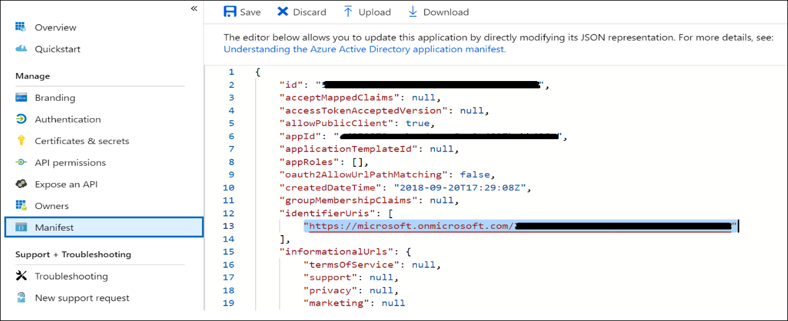
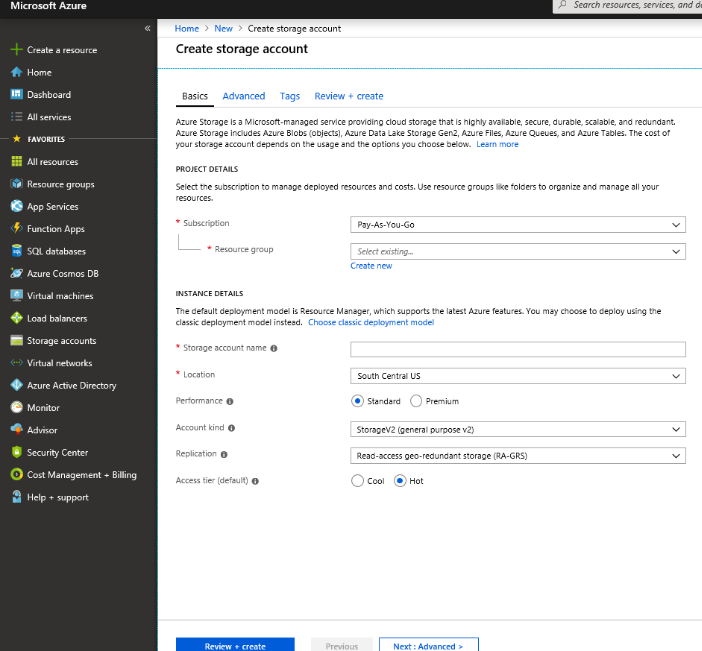
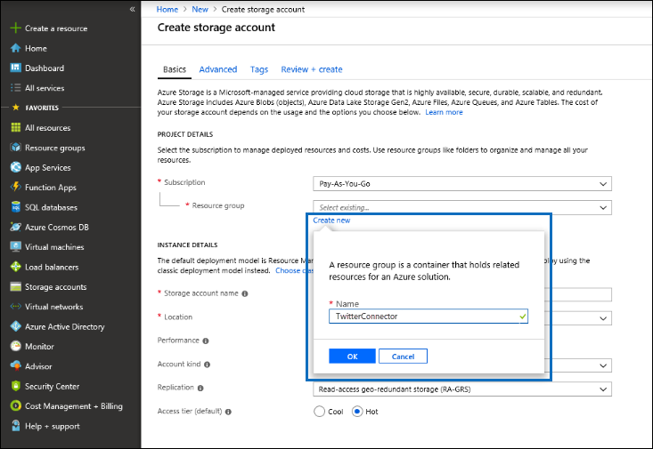

# 部署连接器以在 Office 365 中存档 Twitter 数据Deploy a connector to archive Twitter data in Office 365

本文包含的分步过程可部署使用 Office 365 导入服务将数据从组织的 Twitter 帐户导入 Office 365 的连接器。This article contains the step-by-step process to deploy a connector that uses the Office 365 Import service to import data from your organization's Twitter account to Office 365. 有关此过程的高级概述以及部署 Twitter 连接器所需的先决条件列表, 请参阅[使用示例连接器在 Office 365 中存档 Twitter 数据 (预览)](archive-twitter-data-with-sample-connector.md)。For a high-level overview of this process and a list of prerequisites required to deploy a Twitter connector, see [Use a sample connector to archive Twitter data in Office 365 (Preview)](archive-twitter-data-with-sample-connector.md). 

## 步骤 1: 下载程序包Step 1: Download the package

从位于 GitHub 存储库中的 "发布" 部分下载预[https://github.com/microsoft/m365-sample-twitter-connector-csharp-aspnet/releases](https://github.com/microsoft/m365-sample-twitter-connector-csharp-aspnet/releases)建程序包 (网址为)。Download the prebuilt package from the Release section in the GitHub repository at [https://github.com/microsoft/m365-sample-twitter-connector-csharp-aspnet/releases](https://github.com/microsoft/m365-sample-twitter-connector-csharp-aspnet/releases). 在最新版本下, 下载名为**SampleConnector**的 zip 文件。Under the latest release, download the zip file named **SampleConnector.zip**. 您在步骤4中将此 zip 文件上传到 Azure。You upload this zip file to Azure in Step 4.

## 步骤 2: 在 Azure Active Directory 中创建应用程序Step 2: Create an app in Azure Active Directory

1. 转到<https://portal.azure.com>并使用 Office 365 全局管理员帐户的凭据登录。Go to <https://portal.azure.com> and sign in using the credentials of an Office 365 global admin account.

   

2. 在左侧导航窗格中, 单击 " **Azure Active Directory**"。In the left navigation pane, click **Azure Active Directory**.

   

3. 在左侧导航窗格中, 单击 "**应用程序注册 (预览)** ", 然后单击 "**新建注册**"。In the left navigation pane, click **App registrations (Preview)** and then click **New registration**.

   

4. 注册应用程序。Register the application. 在 "**重定向 URI (可选)**" 下, 选择 "应用程序类型" 下拉<https://portal.azure.com>列表中的 "Web", 然后在 URI 框中键入 uri。Under **Redirect URI (optional)**, select Web in the application type dropdown list and then type <https://portal.azure.com> in the box for the URI.

   

5. 复制**应用程序 (客户端) id**和**目录 (租户) id** , 并将其保存到文本文件或其他安全位置。Copy the **Application (client) ID** and **Directory (tenant) ID** and save them to a text file or other safe location. 可在后续步骤中使用这些 Id。You use these IDs in later steps.

    

6. 转到**证书 & 新应用程序的证书**, 并在 "**客户端密码**" 下, 单击 "**新建客户端密码**"。Go to **Certificates & secrets for the new app** and under **Client secrets** click **New client secret**.

   

7. 创建新的机密。Create a new secret. 在 "说明" 框中, 键入密码, 然后选择一个过期时间段。In the description box, type the secret and then choose an expiration period. 

   

8. 复制密码的值, 并将其保存到文本文件或其他存储位置。Copy the value of the secret and save it to a text file or other storage location. 这是您在后续步骤中使用的 AAD 应用程序密码。This is the AAD application secret that you use in later steps.

   

9. 转到**清单**并复制 identifierUris (也称为 AAD 应用程序 Uri), 如以下屏幕截图中所示。Go to **Manifest** and copy the identifierUris (which is also called the AAD application Uri) as highlighted in the following screenshot. 将 AAD 应用程序 Uri 复制到文本文件或其他存储位置。Copy the AAD application Uri to a text file or other storage location. 您可以在步骤6中使用它。You use it in Step 6.

    

## 步骤 3: 创建 Azure 存储帐户Step 3: Create an Azure storage account

1.  转到您的组织的 Azure 主页。Go to the Azure home page for your organization.

    

2. 单击 "**创建资源**", 然后在搜索框中键入**存储帐户**。Click **Create a resource** and they type **storage account** in the search box.

   

3. 单击 "**存储**", 然后单击 "**存储帐户**"。Click **Storage**, and then click **Storage account**.

   

4. 在 "**创建存储帐户**" 页上的 "订阅" 框中, 根据您拥有的 Azure 订阅的类型选择 "按即点**即**用" 或 "**免费试用**"。On the **Create storage account** page, in the Subscription box, select **Pay-As-You-Go** or **Free Trial** depending on which type of Azure subscription you have. 

   

5. 选择或创建一个资源组。Select or create a resource group.

   

6. 键入存储帐户的名称。Type a name for the storage account.

   

7. 查看, 然后单击 "**创建**" 以创建存储帐户。Review and then click **Create** to create the storage account.

   

8. 几分钟后, 单击 "**刷新**", 然后单击 "**转到资源**" 以导航到存储帐户。After a few moments, click **Refresh** and then click **Go to resource** to navigate to the storage account.

   

9. 单击左侧导航窗格中的 "**访问密钥**"。Click **Access keys** in the left navigation pane.

   

10. 复制**连接字符串**并将其保存到文本文件或其他存储位置。Copy a **Connection string** and save it to a text file or other storage location. 在步骤4中创建 web 应用资源时, 可以使用此操作。You use this when creating a web app resource in Step 4.

    

## 步骤 4: 在 Azure 中创建新的 web 应用资源Step 4: Create a new web app resource in Azure

1. 在 Azure 门户的**主页**上, 单击 "**创建资源\>所有\> Web 应用程序**"。On the **Home** page in the Azure portal, click **Create a resource \> Everything \> Web app**. 在 " **Web 应用程序**" 页上, 单击 "**创建**"。On the **Web app** page, click **Create**.

   

2. 填写详细信息 (如下所示), 然后创建 Web 应用程序。Fill in the details (as shown below) and then create the Web app. 您在 "**应用名称**" 框中输入的名称用于创建 Azure 应用服务 URL;例如, twitterconnector.azurewebsites.net。The name that you enter in the **App name** box is used to create the Azure app service URL; for example, twitterconnector.azurewebsites.net.

   

3. 转到新创建的 web 应用资源, 并单击左侧导航窗格中的 "**应用程序设置**"。Go to the newly created web app resource and click **Application Settings** in the left navigation pane. 在 "**应用程序设置**" 下, 单击 "**添加新设置**", 然后添加以下三个设置。Under **Application settings**, click **Add new setting** and add the following three settings. 使用从前面的步骤中复制到文本文件中的值:Use the values (that you copied to the text file from the previous steps): 

    – \* \* APISecretKey —您可以键入任何值作为密码。– \*\*APISecretKey — You can type any value as the secret. 这用于在步骤7中访问连接器 web 应用。This is used to access the connector web app in Step 7.

    – **StorageAccountConnectionString** –在步骤3中创建 Azure 存储帐户后复制的连接字符串 Uri。– **StorageAccountConnectionString** – The connection string Uri that you copied after creating the Azure storage account in Step 3.

    – **tenantId** –在步骤2中创建 Azure Active Directory 中的 Twitter 连接器应用之后复制的 Office 365 组织的租户 ID。– **tenantId** – The tenant ID of your Office 365 organization that you copied after creating the Twitter connector app in Azure Active Directory in Step 2.

    

4. 在 "**常规设置**" 下, 单击 "**始终打开**" 旁边的 **""** 。Under **General settings**, click **On** next to the **Always On**. 单击页面顶部的 "**保存**" 以保存应用程序设置。Click **Save** at the top of the page to save the application settings.

   

5. 最后一步是将连接器应用源代码上载到您在步骤1中下载的 Azure。The final step is to upload the connector app source code to Azure that you downloaded in Step 1. 在 web 浏览器中, 转到<AzureAppResourceName>https://. scm.azurewebsites.net/ZipDeployUi。In a web browser, go to https://<AzureAppResourceName>.scm.azurewebsites.net/ZipDeployUi. 例如, 如果您的 Azure 应用资源的名称 (在此部分中的步骤2中命名) 为**twitterconnector**, 则您将转到https://twitterconnector.scm.azurewebsites.net/ZipDeployUi。For example, if the name of your Azure app resource (which you named in step 2 in this section) is **twitterconnector**, then you would go to https://twitterconnector.scm.azurewebsites.net/ZipDeployUi.

6. 将 SampleConnector (您在步骤1中下载的) 拖放到此页面。Drag and drop the SampleConnector.zip (that you downloaded in Step 1) to this page. 上载文件并成功部署后, 页面外观将类似于以下屏幕截图:After the files are uploaded and the deployment is successful, the page will look similar to the following screenshot:

   

## 步骤 5: 创建 Twitter 应用Step 5: Create the Twitter app

1. 转到https://developer.twitter.com, 使用组织的开发人员帐户的凭据登录, 然后单击 "**应用**"。Go to https://developer.twitter.com, log in using the credentials for the developer account for your organization, and then click **Apps**.

   
2. 单击 "**创建应用程序**"。Click **Create an app**.
   
   

3. 在 "**应用程序详细信息**" 下, 添加有关应用程序的信息。Under **App details**, add information about the application.

   

4. 在 Twitter 开发人员仪表板上, 选择刚创建的应用程序, 并复制显示的应用 ID 并将其保存到文本文件或其他存储位置。On the Twitter developer dashboard, select the app that you just created and copy the App ID that's displayed  and save it to a text file or other storage location. 然后单击 "**详细信息**"。Then click **Details**.
   
   

5. 在 "**密钥和标记**" 选项卡上的 "**使用者 api 密钥**" 下, 复制 api 密钥并将其保存到文本文件或其他存储位置。On the **Keys and tokens** tab, under **Consumer API keys** copy the API secret key and save it to a text file or other storage location. 然后, 单击 "**创建**" 以生成访问令牌和访问令牌机密, 并将它们复制到文本文件或其他存储位置。Then click **Create** to generate an access token and an access token secret, and copy these to a text file or other storage location.
   
   

   然后, 单击 "**创建**" 以生成访问令牌和访问令牌机密, 并将它们复制到文本文件或其他存储位置。Then click **Create** to generate an access token and an access token secret, and copy these to a text file or other storage location.

6. 单击 "**权限**" 选项卡并配置权限, 如以下屏幕截图所示:Click the **Permissions** tab and configure the permissions as shown in the following screenshot:

   

7. 保存权限设置后, 单击 "**应用程序详细信息**" 选项卡, 然后单击 "编辑" > "编辑**详细信息**"。After you save the permission settings, click the **App details** tab, and then click **Edit > Edit details**.

   

8. 执行以下任务:Do the following tasks:

   –选中此复选框可允许连接器应用登录 Twitter。– Select the checkbox to allow the connector app to sign in to Twitter.
   
   –使用以下格式添加 OAuth 重定向 Uri: \*\* \<connectorserviceuri>/views/twitteroauth\**, 其中*connectorserviceuri\*的值为您的组织的 Azure 应用服务 URL;例如, https://twitterconnector.azurewebsites.net/Views/TwitterOAuth。– Add the OAuth redirect Uri using the following format: **\<connectorserviceuri>/Views/TwitterOAuth**, where the value of *connectorserviceuri* is the Azure app service URL for your organization; for example, https://twitterconnector.azurewebsites.net/Views/TwitterOAuth.

   

现在可以使用 Twitter 开发人员应用。The Twitter developer app is now ready to use.

## 步骤 6: 配置连接器 web 应用程序Step 6: Configure the connector web app 

1. 转到 https://\<AzureAppResourceName> azurewebsites.net (其中**AzureAppResourceName**是您在步骤4中命名的 Azure 应用程序资源的名称)。Go to https://\<AzureAppResourceName>.azurewebsites.net (where **AzureAppResourceName** is the name of your Azure app resource that you named in Step 4). 例如, 如果名称为**twitterconnector**, 请转到https://twitterconnector.azurewebsites.net。For example, if the name is **twitterconnector**, go to https://twitterconnector.azurewebsites.net. 该应用程序的主页如以下屏幕截图所示:The home page of the app looks like the following screenshot:

   

2. 单击 "**配置**" 以显示登录页。Click **Configure** to display a sign in page.

   

3. 在 "租户 Id" 框中, 键入或粘贴您在步骤2中获取的租户 Id。In the Tenant Id box, type or paste your tenant Id (that you obtained in Step 2). 在 "密码" 框中, 键入或粘贴 APISecretKey (您在步骤2中获取), 然后单击 "**设置配置设置**" 以显示 "**配置详细信息**" 页。In the password box, type or paste the APISecretKey (that you obtained in Step 2), and then click **Set Configuration Settings** to display the **Configuration Details** page.

   

4. 在 "**配置详细信息**" 下, 输入以下配置设置Under **Configuration Details**, enter the following configuration settings 

   – **Twitter Api 密钥**–您在步骤5中创建的 twitter 应用程序的应用程序 ID。– **Twitter Api Key** – The app ID for the Twitter application that you created in Step 5.
   – **Twitter Api**密钥–您在步骤5中创建的 twitter 应用程序的 Api 密钥。– **Twitter Api Secret Key** – The API secret key for the Twitter application that you created in Step 5.
   – **Twitter 访问令牌**–您在步骤5中创建的访问令牌。– **Twitter Access Token** – The access token that you created in Step 5.
   – **Twitter 访问令牌密码**–您在步骤5中创建的访问令牌密码。– **Twitter Access Token Secret** – The access token secret that you created in Step 5.
   – **AAD 应用程序 id** –您在步骤2– **AAD 应用程序机密**中创建的 Azure ACTIVE Directory 应用程序 Id –您在步骤4中创建的 APISecretKey 密码的值。– **AAD Application ID** – The application ID for the Azure Active Directory app that you created in Step 2 – **AAD Application Secret** – The value for the APISecretKey secret that you created in Step 4.
   – **Aad 应用程序 uri** –在步骤2中获取的 aad 应用程序 uri;例如, https://microsoft.onmicrosoft.com/2688yu6n-12q3-23we-e3ee-121111123213。– **AAD Application Uri** – The AAD application Uri obtained in Step 2; for example, https://microsoft.onmicrosoft.com/2688yu6n-12q3-23we-e3ee-121111123213.
   – **App Insights 检测键**–将此框保留为空。– **App Insights Instrumentation Key** – Leave this box blank.

5. 单击 "**保存**" 以保存连接器设置。Click **Save** to save the connector settings.

## 步骤 7: 在安全与合规中心中设置自定义连接器Step 7: Set up a custom connector in the security and compliance center

1.  转到<https://protection.office.com> , 然后单击 "**数据\>调控\>导入存档第三方数据**"。Go to <https://protection.office.com> and then click **Data governance \> Import \> Archive third-party data**.

    

2. 单击 "**添加连接器**", 然后单击 " **Twitter**"。Click **Add a connector** and then click **Twitter**.

   

3. 在 "**添加连接器应用程序**" 页上, 输入以下信息, 然后单击 "**验证连接器**"。On the **Add Connector App** page, enter the following information and then click **Validate connector**.

    –在第一个框中, 键入连接器的名称, 如**Twitter**。– In the first box, type a name for the connector, such as **Twitter**.
    –在第二个框中, 键入或粘贴您在步骤4中添加的 APISecretKey 的值。– In the second box, type or paste the value of the APISecretKey that you added in Step 4.
    –在第三个框中, 键入或粘贴 Azure 应用服务 URL;例如, **https://twitterconnector.azurewebsites.net**。– In the third box, type or paste the Azure app service URL; for example, **https://twitterconnector.azurewebsites.net**.

   成功验证连接器后, 单击 "**下一步**"。After the connector is successfully validated, click **Next**.

   

4. 单击 "**使用连接器应用登录**"。Click **Login with Connector App**.

   

5. 再次键入或粘贴 APISecretKey, 然后单击 "**登录到连接器服务**"。Type or paste the APISecretKey again and then click  **Login to Connector Service**.

   

6. 单击 "**继续使用 Twitter**。Click **Continue with Twitter**.

7. 在 Twitter 登录页面上, 使用组织的 Twitter 帐户的帐户的凭据进行登录。On the Twitter sign in page, sign in using the credentials for the account for your organization’s Twitter account.

   

   登录后, Twitter 页面将显示以下消息: "已成功设置 Twitter 连接器作业"。After you sign in, the Twitter page will display the following message, "Twitter Connector Job Successfully set up."

8. 单击 "**完成**" 以完成 Twitter 连接器的设置。Click **Finish** to complete setting up the Twitter connector.

9. 在 "**设置筛选器**" 页上, 可以应用筛选器以导入 (和存档) 特定时间的项目。On the **Set Filters** page, you can apply a filter to import (and archive) items that are a certain age. 单击“下一步”。\*\*\*\*Click **Next**.

   

10. 在 "**设置存储帐户**" 页上, 键入将向 Twitter 项目导入的 Office 365 邮箱的电子邮件地址。On the **Set Storage Account** page, type the email address of an Office 365 mailbox that the Twitter items will be imported to.

    

11. 查看您的设置, 然后单击 "**完成**" 以完成安全性 & 合规性中心中的连接器设置。Review your settings and then click **Finish** to complete the connector setup in the Security & Compliance Center.

    

    

12. 转到 "**存档第三方数据**" 页, 查看导入过程的进度。Go to the **Archive third-party data** page to see the progress of the import process.

    
