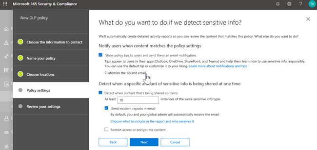

# 数据丢失防护和 Microsoft 团队

> [!NOTE]
> 最近将数据丢失防护功能添加到 Microsoft 团队聊天和面向用户许可的 Office 365 高级合规性的频道消息 (可用作独立选项), 并包含在 Office 365 E5 和 Microsoft 365 E5 合规性中。 若要了解有关许可要求的详细信息, 请参阅[Microsoft 365 租户级服务许可指南](https://docs.microsoft.com/office365/servicedescriptions/microsoft-365-service-descriptions/microsoft-365-tenantlevel-services-licensing-guidance)。

## 适用于 Microsoft 团队的 DLP 概述

最近,[数据丢失防护](data-loss-prevention-policies.md)(DLP) 功能进行了扩展, 以包括 Microsoft 团队聊天和频道消息。 如果你的组织拥有 DLP, 你现在可以定义策略, 以防止用户在 Microsoft 团队频道或聊天会话中共享敏感信息。 下面是有关此保护工作方式的一些示例:

- **示例 1: 保护邮件中的敏感信息**。 假定有人尝试在团队聊天或频道中与来宾 (外部用户) 共享敏感信息。 如果您定义了一个 DLP 策略来防止出现这种情况, 则会删除包含发送给外部用户的敏感信息的邮件。 这将根据您的 DLP 策略的配置方式在几秒内自动发生。

    > [!NOTE]
    > 当与 Microsoft 工作组用户共享时, Microsoft 团队的 DLP 将阻止敏感内容: - 团队和频道中的[来宾访问](https://docs.microsoft.com/MicrosoftTeams/guest-access);和 - 会议和聊天会话中的[外部访问](https://docs.microsoft.com/MicrosoftTeams/manage-external-access)。 
仅当发件人和收件人均处于 "仅团队" 模式并使用[Microsoft 团队本机联合身份验证](https://docs.microsoft.com/microsoftteams/manage-external-access)时, 才能使用 DLP 作为外部聊天会话。 对于 Skype for Business 或非本机联合聊天会话, 工作组的 DLP 不会阻止[互操作](https://docs.microsoft.com/microsoftteams/teams-and-skypeforbusiness-coexistence-and-interoperability#interoperability-of-teams-and-skype-for-business)性邮件。

- **示例 2: 保护文档中的敏感信息**。 假定有人尝试与 Microsoft 团队频道或聊天中的来宾共享文档, 并且文档包含敏感信息。 如果您定义了一个 DLP 策略来阻止这种情况, 则不会为这些用户打开该文档。 请注意, 在这种情况下, 您的 DLP 策略必须包括 SharePoint 和 OneDrive, 以便保护就绪。 (这是在 Microsoft 团队中显示的适用于 SharePoint 的 DLP for SharePoint, 因此要求用户授予 Office 365 DLP (包含在 Office 365 E3 中) 的许可, 但不要求用户授予 Office 365 高级合规性许可。)

## 策略提示有助于教育用户

与 DLP 在[Exchange、outlook 和 outlook 网页](data-loss-prevention-policies.md#policy-evaluation-in-exchange-online-outlook-and-outlook-on-the-web)版、 [SharePoint 和 OneDrive for Business 网站](data-loss-prevention-policies.md#policy-evaluation-in-onedrive-for-business-and-sharepoint-online-sites)以及[Office 桌面客户端](data-loss-prevention-policies.md#policy-evaluation-in-the-office-desktop-programs)中的工作方式类似, 当操作与 DLP 策略冲突时, 将显示策略提示。 下面是策略提示的一个示例:

在这种情况下, 发件人试图在 Microsoft 团队频道中共享社会保障号。 **我可以执行的操作？** link 打开一个对话框, 为发件人提供解决问题的选项。 请注意, 在这种情况下, 发件人可以选择替代策略, 也可以通知管理员查看和解决该策略。

在您的组织中, 您可以选择是否允许用户替代 DLP 策略。 在配置 DLP 策略时, 您可以使用默认策略提示, 也可以为您的组织[自定义策略提示](#to-customize-policy-tips)。 

返回到我们的示例, 其中发件人在团队频道中共享社会安全号码, 以下是收件人看到的内容:

"**这是什么？** " 链接将打开有关 DLP 策略的[文章](data-loss-prevention-policies.md), 可帮助解释阻止邮件的原因。

### 自定义策略提示

若要执行此任务, 必须为您分配具有编辑 DLP 策略的权限的角色。 若要了解详细信息，请参阅[权限](data-loss-prevention-policies.md#permissions)。

1. 转到 Office 365 安全 & 合规中心 ([https://protection.office.com](https://protection.office.com)) 并登录。

2. 选择 "**数据丢失防护** > **策略**"。 

3. 选择一个策略, 然后在 "**策略设置**" 旁边, 选择 "**编辑**"。

4. 为策略创建新规则, 或编辑现有规则。  

5. 在 "**用户通知**" 选项卡上, 选择 "**自定义电子邮件文本"** 和/或 **"自定义策略提示文本"** 选项。    

6. 指定要用于电子邮件通知和/或策略提示的文本, 然后选择 "**保存**"。 

7. 在 "**策略设置**" 选项卡上, 选择 "**保存**"。

允许大约一小时的更改通过数据中心工作并同步到用户帐户。
 
## 将 Microsoft 团队添加为现有 DLP 策略的位置

若要执行此任务, 必须为您分配具有编辑 DLP 策略的权限的角色。 若要了解详细信息，请参阅[权限](data-loss-prevention-policies.md#permissions)。

1. 转到 Office 365 安全 & 合规中心 ([https://protection.office.com](https://protection.office.com)) 并登录。

2. 选择 "**数据丢失防护** > **策略**"。 

3. 选择一个策略, 并查看 "**位置**" 下的值。 如果你看到**团队聊天和频道消息**, 一切都已设置。 如果不是, 请单击 "**编辑**"。  

4. 在 "**状态**" 列中, 为 "**团队聊天" 和 "频道消息**" 启用策略。  

5. 保留所有帐户的默认设置, 或指定要包含或排除的帐户。

6. 单击“保存”****。

允许大约一小时的更改通过数据中心工作并同步到用户帐户。

## 为 Microsoft 团队定义新的 DLP 策略

若要执行此任务, 必须为您分配具有编辑 DLP 策略的权限的角色。 若要了解详细信息，请参阅[权限](data-loss-prevention-policies.md#permissions)。

1. 转到 Office 365 安全 & 合规中心 ([https://protection.office.com](https://protection.office.com)) 并登录。

2. 选择 "**数据丢失防护** > **策略** > **+ 创建策略**"。 

3. 选择一个[模板](data-loss-prevention-policies.md#dlp-policy-templates), 然后选择 "**下一步**"。 在我们的示例中, 我们选择美国的 "个人身份信息" 数据模板。  

4. 在 "**命名策略**" 选项卡上, 指定策略的名称和说明, 然后选择 "**下一步**"。 

5. 在 "**选择位置**" 选项卡上, 保留 "所有位置" 的默认设置, 或选择 "**让我选择特定位置**", 然后选择 "**下一步**"。 如果选择了 "选择特定位置", 请选择 DLP 策略的位置, 然后选择 "**下一步**"。  
    > [!NOTE]
    > 如果要确保包含敏感信息的文档不会被不当共享, 请确保**SharePoint 网站**和**OneDrive 帐户**以及**团队聊天和频道消息**都已打开。
 

6. 在 "**策略设置**" 选项卡上的 "**自定义要保护的内容类型**" 下, 保留默认的简单设置, 或选择 "**使用高级设置**", 然后选择 "**下一步**"。 如果选择 "高级设置", 则可以为策略创建或编辑规则。 (若要获取有关此方面的帮助, 请参阅[简单设置与高级设置](data-loss-prevention-policies.md#simple-settings-vs-advanced-settings)。)

7.  在 "**策略设置**" 选项卡上的 "**如果检测到敏感信息, 您希望执行什么操作？**" 下, 查看设置。 (你可以在此处选择保留默认[策略提示和电子邮件通知](use-notifications-and-policy-tips.md), 或对其进行自定义。)  完成查看或编辑设置后, 选择 "**下一步**"。

8. 在 "**策略设置**" 选项卡上, 在 "**是否要打开策略或先进行测试？**" 下, 选择是要将策略打开、[先测试](data-loss-prevention-policies.md#roll-out-dlp-policies-gradually-with-test-mode)还是将其保持关闭状态, 然后选择 "**下一步**"。  

9. 在 "**查看您的设置**" 选项卡上, 查看新策略的设置。 选择 "**编辑**" 以进行更改。 完成后, 选择 "**创建**"。 

为新策略留出约一小时的时间, 以便通过数据中心并同步到用户帐户。

## 相关文章

[创建、测试和优化 DLP 策略](create-test-tune-dlp-policy.md)

[发送电子邮件通知并显示 DLP 策略的策略提示](use-notifications-and-policy-tips.md)
