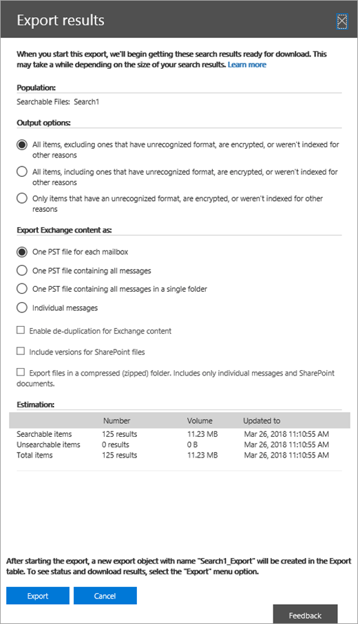

# <a name="ediscovery-cases-in-the-office-365-security-amp-compliance-center"></a><span data-ttu-id="60925-105">Office 365 安全性的电子数据展示事例&amp;合规性中心</span><span class="sxs-lookup"><span data-stu-id="60925-105">eDiscovery cases in the Office 365 Security &amp; Compliance Center</span></span>

<span data-ttu-id="60925-p102">您可以在 Office 365 安全性使用电子数据展示事例&amp;以控制哪些人可以创建、 访问和管理组织中的电子数据展示事例的合规性中心。如果您的组织的 Office 365 E5 订阅，您可以使用电子数据展示事例来分析通过使用 Office 365 高级电子数据展示搜索结果。</span><span class="sxs-lookup"><span data-stu-id="60925-p102">You can use eDiscovery cases in the Office 365 Security &amp; Compliance Center to control who can create, access, and manage eDiscovery cases in your organization. If your organization has an Office 365 E5 subscription, you can also use eDiscovery cases to analyze search results by using Office 365 Advanced eDiscovery.</span></span>
  
<span data-ttu-id="60925-p103">电子数据展示事例允许您将成员添加到事例，控制哪些类型的特定案例成员可以执行，将内容位置置于保留与法律案件，并将多个内容搜索关联与单个用例的操作。此外可以导出与案例相关联的任何内容搜索的结果或准备分析高级电子数据展示中搜索结果。电子数据展示事例是限制谁有权访问内容的搜索和搜索结果的特定法律案件组织中的好方法。</span><span class="sxs-lookup"><span data-stu-id="60925-p103">An eDiscovery case allows you to add members to a case, control what types of actions that specific case members can perform, place a hold on content locations relevant to a legal case, and associate multiple Content Searches with a single case. You can also export the results of any Content Search that is associated with a case or prepare search results for analysis in Advanced eDiscovery. eDiscovery cases are a good way to limit who has access to Content Searches and search results for a specific legal case in your organization.</span></span>
  
<span data-ttu-id="60925-111">使用以下工作流设置和中安全使用电子数据展示事例&amp;合规性中心和高级电子数据展示。</span><span class="sxs-lookup"><span data-stu-id="60925-111">Use the following workflow to set up and use eDiscovery cases in the Security &amp; Compliance Center and Advanced eDiscovery.</span></span>

[<span data-ttu-id="60925-112">步骤 1：向潜在事例成员分配电子数据展示权限</span><span class="sxs-lookup"><span data-stu-id="60925-112">Step 1: Assign eDiscovery permissions to potential case members</span></span>](#step-1-assign-ediscovery-permissions-to-potential-case-members)

[<span data-ttu-id="60925-113">步骤 2： 创建新的案例</span><span class="sxs-lookup"><span data-stu-id="60925-113">Step 2: Create a new case</span></span>](#step-2-create-a-new-case)

[<span data-ttu-id="60925-114">步骤 3： 将成员添加到事例</span><span class="sxs-lookup"><span data-stu-id="60925-114">Step 3: Add members to a case</span></span>](#step-3-add-members-to-a-case)

[<span data-ttu-id="60925-115">步骤 4： 位置上的内容位置保留</span><span class="sxs-lookup"><span data-stu-id="60925-115">Step 4: Place content locations on hold</span></span>](#step-4-place-content-locations-on-hold)

[<span data-ttu-id="60925-116">步骤 5： 创建并运行与案例相关的内容搜索</span><span class="sxs-lookup"><span data-stu-id="60925-116">Step 5: Create and run a Content Search associated with a case</span></span>](#step-5-create-and-run-a-content-search-associated-with-a-case)

[<span data-ttu-id="60925-117">步骤 6： 导出与案例相关的内容搜索的结果</span><span class="sxs-lookup"><span data-stu-id="60925-117">Step 6: Export the results of a Content Search associated with a case</span></span>](#step-6-export-the-results-of-a-content-search-associated-with-a-case)

[<span data-ttu-id="60925-118">步骤 7： 准备搜索结果的高级电子数据展示</span><span class="sxs-lookup"><span data-stu-id="60925-118">Step 7: Prepare search results for Advanced eDiscovery</span></span>](#step-7-prepare-search-results-for-advanced-ediscovery)

[<span data-ttu-id="60925-119">步骤 8： 转到中高级电子数据展示事例</span><span class="sxs-lookup"><span data-stu-id="60925-119">Step 8: Go to the case in Advanced eDiscovery</span></span>](#step-8-go-to-the-case-in-advanced-ediscovery)

[<span data-ttu-id="60925-120">（可选）步骤 9： 关闭的用例</span><span class="sxs-lookup"><span data-stu-id="60925-120">(Optional) Step 9: Close a case</span></span>](#optional-step-9-close-a-case)

[<span data-ttu-id="60925-121">（可选）步骤 10： 重新打开结束的案例</span><span class="sxs-lookup"><span data-stu-id="60925-121">(Optional) Step 10: Re-open a closed case</span></span>](#optional-step-10-re-open-a-closed-case)

[<span data-ttu-id="60925-122">详细信息</span><span class="sxs-lookup"><span data-stu-id="60925-122">More information</span></span>](#more-information)
  
## <a name="step-1-assign-ediscovery-permissions-to-potential-case-members"></a><span data-ttu-id="60925-123">步骤 1：向潜在事例成员分配电子数据展示权限</span><span class="sxs-lookup"><span data-stu-id="60925-123">Step 1: Assign eDiscovery permissions to potential case members</span></span>

<span data-ttu-id="60925-p104">第一步是将适当的电子数据展示相关权限分配给的人员，以便您可以将其添加到在步骤 2 中电子数据展示事例。您必须是组织管理角色组的成员 （或分配的角色管理角色） Office 365 安全性&amp;合规性中心分配电子数据展示权限。以下列表描述安全中的电子数据展示相关的角色组&amp;合规性中心。</span><span class="sxs-lookup"><span data-stu-id="60925-p104">The first step is to assign the appropriate eDiscovery-related permissions to people so you can add them to an eDiscovery case in Step 2. You have to be a member of the Organization Management role group (or be assigned the Role Management role) in the Office 365 Security &amp; Compliance Center to assign eDiscovery permissions. The following list describes the eDiscovery-related role groups in the Security &amp; Compliance Center.</span></span>
  
- <span data-ttu-id="60925-p105">**审阅者**-该角色组具有的最严格的电子数据展示相关权限。此组的成员只能查看和打开中安全性的列表的用例**电子数据展示**页上的&amp;他们是成员的合规性中心。他们无法创建情况下，将成员添加到事例、 创建保留项、 创建搜索、 导出搜索结果中，或准备高级电子数据展示的结果。但是，成员可以访问高级电子数据展示执行分析任务中的情况。</span><span class="sxs-lookup"><span data-stu-id="60925-p105">**Reviewer** - This role group has the most restrictive eDiscovery-related permissions. Members of this group can only see and open the list of the cases on the **eDiscovery** page in the Security &amp; Compliance Center that they are members of. They can't create cases, add members to a case, create holds, create searches, export search results, or prepare results for Advanced eDiscovery. However, members can access cases in Advanced eDiscovery to perform analysis tasks.</span></span> 
    
- <span data-ttu-id="60925-p106">**电子数据展示 Manager** -此角色组的成员可以创建和管理电子数据展示事例。他们可以添加和删除成员、 放置位置上的保留、 创建和编辑与案例相关的内容搜索、 内容搜索结果导出的内容和准备分析高级电子数据展示中搜索结果。有此角色组中的两个子组。这些组子组之间的差异基于范围。</span><span class="sxs-lookup"><span data-stu-id="60925-p106">**eDiscovery Manager** - Members of this role group can create and manage eDiscovery cases. They can add and remove members, place content locations on hold, create and edit Content Searches associated with a case, export the results of a Content Search, and prepare search results for analysis in Advanced eDiscovery. There are two sub-groups in this role group. The difference between these subgroups is based on scope.</span></span>
    
  - <span data-ttu-id="60925-p107">**电子数据展示 Manager** -可以查看和管理电子数据展示事例他们创建或的成员。如果另一个电子数据展示管理器创建案例，但不将第二个电子数据展示经理添加为这种情况下的成员，第二个电子数据展示管理器将无法查看或在安全中打开**电子数据展示**页上的情况&amp;合规性中心。电子数据展示管理员还可以访问其高级电子数据展示执行分析任务中的情况。</span><span class="sxs-lookup"><span data-stu-id="60925-p107">**eDiscovery Manager** - Can view and manage the eDiscovery cases they create or are a member of. If another eDiscovery Manager creates a case but doesn't add a second eDiscovery Manager as a member of that case, the second eDiscovery Manager won't be able to view or open the case on the **eDiscovery** page in the Security &amp; Compliance Center. eDiscovery Managers can also access their cases in Advanced eDiscovery to perform analysis tasks.</span></span> 
    
  - <span data-ttu-id="60925-p108">**电子数据展示管理员**-可以执行电子数据展示中管理器可执行的所有案例管理任务。此外，电子数据展示管理员可以：</span><span class="sxs-lookup"><span data-stu-id="60925-p108">**eDiscovery Administrator** - Can perform all case management tasks that an eDiscovery Manager can do. Additionally, an eDiscovery Administrator can:</span></span>
    
    - <span data-ttu-id="60925-140">在**电子数据展示**页上查看列出的所有情况。</span><span class="sxs-lookup"><span data-stu-id="60925-140">View all cases that are listed on the **eDiscovery** page.</span></span> 
    
    - <span data-ttu-id="60925-141">管理组织中的任何电子数据展示事例之后他们将自己添加为用例的成员。</span><span class="sxs-lookup"><span data-stu-id="60925-141">Manage any eDiscovery case in the organization after they add themself as a member of the case.</span></span>
    
    - <span data-ttu-id="60925-p109">高级电子数据展示，如处理案例数据分析、 配置案例设置和从高级电子数据展示导出数据中执行管理任务。这是因为电子数据展示管理员安全中某个人&amp;合规性中心会自动添加为高级电子数据展示中的管理员。</span><span class="sxs-lookup"><span data-stu-id="60925-p109">Perform administrative tasks in Advanced eDiscovery, such as processing case data for analysis, configuring case settings, and exporting data from Advanced eDiscovery. This is because a person who is an eDiscovery Administrator in the Security &amp; Compliance Center is automatically added as an administrator in Advanced eDiscovery.</span></span>
    
    <span data-ttu-id="60925-144">请参阅[More information](ediscovery-cases.md#moreinfo_1)部分，了解为什么您可能需要组织中的电子数据展示管理员。</span><span class="sxs-lookup"><span data-stu-id="60925-144">See the [More information](ediscovery-cases.md#moreinfo_1) section for reasons why you may want an eDiscovery Administrator in your organization.</span></span> 
    
> [!IMPORTANT]
> <span data-ttu-id="60925-145">如果联系人不是一个这些电子数据展示相关的角色组的成员或不是已分配的审阅者角色的角色组的成员，不能将其添加为电子数据展示事例的成员。</span><span class="sxs-lookup"><span data-stu-id="60925-145">If a person isn't a member of one of these eDiscovery-related role groups, or isn't a member of a role group that's assigned the Reviewer role, you can't add them as a member of an eDiscovery case.</span></span> 
  
 <span data-ttu-id="60925-146">**分配电子数据展示权限：**</span><span class="sxs-lookup"><span data-stu-id="60925-146">**To assign eDiscovery permissions:**</span></span>
  
1. <span data-ttu-id="60925-147">转到[https://protection.office.com](https://protection.office.com)。</span><span class="sxs-lookup"><span data-stu-id="60925-147">Go to [https://protection.office.com](https://protection.office.com).</span></span>
    
2. <span data-ttu-id="60925-148">登录到 Office 365 使用工作或学校帐户。</span><span class="sxs-lookup"><span data-stu-id="60925-148">Sign in to Office 365 using your work or school account.</span></span>
    
3. <span data-ttu-id="60925-149">安全中&amp;合规性中心，单击**权限**，然后执行基于您想要分配的电子数据展示权限下列选项之一。</span><span class="sxs-lookup"><span data-stu-id="60925-149">In the Security &amp; Compliance Center, click **Permissions**, and then do one of the following based on the eDiscovery permissions that you want to assign.</span></span>
    
    - <span data-ttu-id="60925-p110">分配审阅者权限，选择**审阅者**角色组，，然后单击**成员**，旁边的**编辑**。单击**选择成员**，单击**编辑**，单击**添加**，选择您想要添加到审阅者角色组的用户和然后单击**添加**。</span><span class="sxs-lookup"><span data-stu-id="60925-p110">To assign Reviewer permissions, select the **Reviewer** role group, and then next to **Members**, click **Edit**. Click **Choose members**, click **Edit**, click  **Add**, select the user that you want to add to the Reviewer role group, and then click **Add**.</span></span>
    
    - <span data-ttu-id="60925-p111">分配电子数据展示管理员权限，选择的**电子数据展示管理员**角色组中，，然后单击**电子数据展示管理器**，旁边的**编辑**。单击**选择电子数据展示管理器中**，单击**编辑**，单击* * 添加 * *，请选择您要添加电子数据展示中管理器中，为用户，然后单击**添加**。</span><span class="sxs-lookup"><span data-stu-id="60925-p111">To assign eDiscovery Manager permissions, select the **eDiscovery Manager** role group, and then next to **eDiscovery Manager**, click **Edit**. Click **Choose eDiscovery Manager**, click **Edit**, click  ** Add **, select the user that you want to add as an eDiscovery Manager, and then click **Add**.</span></span>
    
    - <span data-ttu-id="60925-p112">分配电子数据展示管理员权限，选择的**电子数据展示管理员**角色组中，，然后单击**电子数据展示管理员**，旁边的**编辑**。单击**选择电子数据展示管理员**，单击**编辑**，单击**添加**，选择您要添加为电子数据展示管理员的用户，然后单击**添加**。</span><span class="sxs-lookup"><span data-stu-id="60925-p112">To assign eDiscovery Administrator permissions, select the **eDiscovery Manager** role group, and then next to **eDiscovery Administrator**, click **Edit**. Click **Choose eDiscovery Administrator**, click **Edit**, click  **Add**, select the user that you want to add as an eDiscovery Administrator, and then click **Add**.</span></span>
    
4. <span data-ttu-id="60925-156">添加的所有用户后，单击**完成**，单击**保存**以向角色组中，保存所做的更改，然后单击**关闭**。</span><span class="sxs-lookup"><span data-stu-id="60925-156">After you've added all the users, click **Done**, click **Save** to save the changes to the role group, and then click **Close**.</span></span>

## <a name="step-2-create-a-new-case"></a><span data-ttu-id="60925-157">步骤 2： 创建新的案例</span><span class="sxs-lookup"><span data-stu-id="60925-157">Step 2: Create a new case</span></span>

<span data-ttu-id="60925-p113">下一步是创建新的电子数据展示案例。您必须是要创建电子数据展示事例的电子数据展示管理员角色组的成员。如上文所述，在安全中创建新的案例后&amp;合规性中心，您 （和其他案例成员） 将能够访问相同的大小写，高级电子数据展示如果您的组织中具有的 Office 365 E5 订阅。</span><span class="sxs-lookup"><span data-stu-id="60925-p113">The next step is to create a new eDiscovery case. You must be a member of the eDiscovery Managers role group to create eDiscovery cases. As previously explained, after you create a new case in the Security &amp; Compliance Center, you (and other case members) will be able to access that same case in Advanced eDiscovery if you're organization has an Office 365 E5 subscription.</span></span>
  
1. <span data-ttu-id="60925-161">转到[https://protection.office.com](https://protection.office.com)。</span><span class="sxs-lookup"><span data-stu-id="60925-161">Go to [https://protection.office.com](https://protection.office.com).</span></span>
    
2. <span data-ttu-id="60925-162">登录到 Office 365 使用工作或学校帐户。</span><span class="sxs-lookup"><span data-stu-id="60925-162">Sign in to Office 365 using your work or school account.</span></span>
    
3. <span data-ttu-id="60925-163">安全中&amp;合规性中心，单击**搜索&amp;调查** \> **电子数据展示**，，然后单击**创建用例**。</span><span class="sxs-lookup"><span data-stu-id="60925-163">In the Security &amp; Compliance Center, click **Search &amp; investigation** \> **eDiscovery**, and then click  **Create a case**.</span></span>
    
4. <span data-ttu-id="60925-p114">在**新的案例**页上，指定名称的大小写，键入可选说明，，然后单击**保存**。请注意，必须在您的组织中唯一的大小写的名称。</span><span class="sxs-lookup"><span data-stu-id="60925-p114">On the **New Case** page, give the case a name, type an optional description, and then click **Save**. Note that the case name must be unique in your organization.</span></span>
    
    
  
    <span data-ttu-id="60925-p115">在**电子数据展示**页上的情况下的列表中显示新的案例。请注意，可以将光标悬停在案例名称以显示有关的情况下，包括案例 （**活动**或**已关闭**） 的状态信息的 （即在上一步中创建） 的情况下，说明和上次更改大小写和谁更改。</span><span class="sxs-lookup"><span data-stu-id="60925-p115">The new case is displayed in the list of cases on the **eDiscovery** page. Note that you can hover the cursor over a case name to display information about the case, including the status of the case ( **Active** or **Closed**), the description of the case (that was created in the previous step), and when the case was changed last and who changed it.</span></span>
    
    > [!TIP]
    > <span data-ttu-id="60925-p116">创建新的案例后，可以随时重。只需单击**电子数据展示**页上的情况的名称。在**这种情况下管理**弹出页上，在**名称**框中显示名称更改，然后保存更改。</span><span class="sxs-lookup"><span data-stu-id="60925-p116">After you create a new case, you can rename it anytime. Just click the name of the case on the **eDiscovery** page. On the **Manage this case** flyout page, change the name displayed in the box under **Name**, and then save the change.</span></span> 
  
## <a name="step-3-add-members-to-a-case"></a><span data-ttu-id="60925-172">步骤 3： 将成员添加到事例</span><span class="sxs-lookup"><span data-stu-id="60925-172">Step 3: Add members to a case</span></span>

<span data-ttu-id="60925-p117">创建新的案例后下, 一步是将成员添加到这种情况。与以前所述，仅限审阅者的成员的用户也可以将电子数据展示管理员角色组添加为大小写的成员。请注意，电子数据展示经理创建这种情况会自动添加为成员。</span><span class="sxs-lookup"><span data-stu-id="60925-p117">After you create a new case, the next step is to add members to the case. As previous explained, only users who are members of the Reviewer or eDiscovery Manager role groups can be added as members of the case. Note that the eDiscovery Manager who created the case is automatically added as a member.</span></span>
  
1. <span data-ttu-id="60925-176">安全中&amp;合规性中心，单击**搜索&amp;调查** \> **电子数据展示**案例列表中的显示您的组织中。</span><span class="sxs-lookup"><span data-stu-id="60925-176">In the Security &amp; Compliance Center, click **Search &amp; investigation** \> **eDiscovery** to display the list of cases in your organization.</span></span> 
    
2. <span data-ttu-id="60925-177">单击您想要将成员添加到用例的名称。</span><span class="sxs-lookup"><span data-stu-id="60925-177">Click the name of the case that you want to add members to.</span></span>
    
    <span data-ttu-id="60925-178">将显示**管理本例**弹出页。</span><span class="sxs-lookup"><span data-stu-id="60925-178">The **Manage this case** flyout page is displayed.</span></span> 
    
    
  
3. <span data-ttu-id="60925-180">在**管理成员**下单击**添加**将成员添加到这种情况。</span><span class="sxs-lookup"><span data-stu-id="60925-180">Under **Manage members**, click  **Add** to add members to the case.</span></span> 
    
    <span data-ttu-id="60925-p118">您还可以选择将角色组添加到这种情况。在**管理角色组**下, 单击**添加**。</span><span class="sxs-lookup"><span data-stu-id="60925-p118">You can also choose to add a role group to the case. Under **Manage role groups**, click  **Add**.</span></span>
    
4. <span data-ttu-id="60925-183">在可以作为案例的成员添加的人员或角色组的列表中，单击您要添加的人员或角色组的名称旁边的复选框。</span><span class="sxs-lookup"><span data-stu-id="60925-183">In the list of people or role groups that can be added as members of the case, click the check box next to the names of the people or role groups that you want to add.</span></span>
    
    > [!TIP]
    > <span data-ttu-id="60925-184">如果您有大型列表的人员可以添加为成员，使用**搜索**框中列表的特定人员搜索。</span><span class="sxs-lookup"><span data-stu-id="60925-184">If you have a large list of people who can added as members, use the **Search** box to search for a specific person in the list.</span></span> 
  
5. <span data-ttu-id="60925-185">选择要添加为组的成员的人员或角色组后，单击**添加**。</span><span class="sxs-lookup"><span data-stu-id="60925-185">After you've selected the people or role groups to add as members of the group, click **Add**.</span></span>
    
    <span data-ttu-id="60925-186">中**管理这种情况下**，单击**保存**保存新案例成员的列表。</span><span class="sxs-lookup"><span data-stu-id="60925-186">In **Manage this case**, click **Save** to save the new list of case members.</span></span> 
    
6. <span data-ttu-id="60925-187">单击**保存**以保存新案例成员的列表。</span><span class="sxs-lookup"><span data-stu-id="60925-187">Click **Save** to save the new list of case members.</span></span> 
  
## <a name="step-4-place-content-locations-on-hold"></a><span data-ttu-id="60925-188">步骤 4： 位置上的内容位置保留</span><span class="sxs-lookup"><span data-stu-id="60925-188">Step 4: Place content locations on hold</span></span>

<span data-ttu-id="60925-p119">电子数据展示事例可用于创建保留项以保留可能与案例相关的内容。您可以置于保留的邮箱和 OneDrive 业务网站的情况的管理员的人员。您还可以进行保留组邮箱、 SharePoint 网站和 OneDrive for Business 站点 for Office 365 组。同样，您可以置于保留的邮箱和关联的 Microsoft 团队使用的网站。当内容位置将置于保持状态时，将保存内容，直到您删除保留的内容的位置，或者直到取消删除保留。</span><span class="sxs-lookup"><span data-stu-id="60925-p119">You can use an eDiscovery case to create holds to preserve content that might be relevant to the case. You can place a hold on the mailboxes and OneDrive for Business sites of people who are custodians in the case. You can also place a hold on the group mailbox, SharePoint site, and OneDrive for Business site for an Office 365 Group. Similarly, you can place a hold on the mailbox and site that are associated with Microsoft Teams. When you place content locations on hold, content is held until you remove the hold from the content location or until you delete the hold.</span></span>
  
<span data-ttu-id="60925-194">创建保留项时，您具有以下选项范围保留在指定的内容位置的内容：</span><span class="sxs-lookup"><span data-stu-id="60925-194">When you create a hold, you have the following options to scope the content that is held in the specified content locations:</span></span>
  
- <span data-ttu-id="60925-p120">创建所有内容将都置于保持状态无限期保留。或者，您可以创建基于查询的保留匹配一个搜索查询的唯一内容置于保持状态。</span><span class="sxs-lookup"><span data-stu-id="60925-p120">You create an infinite hold where all content is placed on hold. Alternatively, you can create a query-based hold where only content that matches a search query is placed on hold.</span></span>
    
- <span data-ttu-id="60925-p121">您可以指定日期范围以保留内容发送、 接收，或创建的日期范围内。此外，您可以保留无论时发送、 接收，或创建的所有内容。</span><span class="sxs-lookup"><span data-stu-id="60925-p121">You can specify a date range to hold only the content that was sent, received, or created within that date range. Alternatively, you can hold all content regardless of when it was sent, received, or created.</span></span>
    
> [!NOTE]
> <span data-ttu-id="60925-199">您可以最多 10,000 个跨组织中的所有电子数据展示事例保留策略。</span><span class="sxs-lookup"><span data-stu-id="60925-199">You can have a maximum of 10,000 hold policies across all eDiscovery cases in your organization.</span></span> 
  
<span data-ttu-id="60925-200">若要创建的电子数据展示事例保留：</span><span class="sxs-lookup"><span data-stu-id="60925-200">To create a hold for an eDiscovery case:</span></span>
  
1. <span data-ttu-id="60925-201">安全中&amp;合规性中心，单击**搜索&amp;调查** \> **电子数据展示**案例列表中的显示您的组织中。</span><span class="sxs-lookup"><span data-stu-id="60925-201">In the Security &amp; Compliance Center, click **Search &amp; investigation** \> **eDiscovery** to display the list of cases in your organization.</span></span> 
    
2. <span data-ttu-id="60925-202">单击旁边的情况下，您想要创建保留项中的**打开**。</span><span class="sxs-lookup"><span data-stu-id="60925-202">Click **Open** next to the case that you want to create the holds in.</span></span> 
    
3. <span data-ttu-id="60925-203">在**主页**上用例，单击**保存**选项卡。</span><span class="sxs-lookup"><span data-stu-id="60925-203">On the **Home** page for the case, click the **Hold** tab.</span></span> 
    
    
  
4. <span data-ttu-id="60925-205">在**保留**页上单击**创建**。</span><span class="sxs-lookup"><span data-stu-id="60925-205">On the **Hold** page, click  **Create**.</span></span>
    
5. <span data-ttu-id="60925-p122">在**名称您保留**页中，赋予保留项的名称。保留项的名称必须是您的组织中唯一的。</span><span class="sxs-lookup"><span data-stu-id="60925-p122">On the **Name your hold** page, give the hold a name. The name of the hold must be unique in your organization.</span></span> 
    
    
  
6. <span data-ttu-id="60925-209">（可选）在**说明**框中，添加的保留项的说明。</span><span class="sxs-lookup"><span data-stu-id="60925-209">(Optional) In the **Description** box, add a description of the hold.</span></span> 
    
7. <span data-ttu-id="60925-210">单击"下一步"。</span><span class="sxs-lookup"><span data-stu-id="60925-210">Click **Next**.</span></span>
    
8. <span data-ttu-id="60925-p123">选择您想要置于内容位置保留。您可以将置于保持状态的邮箱、 网站和公用文件夹。</span><span class="sxs-lookup"><span data-stu-id="60925-p123">Choose the content locations that you want to place on hold. You can place mailboxes, sites, and public folders on hold.</span></span>
    
    
  
   <span data-ttu-id="60925-p124">答： **Exchange 电子邮件**-单击**选择用户、 组或团队**，然后再次单击**选择用户、 组或团队**。若要指定要将置于保持状态的邮箱。使用搜索框查找用户邮箱和通讯组 （用于组成员的邮箱置于保留） 以将置于保持状态。此外可以为 Office 365 组或 Microsoft 团队对关联的邮箱进行保留。选择用户、 组和团队复选框，单击**选择**，然后单击**完成**。</span><span class="sxs-lookup"><span data-stu-id="60925-p124">a. **Exchange email** - Click **Choose users, groups, or teams** and then click **Choose users, groups, or teams** again. to specify mailboxes to place on hold. Use the search box to find user mailboxes and distribution groups (to place a hold on the mailboxes of group members) to place on hold. You can also place a hold on the associated mailbox for an Office 365 Group or a Microsoft Team. Select the user, group, team check box, click **Choose**, and then click **Done**.</span></span>
    
    > [!NOTE]
    > <span data-ttu-id="60925-p125">当您单击**选择用户、 组或团队**以指定要将置于保持状态的邮箱，显示邮箱选取器为空。这是设计以提高性能。要将联系人添加到此列表中，请在搜索框中键入名称 （最少的 3 个字符）。</span><span class="sxs-lookup"><span data-stu-id="60925-p125">When you click **Choose users, groups, or teams** to specify mailboxes to place on hold, the mailbox picker that's displayed is empty. This is by design to enhance performance. To add people to this list, type a name (a minimum of 3 characters) in the search box.</span></span> 
  
   <span data-ttu-id="60925-p126">b. **SharePoint 网站**-单击**选择站点**，然后单击再次要指定 SharePoint 和 OneDrive for Business 站点置于保留的**选择网站**。键入您想要将置于保持状态的每个网站的 URL。您还可以为 Office 365 组或 Microsoft 团队添加 SharePoint 网站的 URL。单击**选择**，然后单击**完成**。</span><span class="sxs-lookup"><span data-stu-id="60925-p126">b. **SharePoint Sites** - Click **Choose sites** and then click **Choose sites** again to specify SharePoint and OneDrive for Business sites to place on hold. Type the URL for each site that you want to place on hold. You can also add the URL for the SharePoint site for an Office 365 Group or a Microsoft Team. Click **Choose**, and then click **Done**.</span></span>
    
    <span data-ttu-id="60925-228">请参阅上放置置于保持状态的 Office 365 组和 Microsoft 团队的提示和技巧[详细信息](ediscovery-cases.md#moreinfo_1)部分。</span><span class="sxs-lookup"><span data-stu-id="60925-228">See the [More information](ediscovery-cases.md#moreinfo_1) section for tips on putting Office 365 Groups and Microsoft Teams on hold.</span></span> 
    
    > [!NOTE]
    > <span data-ttu-id="60925-p127">在联系人的用户主体名称 (UPN) 已更改的情况很少，其 OneDrive 帐户的 URL 还将更改为合并新的 UPN。如果发生这种情况，您将需要通过添加用户的新 OneDrive URL 和删除旧修改保留项。</span><span class="sxs-lookup"><span data-stu-id="60925-p127">In the rare case that a person's user principal name (UPN) is changed, the URL for their OneDrive account will also be changed to incorporate the new UPN. If this happens, you'll have to modify the hold by adding the user's new OneDrive URL and removing the old one.</span></span> 
  
   <span data-ttu-id="60925-p128">c. **Exchange 公用文件夹**-移动切换开关到要将所有公用文件夹放保持在 Exchange Online 组织中的**所有**位置。请注意，不能选择特定的公用文件夹，以将置于保持状态。保留设置为**None** ，如果您不想要保留置于公用文件夹切换开关。</span><span class="sxs-lookup"><span data-stu-id="60925-p128">c. **Exchange public folders** - Move the toggle switch  to the **All** position to put all public folders in your Exchange Online organization on hold. Note that you can't choose specific public folders to put on hold. Leave the toggle switch set to **None** if you don't want to put a hold on public folders.</span></span>
    
9. <span data-ttu-id="60925-235">完成添加到保留项的内容位置后，单击**下一步**。</span><span class="sxs-lookup"><span data-stu-id="60925-235">When you're done adding content locations to the hold, click **Next**.</span></span>
    
10. <span data-ttu-id="60925-p129">若要创建基于查询的保留与条件，完成以下。否则，只需单击**下一步**</span><span class="sxs-lookup"><span data-stu-id="60925-p129">To create a query-based hold with conditions, complete the following. Otherwise, just click **Next**</span></span>
    
    
  
    
       <span data-ttu-id="60925-p130">a.在在**关键字**下框中，键入搜索查询的框中，以便仅符合搜索条件的内容置于保留。您可以指定关键字、 消息属性或文档属性，如文件名。您还可以使用更复杂的查询的布尔运算符，例如**AND**、 **OR**、 或**不**使用。如果您保留关键字框为空，则位于指定的内容位置的所有内容将都置于保持状态。</span><span class="sxs-lookup"><span data-stu-id="60925-p130">a. In the box under **Keywords**, type a search query in the box so that only the content that meets the search criteria is placed on hold. You can specify keywords, message properties, or document properties, such as file names. You can also use more complex queries that use a Boolean operator, such as **AND**, **OR**, or **NOT**. If you leave the keyword box empty, then all content located in the specified content locations will be placed on hold.</span></span>
    
    <span data-ttu-id="60925-p131">b.单击**添加条件**，若要添加一个或多个条件以缩小范围的搜索查询的保留项。每个条件将子句添加到 KQL 搜索查询创建和运行时创建保留项。例如可以指定日期范围，以便电子邮件或网站的日期范围内创建的文档置于保持状态。条件逻辑**AND**运算符通过连接到 （在关键字框中指定） 的关键字查询。意味着项目需要满足关键字查询和条件的置于保持状态。</span><span class="sxs-lookup"><span data-stu-id="60925-p131">b. Click  **Add conditions** to add one or more conditions to narrow the search query for the hold. Each condition adds a clause to the KQL search query that is created and run when you create the hold. For example you can specify a date range so that email or site documents that were created within the date ranged are placed on hold. A condition is logically connected to the keyword query (specified in the keyword box) by the **AND** operator. That means that items have to satisfy both the keyword query and the condition to be placed on hold.</span></span>

    <span data-ttu-id="60925-250">有关创建搜索查询和使用情况的详细信息，请参阅[关键字查询和内容搜索的搜索条件](keyword-queries-and-search-conditions.md)。</span><span class="sxs-lookup"><span data-stu-id="60925-250">For more information about creating a search query and using conditions, see [Keyword queries and search conditions for Content Search](keyword-queries-and-search-conditions.md).</span></span>
    
11. <span data-ttu-id="60925-251">后配置基于查询的保留，单击**下一步**。</span><span class="sxs-lookup"><span data-stu-id="60925-251">After configuring a query-based hold, click **Next**.</span></span>
    
12. <span data-ttu-id="60925-252">检查您的设置，然后单击**创建此保留**。</span><span class="sxs-lookup"><span data-stu-id="60925-252">Review your settings, and then click **Create this hold**.</span></span>
    
### <a name="hold-statistics"></a><span data-ttu-id="60925-253">保留统计信息</span><span class="sxs-lookup"><span data-stu-id="60925-253">Hold statistics</span></span>

<span data-ttu-id="60925-p132">后一段时间，在所选保留项的**保留**页面上的详细信息窗格中显示有关新保留的信息。此信息包括的邮箱数和上的网站保留统计信息的内容的已置于保留，如置于保持状态的总数量和大小的项目和上一次的保留计算的统计信息。这些保留统计信息帮助您确定要保留与电子数据展示案例相关的内容量。</span><span class="sxs-lookup"><span data-stu-id="60925-p132">After a while, information about the new hold is displayed in the details pane on the **Holds** page for the selected hold. This information includes the number of mailboxes and sites on hold and statistics about the content that was placed on hold, such as the total number and size of items placed on hold and the last time the hold statistics were calculated. These hold statistics help you identify how much content that's related to the eDiscovery case is being held.</span></span> 
  

  
<span data-ttu-id="60925-258">注意有关保留统计信息并按以下几点：</span><span class="sxs-lookup"><span data-stu-id="60925-258">Keep the following things in mind about hold statistics:</span></span>
  
- <span data-ttu-id="60925-p133">置于保留状态的项目总数指示置于保持状态的所有内容源中的项目数。如果您已创建基于查询的保留，此统计信息指示与查询匹配的项目数。</span><span class="sxs-lookup"><span data-stu-id="60925-p133">The total number of items on hold indicates the number of items from all content sources that are placed on hold. If you've created a query-based hold, this statistic indicates the number of items that match the query.</span></span>
    
- <span data-ttu-id="60925-p134">置于保留状态的项目数还包括内容的位置中找到的未编制索引的项。请注意，是否创建基于查询的保留，但内容的位置中的所有未编制索引的项目置于保持状态。这包括与搜索条件的基于查询的保留不匹配的未编制索引的项和可能属于外部日期范围条件的未编制索引的项。这是不同于运行内容的搜索，在其中未编制索引的项不匹配的搜索查询或排除的日期范围条件不包括在搜索结果时，会发生什么情况。有关未编制索引的项目的详细信息，请参阅[部分，索引项目在 Office 365 中的内容搜索](partially-indexed-items-in-content-search.md)。</span><span class="sxs-lookup"><span data-stu-id="60925-p134">The number of items on hold also includes unindexed items found in the content locations. Note that if you create a query-based hold, all unindexed items in the content locations are placed on hold. This includes unindexed items that don't match the search criteria of a query-based hold and unindexed items that might fall outside of a date range condition. This is different than what happens when you run a Content Search, in which unindexed items that don't match the search query or are excluded by a date range condition aren't included in the search results. For more information about unindexed items, see [Partially indexed items in Content Search in Office 365](partially-indexed-items-in-content-search.md).</span></span>
    
- <span data-ttu-id="60925-p135">您可以获取最新保留通过单击**更新统计信息**重新运行搜索的统计信息估计的计算的保留项的当前数目。如有必要，单击**刷新**在工具栏中更新的详细信息窗格中的保留统计信息。</span><span class="sxs-lookup"><span data-stu-id="60925-p135">You can get the latest hold statistics by clicking **Update statistics** to re-run a search estimate that calculates the current number of items on hold. If necessary, click **Refresh** in the toolbar to update the hold statistics in the details pane.</span></span> 
    
- <span data-ttu-id="60925-268">它的普通上的项目数保留来提高随着时间的推移，因为其邮箱或网站处于保留状态的用户通常发送或接收新电子邮件并创建新的 SharePoint 和 OneDrive 的业务文档。</span><span class="sxs-lookup"><span data-stu-id="60925-268">It's normal for the number of items on hold to increase over time because users whose mailbox or site is on hold are typically sending or receiving new email message and creating new SharePoint and OneDrive for Business documents.</span></span>
    
> [!NOTE]
> <span data-ttu-id="60925-p136">如果将 SharePoint 网站或 OneDrive 帐户移动到多地理环境中的不同区域，该网站的统计信息不会包含在保留统计信息。但是，网站中的内容仍将置于保持状态。此外，如果网站移至不同的区域将不会更新保留项中显示的 URL。您将需要编辑保留和更新 URL。</span><span class="sxs-lookup"><span data-stu-id="60925-p136">If a SharePoint site or OneDrive account is moved to a different region in a multi-geo environment, the statistics for that site won't be included in the hold statistics. However, the content in the site will still be on hold. Also, if a site is moved to a different region the URL that's displayed in the hold will not be updated. You'll have to edit the hold and update the URL.</span></span> 
  
## <a name="step-5-create-and-run-a-content-search-associated-with-a-case"></a><span data-ttu-id="60925-273">步骤 5： 创建并运行与案例相关的内容搜索</span><span class="sxs-lookup"><span data-stu-id="60925-273">Step 5: Create and run a Content Search associated with a case</span></span>

<span data-ttu-id="60925-p137">创建电子数据展示事例并与案例相关的任何管理员置于保持状态后，您可以创建并运行与案例相关联的一个或多个内容搜索。内容与案例相关的搜索未列出安全中在**搜索**页上&amp;合规性中心。这意味着，与案例相关的内容搜索只能由案例成员属于还电子数据展示管理员角色组成员的访问。</span><span class="sxs-lookup"><span data-stu-id="60925-p137">After an eDiscovery case is created and any custodians related to the case are placed on hold, you can create and run one or more Content Searches that are associated with the case. Content Searches associated with a case aren't listed on the **Search** page in the Security &amp; Compliance Center. This means that Content Searches associated with a case can only be accessed by case members who are also members of the eDiscovery Manager role group.</span></span> 
  
1. <span data-ttu-id="60925-277">安全中&amp;合规性中心，单击**搜索&amp;调查** \> **电子数据展示**案例列表中的显示您的组织中。</span><span class="sxs-lookup"><span data-stu-id="60925-277">In the Security &amp; Compliance Center, click **Search &amp; investigation** \> **eDiscovery** to display the list of cases in your organization.</span></span> 
    
2. <span data-ttu-id="60925-278">单击旁边的情况下，您想要创建内容搜索中的**打开**。</span><span class="sxs-lookup"><span data-stu-id="60925-278">Click **Open** next to the case that you want to create a Content Search in.</span></span> 
    
3. <span data-ttu-id="60925-279">在**主页**上用例，单击**搜索**选项卡。</span><span class="sxs-lookup"><span data-stu-id="60925-279">On the **Home** page for the case, click the **Search** tab.</span></span> 
    
    
  
4. <span data-ttu-id="60925-281">在**搜索**页上单击**新的搜索**。</span><span class="sxs-lookup"><span data-stu-id="60925-281">On the **Search** page, click  **New search**.</span></span> 
    
5. <span data-ttu-id="60925-282">在“**新搜索**”页上，您可以添加用于创建搜索查询的关键字和条件。</span><span class="sxs-lookup"><span data-stu-id="60925-282">On the **New search** page, you can add keywords and conditions to create the search query.</span></span> 
    
    
  
1. <span data-ttu-id="60925-p138">您可以指定关键字，消息属性，如发送和接收日期或文档属性，如文件名或上次更改文档的日期。您可以使用更复杂的查询使用布尔运算符，例如**AND**、**或**、**不**、 **NEAR**或**ONEAR**。您还可以搜索文档或搜索外部共享的文档中的敏感信息 （如社会保险号码）。如果保留关键字框为空，则将在搜索结果中包含位于指定的内容位置的所有内容。</span><span class="sxs-lookup"><span data-stu-id="60925-p138">You can specify keywords, message properties, such as sent and received dates, or document properties, such as file names or the date that a document was last changed. You can use more complex queries that use a Boolean operator, such as **AND**, **OR**, **NOT**, **NEAR**, or **ONEAR**. You can also search for sensitive information (such as social security numbers) in documents, or search for documents that have been shared externally. If you leave the keyword box empty, all content located in the specified content locations will be included in the search results.</span></span> 
    
2. <span data-ttu-id="60925-p139">您可以单击**显示关键字列表**复选框，键入每行中的关键字。如果这样做，每个行的关键字进行连接的**OR**运算符创建搜索查询中。</span><span class="sxs-lookup"><span data-stu-id="60925-p139">You can click the **Show keyword list** check box and the type a keyword in each row. If you do this, the keywords on each row are connected by the **OR** operator in the search query that's created.</span></span> 
    
    
  
    <span data-ttu-id="60925-p140">为什么使用关键字列表？您可以获取显示的项目数与每个关键字匹配的统计信息。这可以帮助您快速识别的关键字是最 （和至少） 有效。行中，您还可以使用关键字短语 （用括号括起来）。有关搜索统计信息的详细信息，请参阅[视图的内容的搜索结果的关键字统计信息](view-keyword-statistics-for-content-search.md)。</span><span class="sxs-lookup"><span data-stu-id="60925-p140">Why use the keyword list? You can get statistics that show how many items match each keyword. This can help you quickly identify which keywords are the most (and least) effective. You can also use a keyword phrase (surrounded by parentheses) in a row. For more information about search statistics, see [View keyword statistics for Content Search results](view-keyword-statistics-for-content-search.md).</span></span>
    
    <span data-ttu-id="60925-296">有关使用关键字列表的详细信息，请参阅[构建搜索查询](content-search.md#building-a-search-query)。</span><span class="sxs-lookup"><span data-stu-id="60925-296">For more information about using the keywords list, see [Building a search query](content-search.md#building-a-search-query).</span></span>
    
3. <span data-ttu-id="60925-p141">在**条件**下将添加到搜索查询来缩小搜索范围并返回一组多精简的结果的条件。每个条件向 KQL 搜索查询创建和启动搜索时运行一个子句。条件逻辑**AND**运算符通过连接到 （在关键字框中指定） 的关键字查询。这意味着项目需要满足关键字查询和结果中包含的条件。这是如何帮助条件以缩小结果。</span><span class="sxs-lookup"><span data-stu-id="60925-p141">Under **Conditions**, add conditions to a search query to narrow a search and return a more refined set of results. Each condition adds a clause to the KQL search query that is created and run when you start the search. A condition is logically connected to the keyword query (specified in the keyword box) by the **AND** operator. That means that items have to satisfy both the keyword query and the condition to be included in the results. This is how conditions help to narrow your results.</span></span> 
    
    <span data-ttu-id="60925-302">有关如何创建搜索查询和使用条件的详细信息，请参阅[Keyword queries for Content Search](keyword-queries-and-search-conditions.md)。</span><span class="sxs-lookup"><span data-stu-id="60925-302">For more information about creating a search query and using conditions, see [Keyword queries for Content Search](keyword-queries-and-search-conditions.md).</span></span>
    
6. <span data-ttu-id="60925-p142">在**位置： 置于保持状态的位置**，选择您要搜索的内容位置。您可以在同一个搜索中搜索邮箱、 网站和公用文件夹。</span><span class="sxs-lookup"><span data-stu-id="60925-p142">Under **Locations: locations on hold**, choose the content locations that you want to search. You can search mailboxes, sites, and public folders in the same search.</span></span>
    
    
  
  - <span data-ttu-id="60925-p143">**所有位置**-选择此选项可搜索您的组织中的所有内容的位置。如果选择此选项，您可以选择搜索所有 Exchange 邮箱 （包括邮箱的所有 Office 365 组和 Microsoft 团队），所有 SharePoint 和 OneDrive for Business 站点 （其中包括所有 Office 365 组和 Microsoft 网站团队） 和所有公用文件夹。</span><span class="sxs-lookup"><span data-stu-id="60925-p143">**All locations** - Select this option to search all content locations in your organization. When you select this option, you can choose to search all Exchange mailboxes (which includes the mailboxes for all Office 365 Groups and Microsoft Teams), all SharePoint and OneDrive for Business sites (which includes the sites for all Office 365 Groups and Microsoft Teams), and all public folders.</span></span>
    
  - <span data-ttu-id="60925-p144">**上的所有位置都保留**-选择此选项可搜索内容的所有位置尚未置于都保留在这种情况。如果这种情况包含多个保留，将选择此选项时搜索从所有保留项的位置的内容。此外，如果对基于查询的保留内容的位置，已仅处于保持状态的项目时将搜索运行您要在此步骤中创建的内容搜索。例如，如果用户已对基于查询的案例保留的保留项已发送或在特定日期前创建的仅这些项目将搜索使用内容搜索的搜索条件。通过连接案例保留查询和**AND**运算符内容搜索查询来达到此目的。请参阅本文以了解更多详细信息搜索案例内容的末尾的[详细信息](ediscovery-cases.md#moreinfo_1)部分。</span><span class="sxs-lookup"><span data-stu-id="60925-p144">**All locations on hold** - Select this option to search all the content locations that have been placed on hold in the case. If the case contains multiple holds, the content locations from all holds will be searched when you select this option. Additionally, if a content location was placed on a query-based hold, only the items that are on hold will be searched when you run the content search that you're creating in this step. For example, if a user was placed on query-based case hold that preserves items that were sent or created before a specific date, only those items would be searched by using the search criteria of the content search. This is accomplished by connecting the case hold query and the content search query by an **AND** operator. See the [More information](ediscovery-cases.md#moreinfo_1) section at the end of this article for more details about searching case content.</span></span> 
    
  - <span data-ttu-id="60925-p145">**特定位置**-选择此选项可选择的邮箱和您要搜索的网站。当您选择此选项，并单击**修改**时，将显示的位置列表。您可以选择搜索任何或所有用户、 组、 团队或网站的位置。</span><span class="sxs-lookup"><span data-stu-id="60925-p145">**Specific locations** - Select this option to select the mailboxes and sites that you want to search. When you select this option and click **Modify**, a list of locations appears. You can choose to search any or all users, groups, teams, or site locations.</span></span>
    
    
  
    <span data-ttu-id="60925-p146">您还可以选择搜索组织中的所有公用文件夹，但如果您选择此选项和搜索位于任何内容位置保留，从基于查询的案例保留任何查询不会应用于的搜索查询。换句话说，搜索位置中的所有内容，而不仅仅是通过基于查询的案例保留保留的内容。</span><span class="sxs-lookup"><span data-stu-id="60925-p146">You can also choose to search all public folders in your organization, but if you select this option and search any content location that's on hold, any query from a query-based case hold won't be applied to the search query. In other words, all content in a location is searched, not just the content that is preserved by a query-based case hold.</span></span>
    
    <span data-ttu-id="60925-p147">您可以删除的预填充的案例内容位置，或添加新的。如果您选择此选项，您还可以灵活地搜索特定服务 （如搜索所有 Exchange 邮箱） 的所有内容位置，也可以搜索服务的特定内容的位置。您还可以选择在您的组织中搜索的公用文件夹。</span><span class="sxs-lookup"><span data-stu-id="60925-p147">You can remove the pre-populated case content locations or add new ones. If you choose this option, you also have flexibility to search all content locations for a specific service (such as searching all Exchange mailboxes) or you can search specific content locations for a service. You can also choose whether or not to search the public folders in your organization.</span></span>
    
    <span data-ttu-id="60925-323">添加要搜索的内容位置时，请记住以下事项：</span><span class="sxs-lookup"><span data-stu-id="60925-323">Keep these things in mind when adding content locations to search:</span></span>
    
  - <span data-ttu-id="60925-p148">当您单击**选择用户、 组或团队**可用于指定要搜索邮箱时，显示邮箱选取器为空。这是设计以提高性能。将收件人添加到此列表中，单击**选择用户、 组或团队**、 搜索框中键入一个名称 （最少的 3 个字符），选择名称旁边的复选框，然后单击**选择**。</span><span class="sxs-lookup"><span data-stu-id="60925-p148">When you click **Choose users, groups, or teams** to specify mailboxes to search, the mailbox picker that's displayed is empty. This is by design to enhance performance. To add recipients to this list, click **Choose users, groups, or teams**, type a name (a minimum of 3 characters) in the search box, select the check box next to the name, and then click **Choose**.</span></span> 
    
  - <span data-ttu-id="60925-p149">您可以向要搜索的邮箱列表添加非活动邮箱、 Office 365 组、 Microsoft 团队和通讯组。不支持动态通讯组。如果您添加 Office 365 组或 Microsoft 团队，搜索组或团队邮箱;不搜索组成员的邮箱。</span><span class="sxs-lookup"><span data-stu-id="60925-p149">You can add inactive mailboxes, Office 365 Groups, Microsoft Teams, and distribution groups to the list of mailboxes to search. Dynamic distribution groups aren't supported. If you add Office 365 Groups or Microsoft Teams, the group or team mailbox is searched; the mailboxes of the group members aren't searched.</span></span>
    
  - <span data-ttu-id="60925-p150">若要添加网站单击**选择站点**，同样，单击**选择站点**命令，然后键入要搜索的每个网站的 URL。Office 365 组和 Microsoft 团队，您还可以添加 SharePoint 网站的 URL。</span><span class="sxs-lookup"><span data-stu-id="60925-p150">To add sites click **Choose sites**, click **Choose sites** again, and then type the URL for each site that you want to search. You can also add the URL for the SharePoint site for Office 365 Groups and Microsoft Teams.</span></span> 
    
7. <span data-ttu-id="60925-332">选择之后的内容的位置，以搜索，单击**完成**，然后单击**保存**。</span><span class="sxs-lookup"><span data-stu-id="60925-332">After you select the content locations to search, click **Done** and then click **Save**.</span></span>
    
8. <span data-ttu-id="60925-p151">在**新的搜索**页上，单击**保存**，然后键入搜索的名称。在 Office 365 组织中是唯一的名称必须与案例相关的内容搜索。</span><span class="sxs-lookup"><span data-stu-id="60925-p151">On the **New search** page, click **Save** and then type a name for the search. Content Searches associated with a case must have names that are unique within your Office 365 organization.</span></span> 
    
9. <span data-ttu-id="60925-335">单击**保存&amp;运行**保存搜索设置。</span><span class="sxs-lookup"><span data-stu-id="60925-335">Click **Save &amp; run** to save the search settings.</span></span> 
    
10. <span data-ttu-id="60925-336">输入的唯一名称搜索，然后单击**保存**以开始搜索。</span><span class="sxs-lookup"><span data-stu-id="60925-336">Enter a unique name for the search, and click **Save** to start the search.</span></span> 
    
    <span data-ttu-id="60925-p152">开始搜索。一段时间之后, 所估计的搜索结果显示详细信息窗格中。评估中包括的总大小和匹配的搜索条件的项目数。搜索 estimate 还包括在搜索内容位置的未编制索引的项目数。不满足搜索条件的未编制索引项的数目将包括在细节窗格中显示的搜索统计信息。如果未编制索引的项匹配的搜索查询 （因为其他消息或文档属性符合搜索条件），它不会包含在未编制索引的项的估计数目。如果未编制索引的项目中排除的搜索条件，它也不会包含中未编制索引的项的估计值。</span><span class="sxs-lookup"><span data-stu-id="60925-p152">The search begins. After a while, an estimate of the search results is displayed in the details pane. The estimate includes the total size and number of items that matched the search criteria. The search estimate also includes the number of unindexed items in the content locations that were searched. The number of unindexed items that don't meet the search criteria will be included in the search statistics displayed in the details pane. If an unindexed item matches the search query (because other message or document properties meet the search criteria), it won't be included in the estimated number of unindexed items. If an unindexed item is excluded by the search criteria, it also won't be included in the estimate of unindexed items.</span></span>
    
    <span data-ttu-id="60925-p153">搜索完成后，您可以预览搜索结果。如有必要，单击**刷新**要更新的详细信息窗格中的信息。</span><span class="sxs-lookup"><span data-stu-id="60925-p153">After the search is completed, you can preview the search results. If necessary, click **Refresh** to update the information in the details pane.</span></span> 
    
## <a name="step-6-export-the-results-of-a-content-search-associated-with-a-case"></a><span data-ttu-id="60925-346">步骤 6： 导出与案例相关的内容搜索的结果</span><span class="sxs-lookup"><span data-stu-id="60925-346">Step 6: Export the results of a Content Search associated with a case</span></span>

<span data-ttu-id="60925-p154">搜索成功运行后，您可以导出搜索结果。导出搜索结果时，在 PST 文件或作为单个邮件会下载邮箱项目。导出时内容来自 SharePoint 和 OneDrive for Business 站点，导出本机 Office 文档和其他文档的副本。包含有关每个搜索结果的信息的清单文件 （以 XML 格式） 也导出。</span><span class="sxs-lookup"><span data-stu-id="60925-p154">After a search is successfully run, you can export the search results. When you export search results, mailbox items are downloaded in PST files or as individual messages. When you export content from SharePoint and OneDrive for Business sites, copies of native Office documents and other documents are exported. A manifest file (in XML format) that contains information about every search result is also exported.</span></span>
  
<span data-ttu-id="60925-351">您可以导出[导出的与案例相关联的单个搜索结果](ediscovery-cases.md#singlesearch_1)的结果，也可以导出[导出的与案例相关联的多个搜索结果](ediscovery-cases.md#multiplesearches_1)的结果。</span><span class="sxs-lookup"><span data-stu-id="60925-351">You can export the results of a [Export the results of a single search associated with a case](ediscovery-cases.md#singlesearch_1) or you can export the results of [Export the results of multiple searches associated with a case](ediscovery-cases.md#multiplesearches_1).</span></span>
  
### <a name="export-the-results-of-a-single-search-associated-with-a-case"></a><span data-ttu-id="60925-352">导出与案例相关联的单个搜索的结果</span><span class="sxs-lookup"><span data-stu-id="60925-352">Export the results of a single search associated with a case</span></span>

1. <span data-ttu-id="60925-353">安全中&amp;合规性中心，单击**搜索&amp;调查** \> **电子数据展示**案例列表中的显示您的组织中。</span><span class="sxs-lookup"><span data-stu-id="60925-353">In the Security &amp; Compliance Center, click **Search &amp; investigation** \> **eDiscovery** to display the list of cases in your organization.</span></span> 
    
2. <span data-ttu-id="60925-354">旁边的情况下，您想要导出从搜索中，单击**打开**。</span><span class="sxs-lookup"><span data-stu-id="60925-354">Click **Open** next to the case that you want to export search from.</span></span> 
    
3. <span data-ttu-id="60925-355">在**主页**页为用例，单击**搜索**。</span><span class="sxs-lookup"><span data-stu-id="60925-355">On the **Home** page for the case, click **Search**.</span></span>
    
4. <span data-ttu-id="60925-356">在这种情况搜索列表中，单击搜索您想要导出的搜索结果中，单击**详细**，和然后选择**导出结果**从下拉列表。</span><span class="sxs-lookup"><span data-stu-id="60925-356">In the list of searches for the case, click the search that you want to export search results from, click  **More**, and then select **Export results** from the drop-down list.</span></span> 
    
    <span data-ttu-id="60925-357">将显示**导出结果**页。</span><span class="sxs-lookup"><span data-stu-id="60925-357">The **Export results** page is displayed.</span></span> 
    
    
  
    <span data-ttu-id="60925-p155">要从内容搜索导出结果的工作流与案例相关在于相同导出**内容的搜索**页面上的搜索的搜索结果。有关分步说明，请参阅[导出内容的搜索结果从 Office 365 安全性&amp;合规性中心](export-search-results.md)。</span><span class="sxs-lookup"><span data-stu-id="60925-p155">The workflow to export the results from a Content Search associated with a case is that same as exporting the search results for a search on the **Content search** page. For step-by-step instructions, see [Export Content Search results from the Office 365 Security &amp; Compliance Center](export-search-results.md).</span></span>
    
    > [!NOTE]
    > <span data-ttu-id="60925-p156">导出搜索结果时，您可以选择要启用重复数据删除，以便只有一个电子邮件的副本将导出即使相同的消息的多个实例可能已发现搜索邮箱中。有关重复数据删除和如何重复项标识的详细信息，请参阅[电子数据展示搜索结果中的重复数据删除](de-duplication-in-ediscovery-search-results.md)。</span><span class="sxs-lookup"><span data-stu-id="60925-p156">When you export search results, you have the option to enable de-duplication so that only one copy of an email message is exported even though multiple instances of the same message might have been found in the mailboxes that were searched. For more information about de-duplication and how duplicate items are identified, see [De-duplication in eDiscovery search results](de-duplication-in-ediscovery-search-results.md).</span></span> 
  
5. <span data-ttu-id="60925-363">单击**导出**选项卡显示对于这种情况下存在的导出作业的列表。</span><span class="sxs-lookup"><span data-stu-id="60925-363">Click the **Export** tab to display the list of export jobs that exist for that case.</span></span> 
    
    
  
    <span data-ttu-id="60925-p157">您可能需要单击**刷新**要更新的导出作业列表，以使其显示您刚创建的导出作业。请注意导出作业有相同的名称对应的内容与 **_Export**追加到末尾的搜索名称搜索。</span><span class="sxs-lookup"><span data-stu-id="60925-p157">You might have to click **Refresh** to update the list of export jobs so that it shows the export job that you just created. Note that export jobs have the same name as the corresponding Content Search with **_Export** appended to the end of search name.</span></span> 
    
6. <span data-ttu-id="60925-p158">单击刚创建的详细信息窗格中显示状态信息的导出作业。此信息包括已传输到云中 Microsoft Azure 存储区的项目的百分比。</span><span class="sxs-lookup"><span data-stu-id="60925-p158">Click the export job that you just created to display status information in the details pane. This information includes the percentage of items that have been transferred to an Azure storage area in the Microsoft cloud.</span></span>
    
    <span data-ttu-id="60925-p159">已转移的所有项目后，单击**下载结果**以下载到本地计算机的搜索结果。有关详细信息，请参阅中的步骤 2[导出内容的搜索结果从 Office 365 安全性&amp;合规性中心](export-search-results.md)</span><span class="sxs-lookup"><span data-stu-id="60925-p159">After all items have been transferred, click **Download results** to download the search results to your local computer. For more information, see Step 2 in [Export Content Search results from the Office 365 Security &amp; Compliance Center](export-search-results.md)</span></span>
    
### <a name="export-the-results-of-multiple-searches-associated-with-a-case"></a><span data-ttu-id="60925-371">导出与案例相关联的多个搜索的结果</span><span class="sxs-lookup"><span data-stu-id="60925-371">Export the results of multiple searches associated with a case</span></span>

<span data-ttu-id="60925-p160">为与案例相关联的替代方法导出的单个内容搜索结果，您可以从单个导出中相同的大小写导出多个搜索的结果。导出多个搜索的结果是更快、 更轻松地比导出结果一个搜索一次。</span><span class="sxs-lookup"><span data-stu-id="60925-p160">As an alternative to exporting the results of a single Content Search associated with a case, you can export the results of multiple searches from the same case in a single export. Exporting the results of multiple searches is faster and easier than exporting the results one search at a time.</span></span>
  
> [!NOTE]
> <span data-ttu-id="60925-p161">如果这些搜索之一被配置为搜索案例的所有内容，您无法导出多个搜索的结果。仅导出多个搜索与电子数据展示事例关联的搜索的结果。无法导出安全中为**内容搜索**页面上列出的多个搜索结果的&amp;合规性中心。</span><span class="sxs-lookup"><span data-stu-id="60925-p161">You can't export the results of multiple searches if one of those searches was configured to search all case content. only export the results of multiple searches for searches that are associated with an eDiscovery case. You can't export the results of multiple searches listed on the **Content search** page in the Security &amp; Compliance Center.</span></span> 
  
1. <span data-ttu-id="60925-377">安全中&amp;合规性中心，单击**搜索&amp;调查** \> **电子数据展示**案例列表中的显示您的组织中。</span><span class="sxs-lookup"><span data-stu-id="60925-377">In the Security &amp; Compliance Center, click **Search &amp; investigation** \> **eDiscovery** to display the list of cases in your organization.</span></span> 
    
2. <span data-ttu-id="60925-378">情况下，您想要导出搜索结果的旁边，单击**打开**。</span><span class="sxs-lookup"><span data-stu-id="60925-378">Click **Open** next to the case that you want to export search results from.</span></span> 
    
3. <span data-ttu-id="60925-379">在**主页**页为用例，单击**搜索**。</span><span class="sxs-lookup"><span data-stu-id="60925-379">On the **Home** page for the case, click **Search**.</span></span>
    
4. <span data-ttu-id="60925-380">在这种情况搜索列表中，选择要导出的搜索结果的两个或多个搜索。</span><span class="sxs-lookup"><span data-stu-id="60925-380">In the list of searches for the case, select two or more searches that you want to export search results from.</span></span>
    
    > [!NOTE]
    > <span data-ttu-id="60925-p162">若要选择多个搜索，请按住 Ctrl，同时单击每个搜索。或者您可以通过单击第一次搜索，按住 Shift 键，然后单击上一搜索选择多个相邻的搜索。</span><span class="sxs-lookup"><span data-stu-id="60925-p162">To select multiple searches, press Ctrl as you click each search. Or you can select multiple adjacent searches by clicking the first search, holding down the Shift key, and then clicking the last search.</span></span> 
  
5. <span data-ttu-id="60925-383">选择搜索后，将显示**批量操作**页。</span><span class="sxs-lookup"><span data-stu-id="60925-383">After you select the searches, the **Bulk actions** page appears.</span></span> 
    
    
  
    
6. <span data-ttu-id="60925-385">单击**导出结果**。</span><span class="sxs-lookup"><span data-stu-id="60925-385">Click  **Export results**.</span></span>

7. <span data-ttu-id="60925-p163">在**导出结果**页上，提供一个唯一名称的导出，选择输出选项，然后选择将如何导出内容。单击**导出**。</span><span class="sxs-lookup"><span data-stu-id="60925-p163">On the **Export results** page, give the export a unique name, select output options, and choose how your content will be exported. Click **Export**.</span></span>
    
    <span data-ttu-id="60925-p164">要从与案例相关联的多个内容搜索导出结果的工作流是与导出单个搜索的搜索结果相同。有关分步说明，请参阅[导出内容的搜索结果从 Office 365 安全性&amp;合规性中心](export-search-results.md)。</span><span class="sxs-lookup"><span data-stu-id="60925-p164">The workflow to export the results from multiple content searches associated with a case is the same as exporting the search results for a single search. For step-by-step instructions, see [Export Content Search results from the Office 365 Security &amp; Compliance Center](export-search-results.md).</span></span>
    
    > [!NOTE]
    > <span data-ttu-id="60925-p165">从与案例相关联的多个搜索导出搜索结果时，您还可以启用重复数据删除，以便只有一个电子邮件的副本将导出即使相同的消息的多个实例可能中找到的选项已搜索一个或多个搜索中搜索的邮箱。有关重复数据删除和如何重复项标识的详细信息，请参阅[电子数据展示搜索结果中的重复数据删除](de-duplication-in-ediscovery-search-results.md)。</span><span class="sxs-lookup"><span data-stu-id="60925-p165">When you export search results from multiple searches associated with a case, you also have the option to enable de-duplication so that only one copy of an email message is exported even though multiple instances of the same message might have been found in the mailboxes that were searched in one or more of the searches. For more information about de-duplication and how duplicate items are identified, see [De-duplication in eDiscovery search results](de-duplication-in-ediscovery-search-results.md).</span></span> 
  
8. <span data-ttu-id="60925-392">开始导出后，单击**导出**选项卡以显示这种情况下的导出作业的列表。</span><span class="sxs-lookup"><span data-stu-id="60925-392">After you start the export, click the **Export** tab to display the list of export jobs for that case.</span></span> 
    
    
  
    <span data-ttu-id="60925-p166">您可能需要单击**刷新**要更新的导出作业，以显示您刚创建的导出作业列表。请注意，在**搜索**列列出导出作业中包含的搜索。</span><span class="sxs-lookup"><span data-stu-id="60925-p166">You might have to click **Refresh**  to update the list of export jobs to display the export job that you just created. Note that the searches that were included in the export job are listed in the **Searches** column.</span></span> 
    
8. <span data-ttu-id="60925-p167">单击刚创建的详细信息窗格中显示状态信息的导出作业。此信息包括已传输到云中 Microsoft Azure 存储区的项目的百分比。</span><span class="sxs-lookup"><span data-stu-id="60925-p167">Click the export job that you just created to display status information in the details pane. This information includes the percentage of items that have been transferred to an Azure storage area in the Microsoft cloud.</span></span>
    
9. <span data-ttu-id="60925-p168">已转移的所有项目后，单击**下载结果**以下载到本地计算机的搜索结果。有关详细信息，请参阅中的步骤 2[导出搜索结果从 Office 365 安全性&amp;合规性中心](export-search-results.md)</span><span class="sxs-lookup"><span data-stu-id="60925-p168">After all items have been transferred, click **Download results** to download the search results to your local computer. For more information, see Step 2 in [Export search results from the Office 365 Security &amp; Compliance Center](export-search-results.md)</span></span>
    
#### <a name="more-information-about-exporting-the-results-of-multiple-searches"></a><span data-ttu-id="60925-400">有关导出的多个搜索结果的详细信息</span><span class="sxs-lookup"><span data-stu-id="60925-400">More information about exporting the results of multiple searches</span></span>

- <span data-ttu-id="60925-p169">导出的多个搜索结果时，使用**或**运算符组合从所有搜索的搜索查询，然后启动了组合的搜索。估计组合的搜索结果显示在所选的导出作业的详细信息窗格中。然后，在搜索结果被转接到 Microsoft 云中的 Azure 存储区。在细节窗格中还显示转接的状态。如前面所述，已转移所有搜索结果后，您可以下载这些到本地计算机。</span><span class="sxs-lookup"><span data-stu-id="60925-p169">When you export the results of multiple searches, the search queries from all the searches are combined by using **OR** operators, and then the combined search is started. The estimated results of the combined search are displayed in the details pane of the selected export job. The search results are then transferred to the Azure storage area in the Microsoft cloud. The status of the transfer is also displayed in the details pane. As previously stated, after all the search results have been transferred, you can download them to your local computer.</span></span> 
    
- <span data-ttu-id="60925-p170">对要从中导出的所有搜索的搜索查询中的关键字的最大数量为 500。（这是一个内容搜索的相同限制）。这是因为导出作业结合使用的所有搜索查询使用**OR**运算符。如果超过此限制，则将返回错误。在这种情况下，您将需要从较少的搜索结果导出或简化您想要导出的搜索的搜索查询。</span><span class="sxs-lookup"><span data-stu-id="60925-p170">The maximum number of keywords from the search queries for all searches that you want to export is 500. (this is the same limit for a single Content Search). That's because the export job combines all the search queries by using the **OR** operator. If you exceed this limit, an error will be returned. In this case, you'll have to export the results from fewer searches or simplify the search queries of the searches that you want to export.</span></span> 
    
- <span data-ttu-id="60925-p171">导出的搜索结果被按项中找到的内容源。这意味着导出结果的内容源可能具有不同的搜索返回的项。例如，如果您选择要导出的每个邮箱的一个 PST 文件中的电子邮件，PST 文件可能有多个搜索结果。</span><span class="sxs-lookup"><span data-stu-id="60925-p171">The search results that are exported are organized by the content source the item was found in. That means a content source in the export results might have items returned by different searches. For example, if you chose to export email messages in one PST file for each mailbox, the PST file might have results from multiple searches.</span></span>
    
- <span data-ttu-id="60925-414">如果由多个导出搜索返回的同一个电子邮件项目或从相同的内容位置的文档，将导出的项的只有一个副本。</span><span class="sxs-lookup"><span data-stu-id="60925-414">If the same email item or document from the same content location is returned by more than one of the searches that you export, only one copy of the item will be exported.</span></span>
    
- <span data-ttu-id="60925-p172">您在创建后，您不能编辑多个搜索导出。例如，您无法添加或移除导出搜索。您将需要创建新的导出作业更改导出的搜索结果。创建导出作业后，您仅可以将结果下载到计算机，重新启动导出，或删除导出作业。</span><span class="sxs-lookup"><span data-stu-id="60925-p172">You can't edit an export for multiple searches after you create it. For example, you can't add or remove searches from the export. You'll have to create a new export job to change which search results are exported. After a export job is created, you only can download the results to a computer, restart the export, or delete the export job.</span></span>
    
- <span data-ttu-id="60925-p173">如果重新启动导出后，对组成导出作业的搜索查询的任何更改不会影响将检索的搜索结果。重新启动导出后，将再次运行相同的组合的搜索查询作业创建导出作业时运行。</span><span class="sxs-lookup"><span data-stu-id="60925-p173">If you restart the export, any changes to the queries of the searches that make up the export job won't affect the search results that will be retrieved. When you restart an export, the same combined search query job that was run when the export job was created will be run again.</span></span>
    
- <span data-ttu-id="60925-421">如果您重新启动电子数据展示事例导出从**导出**页上，被转接到 Azure 存储区的搜索结果将覆盖之前的结果;以前的结果没有传输不会提供下载。</span><span class="sxs-lookup"><span data-stu-id="60925-421">If you restart an export from the **Exports** page in an eDiscovery case, the search results that are transferred to the Azure storage area will overwrite the previous results; the previous results there were transferred won't be available to be downloaded.</span></span> 
    
- <span data-ttu-id="60925-p174">准备进行分析高级电子数据展示中的多个搜索结果的不可用。您可以仅准备一个分析高级电子数据展示中搜索的结果。</span><span class="sxs-lookup"><span data-stu-id="60925-p174">Preparing the results of multiple searches for analysis in Advanced eDiscovery isn't available. You can only prepare the results of a single search for analysis in Advanced eDiscovery.</span></span>

## <a name="step-7-prepare-search-results-for-advanced-ediscovery"></a><span data-ttu-id="60925-424">步骤 7： 准备搜索结果的高级电子数据展示</span><span class="sxs-lookup"><span data-stu-id="60925-424">Step 7: Prepare search results for Advanced eDiscovery</span></span>

<span data-ttu-id="60925-p175">如果您的组织的 Office 365 E5 订阅，您可以准备高级电子数据展示中的分析案例相关联的内容搜索的结果。准备搜索结果后，您可以转到高级电子数据展示 (请参阅[步骤 8： 转到中高级电子数据展示事例](ediscovery-cases.md#gotoAeD_1)) 和处理进一步分析高级电子数据展示中搜索结果数据。</span><span class="sxs-lookup"><span data-stu-id="60925-p175">If your organization has an Office 365 E5 subscription, you can prepare the results of Content Searches associated with a case for analysis in Advanced eDiscovery. After you prepare search results, you can go to Advanced eDiscovery (see [Step 8: Go to the case in Advanced eDiscovery](ediscovery-cases.md#gotoAeD_1)) and process the search result data for further analysis in Advanced eDiscovery.</span></span>
  
<span data-ttu-id="60925-p176">当您准备高级电子数据展示搜索结果时，光学字符识别 (OCR) 功能会自动从图像中提取文本。OCR 松散文件支持、 电子邮件附件，并嵌入图像。这样，您将高级电子数据展示 （近乎重复项、 电子邮件线程、 主题和预测编码） 的文本分析功能应用于图像文件中的任何文本。</span><span class="sxs-lookup"><span data-stu-id="60925-p176">When you prepare search results for Advanced eDiscovery, optical character recognition (OCR) functionality automatically extracts text from images. OCR is supported for loose files, email attachments, and embedded images. This allows you to apply the text analytic capabilities of Advanced eDiscovery (near-duplicates, email threading, themes, and predictive coding) to any text in image files.</span></span>
  
> [!NOTE]
> <span data-ttu-id="60925-p177">若要分析使用高级电子数据展示的用户的数据，用户 (数据的 custodian) 必须分配的 Office 365 E5 许可证。此外，可使用 Office 365 E1 或 E3 许可证的用户分配的高级电子数据展示独立许可证。管理员和合规部主管分配给情况下，并使用高级电子数据展示以分析数据不需要 E5 许可证。</span><span class="sxs-lookup"><span data-stu-id="60925-p177">To analyze a user's data using Advanced eDiscovery, the user (the custodian of the data) must be assigned an Office 365 E5 license. Alternatively, users with an Office 365 E1 or E3 license can be assigned an Advanced eDiscovery standalone license. Administrators and compliance officers who are assigned to cases and use Advanced eDiscovery to analyze data don't need an E5 license.</span></span> 
  
1. <span data-ttu-id="60925-433">安全中&amp;合规性中心，单击**搜索&amp;调查** \> **电子数据展示**案例列表中的显示您的组织中。</span><span class="sxs-lookup"><span data-stu-id="60925-433">In the Security &amp; Compliance Center, click **Search &amp; investigation** \> **eDiscovery** to display the list of cases in your organization.</span></span> 
    
2. <span data-ttu-id="60925-434">旁边的情况下，您想要准备分析高级电子数据展示中搜索结果中，单击**打开**。</span><span class="sxs-lookup"><span data-stu-id="60925-434">Click **Open** next to the case that you want to prepare search results for analysis in Advanced eDiscovery.</span></span> 
    
3. <span data-ttu-id="60925-435">在**主页**页为用例，单击**搜索**，然后选择搜索。</span><span class="sxs-lookup"><span data-stu-id="60925-435">On the **Home** page for the case, click **Search**, and then select the search.</span></span>
    
4. <span data-ttu-id="60925-436">在详细信息窗格中，单击**详细**，，然后单击**高级电子数据展示的准备**。</span><span class="sxs-lookup"><span data-stu-id="60925-436">In the details pane, click  **More**, and then click **Prepare for Advanced eDiscovery**.</span></span>
    
    
  
5. <span data-ttu-id="60925-438">在**高级电子数据展示准备**页上，选择要准备下列选项之一：</span><span class="sxs-lookup"><span data-stu-id="60925-438">On the **Prepare for Advanced eDiscovery** page, choose to prepare one of the following:</span></span> 
    
    - <span data-ttu-id="60925-439">所有项目，但不包括那些使用无法识别的格式，进行加密，或出于其他原因或者没有索引。</span><span class="sxs-lookup"><span data-stu-id="60925-439">All items, excluding those with unrecognized format, are encrypted, or weren't indexed for other reasons.</span></span>
    
    - <span data-ttu-id="60925-440">所有项目，包括那些具有无法识别的格式，进行加密，或出于其他原因或者没有索引。</span><span class="sxs-lookup"><span data-stu-id="60925-440">All items, including those that have unrecognized format, are encrypted, or weren't indexed for other reasons.</span></span>
    
    - <span data-ttu-id="60925-441">仅包含无法识别的格式的项进行加密，或出于其他原因或者没有索引。</span><span class="sxs-lookup"><span data-stu-id="60925-441">Only items that have an unrecognizable format, are encrypted, or weren't indexed for other reasons.</span></span>
    
6. <span data-ttu-id="60925-442">（可选）单击**SharePoint 文件包括版本**复选框。</span><span class="sxs-lookup"><span data-stu-id="60925-442">(Optional) Click the **Include versions for SharePoint files** check box.</span></span> 
    
7. <span data-ttu-id="60925-443">单击**准备**。</span><span class="sxs-lookup"><span data-stu-id="60925-443">Click **Prepare**.</span></span>
    
    <span data-ttu-id="60925-444">搜索结果准备好使用高级电子数据展示的分析。</span><span class="sxs-lookup"><span data-stu-id="60925-444">The search results are prepared for analysis with Advanced eDiscovery.</span></span>
    
8. <span data-ttu-id="60925-445">单击**关闭**以关闭详细信息窗格。</span><span class="sxs-lookup"><span data-stu-id="60925-445">Click **Close** to close the details pane.</span></span> 
    
## <a name="step-8-go-to-the-case-in-advanced-ediscovery"></a><span data-ttu-id="60925-446">步骤 8： 转到中高级电子数据展示事例</span><span class="sxs-lookup"><span data-stu-id="60925-446">Step 8: Go to the case in Advanced eDiscovery</span></span>

<span data-ttu-id="60925-447">在安全中创建案例后&amp;合规性中心，您可以转到高级电子数据展示中相同的大小写。</span><span class="sxs-lookup"><span data-stu-id="60925-447">After you create a case in the Security &amp; Compliance Center, you can go to the same case in Advanced eDiscovery.</span></span>
  
<span data-ttu-id="60925-448">转到中高级电子数据展示事例：</span><span class="sxs-lookup"><span data-stu-id="60925-448">To go to a case in Advanced eDiscovery:</span></span>
  
1. <span data-ttu-id="60925-449">安全中&amp;合规性中心，单击**搜索&amp;调查** \> **电子数据展示**案例列表中的显示您的组织中。</span><span class="sxs-lookup"><span data-stu-id="60925-449">In the Security &amp; Compliance Center, click **Search &amp; investigation** \> **eDiscovery** to display the list of cases in your organization.</span></span> 
    
2. <span data-ttu-id="60925-450">单击旁边的情况下，您想要转到高级电子数据展示中的**打开**。</span><span class="sxs-lookup"><span data-stu-id="60925-450">Click **Open** next to the case that you want to go to in Advanced eDiscovery.</span></span> 
    
3. <span data-ttu-id="60925-451">在**主页**上用例，单击**切换到高级电子数据展示**。</span><span class="sxs-lookup"><span data-stu-id="60925-451">On the **Home** page for the case, click **Switch to Advanced eDiscovery**.</span></span>
    
    
  
    <span data-ttu-id="60925-p178">显示**连接到高级电子数据展示**进度栏。当您连接到高级电子数据展示时，将在上显示容器的列表。</span><span class="sxs-lookup"><span data-stu-id="60925-p178">The **Connecting to Advanced eDiscovery** progress bar is displayed. When you're connected to Advanced eDiscovery, a list of containers is displayed on the page.</span></span> 
    
    
  
    <span data-ttu-id="60925-p179">这些容器表示您的准备步骤 7 中的高级电子数据展示中的分析的搜索结果。请注意，容器的名称安全中有相同的名称内容搜索情况&amp;合规性中心。在容器列表中的准备。如果其他用户准备高级电子数据展示搜索结果，在相应的容器不会包含在列表中。</span><span class="sxs-lookup"><span data-stu-id="60925-p179">These containers represent the search results that you prepared for analysis in Advanced eDiscovery in Step 7. Note that the name of the container has the same name as Content Search in the case in the Security &amp; Compliance Center. The containers in the list are the ones that you prepared. If a different user prepared search results for Advanced eDiscovery, the corresponding containers won't be included in the list.</span></span>
    
4. <span data-ttu-id="60925-460">要与案例高级电子数据展示中搜索结果数据加载从容器中，选择容器，然后单击**过程**。</span><span class="sxs-lookup"><span data-stu-id="60925-460">To load the search result data from a container to the case in Advanced eDiscovery, select a container and click **Process**.</span></span>
    
    <span data-ttu-id="60925-461">有关如何过程容器的信息，请参阅[运行进程模块并加载 Office 365 高级电子数据展示中的数据](run-the-process-module-and-load-data-in-advanced-ediscovery.md)。</span><span class="sxs-lookup"><span data-stu-id="60925-461">For information about how to process containers, see [Run the Process module and load data in Office 365 Advanced eDiscovery](run-the-process-module-and-load-data-in-advanced-ediscovery.md).</span></span>
    
> [!TIP]
> <span data-ttu-id="60925-462">单击**切换到电子数据展示**以回到安全中相同的大小写&amp;合规性中心。</span><span class="sxs-lookup"><span data-stu-id="60925-462">Click **Switch to eDiscovery** to go back to the same case in the Security &amp; Compliance Center.</span></span> 
  
## <a name="optional-step-9-close-a-case"></a><span data-ttu-id="60925-463">（可选）步骤 9： 关闭的用例</span><span class="sxs-lookup"><span data-stu-id="60925-463">(Optional) Step 9: Close a case</span></span>

<span data-ttu-id="60925-p180">法律案件或调查支持电子数据展示事例完毕后，您可以关闭案例。下面是关闭种情况下会发生什么情况：</span><span class="sxs-lookup"><span data-stu-id="60925-p180">When the legal case or investigation supported by an eDiscovery case is completed, you can close the case. Here's what happens when you close a case:</span></span>
  
- <span data-ttu-id="60925-p181">如果这种情况包含任何内容位置置于保持状态，将关闭这些保留项。这可能会导致内容被永久删除或清除，由用户或自动进程，如删除策略。</span><span class="sxs-lookup"><span data-stu-id="60925-p181">If the case contains any content locations on hold, those holds will be turned off. This might result in content being permanently deleted or purged, either by the user or by an automated process, such as a deletion policy.</span></span>
    
- <span data-ttu-id="60925-p182">关闭案例仅关闭与这种情况下相关联的保留。如果其他保留置于 （如诉讼保留） 保留策略，或从不同的电子数据展示案例保留内容位置仍将保留这些保留项。</span><span class="sxs-lookup"><span data-stu-id="60925-p182">Closing a case only turns off the holds that are associated with that case. If other holds are place on a content location (such as a Litigation Hold. a Preservation Policy, or a hold from a different eDiscovery case) those holds will still be maintained.</span></span>
    
- <span data-ttu-id="60925-p183">这种情况仍在安全的电子数据展示页上列出&amp;合规性中心。详细信息、 保留、 搜索和关闭案例的成员，将会保留。</span><span class="sxs-lookup"><span data-stu-id="60925-p183">The case is still listed on the eDiscovery page in the Security &amp; Compliance Center. The details, holds, searches, and members of a closed case are retained.</span></span>
    
- <span data-ttu-id="60925-p184">关闭后，您可以编辑案例。例如，您可以添加或删除成员，创建搜索、 将搜索结果导出和准备分析高级电子数据展示中搜索结果。活动和关闭的情况下的主要区别是种情况下关闭时保留已关闭。</span><span class="sxs-lookup"><span data-stu-id="60925-p184">You can edit a case after it's closed. For example, you can add or removing members, create searches, export search results, and prepare search result for analysis in Advanced eDiscovery. The primary difference between active and closed cases is that holds are turned off when a case is closed.</span></span>
    
<span data-ttu-id="60925-476">若要关闭的用例：</span><span class="sxs-lookup"><span data-stu-id="60925-476">To close a case:</span></span>
  
1. <span data-ttu-id="60925-477">安全中&amp;合规性中心，单击**搜索&amp;调查** \> **电子数据展示**案例列表中的显示您的组织中。</span><span class="sxs-lookup"><span data-stu-id="60925-477">In the Security &amp; Compliance Center, click **Search &amp; investigation** \> **eDiscovery** to display the list of cases in your organization.</span></span> 
    
2. <span data-ttu-id="60925-478">单击您想要关闭的用例的名称。</span><span class="sxs-lookup"><span data-stu-id="60925-478">Click the name of the case that you want to close.</span></span>
    
    <span data-ttu-id="60925-479">将显示**管理本例**弹出页。</span><span class="sxs-lookup"><span data-stu-id="60925-479">The **Manage this case** flyout page is displayed.</span></span> 
    
3. <span data-ttu-id="60925-480">在**管理案例状态**下单击**关闭事例**。</span><span class="sxs-lookup"><span data-stu-id="60925-480">Under **Manage case status**, click  **Close case**.</span></span>
    
    <span data-ttu-id="60925-481">反映保留与案例关联将会关闭，则会显示警告。</span><span class="sxs-lookup"><span data-stu-id="60925-481">A warning is displayed saying that the holds associated with the case will be turned off.</span></span>
    
4. <span data-ttu-id="60925-482">单击**是**以关闭这种情况。</span><span class="sxs-lookup"><span data-stu-id="60925-482">Click **Yes** to close the case.</span></span> 
    
    <span data-ttu-id="60925-483">从**活动**情况下，在**管理本例**弹出页上的状态更改为**关闭**。</span><span class="sxs-lookup"><span data-stu-id="60925-483">The status on the **Manage this case** flyout page is changed from **Active** to **Closing**.</span></span>
    
5. <span data-ttu-id="60925-484">关闭**这种情况下管理**页。</span><span class="sxs-lookup"><span data-stu-id="60925-484">Close the **Manage this case** page.</span></span> 
    
6. <span data-ttu-id="60925-p185">在**电子数据展示**页上，单击**刷新**更新关闭案例的状态。可能需要最多 60 分钟关闭过程完成。</span><span class="sxs-lookup"><span data-stu-id="60925-p185">On the **eDiscovery** page, click  **Refresh** to update the status of the closed case. It might take up to 60 minutes for the closing process to complete.</span></span> 
    
    <span data-ttu-id="60925-p186">在过程完成后，就会用例的状态更改为**已关闭**并在**电子数据展示**上。单击以显示**管理这种情况下**弹出页，其中包含有关的信息，这种情况结束时，这种情况和用户关闭它的名称。</span><span class="sxs-lookup"><span data-stu-id="60925-p186">When the process is complete, the status of the case is changed to **Closed** on the **eDiscovery** page. Click the name of the case again to display the **Manage this case** flyout page, which contains information about when the case was closed and who closed it.</span></span> 
     
## <a name="optional-step-10-re-open-a-closed-case"></a><span data-ttu-id="60925-489">（可选）步骤 10： 重新打开结束的案例</span><span class="sxs-lookup"><span data-stu-id="60925-489">(Optional) Step 10: Re-open a closed case</span></span>

<span data-ttu-id="60925-p187">当您重新打开种情况下时，任何保留项已存在，这种情况结束时，不会自动恢复。这种情况重新打开后，您将需要转到**保留**页上，并打开以前保留项。以打开保留项，请选择它，然后单击详细信息窗格中的**将其打开**。</span><span class="sxs-lookup"><span data-stu-id="60925-p187">When you reopen a case, any holds that were in place when the case was closed won't be automatically reinstated. After the case is reopened, you'll have to go to the **Hold** page and turn on the previous holds. To turn a hold on, select it and click **Turn it on** in the details pane.</span></span> 
  
1. <span data-ttu-id="60925-493">安全中&amp;合规性中心，单击**搜索&amp;调查** \> **电子数据展示**案例列表中的显示您的组织中。</span><span class="sxs-lookup"><span data-stu-id="60925-493">In the Security &amp; Compliance Center, click **Search &amp; investigation** \> **eDiscovery** to display the list of cases in your organization.</span></span> 
    
2. <span data-ttu-id="60925-494">单击您想要重新打开用例的名称。</span><span class="sxs-lookup"><span data-stu-id="60925-494">Click the name of the case that you want to reopen.</span></span>
    
    <span data-ttu-id="60925-495">将显示**管理本例**弹出页。</span><span class="sxs-lookup"><span data-stu-id="60925-495">The **Manage this case** flyout page is displayed.</span></span> 
    
3. <span data-ttu-id="60925-496">在**管理案例状态**，请单击**重新打开案例**。</span><span class="sxs-lookup"><span data-stu-id="60925-496">Under **Manage case status**, click **Reopen case**.</span></span>
    
    <span data-ttu-id="60925-497">显示一则警告，保留与其关联的大小写，关闭时不会打开自动反映。</span><span class="sxs-lookup"><span data-stu-id="60925-497">A warning is displayed saying that the holds that were associated with the case when it was closed won't be turned on automatically.</span></span>
    
4. <span data-ttu-id="60925-498">单击**是**以重新打开这种情况。</span><span class="sxs-lookup"><span data-stu-id="60925-498">Click **Yes** to reopen the case.</span></span> 
    
    <span data-ttu-id="60925-499">从**已关闭**情况下，在**管理本例**弹出页上的状态更改为**活动**。</span><span class="sxs-lookup"><span data-stu-id="60925-499">The status on the **Manage this case** flyout page is changed from **Closed** to **Active**.</span></span>
    
5. <span data-ttu-id="60925-500">关闭**这种情况下管理**页。</span><span class="sxs-lookup"><span data-stu-id="60925-500">Close the **Manage this case** page.</span></span> 
    
6. <span data-ttu-id="60925-p188">在**电子数据展示**页上，单击**刷新**更新重新打开案例的状态。可能需要最多 60 分钟 reopening 过程完成。</span><span class="sxs-lookup"><span data-stu-id="60925-p188">On the **eDiscovery** page, click  **Refresh** to update the status of the reopened case. It might take up to 60 minutes for the reopening process to complete.</span></span> 
    
    <span data-ttu-id="60925-503">完成该过程后，这种情况的状态更改为**活动****电子数据展示**上。</span><span class="sxs-lookup"><span data-stu-id="60925-503">When the process is complete, the status of the case is changed to **Active** on the **eDiscovery** page.</span></span> 
  
## <a name="more-information"></a><span data-ttu-id="60925-504">详细信息</span><span class="sxs-lookup"><span data-stu-id="60925-504">More information</span></span>

- <span data-ttu-id="60925-p189">**是否有任何限制电子数据展示事例或保留电子数据展示事例相关联？** 下表列出了电子数据展示事例和案例保留项的限制。</span><span class="sxs-lookup"><span data-stu-id="60925-p189">**Are there any limits for eDiscovery cases or holds associated with an eDiscovery case?** The following table lists the limits for eDiscovery cases and case holds.</span></span>
    
  |<span data-ttu-id="60925-507">**限制说明**</span><span class="sxs-lookup"><span data-stu-id="60925-507">**Description of limit**</span></span>|<span data-ttu-id="60925-508">**限制**</span><span class="sxs-lookup"><span data-stu-id="60925-508">**Limit**</span></span>|
  |:-----|:-----|
  |<span data-ttu-id="60925-509">有关为组织的情况下的最大数量</span><span class="sxs-lookup"><span data-stu-id="60925-509">Maximum number of cases for an organization</span></span>  <br/> |<span data-ttu-id="60925-510">无限制</span><span class="sxs-lookup"><span data-stu-id="60925-510">No limit</span></span>  <br/> |
  |<span data-ttu-id="60925-511">包含为组织的用例的最大数量</span><span class="sxs-lookup"><span data-stu-id="60925-511">Maximum number of case holds for an organization</span></span>  <br/> |<span data-ttu-id="60925-512">10,000</span><span class="sxs-lookup"><span data-stu-id="60925-512">10,000</span></span>  <br/> |
  |<span data-ttu-id="60925-513">保持的单个案例中的邮箱的最大数目</span><span class="sxs-lookup"><span data-stu-id="60925-513">Maximum number of mailboxes in a single case hold</span></span>  <br/> |<span data-ttu-id="60925-514">1,000</span><span class="sxs-lookup"><span data-stu-id="60925-514">1,000</span></span>  <br/> |
  |<span data-ttu-id="60925-515">保持 SharePoint 和 OneDrive 中单个案例业务网站的最大数目</span><span class="sxs-lookup"><span data-stu-id="60925-515">Maximum number of SharePoint and OneDrive for Business sites in a single case hold</span></span>  <br/> |<span data-ttu-id="60925-516">100</span><span class="sxs-lookup"><span data-stu-id="60925-516">100</span></span>  <br/> |
   
- <span data-ttu-id="60925-p190">**在高级电子数据展示案例管理页创建的情况下呢？** 您可以通过单击在安全**电子数据展示**页底部链接访问旧的高级电子数据展示事例的列表&amp;合规性中心。但是，需执行任何操作在较旧的情况下，您需要与 Office 365 支持部门联系，并请求，这种情况将移动到新的电子数据展示事例安全中&amp;合规性中心。</span><span class="sxs-lookup"><span data-stu-id="60925-p190">**What about cases that were created on the case management page in Advanced eDiscovery?** You can access a list of older Advanced eDiscovery cases by clicking the link at the bottom on the **eDiscovery** page in the Security &amp; Compliance Center. However, to do any work in an older case, you have to contact Office 365 Support and request that the case be moved to a new eDiscovery case in the Security &amp; Compliance Center.</span></span> 
    
- <span data-ttu-id="60925-p191">**为什么创建电子数据展示管理员？** 如上文所述，电子数据展示管理员是可以查看和访问您的组织中的所有电子数据展示事例的电子数据展示管理员角色组的成员。此能够访问所有电子数据展示事例包含两个重要目的：</span><span class="sxs-lookup"><span data-stu-id="60925-p191">**Why create an eDiscovery Administrator?** As previously explained, an eDiscovery Administrator is member of the eDiscovery Manager role group who can view and access all eDiscovery cases in your organization. This ability to access all the eDiscovery cases has two important purposes:</span></span>
    
  - <span data-ttu-id="60925-p192">电子数据展示事例的唯一成员之外的人员离开组织，没有人 （包括 Organization Management 角色组的成员或其他电子数据展示管理员角色组的成员） 可以访问该电子数据展示事例，因为它们不是成员用例。在这种情况下，将无法访问情况的数据。由于电子数据展示管理员可以访问组织中的所有电子数据展示事例，他们可以安全中查看大小写，但是&amp;合规性中心并将他们自己或其他电子数据展示经理添加为大小写的成员。</span><span class="sxs-lookup"><span data-stu-id="60925-p192">If a person who is the only member of an eDiscovery case leaves your organization, no one (including members of the Organization Management role group or another member of the eDiscovery Manager role group) can access that eDiscovery case because they aren't a member of a case. In this situation, there would be no way to access the data in the case. But because an eDiscovery Administrator can access all eDiscovery cases in the organization, they can view the case in the Security &amp; Compliance Center and add themselves or another eDiscovery manager as a member of the case.</span></span>
    
  - <span data-ttu-id="60925-p193">电子数据展示管理员可以查看和访问所有电子数据展示事例，因为它们可以审核和监视所有情况下和关联的内容搜索。这有助于防止任何误用内容搜索或电子数据展示事例。因为电子数据展示管理员可以访问内容的搜索结果中的潜在的敏感信息，您应限制是电子数据展示管理员的人数。</span><span class="sxs-lookup"><span data-stu-id="60925-p193">Because an eDiscovery Administrator can view and access all eDiscovery cases, they can audit and oversee all cases and associated Content Searches. This can help to prevent any misuse of Content Searches or eDiscovery cases. And because eDiscovery Administrators can access potentially sensitive information in the results of a Content Search, you should limit the number of people who are eDiscovery Administrators.</span></span>
    
    <span data-ttu-id="60925-p194">最后，与以前所述，电子数据展示管理员安全中的&amp;合规性中心将自动添加为高级电子数据展示中的管理员。这意味着电子数据展示管理员某个人可以在高级电子数据展示，如设置用户、 创建情况下，并将数据添加到情况下执行管理任务。</span><span class="sxs-lookup"><span data-stu-id="60925-p194">Finally, as previous explained, eDiscovery Administrators in the Security &amp; Compliance Center are automatically added as administrators in Advanced eDiscovery. That means a person who is an eDiscovery Administrator can perform administrative tasks in Advanced eDiscovery, such as setting up users, creating cases, and adding data to cases.</span></span>
    
- <span data-ttu-id="60925-p195">**若要将置于保持状态的内容位置的许可要求是什么？** 通常，组织需要的 Office 365 E3 订阅或更高版本，以将置于保持状态的内容位置。若要将邮箱置于保留状态，则需要 Exchange Online 计划 2 许可证。</span><span class="sxs-lookup"><span data-stu-id="60925-p195">**What are the licensing requirements to place content locations on hold?** In general, organizations require an Office 365 E3 subscription or higher to place content locations on hold. To place mailboxes on hold, an Exchange Online Plan 2 license is required.</span></span>
    
- <span data-ttu-id="60925-p196">**什么应了解关于在步骤 5 中搜索所有案例内容？** 如前所述，您可以搜索置于保留情况的内容位置。执行此操作时，仅内容保留条件相匹配时搜索。如果没有没有保留条件，则搜索所有内容。如果内容在基于查询的保留，仅匹配这两个保留 （从步骤 4 中放置保留） 的条件的内容和搜索条件 （从步骤 5 中搜索） 返回与搜索结果。</span><span class="sxs-lookup"><span data-stu-id="60925-p196">**What else should you know about searching all case content in Step 5?** As previously explained, you can search the content locations that have been placed on hold in the case. When you do this, only the content that matches the hold criteria is search. If there is no hold criteria, all content is searched. If contents are on a query-based hold, only the content that matches both hold criteria (from the hold placed in Step 4) and the search criteria (from the search in Step 5) is returned with the search results.</span></span>
    
    <span data-ttu-id="60925-539">下面是一些搜索所有案例内容时，需要注意的其他事项：</span><span class="sxs-lookup"><span data-stu-id="60925-539">Here are some other things to keep in mind when searching all case content:</span></span>
    
  - <span data-ttu-id="60925-p197">如果内容位置是多个保留中相同的大小写的一部分，搜索使用案例所有内容选项的内容位置时由**OR**运算符组合保留查询。同样，如果两个内容位置属于不同保留，其中一个是基于查询的另一个是无限期保留 （其中的所有内容将都置于保持状态），然后将由于无限期保留将搜索所有内容。</span><span class="sxs-lookup"><span data-stu-id="60925-p197">If a content location is part of multiple holds within the same case, the hold queries are combined by an **OR** operator when you search that content location using the all case content option. Similarly, if a content location is part of two different holds, where one is query-based and the other is an infinite hold (where all content is placed on hold), then all content will be search because of the infinite hold.</span></span> 
    
  - <span data-ttu-id="60925-p198">如果内容搜索是用例和您已将其配置为搜索所有案例内容时，然后更改保留 （通过添加或删除内容位置或更改保留查询） 的搜索配置的这些更改更新。但是，您必须保留更改要更新的搜索结果后，重新运行搜索。</span><span class="sxs-lookup"><span data-stu-id="60925-p198">If a content search is for a case and you've configured it to search all case content and then you change a hold (by adding or removing a content location or changing the hold query), the search configuration is updated with those changes. However, you have to re-run the search after the hold is changed to update the search results.</span></span>
    
  - <span data-ttu-id="60925-p199">如果多个案例保留项被放置在电子数据展示事例中的内容位置并选择搜索案例的所有内容，该搜索查询的关键字的最大数量为 500。这是因为内容搜索使用**OR**运算符结合使用，所有基于查询的保留项。如果有多于 500 个关键字中的组合保留查询和内容的搜索查询，然后搜索的邮箱中的所有内容，包含而不仅仅是与基于查询的用任何的例匹配的内容。</span><span class="sxs-lookup"><span data-stu-id="60925-p199">If multiple case holds are placed on a content location in an eDiscovery case and you select to search all case content, the maximum number of keywords for that search query is 500. That's because the content search combines all the query-based holds by using the **OR** operator. If there are more than 500 keywords in the combined hold queries and the content search query, then all content in the mailbox is searched, not just that content that matches the any of query-based case holds.</span></span> 
    
  - <span data-ttu-id="60925-547">如果案例保留具有的**打开**状态，您可以保留打开时仍搜索案例内容位置。</span><span class="sxs-lookup"><span data-stu-id="60925-547">If a case hold has a status of **Turning on**, you can still search the case content locations while the hold is being turned on.</span></span>
    
  - <span data-ttu-id="60925-p200">如上文所述，如果搜索配置为搜索案例的所有内容，则不能包含都搜索，如果您想要导出的多个搜索结果。如果搜索配置为搜索案例的所有内容，您将需要的单个都搜索结果导出。</span><span class="sxs-lookup"><span data-stu-id="60925-p200">As previously stated, if a search is configured to search all case content, then you can't include that search if you want to export the results of multiple searches. If a search is configured to search all case content, then you'll have to export the results of that single search.</span></span>
    
- <span data-ttu-id="60925-p201">**当邮箱、 SharePoint 网站或处于保留状态的 OneDrive 帐户移至多地理环境中的不同区域，将保留仍适用？** 在所有情况下，仍将保留邮箱、 站点或 OneDrive 帐户中的内容。但是，保留统计信息将不再包括从被移动到不同的区域的内容位置的项。若要包括保留统计信息已移动的内容位置，您必须编辑保留和更新 URL （或的邮箱的 SMTP 地址），以便再次保留统计信息中包含的内容位置。</span><span class="sxs-lookup"><span data-stu-id="60925-p201">**If a mailbox, SharePoint site, or OneDrive account that is on hold is moved to a different region in a multi-geo environment, will the hold still apply?** In all cases, the content in a mailbox, site, or OneDrive account will still be retained. However, the hold statistics will no longer include items from a content location that's been moved to a different region. To include hold statistics for a content location that's been moved, you'll have to edit the hold and update the URL (or SMTP address of a mailbox) so that the content location is once again included in the hold statistics.</span></span> 
    
- <span data-ttu-id="60925-p202">**什么样的培训对 Office 365 组和 Microsoft 团队发出保留？** 在 Office 365 组上构建的 Microsoft 团队。因此，将它们放在保留中电子数据展示事例是非常类似。将 Office 365 组和上的 Microsoft 团队保留时保留记住以下事项。</span><span class="sxs-lookup"><span data-stu-id="60925-p202">**What about placing a hold on Office 365 Groups and Microsoft Teams?** Microsoft Teams are built on Office 365 Groups. Therefore, placing them on hold in an eDiscovery case is very similar. Keep the following things in mind when placing Office 365 Groups and Microsoft Teams on hold.</span></span> 
    
  - <span data-ttu-id="60925-558">若要放置内容位于 Office 365 组和 Microsoft 团队置于保持状态，您必须指定邮箱和 SharePoint 网站的组或团队相关联。</span><span class="sxs-lookup"><span data-stu-id="60925-558">To place content located in Office 365 Groups and Microsoft Teams on hold, you have to specify the mailbox and SharePoint site that associated with a group or team.</span></span>
    
  - <span data-ttu-id="60925-p203">Exchange Online 的 Office 365 组或 Microsoft 团队查看属性中运行**Get UnifiedGroup** cmdlet。这是一个好方法获取与 Office 365 组或 Microsoft 团队相关联的网站的 URL。例如，下面的命令的一个名为高级领导团队的 Office 365 组显示所选的属性：</span><span class="sxs-lookup"><span data-stu-id="60925-p203">Run the **Get-UnifiedGroup** cmdlet in Exchange Online to view properties for an Office 365 Group or Microsoft Team. This is a good way to get the URL for the site that's associated with an Office 365 Group or a Microsoft Team. For example, the following command displays selected properties for an Office 365 Group named Senior Leadership Team:</span></span> 
    
     ```
    Get-UnifiedGroup "Senior Leadership Team" | FL DisplayName,Alias,PrimarySmtpAddress,SharePointSiteUrl

     DisplayName            : Senior Leadership Team
     Alias                  : seniorleadershipteam
     PrimarySmtpAddress     : seniorleadershipteam@contoso.onmicrosoft.com
     SharePointSiteUrl      : https://contoso.sharepoint.com/sites/seniorleadershipteam
    ```

    > [!NOTE]
    > <span data-ttu-id="60925-562">若要运行**Get UnifiedGroup** cmdlet，您必须分配 View-Only Recipients 角色在 Exchange Online 或是角色组的成员的已分配 View-Only Recipients 角色。</span><span class="sxs-lookup"><span data-stu-id="60925-562">To run the **Get-UnifiedGroup** cmdlet, you have to be assigned the View-Only Recipients role in Exchange Online or be a member of a role group that's assigned the View-Only Recipients role.</span></span> 
  
  - <span data-ttu-id="60925-p204">用户的邮箱搜索，搜索时不会搜索任何 Office 365 组或 Microsoft 团队的成员的用户。同样，将 Office 365 组或 Microsoft 团队保持状态并置于组邮箱和组网站时保留;除非您明确将它们添加到保留项，邮箱和 OneDrive for Business 网站组成员的不被置于保持状态。因此，如果您需要将 Office 365 组或 Microsoft 团队置于保留出于法律，请考虑在相同的组和团队成员业务网站添加邮箱和 OneDrive 保留。</span><span class="sxs-lookup"><span data-stu-id="60925-p204">When a user's mailbox is searched, any Office 365 Group or Microsoft Team that the user is a member of won't be searched. Similarly, when you place an Office 365 Group or Microsoft Team hold, only the group mailbox and group site are placed on hold; the mailboxes and OneDrive for Business sites of group members aren't placed on hold unless you explicitly add them to the hold. Therefore, if you the need to place an Office 365 Group or Microsoft Team on hold for a legal reasons, consider adding the mailboxes and OneDrive for Business sites for group and team members on the same hold.</span></span>
    
  - <span data-ttu-id="60925-p205">若要获取 Office 365 组或 Microsoft 团队的成员的列表，可以查看属性在**主页\>组**Office 365 管理中心中的页。此外，还可以在 Exchange Online PowerShell 中运行以下命令：</span><span class="sxs-lookup"><span data-stu-id="60925-p205">To get a list of the members of a Office 365 Group or Microsoft Team, you can view the properties on the **Home \> Groups** page in the Office 365 admin center. Alternatively, you can run the following command in Exchange Online PowerShell:</span></span> 
    
      ```
      Get-UnifiedGroupLinks <group or team name> -LinkType Members | FL DisplayName,PrimarySmtpAddress 
      ```

    > [!NOTE]
    > <span data-ttu-id="60925-568">若要运行**Get UnifiedGroupLinks** cmdlet，您必须分配 View-Only Recipients 角色在 Exchange Online 或是角色组的成员的已分配 View-Only Recipients 角色。</span><span class="sxs-lookup"><span data-stu-id="60925-568">To run the **Get-UnifiedGroupLinks** cmdlet, you have to be assigned the View-Only Recipients role in Exchange Online or be a member of a role group that's assigned the View-Only Recipients role.</span></span> 
  
  - <span data-ttu-id="60925-p206">与 Microsoft 团队相关联的邮箱中存储的一部分的 Microsoft 团队通道对话。同样，在频道的工作组成员共享的文件存储团队的 SharePoint 网站上。因此，您必须放置的 Microsoft 团队邮箱和 SharePoint 网站上的保留保留对话和通道中的文件。</span><span class="sxs-lookup"><span data-stu-id="60925-p206">Conversations that are part of a Microsoft Teams channel are stored in the mailbox that's associated with the Microsoft Team. Similarly, files that team members share in a channel are stored on the team's SharePoint site. Therefore, you have to place the Microsoft Team mailbox and SharePoint site on hold to retain conversations and files in a channel.</span></span>
    
    <span data-ttu-id="60925-p207">此外，对话中的 Microsoft 团队的聊天列表的一部分存储在用户的邮箱的用户参与聊天。和用户共享聊天对话中的文件存储在 OneDrive for Business 站点的用户的共享文件。因此，您必须将单个用户邮箱和 OneDrive for Business 站点上保留保留对话和聊天列表中的文件。这就是为什么置于除了发出团队邮箱 （和网站） 的 Microsoft 工作组成员的邮箱的保留，最好处于保留状态。</span><span class="sxs-lookup"><span data-stu-id="60925-p207">Alternatively, conversations that are part of the Chat list in Microsoft Teams are stored in the mailbox of the user's who participate in the chat. And files that a user shares in Chat conversations are stored in the OneDrive for Business site of the user who shares the file. Therefore, you have to place the individual user mailboxes and OneDrive for Business sites on hold to retain conversations and files in the Chat list. That's why it's a good idea to place a hold on the mailboxes of members of a Microsoft Team in addition to placing the team mailbox (and site) on hold.</span></span>
    
    > [!IMPORTANT]
    > <span data-ttu-id="60925-p208">参与对话中的 Microsoft 团队的聊天列表的一部分的用户才能发出电子数据展示保留邮箱时保留聊天必须 （基于云的） 的 Exchange Online 邮箱。这是因为对话的一部分的聊天列表存储在基于云的邮箱的聊天参与者。如果聊天参与者没有 Exchange Online 邮箱，您将无法保留聊天。例如，在 Exchange 混合部署，具有内部部署邮箱的用户可能能够参与对话中的 Microsoft 团队的聊天列表的一部分。但这种情况下，从这些对话的内容不能被保留因为用户没有基于云的邮箱。</span><span class="sxs-lookup"><span data-stu-id="60925-p208">Users who participate in conversations that are part of the Chat list in Microsoft Teams must have an Exchange Online (cloud-based) mailbox in order to retain chat conversations when the mailbox is placed on an eDiscovery hold. That's because conversations that are part of the Chat list are stored in the cloud-based mailboxes of the chat participants. If a chat participant doesn't have an Exchange Online mailbox, you won't be able to retain chat conversations. For example, in an Exchange hybrid deployment, users with an on-premises mailbox might be able to participate in conversations that are part of the Chat list in Microsoft Teams. However in this case, content from these conversation can't be retained because the users don't have cloud-based mailboxes.</span></span> 
  
  - <span data-ttu-id="60925-p209">每个通道，Microsoft 团队或团队包含 Wiki 笔记记录和协作。Wiki 内容将自动保存到.mht 格式的文件时。此文件存储在团队的 SharePoint 网站上的团队 Wiki 数据文档库。通过将置于保持状态的团队的 SharePoint 网站，可以保持在 Wiki 中放置内容。</span><span class="sxs-lookup"><span data-stu-id="60925-p209">Every Microsoft Team or team channel contains a Wiki for note-taking and collaboration. The Wiki content is automatically saved to a file with a .mht format. This file is stored in the Teams Wiki Data document library on the team's SharePoint site. You can place the content in the Wiki on hold by placing the team's SharePoint site on hold.</span></span>
    
    > [!NOTE]
    > <span data-ttu-id="60925-p210">2017 年 6 月 22，发布功能时要保留的 Microsoft 团队或团队通道 Wiki 内容 （团队的 SharePoint 网站将置于保持状态时）。如果工作组网站上保留的 Wiki 将保留内容，在该日期开始。但是，如果工作组网站处于保留状态，Wiki 内容已被删除之前 2017 年 6 月 22，已将不会为保留 Wiki 内容。</span><span class="sxs-lookup"><span data-stu-id="60925-p210">The capability to retain Wiki content for a Microsoft Team or team channel (when you place the team's SharePoint site on hold) was released on June 22, 2017. If a team site is on hold, the Wiki content will be retained starting on that date. However, if a team site is on hold and the Wiki content was deleted before June 22, 2017, the Wiki content was not retained.</span></span> 
  
- <span data-ttu-id="60925-p211">**如何查找 URL onedrive for Business 站点？** 为 OneDrive 收集的 url 列表，以便您可以将其添加到保留项或搜索组织中的业务网站与电子数据展示事例，请参阅[创建您的组织中的所有 OneDrive 位置的列表](https://support.office.com/article/8e200cb2-c768-49cb-88ec-53493e8ad80a)。本文中的此脚本将创建一个包含所有 OneDrive 网站的列表的文本文件。若要运行此脚本，您将需要安装和使用 SharePoint Online Management Shell。请务必附加到您要搜索的每个 OneDrive 网站您所在组织的 MySite 域名的 URL。这是包含所有 OneDrive; 的域例如， `https://contoso-my.sharepoint.com`。下面是用户的 OneDrive 网站的 URL 的一个示例： `https://contoso-my.sharepoint.com/personal/sarad_contoso_onmicrosoft.com`。</span><span class="sxs-lookup"><span data-stu-id="60925-p211">**How do I find the URL for OneDrive for Business sites?** To collect a list of the URLs for the OneDrive for Business sites in your organization so you can add them to a hold or search associated with an eDiscovery case, see [Create a list of all OneDrive locations in your organization](https://support.office.com/article/8e200cb2-c768-49cb-88ec-53493e8ad80a). This script in this article creates a text file that contains a list of all OneDrive sites. To run this script, you'll have to install and use the SharePoint Online Management Shell. Be sure to append the URL for your organization's MySite domain to each OneDrive site that you want to search. This is the domain that contains all your OneDrive; for example,  `https://contoso-my.sharepoint.com`. Here's an example of a URL for a user's OneDrive site:  `https://contoso-my.sharepoint.com/personal/sarad_contoso_onmicrosoft.com`.</span></span>
