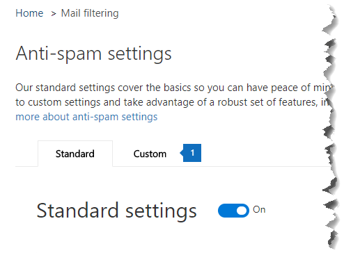

# <a name="enable-or-disable-safety-tips-in-office-365"></a>启用或禁用 Office 365 中的安全提示

Exchange Online Protection (EOP) 添加，或对它提供的电子邮件的标记安全提示。如果邮件已被标记为垃圾邮件的 Office 365 中，如果邮件包含可疑网络钓鱼诈骗，如内容或外部图像具有这些安全提示提供使用一种快速 visual 的方式来确定邮件是否从安全收件人验证发件人，被阻止。Office 365 和独立 EOP 管理员可以编辑垃圾邮件策略设置启用或禁用 Outlook 和其他桌面电子邮件客户端中的电子邮件中显示的安全提示。 
  
Office 365 默认情况下，为您的组织中启用安全提示，我们建议您将保留其启用，以帮助防御垃圾邮件和网络钓鱼攻击。您无法在 web 上的 outlook 中禁用安全提示。
  
若要查看示例，以及若要了解有关安全提示中显示的信息，请参阅[安全提示 Office 365 中的电子邮件中。](safety-tips-in-office-365.md)
  
本主题内容：
  
- [启用或禁用使用 Office 365 安全性安全提示&amp;合规性中心](enable-or-disable-safety-tips.md#SandCCsafetytip)
    
- [启用或禁用使用 PowerShell 安全提示](enable-or-disable-safety-tips.md#pshellsafetytip)
    
## <a name="to-enable-or-disable-safety-tips-by-using-the-office-365-security-amp-compliance-center"></a>启用或禁用使用 Office 365 安全性安全提示&amp;合规性中心
<a name="SandCCsafetytip"> </a>

1. 转到[https://protection.office.com](https://protection.office.com)。
    
2. 使用您的工作或学校帐户登录 Office 365。
    
3. 选择**威胁管理** \> **策略**。 
    
4. 在**策略**页中，选择**反垃圾邮件**。
    
    
  
5. 在**反垃圾邮件设置**页上选择**自定义**选项卡。 
    
    
  
6. 如有必要，选择**自定义设置**开关，打开自定义设置。如果自定义设置开关设置为**关闭**，您将无法修改垃圾邮件筛选器策略。
    
    
  
7. 展开您想要修改，然后选择**编辑策略**的垃圾邮件策略。例如，选择**默认垃圾邮件筛选策略**旁边的向下箭头。或者，如果需要，您可以通过选择**添加策略**来创建新策略。
    
8. 展开**垃圾邮件和批量**操作。 
    
9. 若要启用安全提示，在**安全提示**下的选中**上**复选框。若要禁用安全提示，请清除**上**复选框。 
    
10. 选择**保存**。
    
## <a name="to-enable-or-disable-safety-tips-by-using-powershell"></a>启用或禁用使用 PowerShell 安全提示
<a name="pshellsafetytip"> </a>

管理员可以使用 Exchange Online PowerShell 中启用或禁用安全提示。使用 Set-hostedcontentfilterpolicy cmdlet 可以启用或禁用垃圾邮件筛选器策略中的安全提示。
  
1. 连接到 Exchange Online PowerShell 中。有关信息，请参阅[Connect to Exchange Online PowerShell 中](http://go.microsoft.com/fwlink/p/?LinkId=396554)。
    
2. 运行 Set-hostedcontentfilterpolicy cmdlet 启用或禁用安全提示：
    
  ```
  Set-HostedContentFilterPolicy -Identity "policy name " -InlineSafetyTipsEnabled <$true|$false>
  ```

    其中：
    
  -  *策略名称*是想要修改，例如**默认**策略的名称。
    
  -  `$true`启用垃圾邮件筛选器策略的安全提示。 
    
  -  `$false`禁用垃圾邮件筛选器策略的安全提示。 
    
    例如，若要禁用默认垃圾邮件筛选器策略的安全提示，请运行以下命令：
    
  ```
  PS C:\> Set-HostedContentFilterPolicy -Identity "default" -InlineSafetyTipsEnabled $false
  ```

    有关此 cmdlet 的详细信息，请参阅[Set-hostedcontentfilterpolicy](https://technet.microsoft.com/library/jj200781.aspx)。
    
## <a name="still-need-help"></a>仍需要帮助？
<a name="pshellsafetytip"> </a>

如果您禁用安全提示，但仍在您的电子邮件中看到它们，检查以下事项：
  
- 您无法在 web 上的 outlook 中禁用安全提示。尝试在另一个客户端，如 Outlook 中查看相同的电子邮件。
    
- 安全提示是在默认情况下，使用 EOP 每一个，包括 Office 365 的任何人。若要禁用安全提示中显示电子邮件中，您必须禁用它们通过本主题中所述使用垃圾邮件筛选器策略。一旦您已设置此策略，则确保启用了它。有关启用垃圾邮件筛选器策略的信息，请参阅[配置垃圾邮件筛选器策略](https://technet.microsoft.com/library/jj200684.aspx)。
    
有关可防止出现垃圾邮件和网络钓鱼的详细方法，请参阅[Office 365 电子邮件防垃圾邮件保护](anti-spam-protection.md)。
  

