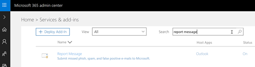

# 启用报告消息加载项

报告消息外接程序 Outlook 中，使人们能够轻松地分类的电子邮件安全还是恶意，向 Microsoft 和报告或其关联公司进行分析。Microsoft 使用这些提交来提高效率的电子邮件保护技术。此外，如果您的组织正在使用 Microsoft 云服务，包括[Office 365 高级威胁保护](office-365-atp.md)或[威胁智能](office-365-ti.md)，报告消息外接程序提供了有用信息的组织的安全工作组它们可用于查看和更新安全策略。 

例如，假设人员包括报告很多为网络钓鱼邮件。在[安全仪表板](security-dashboard.md)和其他报表中此信息曲面。贵组织的安全工作组可以使用此信息，以指示防钓鱼策略可能需要更新。或者，如果人员报告大量使用报告消息加载项已标记为垃圾邮件为非垃圾邮件的邮件，贵组织的安全工作组可能需要调整[反垃圾邮件策略](configure-the-anti-spam-policies.md)。  
  
如果您是单个用户，您还可以[启用报告消息外接程序自己](#get-the-report-message-add-in-for-yourself)。 
  
如果您的 Exchange Online 管理员，您还可以[启用报告消息外接程序为您的组织](#get-and-enable-the-report-message-add-in-for-your-organization)。
    
## 获取外接程序为自己的报告邮件

1. 在[Office 存储](https://appsource.microsoft.com/product/office/WA104381180?src=office)，请获取外接程序的报告消息。
    
2. 选择**获取 IT 现在**。   
    
3. 查看相应条款的使用和隐私策略。然后选择**继续**。 
    
4. 登录到 Office 365 电子邮件使用您的工作或学校 （供业务使用） 的帐户或您的 Microsoft 帐户 （供个人使用）。
    

外接程序是安装并启用后，您将看到以下图标： 

- 在 Outlook 中图标如下所示：    
- 在 Outlook Web App 中图标如下所示：  

下一步，以了解如何[使用报告消息加载项](https://support.office.com/article/b5caa9f1-cdf3-4443-af8c-ff724ea719d2)。
  
## 获取和报告消息外接程序为组织启用

> [!IMPORTANT]
> 您必须是 Office 365 全局管理员或 Exchange Online 管理员才能完成此任务。

1. 转到[https://portal.office.com](https://portal.office.com)和使用工作或学校帐户登录。 
    
2. 选择**管理**以转到管理中心。 
    
3. 选择**管理中心** \> **Exchange**转到 Exchange 管理员中心 (EAC)。 
    
4. 选择**组织** \> **外接程序**。 
    
5. 选择**+**  > **从 Office 商店添加**。  这将在 web 浏览器中打开 Office 应用商店。
    
6. 搜索报告消息。  
    
7. 在**应用程序**列表中，选择**报告消息**，然后选择**获取 IT**。   
    
8. 查看相应条款的使用和隐私策略。然后选择**继续**。 
    
    
  
9. 将打开一个向导可帮助您配置报告消息加载项查看信息，并选择**下一步**继续。   

10. 指定您希望用户能够为邮件报告加载项的默认设置。  
    
11. 指定谁报告消息外接程序。   

12. 选择**保存**。

根据您选择使用向导，在组织中的人员会报告消息外接程序可用。您的组织中的人员将看到以下图标： 

- 在 Outlook 中图标如下所示：    
- 在 Outlook Web App 中图标如下所示：  

接下来，了解如何[使用报告消息外接程序](https://support.office.com/article/b5caa9f1-cdf3-4443-af8c-ff724ea719d2)和设置规则以查看报告的电子邮件。

## 查看或编辑报告消息加载项的默认设置

您可以查看和编辑报告消息外接程序使用管理中心的默认设置。 

> [!IMPORTANT]
> 您必须是 Office 365 全局管理员或 Exchange Online 管理员才能完成此任务。
    
1. 如果已为您的组织只安装报告消息外接程序，您已将在服务和外接程序页。否则为请转[此处](https://portal.office.com/adminportal/home#/Settings/ServicesAndAddIns)和 Office 365 中使用工作或学校帐户登录。

2. 搜索**报告消息**，然后选择它。   
    
3. 将打开窗格显示在部署过程中选择要报告消息加载项的设置。   

4. 查看，如果需要为报告消息外接程序，编辑设置，然后保存所做的更改。
    
  
## 设置规则来获取一份报告的用户的电子邮件

> [!IMPORTANT]
> 您必须是 Exchange Online 管理员才能执行此任务。
  
您可以设置规则，若要获取的电子邮件组织中的用户报告的副本。在下载并为组织启用报告消息外接程序后执行此操作。
  
1. 在 EAC 中，选择**邮件流** \> **规则**。 
    
2. 选择**+** \> **创建新规则**。 
    
3. 在**名称**框中，键入一个名称，例如提交。
    
4. 在**以下情况应用此规则**列表中，选择**在收件人地址包括...**。 
    
5. 在**指定词语或短语**屏幕中，添加 junk@office365.microsoft.com 和 phish@office365.microsoft.com，，然后选择**确定**。 
    
    
  
6. 在 **...请执行以下**列表中，选择**密件抄送邮件到...**。 
    
7. 添加的全局管理员、 安全管理员和/或安全读者用户应收到人员报告给 Microsoft，每个电子邮件的副本，然后选择**确定**。 
    
    
  
8. 选择**审核严重性级别与此规则**，然后选择**中等**。 
    
9. 在**选择此规则的模式**，下选择**强制**。 
    
    
  
10. 选择**保存**。 
    
与就地此规则，当您的组织中的某人报告电子邮件的邮件报告加载项，使用您的全局管理员、 安全管理员和/或安全读者将收到该邮件的副本。这些信息使您可以设置或调整策略，如[Office 365 ATP 安全链接](atp-safe-links.md)策略。 
  
## 相关主题

[使用报告消息外接程序](https://support.office.com/article/b5caa9f1-cdf3-4443-af8c-ff724ea719d2)
  
[查看安全中的电子邮件安全报告&amp;合规性中心](view-email-security-reports.md)

[Office 365 高级威胁保护的视图报告](view-reports-for-atp.md)

[在安全中使用资源管理器&amp;合规性中心](use-explorer-in-security-and-compliance.md)
  

