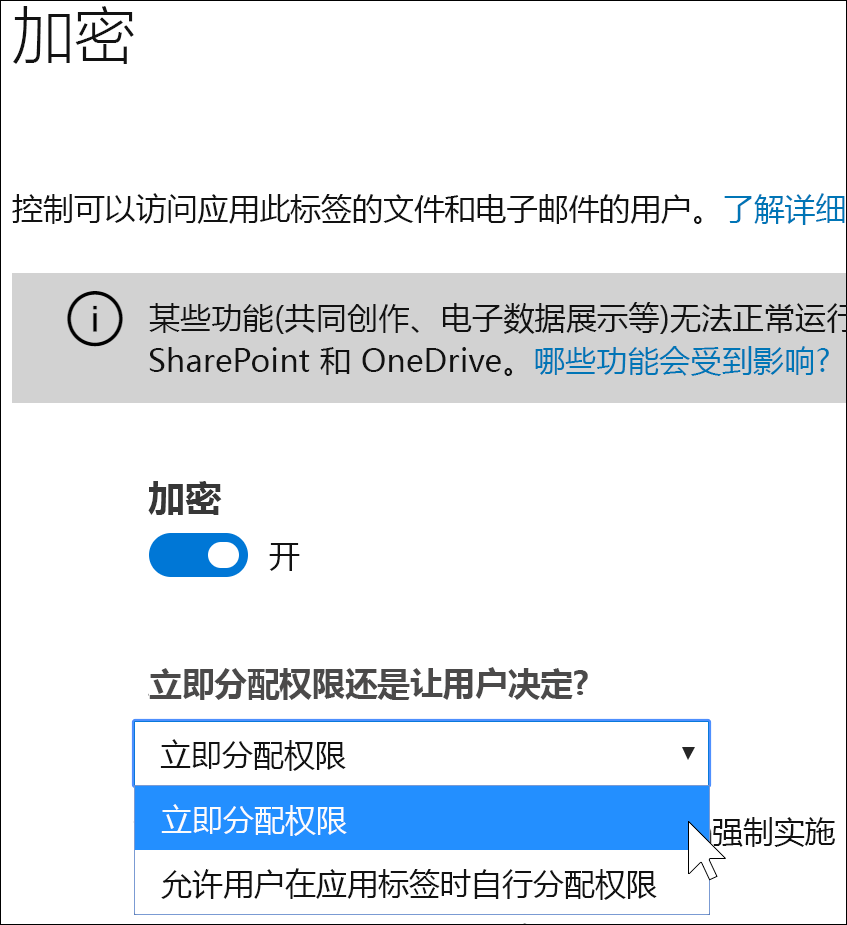
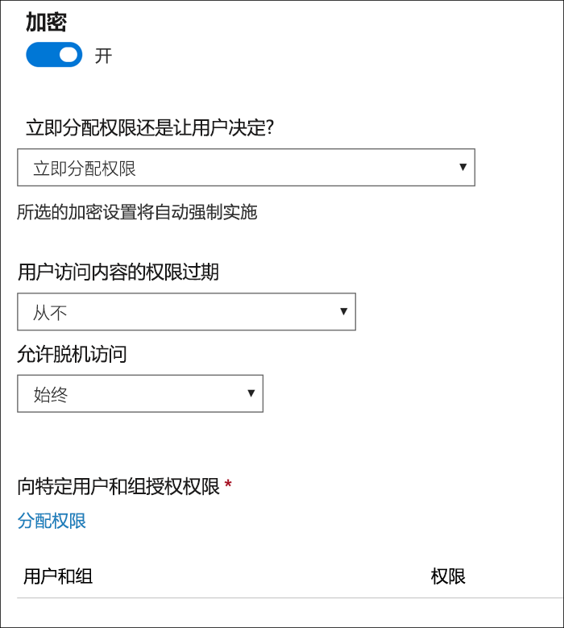
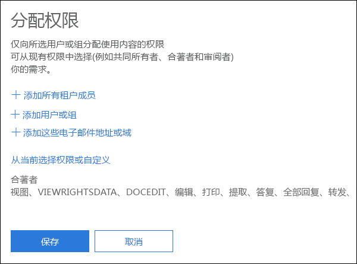
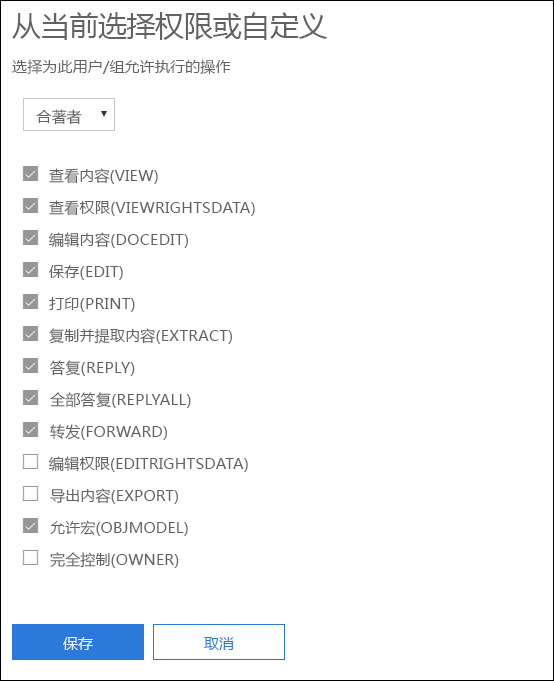
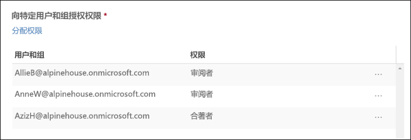
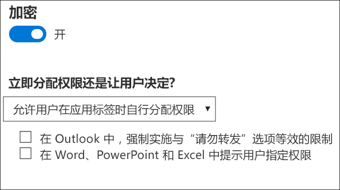
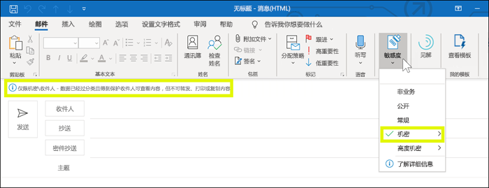
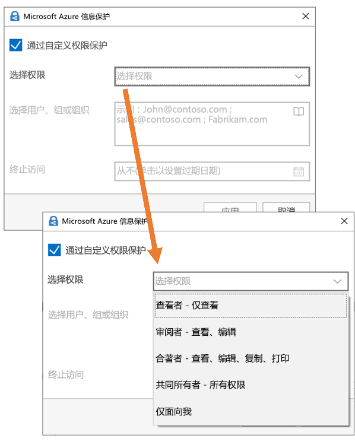

# 使用敏感度标签中的加密限制对内容的访问Restrict access to content by using encryption in sensitivity labels

创建敏感度标签时，可以限制对将要应用标签的内容的访问。例如，通过敏感度标签的加密设置，可以保护内容，以便：When you create a sensitivity label, you can restrict access to content that the label will be applied to. For example, with the encryption settings for a sensitivity label, you can protect content so that:

- 只有组织中的用户才能打开机密文档或电子邮件。Only users within your organization can open a confidential document or email.
- 只有市场部的用户才能编辑和打印促销声明文档或电子邮件，而组织中的所有其他用户只能阅读它。Only users in the marketing department can edit and print the promotion announcement document or email, while all other users in your organization can only read it.
- 用户无法转发电子邮件或从中复制包含有关内部组织的新闻的信息。Users cannot forward an email or copy information from it that contains news about an internal reorganization.
- 发送到业务合作伙伴的当前价目表在指定日期后无法打开。The current price list that is sent to business partners cannot be opened after a specified date.

当文档或电子邮件被加密时，对内容的访问将受到限制，以便它：When a document or email is encrypted, access to the content is restricted, so that it:

- 只能由标签的加密设置授权的用户解密。Can be decrypted only by users authorized by the label’s encryption settings.
- 无论其所在位置（组织内部或外部）如何，仍保持加密状态，即使该文件被重命名也是如此。Remains encrypted no matter where it resides, inside or outside your organization, even if the file’s renamed.
- 静态加密（例如，在 OneDrive 帐户中）和传输加密（例如，发送的电子邮件）。Is encrypted both at rest (for example, in a OneDrive account) and in transit (for example, a sent email).

最后，作为管理员，在创建敏感度标签时，你可选择执行下述任一操作：Finally, as an admin, when you create a sensitivity label, you can choose either to:

- **立即分配权限**，以便准确确定哪些用户获得了带有该标签的内容的哪些权限。**Assign permissions now**, so that you determine exactly which users get which permissions to content with that label.
- 在用户将此标签应用到内容时**允许用户分配权限**。**Let users assign permissions** when they apply the label to content. 这样，即可让组织内部人员在协作处理和完成任务时具有可能需要的一定程度的灵活性。This way, you can allow people in your organization some flexibility that they might need to collaborate and get their work done.

在 Microsoft 365 合规中心、Microsoft 365 安全中心或 Office 365 安全与合规中心创建敏感度标签时，可使用加密设置。The encryption settings are available when you create a sensitivity label in the Microsoft 365 compliance center, Microsoft 365 security center, or Office 365 Security & Compliance Center. 在左侧导航栏中，选择“**分类**” > “**敏感度标签**” > “**创建标签**”。In the left nav, choose **Classification** > **Sensitivity label** > **Create a label**.

## 加密工作原理How encryption works

加密使用 Azure Rights Management (Azure RMS)。Azure RMS 使用加密、标识和授权策略。若要了解详细信息，请参阅 [Azure Rights Management 是什么？](https://docs.microsoft.com/zh-CN/azure/information-protection/what-is-azure-rms)Encryption uses Azure Rights Management (Azure RMS). Azure RMS uses encryption, identity, and authorization policies. To learn more, see [What is Azure Rights Management?](https://docs.microsoft.com/zh-CN/azure/information-protection/what-is-azure-rms)

## 如何打开敏感度标签的加密How to turn on encryption for a sensitivity label

首先，只需将“**加密**”切换到“**开**”，然后选择是否要：To begin, simply toggle **Encryption** to **On**, and then choose whether to:

- **立即分配权限**，以便可准确确定哪些用户获得了带有该标签的内容的哪些权限。**Assign permissions now**, so that you can determine exactly which users get which permissions to content with that label. 有关详细信息，请参阅下一部分：[立即分配权限](#assign-permissions-now)。For more information, see the next section.
- 在用户将此标签应用到内容时**允许用户分配权限**。**Let users assign permissions** when they apply the label to content. 这样，即可让组织内部人员在协作处理和完成任务时具有可能需要的一定程度的灵活性。This way, you can allow people in your organization some flexibility that they might need to collaborate and get their work done. 有关详细信息，请参阅下述部分：[允许用户分配权限](#let-users-assign-permissions)。For more information, see the below section [Let users assign permissions](#let-users-assign-permissions).

例如，如果你有一个名为“**高度机密**”的敏感度标签，它将应用于你的大部分敏感内容，则你可能需要决定谁对该内容获得哪种类型的权限。For example, if you have a sensitivity label named **Highly Confidential** that will be applied to your most sensitive content, you may want to decide now who gets what type of permissions to that content.

或者，如果你有一个名为“**商业合同**”的敏感度标签，而你所在组织的工作流要员工临时与不同人员协作处理此内容，则你可能需要允许用户在分配此标签时决定由谁获得权限。Alternatively, if you have a sensitivity label named **Business Contracts**, and your organization's workflow requires that your people collaborate on this content with different people on an ad hoc basis, you may want to allow your users to decide who gets permissions when they assign the label. 这种灵活性都能帮助你的用户保持高效，同时减少管理员要更新或新建敏感度标签来应对特定场景的请求。This flexibility both helps your users' productivity and reduces the requests for your admins to update or create new sensitivity labels to address specific scenarios.

## 立即分配权限Assign permissions now

使用下述选项来控制哪些人员可访问应用了此标签的电子邮件或文档。To begin, simply toggle Encryption to On, and then use the options below to control who can access email or documents to which this label is applied. You can: 可执行下列操作：You can:

1. **向电子邮件和文档同时应用加密，或只向电子邮件应用加密。** 如果选择只向电子邮件应用加密，则具有此标签的邮件将在 Outlook 中被加密，但具有此标签的文档将不会在其他应用中加密（例如，Word 或 PowerPoint）。**Apply encryption to both email and documents, or just email.** If you choose just email, messages with this label will be encrypted in Outlook, but documents with this label won't be encrypted in other apps, such as Word or PowerPoint. 
2. **允许对标记的内容的访问权限过期**（在某个特定日期或在应用标签后的特定天数后）。在此时间后，用户将无法打开标记的项。如果指定某个日期，则它将于该日期午夜（在你的当前时区）生效。请注意，某些电子邮件客户端由于其缓存机制，可能不强制过期，也不显示超过其过期日期的电子邮件。**Allow access to labeled content to expire**, either on a specific date or after a specific number of days after the label is applied. After this time, users won’t be able to open the labeled item. If you specify a date, it is effective midnight on that date in your current time zone. (Note that some email clients may not enforce expiration and show emails past their expiration date, due to their caching mechanisms.)
3. **允许脱机访问**（从不、始终或在应用标签后的特定天后）。如果将脱机访问限制为从不或一定天数，则当达到该阈值时，必须对用户重新进行身份验证并记录其访问。有关详细信息，请参阅下一部分有关 Rights Management 使用许可证的内容。**Allow offline access** never, always, or for a specific number of days after the label is applied. If you restrict offline access to never or a number of days, when that threshold is reached, users must be reauthenticated and their access is logged. For more information, see the next section on the Rights Management use license.

### 针对脱机访问的 Rights Management 使用许可证Rights Management use license for offline access

当用户在脱机状态下打开已受敏感度标签保护的文档或电子邮件时，将向用户授予针对该内容的 Azure Rights Management 使用许可证。此使用许可证是一个证书，其中包含用户对文档或电子邮件的使用权限，以及用于加密内容的加密密钥。使用许可证还包括到期日期（如果对此进行了设置）以及使用许可证的有效期。When a user opens a document or email offline that’s been protected by a sensitivity label, an Azure Rights Management use license for that content is granted to the user. This use license is a certificate that contains the user's usage rights for the document or email, and the encryption key that was used to encrypt the content. The use license also contains an expiration date if this has been set, and how long the use license is valid.

如果尚未设置任何到期日期，则针对租户的默认使用许可证有效期为 30 天。在使用许可证有效期内，无需就内容对用户重新进行身份验证或授权。这使用户无需具有 Internet 连接即可继续打开受保护的文档或电子邮件。当用户许可有效期到期后，在用户下次访问受保护的文档或电子邮件时，必须对用户重新进行身份验证和授权。If no expiration date has been set, the default use license validity period for a tenant is 30 days. For the duration of the use license, the user is not reauthenticated or reauthorized for the content. This lets the user continue to open the protected document or email without an Internet connection. When the use license validity period expires, the next time the user accesses the protected document or email, the user must be reauthenticated and reauthorized.

除重新进行身份验证以外，还将重新评估策略和用户组成员身份。这意味着，如果自他们最后一次访问内容时在策略或组成员身份中存在更改，则对于同一文档或电子邮件，他们可能会收到不同的访问结果。In addition to reauthentication, the policy and user group membership is reevaluated. This means that users could experience different access results for the same document or email if there are changes in the policy or group membership from when they last accessed the content.

若要了解如何更改默认的 30 天设置，请参阅 [Rights Management 使用许可证](https://docs.microsoft.com/zh-CN/azure/information-protection/configure-usage-rights#rights-management-use-license)。To learn how to change the default 30-day setting, see [Rights Management use license](https://docs.microsoft.com/zh-CN/azure/information-protection/configure-usage-rights#rights-management-use-license).

### 向特定用户或组分配权限Assign permissions to specific users or groups

可以向特定人员授予权限，只允许这些人员与标记的内容进行交互。You can grant permissions to specific people so that only they can interact with the labeled content.

实现此功能只需简单的两个步骤：Doing so is a straightforward two-step process:

1. 首先，添加将向其分配对标记的内容具有访问权限的用户或组。First you add users or groups that will be assigned permissions to the labeled content.
2. 然后，选择这些用户对标记的内容所具有的权限。Then you choose which permissions those users have for the labeled content.

#### 添加用户或组Add users or groups

分配权限时，可以选择：When you assign permissions, you can choose:

- 组织中的任何人（所有租户成员）。此设置不包括来宾帐户。Everyone in your organization (all tenant members). This setting excludes guest accounts.
- 任何特定用户或启用了电子邮件的安全组、通讯组、Office 365 组或动态通讯组。Any specific user or email-enabled security group, distribution group, Office 365 group, or dynamic distribution group. 
- 组织外部的任何电子邮件地址或域，例如 gmail.com、hotmail.com 或 outlook.com。Any email address or domain outside your organization, such as gmail.com, hotmail.com, or outlook.com.

选择所有租户成员或浏览目录时，用户或组必须具有电子邮件地址。When you choose all tenant members or browse the directory, the users or groups must have an email address.

最佳做法是使用组，而不是使用用户。此策略可使你的配置更为简单。As a best practice, use groups rather than users. This strategy keeps your configuration simpler.

#### 选择权限Choose permissions

选择允许为这些用户或组使用哪些权限时，可以选择：When you choose which permissions to allow for those users or groups, you can select either:

- 具有预设权限组的[预定义权限级别](https://docs.microsoft.com/zh-CN/azure/information-protection/configure-usage-rights#rights-included-in-permissions-levels)，例如共同创作或审阅者。A [predefined permissions level](https://docs.microsoft.com/zh-CN/azure/information-protection/configure-usage-rights#rights-included-in-permissions-levels) with a preset group of rights, such as Co-Author or Reviewer.
- 自定义权限组，可选择想要允许使用的任何权限。A Custom group of rights, where you choose whichever permissions you want.

有关每个特定权限的详细信息，请参阅[使用权限和说明](https://docs.microsoft.com/zh-CN/azure/information-protection/configure-usage-rights#usage-rights-and-descriptions)。For more information on each specific permission, see [Usage rights and descriptions](https://docs.microsoft.com/zh-CN/azure/information-protection/configure-usage-rights#usage-rights-and-descriptions).  

请注意，同一标签可向不同用户授予不同的权限。例如，一个标签可将某些用户分配为审阅者，并可将其他用户分配为共同创作，如下所示。Note that the same label can grant different permissions to different users. For example, a single label can assign some users as Reviewer and a different user as Co-author, as shown below.

为此，添加用户或组、向其分配权限并保存这些设置。然后重复这些步骤，添加用户并向其分配权限、每次保存设置。可以根据需要经常执行此操作，以便为不同用户定义不同权限。To do this, add users or groups, assign them permissions, and save those settings. Then repeat these steps, adding users and assigning them permissions, saving the settings each time. You can do this as often as necessary, to define different permissions for different users.

#### Rights Management 颁发者（应用敏感度标签的用户）始终具有完全控制Rights Management issuer (user applying the sensitivity label) always has Full Control

敏感度标签的加密使用 Azure RMS。当用户通过使用 Azure RMS 应用敏感度标签以保护文档或电子邮件时，该用户变为该内容的Rights Management 颁发者。Encryption for a sensitivity label uses Azure RMS. When a user applies a sensitivity label to protect a document or email by using Azure RMS, that user becomes the Rights Management issuers for that content.

Rights Management 颁发者将始终被授予对文档或电子邮件的完全控制权限，此外：The Rights Management issuer is always granted Full Control permissions for the document or email, and in addition:

- 如果保护设置包含过期日期，则 Rights Management 颁发者在该日期后仍可以打开和编辑文档或电子邮件。If the protection settings include an expiration date, the Rights Management issuer can still open and edit the document or email after that date.
- Rights Management 颁发者可以始终在脱机状态下访问文档或电子邮件。The Rights Management issuer can always access the document or email offline.
- 在文档被撤销后，Rights Management 颁发者仍然可以打开该文档。The Rights Management issuer can still open a document after it is revoked.

有关详细信息，请参阅 [Rights Management 颁发者和 Rights Management 所有者](https://docs.microsoft.com/zh-CN/azure/information-protection/configure-usage-rights#rights-management-issuer-and-rights-management-owner)。For more information, see [Rights Management issuer and Rights Management owner](https://docs.microsoft.com/zh-CN/azure/information-protection/configure-usage-rights#rights-management-issuer-and-rights-management-owner).

## 允许用户分配权限Let users assign permissions

可使用下述选项来允许用户在向内容手动应用敏感度标签时分配权限：You can use these options to let users assign permissions when they manually apply a sensitivity label to content:

- 在 Outlook 中，用户可强制实施与“**请勿转发**”选项等效的限制。In Outlook, a user can enforce restrictions equivalent to the **Do Not Forward** option. 此选项在 Windows 版 Outlook 上本地支持，且不要求你安装 Azure 信息保护统一标签客户端。This option is supported natively in Outlook on Windows, and does not require you to install the Azure Information Protection unified labeling client.
- 在 Word、PowerPoint 和 Excel 中，系统会提示用户为特定用户、组或组织选择一个权限级别。In Word, PowerPoint, and Excel, a user is prompted to select a permission level for specific users, groups, or organizations. 此选项在这些 Office 应用中本地不受支持，因此你的用户必须安装 Azure 信息保护统一标签客户端。This option is not supported natively in these Office apps, so your users must install the Azure Information Protection unified labeling client.

这些选项可决定哪些应用中将显示敏感度标签：These options determine in which apps the sensitivity label will appear:

- 如果敏感度标签仅启用了 Outlook 选项，则该标签仅对 Outlook 中的用户可见。If the sensitivity label has only the Outlook option enabled, the label will appear to users only in Outlook.
- 如果敏感度标签仅启用了 Word、PowerPoint 和 Excel 选项，则该标签仅对这些应用中的用户可见。If the sensitivity label has only the Word, PowerPoint, and Excel option enabled, the label will appear to users only in those apps.
- 如果敏感度标签启用了上述两个选项，则标签对所有可用应用（Outlook、Word、PowerPoint 和 Excel）中的用户可见。If the sensitivity label has both options enabled, the label will appear to users in all of the available apps: Outlook, Word, PowerPoint, and Excel.

允许用户分配权限的敏感度标签仅可由用户手动应用于内容；它不能自动应用，也不能用作建议的标签。A sensitivity label that lets users assign permissions can be applied to content only manually by users; it can't be auto-applied or used as a recommended label.

> [!NOTE]
> 需具备 Azure 信息保护订阅，才可允许用户分配权限。Letting users assign permissions requires an Azure Information Protection subscription. 要在 Word、PowerPoint 和 Excel 中使用此功能，必须下载和安装 [Azure 信息保护统一标签客户端](https://docs.microsoft.com/azure/information-protection/rms-client/install-unifiedlabelingclient-app)。To use this feature in Word, PowerPoint, and Excel, you must download and install the [Azure Information Protection unified labeling client](https://docs.microsoft.com/azure/information-protection/rms-client/install-unifiedlabelingclient-app). 我们正在开发在这些 Office 应用中对此功能的本机支持，让其无需 Azure 信息保护客户端。We're working on native support for this feature in these Office apps, so that they won't require the Azure Information Protection client. 此外，客户端仅在 Windows 上运行，因此 Mac、iOS、Android 和 Office 网页版上尚不支持此功能。Also, the client runs only on Windows, so this feature is not yet supported on Mac, iOS, Android, or Office for the web.

### Outlook 限制Outlook restrictions

在 Outlook 中，当用户向邮件应用允许其分配权限的敏感度标签时，需遵守的限制与“请勿转发”选项相同。In Outlook, when a user applies a sensitivity label that lets them assign permissions to a message, the restrictions are the same as the Do Not Forward option. 用户将在邮件顶部看到标签名称和说明，这表示正在保护该内容。The user will see the label name and description at the top of the message, which indicates the content's being protected. 与 Word、PowerPoint 和 Excel 不同（详见[下一部分](#word-powerpoint-and-excel-permissions)），系统不会提示用户选择特定权限。Unlike Word, PowerPoint, and Excel (see the [next section](#word-powerpoint-and-excel-permissions)), users aren't prompted to select specific permissions.

向电子邮件应用“请勿转发”选项时，电子邮件将被加密，且收件人必须通过身份验证。When the Do Not Forward option is applied to an email, the email is encrypted and recipients must be authenticated. 其次，收件人不得转发、打印和复制该邮件。Then, the recipients cannot forward it, print it, or copy from it. 例如，在 Outlook 客户端中，“转发”按钮不可用，“另存为”和“打印”菜单选项也不可用，并且你不可在“收件人”、“抄送”和“密件抄送”框中添加或更改收件人。For example, in the Outlook client, the Forward button is not available, the Save As and Print menu options are not available, and you cannot add or change recipients in the To, Cc, or Bcc boxes.

自动附加到电子邮件且不受保护的 Office 文档会自动继承相同的限制。Unprotected Office documents that are attached to the email automatically inherit the same restrictions. 应用于这些文档的使用权限为“编辑内容”、“编辑”，“保存”，“视图”、“打开”、“阅读”，以及“允许宏”。The usage rights applied to these documents are Edit Content, Edit; Save; View, Open, Read; and Allow Macros. 如果用户对附件实施其他使用权限，或者附件并非支持该继承权限的 Office 文档，则用户需要在将文件附加到电子邮件之前保护该文件。If the user wants different usage rights for an attachment, or the attachment is not an Office document that supports this inherited protection, the user needs to protect the file before attaching it to the email.

### Word、PowerPoint 和 Excel 权限Word, PowerPoint, and Excel permissions

在 Word、PowerPoint 和 Excel 中，当用户向文档应用允许其分配权限的敏感度标签时，系统会提示他们如下所示来保护内容。In Word, PowerPoint, and Excel, when a user applies a sensitivity label that lets them assign permissions to a document, they are prompted to protect the content as shown below.

用户可执行下列操作：The user can modify records.

- 选择权限级别，例如查看者（可分配“仅查看”权限）或合著者（可分配“查看”、“编辑”、“复制”和“打印”权限）。Select a permission level, such as Viewer (which assigns View Only permission) or Co-Author (which assigns View, Edit, Copy, and Print permissions).
- 选择用户、组或组织。Select users, groups, or organizations. 这可包括你所在组织内部或外部的人员。This can include people both inside or outside your organizations.
- 设置到期日期，所选用户在该日期后不可访问内容。Set an expiration date, after which the selected users cannot access the content. 有关详细信息，请参阅上一部分：[针对脱机访问的 Rights Management 使用许可证](#rights-management-use-license-for-offline-access)。For more information, see the above section [Rights Management use license for offline access](#rights-management-use-license-for-offline-access).

## 应用标签后，现有加密会发生什么情况What happens to existing encryption when a label's applied

在向内容应用敏感度标签之前，用户可能已通过应用一些其他保护设置进行了内容加密。Before a sensitivity label is applied to content, it's possible that a user already encrypted the content by applying some other protection setting. 例如，用户可能已应用：For example, a user might have applied:

- “**请勿转发**”选项。The **Do Not Forward** option.
- 通过 Azure 信息保护统一标记客户端实现的自定义保护。Custom protection by using the Azure Information Protection unified labeling client.
- 会加密内容但不与标签关联的 Azure 权限管理服务 (RMS) 模板。An Azure Rights Management Service (RMS) template that encrypts the content but is not associated with a label.

下表说明了在向该内容应用敏感度标签后现有加密发生的情况。This table describe what happens to existing encyption when a sensitivity label is applied to that content.
 
 

| |**用户在加密关闭的情况下应用敏感度标签****User applies a sensitivity label with encryption turned off**|**用户在加密开启的情况下应用敏感度标签****User applies a sensitivity label with encryption turned on**|**用户应用具有“去除保护”的标签**1**User applies a label with Remove Protection**1|
|:-----|:-----|:-----|:-----|
|**请勿转发****Do Not Forward**|电子邮件 - 已去除保护Email - Protection is removed 文档 - 已保留保护Document - Protection is preserved|已应用标签保护Label protection is applied|已删除“**请勿转发**”**Do Not Forward** is removed|
|**自定义保护**1**Custom protection**1|已保留保护Protection is preserved|已应用标签保护Label protection is applied|已去除自定义保护Custom protection is removed|
|**Azure RMS 模板****Azure RMS template**|已保留保护Protection is preserved|已应用标签保护Label protection is applied|已去除自定义保护Custom protection is removed|

1此功能仅在 Azure 信息保护标记客户端中受支持。1This is supported only in the Azure Information Protection labeling client.

## 存储 OneDrive 和 SharePoint 中加密的内容Storing encrypted content in OneDrive and SharePoint

请注意，将加密应用于 OneDrive 和 SharePoint 中存储的文件时，该服务无法处理这些文件的内容。这意味着共同创作、电子数据展示、搜索、Delve 和其他协作功能将无法正常使用。此外，数据丢失防护 (DLP) 策略只适用于元数据（包括 Office 365 标签），但并不适用于这些加密的文件的内容（例如，文件内的信用卡号）。Be aware that when encryption is applied to files stored in OneDrive and SharePoint, the service cannot process the contents of these files. This means that features such as co-authoring, eDiscovery, search, Delve, and other collaborative features do not work. Also, data loss prevention (DLP) policies can work only with the metadata (including Office 365 labels) but not the contents of encrypted files (such as credit card numbers within files).

这仅适用于在 OneDrive 和 SharePoint 中存储的内容。在 Exchange Online 中，邮件流规则（也称为传输规则）使用[超级用户帐户](https://docs.microsoft.com/zh-CN/azure/information-protection/configure-super-users)，以便他们能够扫描加密的内容和强制实施 DLP 策略。This applies only to content stored in OneDrive and SharePoint. In Exchange Online, mail flow rules (also known as transport rules) use the [super user account](https://docs.microsoft.com/zh-CN/azure/information-protection/configure-super-users) so that they can scan encrypted content and enforce DLP policies.

## 重要先决条件Important prerequisites

在使用加密前，可能需要执行这些任务。Before you can use encryption, you might need to perform these tasks.

### 激活 Azure Rights ManagementActivating Azure Rights Management

若要使用敏感度标签中的加密，需要在租户中激活 Azure Rights Management 服务。在较新的租户中，该服务在默认情况下为启用状态，但可能需要手动激活该服务。有关详细信息，请参阅[激活 Azure Rights Management](https://docs.microsoft.com/zh-CN/azure/information-protection/activate-service)。To use encryption in sensitivity labels, the Azure Rights Management service needs to be activated in your tenant. In newer tenants, the service is on by default, but you might need to manually activate the service. For more information, see [Activating Azure Rights Management](https://docs.microsoft.com/zh-CN/azure/information-protection/activate-service).

### 配置用于 Azure 信息保护的 ExchangeConfigure Exchange for Azure Information Protection

在用户能够在 Outlook 中应用标签以保护其电子邮件前，无需对 Exchange 进行配置以用于 Azure 信息保护。但是，如果没有针对 Azure 信息保护对 Exchange 进行配置，你将无法在 Exchange 中获取使用 Azure Rights Management 的完整功能。Exchange does not have to be configured for Azure Information Protection before users can apply labels in Outlook to protect their emails. However, until Exchange is configured for Azure Information Protection, you do not get the full functionality of using Azure Rights Management protection with Exchange.
 
例如，用户无法查看移动电话或 Outlook 网页版上受保护的电子邮件，无法索引受保护的电子邮件以用于搜索，并且无法针对 Rights Management 保护配置 Exchange Online DLP。For example, users cannot view protected emails on mobile phones or with Outlook on the web, protected emails cannot be indexed for search, and you cannot configure Exchange Online DLP for Rights Management protection. 

为确保 Exchange 可以支持这些其他应用场景，请参阅以下内容：To ensure that Exchange can support these additional scenarios, see the following:

- 对于 Exchange Online，请参阅 [Exchange Online：IRM 配置](https://docs.microsoft.com/zh-CN/azure/information-protection/configure-office365#exchange-online-irm-configuration)的说明。For Exchange Online, see the instructions for [Exchange Online: IRM Configuration](https://docs.microsoft.com/zh-CN/azure/information-protection/configure-office365#exchange-online-irm-configuration).
- 对于本地 Exchange，必须部署 [RMS 连接器并配置你的 Exchange 服务器](https://docs.microsoft.com/zh-CN/azure/information-protection/deploy-rms-connector)。For Exchange on-premises, you must deploy the [RMS connector and configure your Exchange servers](https://docs.microsoft.com/zh-CN/azure/information-protection/deploy-rms-connector). 
