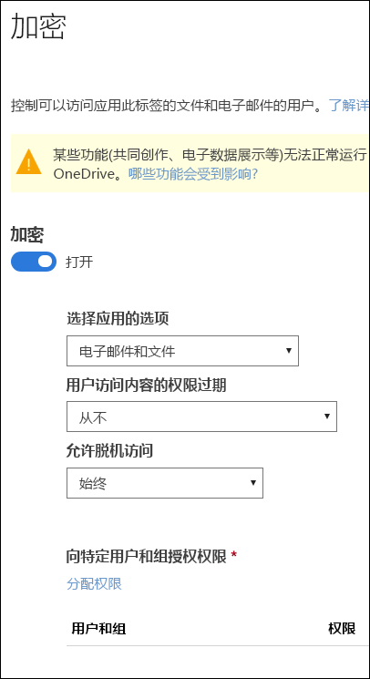
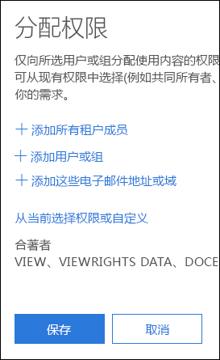
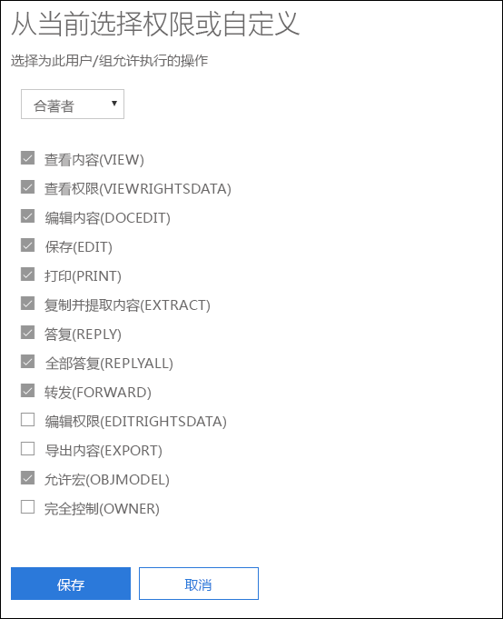
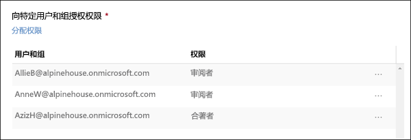

# 使用敏感度标签中的加密限制对内容的访问

创建敏感度标签时，可以限制对将要应用标签的内容的访问。例如，通过敏感度标签的加密设置，可以保护内容，以便：

- 只有组织中的用户才能打开机密文档或电子邮件。
- 只有市场部的用户才能编辑和打印促销声明文档或电子邮件，而组织中的所有其他用户只能阅读它。
- 用户无法转发电子邮件或从中复制包含有关内部组织的新闻的信息。
- 发送到业务合作伙伴的当前价目表在指定日期后无法打开。

当文档或电子邮件被加密时，对内容的访问将受到限制，以便它：

- 只能由标签的加密设置授权的用户解密。
- 无论其所在位置（组织内部或外部）如何，仍保持加密状态，即使该文件被重命名也是如此。
- 静态加密（例如，在 OneDrive 帐户中）和传输加密（例如，发送的电子邮件）。

在 Microsoft 365 合规中心、Microsoft 365 安全中心或 Office 365 安全与合规中心创建敏感度标签时，可使用加密设置。

## 加密工作原理

加密使用 Azure Rights Management (Azure RMS)。Azure RMS 使用加密、标识和授权策略。若要了解详细信息，请参阅 [Azure Rights Management 是什么？](https://docs.microsoft.com/zh-CN/azure/information-protection/what-is-azure-rms)

## 如何打开敏感度标签的加密

要开始使用，只需将“**加密**”切换到“**开**”，然后使用下述选项来控制哪些人员可访问应用了此标签的电子邮件或文档。你可执行以下操作：

1. **向电子邮件和文档同时应用加密，或只向电子邮件应用加密。** 如果选择只向电子邮件应用加密，则具有此标签的邮件将在 Outlook 中被加密，但具有此标签的文档将不会在其他应用中加密（例如，Word 或 PowerPoint）。 
2. **允许对标记的内容的访问权限过期**（在某个特定日期或在应用标签后的特定天数后）。在此时间后，用户将无法打开标记的项。如果指定某个日期，则它将于该日期午夜（在你的当前时区）生效。请注意，某些电子邮件客户端由于其缓存机制，可能不强制过期，也不显示超过其过期日期的电子邮件。
3. **允许脱机访问**（从不、始终或在应用标签后的特定天后）。如果将脱机访问限制为从不或一定天数，则当达到该阈值时，必须对用户重新进行身份验证并记录其访问。有关详细信息，请参阅下一部分有关 Rights Management 使用许可证的内容。

### 针对脱机访问的 Rights Management 使用许可证

当用户在脱机状态下打开已受敏感度标签保护的文档或电子邮件时，将向用户授予针对该内容的 Azure Rights Management 使用许可证。此使用许可证是一个证书，其中包含用户对文档或电子邮件的使用权限，以及用于加密内容的加密密钥。使用许可证还包括到期日期（如果对此进行了设置）以及使用许可证的有效期。

如果尚未设置任何到期日期，则针对租户的默认使用许可证有效期为 30 天。在使用许可证有效期内，无需就内容对用户重新进行身份验证或授权。这使用户无需具有 Internet 连接即可继续打开受保护的文档或电子邮件。当用户许可有效期到期后，在用户下次访问受保护的文档或电子邮件时，必须对用户重新进行身份验证和授权。

除重新进行身份验证以外，还将重新评估策略和用户组成员身份。这意味着，如果自他们最后一次访问内容时在策略或组成员身份中存在更改，则对于同一文档或电子邮件，他们可能会收到不同的访问结果。

若要了解如何更改默认的 30 天设置，请参阅 [Rights Management 使用许可证](https://docs.microsoft.com/zh-CN/azure/information-protection/configure-usage-rights#rights-management-use-license)。

## 向特定用户或组分配权限

可以向特定人员授予权限，只允许这些人员与标记的内容进行交互。

实现此功能只需简单的两个步骤：

1. 首先，添加将向其分配对标记的内容具有访问权限的用户或组。
2. 然后，选择这些用户对标记的内容所具有的权限。

### 添加用户或组

分配权限时，可以选择：

- 组织中的任何人（所有租户成员）。此设置不包括来宾帐户。
- 任何特定用户或启用了电子邮件的安全组、通讯组、Office 365 组或动态通讯组。 
- 组织外部的任何电子邮件地址或域，例如 gmail.com、hotmail.com 或 outlook.com。

选择所有租户成员或浏览目录时，用户或组必须具有电子邮件地址。

最佳做法是使用组，而不是使用用户。此策略可使你的配置更为简单。

### 选择权限

选择允许为这些用户或组使用哪些权限时，可以选择：

- 具有预设权限组的[预定义权限级别](https://docs.microsoft.com/zh-CN/azure/information-protection/configure-usage-rights#rights-included-in-permissions-levels)，例如共同创作或审阅者。
- 自定义权限组，可选择想要允许使用的任何权限。

有关每个特定权限的详细信息，请参阅[使用权限和说明](https://docs.microsoft.com/zh-CN/azure/information-protection/configure-usage-rights#usage-rights-and-descriptions)。  

请注意，同一标签可向不同用户授予不同的权限。例如，一个标签可将某些用户分配为审阅者，并可将其他用户分配为共同创作，如下所示。

为此，添加用户或组、向其分配权限并保存这些设置。然后重复这些步骤，添加用户并向其分配权限、每次保存设置。可以根据需要经常执行此操作，以便为不同用户定义不同权限。

### Rights Management 颁发者（应用敏感度标签的用户）始终具有完全控制

敏感度标签的加密使用 Azure RMS。当用户通过使用 Azure RMS 应用敏感度标签以保护文档或电子邮件时，该用户变为该内容的Rights Management 颁发者。

Rights Management 颁发者将始终被授予对文档或电子邮件的完全控制权限，此外：

- 如果保护设置包含过期日期，则 Rights Management 颁发者在该日期后仍可以打开和编辑文档或电子邮件。
- Rights Management 颁发者可以始终在脱机状态下访问文档或电子邮件。
- 在文档被撤销后，Rights Management 颁发者仍然可以打开该文档。

有关详细信息，请参阅 [Rights Management 颁发者和 Rights Management 所有者](https://docs.microsoft.com/zh-CN/azure/information-protection/configure-usage-rights#rights-management-issuer-and-rights-management-owner)。

## 应用标签后，现有加密会发生什么情况

在向内容应用敏感度标签之前，用户可能已通过应用一些其他保护设置进行了内容加密。 例如，用户可能已应用：

- “**请勿转发**”选项。
- 通过 Azure 信息保护统一标记客户端实现的自定义保护。
- 会加密内容但不与标签关联的 Azure 权限管理服务 (RMS) 模板。

下表说明了应用标签后现有加密会发生的情况。
 
 

| |**用户在加密关闭的情况下应用敏感度标签**|**用户在加密开启的情况下应用敏感度标签**|**用户应用具有“去除保护”的标签**1|
|:-----|:-----|:-----|:-----|
|**请勿转发**|电子邮件 - 已去除保护 文档 - 已保留保护|已应用标签保护|已删除“**请勿转发**”|
|**自定义保护**1|已保留保护|已应用标签保护|已去除自定义保护|
|**Azure RMS 模板**|已保留保护|已应用标签保护|已去除自定义保护|

1此功能仅在 Azure 信息保护标记客户端中受支持。

## 存储 OneDrive 和 SharePoint 中加密的内容

请注意，将加密应用于 OneDrive 和 SharePoint 中存储的文件时，该服务无法处理这些文件的内容。这意味着共同创作、电子数据展示、搜索、Delve 和其他协作功能将无法正常使用。此外，数据丢失防护 (DLP) 策略只适用于元数据（包括 Office 365 标签），但并不适用于这些加密的文件的内容（例如，文件内的信用卡号）。

这仅适用于在 OneDrive 和 SharePoint 中存储的内容。在 Exchange Online 中，邮件流规则（也称为传输规则）使用[超级用户帐户](https://docs.microsoft.com/zh-CN/azure/information-protection/configure-super-users)，以便他们能够扫描加密的内容和强制实施 DLP 策略。

## 重要先决条件

在使用加密前，可能需要执行这些任务。

### 激活 Azure Rights Management

若要使用敏感度标签中的加密，需要在租户中激活 Azure Rights Management 服务。在较新的租户中，该服务在默认情况下为启用状态，但可能需要手动激活该服务。有关详细信息，请参阅[激活 Azure Rights Management](https://docs.microsoft.com/zh-CN/azure/information-protection/activate-service)。

### 配置用于 Azure 信息保护的 Exchange

在用户能够在 Outlook 中应用标签以保护其电子邮件前，无需对 Exchange 进行配置以用于 Azure 信息保护。但是，如果没有针对 Azure 信息保护对 Exchange 进行配置，你将无法在 Exchange 中获取使用 Azure Rights Management 的完整功能。
 
例如，用户无法查看移动电话或 Outlook 网页版上受保护的电子邮件，无法索引受保护的电子邮件以用于搜索，并且无法针对 Rights Management 保护配置 Exchange Online DLP。 

为确保 Exchange 可以支持这些其他应用场景，请参阅以下内容：

- 对于 Exchange Online，请参阅 [Exchange Online：IRM 配置](https://docs.microsoft.com/zh-CN/azure/information-protection/configure-office365#exchange-online-irm-configuration)的说明。
- 对于本地 Exchange，必须部署 [RMS 连接器并配置你的 Exchange 服务器](https://docs.microsoft.com/zh-CN/azure/information-protection/deploy-rms-connector)。 
