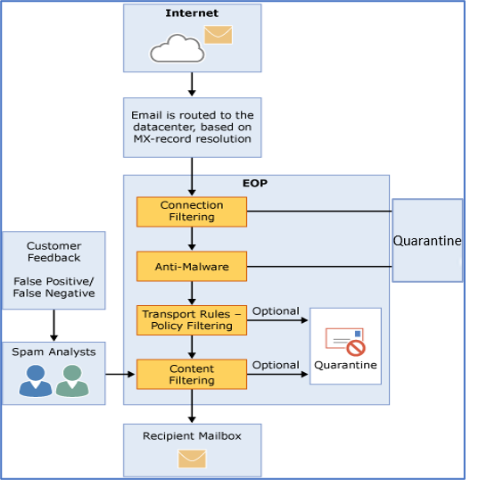

# Exchange Online Protection 概述Exchange Online Protection overview

Microsoft Exchange Online Protection (EOP) 是基于云的电子邮件筛选服务，可帮助您的组织防御垃圾邮件和恶意邮件，并包括用于保护您的组织避免违反邮件策略的功能。EOP 可以简化对邮件环境的管理，缓解由于维护内部部署硬件和软件而产生的许多负担。Microsoft Exchange Online Protection (EOP) is a cloud-based email filtering service that helps protect your organization against spam and malware, and includes features to safeguard your organization from messaging-policy violations. EOP can simplify the management of your messaging environment and alleviate many of the burdens that come with maintaining on-premises hardware and software.
  
以下是您可以使用 EOP 进行邮件保护的主要方式：The following are the primary ways you can use EOP for messaging protection:
  
- **在独立方案中**EOP 为您的本地 Microsoft Exchange Server 2013 环境、旧版 Exchange Server 版本或任何其他本地 SMTP 电子邮件解决方案提供基于云的电子邮件保护。**In a standalone scenario** EOP provides cloud-based email protection for your on-premises Microsoft Exchange Server 2013 environment, legacy Exchange Server versions, or for any other on-premises SMTP email solution. 
    
- **作为 Microsoft Exchange Online 的一部分** 默认情况下，EOP 保护 Microsoft Exchange Online 云托管的邮箱。**As a part of Microsoft Exchange Online** By default, EOP protects Microsoft Exchange Online cloud-hosted mailboxes. 有关配置这些 Exchange Online 功能的帮助, 请参阅防止[威胁](../protect-against-threats.md)。See [Protect against threats](../protect-against-threats.md) for help configuring these Exchange Online capabilities. 
    
- **在混合部署中** 如果您既有本地邮箱，也有云邮箱，则可以将 EOP 配置为保护您的邮件环境并控制邮件路由。**In a hybrid deployment** EOP can be configured to protect your messaging environment and control mail routing when you have a mix of on-premises and cloud mailboxes. 

这些 Exchange Online Protection 文章适用于混合和本地环境。These Exchange Online Protection articles apply to hybrid and on-premises environments. 
    
## EOP 如何工作How EOP works

了解 EOP 如何工作，有助于查看其如何处理传入的电子邮件：To understand how EOP works, it helps to see how it processes incoming email:

  
传入邮件最初通过连接筛选, 它会检查发件人的信誉并检查邮件中是否存在恶意软件。An incoming message initially passes through connection filtering, which checks the sender's reputation and inspects the message for malware. 大多数垃圾邮件在这时就会被 EOP 阻止并删除。The majority of spam is stopped at this point and deleted by EOP. 邮件将继续通过策略筛选, 其中将根据您从模板创建或实施的自定义邮件流规则 (也称为传输规则) 对邮件进行评估。Messages continue through policy filtering, where messages are evaluated against custom mail flow rules (also known as transport rules) that you create or enforce from a template. 例如，你可以将规则设置为当收到来自特定发件人的邮件时向管理器发送通知。For example, you can have a rule that sends a notification to a manager when mail arrives from a specific sender. (此时也会发生数据丢失防护检查, 如果你具有该功能, 则为; 有关功能可用性的信息, 请参阅[Exchange Online Protection 服务说明](https://go.microsoft.com/fwlink/p/?LinkId=320619)。)接下来, 邮件通过内容筛选, 在其中对内容进行检查, 了解公共的垃圾邮件的术语或属性。(Data loss prevention checks also occur at this point, if you have that feature; for information about feature availability, see the [Exchange Online Protection Service Description](https://go.microsoft.com/fwlink/p/?LinkId=320619).) Next, messages pass through content filtering, where content is checked for terminology or properties common to spam. 通过内容筛选器确定为垃圾邮件的邮件可以发送到用户的 "垃圾邮件" 文件夹或 "隔离", 具体取决于您的设置。A message determined to be spam by the content filter can be sent to a user's Junk Email folder or to the quarantine, among other options, based on your settings. 在邮件成功传递所有这些保护层后, 会将其传递给收件人。After a message passes all of these protection layers successfully, it's delivered to the recipient.
  
### EOP 数据中心EOP datacenters

EOP 在数据中心的全球网络中运行，旨在提供最好的可用性。例如，如果某个数据中心不可用，则会将电子邮件自动路由到其他数据中心，而不会对服务有任何中断。每个数据中心的服务器代表您接受邮件，在您的组织和 Internet 之间提供一个分离层，从而减少您服务器的负载。通过此高可用性网络，Microsoft 可以确保电子邮件及时到达您的组织。EOP runs on a worldwide network of datacenters that are designed to provide the best availability. For example, if a datacenter becomes unavailable, email messages are automatically routed to another datacenter without any interruption in service. Servers in each datacenter accept messages on your behalf, providing a layer of separation between your organization and the Internet, thereby reducing load on your servers. Through this highly available network, Microsoft can ensure that email reaches your organization in a timely manner. 
  
EOP 在数据中心之间执行负载平衡，但仅限在一个区域内。如果在一个区域中设置，将使用该区域的邮件路由处理所有邮件。下面的列表显示了 EOP 数据中心的区域邮件路由如何工作：EOP performs load balancing between datacenters but only within a region. If you're provisioned in one region all your messages will be processed using the mail routing for that region. The following list shows the how regional mail routing works for the EOP datacenters:
  
    
- 在欧洲、中东和非洲 (EMEA)，所有 Exchange Online 邮箱均位于 EMEA 数据中心，所有邮件均通过 EMEA 数据中心路由以进行 EOP 筛选。In Europe, the Middle East, and Africa (EMEA), all Exchange Online mailboxes are located in EMEA datacenters, and all messages are routed through EMEA datacenters for EOP filtering.
    
- 在亚太地区 (APAC) 中, 所有 Exchange Online 邮箱均位于 APAC 数据中心中, 并且邮件当前通过 APAC 数据中心路由以进行 EOP 筛选。In Asia-Pacific (APAC), all Exchange Online mailboxes are located in APAC datacenters, and messages are currently routed through APAC datacenters for EOP filtering.

- 在美洲, 所有 Exchange Online 邮箱均位于美国数据中心, 但使用巴西和智利中的数据中心和加拿大中使用数据中心 (在加拿大的位置) 的情况除外。In the Americas, all Exchange Online mailboxes are located in U.S. datacenters, with the exception of South America where datacenters in Brazil and Chile are used and in Canada where datacenters in Canada are used. 所有电子邮件 (包括在南美洲和加拿大的客户的邮件) 通过本地数据中心进行路由, 以进行 EOP 筛选;quaratined 电子邮件存储在租户所在的数据中心中。All email messages, including messages for customers in South America and Canada, are routed through local datacenters for EOP filtering; quaratined email is stored in the datacenter where the tenant is located.
    
- 对于政府社区云 (GCC)，所有 Exchange Online 邮箱均位于美国数据中心，所有邮件均通过美国数据中心路由以进行 EOP 筛选。For the Government Community Cloud (GCC), all Exchange Online mailboxes are located in U.S. datacenters and all messages are routed through U.S. datacenters for EOP filtering.
    
## EOP 计划和功能EOP plans and features

以下是可用的 EOP 订阅计划：The following are the available EOP subscription plans:
  
- **独立 EOP** 其中，EOP 保护您的内部部署邮箱。**EOP standalone** Where EOP protects your on-premises mailboxes. 
    
- **Exchange Online 中的 EOP 功能** 其中，EOP 保护您的 Exchange Online 云托管邮箱。**EOP features in Exchange Online** Where EOP protects your Exchange Online cloud-hosted mailboxes. 
    
- **Exchange Enterprise CAL with Services** 其中 EOP 将像独立 EOP 一样保护您的内部部署邮箱，并包含数据丢失预防 (DLP) 和使用 Web 服务报告的功能。**Exchange Enterprise CAL with Services** Where EOP protects your on-premises mailboxes, like EOP standalone, and includes data loss prevention (DLP) and reporting using web services. 
    
有关跨所有 EOP 订阅计划的要求、重要限制和功能可用性的信息，请参阅 [Exchange Online Protection 服务说明](https://go.microsoft.com/fwlink/p/?LinkId=320619)。For information about requirements, important limits, and feature availability across all EOP subscription plans, see the [Exchange Online Protection Service Description](https://go.microsoft.com/fwlink/p/?LinkId=320619).
  
## 设置 EOPSetting up EOP

设置 EOP 可能很简单，尤其是在组织比较小，且拥有少数符合性规则的情况下。但是，如果组织较大，且拥有多个域、自定义符合性规则或混合邮件流，设置可能需要更多规划和时间。Setting up EOP can be simple, especially in the case of a small organization with a handful of compliance rules. However, if you have a large organization with multiple domains, custom compliance rules, or hybrid mail flow, set up can take more planning and time.
  
如果您已购买 EOP，请参阅 [设置 EOP 服务](set-up-your-eop-service.md)，确保完成配置 EOP 所需的所有步骤，以保护您的邮件环境。If you've already purchased EOP, see [Set up your EOP service](set-up-your-eop-service.md) to ensure that you complete all the steps necessary to configure EOP to protect your messaging environment. 
  
## 详细信息For more information

[EOP 功能EOP features](eop-features.md)
  
[EOP 一般常见问题解答EOP general FAQ](eop-general-faq.md)
  
[EOP 排队、延迟以及退回邮件的常见问题EOP queued, deferred, and bounced messages FAQ](eop-queued-deferred-and-bounced-messages-faq.md)
  
[委派管理常见问题解答Delegated administration FAQ](delegated-administration-faq.md)
  
[将域和设置从一个 EOP 组织移动到另一个 EOP 组织Move domains and settings from one EOP organization to another EOP organization](move-domains-and-settings-from-one-eop-organization-to-another-eop-organization.md)
  

