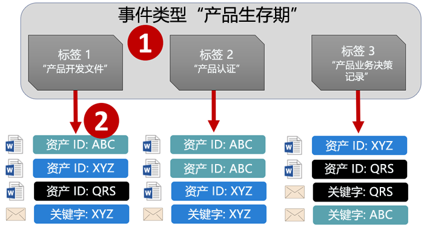
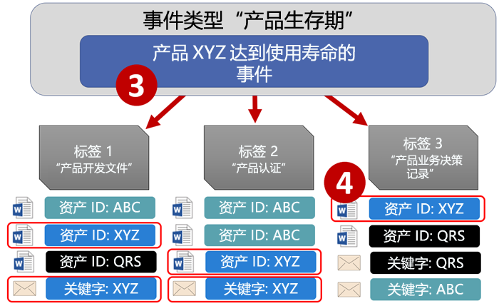
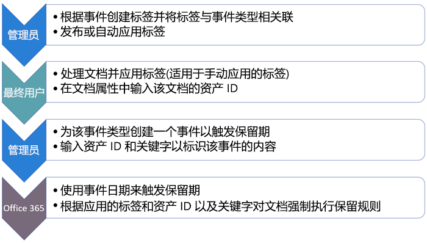
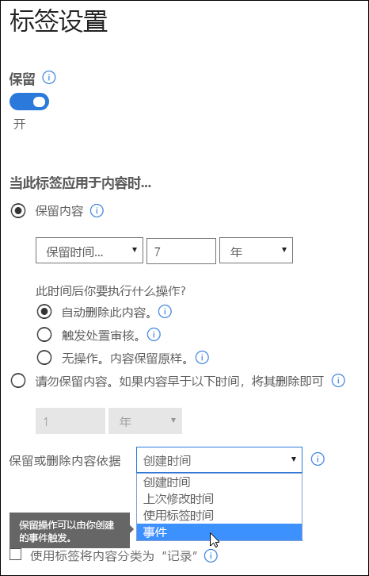
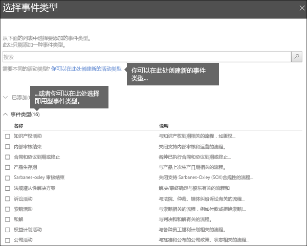
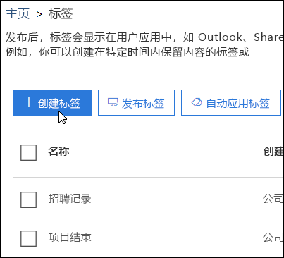
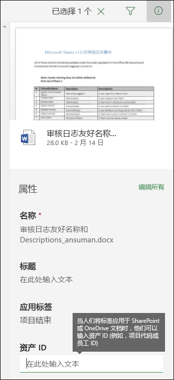
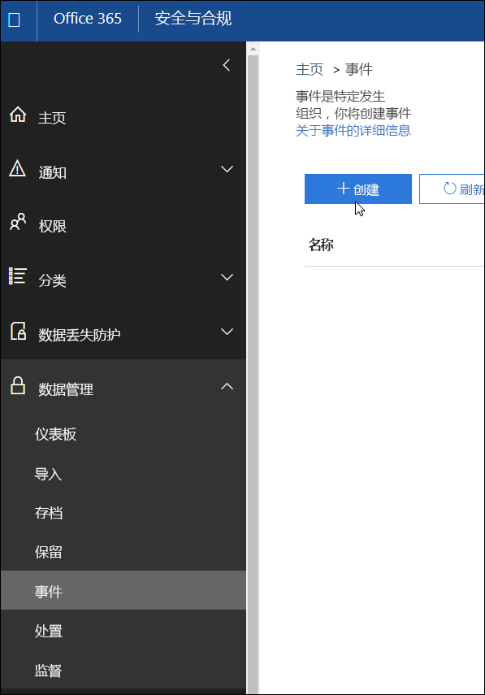
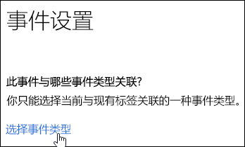
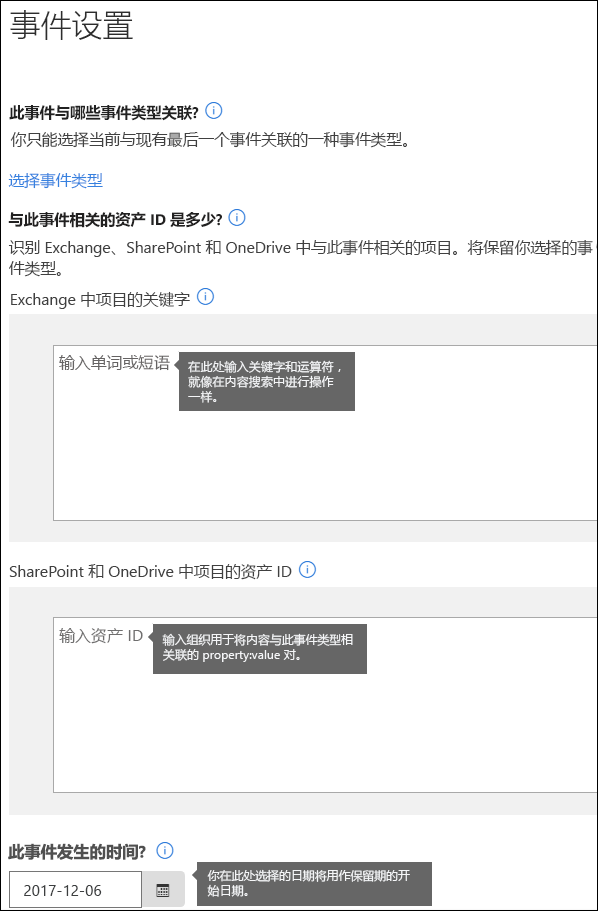

# 事件驱动保留概述

如果你保留内容，保留期通常是以内容年限为依据。例如，可以先将文档自创建起保留 7 年，再删除它们。不过，使用 Office 365 中的标签，还能让保留期以特定类型事件何时发生为依据。也就是说，事件触发开始计算保留期，并对包含与相应事件类型关联的标签的所有内容强制执行标签的保留操作。
  
例如，可对以下事件结合使用标签和事件驱动保留：
  
- **员工离开组织**：假设必须将员工记录自员工离开组织起保留 10 年。10 年之后，需要处置所有与离职员工的聘用、绩效和解雇有关的文档。触发 10 年保留期的事件是员工离开组织。 
    
- **合同到期**：假设必须将与合同相关的所有记录自合同到期起保留 5 年。触发 5 年保留期的事件是合同到期。 
    
- **产品生存期**：组织可能会对技术规范等内容规定与产品最后生产日期相关的保留要求。在这种情况下，触发保留期的事件是最后生产日期。 
    
事件驱动保留通常用于记录管理流程。也就是说：
  
- 基于事件的标签也通常将内容分类为记录。有关详细信息，请参阅[使用内容搜索来查找所有已应用有特定保留标签的内容](labels.md#using-content-search-to-find-all-content-with-a-specific-retention-label-applied-to-it)。
    
- 如果文档已声明为记录，但其触发事件尚未发生，那么文档会无限期保留（因为无法永久删除记录），直到触发文档保留期的事件发生。
    
- 基于事件的标签通常会在保留期到期时触发处置评审，这样记录管理者便能手动评审和处置内容。有关详细信息，请参阅[处置评审概述](disposition-reviews.md)。
    
基于事件的标签的功能与 Office 365 中的任何标签都相同。若要了解详情，请参阅[标签概述](labels.md)。
    
## 了解事件类型、标签、事件和资产 ID 之间的关系

为了成功使用事件驱动保留，请务必了解事件类型、标签、事件和资产 ID 之间的关系，如下所示。关系图后面紧跟着就是说明。
  

  

  
1. 为不同类型的内容创建标签，再将标签与事件类型相关联。例如，不同类型的产品文件和记录的标签与“产品生存期”事件类型相关联，因为必须将这些记录自产品生存期结束起保留 10 年。
    
2. 用户（通常为记录管理者）将这些标签应用于内容，并（对 SharePoint 和 OneDrive 文档）输入每项的资产 ID。在本示例中，资产 ID 是产品名称或组织使用的代码。所以，每个产品的记录都分配有标签，且每条记录都有一个包含资产 ID 的属性。此关系图表示组织的所有产品记录的**全部内容**，且每项都有记录所属产品的资产 ID。 
    
3. 事件类型是“产品生存期”，即事件是特定产品的生存期结束。当相应事件类型的事件（在本示例中，为产品生存期结束）发生时，创建指定以下信息的事件：
    
  - 资产 ID（对于 SharePoint 和 OneDrive 文档）
    
  - 关键字（对于 Exchange 项）。在本示例中，组织在包含产品记录的邮件中使用产品代码，因此 Exchange 项的关键字与 SharePoint 和 OneDrive 文档的资产 ID 相同。
    
  - 事件发生日期。此日期用作保留期的开始日期，只能是当前日期或未来日期，不能是过去日期。
    
4. 在你创建事件后，事件日期会同步到包含与相应事件类型关联的标签和指定资产 ID 或关键字的所有内容。与任何标签一样，此同步最长可能需要 7 天才能完成。在上面的关系图中，所有用红圈圈出的项的保留期由此事件触发。也就是说，当此产品的生存期结束时，这个事件就会触发此产品的记录的保留期。
    
请务必了解，如果没有为事件指定资产 ID 或关键字，那么包含与相应事件类型相关的标签的**所有内容**的保留期都会由此事件触发。也就是说，将会开始保留上面关系图中的所有内容。这可能并不符合你的预期。 
  
最后请注意，每个标签都有自己的保留设置。在本示例中，它们全都指定保留 10 年，但事件也可触发保留期不同的各个标签。
  
## 如何设置事件驱动保留

下面是事件驱动保留的简要工作流，后面紧跟着是更详细的步骤。
  

  
### 第 1 步：创建保留期以事件为依据的标签

在安全与合规中心内的左侧导航栏中，依次选择“分类”**** 下的“标签”****\>“创建标签”****。
  
创建标签后，启用“保留”，再按如下所示选择选项，以根据事件保留或删除内容。也就是说，在第 5 步中在“事件”**** 页上创建事件前，保留设置不会生效。 
  
请注意，事件驱动保留通常用于分类为记录的内容。因此，创建基于事件的标签时，通常会选中“使用标签将内容分类为记录”**** 选项。
  
另请注意，事件驱动保留要求保留设置必须：
  
- 保留内容。
    
- 在保留期到期时自动删除内容或触发处置评审。
    

  
### 第 2 步：选择与此标签关联的事件类型

在标签设置中，选择让标签基于**事件**的选项后，便会看到“选择事件类型”**** 选项。事件类型就是对要与标签相关联的事件的一般描述。
  
例如，如果创建“产品生存期”事件类型，所创建基于事件的标签的名称描述了，要将标签应用于什么类型的内容（如“产品开发文件”或“产品业务决策记录”）。
  
请注意，一旦选择事件类型和创建标签后，便无法再更改事件类型。
  

  
### 第 3 步：发布或自动应用标签

就像任何标签一样，必须发布或自动应用基于事件的标签，才能将标签手动或自动应用于内容。请在“标签”**** 页上执行此操作。请注意，将内容分类为记录的标签只能在发布后手动应用于内容，而不能自动应用于内容。 
  

  
### 第 4 步：输入资产 ID

在事件驱动标签应用于内容后，你可以输入每项的资产 ID。例如，组织可能会使用：
  
- 产品代码：可用于仅保留特定产品的内容。
    
- 项目代码：可用于仅保留特定项目的内容。
    
- 员工 ID：可用于仅保留特定人员的内容。
    
请注意，“资产 ID”就是 SharePoint 和 OneDrive for Business 中的另一文档属性。组织可能已使用其他文档属性和 ID 来分类内容。如果是这样，也可以在创建事件时使用这些属性和值（请参阅下面的第 6 步）。重要的是，组织必须在文档属性中使用一些属性:值组合，以便关联相应项和事件类型。
  

  
### 第 5 步：创建事件

当相应事件类型的特定实例（例如，产品的生存期结束）发生时，请转到安全与合规中心内的“事件”页，并创建事件。需要通过创建事件来手动触发事件。
  

  
### 第 6 步：选择第 2 步中标签使用的相同事件类型

创建事件后，选择第 2 步中标签使用的相同事件类型（例如，“产品生存期”）。只有包含与相应事件类型关联的标签，内容的保留期才会被触发。
  

  
### 第 7 步：输入关键字或资产 ID

现在指定 SharePoint 和 OneDrive 内容的资产 ID，或指定 Exchange 内容的关键字，以缩小内容范围。对于资产 ID，只会对包含指定属性:值对的内容强制执行保留操作。如果未输入资产 ID，包含与相应事件类型关联的标签的**所有内容**都会被应用相同的保留日期。 
  
请注意，“资产 ID”就是 SharePoint 和 OneDrive for Business 中的另一文档属性。如果使用的是“资产 ID”属性，应在下面的资产 ID 框中输入 ComplianceAssetID:\<value\>。
  
组织可能已向与此事件类型相关的文档应用其他属性和 ID。例如，如果你需要检测特定产品的记录，那么 ID 可能是自定义属性 ProductID 和值“XYZ”的组合。在这种情况下，应在下面的资产 ID 框中输入 ProductID:XYZ。
  
对于 Exchange 项，可添加关键字。可使用搜索运算符（如 AND、OR 和 NOT）优化查询。若要详细了解运算符，请参阅[适用于内容搜索的关键字查询和搜索条件](keyword-queries-and-search-conditions.md)。
  
最后，选择事件发生日期。此日期用作保留期的开始日期。在你创建事件后，事件日期会同步到包含与相应事件类型关联的标签、资产 ID 和关键字的所有内容。与任何标签一样，此同步最长可能需要 7 天才能完成。
  

  
## 使用内容搜索来查找所有包含特定标签或资产 ID 的内容

在标签分配到内容后，可使用安全与合规中心内的内容搜索，查找所有已使用特定标签进行分类或包含特定资产 ID 的内容。
  
创建内容搜索后：
  
- 若要查找所有包含特定标签的内容，请选择“合规性标记”**** 条件，再输入完整或部分标签名称并使用通配符。 
    
- 若要查找所有包含特定资产 ID 的内容，请输入 **ComplianceAssetID** 属性和值，如 ComplianceAssetID:\<value\>。 
    
有关详细信息，请参阅[适用于内容搜索的关键字查询和搜索条件](keyword-queries-and-search-conditions.md)。
  
## 权限

评审者必须是包含 **“处置管理”** 角色和 **“仅供查看审核日志”** 角色的角色组的成员，才能获取对“事件”**** 页的访问权限。建议新建“处置评审者”角色组，向此角色组添加这两个角色，再将成员添加到角色组中。 
  
有关详细信息，请参阅[向用户授予对 Office 365 安全与合规中心的访问权限](grant-access-to-the-security-and-compliance-center.md)。
  
## 使用 PowerShell 自动触发事件

在 Office 365 安全与合规中心内，只能手动创建事件；事件无法在发生时自动触发。不过，可使用 PowerShell 脚本在业务应用程序中自动触发基于事件的保留。
  
目前，我们正在努力开发 API，以便用户能关联业务应用程序（如 HR、CRM 或财务应用程序）和事件驱动保留。例如，你将能关联 HR 系统和事件驱动保留，这样当某位员工离开组织时，就会自动触发相应事件类型的事件。
  
在此之前，可对事件驱动保留使用下面的 PowerShell cmdlet：
  
- [Get-ComplianceRetentionEventType](https://go.microsoft.com/fwlink/?linkid=873002)
    
- [New-ComplianceRetentionEventType](https://go.microsoft.com/fwlink/?linkid=873004)
    
- [Remove-ComplianceRetentionEventType](https://go.microsoft.com/fwlink/?linkid=873005)
    
- [Set-ComplianceRetentionEventType](https://go.microsoft.com/fwlink/?linkid=873006)
    
- [Get-ComplianceRetentionEvent](https://go.microsoft.com/fwlink/?linkid=873001)
    
- [New-ComplianceRetentionEvent](https://go.microsoft.com/fwlink/?linkid=873003)
    

