# 文件计划管理器概述

文件计划管理器提供了对保留标签和保留策略的高级管理功能，并提供了便于遍历整个内容生存期（从创建、协作、记录声明、保留到最终处置）中的标签活动和标签到内容活动的集成方式。

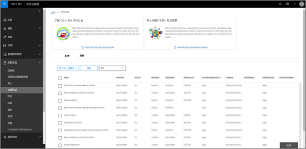

## 访问文件计划管理器

若要访问文件计划管理器，需要满足以下两项要求：
- 拥有 Office 365 企业版 E5 订阅。
- 用户已分配有下面的安全与合规中心角色之一：
    - 保留管理者
    - 仅拥有查看权限的保留管理者

## 默认保留标签和标签策略

如果“安全与合规中心”没有保留标签，则第一次在左侧导航栏中选择**文件计划**时，将创建名为**默认数据治理发布策略**的标签策略。 

此标签策略包含三个保留标签：

- **操作过程**
- **业务常规**
- **合同协议**

这些保留标签仅为保留内容，而非为删除内容而配置。 此标签策略将发布到整个公司，可以禁用或删除。 

可以通过查看保留策略的**创建的保留策略**和**创建的保留配置**活动的审核日志来判断谁打开了文件计划管理器并启动了首次运行体验。

> [!NOTE]
> 因客户反馈，我们已删除创建上述默认保留标签和标签政策的功能。 如果在 2019 年 4 月 11 日之前使用文件计划管理，则只会看到此政策和标签。

## 浏览文件计划

使用文件计划管理器，可以更轻松地在一个视图中查看所有保留标签和保留策略的设置。

请注意，文件计划中包含在文件计划内外创建的保留标签。

“文件计划标签”**** 选项卡提供了以下附加信息和功能：

### “标签设置”列

- “依据”**** 列指明将启动保留期的触发器类型。有效值为：
    - 事件
    - 创建时间
    - 上次修改时间
    - 标记时间
- “记录”**** 列指明项是否在标签应用时成为已声明记录。有效值为：
    - 否
    - 是
    - 是(法规)
- “保留”**** 列指明保留类型。有效值为：
    - 保留
    - 保留和删除
    - 删除
- “处置”**** 列指明在保留期到期时如何处置内容。有效值为：
    - Null
    - 无操作
    - 自动删除
    - 需要评审(亦称为“处置评审”)

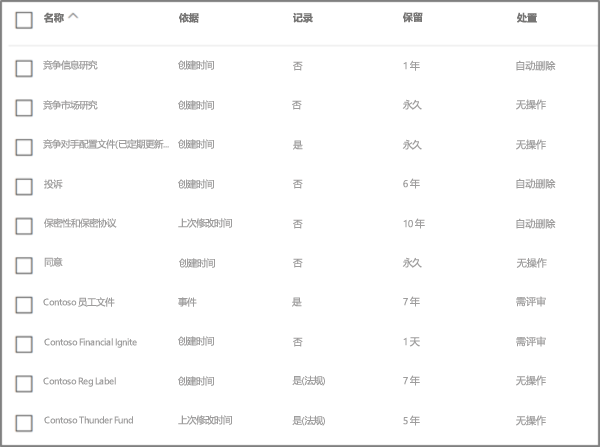

### 标签文件计划描述符列

现在可以在保留标签的配置中添加更多信息。将文件计划描述符插入标签，可提升文件计划的可管理性和条理性。

为了便于用户上手，文件计划管理器提供了一些现成值：“功能/部门”、“类别”、“权限类型”和“预配/引文”。可以在创建或编辑保留标签时，添加新的文件计划描述符值。

下图展示了创建或编辑保留标签时有关文件计划描述符的步骤。

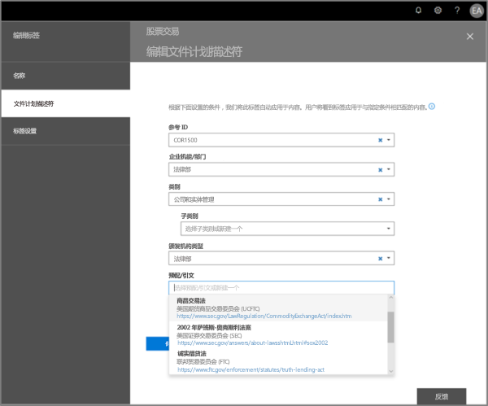

下图展示了文件计划管理器的“标签”选项卡上的文件计划描述符列。

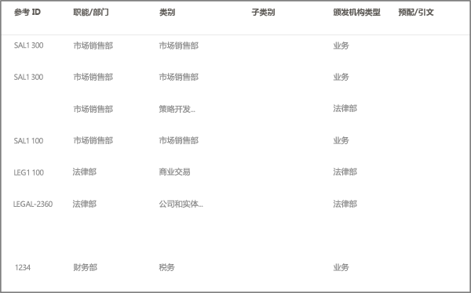

## 导出文件计划的标签

在文件计划管理器中，可以将所有保留标签的详细信息都导出到 .csv 文件中，这样做有助于推动定期与组织中数据管理利益干系人一起执行合规性评审。

若要导出所有保留标签，请依次转到“文件计划管理器”****\>“文件计划操作”****\>“导出标签”****。

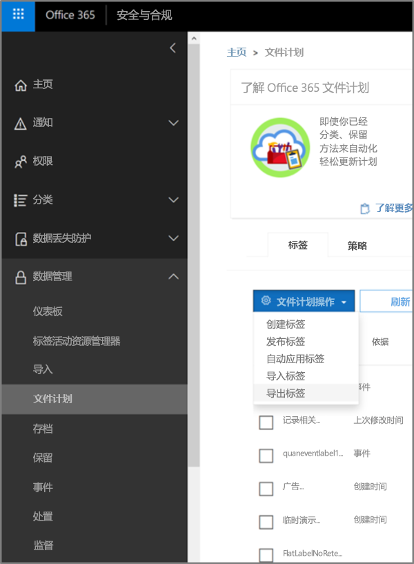

此时，包含所有现有保留标签的 *.csv 文件打开。

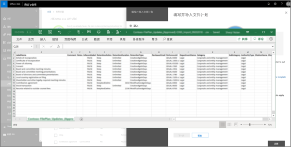

## 向文件计划导入标签

在文件计划管理器中，可以批量导入新标签，并能修改现有保留标签。

若要导入新保留标签，并更新现有保留标签，请依次转到“文件计划管理器”****\>“文件计划操作”****\>“导入标签”****。

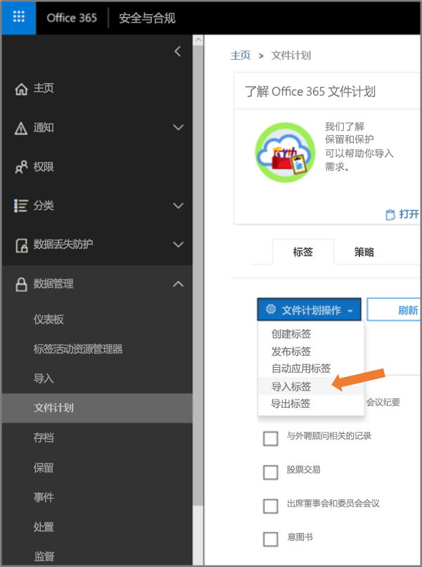

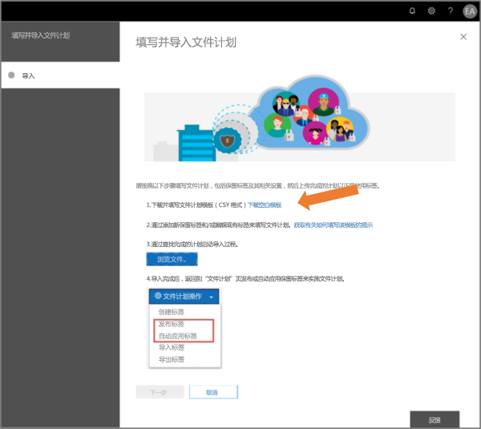

下载空白模板（或从当前文件计划导出开始）。

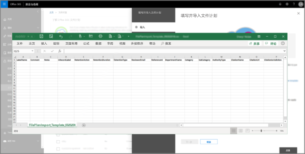

填写模板（即将发布有关条目有效值的参考信息）。

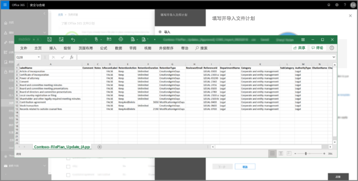

上传已填写的模板，此时文件计划管理器会验证条目，并显示导入统计信息。

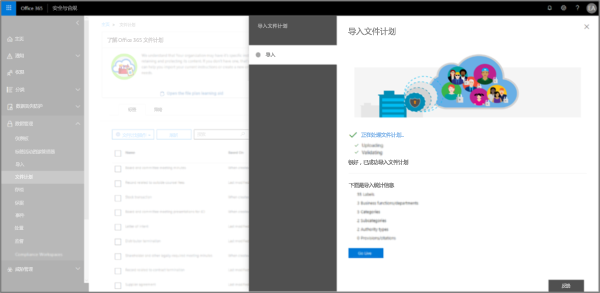

导入完成后，返回到文件计划管理器，将新标签分配到新策略或现有策略。

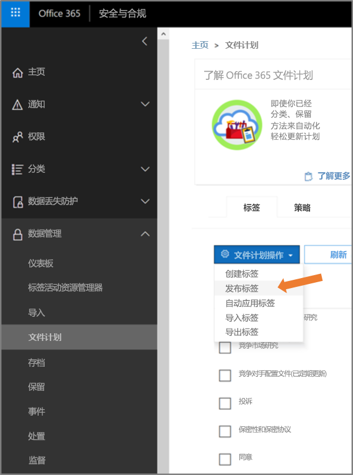

