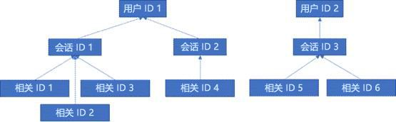

# 用于 Office Web Apps Server 和 Office Online Server 的 GDPR

Office Online Server 和 Office Web Apps Server 遥测数据以 ULS 日志的形式存储。可以使用 [ULS 查看器](https://www.microsoft.com/en-us/download/details.aspx?id=44020)查看本地租户的 ULS 日志。

每个日志行都包含一个 CorrelationID。相关的日志行使用相同的 CorrelationID。每个 CorrelationID 都与一个 SessionID 绑定，并且一个 SessionID 可能与许多 CorrelationID 相关。每个 SessionID 可能与单 个UserID 相关，但某些会话可能是匿名的，因此没有关联的 UserID。因此，为了确定哪些数据与特定用户相关联，可以从单个 UserID 映射到与该用户相关联的 SessionID，从那些 SessionID 映射到相关联的 CorrelationID，以及从 CorrelationID 映射到这些相关性中的所有日志。请参阅下图了解不同 ID 之间的关系。

## 收集日志

例如，为了收集与 UserID 1 相关的所有日志，第一步将收集与 UserID 1 相关的所有会话（即，SessionID 1 和 SessionID 2）。下一步将收集与 SessionID 1（即，SessionID 1、2 和 3）和 SessionID 2（即，CorrelationID 4）相关的所有相关性。最后，收集与列表中每个相关性关联的所有日志。

1.  启动 UlsViewer

2.  打开和预期时间范围对应的 ULS 日志；ULS 日志存储在 %PROGRAMDATA%\\Microsoft\\OfficeWebApps\\Data\\Logs\\ULS 中

3.  编辑 | 修改筛选器

4.  应用以下筛选器：

    -   EventID equals apr3y 或

    -   EventID equals bp2d6

5.  哈希 UserID 将位于这两个事件中任何一个的消息中

6.  对于 apr3y，消息将包含一个 UserID 值和一个 PUID 值

7.  对于 bp2d6，消息将包含相当多的信息。LoggableUserId 值字段是哈希 UserID。

8.  从这两个标签中任何一个获得哈希 UserID 后，ULSViewer 中该行的 WacSessionId 值将包含与该用户关联的 WacSessionId

9.  收集与相关用户关联的所有 WacSessionId 值

10. 对于列表中的第一个 WacSessionId，筛选所有等于“xmnv”的 EventId、等于“UserSessionId=\<WacSessionId\>的 Message（将筛选器的 \<WacSessionId\> 部分替换为 WacSessionId）

11. 收集与该 WacSessionId 匹配的所有 Correlation 值

12. 对列表中相关用户的所有 WacSessionId 值重复步骤 10-11

13. 筛选列表中所有等于第一个 Correlation 的 Correlation

14. 收集与该 Correlation 匹配的所有日志

15. 对列表中相关用户的所有 Correlation 值重复步骤 13-14

## 数据类型

Office Online 日志包含各种不同类型的数据。以下是 ULS 日志可能包含的数据示例：

-   在使用产品期间遇到的问题的错误代码

-   按钮单击和其他关于应用使用情况的数据

-   有关应用和/或应用内特定功能的性能数据

-   有关用户计算机位置的常规位置信息（例如，来自 IP 地址的国家/地区、省/市/自治区和城市），但不是精确的地理位置

-   有关浏览器（例如浏览器名称和版本）和计算机（例如操作系统类型和版本）的基本元数据

-   来自文档主机的错误消息（例如 OneDrive、SharePoint、Exchange）

-   有关应用内部进程的信息，与用户采取的任何操作无关
