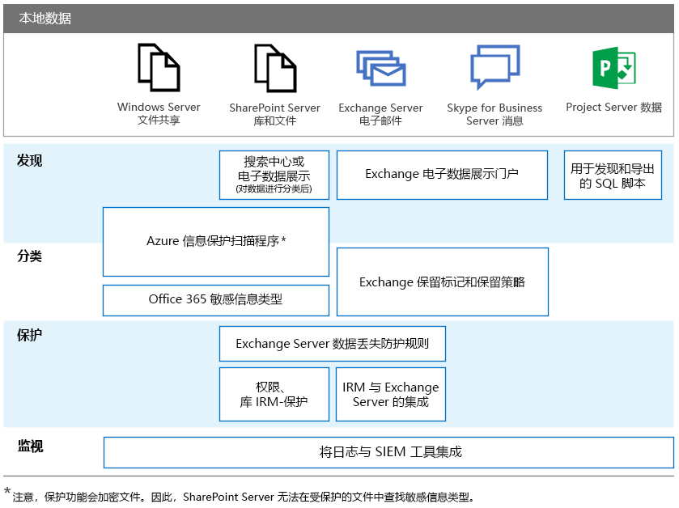

# 用于本地 Office 服务器的 GDPR

一般数据保护条例 (GDPR) 为组织提供了保护个人数据和适当回应数据主体请求的要求。本系列文章为本地工作负载提供了推荐的方法：

-   [SharePoint Server](gdpr-for-sharepoint-server.md)

-   [Exchange Server](gdpr-for-exchange-server.md)

-   [Skype for Business Server](gdpr-for-skype-for-business-server.md)

-   [Project Server](gdpr-for-project-server.md)

-   [Office Web Apps Server 和 Office Online Server](gdpr-for-office-online-server.md)

-   [本地文件共享](gdpr-for-on-premises-file-shares.md)

有关 GDPR 以及 Microsoft 如何为你提供帮助的详细信息，请参阅 [Microsoft 信任中心](https://www.microsoft.com/zh-CN/TrustCenter/Privacy/gdpr/default.aspx)。

在开展有关本地数据的任何工作之前，请咨询你的法律和合规性团队以寻求指导并了解现有分类架构和处理个人数据的方法。Microsoft 提供了有关在 Microsoft GDPR 数据发现工具包（位于 [http://aka.ms/gdprpartners](<http://aka.ms/gdprpartners>)）中开发和扩展分类架构的建议。此工具包还介绍了将本地数据移动到云的方法，可以使用更复杂的数据治理功能（如果需要）。该部分中的文章提供了有关保留在本地的数据的建议。

下图列出了在各个工作负载中使用的推荐功能，用于发现、保护和监视个人数据并对其进行分类。有关更多信息，请参阅该部分中的文章。

## 图示说明

为便于访问，下表提供了上图中的相同示例。

|             |Windows Server 文件共享|SharePoint Server|Exchange Server|Skype for Business|Project Server|
|:------------|:-------------------------|:----------------|:--------------|:-----------------|:-------------|
|发现|Azure 信息保护扫描程序*|搜索中心或电子数据展示（数据分类后）；Azure 信息保护扫描程序*|Exchange 电子数据展示门户|Exchange 电子数据展示门户|用于发现和导出的 SQL 脚本|
|分类|Azure 信息保护扫描程序*；Office 365 敏感信息类型|Azure 信息保护扫描程序*；Office 365 敏感信息类型|Exchange 保留标记和保留策略|Exchange 保留标记和保留策略||
|保护||Exchange Server 数据丢失防护规则；权限，库的 IRM 保护|Exchange Server 数据丢失防护规则；与 Exchange Server 的 IRM 集成|||
|监视|将日志与 SIEM 工具集成|将日志与 SIEM 工具集成|将日志与 SIEM 工具集成|将日志与 SIEM 工具集成|将日志与 SIEM 工具集成|

*注意，保护功能会加密文件。因此，SharePoint Server 无法在受保护的文件中查找敏感信息类型。
