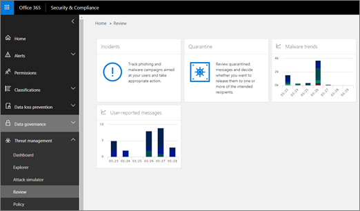

# 威胁智能入门Get started with Threat Intelligence

如果您是组织的安全团队的一部分, 则可以使用威胁智能功能来保护您的用户免受攻击。Office 365 高级威胁防护计划 2 (以前称为 "office 365 威胁智能") 可帮助安全分析员和管理员根据您的 Office 365 环境中发生的情况, 通过冒泡和识别操作使用户保持安全。这些见解基于威胁智能数据和系统的综合存储库, 以提供与攻击行为和可疑活动对应的发现模式。If you are part of your organization's security team, you can use Threat Intelligence capabilities to protect your users from attacks. Office 365 Advanced Threat Protection Plan 2 (formerly Office 365 Threat Intelligence) helps security analysts and administrators keep users safe by bubbling up insights and identifying action based on what is happening in their your Office 365 environment. These insights are based on a comprehensive repository of threat intelligence data and systems to spot patterns that correspond to attack behaviors and suspicious activity.
  
阅读本文, 了解有关威胁智能和入门方式的详细信息。Read this article to learn more about Threat Intelligence and how to get started.
  
## 什么是威胁智能？What is Threat Intelligence?

威胁智能是 Office 365 安全&amp;合规中心中提供的见解和信息的集合。这些见解可帮助贵组织的安全团队保护 Office 365 用户免受攻击。威胁智能监视信号并收集来自多个源 (如用户活动、身份验证、电子邮件、受损电脑和安全事件) 的数据。业务决策者和 Office 365 全局管理员、安全管理员和安全分析员都可以使用 office 365 威胁智能提供的信息来了解有关 office 365 用户和知识的威胁并对其做出响应财产.Threat Intelligence is a collection of insights and information available in the Office 365 Security &amp; Compliance Center. These insights can help your organization's security team protect Office 365 users from attacks. Threat Intelligence monitors signals and gathers data from multiple sources, such as user activity, authentication, email, compromised PCs, and security incidents. Business decision makers and Office 365 global administrators, security administrators, and security analysts can all use the information Office 365 Threat Intelligence provides to understand and respond to threats against Office 365 users and intellectual property.

> [!IMPORTANT]
> 从2019年2月起开始, 在接下来的几个月中, office 365 威胁情报将成为 office 365 高级威胁防护计划 2, 其中包含其他威胁防护功能。若要了解详细信息, 请参阅[office 365 高级威胁防护计划和定价](https://products.office.com/exchange/advance-threat-protection)以及[Office 365 高级威胁防护服务说明](https://docs.microsoft.com/office365/servicedescriptions/office-365-advanced-threat-protection-service-description)。Beginning in February 2019 and rolling out over the next several months, Office 365 Threat Intelligence is becoming Office 365 Advanced Threat Protection Plan 2, with additional threat protection capabilities. To learn more, see [Office 365 Advanced Threat Protection plans and pricing](https://products.office.com/exchange/advance-threat-protection) and the [Office 365 Advanced Threat Protection Service Description](https://docs.microsoft.com/office365/servicedescriptions/office-365-advanced-threat-protection-service-description).
  
## 了解威胁仪表板、资源管理器和事件Get acquainted with the Threat dashboard, Explorer, and Incidents

安全&amp;合规中心中的威胁智能图面, 作为一组工具和报告, 包括[威胁仪表板](get-started-with-ti.md#dashboard)、[威胁浏览器](get-started-with-ti.md#explorer)和[事件](get-started-with-ti.md#incidents)。Threat Intelligence surfaces in the Security &amp; Compliance Center, as a set of tools and reports, including the [Threat dashboard](get-started-with-ti.md#dashboard), [Threat Explorer](get-started-with-ti.md#explorer), and [Incidents](get-started-with-ti.md#incidents).
  
### 威胁仪表板Threat dashboard

使用 "威胁" 仪表板 (也称为 "安全"[仪表板](security-dashboard.md)) 快速查看已解决的威胁, 并以直观方式向业务决策者报告 Office 365 服务如何保护您的业务。Use the Threat dashboard (this is also referred to as the [Security dashboard](security-dashboard.md)) to quickly see what threats have been addressed, and as a visual way to report to business decision makers how Office 365 services are securing your business.
  

  
若要查看和使用此仪表板, 请&amp;在安全合规性中心中, 转到 "**威胁管理** \> "**仪表板**。To view and use this dashboard, in the Security &amp; Compliance Center, go to **Threat management** \> **Dashboard**.
  
### 威胁资源管理器Threat Explorer

使用威胁资源管理器 (也称为 "资源管理器") 分析威胁、查看一段时间内的攻击量, 以及根据威胁系列、攻击者基础结构等对数据进行分析。威胁资源管理器是任何安全分析员的调查工作流的起始位置。Use the Threat Explorer (this is also called Explorer) to analyze threats, see the volume of attacks over time, and analyze data by threat families, attacker infrastructure, and more. Threat Explorer is the starting place for any security analyst's investigation workflow.
  

  
若要查看和使用此报告, 请在&amp;安全合规性中心中, 转到 "**威胁管理** \> **资源管理器**"。To view and use this report, in the Security &amp; Compliance Center, go to **Threat management** \> **Explorer**.
  
 ### 例Incidents

使用 "事件" 列表 (也称为 "调查") 查看飞行安全事件的列表。事件用于跟踪可疑电子邮件等威胁, 并进行进一步调查和修正。Use the Incidents list (this is also called Investigations) to see a list of in flight security incidents. Incidents are used to track threats such as suspicious email messages, and to conduct further investigation and remediation.
  

  
若要查看您的组织的当前事件列表, 请在安全&amp;合规性中心中, 转到 "**威胁管理** \> **审核** \> **事件**"。To view the list of current incidents for your organization, in the Security &amp; Compliance Center, go to **Threat management** \> **Review** \> **Incidents**.
  

  
## 了解有关恶意软件&amp;威胁的详细信息Learn more about Malware &amp; Threats

作为 Office 365 高级威胁防护计划2产品的一部分, 安全分析员可以查看已知威胁的详细信息。这有助于确定是否存在可采取的更多预防措施/步骤, 以确保用户安全。As part of the Office 365 Advanced Threat Protection Plan 2 offering, security analysts can review details about a known threat. This is useful to determine whether there are additional preventative measures/steps that can be taken to keep users safe.
  
 
  
## 如何获取威胁智能？How do we get Threat Intelligence?

**威胁智能现已成为 Office 365 高级威胁防护计划2中的一部分**, 在某些订阅 (如[microsoft 365 企业版](https://www.microsoft.com/microsoft-365/enterprise/home)、 [microsoft 365 Business](https://www.microsoft.com/microsoft-365/business)、office 365 企业版 E5、office 365) 中包含。教育版 A5 等。如果您的组织有一个不包含 Office 365 ATP 的订阅, 则可能会将 atp 作为加载项进行购买。有关详细信息, 请参阅[office 365 高级威胁防护计划和定价](https://products.office.com/exchange/advance-threat-protection)和[Office 365 高级威胁防护服务说明](https://docs.microsoft.com/en-us/office365/servicedescriptions/office-365-advanced-threat-protection-service-description#whats-new-in-office-365-advanced-threat-protection-atp)。**Threat Intelligence is now part of in Office 365 Advanced Threat Protection Plan 2**, which is included in in certain subscriptions, such as [Microsoft 365 Enterprise](https://www.microsoft.com/microsoft-365/enterprise/home), [Microsoft 365 Business](https://www.microsoft.com/microsoft-365/business), Office 365 Enterprise E5, Office 365 Education A5, etc. If your organization has a subscription that does not include Office 365 ATP, you can potentially purchase ATP as an add-on. For more information, see [Office 365 Advanced Threat Protection plans and pricing](https://products.office.com/exchange/advance-threat-protection) and the [Office 365 Advanced Threat Protection Service Description](https://docs.microsoft.com/en-us/office365/servicedescriptions/office-365-advanced-threat-protection-service-description#whats-new-in-office-365-advanced-threat-protection-atp).
  
1. 作为 office 365 全局管理员, 请转到[https://portal.office.com](https://portal.office.com)并使用 Office 365 的工作或学校帐户登录并登录。As an Office 365 global administrator, go to [https://portal.office.com](https://portal.office.com) and sign in using your work or school account for Office 365. 
    
2. 选择 "**管理员** \> **帐单**" 以查看您的当前订阅包括的内容。Choose **Admin** \> **Billing** to see what your current subscription includes. 

    - 如果您看到**office 365 企业版 E5**, 则您的组织具有 office 365 高级威胁防护计划 2, 其中包括威胁智能。If you see **Office 365 Enterprise E5**, then your organization has Office 365 Advanced Threat Protection Plan 2, which includes Threat Intelligence. 
    - 如果你看到不同的订阅 (如**Office 365 企业版 E3**或**office 365 企业版 E1**), 请考虑添加高级威胁防护计划2。(为此, 请选择 " **+ 添加订阅**"。)If you see a different subscription, such as **Office 365 Enterprise E3** or **Office 365 Enterprise E1**, consider adding Advanced Threat Protection Plan 2. (To do that, choose **+ Add subscription**.)
    
3. 在 Office 365 管理中心中, 选择 "**用户** \> **活动用户**"。In the Office 365 admin center, choose **Users** \> **Active users**.
    
5. 将 Office 365 高级威胁防护许可证分配给所有活动用户。(只有拥有威胁智能功能许可证的用户才会显示在报告中, 如 Explorer)。Assign Office 365 Advanced Threat Protection licenses to all active users. (Only users who have a license for Threat Intelligence capabilities will show up in reports, such as Explorer.)
    
6. 为组织中将使用 Office 365 高级威胁防护的人员分配角色。请参阅[向用户授予对 Office 365 安全&amp;合规中心的访问权限](grant-access-to-the-security-and-compliance-center.md), 并参阅下表:Assign roles to people in your organization who will be working with the Office 365 Advanced Threat Protection. See [Give users access to the Office 365 Security &amp; Compliance Center](grant-access-to-the-security-and-compliance-center.md), and refer to the following table:
    
|||
|:-----|:-----|
|**若要执行此活动 .。。****To do this activity...**   |**您必须具有以下角色之一****You must have one of these roles**   |
|使用威胁仪表板 (或新[安全仪表板](security-dashboard.md))Use the Threat dashboard (or the new [Security dashboard](security-dashboard.md))    查看有关最近或当前威胁的信息View information about recent or current threats    |Office 365 全局管理员Office 365 Global Administrator    安全管理员 (在 Azure Active Directory 管理中心中分配)Security Administrator (assigned in the Azure Active Directory admin center)    安全读者 (在 Azure Active Directory 管理中心中分配)Security Reader (assigned in the Azure Active Directory admin center)    |
|使用威胁资源管理器 (也称为资源管理器)Use Threat Explorer (also referred to as Explorer)    分析威胁Analyze threats    |Office 365 全局管理员Office 365 Global Administrator    安全管理员 (在安全&amp;合规中心中分配)Security Administrator (assigned in the Security &amp; Compliance Center)    安全读者 (在安全&amp;合规中心中分配)Security Reader (assigned in the Security &amp; Compliance Center)    |
|查看事件 (也称为调查)View Incidents (also referred to as Investigations)   将电子邮件添加到事件Add email messages to an incident    |Office 365 全局管理员Office 365 Global Administrator    安全管理员 (在安全&amp;合规中心中分配)Security Administrator (assigned in the Security &amp; Compliance Center)    安全读者 (在安全&amp;合规中心中分配)Security Reader (assigned in the Security &amp; Compliance Center)    |
|触发事件中的电子邮件操作Trigger email actions in an incident    查找和删除可疑电子邮件Find and delete suspicious email messages    |Office 365 全局管理员或安全管理员Office 365 Global Administrator or Security Administrator    上述角色之一和搜索和清除 (在安全&amp;合规中心中分配)One of the roles above and Search and Purge (assigned in the Security &amp; Compliance Center)    |
|将 Office 365 威胁智能与 Windows Defender 高级威胁防护集成Integrate Office 365 Threat Intelligence with Windows Defender Advanced Threat Protection    将 Office 365 威胁智能与 SIEM 服务器集成Integrate Office 365 Threat Intelligence with a SIEM server    |Office 365 全局管理员Office 365 Global Administrator    安全管理员 (在安全&amp;合规中心中分配)Security Administrator (assigned in the Security &amp; Compliance Center)    在其他应用程序中分配的相应角色 (如 Windows Defender 高级威胁防护门户或 SIEM server)Appropriate role assigned in additional applications (such as Windows Defender Advanced Threat Protection portal or a SIEM server)    |
   
有关角色、角色组和权限的信息, 请参阅[Office 365 安全&amp;合规中心中的权限](permissions-in-the-security-and-compliance-center.md)。For information about roles, role groups, and permissions, see [Permissions in the Office 365 Security &amp; Compliance Center](permissions-in-the-security-and-compliance-center.md).
    
## 后续步骤Next steps

- [了解威胁跟踪-新增和值得注意的事项Learn about Threat Trackers - New and Noteworthy](threat-trackers.md)
    
- [查找并调查提供的恶意电子邮件 (Office 365 威胁智能)Find and investigate malicious email that was delivered (Office 365 Threat Intelligence)](investigate-malicious-email-that-was-delivered.md)
    
- [将 Office 365 威胁智能与 Windows Defender 高级威胁防护集成Integrate Office 365 Threat Intelligence with Windows Defender Advanced Threat Protection](integrate-office-365-ti-with-wdatp.md)
    
- [了解攻击模拟器Learn about Attack Simulator](attack-simulator.md)
  

