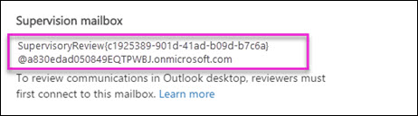

# <a name="install-the-supervision-add-in-for-outlook-desktop"></a>安装适用于 Outlook 桌面版的监督加载项

若要查看 communications 监督策略的标识，监督外接程序 Outlook 和 Outlook 的审阅者使用的 web 应用程序。外接程序是自动安装 Outlook web app 中的所有策略中指定的审阅者。但是，审阅者必须通过一些步骤将其安装桌面的 Outlook 版本中运行。
  
> [!NOTE]
> 使用监督策略要求对您的组织的 Office 365 E5 订阅。如果您不具有该计划，并且想要尝试监督，您还可以[注册试用版的 Office 365 企业 E5](https://go.microsoft.com/fwlink/p/?LinkID=698279)。 
  
## <a name="step-1-copy-the-address-for-the-supervision-mailbox"></a>步骤 1： 复制监督邮箱的地址

若要安装外接程序 Outlook 桌面程序，您将需要作为监督策略设置的一部分创建的监督邮箱地址。 
  
> [!NOTE]
> 如果其他人创建策略，您将需要从原始安装外接程序获得此地址。 
  
 **若要查找的监督邮箱地址**
  
1. 登录到[安全&amp;合规性中心](https://protection.office.com)使用 Office 365 组织中的管理帐户的凭据。 
    
2. 转到**数据调控** \> **监督**。
    
3. 单击收集的通信您想要查看的监督策略。
    
4. 在策略下详细弹出，* * 监督邮箱 * *，复制该地址。 
    
    
  
## <a name="step-2-configure-the-supervision-mailbox-for-outlook-desktop-access"></a>步骤 2： 配置 Outlook 桌面访问的监督邮箱

接下来，审阅者将需要运行的几 Exchange Online PowerShell 命令，以便他们可以将 Outlook 连接到监督邮箱。
  
1. 连接到 Exchange Online PowerShell 中。[我该如何做？](https://docs.microsoft.com/powershell/exchange/exchange-online/connect-to-exchange-online-powershell/connect-to-exchange-online-powershell)
    
2. 运行下列命令。
    
  ```
  Add-MailboxPermission "SupervisoryReview{GUID}@domain.onmicrosoft.com" -User <alias or email address of the account that has reviewer permissions to the supervision mailbox> -AccessRights FullAccessSet-Mailbox "<SupervisoryReview{GUID}@domain.onmicrosoft.com>" -HiddenFromAddressListsEnabled: $false
  ```

    其中*SupervisoryReview{GUID}@domain.onmicrosoft.com*是您在上面的步骤 1 中复制的地址，*用户*是将连接到下一步中的监督邮箱审核者的名称。 
    
3. 等待至少一个小时之后才能接着下面的步骤 3。
    
## <a name="step-3-create-an-outlook-profile-to-connect-to-the-supervision-mailbox"></a>步骤 3： 创建 Outlook 配置文件连接到监督邮箱

最后一步，将需要审阅者创建的 Outlook 配置文件连接到监督邮箱。 
  
> [!NOTE]
> 若要创建新的 Outlook 配置文件，您将使用 Windows 控制面板中邮件设置。您需要访问这些设置的路径可能取决于您正在使用的 Windows 操作系统 （Windows 7、 Windows 8 或 Windows 10） 和安装哪个版本的 Outlook。 
  
1. 打开控制面板，并在窗口顶部的**搜索**框中，键入**邮件**。 
    
    > [!NOTE]
    > 不确定如何获取控制面板？请参阅[其中是 Control Panel？](https://support.microsoft.com/help/13764/windows-where-is-control-panel)
  
2. 打开**邮件**应用程序。 
    
3. 在**邮件设置-Outlook**中，单击**显示配置文件**。
    
    
  
4. 在**邮件**框中，单击**添加**。然后，在**新的配置文件**中，输入监督邮箱 （例如**监督**） 的名称。
    
    
  
5. 在**将 Outlook 连接到 Office 365**中，单击**连接到不同的帐户**。
    
    
  
6. 在**自动帐户设置**中，选择**手动安装或其他服务器类型**，然后单击**下一步**。
    
7. 在**选择帐户类型**，选择**Office 365**。然后，在**电子邮件地址**框中，输入之前复制监督邮箱的地址。 
    
    
  
8. 出现提示时，输入您的 Office 365 凭据。
    
9. 如果成功，您将看到**监督-\<策略名称\>** 在 Outlook 的文件夹列表视图中列出的文件夹。 
    

