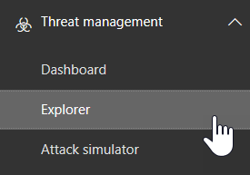

# 将 Office 365 高级威胁防护与 Microsoft Defender 高级威胁防护集成

如果您是组织的安全团队的一部分, 则可以使用[Microsoft Defender 高级威胁防护](https://docs.microsoft.com/windows/security/threat-protection/microsoft-defender-atp/microsoft-defender-advanced-threat-protection)将[Office 365 高级威胁防护](office-365-atp.md)与相关调查和响应功能集成。 这可以帮助您快速了解在调查 Office 365 中的威胁时用户的计算机是否存在风险。 例如, 在启用集成后, 您将能够查看检测到的电子邮件的收件人使用的计算机列表, 以及这些计算机在 Microsoft Defender 高级威胁防护中的最近通知数。
  
下图显示了启用 Microsoft Defender ATP 集成时将看到的 "**设备**" 选项卡:
  

  
在此示例中, 您可以看到电子邮件的收件人有四台设备, 并且有一个警报。 单击设备的链接将在 Microsoft Defender 安全中心中打开其页面。
  
## 要求

- 您的组织必须具有 Office 365 ATP 计划 2 (或 Office 365 E5) 和 Microsoft Defender ATP。
    
- 您必须是 Office 365 全局管理员或在[ &amp;安全合规中心](https://protection.office.com)中分配安全管理员角色 (例如安全管理员)。 (请参阅[Office 365 安全&amp;合规中心中的权限](permissions-in-the-security-and-compliance-center.md))
    
- 您必须有权访问安全 & 合规性中心和 Microsoft Defender 安全中心中的[资源管理器 (或实时检测)](threat-explorer.md) 。
    
## 将 Office 365 ATP 与 Microsoft Defender ATP 集成

通过使用安全 & 合规性中心和 Microsoft Defender 安全中心, 将 Office 365 ATP 与 Microsoft Defender ATP 集成。
  
1. 作为 Office 365 全局管理员或安全管理员, 请转到[https://protection.office.com](https://protection.office.com)并使用 Office 365 的工作或学校帐户登录。
    
2. 选择 "**威胁管理** \> **资源管理器**"。  
    
3. 在屏幕的右上角, 选择 " **WDATP 设置**"。
    
4. 在 "Windows Defender ATP 连接" 对话框中, 启用 "连接到 Windows ATP"。  
    
5. 在 Microsoft Defender 安全中心启用连接。

  
## 相关主题

[Office 365 威胁调查和响应](office-365-ti.md)
  
[Office 365 高级威胁防护](office-365-atp.md)
  

