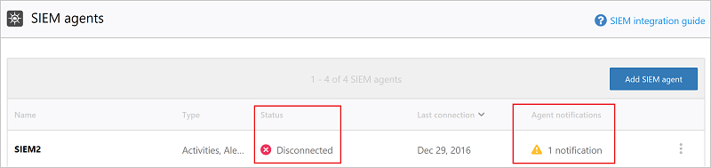
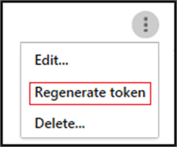

# <a name="integrate-your-siem-server-with-office-365-cloud-app-security"></a>将 SIEM 服务器与 Office 365 云应用安全集成
  
|评估 * *\>**|规划 * *\>**|部署 * *\>**|利用率 * * * *|
|:-----|:-----|:-----|:-----|
|[开始评估](office-365-cas-overview.md) <br/> |[开始规划](get-ready-for-office-365-cas.md) <br/> |你在这里!  <br/> [后续步骤](utilization-activities-for-ocas.md) <br/> |[开始利用](utilization-activities-for-ocas.md) <br/> |
   
## <a name="overview-and-prerequisites"></a>概述和先决条件

您可以将[Office 365 云应用安全性](get-ready-for-office-365-cas.md)与安全信息和事件管理 (SIEM) 服务器集成, 以启用对警报的集中式监视。 对于使用云服务和本地服务器应用程序的组织而言, 这一点尤其有用。 你可以将 SIEM 服务器集成到 SIEM 服务器中, 以将 Office 365 云应用安全中的警报和活动放入其中。 通过与 SIEM 服务器集成, 您的安全团队可以在维护常规安全工作流的同时, 通过自动执行某些安全过程以及在基于云的和本地事件之间关联, 从而更好地保护 Office 365 应用程序。  
  
当您首次将 SIEM 服务器与 Office 365 云应用程序集成在一起时, 来自最近两天的警报将被转发到 SIEM 服务器, 以及来自随后的所有警报 (基于您选择的任何筛选器)。 此外, 如果您在较长的时间段内禁用此功能, 则再次启用它时, 它会将过去两天的通知转发给过去两天的通知, 然后在上转发所有警报。

### <a name="siem-integration-architecture"></a>SIEM 集成体系结构

在组织的网络中设置 SIEM 代理。 部署和配置后, SIEM 代理将使用 Office 365 云应用安全 RESTful api 提取已配置 (警报) 的数据类型。 然后, 通过端口443上的加密 HTTPS 通道发送流量。
  
当 SIEM 代理从 Office 365 云应用安全中检索数据时, 会使用在安装过程中提供的网络配置 (TCP 或 UDP 具有自定义端口) 将 Syslog 邮件发送到本地 SIEM 服务器。


### <a name="supported-siem-servers"></a>支持的 SIEM 服务器

Office 365 云应用安全目前支持以下 SIEM 服务器:
- 微焦点 ArcSight
- 泛型 CEF

### <a name="prerequisites"></a>先决条件

- 您必须是全局管理员或安全管理员才能执行本文中所述的任务。 查看[Office 365 安全&amp;合规中心中的权限](permissions-in-the-security-and-compliance-center.md)

- 您必须为您的组织[启用 Office 365 云应用安全性](turn-on-office-365-cas.md)。

- 必须为 Office 365 启用[审核日志记录](turn-audit-log-search-on-or-off.md)

- 您必须具有满足以下要求的标准服务器, 才能配置 SIEM 服务器集成:
    - 操作系统: Windows 或 Linux (这可以是虚拟机)
    - CPU: 2
    - 磁盘空间:20 GB
    - RAM: 2 GB
    - 已安装[Oracle Java 8](http://www.oracle.com/technetwork/java/javase/downloads/index.html)
    - 按照[网络要求](https://docs.microsoft.com/cloud-app-security/network-requirements)中所述配置的防火墙

- 您必须具有有关**远程 syslog 主机**和**Syslot 端口号**的详细信息。 网络管理员或安全管理员应能够帮助您找到该信息。 

- 您必须同意[软件许可条款](https://go.microsoft.com/fwlink/?linkid=862491), 才能下载集成您的 SIEM 服务器所需的[JAR 文件](https://go.microsoft.com/fwlink/?linkid=838596)。
 
## <a name="step-1-set-it-up-a-siem-agent-in-office-365-cloud-app-security"></a>步骤 1: 在 Office 365 Cloud App Security 中将其设置为 SIEM 代理

1. 转到云应用安全门户 ([https://portal.cloudappsecurity.com](https://portal.cloudappsecurity.com)) 并登录。
  
2. 单击 "**设置** \> **安全扩展**", 然后选择 "SIEM 代理"。<br/>


3. 选择 "**添加 SIEM 代理**"。<br/>
    
4. 选择 "**启动向导**"。<br/> 
    
5. 在 "**常规**" 步骤中, 指定一个名称, 然后**选择您的 SIEM 格式**并设置与该格式相关的任何**高级设置**。 然后选择 "**下一步**"。<br/>
    
6. 在**远程 syslog**步骤中, 指定**远程 syslog 主机**的 IP 地址或主机名和**Syslog 端口号**。 选择 "TCP" 或 "UDP" 作为远程 Syslog 协议。 (如果您没有这些详细信息, 则可以与网络管理员或安全管理员合作获取这些详细信息。)然后选择 "**下一步**"。<br/>
  
7. 在 "**数据类型**" 步骤中, 执行下列操作之一, 然后单击 "**下一步**":
    - 保留**所有通知**的默认设置<br/>OR
    - 单击 "**所有通知**", 然后选择 "**特定筛选器**"。 定义筛选器以选择要发送到 SIEM 服务器的警报类型。
<br/>
  
8. 在祝贺屏幕上, 复制令牌并将其保存到稍后。<br/> 

> [!IMPORTANT]
> 此时, 您已在 Office 365 Cloud App Security 中设置了 SIEM 代理, 但您的 SIEM 服务器集成尚未完成。 继续执行下一步, 以继续进行 SIEM 服务器集成。

单击 "关闭" 并退出向导后, 在 "安全扩展" 屏幕上, 可以看到您在表中添加的 SIEM 代理。 它将显示 "已**创建**" 状态, 直到稍后连接。


    
## <a name="step-2-download-a-jar-file-and-run-it-on-your-siem-server"></a>步骤 2: 下载 JAR 文件并在您的 SIEM 服务器上运行它

1. 下载[Microsoft 云应用安全 SIEM 代理](https://go.microsoft.com/fwlink/?linkid=838596)并解压缩该文件夹。 (您必须同意[软件许可条款](https://go.microsoft.com/fwlink/?linkid=862491)才能继续。) 
    
2. 从压缩文件夹中提取 .jar 文件, 并在 SIEM 服务器上运行该文件。
    
3. 运行文件后, 运行以下命令:<br/>
  ```
  java -jar mcas-siemagent-0.87.20-signed.jar [--logsDirectory DIRNAME] [--proxy ADDRESS[:PORT]] --token TOKEN
  ```
### <a name="important-notes"></a>重要说明

- 文件名可能因 SIEM 代理的版本而异。 

- 建议您在服务器安装过程中, 在 SIEM 服务器上运行 JAR 文件。

    - **Windows**: 作为计划任务运行, 确保将任务配置为**无论用户是否登录都要运行**, 并清除 "**如果运行时间超过以下时间, 则停止任务**" 选项。

    - **Linux**: 将 "运行" 命令添加**&** 到`rc.local`文件中。 <br/>示例：<br/> 
    ```
    java -jar mcas-siemagent-0.87.20-signed.jar [--logsDirectory DIRNAME] [--proxy ADDRESS[:PORT]] --token TOKEN &
    ```

- 括号 [] 中的参数是可选的, 应仅在相关时使用。 使用以下变量:

    - **DIRNAME**是要用于本地代理调试日志的目录的路径。

    - **ADDRESS [:P ort]** 是服务器连接到 Internet 时使用的代理服务器地址和端口。

    - **令牌**是您在第一个过程中复制的 SIEM 代理令牌。

    - 若要获取帮助, `-h`请键入。 
  
## <a name="step-3-validate-that-the-siem-agent-is-working"></a>步骤 3: 验证 SIEM 代理是否正在运行

1. 请确保 Office 365 云应用安全门户中的 SIEM 代理的状态不显示为 "**连接错误**" 或 "已**断开**连接", 并且没有代理通知。<br/>例如, 在这里, 我们可以看到已连接的 SIEM 服务器:<br/><br/>在这里, 我们可以看到已断开的 SIEM 服务器:<br/> 
  
2. 在 Syslog/SIEM 服务器中, 请确保您看到 "Office 365 云应用安全" 已到达通知。
  
## <a name="what-the-logfiles-look-like"></a>日志的外观

以下是可能发送到 SIEM 服务器的警报日志文件示例:

```
2017-07-15T20:42:30.531Z CEF:0|MCAS|SIEM_Agent|0.102.17|ALERT_CABINET_EVENT_MATCH_AUDIT|myPolicy|3|externalId=596a7e360c204203a335a3fb start=1500151350531 end=1500151350531 msg=Activity policy ''myPolicy'' was triggered by ''admin@box-contoso.com'' suser=admin@box-contoso.com destinationServiceName=Box cn1Label=riskScore cn1= cs1Label=portalURL cs1=https://cloud-app-security.com/#/alerts/596a7e360c204203a335a3fb cs2Label=uniqueServiceAppIds cs2=APPID_BOX cs3Label=relatedAudits cs3=1500151288183_acc891bf-33e1-424b-a021-0d4370789660 cs4Label=policyIDs cs4=59f0ab82f797fa0681e9b1c7

2017-07-16T09:36:26.550Z CEF:0|MCAS|SIEM_Agent|0.102.17|ALERT_CABINET_EVENT_MATCH_AUDIT|test-activity-policy|3|externalId=596b339b0c204203a33a51ae start=1500197786550 end=1500197786550 msg=Activity policy ''test-activity-policy'' was triggered by ''user@contoso.com'' suser=user@contoso.com destinationServiceName=Salesforce cn1Label=riskScore cn1= cs1Label=portalURL cs1=https://cloud-app-security.com/#/alerts/596b339b0c204203a33a51ae cs2Label=uniqueServiceAppIds cs2=APPID_SALESFORCE cs3Label=relatedAudits cs3=1500197720691_b7f6317c-b8de-476a-bc8f-dfa570e00349 cs4Label=policyIDs cs4=

2017-07-16T09:17:03.361Z CEF:0|MCAS|SIEM_Agent|0.102.17|ALERT_CABINET_EVENT_MATCH_AUDIT|test-activity-policy3|3|externalId=596b2fd70c204203a33a3eeb start=1500196623361 end=1500196623361 msg=Activity policy ''test-activity-policy3'' was triggered by ''admin@contoso.com'' suser=admin@contoso.com destinationServiceName=Office 365 cn1Label=riskScore cn1= cs1Label=portalURL cs1=https://cloud-app-security.com/#/alerts/596b2fd70c204203a33a3eeb cs2Label=uniqueServiceAppIds cs2=APPID_O365 cs3Label=relatedAudits cs3=1500196549157_a0e01f8a-e29a-43ae-8599-783c1c11597d cs4Label=policyIDs cs4=

2017-07-16T09:17:15.426Z CEF:0|MCAS|SIEM_Agent|0.102.17|ALERT_CABINET_EVENT_MATCH_AUDIT|test-activity-policy|3|externalId=596b2fd70c204203a33a3eec start=1500196635426 end=1500196635426 msg=Activity policy ''test-activity-policy'' was triggered by ''admin@contoso.com'' suser=admin@contoso.com destinationServiceName=Microsoft Office 365 admin center cn1Label=riskScore cn1= cs1Label=portalURL cs1=https://cloud-app-security.com/#/alerts/596b2fd70c204203a33a3eec cs2Label=uniqueServiceAppIds cs2=APPID_O365_PORTAL cs3Label=relatedAudits cs3=1500196557398_3e102b20-d9fa-4f66-b550-8c7a403bb4d8 cs4Label=policyIDs cs4=59f0ab35f797fa9811e9b1c7

2017-07-16T09:17:46.290Z CEF:0|MCAS|SIEM_Agent|0.102.17|ALERT_CABINET_EVENT_MATCH_AUDIT|test-activity-policy4|3|externalId=596b30200c204203a33a4765 start=1500196666290 end=1500196666290 msg=Activity policy ''test-activity-policy4'' was triggered by ''admin@contoso.com'' suser=admin@contoso.com destinationServiceName=Microsoft Exchange Online cn1Label=riskScore cn1= cs1Label=portalURL cs1=https://cloud-app-security.com/#/alerts/596b30200c204203a33a4765 cs2Label=uniqueServiceAppIds cs2=APPID_OUTLOOK cs3Label=relatedAudits cs3=1500196587034_a8673602-7e95-46d6-a1fe-c156c4709c5d cs4Label=policyIDs cs4=

2017-07-16T09:41:04.369Z CEF:0|MCAS|SIEM_Agent|0.102.17|ALERT_CABINET_EVENT_MATCH_AUDIT|test-activity-policy2|3|externalId=596b34b10c204203a33a5240 start=1500198064369 end=1500198064369 msg=Activity policy ''test-activity-policy2'' was triggered by ''user2@test15-adallom.com'' suser=user2@test15-adallom.com destinationServiceName=Google cn1Label=riskScore cn1= cs1Label=portalURL cs1=https://cloud-app-security.com/#/alerts/596b34b10c204203a33a5240 cs2Label=uniqueServiceAppIds cs2=APPID_33626 cs3Label=relatedAudits cs3=1500197996117_fd71f265-1e46-4f04-b372-2e32ec874cd3 cs4Label=policyIDs cs4=
```

下面是另一个示例, 这一次采用 CEF 格式:


|CEF 字段名称  | 说明  |
|---------|---------|
|start     | 警报时间戳        |
|end     | 警报时间戳        |
|rt     | 警报时间戳        |
|msg     | Office 365 云应用安全门户中所示的警报说明        |
|suser     | 通知主题用户        |
|destinationServiceName     | 通知源应用程序 (如 Office 365、SharePoint 或 OneDrive)        |
|csLabel     | 变化 (标签具有不同的含义)。 通常情况下, 标签是一目了然的, 如 targetObjects。        |
|cs     | 与标签对应的信息 (如警报的目标用户, 按标签示例)        |

## <a name="additional-tasks-as-needed"></a>其他任务 (根据需要)

配置 SIEM 服务器并将其与 Office 365 云应用安全性集成后, 您可能需要重新生成令牌、编辑 SIEM 代理或删除 SIEM 代理。 以下各节介绍如何执行这些任务。

### <a name="regenerate-a-token"></a>重新生成令牌

如果你丢失了令牌, 你可以重新生成一个。 

1. 在 Office 365 云应用安全门户[https://portal.cloudappsecurity.com](https://portal.cloudappsecurity.com)() 中, 选择 "**设置** > **安全扩展**"。

2. 在表中, 找到 SIEM 代理对应的行。 

3. 单击省略号, 然后选择 "**重新生成令牌**"。<br/>
  
### <a name="edit-a-siem-agent"></a>编辑 SIEM 代理

1. 在 Office 365 云应用安全门户[https://portal.cloudappsecurity.com](https://portal.cloudappsecurity.com)() 中, 选择 "**设置** > **安全扩展**"。

2. 找到 SIEM 代理的行。 

3. 单击省略号, 然后选择 "**编辑**"。 (如果编辑 SIEM 代理, 则无需重新运行 .jar 文件; 它会自动更新。) <br/>
  
### <a name="delete-a-siem-agent"></a>删除 SIEM 代理

1. 在 Office 365 云应用安全门户[https://portal.cloudappsecurity.com](https://portal.cloudappsecurity.com)() 中, 选择 "**设置** > **安全扩展**"。

2. 找到 SIEM 代理的行。 

3. 单击省略号, 然后选择 "**删除**"。<br/>

  
## <a name="next-steps"></a>后续步骤

- [推出 Office 365 云应用安全后的利用率活动](utilization-activities-for-ocas.md)
    
- [查看警报并对其执行操作](review-office-365-cas-alerts.md)
    
- [将 IP 地址分组以简化管理](group-your-ip-addresses-in-ocas.md)
    

