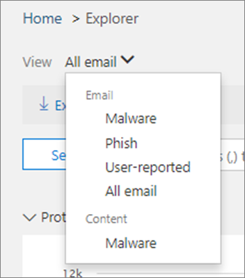

# 查找并调查 Office 365 中提供的恶意电子邮件Find and investigate malicious email that was delivered in Office 365

[Office 365 高级威胁防护](office-365-atp.md)使您能够调查让用户面临风险的活动, 并采取措施来保护您的组织。[Office 365 Advanced Threat Protection](office-365-atp.md) enables you to investigate activities that put your users at risk and take action to protect your organization. 例如, 如果您是组织的安全团队的一部分, 则可以查找并调查传递给用户的可疑电子邮件。For example, if you are part of your organization's security team, you can find and investigate suspicious email messages that were delivered to your users. 可以使用[威胁资源管理器 (或实时检测)](threat-explorer.md)执行此操作。You can do this by using [Threat Explorer (or real-time detections)](threat-explorer.md).
  
## 开始之前 .。。Before you begin...

请确保满足以下要求：Make sure that the following requirements are met:
  
- 您的组织具有[Office 365 高级威胁防护](office-365-atp.md), 并将[许可证分配给用户](https://docs.microsoft.com/en-us/office365/admin/subscriptions-and-billing/assign-licenses-to-users)。Your organization has [Office 365 Advanced Threat Protection](office-365-atp.md) and [licenses are assigned to users](https://docs.microsoft.com/en-us/office365/admin/subscriptions-and-billing/assign-licenses-to-users).
    
- 为你的组织启用了[Office 365 审核日志记录](turn-audit-log-search-on-or-off.md)。[Office 365 audit logging](turn-audit-log-search-on-or-off.md) is turned on for your organization. 
    
- 您的组织具有为反垃圾邮件、反恶意软件、反网络钓鱼等定义的策略。Your organization has policies defined for anti-spam, anti-malware, anti-phishing, and so on. 请参阅防御[Office 365 中的威胁](protect-against-threats.md)。See [Protect against threats in Office 365](protect-against-threats.md).
    
- 您是 Office 365 全局管理员, 或者您具有安全管理员或在安全&amp;合规中心中分配的搜索和清除角色。You are an Office 365 global administrator, or you have either the Security Administrator or the Search and Purge role assigned in the Security &amp; Compliance Center. 请参阅[Office 365 安全&amp;合规中心中的权限](permissions-in-the-security-and-compliance-center.md)。See [Permissions in the Office 365 Security &amp; Compliance Center](permissions-in-the-security-and-compliance-center.md).
    
## 处理可疑电子邮件Dealing with suspicious emails

恶意攻击者可能会向你的用户发送邮件, 以尝试对其凭据进行网络钓鱼并获取对公司机密的访问权限!Malicious attackers may be sending mail to your users to try and phish their credentials and gain access to your corporate secrets! 为避免这种情况, 应使用 Office 365 中的威胁防护服务, 包括[Exchange Online protection](eop/exchange-online-protection-overview.md)和[高级威胁防护](office-365-atp.md)。To prevent this, you should use the threat protection services in Office 365, including [Exchange Online Protection](eop/exchange-online-protection-overview.md) and [Advanced Threat Protection](office-365-atp.md). 但是, 有时攻击者可能会向包含 URL 的用户发送邮件, 并在稍后使该 URL 指向恶意内容 (恶意软件等)。However, there are times when an attacker could send mail to your users containing a URL and only later on make that URL point to malicious content (malware, etc.). 

或者, 您可能会发现您的组织中的某个用户已受到威胁, 而该用户受到威胁时, 攻击者使用该帐户向公司中的其他用户发送电子邮件。Alternately, you may realize too late that a user in your organization has been compromised, and while that user was compromised, an attacker used that account to send email to other users in your company. 在清理这两个方案的过程中, 您可能需要从用户收件箱中删除电子邮件。As part of cleaning up both of these scenarios, you may want to remove email messages from user inboxes. 在这种情况下, 您可以利用[威胁浏览器 (或实时检测)](threat-explorer.md)来查找和删除这些电子邮件!In situations like these, you can leverage [Threat Explorer (or real-time detections)](threat-explorer.md) to find and remove those email messages!

## 在执行操作后, 重新路由的电子邮件位于何处Where re-routed emails are located after actions are taken

那么, 在哪里有问题的电子邮件, 以及哪些工具可帮助调查人员了解他们会怎么办？So where do problem emails go, and what tools help investigators understand what happened to them? 威胁资源管理器字段报告可帮助管理员解码问题电子邮件事件的信息。Threat Explorer fields report information that will help Admins decode problem email events.

### 查看电子邮件头并下载电子邮件正文View the email headers and download the email body

电子邮件**头预览和下载电子邮件正文**是威胁资源管理器中可用的有用的电子邮件威胁管理功能。**Email header preview, and download of the email body** are helpful email threat management features available in Threat Explorer. 管理员将能够分析和下载邮件头和电子邮件的威胁。Admins will be able to analyse and download headers and emails for threats. 使用此功能的访问权限由基于角色的访问控制 (RBAC) 控制, 以降低用户电子邮件内容泄露的风险。Access to use this feature is controlled by roles-based access control (RBAC), to reduce the risk of exposure of user email contents.

必须将名为 "Preview" 的新*角色*添加到另一个 Office 365 角色组 (例如, 在 sec 操作 (或 sec 管理员) 中, 以授予在所有电子邮件视图中下载邮件和预览邮件头的功能。A new *role*, called 'Preview' must be added into another Office 365 role group (for example into sec operations, or sec admin) to grant the ability to download mails and preview headers in all-emails view.

若要查看包含您的电子邮件下载和电子邮件头预览选项的浮出控件:To see the flyout with your email download and email header preview options: 

1. 请转[https://protection.office.com](https://protection.office.com)到使用 Office 365 的工作或学校帐户登录并登录。Go to [https://protection.office.com](https://protection.office.com) and sign in using your work or school account for Office 365. 这会将您带到&amp;安全合规中心。This takes you to the Security &amp; Compliance Center. 
    
2. 在左侧导航中, 选择 "**威胁管理** \> **资源管理器**"。In the left navigation, choose **Threat management** \> **Explorer**.

3. 单击 "威胁资源管理器" 表中的主题。Click on a subject in the Threat Explorer table.

这将打开浮出控件, 同时定位页眉预览和电子邮件下载链接。This will open the flyout, where both header preview and email download links are positioned.

> [!IMPORTANT]
> 同时使用后面的表。Use both the tables that follow together. 一种方式告诉您必需的 RBAC, 另一个是应在其中授予权限的位置。One tells you the RBAC required, the other, the location where rights should be granted.

|活动Activity  |具有访问权限的 RBAC new-rolegroupRBAC rolegroup with access |需要 "预览" 角色？'Preview' role needed?  |
|---------|---------|---------|
|使用威胁浏览器 (和实时检测) 分析威胁Use Threat Explorer (and real-time detections) to analyze threats     |  Office 365 全局管理员,Office 365 Global Administrator,  安全管理员、Security Administrator,   安全读者Security Reader      | 否No   |
|使用威胁浏览器 (和实时检测) 查看电子邮件的邮件头, 以及预览和下载隔离的电子邮件Use Threat Explorer (and real-time detections) to view headers for emails as well as preview and download quarantined emails    |     Office 365 全局管理员,Office 365 Global Administrator,   安全管理员、Security Administrator,  安全读者Security Reader    |       否No  |
|使用威胁浏览器查看邮件头并下载传递给邮箱的电子邮件Use Threat Explorer to view headers and download emails delivered to mailboxes     |      Office 365 全局管理员,Office 365 Global Administrator,  安全管理员、Security Administrator,  安全读者、Security Reader,   预览Preview    |   是Yes      |

 

|RBAC new-rolegroupRBAC rolegroup  |将用户分配到的位置Where users are assigned to them  |
|---------|---------|
| 全局管理员Global Admin   | Office 365 管理中心Office 365 Admin Center        |
| 安全管理员Security Admin      |    安全与合规中心Security & Compliance Center     |
| 安全读者Security Reader   |    安全与合规中心Security & Compliance Center     |
|      |    安全与合规中心Security & Compliance Center     |

> [!CAUTION]
> 请记住, "预览" 是一个角色, 而不是一个 new-rolegroup, 并且必须在随后将该角色添加到 New-rolegroup 中。Remember, 'Preview' is a role and not a rolegroup and that role must be added to a Rolegroup afterwards.

> [!IMPORTANT]
> 此功能不会显示在用户邮箱中从未找到的电子邮件, 如果删除电子邮件或传递失败, 则可能会发生这种情况。This capability doesn't show up for emails that were never found in a user's mailbox, which can happen if an email was dropped or its delivery failed. 对于从用户邮箱中删除电子邮件的情况, 管理员将看到涉及 "找不到邮件" 的错误。For cases when emails were deleted from users' mailboxes, admins will see an  error mentioning 'Mail not found'.

### 检查传递操作和位置Check the delivery action and location

威胁资源管理器实时检测已在 "传递" 状态下添加了 "传递操作" 和 "送达位置" 字段。Threat Explorer real-time detections has added the Delivery Action and Delivery Location fields in the place of Delivery Status. 这将使您的电子邮件土地的更完整的了解。This results in a more complete picture of where your emails land. 此更改的目标部分是使搜索更易于进行安全操作人员, 但最终结果是了解问题电子邮件的位置。Part of the goal of this change is to make hunting easier for Security Ops people, but the net result is knowing the location of problem emails at a glance.

传递状态现已分为两列:Delivery Status is now broken out into two columns:

- **传递操作**-此电子邮件的状态是什么？**Delivery action** - What is the status of this email?
- **送达位置**-此电子邮件的路由结果**Delivery location** - Where was this email routed as a result?

传递操作是由于现有策略或检测而导致对电子邮件执行的操作。Delivery action is the action taken on an email due to existing policies or detections. 以下是电子邮件可能执行的操作:Here are the possible actions an email can take:

- **传递**–将电子邮件传递到用户的收件箱或文件夹, 用户可以直接访问它。**Delivered** – email was delivered to inbox or folder of a user and the user can directly access it.
- **Junked** –将电子邮件发送到用户的 "垃圾邮件" 文件夹或 "已删除" 文件夹, 并且用户可以访问其 "垃圾邮件" 或 "已删除" 文件夹中的电子邮件。**Junked** – email was sent to either user’s junk folder or deleted folder, and the user has access to emails in their Junk or Deleted folder.
- 已**阻止**–任何已隔离、失败或已丢弃的电子邮件。**Blocked** – any emails that's quarantined, that  failed, or was dropped. 用户完全无法访问它!This is completely inaccessible by the user!
- **已替换**–所有恶意附件都被替换为 .txt 文件的电子邮件, 这些文件的状态为 "恶意附件"。**Replaced** – any email where malicious attachments are replaced by .txt files that state the attachment was malicious.
 
"送达位置" 显示运行送达后的策略和检测结果。Delivery location shows the results of policies and detections that run post-delivery. 它已链接到传递操作。It's linked to a Delivery Action. 添加此字段是为了深入了解在发现问题邮件时所采取的操作。This field was added to give insight into the action taken when a problem mail is found. 以下是送达位置的可能值:Here are the possible values of delivery location:

- **收件箱或文件夹**–电子邮件位于收件箱或文件夹中 (根据您的电子邮件规则)。**Inbox or folder** – The email is in inbox or a folder (according to your email rules).
- **本地或外部**–邮箱在云上不存在, 但在本地。**On-prem or external** – The mailbox doesn’t exist on cloud but is on -premises.
- **垃圾邮件文件夹**–在用户的 "垃圾邮件" 文件夹中的电子邮件。**Junk folder** – The email in in the Junk folder of a user.
- "**已删除**邮件" 文件夹–用户的 "已删除邮件" 文件夹中的电子邮件。**Deleted items folder** – The email in the Deleted items folder of a user.
- **隔离**–隔离中的电子邮件, 并且不在用户的邮箱中。**Quarantine** – The email in quarantine, and is not in a user’s mailbox.
- **失败**–电子邮件无法访问邮箱。**Failed** – The email failed to reach the mailbox.
- **丢弃**–电子邮件在邮件流中的某个位置丢失。**Dropped** – The email gets lost somewhere in the Mailflow.

### 查看你的电子邮件的日程表View the timeline of your email
  
 **电子邮件日程表**威胁资源管理器中的另一个字段也会 ake 对管理员更易于搜寻。**Email Timeline** another field in Threat Explorer will also ake hunting easier for admins. 在电子邮件中同时发生多个事件时, 在电子邮件上发生多个事件时, 或在电子邮件上的同一时间段内发生多个事件时, 不需要花费宝贵的时间检查电子邮件可能已丢失的时间, 而是在调查事件时使用。Instead of spending valuable time checking where the email might have gone, when, while investigating an event, when multiple events happen at, or close to, the same time on an email, those events will show up in a timeline view. 将在 "*特殊操作*" 列中捕获对您的邮件执行传递后发生的一些事件。Some events that happen post-delivery to your mail will be captured in the '*Special action*' column. 将邮件的时间线中的信息与对邮件传递后执行的特殊操作组合在一起, 管理员可以深入了解策略和威胁处理 (例如邮件路由的位置, 在某些情况下, 在某些情况下, 最终评估是什么)。Combining  information from the timeline of the mail with the special action taken on the mail post-delivery gives admins insight into policies and threat handling (such as where the mail was routed, and, in some cases, what the final assessment was).

## 查找并删除已传递的可疑电子邮件Find and delete suspicious email that was delivered

> [!TIP]
> 威胁资源管理器 (有时称为资源管理器) 是一种功能强大的报告, 可用于多种用途, 如查找和删除邮件、标识恶意电子邮件发件人的 IP 地址或启动事件以进行进一步调查。Threat Explorer (sometimes called Explorer), is a powerful report that can serve multiple purposes, such as finding and deleting messages, identifying the IP address of a malicious email sender, or starting an incident for further investigation. 下面的过程重点介绍如何使用资源管理器查找和删除收件人邮箱中的恶意电子邮件。The following procedure focuses on using Explorer to find and delete malicious email from recipients mailboxes.

若要查看对前一个传递状态字段的更改 (现在为传递操作和送达位置), 请执行以下操作:To see the changes to the former Delivery Status field (now Delivery Action and Delivery Location): 

1. 请转[https://protection.office.com](https://protection.office.com)到使用 Office 365 的工作或学校帐户登录并登录。Go to [https://protection.office.com](https://protection.office.com) and sign in using your work or school account for Office 365. 这会将您带到&amp;安全合规中心。This takes you to the Security &amp; Compliance Center. 
    
2. 在左侧导航中, 选择 "**威胁管理** \> **资源管理器**"。In the left navigation, choose **Threat management** \> **Explorer**.

您可能会注意到此图形中的新 "特殊操作" 列。You may notice the new 'Special actions' column in this graphic. 此功能旨在告诉管理员处理电子邮件的结果。This feature is aimed at telling admins the outcome of processing an email. 在威胁浏览器的*电子邮件日程表*结束时, 可能会更新特殊操作, 这是旨在使求职体验更好地用于管理员的新功能。Special actions may be updated at the end of Threat Explorer's *email timeline*, which is a new feature aimed at making the hunting experience better for admins.

电子邮件日程表在随机时减少, 因为检查不同位置的时间较少, 以尝试了解自电子邮件到达后发生的事件。Email timeline cuts down on randomization because there is less time spent checking different locations to try to understand events that happened since the email arrived. 当电子邮件上的多个事件发生时, 或在同一时间结束时, 这些事件将显示在 "日程表" 视图中。When multiple events happen at, or close to, the same time on an email, those events will show up in a timeline view. 将在 "特殊操作" 列中捕获到您的邮件的送达后发生的一些事件。Some events that happen post-delivery to your mail will be captured in the 'Special actions' column. 将该邮件的*电子邮件时间线*中的信息与邮件投递后所执行的*特殊操作*组合在一起, 管理员可以了解其策略的工作原理, 其中邮件最后是路由的, 在某些情况下, 在某些情况下, 最终评估为。Combining the information from the *email timeline* of that mail with the *Special actions* taken on the mail post-delivery will give admins insight into how their policies work, where the mail was finally routed, and, in some cases, what the final assessment was. 可以在与传递操作和传递位置相同的位置访问 "特殊操作" 列, 但若要查看电子邮件日程表, 请执行以下操作:The Special actions column can be accessed in the same place as Delivery action and Delivery location, but to see an email timeline:

1. 单击电子邮件的主题。Click on the subject of the email.
2. 在出现的面板上, 单击 "*电子邮件日程表*"。On the panel that appears, click *Email timeline*. (它将显示在面板上的其他标题中, 如 "摘要" 或 "详细信息")。(It will appear among other headings on the panel like 'Summary' or 'Details', et cetera.)

打开电子邮件日程表后, 您应该会看到一个表, 告诉您该邮件的送达事件, 或者, 如果没有针对该电子邮件的进一步事件, 则会看到原始传递的单个事件, 该事件将声明*阻止*的结果。带有类似*网络钓鱼*的结论。Once you've opened the email timeline, you should see a table that tells you the post-delivery events for that mail, or, in the case of no further events for the email, you should see a single event for the original delivery that will state a result like *Blocked* with a verdict like *Phish*. 该选项卡还具有导出整个电子邮件时间线的选项, 这将导出该选项卡上的所有详细信息, 以及有关电子邮件的详细信息 (如主题、发件人、收件人、网络和邮件 ID 等)。The tab also has the option to export the entire email timeline, and this will export all the details on the tab and details on the email (things like Subject, Sender, Recipient, Network, and Message ID).

3. 在 "视图" 菜单中, 选择 "**所有电子邮件**"。In the View menu, choose **All email**. 
  
4. 请注意报告中显示的标签, 如 "已**交货**"、"**未知**" 或 "已**传递到垃圾邮件**"。Notice the labels that appear in the report, such as **Delivered**, **Unknown**, or **Delivered to junk**.  (根据对组织的电子邮件执行的操作, 可能会看到其他标签, 如 "已**阻止**" 或 "**已替换**"。)(Depending on the actions that were taken on email messages for your organization, you might see additional labels, such as **Blocked** or **Replaced**.)
    
5. 在报告中, 选择 "已**传递**" 以仅查看在用户收件箱中结束的电子邮件。In the report, choose **Delivered** to view only emails that ended up in users' inboxes. 
  
6. 在图表下方, 查看图表下方的**电子邮件**列表。Below the chart, review the **Email** list below the chart. 
  
7. 在列表中, 选择一个项目以查看有关该电子邮件的更多详细信息。In the list, choose an item to view more details about that email message. 例如, 您可以单击 "主题" 行来查看有关发件人、收件人、附件和其他类似电子邮件的信息。For example, you can click the subject line to view information about the sender, recipients, attachments, and other similar email messages. 
  
8. 查看有关电子邮件的信息后, 选择列表中的一个或多个项目以激活 **+ 操作**。After viewing information about email messages, select one or more items in the list to activate **+ Actions**.
    
9. 使用 **+ 操作**列表应用操作, 例如**移到 "已删除**邮件"。Use the **+ Actions** list to apply an action, such as **Move to deleted** items. 这将从收件人邮箱中删除所选邮件。This will delete the selected messages from the recipients' mailboxes. 
  
## 相关主题Related topics

[Office 365 高级威胁防护计划2Office 365 Advanced Threat Protection Plan 2](office-365-ti.md)
  
[防御 Office 365 中的威胁Protect against threats in Office 365](protect-against-threats.md)
  
[查看 Office 365 高级威胁防护报告View reports for Office 365 Advanced Threat Protection](view-reports-for-atp.md)
  

