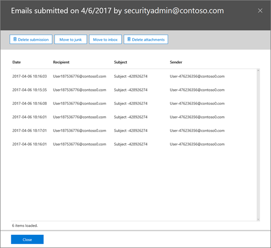

# 使用 office 365 威胁调查和响应功能保持 office 365 用户安全

## 概述

您是否知道您的 Office 365 用户受攻击或更糟的威胁？ 知道如何缓解和恢复面向用户的攻击？ 您是否知道您可以使用 Office 365 中已有的安全功能完全完成此操作？ 
  
[office 365 威胁调查和响应](office-365-ti.md)是 office 365 E5 订阅中包含的一系列功能 (作为 office 365 高级威胁防护计划2的一部分)。 Office 365 威胁调查和响应功能已帮助 Microsoft IT 将社会工程活动的平均解决时间降低了 80%, 并将每月的大小写提高了 200%, 与前两个季度相比! 

> [!IMPORTANT]
> 威胁调查和响应功能 (以前称为 office 365 威胁智能) 现在是 office 365 高级威胁防护计划2的一部分, 以及其他威胁防护功能。 若要了解详细信息, 请参阅[office 365 高级威胁防护计划和定价](https://products.office.com/exchange/advance-threat-protection)以及[Office 365 高级威胁防护服务说明](https://docs.microsoft.com/office365/servicedescriptions/office-365-advanced-threat-protection-service-description)。
  
我们最近添加了新功能, 可帮助改进检测和恢复威胁的方式! 下面简单介绍了更新后的威胁调查和响应功能如何提高效率。
  
## 检测入侵和威胁

[浏览器](use-explorer-in-security-and-compliance.md)(也称为 "威胁浏览器") 可帮助安全管理员和分析师识别和理解企业中的活动威胁, 因为看似无害的用户配置 (如安全) 可能会规避最复杂的安全设置发件人白名单。 资源管理器可帮助 Office 365 全局或安全管理员快速确定用户是否已被威胁 (如恶意软件或网络钓鱼诈骗) 所危害。 这有助于确定哪些用户最面临威胁的风险以及必需的响应的优先级。 
  
资源管理器还可帮助管理员导航用户和邮件之间的关系。 知道有误的特定邮件吗？ 搜索它以查看哪些用户收到了邮件, 然后按照一系列事件进行操作, 并查看这些用户接下来的操作。

如果尚不具有这些 capabilties, 请[立即试用](https://aka.ms/tryo365threatintel3)! 并[了解有关 Office 365 威胁调查和响应的详细信息](https://aka.ms/readmoreabouto365threatintel)。
  

  
## 快速缓解威胁并从威胁中恢复

一旦安全管理员发现了其租户中发生可疑或恶意的问题, 他们就可以使用**事件框架**快速包含和响应该威胁。 通过单击对不需要的邮件进行分组并快速删除用户邮箱中的电子邮件。 
  
 **更新:** 我们已添加了直接从事件框架中删除 (软删除或硬删除) 电子邮件的功能。 以前的管理员只能将邮件移动到用户的垃圾邮件文件夹, 用户可以在那里恢复项目。 使用新的已发布的删除功能, 现在可以确保永久删除恶意或不需要的邮件。 
  
如果您还没有这些功能, 请[立即试用](https://aka.ms/tryo365threatintel3)! 并[了解有关 Office 365 威胁调查和响应功能的详细信息](https://aka.ms/readmoreabouto365threatintel)。
  

  
## 利用 Microsoft 的威胁遥测

Office 365 威胁调查和响应功能使用 Microsoft 智能安全图形中的数据提供支持。 graph 从 1000000000 Windows 设备、450000000000每月 Azure 登录和 400000000000 Office 365 中的每月电子邮件获取最新的威胁信号。 这一无与伦比的威胁信号是为管理员和安全分析员提供了对影响其组织的威胁的完整视图的客户租户的广泛可见性。 
  
   
## 为什么要使用 Office 365 威胁调查和响应功能？

Gartner 估计在2017中仅限 $ 90B 用在 cybersecurity 上。 Sid Deshpande (Gartner 的主要研究分析师) 的报价如下所示: "业界转向检测和响应的方式 .。。 发送清除阻止的 futile, 除非将其绑定到检测和响应功能。 威胁 investigtion 和响应是每个企业的一系列服务的关键组成部分, 可作为独立服务或作为 Office 365 E5 的一部分使用。
  
## 接下来做什么

- 有关此录制的会话中的 Office 365 威胁调查和响应功能的详细信息, 请参阅以下内容:[使用 Office 365 保持在 Cyberattacks 之前](https://myignite.microsoft.com/videos/53723)
    
- [立即试用 office 365 威胁调查和响应功能, 或立即](https://aka.ms/tryo365threatintel3)开始你的 office E5 试用版! 
    

