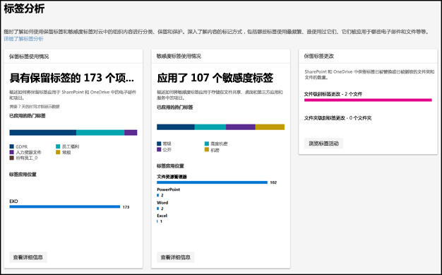
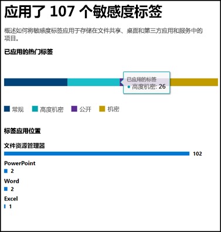
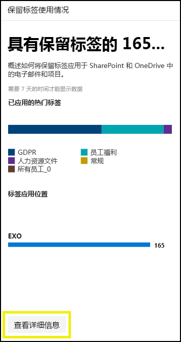
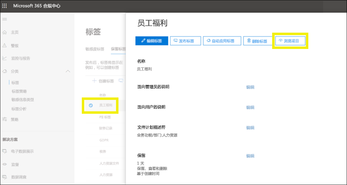
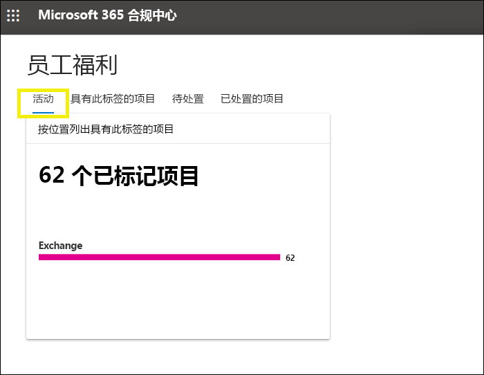
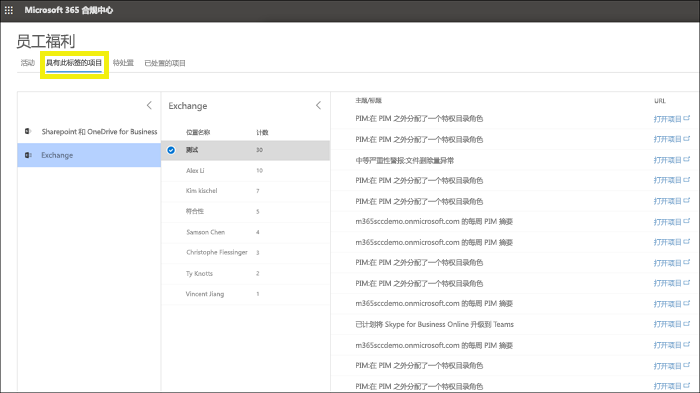

# 使用标签分析查看标签使用情况

创建保留标签和敏感度标签后，你将希望了解它们如何在租户中使用。 借助 Microsoft 365 合规中心和 Microsoft 365 安全中心中的标签分析，你可以快速查看最常用的标签以及它们的应用位置。

例如，借助标签分析，你可以查看：

- 应用于内容的保留标签和敏感度标签的总数。
- 顶部标签和每个标签应用次数的计数。
- 应用标签的位置和每个位置的计数。
- 更改或删除其保留标签的文件和文件夹的计数。

可以在 [Microsoft 365 合规中心](https://compliance.microsoft.com/labelanalytics)或 [Microsoft 365 安全中心](https://security.microsoft.com/labelanalytics) > “**分类**” > “**标签分析**”中找到标签分析。

## 敏感度标签使用情况

有关敏感度标签使用情况的数据是从 Azure 信息保护的报告中提取的 – 有关详细信息，请参阅 [Azure 信息保护的中央报告](https://docs.microsoft.com/zh-CN/azure/information-protection/reports-aip)。

请注意，Azure 信息保护报告的[先决条件](https://docs.microsoft.com/zh-CN/azure/information-protection/reports-aip#prerequisites-for-azure-information-protection-analytics)也适用于 Microsoft 365 合规中心和 Microsoft 365 安全中心中敏感度标签上的标签分析。 例如，你需要包含 Log Analytics 的 Azure 订阅，因为这些报告是将信息保护审核事件从 Azure 信息保护客户端和扫描程序发送到基于 Azure Log Analytics 服务的集中位置的结果。

对于敏感度标签用使用情况法：

- 该数据中没有延迟。 这是实时报告。
- 若要查看每个顶部标签的计数，请指向条形图，然后阅读显示的工具提示。
- 该报告显示每个应用应用敏感度标签的位置（而每个位置都显示保留标签）。

## 保留标签使用情况

此报告可快速查看顶部标签的内容及其应用位置。 有关如何标记 SharePoint 和 OneDrive 中内容的详细信息，请参阅[查看文档的标签活动](view-label-activity-for-documents.md)。

对于保留标签使用情况：

- 数据每周汇总一次，因此数据最多可能需要 7 天才能显示在报告中。
- 若要查看每个顶部标签的计数，请指向条形图，然后阅读显示的工具提示。
- 该报告显示每个位置应用保留标签的位置（而每个应用都显示敏感度标签）。
- 对于保留标签，这是租户中所有时间数据的汇总；它没有筛选到特定的日期范围。 相比之下，[标签活动资源管理器](view-label-activity-for-documents.md)仅显示过去 30 天的数据。

## 查看具有特定保留标签的所有内容

从保留标签使用情况报告中，可以快速浏览应用了该标签的所有内容。 （请注意，我们目前正在使用此功能，因此查看所有标记内容所需的步骤更少。）

首先，选择报告底部的“**查看详细信息**”。

然后在右侧窗格中选择保留标签 >“**查看项目**”。

对于该标签，可以选择“**活动**”选项卡以按位置查看具有该标签的项目数。

也可以选择“**具有此标签的项目**”选项卡。然后可以深入了解特定位置：

- 对于 Exchange Online，你会看到一个邮箱列表，其中包含每个邮箱中已标记项目的计数。
- 对于 SharePoint Online 和 OneDrive for Business，你会看到网站集和 OneDrive 帐户的列表，其中包含每个位置中已标记项目的计数。

选择邮箱或站点集时，可以在该位置中查看具有该保留标签的项目的列表。

## 权限

若要查看标签分析，必须在 Azure Active Directory 中为你分配以下角色之一：

- 全局管理员
- 合规性管理员
- 安全管理员
- 安全读者

此外，请注意这些报告使用 Azure Monitor 将数据存储在组织拥有的 Log Analytics 工作区中。 因此，应将用户作为读者添加到包含数据的 Azure 监视工作区 - 有关详细信息，请参阅 [Azure 信息保护分析所需的权限](https://docs.microsoft.com/zh-CN/azure/information-protection/reports-aip#permissions-required-for-azure-information-protection-analytics)。

